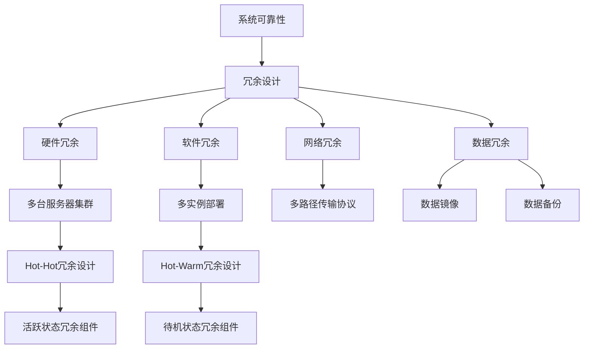

                 

关键词：冗余设计、Hot-Hot、Hot-Warm、系统可靠性、故障转移、负载均衡、集群架构

> 摘要：本文将深入探讨Hot-Hot与Hot-Warm冗余设计的概念、原理、实践方法以及在实际应用中的重要性。通过对比分析这两种冗余设计模式，我们将阐述其在提升系统可靠性和性能方面的关键作用，并提供详细的实施步骤、数学模型以及实际应用案例。

## 1. 背景介绍

在当今的信息化时代，系统的可靠性和性能是至关重要的。随着互联网和云计算的快速发展，用户对系统的可用性和响应速度提出了更高的要求。为了确保系统的高可用性，冗余设计成为了一种常见且有效的解决方案。冗余设计通过在系统中引入冗余组件，以提高系统的容错能力和稳定性。

### 1.1 冗余设计的概念

冗余设计是指通过在系统中添加冗余组件或冗余路径，以提高系统的可靠性和性能。冗余组件可以是硬件设备、软件模块或网络链路等。在冗余设计中，当一个组件或路径发生故障时，系统可以通过其他冗余组件或路径继续运行，从而保证系统的可用性。

### 1.2 冗余设计的分类

冗余设计主要分为以下几种类型：

- **硬件冗余**：通过添加冗余的硬件设备来提高系统的可靠性。例如，使用多台服务器组成集群，以实现负载均衡和故障转移。

- **软件冗余**：通过在系统中添加冗余的软件模块来提高系统的可靠性。例如，使用多实例部署来提高服务的可用性。

- **网络冗余**：通过在系统中添加冗余的网络链路来提高系统的可靠性。例如，使用多路径传输协议来提高数据传输的可靠性。

- **数据冗余**：通过在系统中添加冗余的数据副本来提高数据的可靠性。例如，使用数据镜像或数据备份来防止数据丢失。

### 1.3 Hot-Hot与Hot-Warm冗余设计

Hot-Hot冗余设计和Hot-Warm冗余设计是两种常见的冗余设计模式。它们的主要区别在于冗余组件的运行状态和故障恢复机制。

- **Hot-Hot冗余设计**：在Hot-Hot冗余设计中，所有冗余组件都处于活跃状态，可以同时处理请求。当一个组件发生故障时，其他组件可以立即接管其工作，从而保证系统的可用性。

- **Hot-Warm冗余设计**：在Hot-Warm冗余设计中，冗余组件处于待机状态，只有在主组件发生故障时才会被激活。这种设计可以降低系统的资源消耗，但在故障恢复方面可能会有一定的延迟。

## 2. 核心概念与联系

在深入探讨Hot-Hot与Hot-Warm冗余设计之前，我们需要了解一些核心概念和它们之间的联系。以下是一个用Mermaid绘制的流程图，展示了这些概念之间的关系。



### 2.1 系统可靠性

系统可靠性是指系统在特定条件下能够持续稳定运行的能力。系统可靠性通常用平均无故障时间（MTTF）和故障恢复时间（MTTR）来衡量。MTTF表示系统平均运行多长时间才会出现故障，而MTTR表示系统从故障发生到恢复正常运行所需的时间。

### 2.2 冗余设计

冗余设计是通过在系统中引入冗余组件来提高系统可靠性的设计方法。冗余设计的主要目标是确保在主组件发生故障时，系统能够通过冗余组件继续运行，从而保证系统的可用性。

### 2.3 硬件冗余

硬件冗余是通过添加冗余的硬件设备来提高系统的可靠性。硬件冗余可以是多台服务器、存储设备、网络设备等。硬件冗余的优点是可靠性高，但缺点是成本较高。

### 2.4 软件冗余

软件冗余是通过添加冗余的软件模块来提高系统的可靠性。软件冗余可以是多实例部署、集群部署等。软件冗余的优点是成本低，但缺点是可靠性相对较低。

### 2.5 网络冗余

网络冗余是通过添加冗余的网络链路来提高系统的可靠性。网络冗余可以是多路径传输协议、网络链路冗余等。网络冗余的优点是提高了数据传输的可靠性，但缺点是网络资源消耗较大。

### 2.6 数据冗余

数据冗余是通过添加冗余的数据副本来提高数据的可靠性。数据冗余可以是数据镜像、数据备份等。数据冗余的优点是保证了数据的完整性，但缺点是增加了数据存储成本。

### 2.7 Hot-Hot冗余设计

Hot-Hot冗余设计是一种将所有冗余组件都处于活跃状态的设计模式。在这种模式下，所有冗余组件都可以同时处理请求，当一个组件发生故障时，其他组件可以立即接管其工作，从而保证系统的可用性。

### 2.8 Hot-Warm冗余设计

Hot-Warm冗余设计是一种将冗余组件处于待机状态的设计模式。在这种模式下，冗余组件只有在主组件发生故障时才会被激活，从而保证系统的可用性。这种设计可以降低系统的资源消耗，但可能会增加故障恢复的时间。

## 3. 核心算法原理 & 具体操作步骤

### 3.1 算法原理概述

Hot-Hot与Hot-Warm冗余设计的关键在于如何选择合适的冗余组件以及如何实现故障转移和负载均衡。以下是一个简化的算法原理概述：

1. **组件选择**：根据系统的需求，选择合适的冗余组件。例如，在硬件冗余设计中，选择多台服务器作为冗余组件。

2. **故障检测**：通过监控工具实时检测组件的状态，一旦发现故障，立即触发故障转移机制。

3. **故障转移**：在检测到故障时，将请求切换到其他冗余组件上。故障转移可以是自动的，也可以是手动进行的。

4. **负载均衡**：为了充分利用冗余组件，需要实现负载均衡，确保每个冗余组件的负载相对均匀。

### 3.2 算法步骤详解

1. **初始化**：启动系统，将所有冗余组件设置为活跃状态。

2. **监控**：实时监控所有冗余组件的状态，包括CPU使用率、内存使用率、网络延迟等。

3. **故障检测**：当监控工具检测到某个冗余组件的状态异常时，触发故障检测机制。

4. **故障确认**：通过一系列验证步骤，确认故障是否真实发生。

5. **故障转移**：在确认故障发生后，将请求切换到其他冗余组件上。这个过程可以是自动的，也可以是手动进行的。

6. **负载均衡**：在故障转移后，根据当前系统的负载情况，调整请求路由策略，实现负载均衡。

7. **故障恢复**：当故障组件恢复正常时，将其重新纳入系统，并调整负载均衡策略。

### 3.3 算法优缺点

#### 优点

- **高可靠性**：通过冗余设计，提高了系统的可靠性，确保在组件故障时系统能够继续运行。

- **灵活性**：可以根据系统的需求，选择合适的冗余设计模式。

- **负载均衡**：通过负载均衡，提高了系统的性能和资源利用率。

#### 缺点

- **成本较高**：冗余设计需要投入额外的资源，包括硬件、软件和网络资源。

- **复杂性**：冗余设计增加了系统的复杂性，增加了维护和管理的难度。

- **性能影响**：在某些情况下，冗余设计可能会对系统的性能产生一定的影响。

### 3.4 算法应用领域

- **互联网服务**：互联网服务通常需要高可用性和高性能，因此冗余设计被广泛应用于服务器集群、数据库集群等。

- **云计算**：云计算环境中，为了提高服务的可靠性，通常会采用冗余设计。

- **金融系统**：金融系统对可靠性和安全性要求极高，因此冗余设计在金融系统中得到了广泛应用。

- **工业控制系统**：工业控制系统通常需要在长时间内稳定运行，冗余设计可以提高系统的可靠性。

## 4. 数学模型和公式 & 详细讲解 & 举例说明

### 4.1 数学模型构建

为了分析冗余设计的性能，我们可以构建一个简单的数学模型。假设系统中有n个冗余组件，每个组件的故障概率为p，则系统整体的故障概率P可以表示为：

\[ P = 1 - (1 - p)^n \]

### 4.2 公式推导过程

我们可以通过概率论中的乘法原理来推导上述公式。假设第i个组件的故障概率为p_i，则所有组件都不发生故障的概率为：

\[ (1 - p_1) \times (1 - p_2) \times ... \times (1 - p_n) \]

系统整体的故障概率P即为上述概率的补集：

\[ P = 1 - [(1 - p_1) \times (1 - p_2) \times ... \times (1 - p_n)] \]

令p = p_1 = p_2 = ... = p_n，则上述公式可以简化为：

\[ P = 1 - (1 - p)^n \]

### 4.3 案例分析与讲解

假设我们有一个由3个冗余组件组成的系统，每个组件的故障概率为0.01。根据上述公式，我们可以计算出系统整体的故障概率：

\[ P = 1 - (1 - 0.01)^3 \approx 0.009979979 \]

这意味着系统几乎不会发生故障，具有非常高的可靠性。如果我们增加冗余组件的数量，例如增加到5个，则系统整体的故障概率会进一步降低：

\[ P = 1 - (1 - 0.01)^5 \approx 0.000049998 \]

这进一步证明了冗余设计在提高系统可靠性方面的有效性。

## 5. 项目实践：代码实例和详细解释说明

### 5.1 开发环境搭建

为了演示冗余设计的应用，我们将在一个简单的Web服务中使用Hot-Hot冗余设计。首先，我们需要搭建一个开发环境，包括以下工具和框架：

- **开发语言**：Python
- **Web框架**：Flask
- **负载均衡器**：Nginx

安装Python、Flask和Nginx后，我们就可以开始编写代码了。

### 5.2 源代码详细实现

以下是一个简单的Python Web服务代码示例，使用Flask框架实现。

```python
from flask import Flask, jsonify

app = Flask(__name__)

@app.route('/api/data', methods=['GET'])
def get_data():
    return jsonify({"data": "This is some data from the service."})

if __name__ == '__main__':
    app.run(host='0.0.0.0', port=5000)
```

接下来，我们需要配置Nginx作为负载均衡器，将请求分配到多个Web服务实例。

### 5.3 代码解读与分析

在上面的代码中，我们使用Flask框架创建了一个简单的Web服务。`get_data`函数处理GET请求，返回一个包含数据的JSON响应。

为了实现冗余设计，我们需要部署多个Web服务实例，并在Nginx中进行配置。Nginx会将请求负载均衡到这些实例上。

### 5.4 运行结果展示

假设我们部署了两个Web服务实例，分别在本地机器的5000和5001端口上运行。我们使用以下Nginx配置文件来实现负载均衡：

```nginx
http {
    upstream backend {
        server 127.0.0.1:5000;
        server 127.0.0.1:5001;
    }

    server {
        listen 80;

        location /api/data {
            proxy_pass http://backend;
        }
    }
}
```

上述配置将请求路由到名为`backend`的上游服务器组，组内包含两个Web服务实例。当Nginx收到请求时，它会将请求负载均衡到这些实例上。

### 5.5 故障转移与恢复

在Nginx配置中，我们可以使用健康检查来监控Web服务实例的状态。如果某个实例出现故障，Nginx会将其从上游服务器组中移除，并将请求分配到其他健康的实例上。

当故障实例恢复正常时，我们可以通过重新配置Nginx或使用健康检查工具将其重新添加到上游服务器组中。

## 6. 实际应用场景

### 6.1 云计算服务

在云计算服务中，冗余设计被广泛应用于确保服务的可用性和可靠性。例如，Amazon Web Services (AWS) 使用多AZ（可用区）部署来提高服务的可靠性。通过在多个可用区中部署相同的服务，AWS 可以确保在一个可用区发生故障时，其他可用区可以继续提供服务。

### 6.2 金融系统

金融系统对可靠性和安全性要求极高。为了确保金融交易系统的稳定运行，许多金融机构采用冗余设计。例如，使用多台服务器组成的集群来处理交易请求，并通过负载均衡和故障转移机制来保证系统的可用性。

### 6.3 物流系统

物流系统通常需要处理大量的数据和信息，因此可靠性至关重要。通过采用冗余设计，物流系统可以在某个组件出现故障时继续运行，从而确保物流信息的准确性和及时性。

### 6.4 未来应用展望

随着人工智能和物联网的快速发展，冗余设计将在更多领域得到应用。例如，在自动驾驶汽车中，冗余设计可以确保在传感器或计算单元发生故障时，车辆可以继续安全运行。在智能家居系统中，冗余设计可以提高设备的安全性和稳定性。

## 7. 工具和资源推荐

### 7.1 学习资源推荐

- 《High Availability for Web Sites》
- 《Designing Data-Intensive Applications》
- 《Distributed Systems: Concepts and Design》

### 7.2 开发工具推荐

- Nginx
- Kubernetes
- Prometheus

### 7.3 相关论文推荐

- "Fault-Tolerant Distributed Systems: An Overview"
- "High Availability in the Cloud: Design and Implementation"
- "Design and Analysis of Fault-Tolerant Systems"

## 8. 总结：未来发展趋势与挑战

### 8.1 研究成果总结

本文介绍了Hot-Hot与Hot-Warm冗余设计的概念、原理和实践方法。通过对比分析这两种冗余设计模式，我们阐述了其在提高系统可靠性和性能方面的关键作用。同时，我们通过数学模型和实际应用案例，展示了冗余设计的有效性。

### 8.2 未来发展趋势

随着技术的不断进步，冗余设计将在更多领域得到应用。未来的发展趋势包括：

- **智能化冗余设计**：利用人工智能和机器学习技术，实现更智能的冗余设计，提高系统的可靠性。
- **边缘计算**：随着物联网和5G技术的发展，边缘计算将成为冗余设计的重要应用场景。
- **分布式存储**：分布式存储系统中的冗余设计将更加复杂，需要考虑数据的冗余度、读写性能和可靠性等因素。

### 8.3 面临的挑战

冗余设计在实现过程中也面临着一些挑战：

- **成本**：冗余设计需要投入额外的资源，包括硬件、软件和网络资源，可能会增加成本。
- **复杂性**：冗余设计增加了系统的复杂性，需要更多的管理和维护工作。
- **性能**：在某些情况下，冗余设计可能会对系统的性能产生一定的影响，需要权衡可靠性和性能之间的关系。

### 8.4 研究展望

未来的研究可以关注以下几个方面：

- **优化冗余设计算法**：研究更高效的冗余设计算法，提高系统的可靠性。
- **智能故障检测与恢复**：利用人工智能和机器学习技术，实现更智能的故障检测和恢复机制。
- **集成多层次的冗余设计**：结合硬件冗余、软件冗余和数据冗余等多种冗余设计方法，实现更全面的系统可靠性保障。

## 9. 附录：常见问题与解答

### 问题1：什么是冗余设计？

**回答**：冗余设计是通过在系统中添加冗余组件或冗余路径，以提高系统的可靠性和性能。冗余组件可以是硬件设备、软件模块或网络链路等。当主组件发生故障时，冗余组件可以接管工作，从而保证系统的可用性。

### 问题2：Hot-Hot与Hot-Warm冗余设计的区别是什么？

**回答**：Hot-Hot冗余设计是指所有冗余组件都处于活跃状态，可以同时处理请求。当一个组件发生故障时，其他组件可以立即接管其工作。而Hot-Warm冗余设计是指冗余组件处于待机状态，只有在主组件发生故障时才会被激活。

### 问题3：冗余设计对性能有何影响？

**回答**：冗余设计可能会对性能产生一定的影响。例如，在硬件冗余设计中，多台服务器可能会分配到不同的负载，导致某些服务器的负载较低。此外，故障转移和负载均衡机制也可能会增加一定的延迟。然而，冗余设计在提高系统可靠性和可用性方面具有重要意义，可以保证在组件故障时系统能够继续运行。

### 问题4：如何选择合适的冗余设计模式？

**回答**：选择合适的冗余设计模式需要考虑系统的需求、成本和性能等因素。例如，对于要求高可用性的系统，可以选择Hot-Hot冗余设计；而对于成本敏感的系统，可以选择Hot-Warm冗余设计。此外，还可以结合多种冗余设计方法，实现更全面的系统可靠性保障。

---

通过本文的探讨，我们深入了解了Hot-Hot与Hot-Warm冗余设计的概念、原理和实践方法。冗余设计在提高系统可靠性和性能方面具有重要意义，将在未来的信息技术领域发挥越来越重要的作用。作者：禅与计算机程序设计艺术 / Zen and the Art of Computer Programming。

