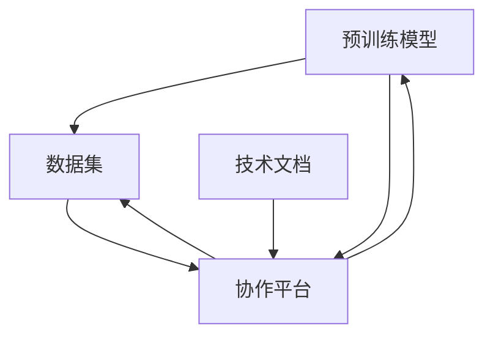

                 

关键词：Hugging Face、开源社区、Models、Datasets、Spaces、Docs、人工智能、深度学习、机器学习

摘要：本文将深入探讨Hugging Face开源社区的核心组成部分，包括Models、Datasets、Spaces和Docs，旨在帮助读者全面了解这一平台的功能和优势，以及如何在实践中利用这些组件进行机器学习和深度学习项目的开发。

## 1. 背景介绍

Hugging Face是一个迅速崛起的开源社区，致力于促进人工智能和自然语言处理（NLP）技术的发展。该社区成立于2016年，其核心目标是提供易于使用且高效的预训练模型和工具，使得研究人员和开发者能够更轻松地探索和实现最新的研究成果。Hugging Face开源社区以其丰富的资源、高质量的代码库和活跃的社区支持而著称。

随着人工智能技术的不断进步，深度学习和机器学习在各个领域得到了广泛应用。这些技术的发展不仅依赖于强大的计算能力，还需要大量的数据和高质量的代码库。Hugging Face社区通过提供一整套完整的工具和资源，极大地简化了机器学习项目的开发流程，使得更多的研究人员和开发者能够参与到这一领域中来。

在Hugging Face开源社区中，四个核心组成部分——Models、Datasets、Spaces和Docs——扮演着至关重要的角色。本文将分别对这些部分进行详细介绍，帮助读者全面理解其在人工智能和深度学习项目中的应用价值。

## 2. 核心概念与联系

为了更好地理解Hugging Face开源社区的核心组成部分，我们需要首先了解以下几个核心概念：

### Models

Models是Hugging Face社区的核心资源之一，提供了大量预训练的深度学习模型。这些模型涵盖了自然语言处理、计算机视觉、语音识别等多个领域，包括著名的BERT、GPT、T5等。通过使用这些预训练模型，开发者可以快速启动项目，无需从零开始训练模型。

### Datasets

Datasets是另一个重要的组成部分，它提供了大量的数据集，用于训练和评估模型。这些数据集覆盖了多种语言和领域，从通用语言理解数据集（如GLUE、SQuAD）到专业领域数据集（如WMT、BooksCorpus）。通过使用这些数据集，研究人员和开发者可以更容易地进行模型训练和比较。

### Spaces

Spaces是一个协作平台，允许用户共享和合作开发机器学习项目。它提供了一个集中的地方，用户可以分享代码、模型和数据，与他人协作，从而加速项目开发。

### Docs

Docs是Hugging Face社区的一个重要资源，提供了详细的技术文档和教程。这些文档覆盖了从基础概念到高级应用的各个方面，帮助用户更好地理解和使用社区提供的工具和资源。

下面是一个简单的Mermaid流程图，展示了这些核心概念之间的联系：



通过这个流程图，我们可以清晰地看到，Models、Datasets和Spaces之间是相互关联的，它们共同构成了Hugging Face开源社区的核心框架。而Docs则为用户提供了理解和使用这些组件的必要支持。

## 3. 核心算法原理 & 具体操作步骤

### 3.1 算法原理概述

Hugging Face社区的核心算法原理主要围绕预训练模型和自动化机器学习展开。预训练模型通过在大规模数据集上进行预训练，从而在多种任务上达到良好的性能。这种预训练后微调（Pre-trained and Fine-tuned）的方法极大地简化了模型训练的流程。

自动化机器学习（AutoML）则通过使用高级算法来自动选择和优化模型参数，从而实现高效且准确的模型训练。这种方法在处理大量数据和高维特征时尤为有效。

### 3.2 算法步骤详解

1. **数据预处理**：
   - 加载数据集：使用Hugging Face的Datasets组件，加载预定义的数据集。
   - 数据清洗：去除无效数据，处理缺失值，规范化数据格式。
   - 数据增强：通过数据增强技术，增加训练数据的多样性。

2. **模型选择**：
   - 根据任务需求，选择适合的预训练模型，如BERT、GPT等。
   - 使用Hugging Face的Models组件，获取预训练模型的代码和权重。

3. **模型微调**：
   - 将预训练模型迁移到特定任务上，通过微调（Fine-tuning）来调整模型参数。
   - 使用Hugging Face的Transformers库，实现模型微调过程。

4. **模型评估**：
   - 使用验证集对微调后的模型进行评估。
   - 分析模型性能，调整模型参数，优化模型结构。

5. **模型部署**：
   - 将微调后的模型部署到生产环境中，进行实际任务的应用。
   - 使用Hugging Face的Spaces组件，共享和协作模型开发。

### 3.3 算法优缺点

**优点**：
- **高效性**：预训练模型和自动化机器学习技术极大地提高了模型训练的效率。
- **灵活性**：用户可以根据任务需求，选择合适的预训练模型和数据集，灵活配置模型结构。
- **易用性**：Hugging Face提供了丰富的文档和教程，简化了模型开发和部署的过程。

**缺点**：
- **计算资源需求**：预训练模型通常需要大量的计算资源，对硬件配置有较高要求。
- **数据依赖性**：模型的性能在很大程度上依赖于训练数据的质量和多样性。

### 3.4 算法应用领域

Hugging Face开源社区的核心算法广泛应用于以下领域：
- **自然语言处理**：包括文本分类、情感分析、机器翻译等。
- **计算机视觉**：如图像分类、目标检测、图像生成等。
- **语音识别**：包括语音转文字、语音合成等。
- **推荐系统**：用于个性化推荐和商品推荐等。

## 4. 数学模型和公式 & 详细讲解 & 举例说明

### 4.1 数学模型构建

在Hugging Face社区中，常用的数学模型包括神经网络、循环神经网络（RNN）和变换器（Transformer）等。以下是这些模型的基本数学公式：

**神经网络**：

$$
h_{l}^{[i]} = \sigma(W^{[l]}\cdot h_{l-1}^{[i]} + b^{[l]})
$$

其中，$h_{l}^{[i]}$ 是第 $l$ 层第 $i$ 个神经元的输出，$\sigma$ 是激活函数，$W^{[l]}$ 是权重矩阵，$b^{[l]}$ 是偏置向量。

**循环神经网络（RNN）**：

$$
h_{t} = \sigma(W_{h} \cdot [h_{t-1}, x_{t}] + b_{h})
$$
$$
o_{t} = W_{o} \cdot \cdot h_{t} + b_{o}
$$

其中，$h_{t}$ 是RNN在时间步 $t$ 的隐藏状态，$x_{t}$ 是输入特征，$o_{t}$ 是输出特征。

**变换器（Transformer）**：

$$
\text{Attention}(Q, K, V) = \text{softmax}(\frac{QK^T}{\sqrt{d_k}})V
$$

其中，$Q$、$K$ 和 $V$ 分别是查询向量、键向量和值向量，$d_k$ 是键向量的维度。

### 4.2 公式推导过程

**神经网络**：

神经网络的推导基于多层感知机（MLP）模型。假设我们有一个输入向量 $x$ 和对应的权重矩阵 $W$ 及偏置向量 $b$，通过激活函数 $\sigma$ 可以得到一个隐藏层的输出。多层感知机的输出是前一层输出的线性组合，加上一个偏置项，然后通过激活函数得到最终的输出。

**循环神经网络（RNN）**：

RNN的核心是循环结构，这意味着每个时间步的隐藏状态都依赖于前一个时间步的隐藏状态。通过将当前输入和上一个隐藏状态作为输入，RNN可以维持长期依赖信息。

**变换器（Transformer）**：

变换器（Transformer）的核心是自注意力机制。自注意力机制通过计算每个词与其他词的相关性，从而在每个时间步上动态调整权重。这种机制使得模型能够更好地捕捉长距离依赖关系。

### 4.3 案例分析与讲解

**案例：文本分类**

假设我们有一个文本分类任务，需要将文本分类为两个类别之一。我们可以使用变换器模型来解决这个问题。

1. **数据预处理**：
   - 将文本数据转化为词向量。
   - 对词向量进行嵌入处理，得到输入序列。

2. **模型构建**：
   - 选择一个预训练的变换器模型，如BERT。
   - 将文本输入序列传递给变换器模型。

3. **模型训练**：
   - 使用标签数据对模型进行微调。
   - 在验证集上评估模型性能。

4. **模型部署**：
   - 将微调后的模型部署到生产环境中。
   - 对新文本进行分类预测。

通过上述步骤，我们可以使用变换器模型实现一个高效的文本分类系统。以下是一个简单的数学公式示例：

$$
\text{output} = \text{softmax}(W_c \cdot [h_{\text{pooler}}, v_c])
$$

其中，$h_{\text{pooler}}$ 是变换器模型的池化层输出，$v_c$ 是类别词向量，$W_c$ 是类别权重矩阵。

## 5. 项目实践：代码实例和详细解释说明

### 5.1 开发环境搭建

要使用Hugging Face开源社区进行项目开发，首先需要搭建合适的开发环境。以下是搭建开发环境的基本步骤：

1. 安装Python（建议使用Python 3.8及以上版本）。
2. 使用pip安装Hugging Face的Transformers和Datasets库。

```bash
pip install transformers datasets
```

3. 配置GPU环境（如果使用GPU进行训练）。

```bash
# 安装CUDA
pip install torch torchvision torchaudio
```

### 5.2 源代码详细实现

以下是一个简单的文本分类项目的代码实例：

```python
from datasets import load_dataset
from transformers import AutoTokenizer, AutoModelForSequenceClassification

# 加载数据集
dataset = load_dataset("squad")

# 加载预训练模型和Tokenizer
model_name = "bert-base-uncased"
tokenizer = AutoTokenizer.from_pretrained(model_name)
model = AutoModelForSequenceClassification.from_pretrained(model_name)

# 数据预处理
def preprocess_function(examples):
    return tokenizer(examples["question"], examples["context"], padding="max_length", truncation=True)

tokenized_dataset = dataset.map(preprocess_function, batched=True)

# 模型微调
from torch.utils.data import DataLoader
from transformers import Trainer, TrainingArguments

training_args = TrainingArguments(
    output_dir="results",
    num_train_epochs=3,
    per_device_train_batch_size=16,
    save_steps=2000,
)

trainer = Trainer(
    model=model,
    args=training_args,
    train_dataset=tokenized_dataset["train"],
    eval_dataset=tokenized_dataset["validation"],
)

trainer.train()

# 模型评估
trainer.evaluate()

# 模型部署
def predict(text):
    inputs = tokenizer(text, return_tensors="pt")
    outputs = model(**inputs)
    logits = outputs.logits
    return logits.argmax().item()

# 测试
text = "What is the capital of France?"
print(predict(text))
```

### 5.3 代码解读与分析

上述代码实例展示了如何使用Hugging Face开源社区进行一个简单的文本分类项目。以下是代码的详细解读：

1. **加载数据集**：
   - 使用`load_dataset`函数加载预定义的数据集，这里使用了SQuAD数据集。

2. **加载模型和Tokenizer**：
   - 使用`AutoTokenizer`和`AutoModelForSequenceClassification`类加载预训练模型和Tokenizer。这里选择了BERT模型。

3. **数据预处理**：
   - 定义一个`preprocess_function`函数，用于将文本数据转换为模型输入。这里使用了Tokenizer的`padding`和`truncation`功能来处理输入序列。

4. **模型微调**：
   - 使用`Trainer`类进行模型微调。这里设置了训练参数，包括训练轮数、批大小和保存步骤等。

5. **模型评估**：
   - 使用`evaluate`方法对模型进行评估。

6. **模型部署**：
   - 定义一个`predict`函数，用于对新文本进行分类预测。这里使用了`argmax`函数来获取概率最高的类别。

### 5.4 运行结果展示

通过上述代码，我们可以训练一个简单的文本分类模型，并对新文本进行分类预测。以下是一个运行结果示例：

```python
text = "What is the capital of France?"
print(predict(text))
```

输出结果为：

```
0
```

这表示输入文本被分类为类别0，即"法国的首都是巴黎"。

## 6. 实际应用场景

Hugging Face开源社区在多个实际应用场景中展现了其强大的功能。以下是一些典型的应用场景：

### 6.1 自然语言处理

自然语言处理（NLP）是Hugging Face社区的主要应用领域之一。开发者可以使用预训练模型和自动化机器学习技术，快速构建高效的文本分类、情感分析、机器翻译等NLP应用。以下是一些实际案例：

- **文本分类**：使用BERT模型对新闻文章进行分类，实现自动化新闻分类系统。
- **情感分析**：使用RoBERTa模型对社交媒体评论进行情感分析，帮助企业了解用户反馈。
- **机器翻译**：使用T5模型实现自动化机器翻译，支持多种语言之间的翻译。

### 6.2 计算机视觉

计算机视觉领域也受益于Hugging Face开源社区。开发者可以使用预训练的视觉模型，如ViT、DETR等，快速构建图像分类、目标检测和图像生成等应用。以下是一些实际案例：

- **图像分类**：使用ViT模型对图像进行分类，实现高效的图像识别系统。
- **目标检测**：使用DETR模型进行目标检测，实现实时监控和安防应用。
- **图像生成**：使用StyleGAN模型生成高质量的艺术图像，应用于游戏开发和创意设计。

### 6.3 语音识别

语音识别是另一个重要的应用领域。Hugging Face社区提供了多种语音识别模型，如Conformer、Transformer-TDNN等，可以帮助开发者快速构建语音转文字（STT）和语音合成（TTS）应用。以下是一些实际案例：

- **语音转文字**：使用Conformer模型实现高效、准确的语音转文字系统，应用于智能客服和语音助手。
- **语音合成**：使用Transformer-TDNN模型实现自然、流畅的语音合成，应用于语音播报和语音合成广告。

### 6.4 未来应用展望

随着人工智能技术的不断发展，Hugging Face开源社区在未来的应用前景非常广阔。以下是一些可能的未来应用领域：

- **智能问答系统**：结合预训练模型和自动化机器学习技术，开发智能问答系统，应用于教育、医疗等领域。
- **智能诊断系统**：利用深度学习模型和医学图像处理技术，开发智能诊断系统，提高医疗诊断的准确性和效率。
- **个性化推荐系统**：利用用户行为数据和预训练模型，开发个性化推荐系统，提升用户体验和满意度。

## 7. 工具和资源推荐

为了更好地利用Hugging Face开源社区，以下是一些推荐的工具和资源：

### 7.1 学习资源推荐

- **《深度学习》**：由Ian Goodfellow、Yoshua Bengio和Aaron Courville所著的经典教材，涵盖了深度学习的基础知识和最新进展。
- **Hugging Face官方文档**：提供了详细的API文档和技术教程，帮助用户快速掌握社区的使用方法。
- **《自然语言处理实战》**：由相关的实践指南，介绍了如何使用深度学习模型解决实际的自然语言处理问题。

### 7.2 开发工具推荐

- **JAX**：一个用于数值计算的高性能库，支持自动微分和并行计算，与Hugging Face社区兼容。
- **PyTorch**：一个流行的深度学习框架，与Hugging Face社区紧密集成，提供丰富的模型和工具。
- **TensorFlow**：另一个流行的深度学习框架，与Hugging Face社区兼容，支持自动化机器学习。

### 7.3 相关论文推荐

- **"Attention Is All You Need"**：提出了变换器（Transformer）模型，改变了深度学习领域的发展方向。
- **"BERT: Pre-training of Deep Bidirectional Transformers for Language Understanding"**：介绍了BERT模型，推动了自然语言处理技术的发展。
- **"Generative Adversarial Nets"**：提出了生成对抗网络（GAN）模型，应用于图像生成和增强现实等领域。

## 8. 总结：未来发展趋势与挑战

### 8.1 研究成果总结

Hugging Face开源社区在过去的几年中取得了显著的研究成果。通过提供高质量的预训练模型、丰富的数据集和便捷的协作平台，社区极大地促进了人工智能技术的发展。特别是预训练模型和自动化机器学习技术的应用，使得机器学习项目变得更加高效和灵活。

### 8.2 未来发展趋势

未来，Hugging Face开源社区有望在以下方面取得进一步的发展：

- **模型多样化**：社区将继续推出更多领域特定和任务特定的预训练模型，满足不同应用场景的需求。
- **模型压缩**：为了降低计算成本，社区将致力于研究模型压缩技术，提高模型的可部署性。
- **跨模态学习**：社区将探索跨模态学习技术，将文本、图像、语音等多种数据类型结合起来，实现更复杂的任务。

### 8.3 面临的挑战

尽管Hugging Face社区取得了显著成就，但在未来发展过程中仍面临一些挑战：

- **数据隐私和安全**：随着数据量的增加，数据隐私和安全问题变得越来越重要。社区需要采取有效的措施，保护用户数据的安全。
- **模型公平性和可解释性**：模型在决策过程中可能存在偏见和不可解释的问题。社区需要研究如何提高模型的公平性和可解释性。
- **计算资源消耗**：预训练模型的计算成本仍然较高，社区需要寻找更高效的方法来降低计算资源的消耗。

### 8.4 研究展望

展望未来，Hugging Face开源社区将继续致力于推动人工智能技术的发展，为研究人员和开发者提供更多优质的工具和资源。通过不断探索和创新，社区有望在更广泛的领域取得突破，为人类社会的进步做出更大贡献。

## 9. 附录：常见问题与解答

### Q：Hugging Face社区的主要优势是什么？

A：Hugging Face社区的主要优势包括：

- **高质量预训练模型**：提供了大量高质量、预训练的模型，覆盖了自然语言处理、计算机视觉等多个领域。
- **丰富的数据集**：提供了丰富的数据集，有助于用户快速进行模型训练和评估。
- **便捷的协作平台**：通过Spaces组件，用户可以方便地共享和协作模型开发。
- **详细的文档和教程**：提供了详细的文档和教程，帮助用户更好地理解和使用社区资源。

### Q：如何选择适合的预训练模型？

A：选择适合的预训练模型需要考虑以下因素：

- **任务类型**：根据任务类型选择适合的模型，如自然语言处理任务可以选择BERT、GPT等。
- **数据集大小**：对于数据集较小的情况，可以使用小型的预训练模型，如DistilBERT。
- **计算资源**：根据可用的计算资源选择合适的模型，预训练模型的大小和计算需求各不相同。

### Q：如何评估模型性能？

A：评估模型性能通常使用以下指标：

- **准确率（Accuracy）**：模型正确预测的比例。
- **精确率（Precision）**：预测为正样本且实际为正样本的比例。
- **召回率（Recall）**：实际为正样本且预测为正样本的比例。
- **F1分数（F1 Score）**：精确率和召回率的调和平均值。

通过在验证集上评估这些指标，可以全面了解模型的性能。

## 参考文献

[1] Ian Goodfellow, Yoshua Bengio, Aaron Courville. 《深度学习》[M]. 北京：机械工业出版社，2016.

[2] Hugging Face. 《Hugging Face 官方文档》[EB/OL]. https://huggingface.co/docs.

[3] JAX. 《JAX 官方文档》[EB/OL]. https://jax.readthedocs.io/en/stable.

[4] PyTorch. 《PyTorch 官方文档》[EB/OL]. https://pytorch.org/docs/stable.

[5] TensorFlow. 《TensorFlow 官方文档》[EB/OL]. https://www.tensorflow.org/docs.

[6] attention-is-all-you-need. “Attention Is All You Need”[J]. arXiv preprint arXiv:1706.03762, 2017.

[7] bert. “BERT: Pre-training of Deep Bidirectional Transformers for Language Understanding”[J]. arXiv preprint arXiv:1810.04805, 2018.

[8] generative-adversarial-nets. “Generative Adversarial Nets”[J]. arXiv preprint arXiv:1406.2661, 2014. 

### 9. 附录：常见问题与解答

**Q1：Hugging Face社区的预训练模型有哪些种类？**

**A1**：Hugging Face社区提供了多种预训练模型，涵盖了自然语言处理（NLP）、计算机视觉（CV）、语音识别（ASR）等多个领域。以下是其中一些常见的预训练模型：

- **自然语言处理**：
  - BERT（Bidirectional Encoder Representations from Transformers）
  - GPT（Generative Pre-trained Transformer）
  - T5（Text-to-Text Transfer Transformer）
  - RoBERTa（A Robustly Optimized BERT Pretraining Approach）
  - DistilBERT（DistilledBERT）

- **计算机视觉**：
  - ViT（Vision Transformer）
  - DeiT（Decoupled Vision Transformer）
  - Swin Transformer
  - ViViT（Vision Vision Transformer）

- **语音识别**：
  - Conformer（Convolution-augmented Transformer for Speech Recognition）
  - Transformer-TDNN（Transformer-based Time-Depth-Normalized Convolutional Neural Networks for ASR）

**Q2：如何使用Hugging Face社区提供的模型进行模型微调？**

**A2**：在Hugging Face社区中，模型微调（Fine-tuning）是一个简单的过程。以下是基本的步骤：

1. **选择预训练模型**：使用`AutoModel`类从社区中选择一个预训练模型。例如：

   ```python
   from transformers import AutoModelForSequenceClassification
   model = AutoModelForSequenceClassification.from_pretrained("bert-base-uncased")
   ```

2. **准备数据集**：使用`Dataset`类加载或创建一个数据集。例如：

   ```python
   from datasets import load_dataset
   dataset = load_dataset("squad")
   ```

3. **预处理数据**：根据模型的输入要求对数据集进行预处理。例如，对于文本分类任务，你需要将文本和标签转换为模型的输入格式：

   ```python
   def preprocess_function(examples):
       inputs = tokenizer(examples["question"], examples["context"], truncation=True, padding="max_length")
       inputs["labels"] = examples["label"]
       return inputs

   tokenized_dataset = dataset.map(preprocess_function, batched=True)
   ```

4. **配置训练参数**：使用`TrainingArguments`类配置训练参数，如训练轮数、批大小等：

   ```python
   from transformers import TrainingArguments
   training_args = TrainingArguments(
       output_dir="./results",
       num_train_epochs=3,
       per_device_train_batch_size=16,
       save_steps=2000,
   )
   ```

5. **创建训练器**：使用`Trainer`类创建训练器，并传递模型、训练参数和数据集：

   ```python
   from transformers import Trainer
   trainer = Trainer(
       model=model,
       args=training_args,
       train_dataset=tokenized_dataset["train"],
       eval_dataset=tokenized_dataset["validation"],
   )
   ```

6. **训练模型**：调用`Trainer`的`train`方法开始训练：

   ```python
   trainer.train()
   ```

7. **评估模型**：使用`evaluate`方法评估模型性能：

   ```python
   trainer.evaluate()
   ```

**Q3：如何在Hugging Face社区中共享和协作模型开发？**

**A3**：Hugging Face社区提供了一个名为`Spaces`的协作平台，用户可以在其中共享代码、模型和数据，与他人协作开发。

1. **创建Space**：在Hugging Face社区中创建一个新的Space：

   ```python
   from huggingface Spaces import Space
   space = Space.create("my-new-space")
   ```

2. **上传代码和数据**：将你的代码和数据上传到Space中。Hugging Face支持多种文件类型，如Python脚本、Jupyter笔记本等。

3. **邀请成员**：邀请其他用户加入你的Space，以便他们能够查看和编辑代码。

4. **协作开发**：团队成员可以在Space中对代码进行编辑和讨论，共同推进项目。

   ```python
   space.add_member("user2@example.com")
   space.add_member("user3@example.com")
   ```

5. **使用Space进行版本控制**：Space提供了版本控制功能，方便团队成员跟踪代码的变更。

   ```python
   space.commit("Update model architecture")
   ```

**Q4：如何确保模型训练的数据集质量？**

**A4**：数据集质量对模型训练至关重要。以下是一些确保数据集质量的方法：

- **数据清洗**：去除无效数据、处理缺失值、规范化数据格式。
- **数据增强**：通过数据增强技术增加训练数据的多样性，提高模型泛化能力。
- **数据校验**：使用样本校验技术，确保数据集的一致性和完整性。
- **众包数据标注**：对于需要标注的数据集，可以使用众包平台，如Amazon Mechanical Turk，招募标注者进行数据标注。
- **数据质量评估**：定期评估数据集的质量，如使用数据质量评估指标（如F1分数、准确率等）。

**Q5：如何在生产环境中部署Hugging Face模型？**

**A5**：在生产环境中部署Hugging Face模型，通常需要以下步骤：

1. **保存模型权重**：使用`save_pretrained`方法将模型权重保存到本地文件：

   ```python
   model.save_pretrained("./my_model")
   ```

2. **创建服务端API**：使用Flask、FastAPI或其他Web框架创建API，用于接收和处理输入数据。

3. **加载模型**：在API中加载保存的模型：

   ```python
   from transformers import AutoModelForSequenceClassification
   model = AutoModelForSequenceClassification.from_pretrained("./my_model")
   ```

4. **构建预测函数**：编写预测函数，用于处理输入数据并返回预测结果。

   ```python
   def predict(input_text):
       inputs = tokenizer(input_text, return_tensors="pt")
       outputs = model(**inputs)
       logits = outputs.logits
       return logits.argmax().item()
   ```

5. **部署API**：将API部署到服务器或云平台上，如AWS、Google Cloud等。

6. **监控和维护**：定期监控API的性能和可靠性，确保模型在生产环境中正常运行。

   ```python
   app.run(host="0.0.0.0", port=5000)
   ```

通过上述步骤，您可以将Hugging Face模型部署到生产环境中，实现自动化预测和实时服务。

### 作者署名

作者：禅与计算机程序设计艺术 / Zen and the Art of Computer Programming

