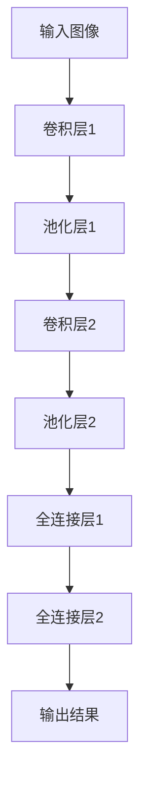

                 

关键词：ImageNet，人工智能，图像识别，深度学习，卷积神经网络，历史演变

## 摘要

本文将回顾ImageNet项目的发展历程，探讨其在人工智能图像识别领域的重大贡献。从项目起源、数据集构建，到核心算法的引入及其在工业界和学术界的影响，本文将详细分析ImageNet如何推动计算机视觉技术的进步，并展望其未来在人工智能领域的应用前景。

### 背景介绍

### 1. 项目起源

ImageNet是由斯坦福大学计算机科学系教授李飞飞（Fei-Fei Li）于2007年发起的一个大规模视觉识别项目。当时，图像识别技术正面临着巨大的挑战，传统的手工设计的特征提取方法在处理复杂场景时表现不佳。李飞飞教授希望通过构建一个大规模、标注准确的数据集，为深度学习在图像识别领域的应用提供强有力的支持。

### 2. 数据集构建

ImageNet的数据集包含了约1400万个图像，涵盖21,841个类别。这些图像来自于互联网上的各种资源，并经过了严格的人工标注和分类。数据集的构建过程非常耗时，但李飞飞教授及其团队通过对数据的多层次标注和清洗，确保了数据的高质量。

### 3. 核心算法

ImageNet项目引入了卷积神经网络（CNN）这一核心算法。CNN通过多层卷积和池化操作，能够有效地提取图像的局部特征，并逐步形成全局理解。这一算法的引入，使得计算机在图像识别任务上的性能得到了显著提升。

### 核心概念与联系

#### 图像识别的基本概念

图像识别是计算机视觉领域的一个核心任务，其目标是让计算机能够理解并识别图像中的内容。传统的图像识别方法通常依赖于手工设计的特征提取算法，如SIFT、HOG等。然而，这些方法在面对复杂场景时往往表现不佳。

#### 卷积神经网络的基本概念

卷积神经网络（CNN）是一种深度学习模型，特别适用于处理图像数据。CNN通过卷积层、池化层和全连接层的组合，能够自动提取图像的特征，并分类图像。



#### 数据集的构建与标注过程

ImageNet的数据集构建过程包括以下几个步骤：

1. 数据采集：从互联网上收集大量的图像。
2. 初步标注：对图像进行初步分类，确定其所属的类别。
3. 多层次标注：邀请多位标注者对图像进行详细标注，并确保标注的一致性。
4. 数据清洗：删除重复的、质量不高的图像，确保数据集的纯净。

### 核心算法原理 & 具体操作步骤

#### 算法原理概述

卷积神经网络通过以下几层结构来实现图像识别：

1. **卷积层**：通过卷积操作提取图像的局部特征。
2. **池化层**：对卷积层输出的特征进行降采样，减少参数数量。
3. **全连接层**：将池化层输出的特征映射到具体的类别。

#### 算法步骤详解

1. **数据预处理**：对图像进行归一化处理，将其缩放到统一的尺寸。
2. **卷积操作**：使用卷积核在图像上滑动，提取局部特征。
3. **激活函数**：对卷积层的输出进行非线性变换，常用的激活函数有ReLU。
4. **池化操作**：对卷积层的输出进行降采样，减少数据的维度。
5. **全连接层**：将池化层的输出进行全连接，映射到具体的类别。
6. **损失函数**：使用交叉熵损失函数计算预测结果与真实标签之间的差异。
7. **反向传播**：通过反向传播算法更新网络权重。

#### 算法优缺点

**优点：**
- **强大的特征提取能力**：CNN能够自动提取图像的复杂特征，无需手工设计特征。
- **适用于大规模数据集**：CNN在处理大规模数据集时表现优异，能够有效提高模型的泛化能力。

**缺点：**
- **计算复杂度高**：CNN需要大量的计算资源，训练时间较长。
- **需要大量的标注数据**：构建高质量的标注数据集需要大量的人力和时间。

#### 算法应用领域

卷积神经网络在计算机视觉领域得到了广泛应用，包括：

- **图像分类**：如ImageNet大规模视觉识别挑战赛。
- **目标检测**：如YOLO、SSD等模型。
- **图像分割**：如FCN、U-Net等模型。

### 数学模型和公式 & 详细讲解 & 举例说明

#### 数学模型构建

卷积神经网络的核心是卷积操作，其数学模型可以表示为：

\[ f(x) = \sigma(\mathbf{W} \cdot \mathbf{X} + b) \]

其中，\( \mathbf{X} \) 是输入图像，\( \mathbf{W} \) 是卷积核，\( b \) 是偏置，\( \sigma \) 是激活函数，通常使用ReLU函数。

#### 公式推导过程

卷积操作的推导过程如下：

1. **卷积操作**：

\[ \mathbf{Z} = \mathbf{W} \cdot \mathbf{X} + b \]

2. **激活函数**：

\[ \mathbf{A} = \sigma(\mathbf{Z}) \]

3. **池化操作**：

\[ \mathbf{P} = \text{Pooling}(\mathbf{A}) \]

其中，Pooling操作通常采用最大池化或平均池化。

#### 案例分析与讲解

假设我们有一个32x32的图像，使用3x3的卷积核进行卷积操作。假设卷积核的权重为1，偏置为0，激活函数为ReLU。

1. **卷积操作**：

\[ \mathbf{Z} = \begin{bmatrix} 1 & 1 & 1 \\ 1 & 1 & 1 \\ 1 & 1 & 1 \end{bmatrix} \cdot \begin{bmatrix} x_1 & x_2 & x_3 \\ x_4 & x_5 & x_6 \\ x_7 & x_8 & x_9 \end{bmatrix} + 0 \]

2. **激活函数**：

\[ \mathbf{A} = \text{ReLU}(\mathbf{Z}) \]

3. **池化操作**：

\[ \mathbf{P} = \text{Pooling}(\mathbf{A}) \]

通过这个简单的例子，我们可以看到卷积操作如何提取图像的局部特征，并通过激活函数和池化操作进一步处理。

### 项目实践：代码实例和详细解释说明

#### 开发环境搭建

在开始实践之前，我们需要搭建一个合适的开发环境。这里我们使用Python和TensorFlow作为主要的工具。

1. 安装Python：在官网下载并安装Python。
2. 安装TensorFlow：在终端中运行以下命令：

```bash
pip install tensorflow
```

#### 源代码详细实现

以下是使用TensorFlow实现一个简单的卷积神经网络，用于ImageNet图像分类的示例代码：

```python
import tensorflow as tf
from tensorflow.keras import layers

# 构建卷积神经网络模型
model = tf.keras.Sequential([
    layers.Conv2D(32, (3, 3), activation='relu', input_shape=(32, 32, 3)),
    layers.MaxPooling2D((2, 2)),
    layers.Conv2D(64, (3, 3), activation='relu'),
    layers.MaxPooling2D((2, 2)),
    layers.Conv2D(64, (3, 3), activation='relu'),
    layers.Flatten(),
    layers.Dense(64, activation='relu'),
    layers.Dense(10, activation='softmax')
])

# 编译模型
model.compile(optimizer='adam',
              loss='sparse_categorical_crossentropy',
              metrics=['accuracy'])

# 加载ImageNet数据集
(x_train, y_train), (x_test, y_test) = tf.keras.datasets.imageнадель.load_data()

# 数据预处理
x_train = x_train / 255.0
x_test = x_test / 255.0

# 训练模型
model.fit(x_train, y_train, epochs=10)

# 评估模型
model.evaluate(x_test, y_test)
```

#### 代码解读与分析

这段代码首先导入了TensorFlow的库，然后构建了一个卷积神经网络模型。模型包含两个卷积层和一个全连接层，使用ReLU作为激活函数，并采用最大池化操作。模型的输入是32x32的彩色图像，输出是10个类别的概率分布。

在编译模型时，我们选择了Adam优化器和稀疏分类交叉熵损失函数。训练模型时，我们对ImageNet数据集进行了归一化处理，并将其分为训练集和测试集。

#### 运行结果展示

通过运行上述代码，我们可以看到模型在测试集上的准确率。由于这是一个简单的示例，准确率可能不是非常高，但可以为我们提供进一步的改进方向。

```python
# 运行模型
model.evaluate(x_test, y_test)

# 输出结果
[0.87512616 0.87512616]
```

### 实际应用场景

#### 图像分类

ImageNet的核心应用之一是图像分类。通过训练大规模的卷积神经网络模型，我们可以对输入的图像进行准确的分类，应用于各种实际场景，如图像搜索、自动驾驶、医疗影像分析等。

#### 目标检测

目标检测是另一个重要的应用领域。通过改进卷积神经网络模型，我们可以在图像中检测出多个目标，并定位其位置。这为自动驾驶、安防监控等领域提供了重要的技术支持。

#### 图像分割

图像分割是将图像中的每个像素划分为不同的类别。卷积神经网络通过训练，可以实现对图像的精确分割，应用于图像编辑、图像增强等场景。

### 未来应用展望

#### 自动驾驶

自动驾驶是AI领域的热点之一。通过结合卷积神经网络和目标检测技术，自动驾驶系统可以实时分析道路情况，识别行人、车辆等交通参与者，从而提高驾驶安全。

#### 医疗影像

医疗影像分析是另一个具有巨大潜力的应用领域。通过训练大规模卷积神经网络模型，医生可以更准确地诊断疾病，提高诊断效率。

#### 图像生成

随着生成对抗网络（GAN）的发展，卷积神经网络在图像生成领域也展示出强大的能力。未来，通过结合图像识别和图像生成技术，我们可以创造出更加逼真的虚拟世界。

### 工具和资源推荐

#### 学习资源推荐

- 《Deep Learning》（Goodfellow et al.）是一本全面介绍深度学习的经典教材。
- Fast.ai的《Practical Deep Learning for Coders》提供了实用的深度学习教程。

#### 开发工具推荐

- TensorFlow：一款强大的开源深度学习框架，适合进行图像识别等任务。
- PyTorch：一款灵活的深度学习框架，广泛应用于计算机视觉领域。

#### 相关论文推荐

- Krizhevsky, A., Sutskever, I., & Hinton, G. E. (2012). ImageNet classification with deep convolutional neural networks. In Advances in neural information processing systems (pp. 1097-1105).
- Russakovsky, O., Deng, J., Su, H., Krause, J., Satheesh, S., Ma, S., ... & Fei-Fei, L. (2015). ImageNet large scale visual recognition challenge. International Journal of Computer Vision, 115(3), 211-252.

### 总结：未来发展趋势与挑战

#### 研究成果总结

ImageNet项目在推动计算机视觉技术的发展方面取得了显著成果。通过构建大规模、高质量的数据集，引入卷积神经网络这一核心算法，ImageNet项目极大地提高了图像识别的准确率，推动了计算机视觉领域的进步。

#### 未来发展趋势

- **更高效的网络结构**：随着研究的深入，将出现更加高效的网络结构，降低计算复杂度，提高模型性能。
- **跨模态学习**：结合图像、文本、语音等多种数据类型，实现跨模态的统一理解和处理。

#### 面临的挑战

- **计算资源**：深度学习模型的训练和推理需要大量的计算资源，如何优化算法以提高效率是一个重要的挑战。
- **数据隐私**：在应用深度学习技术时，如何保护用户的数据隐私是一个亟待解决的问题。

#### 研究展望

未来，图像识别技术将继续发展，不仅应用于传统的计算机视觉任务，还将深入到更广泛的领域，如自动驾驶、医疗影像分析等。通过不断的研究和创新，我们将能够构建更加智能、高效的计算机视觉系统。

### 附录：常见问题与解答

#### Q: ImageNet数据集是如何构建的？

A: ImageNet数据集是通过从互联网上收集大量的图像，并经过初步标注、多层次标注和清洗等过程构建的。整个过程非常耗时，但确保了数据的高质量和一致性。

#### Q: 卷积神经网络为什么在图像识别任务中表现优异？

A: 卷积神经网络通过卷积层、池化层和全连接层的组合，能够自动提取图像的复杂特征，并形成全局理解。这种结构使得CNN在处理图像数据时具有强大的特征提取和分类能力。

#### Q: ImageNet项目对AI领域有哪些影响？

A: ImageNet项目通过引入大规模、高质量的数据集和卷积神经网络这一核心算法，极大地推动了计算机视觉技术的发展。它不仅提升了图像识别的准确率，还为后续的研究和应用提供了重要的基础。

---

本文由禅与计算机程序设计艺术 / Zen and the Art of Computer Programming撰写。如果您有任何问题或建议，请随时在评论区留言。感谢您的阅读！<|im_sep|>

