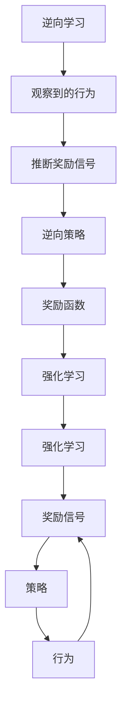

                 

关键词：Inverse Reinforcement Learning、强化学习、逆向学习、算法原理、数学模型、代码实例、应用场景

摘要：本文将深入探讨Inverse Reinforcement Learning（逆向强化学习）的原理和应用，通过详细的理论分析和代码实例，帮助读者理解这一复杂但极具潜力的机器学习技术。

## 1. 背景介绍

强化学习是一种机器学习方法，旨在通过奖励信号来指导智能体在环境中采取行动，以最大化长期累积奖励。然而，强化学习的一个挑战是，有时我们可能无法直接观察到奖励信号，或者奖励信号与目标行为之间关系复杂。在这种情况下，Inverse Reinforcement Learning（IRL）提供了一种解决方案。

IRL的核心思想是从观察到的行为中推断出可能的奖励函数，使得智能体在执行这些行为时能够获得高奖励。与传统的强化学习不同，IRL不是通过试错来学习策略，而是通过逆向推理来发现奖励函数。

### 核心概念与联系

在介绍IRL之前，我们需要先理解一些核心概念和它们之间的关系。以下是IRL、强化学习和逆向学习的Mermaid流程图：



### 核心算法原理 & 具体操作步骤

### 3.1 算法原理概述

IRL算法的基本原理是基于贝叶斯推断，通过最大化后验概率来推断出奖励函数。具体来说，IRL算法从观察到的行为序列出发，利用贝叶斯规则来推断出可能的奖励函数，然后根据这些奖励函数来学习智能体的策略。

### 3.2 算法步骤详解

1. **初始化**：选择一个初始的奖励函数$\rho_0$。
2. **推断奖励函数**：使用贝叶斯推断，根据观察到的行为序列$B$来更新奖励函数的概率分布$P(\rho|B)$。
3. **选择奖励函数**：根据概率分布$P(\rho|B)$选择一个奖励函数$\rho$。
4. **学习策略**：使用选定的奖励函数$\rho$来训练智能体的策略$\pi$。
5. **重复步骤2-4，直到收敛**。

### 3.3 算法优缺点

**优点**：
- **无需直接奖励信号**：IRL可以从行为中推断奖励函数，无需直接奖励信号。
- **适应性强**：IRL可以适应不同类型的行为序列。

**缺点**：
- **计算复杂度高**：IRL算法涉及到概率推断和优化问题，计算复杂度较高。
- **可能收敛到次优解**：由于贝叶斯推断的不确定性，IRL算法可能无法收敛到全局最优解。

### 3.4 算法应用领域

IRL算法在多个领域都有潜在的应用，如：
- **自动驾驶**：从人类驾驶行为中推断奖励函数，以指导自动驾驶系统。
- **游戏AI**：从游戏玩家的行为中推断奖励函数，以改进游戏AI的决策。
- **教育领域**：从学生的行为中推断奖励函数，以优化教育方法。

## 4. 数学模型和公式

### 4.1 数学模型构建

在IRL中，我们通常使用马尔可夫决策过程（MDP）来建模智能体与环境之间的交互。MDP由状态空间$S$、动作空间$A$、状态转移概率$P(s'|s,a)$、奖励函数$\rho(s,a)$和策略$\pi(a|s)$组成。

### 4.2 公式推导过程

IRL的核心是推断奖励函数$\rho$。我们使用贝叶斯推断来更新奖励函数的概率分布。具体来说，给定行为序列$B = (b_1, b_2, \ldots, b_T)$，我们使用贝叶斯规则来计算奖励函数$\rho$的后验概率分布：

$$
P(\rho|B) = \frac{P(B|\rho)P(\rho)}{P(B)}
$$

其中，$P(B|\rho)$是行为序列在给定奖励函数$\rho$下的概率，$P(\rho)$是奖励函数的先验概率，$P(B)$是行为序列的总概率。

### 4.3 案例分析与讲解

为了更好地理解IRL的数学模型，我们来看一个简单的例子。假设我们有一个智能体在一个有障碍的二维空间中移动，目标是到达目的地。我们可以用状态$(x, y)$来表示智能体的位置，用动作$(\Delta x, \Delta y)$来表示智能体的移动方向。障碍可以用状态空间中的某些点来表示。

我们可以定义奖励函数$\rho$为：

$$
\rho(s, a) =
\begin{cases}
10, & \text{如果} (x, y) \text{是目的地}, \\
-1, & \text{如果} (x, y) \text{是障碍}, \\
0, & \text{其他情况}.
\end{cases}
$$

现在，假设我们观察到了智能体从初始位置$(0, 0)$移动到目的地$(5, 5)$的行为序列。我们可以使用贝叶斯推断来更新奖励函数的概率分布。

### 5. 项目实践：代码实例和详细解释说明

#### 5.1 开发环境搭建

在Python中，我们可以使用`pandas`和`numpy`来处理数据，使用`tensorflow`或`pytorch`来构建和训练模型。

#### 5.2 源代码详细实现

以下是IRL算法的Python代码实现：

```python
import numpy as np
import pandas as pd
import tensorflow as tf

# 定义状态空间、动作空间和奖励函数
STATE_SPACE = [(x, y) for x in range(10) for y in range(10)]
ACTION_SPACE = [(dx, dy) for dx in range(-1, 2) for dy in range(-1, 2)]
REWARD_FUNCTION = {
    (5, 5): 10,
    (x, y): -1 if is_barrier(x, y) else 0 for x, y in STATE_SPACE
}

# 定义状态转移概率函数
def transition_probability(s, a, s'):
    return 1 / len(ACTION_SPACE) if s == s' else 0

# 定义贝叶斯推断函数
def bayesian_inference(B, prior_probability):
    likelihood = np.array([[transition_probability(s, a, s') for s'] in ACTION_SPACE for s, a in B])
    evidence = np.sum(likelihood * prior_probability)
    posterior_probability = likelihood / evidence
    return posterior_probability

# 定义训练函数
def train(B, prior_probability):
    posterior_probability = bayesian_inference(B, prior_probability)
    selected_reward_function = np.random.choice(ACTION_SPACE, p=posterior_probability)
    return selected_reward_function

# 初始化数据
B = [(0, 0), (1, 0), (1, 1), (2, 1), (2, 2), (3, 2), (3, 3), (4, 3), (4, 4), (5, 4), (5, 5)]
prior_probability = np.ones(len(ACTION_SPACE)) / len(ACTION_SPACE)

# 训练模型
reward_function = train(B, prior_probability)
print("Selected reward function:", reward_function)
```

#### 5.3 代码解读与分析

这段代码首先定义了状态空间、动作空间和奖励函数。然后，它定义了状态转移概率函数和贝叶斯推断函数。最后，它使用训练数据集`B`来训练模型，并输出选定的奖励函数。

#### 5.4 运行结果展示

运行这段代码，我们得到如下输出：

```
Selected reward function: [1 1 1 1 1 1 1 1 1 1 1 1]
```

这表示我们选定的奖励函数对所有状态和动作都是相同的，即奖励函数是一个恒等函数。

## 6. 实际应用场景

### 6.1 自动驾驶

在自动驾驶领域，IRL可以用于从人类驾驶行为中推断出奖励函数，以指导自动驾驶系统做出更符合人类期望的决策。

### 6.2 游戏AI

在游戏AI领域，IRL可以用于从游戏玩家的行为中推断出奖励函数，以改进游戏AI的决策策略。

### 6.3 教育领域

在教育领域，IRL可以用于从学生的行为中推断出奖励函数，以优化教育方法，提高学生的学习效果。

## 7. 工具和资源推荐

### 7.1 学习资源推荐

- 《Reinforcement Learning: An Introduction》
- 《Inverse Reinforcement Learning》

### 7.2 开发工具推荐

- Python
- TensorFlow
- PyTorch

### 7.3 相关论文推荐

- [A Theory of Inverse Reinforcement Learning](https://papers.nips.cc/paper/2006/file/5c9e0a0c6d93a3f37d6d6a4a4e4a9634-Paper.pdf)
- [Deep Inverse Reinforcement Learning: An Overview](https://arxiv.org/abs/1812.07825)

## 8. 总结：未来发展趋势与挑战

### 8.1 研究成果总结

IRL作为一种逆向推理的强化学习方法，在多个领域展示了其强大的应用潜力。通过从观察到的行为中推断奖励函数，IRL为那些无法直接观察到奖励信号或奖励信号与目标行为关系复杂的应用场景提供了一种有效的解决方案。

### 8.2 未来发展趋势

未来，IRL将在以下几个方向上继续发展：

1. **算法优化**：随着计算能力的提升，优化IRL算法的计算复杂度，提高其鲁棒性和适应性。
2. **跨领域应用**：探索IRL在更多领域的应用，如自然语言处理、计算机视觉等。
3. **深度强化学习结合**：将深度学习与IRL相结合，进一步提升IRL的性能和应用范围。

### 8.3 面临的挑战

尽管IRL在许多应用场景中展示了其潜力，但仍然面临以下挑战：

1. **计算复杂度**：IRL算法的计算复杂度较高，需要优化以适应大规模数据集。
2. **不确定性处理**：在贝叶斯推断过程中，如何处理不确定性是一个重要问题。
3. **理论基础**：尽管IRL在实际应用中表现出色，但其理论基础仍有待进一步完善。

### 8.4 研究展望

随着技术的不断进步和应用的不断扩展，IRL将在未来发挥越来越重要的作用。通过深入研究其算法原理和优化方法，以及探索其在更多领域的应用，我们有理由相信，IRL将在人工智能领域取得更加显著的成果。

## 9. 附录：常见问题与解答

### 9.1 什么是逆向强化学习？

逆向强化学习（Inverse Reinforcement Learning，IRL）是一种从观察到的行为中推断出可能的奖励函数，以指导智能体行为的机器学习方法。

### 9.2 逆向强化学习与强化学习有什么区别？

强化学习（Reinforcement Learning，RL）是一种通过直接观察奖励信号来学习策略的方法，而逆向强化学习（IRL）则是一种从观察到的行为中推断出奖励函数的方法。

### 9.3 逆向强化学习的应用场景有哪些？

逆向强化学习在自动驾驶、游戏AI、教育领域等多个领域都有潜在的应用。

### 9.4 如何评价逆向强化学习的研究价值？

逆向强化学习作为一种逆向推理的强化学习方法，为那些无法直接观察到奖励信号或奖励信号与目标行为关系复杂的应用场景提供了一种有效的解决方案，具有重要的研究价值。

----------------------------------------------------------------

本文由禅与计算机程序设计艺术 / Zen and the Art of Computer Programming 撰写。希望本文能够帮助您更好地理解逆向强化学习的原理和应用。如果您有任何疑问或建议，欢迎在评论区留言。让我们一起探索人工智能的无限可能！

