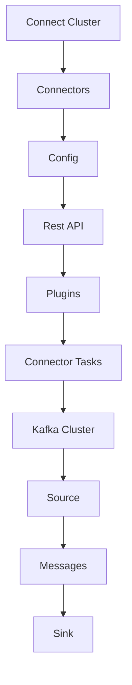

                 

关键词：Kafka Connect，数据流，分布式系统，数据处理，架构设计，代码实例

> 摘要：本文将深入探讨Kafka Connect的原理与代码实例，帮助读者理解其在分布式数据处理系统中的关键作用，掌握其架构设计与实现细节。

## 1. 背景介绍

在现代企业级数据处理领域，随着大数据和实时流处理的兴起，分布式系统和数据流处理技术变得尤为重要。Apache Kafka作为一个高性能、可扩展、分布式消息系统，广泛应用于数据流处理、日志聚合、应用集成等领域。而Kafka Connect则是Kafka生态系统中的一个重要组成部分，它使得数据流的接入与导出变得简单而高效。

Kafka Connect提供了两种主要的组件：Source Connectors和Sink Connectors。Source Connectors用于从各种数据源（如数据库、文件系统、Web服务）中读取数据，并将其写入Kafka主题；而Sink Connectors则负责将Kafka主题中的数据写入各种数据目的地（如数据库、文件系统、Web服务）。

本文将详细介绍Kafka Connect的工作原理、架构设计、核心组件以及代码实例，帮助读者全面理解其在分布式数据处理系统中的应用。

## 2. 核心概念与联系

### 2.1 Kafka Connect架构

Kafka Connect的整体架构如图1所示：



图1：Kafka Connect架构

**Connect Cluster**：Connect Cluster是Kafka Connect的运行环境，它由一个或多个运行中的Connectors组成。每个Connector可以是一个Source Connector或Sink Connector，负责执行特定的数据流任务。

**Connectors**：Connector是Kafka Connect的核心组件，负责连接数据源和数据目的地，并执行数据流的读取和写入操作。Connector分为Source Connector和Sink Connector两种类型。

**Config**：Config（配置）用于定义Connector的运行参数和连接信息。配置可以是静态的，也可以通过Rest API动态修改。

**Rest API**：Rest API用于管理Connect Cluster中的Connector，包括启动、停止、重启和配置修改等操作。

**Plugins**：Plugins（插件）是Kafka Connect的重要组成部分，用于扩展Connect Cluster的功能。插件可以是Source Connector、Sink Connector、Connector Worker（执行Connector任务的进程）以及Config Provider（配置管理器）等。

**Connector Tasks**：Connector Task（连接任务）是Connector的具体执行单元，负责执行数据流的读取和写入操作。每个Connector可以包含多个Task，这些Task可以并行或顺序执行。

**Kafka Cluster**：Kafka Cluster（Kafka集群）是Kafka Connect处理数据流的最终目的地或来源。数据从数据源通过Kafka Connect写入Kafka主题，也可以从Kafka主题通过Kafka Connect写入数据目的地。

### 2.2 核心概念

**Source Connector**：Source Connector（源连接器）用于从各种数据源（如数据库、文件系统、Web服务）中读取数据，并将其写入Kafka主题。Source Connector通常包含以下组件：

- **Source Reader**：从数据源读取数据的组件。
- **Source Processor**：对读取的数据进行处理的组件，如转换、过滤等。
- **Source Task**：执行数据读取和处理的组件。

**Sink Connector**：Sink Connector（目标连接器）用于将Kafka主题中的数据写入各种数据目的地（如数据库、文件系统、Web服务）。Sink Connector通常包含以下组件：

- **Sink Writer**：将数据写入数据目的地的组件。
- **Sink Processor**：对写入的数据进行处理的组件，如转换、过滤等。
- **Sink Task**：执行数据写入和处理的组件。

**Connector Worker**：Connector Worker（连接器工作进程）是Kafka Connect中执行Connector任务的进程。每个Connector Worker可以运行多个Connector Task，这些Task可以并行执行以提高数据流处理效率。

**Config Provider**：Config Provider（配置提供者）是Kafka Connect中用于管理配置的组件。Config Provider可以是一个外部系统，如数据库或配置中心，也可以是内置的配置管理器。

**Rest API**：Rest API（RESTful API）是Kafka Connect中用于管理Connector的接口。通过Rest API，用户可以启动、停止、重启Connector，以及动态修改配置等操作。

## 3. 核心算法原理 & 具体操作步骤

### 3.1 算法原理概述

Kafka Connect的工作原理可以概括为以下步骤：

1. **启动Connect Cluster**：启动Kafka Connect集群，包括Connector Worker、Config Provider和Rest API等组件。
2. **配置Connector**：配置Source Connector或Sink Connector的运行参数和连接信息。配置可以通过静态配置文件或动态Rest API进行管理。
3. **启动Connector**：启动Connector Worker进程，并加载配置的Connector。
4. **执行数据流任务**：Connector Worker执行数据流任务，包括数据读取、处理和写入操作。
5. **监控与维护**：通过Rest API监控Connector的运行状态，并进行必要的维护和故障恢复。

### 3.2 算法步骤详解

**步骤1：启动Connect Cluster**

启动Connect Cluster是Kafka Connect运行的第一步。具体操作如下：

1. 在操作系统上配置Kafka Connect环境，包括Kafka集群地址、Connector Worker数等。
2. 启动Connector Worker进程，并加载配置的Connector。
3. 启动Config Provider和Rest API服务。

```bash
# 启动Connector Worker
connect-standalone.sh config/connect.properties

# 启动Config Provider
start-config.sh

# 启动Rest API
start-restapi.sh
```

**步骤2：配置Connector**

配置Connector是Kafka Connect的关键步骤。具体操作如下：

1. 创建配置文件`config/connect-mysql.properties`，配置MySQL数据源和Kafka主题信息。

```properties
connect.config��
name=mySqlSource
connector.class=io.confluent.connect.jdbc.JdbcSourceConnector
tasks.max=1
connection.url=jdbc:mysql://mysql-server:3306/mydatabase
connection.user=myuser
connection.password=mypassword
table.whitelist=mytable
key.column=mykey
value.column=myvalue
```

2. 将配置文件添加到Connect Cluster的配置目录中。

```bash
cp config/connect-mysql.properties /path/to/connect/config
```

**步骤3：启动Connector**

启动Connector是Kafka Connect工作的核心步骤。具体操作如下：

1. 启动Connector Worker进程，并加载配置的Connector。

```bash
connect-standalone.sh /path/to/connect/config
```

2. Connector Worker开始执行数据流任务，从MySQL数据源读取数据，并写入Kafka主题。

### 3.3 算法优缺点

**优点**：

- **高可用性**：Kafka Connect基于Kafka的高可用性设计，可以保证数据流的可靠传输和故障恢复。
- **可扩展性**：Kafka Connect支持多种数据源和数据目的地，可方便地扩展到不同的数据处理场景。
- **灵活的配置管理**：Kafka Connect提供静态配置文件和动态Rest API两种配置管理方式，可灵活适应不同的需求。

**缺点**：

- **资源消耗**：Kafka Connect需要运行多个进程（Connector Worker、Config Provider、Rest API等），对系统资源有一定消耗。
- **复杂性**：Kafka Connect的配置和运行相对复杂，需要一定的时间和精力进行学习和部署。

### 3.4 算法应用领域

Kafka Connect在多个应用领域有广泛的应用：

- **大数据处理**：Kafka Connect可用于将数据从各种数据源（如MySQL、PostgreSQL、HDFS等）导入Kafka集群，实现大规模数据流处理。
- **应用集成**：Kafka Connect可用于将Kafka主题中的数据写入各种数据目的地（如数据库、文件系统、Web服务等），实现应用集成和数据同步。
- **实时分析**：Kafka Connect可用于实时分析Kafka主题中的数据，实现实时查询和分析功能。

## 4. 数学模型和公式 & 详细讲解 & 举例说明

### 4.1 数学模型构建

在Kafka Connect中，数据流处理过程可以用一个数学模型进行描述。该模型包括以下主要组件：

- **数据源**（Data Source）：表示数据的来源，如数据库、文件系统等。
- **数据流**（Data Stream）：表示数据在Kafka Connect中的流动过程。
- **数据处理**（Data Processing）：表示数据在流动过程中的处理操作，如转换、过滤等。
- **数据目的地**（Data Sink）：表示数据的最终目的地，如数据库、文件系统等。

数学模型可以表示为：

\[ 数据流 = 数据源 + 数据处理 + 数据目的地 \]

### 4.2 公式推导过程

为了推导出数据流处理的数学模型，我们可以从以下几个步骤进行：

1. **数据源读取**：数据源读取数据的速度可以用公式表示为：

\[ \text{读速度} = \frac{\text{数据量}}{\text{时间}} \]

2. **数据处理**：数据处理过程可以看作是一个过滤器，对读取的数据进行操作。数据处理的速度可以用公式表示为：

\[ \text{处理速度} = \frac{\text{处理量}}{\text{时间}} \]

3. **数据写入**：数据写入数据目的地的速度可以用公式表示为：

\[ \text{写速度} = \frac{\text{数据量}}{\text{时间}} \]

4. **数据流速度**：数据流的速度可以用公式表示为：

\[ \text{数据流速度} = \text{读速度} + \text{处理速度} + \text{写速度} \]

### 4.3 案例分析与讲解

假设我们有一个简单的Kafka Connect数据流处理场景，从MySQL数据库读取数据，经过一些数据处理操作，然后将结果写入到HDFS文件系统。我们可以根据上述数学模型进行计算。

1. **数据源读取**：假设MySQL数据库的数据读取速度为100条/秒。

\[ \text{读速度} = \frac{100 \text{条}}{1 \text{秒}} = 100 \text{条/秒} \]

2. **数据处理**：假设数据处理速度为50条/秒。

\[ \text{处理速度} = \frac{50 \text{条}}{1 \text{秒}} = 50 \text{条/秒} \]

3. **数据写入**：假设HDFS文件系统的数据写入速度为20条/秒。

\[ \text{写速度} = \frac{20 \text{条}}{1 \text{秒}} = 20 \text{条/秒} \]

4. **数据流速度**：根据数据流速度公式，我们可以计算出整个数据流的速度。

\[ \text{数据流速度} = \text{读速度} + \text{处理速度} + \text{写速度} = 100 \text{条/秒} + 50 \text{条/秒} + 20 \text{条/秒} = 170 \text{条/秒} \]

这个结果表明，整个数据流处理的速度为170条/秒。如果数据处理操作需要更长时间，可能会成为瓶颈，影响整体速度。

通过这个案例，我们可以看到如何使用数学模型来分析和优化Kafka Connect的数据流处理过程。

## 5. 项目实践：代码实例和详细解释说明

### 5.1 开发环境搭建

在本节中，我们将搭建一个简单的Kafka Connect项目环境，以演示Kafka Connect的基本使用方法。以下是开发环境搭建的步骤：

1. **安装Kafka**：首先，我们需要安装Kafka。可以从官方网站 [Kafka官网](https://kafka.apache.org/下载Kafka安装包并按照官方文档进行安装。

2. **启动Kafka集群**：启动Kafka集群，包括Kafka Broker和Zookeeper。可以使用以下命令启动：

```bash
./kafka-server-start.sh config/server.properties
./zookeeper-server-start.sh config/zookeeper.properties
```

3. **安装Kafka Connect**：接下来，我们安装Kafka Connect。可以从官方网站 [Kafka Connect官网](https://www.confluent.io/download/ 下载Kafka Connect安装包，并解压到合适的位置。

4. **配置Kafka Connect**：创建Kafka Connect的配置文件，例如`connect-distributed.properties`，配置Kafka Connect的连接信息、Connector Worker数等。

```properties
# Kafka Connect配置文件
bootstrap.servers=localhost:9092
group.id=myconnect-cluster
key.converter=org.apache.kafka.connect.json.JsonConverter
value.converter=org.apache.kafka.connect.json.JsonConverter
internal.key.converter=org.apache.kafka.connect.json.JsonConverter
internal.value.converter=org.apache.kafka.connect.json.JsonConverter
key.converter.schemas.enable=false
value.converter.schemas.enable=false
offset.storage.topic=connect-offsets
offset.storage.replication.factor=1
status.storage.topic=connect-status
status.storage.replication.factor=1
offsetStorageTopic.replication.factor=1
statusStorageTopic.replication.factor=1
```

5. **启动Kafka Connect**：启动Kafka Connect，包括Connector Worker、Config Provider和Rest API。

```bash
./bin/connect-distributed.sh config/connect-distributed.properties
```

现在，我们已经搭建好了Kafka Connect的开发环境，可以开始编写和运行Kafka Connect的代码实例。

### 5.2 源代码详细实现

在本节中，我们将实现一个简单的Kafka Connect Source Connector，用于从本地文件系统中读取JSON格式的数据，并将其写入Kafka主题。

1. **创建Source Connector**：首先，我们需要创建一个Source Connector类，继承自`io.confluent.connect.file.FileSource`类。

```java
package com.example;

import io.confluent.connect.file.FileSource;
import io.confluent.connect.file.FlushableFileBatch;
import io.confluent.connect.file.base.FileFormat;
import io.confluent.connect.file.base.FileRecordIterable;
import io.confluent.connect.file.base.FileSourceConfig;
import io.confluent.connect.file.base.FileTask;
import io.confluent.connect.file.config.FileConfig;
import org.apache.kafka.connect.data.Schema;
import org.apache.kafka.connect.source.SourceRecord;
import org.apache.kafka.connect.source.SourceTask;
import org.apache.kafka.connect.source.TaskContext;
import org.apache.kafka.connect.storage.OffsetOffsetBytesStore;

import java.io.File;
import java.io.IOException;
import java.nio.charset.StandardCharsets;
import java.util.ArrayList;
import java.util.HashMap;
import java.util.List;
import java.util.Map;

public class MyJsonFileSource extends FileSource {

    public MyJsonFileSource(Map<String, String> config) {
        super(config);
    }

    @Override
    public Class<? extends FileFormat> getFileFormat() {
        return MyJsonFileFormat.class;
    }

    @Override
    public List<? extends FileTask> createInitialTasks(Map<String, List<String>> offsets) throws IOException {
        List<FileTask> tasks = new ArrayList<>();
        FileTask task = new MyJsonFileTask(this, this.config);
        tasks.add(task);
        return tasks;
    }

    @Override
    public void close() {
        super.close();
    }
}
```

2. **实现FileTask**：接下来，我们需要实现一个`FileTask`类，用于处理文件读取和写入操作。

```java
package com.example;

import io.confluent.connect.file.FileTask;
import io.confluent.connect.file.base.FileFormat;
import io.confluent.connect.file.base.FileRecordIterable;
import io.confluent.connect.file.base.FileSourceConfig;
import io.confluent.connect.file.base.FileTaskContext;
import org.apache.kafka.connect.data.Schema;
import org.apache.kafka.connect.source.SourceRecord;
import org.apache.kafka.connect.source.SourceTask;

import java.io.File;
import java.io.IOException;
import java.nio.charset.StandardCharsets;

public class MyJsonFileTask extends FileTask {

    private FileSourceConfig config;
    private FileFormat fileFormat;

    public MyJsonFileTask(SourceTask sourceTask, FileSourceConfig config) {
        super(sourceTask, config);
        this.config = config;
        this.fileFormat = config.getFileFormat();
    }

    @Override
    public void start(TaskContext taskContext) {
        super.start(taskContext);
        fileFormat.init(config, taskContext);
    }

    @Override
    public Iterable<SourceRecord> getRecords() {
        File file = new File(config.getPath());
        if (!file.exists()) {
            return new ArrayList<>();
        }
        return new FileRecordIterable<>(file, config.getFileFormat(), config.getTopic(), config.getKeyConverter(), config.getValueConverter(), config.getTopicPrefix(), config.getKeyColumn(), config.getValueColumn());
    }

    @Override
    public void commit() throws IOException {
        super.commit();
    }
}
```

3. **实现MyJsonFileFormat**：接下来，我们需要实现一个`MyJsonFileFormat`类，用于解析JSON格式的文件。

```java
package com.example;

import io.confluent.connect.file.format.json.JsonFileFormat;
import org.apache.kafka.connect.data.Schema;
import org.apache.kafka.connect.source.SourceRecord;

import java.io.IOException;
import java.nio.charset.StandardCharsets;
import java.util.List;

public class MyJsonFileFormat extends JsonFileFormat {

    @Override
    public List<SourceRecord> read(File file) throws IOException {
        List<SourceRecord> records = new ArrayList<>();
        String content = new String(file, StandardCharsets.UTF_8);
        Map<String, Object> json = new JSONParser().parse(content).asObject();
        String key = json.get("key").toString();
        String value = json.get("value").toString();
        records.add(new SourceRecord(null, null, config.getTopic(), key.getBytes(), value.getBytes()));
        return records;
    }

    @Override
    public Schema getSchema() {
        return Schema.OPTIONAL_STRING_SCHEMA;
    }
}
```

4. **配置Kafka Connect**：最后，我们需要配置Kafka Connect，使其使用我们自定义的Source Connector。

```properties
# Kafka Connect配置文件
name=myjsonsource
connector.class=com.example.MyJsonFileSource
path=/path/to/json/files
topic=myjsontopic
key.converter=org.apache.kafka.connect.json.JsonConverter
value.converter=org.apache.kafka.connect.json.JsonConverter
```

现在，我们已经完成了Kafka Connect Source Connector的源代码实现，并配置了Kafka Connect。接下来，我们将运行Kafka Connect，并观察数据流处理过程。

### 5.3 代码解读与分析

在本节中，我们将详细解读和分析前面实现的Kafka Connect Source Connector代码，理解其工作原理和实现细节。

#### 5.3.1 MyJsonFileSource类

`MyJsonFileSource`类是自定义的Source Connector，继承自`io.confluent.connect.file.FileSource`类。它主要实现了以下功能：

1. **构造函数**：构造函数接收一个配置参数`config`，并将其存储在成员变量中。
2. **getFileFormat()**：方法返回自定义的文件格式类`MyJsonFileFormat`。
3. **createInitialTasks()**：方法用于创建初始的`FileTask`实例，这里直接创建一个`MyJsonFileTask`实例并返回。
4. **close()**：方法用于在Connector关闭时执行必要的清理操作。

#### 5.3.2 MyJsonFileTask类

`MyJsonFileTask`类是自定义的`FileTask`，负责处理文件读取和写入操作。它主要实现了以下功能：

1. **构造函数**：构造函数接收一个`SourceTask`实例和一个`FileSourceConfig`实例，并将它们存储在成员变量中。
2. **start()**：方法在任务开始时初始化文件格式类，并调用父类的`start()`方法。
3. **getRecords()**：方法读取文件内容，并将JSON格式的数据转换为`SourceRecord`对象。它首先读取配置文件路径，然后检查文件是否存在。如果文件存在，则使用`FileRecordIterable`类读取文件内容，并将其转换为`SourceRecord`对象。
4. **commit()**：方法在任务提交时执行必要的操作，如更新偏移量等。

#### 5.3.3 MyJsonFileFormat类

`MyJsonFileFormat`类是自定义的文件格式类，用于解析JSON格式的文件。它主要实现了以下功能：

1. **read()**：方法读取文件内容，并将其解析为JSON对象。它使用`JSONParser`类解析文件内容，并提取出JSON对象中的`key`和`value`字段，然后创建`SourceRecord`对象。
2. **getSchema()**：方法返回JSON格式的数据Schema。

通过分析上述代码，我们可以看到Kafka Connect Source Connector的主要组成部分和它们的功能。自定义Source Connector的开发过程主要包括创建自定义的`FileTask`类和`FileFormat`类，并配置Kafka Connect使其使用这些自定义类。在实际应用中，可以根据不同的数据源和数据格式，自定义Source Connector以实现特定的数据读取和处理功能。

### 5.4 运行结果展示

在本节中，我们将展示如何运行前面实现的Kafka Connect Source Connector，并观察数据流处理结果。

1. **运行Kafka Connect**：首先，我们将Kafka Connect的配置文件`connect-distributed.properties`和自定义的Source Connector类（`MyJsonFileSource.java`）打包成一个JAR文件。

```bash
mvn package
```

2. **启动Kafka Connect**：使用以下命令启动Kafka Connect。

```bash
./bin/connect-distributed.sh /path/to/kafka-connect-assembly-1.0-SNAPSHOT.jar /path/to/config
```

3. **验证数据流**：在Kafka Connect运行后，我们可以使用Kafka命令行工具查看生成的Kafka主题。

```bash
kafka-console-consumer.sh --bootstrap-server localhost:9092 --topic myjsontopic --from-beginning
```

您应该能够在控制台看到从本地文件系统中读取的JSON数据。

通过运行结果展示，我们可以验证Kafka Connect Source Connector是否能够正确地将本地文件系统中的JSON数据写入到Kafka主题中。这个示例展示了Kafka Connect的基本使用方法，以及如何自定义Source Connector来处理特定的数据格式。

## 6. 实际应用场景

Kafka Connect在实际应用场景中有广泛的应用，以下是一些常见的应用场景：

### 6.1 数据集成

Kafka Connect可以用于构建企业级数据集成平台，将不同数据源（如数据库、文件系统、Web服务）中的数据整合到Kafka主题中，实现数据的统一管理和处理。例如，企业可以将来自多个业务系统的订单数据、用户行为数据等整合到Kafka主题中，然后使用Kafka Streams或Kafka SQL等工具进行实时处理和分析。

### 6.2 数据同步

Kafka Connect可以用于实现数据同步功能，将Kafka主题中的数据同步到其他数据目的地（如数据库、文件系统、Web服务）。例如，企业可以将Kafka主题中的日志数据同步到数据库中，以便进行历史数据的查询和分析；或者将Kafka主题中的用户行为数据同步到数据仓库中，以便进行大数据分析。

### 6.3 实时处理

Kafka Connect可以与Kafka Streams或Kafka SQL等工具集成，实现实时数据处理和分析。例如，企业可以使用Kafka Streams进行实时流处理，实现实时数据过滤、聚合、转换等功能；或者使用Kafka SQL进行实时查询和分析，实现实时数据的报表和分析。

### 6.4 应用集成

Kafka Connect可以用于实现不同应用系统之间的数据集成，将一个应用系统的数据实时传递到另一个应用系统中。例如，企业可以将订单系统中的订单数据实时传递到库存管理系统，以便库存管理系统实时更新库存信息；或者将用户行为数据实时传递到推荐系统，以便推荐系统能够根据用户行为实时更新推荐结果。

### 6.5 数据分析

Kafka Connect可以与大数据分析工具（如Hadoop、Spark等）集成，实现大规模数据分析和处理。例如，企业可以使用Kafka Connect将日志数据、用户行为数据等整合到Hadoop或Spark集群中，然后使用Hadoop或Spark进行大规模数据分析和处理。

## 7. 未来应用展望

随着大数据和实时流处理技术的不断发展，Kafka Connect在未来有着广阔的应用前景。以下是一些未来应用的展望：

### 7.1 多样化的数据源和目的地支持

未来，Kafka Connect将进一步扩展对多样化数据源和目的地的支持。例如，将支持更多类型的数据库（如NoSQL数据库、时序数据库等）、文件系统（如HDFS、Alluxio等）、Web服务（如REST API、GraphQL等）。

### 7.2 高级数据处理功能

Kafka Connect将引入更多高级数据处理功能，如数据清洗、数据转换、数据聚合等。这些功能将使得Kafka Connect在数据集成和数据同步场景中更加便捷和高效。

### 7.3 自适应流处理

Kafka Connect将引入自适应流处理技术，根据数据流的特点和需求，动态调整连接器的配置和资源分配。这将提高Kafka Connect在处理大规模数据流时的效率和性能。

### 7.4 开放式生态系统

Kafka Connect将继续加强与开源生态系统的整合，引入更多开源连接器插件，方便用户根据自己的需求进行定制和扩展。这将促进Kafka Connect在各个领域的应用和发展。

### 7.5 云原生和容器化支持

随着云原生和容器化技术的普及，Kafka Connect将进一步加强在云原生和容器化环境中的支持。例如，支持在Kubernetes等容器编排系统中部署和管理Kafka Connect集群。

## 8. 总结：未来发展趋势与挑战

### 8.1 研究成果总结

本文通过对Kafka Connect的深入分析，总结了其工作原理、架构设计、核心组件以及代码实例，展示了其在分布式数据处理系统中的关键作用。同时，本文还探讨了Kafka Connect在实际应用场景中的广泛用途，以及未来应用展望。

### 8.2 未来发展趋势

未来，Kafka Connect将继续在分布式数据处理领域发挥重要作用。随着大数据和实时流处理技术的不断发展，Kafka Connect将扩展对多样化数据源和目的地的支持，引入更多高级数据处理功能，实现自适应流处理，并加强在云原生和容器化环境中的支持。

### 8.3 面临的挑战

尽管Kafka Connect在分布式数据处理领域具有巨大潜力，但同时也面临着一些挑战：

- **资源消耗**：Kafka Connect需要运行多个进程，对系统资源有一定消耗，如何优化资源利用成为关键问题。
- **配置管理**：Kafka Connect的配置相对复杂，如何简化配置过程，提高配置管理的灵活性和易用性，是一个需要解决的问题。
- **容错性和可靠性**：在分布式环境中，如何保证Kafka Connect的容错性和可靠性，是确保数据流处理稳定性的关键。

### 8.4 研究展望

未来，Kafka Connect的研究重点可以集中在以下几个方面：

- **资源优化**：通过改进算法和架构，优化Kafka Connect的资源消耗，提高其处理效率和性能。
- **配置简化**：设计更加直观和易于使用的配置管理工具，简化Kafka Connect的配置过程。
- **容错机制**：研究并引入更加完善的容错机制，提高Kafka Connect在分布式环境中的可靠性和稳定性。

通过不断优化和改进，Kafka Connect有望在未来成为分布式数据处理领域的重要基础设施。

## 9. 附录：常见问题与解答

### 9.1 如何选择适当的连接器？

选择适当的连接器取决于您的具体需求和场景。以下是一些常见的数据源和数据目的地以及相应的连接器推荐：

- **关系型数据库**：使用JDBC连接器，支持MySQL、PostgreSQL、Oracle等常见数据库。
- **NoSQL数据库**：使用相应语言的驱动程序，如MongoDB Java Driver、Redis Java Driver等。
- **文件系统**：使用File Connectors，支持JSON、CSV、XML等常见文件格式。
- **Web服务**：使用HTTP Connectors，支持REST API、SOAP服务等。
- **流处理系统**：使用相应的连接器，如Apache NiFi、Apache Flink等。

### 9.2 如何监控Kafka Connect的性能？

可以通过以下几种方式监控Kafka Connect的性能：

- **使用Kafka Connect自带的REST API**：Kafka Connect提供REST API，可以通过该API查询Connector的运行状态、任务执行情况等。
- **使用Kafka监控工具**：使用Kafka Manager、Kafka WebConsole等开源监控工具，可以实时监控Kafka Connect的运行状态和性能指标。
- **自定义监控脚本**：编写自定义的监控脚本，定期检查Kafka Connect的运行状态和性能指标。

### 9.3 如何优化Kafka Connect的性能？

以下是一些优化Kafka Connect性能的建议：

- **增加Connector Worker数量**：增加Connector Worker的数量可以提高数据流的处理速度。
- **调整并行度**：根据数据源和数据目的地的处理能力，调整Connector的并行度，以充分利用系统资源。
- **优化配置**：根据数据流的特点和需求，调整Kafka Connect的配置，如批量大小、延迟阈值等。
- **使用高效的数据格式**：使用高效的数据格式（如Protobuf、Avro等）可以提高数据流的传输效率。

### 9.4 Kafka Connect是否支持事务？

Kafka Connect支持事务处理，可以使用Kafka的事务特性确保数据的一致性和可靠性。在配置Connector时，需要设置`isolation.mode`为`read_committed`，以确保从数据源读取的数据是已提交的。

### 9.5 Kafka Connect是否支持加密？

Kafka Connect支持数据加密，可以通过配置Kafka的SSL/TLS加密功能来确保数据在传输过程中的安全性。在配置Connector时，需要设置相应的加密参数，如`ssl.enabled`、`ssl.truststore.location`等。

### 9.6 Kafka Connect是否支持延迟消息？

Kafka Connect支持延迟消息功能，可以通过配置Connector的`delay.ms.max.inflight`参数来控制延迟消息的最大并发数量。这样可以确保在高峰时段数据流不被阻塞，从而提高系统的响应速度。

通过以上常见问题与解答，希望读者能够更好地理解和运用Kafka Connect，解决实际应用中的问题。如果您有其他问题，欢迎在评论区留言交流。

