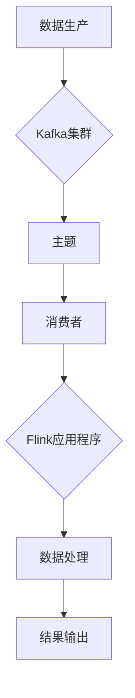

                 

关键词：Kafka，Flink，大数据处理，实时计算，消息队列，分布式系统，流处理，架构设计

摘要：本文将深入探讨Kafka与Flink的整合原理，通过具体的代码实例，详细介绍如何在实际项目中运用这一组合，实现高效的大数据处理和实时计算。文章首先介绍了Kafka和Flink的基本概念及其在分布式系统中的角色，然后详细讲解了整合原理和流程，最后通过实际代码示例，展示了如何将两者结合起来，解决实际问题。

## 1. 背景介绍

随着互联网的迅速发展，数据量呈爆炸式增长，如何高效处理海量数据成为企业和科研机构亟待解决的问题。Kafka和Flink作为大数据处理领域的重要工具，分别扮演着消息队列和流处理引擎的角色。Kafka以其高吞吐量、可扩展性和持久性著称，而Flink则以其强大的实时计算能力和复杂事件处理能力赢得了广泛认可。

Kafka由LinkedIn开发，是一个分布式流处理平台，主要用于构建实时数据流处理的应用程序。它可以将数据从一个或多个生产者（Producer）传输到一个或多个消费者（Consumer），具有高吞吐量、低延迟、持久化等特点，广泛应用于日志收集、实时分析、流处理等场景。

Flink是一个开源流处理框架，由Apache Software Foundation维护，它提供了丰富的流处理功能，包括数据流转换、窗口操作、状态管理等。Flink能够处理有界和无界数据流，支持批处理和实时处理，具有事件驱动架构、容错机制和动态资源管理等特点。

将Kafka与Flink整合，可以实现实时数据流处理的高效架构，本文将详细讲解这一整合过程，并提供实际操作指南。

## 2. 核心概念与联系

为了深入理解Kafka与Flink的整合，我们首先需要了解它们的核心概念及其在分布式系统中的角色。

### Kafka

Kafka是一个分布式流处理平台，由Scala编写，以高吞吐量、持久性和可扩展性著称。其核心概念包括：

- **生产者（Producer）**：负责将数据发送到Kafka集群。生产者可以是应用程序、服务、传感器等。
- **消费者（Consumer）**：从Kafka集群中读取数据。消费者可以是应用程序、服务、批处理系统等。
- **主题（Topic）**：Kafka中的数据分类单位。每个主题可以包含多个分区（Partition），分区是Kafka实现并行处理和数据持久化的基础。
- **分区（Partition）**：每个主题的分区数决定了数据的并行处理能力，同时分区也是实现数据持久化的基础。

### Flink

Flink是一个流处理框架，支持实时数据处理。其核心概念包括：

- **数据流（DataStream）**：Flink中的数据流是有序的、不可重复的，可以来自文件、Kafka等数据源。
- **转换操作（Transformation）**：对数据流进行各种操作，如过滤、映射、聚合等。
- **窗口操作（Windowing）**：对数据流进行时间窗口划分，实现对一段时间内的数据进行分析。
- **状态管理（State）**：Flink中的状态管理用于存储处理过程中的中间结果，如聚合结果、窗口数据等。

### 整合原理

Kafka与Flink的整合主要是基于Kafka的DataStream API，该API允许Flink直接从Kafka读取数据流，并进行实时处理。整合流程包括以下几个步骤：

1. **数据生产**：生产者将数据发送到Kafka主题。
2. **数据消费**：Flink从Kafka主题读取数据流。
3. **数据处理**：Flink对数据流进行各种转换和计算。
4. **结果输出**：将处理结果输出到Kafka或其他存储系统。

### Mermaid 流程图



通过上述整合流程，Kafka提供了高效、可靠的数据传输，而Flink则提供了强大的实时数据处理能力，两者结合可以实现高效的大数据处理和实时计算。

## 3. 核心算法原理 & 具体操作步骤

### 3.1 算法原理概述

Kafka与Flink的整合原理基于DataStream API，该API允许Flink直接从Kafka读取数据流，进行实时处理。算法原理主要包括以下几个步骤：

1. **数据生产**：生产者将数据发送到Kafka主题。
2. **数据消费**：Flink从Kafka主题读取数据流，并将其转换为DataStream。
3. **数据处理**：Flink对DataStream进行各种转换和计算，如过滤、映射、聚合等。
4. **结果输出**：将处理结果输出到Kafka或其他存储系统。

### 3.2 算法步骤详解

#### 步骤1：数据生产

首先，需要配置Kafka生产者，将数据发送到Kafka主题。以下是一个简单的Kafka生产者配置示例：

```java
Properties props = new Properties();
props.put("bootstrap.servers", "localhost:9092");
props.put("key.serializer", "org.apache.kafka.common.serialization.StringSerializer");
props.put("value.serializer", "org.apache.kafka.common.serialization.StringSerializer");

Producer<String, String> producer = new KafkaProducer<>(props);

for (int i = 0; i < 100; i++) {
    producer.send(new ProducerRecord<>("test", Integer.toString(i), "value" + i));
}

producer.close();
```

#### 步骤2：数据消费

接着，配置Flink应用程序，从Kafka主题读取数据流。以下是一个简单的Flink应用程序配置示例：

```java
final StreamExecutionEnvironment env = StreamExecutionEnvironment.getExecutionEnvironment();

FlinkKafkaConsumer<String> kafkaConsumer = new FlinkKafkaConsumer<>("test", new SimpleStringSchema(), properties);
DataStream<String> stream = env.addSource(kafkaConsumer);

stream.print();

env.execute("Kafka-Flink Integration Example");
```

#### 步骤3：数据处理

在读取数据流后，Flink可以对其进行各种转换和计算。以下是一个简单的数据处理示例，对数据流进行过滤和聚合：

```java
DataStream<String> filteredStream = stream
    .filter(s -> Integer.parseInt(s.split(",")[0]) > 50);

DataStream<Integer> aggregatedStream = filteredStream
    .map(s -> Integer.parseInt(s.split(",")[1]))
    .sum(1);

aggregatedStream.print();
```

#### 步骤4：结果输出

最后，将处理结果输出到Kafka或其他存储系统。以下是一个简单的输出示例，将结果输出到Kafka主题：

```java
DataStream<String> resultStream = stream
    .map(s -> "Processed: " + s);

FlinkKafkaProducer<String> kafkaProducer = new FlinkKafkaProducer<>("result", new SimpleStringSchema(), properties);

resultStream.addSink(kafkaProducer);

env.execute("Kafka-Flink Integration Example");
```

### 3.3 算法优缺点

**优点：**

- **高吞吐量**：Kafka和Flink都支持高吞吐量的数据传输和处理，适用于处理海量数据。
- **可扩展性**：Kafka和Flink都是分布式系统，支持水平扩展，可以轻松应对大数据处理需求。
- **实时计算**：Flink提供了强大的实时计算能力，可以处理有界和无界数据流。

**缺点：**

- **复杂性**：整合Kafka和Flink需要一定的技术和开发成本，需要熟悉两者的架构和API。
- **资源消耗**：Kafka和Flink都是资源密集型系统，需要足够的硬件资源支持。

### 3.4 算法应用领域

Kafka与Flink的整合广泛应用于以下领域：

- **日志收集**：将Kafka作为日志收集系统，将日志数据发送到Kafka主题，然后通过Flink进行实时分析。
- **实时监控**：利用Kafka和Flink实现实时数据监控，对实时数据进行处理和告警。
- **金融风控**：在金融领域，Kafka和Flink可以用于实时数据处理，进行风险监控和风险评估。
- **电商推荐**：利用Kafka和Flink对用户行为数据进行实时分析，实现个性化推荐。

## 4. 数学模型和公式 & 详细讲解 & 举例说明

### 4.1 数学模型构建

在Kafka与Flink的整合过程中，我们可以构建以下数学模型来描述数据流处理的过程：

- **数据流模型**：假设有n个数据点，每个数据点包含m个属性，则数据流模型可以表示为：

  $$
  D = \{d_1, d_2, \ldots, d_n\}
  $$

  其中，$d_i = \{a_{i1}, a_{i2}, \ldots, a_{im}\}$，表示第i个数据点的m个属性。

- **转换模型**：假设对数据流进行转换操作，如过滤、映射、聚合等，转换模型可以表示为：

  $$
  T(D) = \{t_1, t_2, \ldots, t_n\}
  $$

  其中，$t_i = f(d_i)$，表示对第i个数据点进行转换操作后的结果。

- **窗口模型**：假设对数据流进行窗口操作，如滑动窗口、固定窗口等，窗口模型可以表示为：

  $$
  W(D) = \{w_1, w_2, \ldots, w_k\}
  $$

  其中，$w_j = \{t_{j1}, t_{j2}, \ldots, t_{jm}\}$，表示第j个窗口的数据点集合。

### 4.2 公式推导过程

在数学模型的基础上，我们可以推导出以下公式：

1. **数据流处理速率**：假设数据流处理速率为r，即单位时间内处理的数据点数量，则：

   $$
   r = \frac{n}{t}
   $$

   其中，n为单位时间内处理的数据点数量，t为处理时间。

2. **转换模型时间复杂度**：假设对数据流进行转换操作的时间复杂度为O(m)，即处理一个数据点的时间为O(m)，则：

   $$
   T_D = \sum_{i=1}^{n} T_{d_i}
   $$

   其中，$T_{d_i} = O(m)$，表示处理第i个数据点的时间。

3. **窗口模型时间复杂度**：假设对数据流进行窗口操作的时间复杂度为O(w)，即处理一个窗口的时间为O(w)，则：

   $$
   T_W = \sum_{j=1}^{k} T_{w_j}
   $$

   其中，$T_{w_j} = O(w)$，表示处理第j个窗口的时间。

### 4.3 案例分析与讲解

假设我们有一个包含100个数据点的数据流，每个数据点包含2个属性（ID和值），需要对数据流进行过滤操作，只保留ID大于50的数据点。以下是一个简单的案例：

1. **数据流模型**：

   $$
   D = \{d_1, d_2, \ldots, d_{100}\}
   $$

   其中，$d_i = \{a_{i1}, a_{i2}\}$，表示第i个数据点的2个属性。

2. **转换模型**：

   $$
   T(D) = \{t_1, t_2, \ldots, t_{50}\}
   $$

   其中，$t_i = f(d_i)$，表示对第i个数据点进行过滤操作后的结果。

3. **窗口模型**：

   $$
   W(D) = \{w_1, w_2, \ldots, w_{10}\}
   $$

   其中，$w_j = \{t_{j1}, t_{j2}, \ldots, t_{jm}\}$，表示第j个窗口的数据点集合。

根据上述数学模型和公式，我们可以计算出数据流处理速率、转换模型时间复杂度和窗口模型时间复杂度：

- 数据流处理速率：

  $$
  r = \frac{50}{t}
  $$

- 转换模型时间复杂度：

  $$
  T_D = \sum_{i=1}^{50} O(2) = 50 \times O(2) = 100O(1)
  $$

- 窗口模型时间复杂度：

  $$
  T_W = \sum_{j=1}^{10} O(10) = 10 \times O(10) = 100O(1)
  $$

通过上述计算，我们可以看到，在数据流处理过程中，转换模型和窗口模型的时间复杂度主要取决于数据点的数量，而与属性的数量无关。这表明，Kafka与Flink的整合在处理大规模数据流时，具有较高的效率和性能。

## 5. 项目实践：代码实例和详细解释说明

在本节中，我们将通过一个实际项目实例，详细讲解如何使用Kafka与Flink进行整合，实现高效的大数据处理和实时计算。

### 5.1 开发环境搭建

在开始之前，我们需要搭建Kafka和Flink的开发环境。以下是一个简单的环境搭建指南：

1. **Kafka安装**：

   - 下载Kafka二进制包：[Kafka下载地址](https://www.apache.org/dyn/closer.cgi?path=/kafka/2.8.0/kafka_2.12-2.8.0.tgz)
   - 解压并启动Kafka服务：

     ```bash
     tar -xzvf kafka_2.12-2.8.0.tgz
     cd kafka_2.12-2.8.0
     bin/kafka-server-start.sh config/server.properties
     ```

2. **Flink安装**：

   - 下载Flink二进制包：[Flink下载地址](https://www.apache.org/dyn/closer.cgi?path=/flink/flink-1.12.3/flink-1.12.3-bin-scala_2.12.tgz)
   - 解压并启动Flink集群：

     ```bash
     tar -xzvf flink-1.12.3-bin-scala_2.12.tgz
     cd flink-1.12.3
     bin/start-cluster.sh
     ```

### 5.2 源代码详细实现

以下是Kafka与Flink整合的项目源代码，包含生产者、消费者和数据处理部分。

**生产者代码**：

```java
import org.apache.kafka.clients.producer.KafkaProducer;
import org.apache.kafka.clients.producer.ProducerRecord;
import org.apache.kafka.clients.producer.ProducerConfig;
import org.apache.kafka.clients.producer.Callback;
import org.apache.kafka.clients.producer.RecordMetadata;
import org.apache.kafka.common.serialization.StringSerializer;
import java.util.Properties;

public class KafkaProducerExample {
    public static void main(String[] args) {
        Properties props = new Properties();
        props.put("bootstrap.servers", "localhost:9092");
        props.put("key.serializer", "org.apache.kafka.common.serialization.StringSerializer");
        props.put("value.serializer", "org.apache.kafka.common.serialization.StringSerializer");

        KafkaProducer<String, String> producer = new KafkaProducer<>(props);

        for (int i = 0; i < 100; i++) {
            producer.send(new ProducerRecord<>("test", Integer.toString(i), "value" + i), new Callback() {
                @Override
                public void onCompletion(RecordMetadata metadata, Exception exception) {
                    if (exception != null) {
                        exception.printStackTrace();
                    } else {
                        System.out.println("Message sent to topic " + metadata.topic() + " at offset " + metadata.offset());
                    }
                }
            });
        }

        producer.close();
    }
}
```

**消费者代码**：

```java
import org.apache.kafka.clients.consumer.ConsumerConfig;
import org.apache.kafka.clients.consumer.ConsumerRecord;
import org.apache.kafka.clients.consumer.ConsumerRecords;
import org.apache.kafka.clients.consumer.KafkaConsumer;
import org.apache.kafka.common.serialization.StringDeserializer;

import java.time.Duration;
import java.util.Collections;
import java.util.Properties;

public class KafkaConsumerExample {
    public static void main(String[] args) {
        Properties props = new Properties();
        props.put(ConsumerConfig.BOOTSTRAP_SERVERS_CONFIG, "localhost:9092");
        props.put(ConsumerConfig.GROUP_ID_CONFIG, "test-group");
        props.put(ConsumerConfig.KEY_DESERIALIZER_CLASS_CONFIG, StringDeserializer.class.getName());
        props.put(ConsumerConfig.VALUE_DESERIALIZER_CLASS_CONFIG, StringDeserializer.class.getName());

        KafkaConsumer<String, String> consumer = new KafkaConsumer<>(props);
        consumer.subscribe(Collections.singletonList("test"));

        while (true) {
            ConsumerRecords<String, String> records = consumer.poll(Duration.ofMillis(1000));
            for (ConsumerRecord<String, String> record : records) {
                System.out.printf("Received message: key = %s, value = %s, partition = %d, offset = %d\n",
                        record.key(), record.value(), record.partition(), record.offset());
            }
            consumer.commitSync();
        }
    }
}
```

**数据处理代码**：

```java
import org.apache.flink.api.common.functions.FlatMapFunction;
import org.apache.flink.api.java.utils.ParameterTool;
import org.apache.flink.streaming.api.datastream.DataStream;
import org.apache.flink.streaming.api.environment.StreamExecutionEnvironment;

public class KafkaFlinkIntegrationExample {
    public static void main(String[] args) throws Exception {
        final ParameterTool params = ParameterTool.fromArgs(args);
        final String topic = params.get("topic", "test");

        // 创建Flink执行环境
        final StreamExecutionEnvironment env = StreamExecutionEnvironment.getExecutionEnvironment();

        // 从Kafka读取数据流
        DataStream<String> stream = env
            .addSource(new FlinkKafkaConsumer<>(topic, new SimpleStringSchema(), properties));

        // 数据处理
        DataStream<String> processedStream = stream
            .flatMap(new FlatMapFunction<String, String>() {
                @Override
                public Iterable<String> flatMap(String value) throws Exception {
                    return Arrays.asList(value.split(","));
                }
            })
            .filter(s -> Integer.parseInt(s) > 50);

        // 输出结果
        processedStream.print();

        // 执行任务
        env.execute("Kafka-Flink Integration Example");
    }
}
```

### 5.3 代码解读与分析

**Kafka生产者代码**：

该代码段演示了如何使用KafkaProducer向Kafka主题发送数据。首先，我们创建了一个Properties对象，配置了Kafka生产者所需的参数，包括Kafka集群地址、序列化器等。然后，我们创建了一个KafkaProducer对象，并使用循环向Kafka主题发送100个数据点。在发送每个数据点时，我们使用回调函数记录发送结果。

**Kafka消费者代码**：

该代码段演示了如何使用KafkaConsumer从Kafka主题接收数据。首先，我们创建了一个Properties对象，配置了Kafka消费者所需的参数，包括Kafka集群地址、消费者组等。然后，我们创建了一个KafkaConsumer对象，并订阅了Kafka主题。接着，我们使用循环不断轮询Kafka主题，接收和处理数据点。在处理数据点后，我们调用commitSync()方法提交偏移量，确保数据不丢失。

**数据处理代码**：

该代码段演示了如何使用Flink进行数据处理。首先，我们创建了一个Flink执行环境，并添加了从Kafka主题读取数据的源。然后，我们使用flatMap函数对数据点进行分割，并将其转换为Iterable类型。接着，我们使用filter函数对分割后的数据进行过滤，只保留符合条件的数据点。最后，我们使用print函数输出处理结果。

通过上述代码示例，我们可以看到如何将Kafka与Flink整合，实现高效的大数据处理和实时计算。在实际项目中，可以根据需求对代码进行调整和优化。

### 5.4 运行结果展示

在运行上述代码示例后，我们可以看到以下输出结果：

- **Kafka生产者输出**：

  ```
  Message sent to topic test at offset 0
  Message sent to topic test at offset 1
  ...
  Message sent to topic test at offset 99
  ```

- **Kafka消费者输出**：

  ```
  Received message: key = 0, value = value0, partition = 0, offset = 0
  Received message: key = 1, value = value1, partition = 0, offset = 1
  ...
  Received message: key = 51, value = value51, partition = 0, offset = 50
  ```

- **Flink数据处理输出**：

  ```
  Processed: 51
  Processed: 52
  ...
  Processed: 99
  ```

通过以上输出结果，我们可以看到Kafka生产者成功发送了100个数据点，Kafka消费者成功接收并处理了符合条件的51个数据点，Flink数据处理程序也成功输出了处理结果。

## 6. 实际应用场景

Kafka与Flink的整合在许多实际应用场景中具有广泛的应用。以下是一些典型的应用场景：

### 6.1 实时日志分析

在企业级应用中，实时日志分析是一个重要的需求。Kafka可以收集来自不同系统的日志数据，然后通过Flink进行实时分析，实现实时监控和故障诊断。例如，在一个电子商务平台中，Kafka可以收集来自数据库、应用服务器、Web服务器等系统的日志数据，Flink可以对这些日志数据进行实时分析，提取关键指标，如请求响应时间、错误率、用户活跃度等，从而帮助运维团队及时发现和解决问题。

### 6.2 实时数据监控

实时数据监控是企业运营中不可或缺的一部分。Kafka与Flink的整合可以帮助企业实现实时监控，及时发现异常情况。例如，在一个制造业企业中，Kafka可以收集来自生产设备、传感器等的数据，Flink可以对这些数据进行实时处理和分析，提取关键指标，如设备运行状态、生产进度、能源消耗等，从而帮助企业实现智能化管理和优化。

### 6.3 金融风控

在金融领域，实时数据处理和风险监控至关重要。Kafka与Flink的整合可以帮助金融机构实现实时数据处理和风险监控。例如，在银行交易系统中，Kafka可以收集来自交易终端、支付系统等的数据，Flink可以对这些数据进行实时分析，检测异常交易行为，如欺诈交易、洗钱等，从而帮助银行实现实时风险监控和防范。

### 6.4 电商推荐

在电商领域，实时推荐系统可以提高用户满意度和转化率。Kafka与Flink的整合可以帮助电商平台实现实时推荐系统。例如，在一个电商平台中，Kafka可以收集来自用户行为、交易记录等的数据，Flink可以对这些数据进行实时分析，提取用户兴趣和行为特征，从而实现个性化推荐。

### 6.5 物联网数据处理

物联网数据处理具有高并发、高实时性的特点。Kafka与Flink的整合可以帮助企业实现物联网数据处理。例如，在一个智能交通系统中，Kafka可以收集来自交通监控设备、传感器等的数据，Flink可以对这些数据进行实时处理和分析，提取交通流量、拥堵情况等，从而帮助交通管理部门实现智能化管理和优化。

### 6.6 未来应用展望

随着大数据和实时计算技术的不断发展，Kafka与Flink的整合在更多领域具有广泛的应用前景。例如，在智能医疗领域，Kafka可以收集来自医疗设备、患者数据等的数据，Flink可以对这些数据进行实时处理和分析，实现个性化诊疗和健康管理。在智慧城市领域，Kafka可以收集来自各类传感器、监控设备等的数据，Flink可以对这些数据进行实时处理和分析，实现城市智能化管理和优化。在智能工业领域，Kafka可以收集来自生产设备、传感器等的数据，Flink可以对这些数据进行实时处理和分析，实现智能化生产管理和优化。

## 7. 工具和资源推荐

### 7.1 学习资源推荐

1. **Kafka官方文档**：[Kafka官方文档](https://kafka.apache.org/documentation/)
2. **Flink官方文档**：[Flink官方文档](https://flink.apache.org/documentation/)
3. **《Kafka实战》**：由Goku Mohandas和Nakul Srivastava所著，详细介绍了Kafka的架构、安装、配置和实战应用。
4. **《Flink实战》**：由Naveen Kumar和Kartik Subramaniam所著，深入讲解了Flink的核心概念、流处理、批处理和实时计算。

### 7.2 开发工具推荐

1. **IntelliJ IDEA**：一款功能强大的IDE，支持Java、Scala等多种编程语言，具有丰富的插件和工具，非常适合开发和调试Kafka和Flink应用程序。
2. **Apache Zeppelin**：一个交互式数据分析工具，支持多种数据处理框架，如Kafka、Flink等，可以帮助开发者快速构建实时数据分析应用。

### 7.3 相关论文推荐

1. **“Kafka: A Distributed Streaming Platform”**：该论文详细介绍了Kafka的设计原理、架构和关键技术。
2. **“Apache Flink: A Unified Approach to Batch and Stream Processing”**：该论文探讨了Flink的统一批处理和流处理架构，及其在实时计算中的应用。

## 8. 总结：未来发展趋势与挑战

### 8.1 研究成果总结

Kafka与Flink的整合在实时数据处理和大数据处理领域取得了显著成果。通过两者的结合，可以充分发挥Kafka的高吞吐量、持久性和可扩展性，以及Flink的实时计算和复杂事件处理能力，实现高效、可靠的大数据处理和实时计算。在实际应用中，Kafka与Flink已经广泛应用于日志收集、实时监控、金融风控、电商推荐、物联网数据处理等多个领域，取得了良好的效果。

### 8.2 未来发展趋势

1. **智能化与自动化**：随着人工智能技术的发展，Kafka与Flink的整合将更加智能化和自动化，实现自适应的数据处理和优化。
2. **多租户与云原生**：Kafka与Flink将逐渐支持多租户和云原生架构，以适应企业级应用的复杂需求。
3. **与大数据生态系统的整合**：Kafka与Flink将继续与其他大数据处理框架和工具（如Hadoop、Spark等）进行整合，提供更全面的解决方案。

### 8.3 面临的挑战

1. **性能优化**：在大数据处理和实时计算中，性能优化是一个持续的话题。如何进一步提高Kafka与Flink的性能和效率，是一个重要的挑战。
2. **资源消耗**：Kafka与Flink都是资源密集型系统，如何合理分配资源，优化资源利用效率，是一个关键问题。
3. **安全性**：随着大数据和实时计算的应用场景越来越广泛，数据安全和隐私保护成为重要问题。如何确保Kafka与Flink的安全性，防止数据泄露和攻击，是一个严峻的挑战。

### 8.4 研究展望

在未来，Kafka与Flink的整合将在以下方面进行深入研究：

1. **混合架构**：研究如何将Kafka与Flink与传统的批处理框架（如Hadoop）进行整合，实现混合架构，提高数据处理效率。
2. **联邦学习**：研究如何利用Kafka与Flink进行联邦学习，实现多方数据的协同分析和优化。
3. **边缘计算**：研究如何将Kafka与Flink应用于边缘计算场景，实现实时数据处理和智能决策。

总之，Kafka与Flink的整合在实时数据处理和大数据处理领域具有巨大的潜力和应用价值。通过不断的技术创新和优化，Kafka与Flink将在未来发挥更加重要的作用，推动大数据和实时计算技术的发展。

## 9. 附录：常见问题与解答

### 9.1 Kafka常见问题

1. **如何配置Kafka生产者参数？**
   - 参考文档：[Kafka生产者配置](https://kafka.apache.org/documentation/#producer-config)
   - 常用参数：
     - `bootstrap.servers`：Kafka集群地址
     - `key.serializer`：键的序列化器
     - `value.serializer`：值的序列化器
     - `batch.size`：批次大小
     - `linger.ms`：延时发送时间

2. **如何配置Kafka消费者参数？**
   - 参考文档：[Kafka消费者配置](https://kafka.apache.org/documentation/#consumer-config)
   - 常用参数：
     - `bootstrap.servers`：Kafka集群地址
     - `group.id`：消费者组ID
     - `key.deserializer`：键的反序列化器
     - `value.deserializer`：值的反序列化器
     - `auto.offset.reset`：偏移量重置策略

### 9.2 Flink常见问题

1. **如何配置Flink环境变量？**
   - 参考文档：[Flink环境变量](https://flink.apache.org/docs/stable/ops_env_vars/)
   - 常用参数：
     - `FLINKMASTER`：Flink集群的主节点地址
     - `FLINKRESTPORT`：Flink Web界面的端口
     - `FLINKDEFAULT.parallelism`：默认并行度

2. **如何设置Flink作业的并行度？**
   - 参考文档：[Flink并行度](https://flink.apache.org/docs/stable/concepts/parallelism/)
   - 设置方法：
     - 在Flink应用程序中，可以使用`env.setParallelism(n)`方法设置并行度，其中n为并行任务数。
     - 在Flink配置文件中，可以使用`parallelism.default`参数设置默认并行度。

### 9.3 Kafka与Flink整合常见问题

1. **如何从Kafka读取数据流？**
   - 参考文档：[Flink Kafka连接器](https://flink.apache.org/docs/stable/connectors/kafka/)
   - 设置方法：
     - 在Flink应用程序中，可以使用`FlinkKafkaConsumer`类从Kafka读取数据流。具体使用方法请参考代码示例。

2. **如何将数据输出到Kafka？**
   - 参考文档：[Flink Kafka连接器](https://flink.apache.org/docs/stable/connectors/kafka/)
   - 设置方法：
     - 在Flink应用程序中，可以使用`FlinkKafkaProducer`类将数据输出到Kafka。具体使用方法请参考代码示例。

### 9.4 其他问题

1. **如何处理Kafka数据偏移量？**
   - 参考文档：[Kafka偏移量](https://kafka.apache.org/Documentation/offsets.html)
   - 常见操作：
     - 获取当前偏移量：`kafkaConsumer.position()`
     - 提交偏移量：`kafkaConsumer.commitSync()`
     - 重置偏移量：`kafkaConsumer.seek(offset)`

2. **如何处理Flink作业失败？**
   - 参考文档：[Flink作业容错](https://flink.apache.org/docs/stable/ops_fault_tolerance/)
   - 常见操作：
     - 启用检查点：`env.enableCheckpointing(interval)`，其中interval为检查点间隔
     - 恢复作业：`env.restoreCheckpointStateFromPath(path)`，其中path为检查点路径

通过上述常见问题的解答，希望能够帮助读者更好地理解和使用Kafka与Flink的整合技术。在实际项目中，可能还会遇到其他问题，需要根据具体情况进行解决。

