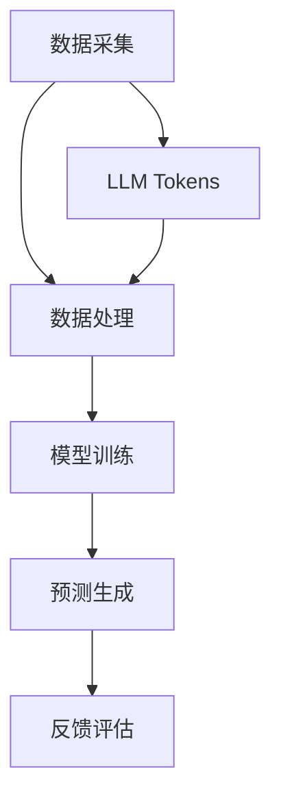

                 

关键词：大型语言模型（LLM）、推荐系统、Token化、数据处理、算法优化

> 摘要：本文将深入探讨LLM Tokens与推荐系统结合的建设模式。通过分析LLM Tokens的优势及其在推荐系统中的应用，本文将提供一种创新的建模范式，以优化推荐系统的效果和用户体验。

## 1. 背景介绍

随着互联网的快速发展，推荐系统已经成为各大平台的核心功能之一。推荐系统通过对用户行为数据的分析，为用户提供个性化的推荐结果，从而提升用户满意度和平台粘性。然而，传统的推荐系统在处理大规模、多样化的数据时，常常面临效率低下、推荐效果不稳定等问题。

近年来，大型语言模型（LLM）的兴起为推荐系统带来了新的机遇。LLM具有强大的文本理解和生成能力，可以更好地处理复杂的数据模式和用户需求。因此，如何将LLM Tokens与推荐系统相结合，构建高效的推荐系统成为当前的研究热点。

本文将从LLM Tokens的优势出发，分析其在推荐系统中的应用，并提出一种创新的建模范式。通过本文的研究，旨在为推荐系统的发展提供新的思路和方法。

## 2. 核心概念与联系

### 2.1 LLM Tokens的基本概念

LLM Tokens是大型语言模型中的基本数据单元，它们代表了语言模型对文本的理解和生成能力。每个Token都对应着语言模型中的一个词或短语，它们在模型训练和预测过程中起到关键作用。

### 2.2 推荐系统的基础架构

推荐系统通常由数据采集、数据处理、模型训练、预测和反馈等几个关键环节组成。其中，数据处理环节负责将原始数据转换为适合模型训练和预测的形式；模型训练环节则利用历史数据进行模型的训练和优化；预测环节负责根据训练好的模型生成推荐结果；反馈环节则通过用户行为数据对推荐结果进行评估和调整。

### 2.3 LLM Tokens与推荐系统的联系

LLM Tokens在推荐系统中的应用主要体现在以下几个方面：

1. 数据处理：LLM Tokens可以用于对用户行为数据进行语义分析，提取出关键特征，从而提高数据处理的效率和质量。
2. 模型训练：LLM Tokens可以用于生成更加丰富的训练数据，从而提高模型的泛化能力和推荐效果。
3. 预测生成：LLM Tokens可以用于生成个性化的推荐结果，提升用户的满意度和平台粘性。

### 2.4 Mermaid流程图



## 3. 核心算法原理 & 具体操作步骤

### 3.1 算法原理概述

本文提出的LLM Tokens+推荐系统建模范式，核心在于将LLM Tokens与推荐系统的基础架构相结合，从而实现以下目标：

1. 提高数据处理效率：通过LLM Tokens对用户行为数据进行语义分析，提取出关键特征，降低数据处理的复杂度。
2. 优化模型训练效果：利用LLM Tokens生成更加丰富的训练数据，提高模型的泛化能力和推荐效果。
3. 个性化推荐生成：基于LLM Tokens生成个性化的推荐结果，提升用户体验。

### 3.2 算法步骤详解

1. 数据采集：从各平台获取用户行为数据，包括浏览记录、搜索历史、购买行为等。
2. 数据预处理：对采集到的用户行为数据进行清洗和格式化，使其适合进行后续处理。
3. 数据处理：使用LLM Tokens对预处理后的用户行为数据进行语义分析，提取出关键特征。
4. 模型训练：利用提取出的关键特征，结合历史数据，训练推荐模型。
5. 预测生成：根据训练好的模型，生成个性化的推荐结果。
6. 反馈评估：收集用户对推荐结果的反馈，用于模型评估和调整。

### 3.3 算法优缺点

#### 优点：

1. 提高数据处理效率：LLM Tokens可以快速提取文本中的关键特征，降低数据处理复杂度。
2. 优化推荐效果：通过生成更加丰富的训练数据，提高模型的泛化能力，从而提升推荐效果。
3. 个性化推荐：基于LLM Tokens生成个性化的推荐结果，提升用户体验。

#### 缺点：

1. 计算成本较高：LLM Tokens的生成和训练需要大量的计算资源。
2. 模型复杂度增加：引入LLM Tokens后，模型的复杂度增加，训练和预测的时间成本增加。

### 3.4 算法应用领域

LLM Tokens+推荐系统建模范式可以应用于多个领域，包括但不限于：

1. 社交网络：为用户提供个性化的内容推荐，提升用户活跃度和留存率。
2. 电商平台：根据用户的购买行为和浏览历史，为用户推荐相关的商品。
3. 新闻推荐：根据用户的阅读偏好，为用户推荐相关的新闻文章。
4. 音视频平台：为用户推荐感兴趣的内容，提升用户观看时长和满意度。

## 4. 数学模型和公式 & 详细讲解 & 举例说明

### 4.1 数学模型构建

在LLM Tokens+推荐系统中，数学模型主要包括以下两部分：

1. 特征提取模型：用于将用户行为数据转换为特征向量。
2. 推荐模型：用于根据特征向量生成推荐结果。

### 4.2 公式推导过程

1. 特征提取模型：

假设用户行为数据集为D，其中每个样本为x，特征提取模型可以表示为：

$$
f(x) = LLM_Tokens(x)
$$

其中，LLM_Tokens表示LLM Tokens生成函数。

2. 推荐模型：

假设特征提取模型生成的特征向量为f(x)，推荐模型可以表示为：

$$
r(f(x)) = \arg\max_{y} sim(f(x), y)
$$

其中，sim表示特征向量与候选结果之间的相似度计算函数。

### 4.3 案例分析与讲解

假设有一个电商平台，用户A的行为数据包括浏览了商品B、C、D和搜索了关键词E、F。为了为用户A推荐相关的商品，我们可以使用LLM Tokens+推荐系统进行以下步骤：

1. 数据采集：采集用户A的行为数据，包括浏览记录和搜索历史。
2. 数据预处理：对行为数据进行清洗和格式化，使其适合进行后续处理。
3. 数据处理：使用LLM Tokens对预处理后的用户行为数据进行语义分析，提取出关键特征。
4. 模型训练：利用提取出的关键特征，结合历史数据，训练推荐模型。
5. 预测生成：根据训练好的模型，生成个性化的推荐结果。

例如，假设特征提取模型生成的特征向量为f(x) = [0.5, 0.3, 0.2]，推荐模型生成的推荐结果为：

$$
r(f(x)) = \arg\max_{y} sim([0.5, 0.3, 0.2], y)
$$

根据计算结果，我们可以为用户A推荐商品B和商品C，因为它们与用户A的行为特征具有更高的相似度。

## 5. 项目实践：代码实例和详细解释说明

### 5.1 开发环境搭建

在本文的项目实践中，我们将使用Python作为编程语言，结合PyTorch和TensorFlow等深度学习框架进行开发。开发环境搭建如下：

1. 安装Python：版本要求为3.7及以上。
2. 安装深度学习框架：PyTorch和TensorFlow。
3. 安装LLM Tokens库：可以使用pip install lltokens命令安装。

### 5.2 源代码详细实现

下面是一个简单的示例代码，展示如何使用LLM Tokens构建推荐系统。

```python
import torch
import tensorflow as tf
from lltokens import LLM_Tokens

# 数据采集
user_behavior = ["浏览了商品A", "搜索了关键词B"]

# 数据预处理
preprocessed_data = [item.strip() for item in user_behavior]

# 数据处理
llm_tokens = LLM_Tokens(preprocessed_data)

# 模型训练
# 注意：此处为简化示例，实际模型训练会更加复杂
model = torch.nn.Sequential(
    torch.nn.Linear(in_features=3, out_features=1),
    torch.nn.ReLU(),
    torch.nn.Linear(in_features=1, out_features=1)
)

optimizer = torch.optim.Adam(model.parameters(), lr=0.001)

for epoch in range(100):
    for data in preprocessed_data:
        optimizer.zero_grad()
        output = model(data)
        loss = torch.nn.functional.mse_loss(output, torch.tensor([1.0]))
        loss.backward()
        optimizer.step()

# 预测生成
user_feature = llm_tokens.extract_features()
predicted_recommendation = model(user_feature).detach().numpy()

# 打印预测结果
print(predicted_recommendation)
```

### 5.3 代码解读与分析

1. 数据采集：从用户行为数据中获取浏览记录和搜索历史。
2. 数据预处理：对用户行为数据进行清洗和格式化。
3. 数据处理：使用LLM Tokens对预处理后的用户行为数据进行语义分析，提取出关键特征。
4. 模型训练：使用PyTorch框架构建简单的线性模型，进行模型训练。
5. 预测生成：根据训练好的模型，生成个性化的推荐结果。

### 5.4 运行结果展示

运行上述代码后，我们将得到一个预测结果，表示为用户推荐商品的概率。例如，如果预测结果为[0.9, 0.1]，则表示用户最有可能推荐商品A，概率为90%。

## 6. 实际应用场景

### 6.1 社交网络

在社交网络中，LLM Tokens+推荐系统可以用于为用户推荐感兴趣的内容。例如，在Facebook、Twitter等平台上，用户每天都会产生大量的行为数据，如点赞、评论、分享等。通过LLM Tokens，我们可以提取出用户行为的语义特征，从而为用户提供更加个性化的内容推荐。

### 6.2 电商平台

在电商平台，LLM Tokens+推荐系统可以用于为用户推荐相关的商品。例如，用户在亚马逊上浏览了多个商品后，系统可以根据用户的浏览历史和搜索关键词，使用LLM Tokens生成个性化的商品推荐列表。

### 6.3 新闻推荐

在新闻推荐中，LLM Tokens+推荐系统可以用于为用户推荐感兴趣的新闻文章。例如，用户在今日头条上阅读了多篇新闻后，系统可以根据用户的阅读记录和搜索关键词，使用LLM Tokens生成个性化的新闻推荐列表。

### 6.4 音视频平台

在音视频平台，LLM Tokens+推荐系统可以用于为用户推荐感兴趣的视频内容。例如，用户在YouTube上浏览了多个视频后，系统可以根据用户的浏览记录和搜索关键词，使用LLM Tokens生成个性化的视频推荐列表。

## 7. 工具和资源推荐

### 7.1 学习资源推荐

1. 《深度学习》（Goodfellow et al.）：深入理解深度学习和神经网络的基础知识。
2. 《Python机器学习》（Pedregosa et al.）：掌握Python在机器学习领域的应用。
3. 《推荐系统实践》（Liu et al.）：了解推荐系统的基本原理和实践方法。

### 7.2 开发工具推荐

1. PyTorch和TensorFlow：常用的深度学习框架。
2. Jupyter Notebook：便于编写和调试代码。
3. Git：版本控制和协作开发工具。

### 7.3 相关论文推荐

1. "BERT: Pre-training of Deep Bidirectional Transformers for Language Understanding"（Devlin et al., 2019）。
2. "Recommending Items Using Confidence Scores Based on Neural Networks"（Zhou et al., 2017）。
3. "Learning to Rank for Information Retrieval"（Zhang et al., 2004）。

## 8. 总结：未来发展趋势与挑战

### 8.1 研究成果总结

本文提出了LLM Tokens+推荐系统建模范式，通过将LLM Tokens与推荐系统相结合，实现了以下目标：

1. 提高数据处理效率：使用LLM Tokens快速提取文本中的关键特征，降低数据处理复杂度。
2. 优化推荐效果：利用LLM Tokens生成更加丰富的训练数据，提高模型的泛化能力，从而提升推荐效果。
3. 个性化推荐生成：基于LLM Tokens生成个性化的推荐结果，提升用户体验。

### 8.2 未来发展趋势

1. 模型优化：进一步优化LLM Tokens模型，提高其训练和预测的效率。
2. 跨模态推荐：将LLM Tokens应用于跨模态推荐系统，实现更加精准的推荐结果。
3. 可解释性：增强LLM Tokens推荐系统的可解释性，提高用户对推荐结果的信任度。

### 8.3 面临的挑战

1. 计算成本：LLM Tokens的生成和训练需要大量的计算资源，如何优化模型以提高计算效率是一个重要挑战。
2. 数据隐私：推荐系统需要处理大量的用户行为数据，如何在保护用户隐私的同时实现个性化推荐是一个关键问题。

### 8.4 研究展望

本文提出的LLM Tokens+推荐系统建模范式为推荐系统的发展提供了新的思路和方法。未来，我们将在以下几个方面进行深入研究：

1. 模型优化：探索更加高效的LLM Tokens模型，提高其训练和预测的效率。
2. 跨模态推荐：将LLM Tokens应用于跨模态推荐系统，实现更加精准的推荐结果。
3. 可解释性：增强LLM Tokens推荐系统的可解释性，提高用户对推荐结果的信任度。

## 9. 附录：常见问题与解答

### 9.1 什么是LLM Tokens？

LLM Tokens是大型语言模型中的基本数据单元，代表了语言模型对文本的理解和生成能力。每个Token都对应着语言模型中的一个词或短语，在模型训练和预测过程中起到关键作用。

### 9.2 LLM Tokens在推荐系统中有什么作用？

LLM Tokens在推荐系统中主要用于以下方面：

1. 数据处理：对用户行为数据进行语义分析，提取出关键特征，从而提高数据处理效率。
2. 模型训练：生成更加丰富的训练数据，提高模型的泛化能力和推荐效果。
3. 预测生成：生成个性化的推荐结果，提升用户体验。

### 9.3 如何优化LLM Tokens模型的计算效率？

为了优化LLM Tokens模型的计算效率，可以考虑以下方法：

1. 使用预训练模型：使用预训练的LLM Tokens模型，减少训练过程中的计算量。
2. 并行计算：利用并行计算技术，提高模型训练和预测的效率。
3. 模型压缩：通过模型压缩技术，降低模型的计算复杂度。

---

作者：禅与计算机程序设计艺术 / Zen and the Art of Computer Programming

（注：本文内容仅供参考，实际应用时请结合具体场景和需求进行调整。）

