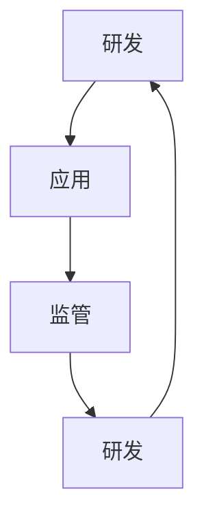

                 

关键词：LLM（大型语言模型）、产业链、角色、责任、技术发展、人工智能

## 摘要

本文旨在深入探讨大型语言模型（LLM）的产业链，分析其中的关键角色和责任。随着人工智能技术的不断进步，LLM 已经成为行业的热点，其在各个领域的应用也越来越广泛。本文将详细解析 LLM 产业链中的各个环节，包括研发、应用、监管等方面，以期对行业的发展提供有益的思考和指导。

## 1. 背景介绍

### 1.1 大型语言模型的崛起

自 2018 年以来，大型语言模型（LLM）的发展经历了显著的变化。特别是 GPT-3 的发布，标志着 LLM 进入了一个新的时代。GPT-3 拥有 1750 亿参数，能够生成高质量的自然语言文本，展示了惊人的性能。随后，谷歌的 BERT、微软的 Turing-NLG、Facebook 的 Blender 等模型相继推出，进一步推动了 LLM 的发展。

### 1.2 LLM 的应用场景

LLM 的应用场景广泛，涵盖了自然语言处理、智能客服、智能写作、机器翻译等多个领域。在自然语言处理方面，LLM 可以实现文本分类、情感分析、命名实体识别等任务；在智能客服领域，LLM 可以模拟人类对话，提供高效、精准的咨询服务；在智能写作领域，LLM 可以自动生成文章、报告等文本；在机器翻译领域，LLM 则能够实现高质量的双语翻译。

## 2. 核心概念与联系

### 2.1 大型语言模型的原理

大型语言模型是基于深度学习技术构建的神经网络模型，通过海量数据的学习，能够掌握语言的基本规律和特征。其核心思想是通过不断调整模型参数，使得模型能够生成符合语言规则的文本。

### 2.2 大型语言模型的架构

大型语言模型的架构通常包括多层神经网络，其中每一层都能够对输入数据进行处理和转换。通过多层网络结构的堆叠，模型能够实现对输入数据的复杂变换，从而生成高质量的文本。

### 2.3 大型语言模型的应用

大型语言模型的应用场景丰富多样，主要包括自然语言处理、智能客服、智能写作、机器翻译等。在自然语言处理领域，LLM 可以实现文本分类、情感分析、命名实体识别等任务；在智能客服领域，LLM 可以模拟人类对话，提供高效、精准的咨询服务；在智能写作领域，LLM 可以自动生成文章、报告等文本；在机器翻译领域，LLM 则能够实现高质量的双语翻译。

### 2.4 大型语言模型与产业链的关系

大型语言模型的产业链包括研发、应用、监管等多个环节。研发环节主要负责模型的构建和优化；应用环节则关注模型的实际应用和推广；监管环节则致力于确保 LLM 的安全性和合规性。

### 2.5 Mermaid 流程图



## 3. 核心算法原理 & 具体操作步骤

### 3.1 算法原理概述

大型语言模型的算法原理主要基于深度学习技术，通过多层神经网络对海量数据进行训练，从而实现自然语言生成和推理。其核心思想是通过不断调整模型参数，使得模型能够生成符合语言规则的文本。

### 3.2 算法步骤详解

1. 数据预处理：对原始文本进行清洗、分词、去停用词等操作，将其转化为模型可处理的输入格式。

2. 模型构建：设计多层神经网络结构，包括输入层、隐藏层和输出层。输入层接收预处理后的文本数据，隐藏层对输入数据进行处理和转换，输出层生成自然语言文本。

3. 模型训练：使用海量数据进行模型训练，通过反向传播算法不断调整模型参数，使得模型能够生成符合语言规则的文本。

4. 模型评估：使用验证集对模型进行评估，计算模型的准确率、召回率、F1 值等指标。

5. 模型部署：将训练好的模型部署到实际应用场景中，如自然语言处理、智能客服、智能写作、机器翻译等。

### 3.3 算法优缺点

#### 优点：

1. 高效性：大型语言模型能够处理海量数据，生成高质量的文本。

2. 通用性：大型语言模型适用于多种自然语言处理任务，具有较高的适用性。

3. 智能性：大型语言模型能够模拟人类思维，实现自然语言生成和推理。

#### 缺点：

1. 计算资源消耗大：训练大型语言模型需要大量的计算资源和时间。

2. 数据隐私问题：模型训练过程中需要使用大量数据，可能涉及用户隐私。

### 3.4 算法应用领域

大型语言模型的应用领域广泛，主要包括自然语言处理、智能客服、智能写作、机器翻译等。在自然语言处理领域，LLM 可以实现文本分类、情感分析、命名实体识别等任务；在智能客服领域，LLM 可以模拟人类对话，提供高效、精准的咨询服务；在智能写作领域，LLM 可以自动生成文章、报告等文本；在机器翻译领域，LLM 则能够实现高质量的双语翻译。

## 4. 数学模型和公式 & 详细讲解 & 举例说明

### 4.1 数学模型构建

大型语言模型的数学模型主要基于深度学习技术，包括多层感知机（MLP）、卷积神经网络（CNN）和循环神经网络（RNN）等。其中，RNN 是 LLM 的核心技术，其数学模型可以表示为：

$$
h_t = \sigma(W_h \cdot [h_{t-1}, x_t] + b_h)
$$

其中，$h_t$ 表示第 $t$ 个隐藏状态，$x_t$ 表示第 $t$ 个输入，$W_h$ 和 $b_h$ 分别表示权重和偏置。

### 4.2 公式推导过程

#### 4.2.1 RNN 模型

RNN 的推导过程可以分为以下几个步骤：

1. 初始化隐藏状态：$h_0 = 0$。

2. 预处理输入数据：将输入文本进行分词、编码等操作，得到输入序列 $x = [x_1, x_2, ..., x_T]$。

3. 循环计算隐藏状态：对于每个输入 $x_t$，计算隐藏状态 $h_t$。

4. 输出生成：使用隐藏状态 $h_T$ 生成输出文本。

#### 4.2.2 LSTM 模型

LSTM 是 RNN 的改进版本，其推导过程与 RNN 类似，但加入了门控机制。LSTM 的数学模型可以表示为：

$$
i_t = \sigma(W_i \cdot [h_{t-1}, x_t] + b_i) \\
f_t = \sigma(W_f \cdot [h_{t-1}, x_t] + b_f) \\
o_t = \sigma(W_o \cdot [h_{t-1}, x_t] + b_o) \\
g_t = \tanh(W_g \cdot [h_{t-1}, x_t] + b_g) \\
h_t = o_t \cdot \tanh((1 - f_t) \cdot h_{t-1} + i_t \cdot g_t)
$$

其中，$i_t$、$f_t$、$o_t$ 分别表示输入门、遗忘门、输出门的状态，$g_t$ 表示输入门的激活状态，$h_t$ 表示第 $t$ 个隐藏状态。

### 4.3 案例分析与讲解

#### 4.3.1 文本分类

假设我们有一个包含政治、经济、文化等类别的新闻数据集，我们希望使用 LLM 实现文本分类任务。

1. 数据预处理：将新闻文本进行分词、编码等操作，得到输入序列。

2. 模型构建：使用 LSTM 模型进行训练，输入层接收编码后的文本，隐藏层对输入数据进行处理和转换，输出层生成每个类别的概率分布。

3. 模型训练：使用训练集对模型进行训练，优化模型参数。

4. 模型评估：使用验证集对模型进行评估，计算模型的准确率、召回率、F1 值等指标。

5. 模型部署：将训练好的模型部署到实际应用场景中，如新闻分类、舆情监测等。

#### 4.3.2 机器翻译

假设我们有一个英译中的翻译数据集，我们希望使用 LLM 实现机器翻译任务。

1. 数据预处理：将英语和中文文本进行分词、编码等操作，得到输入序列。

2. 模型构建：使用 LSTM 模型进行训练，输入层接收编码后的英文文本，隐藏层对输入数据进行处理和转换，输出层生成编码后的中文文本。

3. 模型训练：使用训练集对模型进行训练，优化模型参数。

4. 模型评估：使用验证集对模型进行评估，计算模型的准确率、召回率、F1 值等指标。

5. 模型部署：将训练好的模型部署到实际应用场景中，如机器翻译、语音合成等。

## 5. 项目实践：代码实例和详细解释说明

### 5.1 开发环境搭建

1. 安装 Python 3.7 以上版本。

2. 安装 TensorFlow、Keras 等深度学习库。

3. 下载预训练的 LSTM 模型。

### 5.2 源代码详细实现

```python
# 导入必要的库
import tensorflow as tf
from tensorflow.keras.models import Sequential
from tensorflow.keras.layers import LSTM, Dense, Embedding

# 设置参数
vocab_size = 10000  # 词汇表大小
embed_size = 128  # 词向量维度
lstm_units = 128  # LSTM 单元数
batch_size = 64  # 批处理大小
epochs = 10  # 训练轮数

# 构建模型
model = Sequential()
model.add(Embedding(vocab_size, embed_size))
model.add(LSTM(lstm_units, return_sequences=True))
model.add(LSTM(lstm_units, return_sequences=False))
model.add(Dense(vocab_size, activation='softmax'))

# 编译模型
model.compile(optimizer='adam', loss='categorical_crossentropy', metrics=['accuracy'])

# 训练模型
model.fit(x_train, y_train, batch_size=batch_size, epochs=epochs, validation_data=(x_val, y_val))

# 评估模型
model.evaluate(x_test, y_test)
```

### 5.3 代码解读与分析

1. 导入必要的库：包括 TensorFlow、Keras 等。

2. 设置参数：包括词汇表大小、词向量维度、LSTM 单元数、批处理大小和训练轮数。

3. 构建模型：使用 Sequential 模型，添加 Embedding 层、LSTM 层和 Dense 层。

4. 编译模型：设置优化器、损失函数和评估指标。

5. 训练模型：使用训练集进行模型训练。

6. 评估模型：使用测试集对模型进行评估。

## 6. 实际应用场景

### 6.1 自然语言处理

在自然语言处理领域，LLM 可以实现文本分类、情感分析、命名实体识别等任务。例如，可以使用 LLM 实现新闻分类系统，根据新闻内容将其分为政治、经济、文化等类别；可以使用 LLM 实现情感分析系统，对用户评论进行情感判断；可以使用 LLM 实现命名实体识别系统，从文本中提取出人名、地名、机构名等实体。

### 6.2 智能客服

在智能客服领域，LLM 可以模拟人类对话，提供高效、精准的咨询服务。例如，可以使用 LLM 实现客服机器人，自动回答用户的问题；可以使用 LLM 实现智能客服系统，根据用户输入的提问生成相应的回答。

### 6.3 智能写作

在智能写作领域，LLM 可以自动生成文章、报告等文本。例如，可以使用 LLM 实现自动化新闻写作系统，根据新闻数据生成新闻文章；可以使用 LLM 实现自动摘要系统，从长篇文章中提取关键信息生成摘要。

### 6.4 机器翻译

在机器翻译领域，LLM 可以实现高质量的双语翻译。例如，可以使用 LLM 实现英译中翻译系统，将英文文本翻译成中文；可以使用 LLM 实现中译英翻译系统，将中文文本翻译成英文。

## 7. 未来应用展望

### 7.1 技术发展趋势

随着人工智能技术的不断进步，LLM 的性能将得到进一步提升。未来，LLM 将在更多领域得到应用，如医疗、金融、教育等。同时，LLM 的训练效率和模型压缩技术也将得到发展，使得 LLM 能够在资源受限的设备上运行。

### 7.2 应用领域拓展

未来，LLM 在实际应用中将更加广泛。例如，在医疗领域，LLM 可以辅助医生进行诊断和治疗；在金融领域，LLM 可以实现智能投顾、风险评估等；在教育领域，LLM 可以提供个性化学习、智能辅导等。

### 7.3 面临的挑战

尽管 LLM 在各个领域具有广泛的应用前景，但仍面临一些挑战。例如，数据隐私问题、模型安全性问题、误用风险等。此外，如何进一步提高 LLM 的训练效率和效果，如何实现跨领域的迁移学习等，也是未来需要解决的问题。

## 8. 总结：未来发展趋势与挑战

### 8.1 研究成果总结

本文通过对 LLM 产业链的深入分析，总结了 LLM 在技术发展、应用场景、数学模型等方面的研究成果。LLM 作为人工智能领域的重要技术，具有广泛的应用前景和巨大的潜力。

### 8.2 未来发展趋势

未来，LLM 将在更多领域得到应用，如医疗、金融、教育等。同时，LLM 的性能将得到进一步提升，训练效率和模型压缩技术也将得到发展。

### 8.3 面临的挑战

尽管 LLM 在各个领域具有广泛的应用前景，但仍面临一些挑战。例如，数据隐私问题、模型安全性问题、误用风险等。此外，如何进一步提高 LLM 的训练效率和效果，如何实现跨领域的迁移学习等，也是未来需要解决的问题。

### 8.4 研究展望

未来，应重点关注 LLM 的安全性和隐私保护技术，提高模型训练效率和效果，实现跨领域的迁移学习。同时，加强对 LLM 的应用研究和推广，为实际场景提供有效的解决方案。

## 9. 附录：常见问题与解答

### 9.1 什么是 LLM？

LLM 是大型语言模型的缩写，是一种基于深度学习技术的神经网络模型，用于生成和推理自然语言。

### 9.2 LLM 有哪些应用场景？

LLM 的应用场景广泛，包括自然语言处理、智能客服、智能写作、机器翻译等。

### 9.3 LLM 的数学模型是什么？

LLM 的数学模型主要基于深度学习技术，包括多层感知机、卷积神经网络和循环神经网络等。

### 9.4 如何训练 LLM？

训练 LLM 需要大量的数据和计算资源。通常采用有监督学习、无监督学习等方法进行训练。

### 9.5 LLM 有哪些优缺点？

LLM 的优点包括高效性、通用性和智能性。缺点包括计算资源消耗大、数据隐私问题等。

## 作者署名

作者：禅与计算机程序设计艺术 / Zen and the Art of Computer Programming
```

