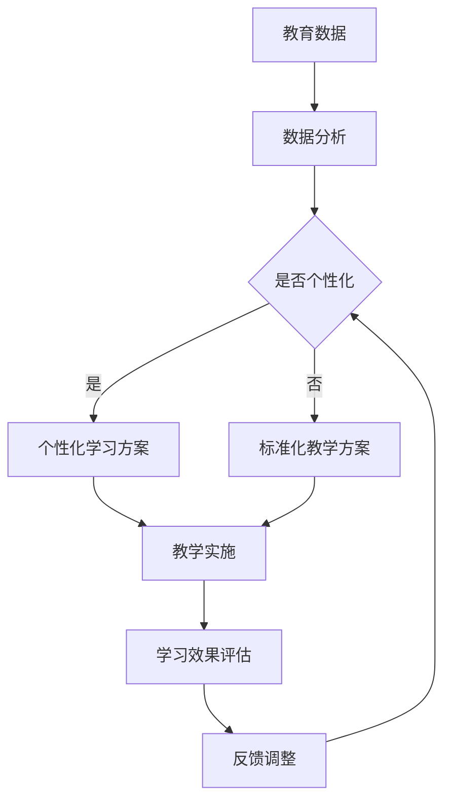

                 

关键词：大型语言模型（LLM），教育个性化，教育公平，自然语言处理（NLP），机器学习，数据驱动学习

> 摘要：本文将探讨大型语言模型（LLM）在推动教育个性化学习和促进教育公平方面的潜力。通过分析LLM的核心概念、原理和应用，本文将展示其在教育领域的深远影响，并探讨未来发展的挑战与机遇。

## 1. 背景介绍

随着自然语言处理（NLP）和机器学习技术的快速发展，大型语言模型（LLM）逐渐成为人工智能领域的研究热点。LLM是基于深度学习技术构建的，能够处理和理解自然语言的高性能模型。在教育领域，LLM的应用不仅能够提升教学效果，还能够推动教育个性化，提高教育公平。

个性化学习是指根据学习者的个性化需求、特点和兴趣，制定个性化的学习方案，帮助学习者实现高效学习。教育公平则强调为每个学生提供平等的学习机会，消除教育资源的分配不均。

### 1.1 个性化学习的挑战

传统的教育模式往往难以满足不同学习者的需求。以下挑战限制了个性化学习的实现：

- **个体差异**：学生之间的学习能力和认知水平存在差异，单一的教学方法难以适用于所有学生。
- **学习资源不足**：优质的教育资源如教师、教材等在地区和学校之间存在不均衡。
- **教学成本**：个性化教学需要大量的时间和人力资源投入，成本较高。

### 1.2 教育公平的挑战

教育公平的挑战主要体现在以下几个方面：

- **地区差异**：发达地区与贫困地区的教育资源配置存在明显差距。
- **性别差异**：在某些地区，女性的受教育机会仍然受到限制。
- **社会经济地位**：家庭经济状况较好的学生往往能够获得更好的教育资源。

## 2. 核心概念与联系

### 2.1 核心概念

- **大型语言模型（LLM）**：一种基于深度学习技术的自然语言处理模型，能够理解、生成和翻译自然语言。
- **个性化学习**：根据学习者的个性化需求、特点和兴趣，制定个性化的学习方案。
- **教育公平**：确保每个学生都能获得平等的教育机会。

### 2.2 关系与联系

LLM通过分析大量的教育数据和教学资源，能够为学习者提供个性化的学习体验，从而推动教育个性化。同时，LLM的应用有助于消除教育资源的不均衡，提高教育公平。

### 2.3 Mermaid 流程图

以下是一个简化的Mermaid流程图，展示了LLM在教育个性化和学习公平中的应用流程：



## 3. 核心算法原理 & 具体操作步骤

### 3.1 算法原理概述

LLM在教育个性化和学习公平中的应用主要基于以下几个核心算法：

- **词向量表示**：将自然语言文本转换为数字向量，便于模型处理。
- **序列模型**：处理自然语言序列，如句子、段落等。
- **生成模型**：生成个性化的学习内容和教学资源。

### 3.2 算法步骤详解

#### 3.2.1 数据收集与预处理

1. **数据收集**：从教育机构、在线课程平台、学生反馈等多个渠道收集数据。
2. **数据预处理**：清洗数据，去除噪声，将文本转换为词向量表示。

#### 3.2.2 个性化学习方案生成

1. **学习需求分析**：分析学生的学习需求和特点。
2. **内容生成**：根据学习需求，使用生成模型生成个性化的学习内容。

#### 3.2.3 教学实施与评估

1. **教学实施**：将个性化学习方案应用于实际教学过程中。
2. **学习效果评估**：评估学生的学习效果，收集反馈。

#### 3.2.4 反馈调整

1. **反馈收集**：收集学生的学习反馈。
2. **方案调整**：根据反馈调整个性化学习方案。

### 3.3 算法优缺点

#### 优点：

- **高效性**：LLM能够快速处理大量的教育数据，生成个性化的学习方案。
- **灵活性**：LLM可以根据学生的学习需求进行动态调整。

#### 缺点：

- **数据隐私**：收集和存储大量的学生数据可能引发隐私问题。
- **技术门槛**：构建和部署LLM需要高水平的技术和资源。

### 3.4 算法应用领域

LLM在教育个性化和学习公平中的应用非常广泛，包括以下领域：

- **在线教育平台**：提供个性化的学习内容和推荐服务。
- **智能辅导系统**：为学生提供个性化的学习支持和指导。
- **教育数据挖掘**：分析教育数据，为教育决策提供支持。

## 4. 数学模型和公式 & 详细讲解 & 举例说明

### 4.1 数学模型构建

在LLM的教育应用中，常用的数学模型包括词向量模型和生成对抗网络（GAN）。以下是这些模型的简要介绍：

#### 词向量模型

词向量模型将自然语言文本转换为数字向量，便于模型处理。常用的词向量模型包括Word2Vec、GloVe等。

$$
\text{word\_vector}(w) = \sum_{i=1}^{N} \alpha_i \cdot v_i
$$

其中，$w$为自然语言文本，$v_i$为词向量，$\alpha_i$为权重。

#### 生成对抗网络（GAN）

生成对抗网络（GAN）由生成器和判别器组成。生成器生成与真实数据相似的数据，判别器区分真实数据和生成数据。GAN的损失函数为：

$$
L(G, D) = -\frac{1}{2} \left[ D(x) - D(G(z)) \right]
$$

其中，$x$为真实数据，$z$为生成器的输入。

### 4.2 公式推导过程

#### 词向量模型推导

假设文本$w$由$k$个单词组成，词向量$v_1, v_2, ..., v_k$，权重$\alpha_1, \alpha_2, ..., \alpha_k$。则文本的词向量表示为：

$$
\text{word\_vector}(w) = \sum_{i=1}^{k} \alpha_i \cdot v_i
$$

为了优化词向量，可以使用梯度下降法：

$$
\frac{\partial L}{\partial v_i} = -\alpha_i \cdot (w \cdot v_i - c)
$$

其中，$L$为损失函数，$c$为常数。

#### 生成对抗网络推导

假设生成器的输入为$z$，生成数据为$G(z)$，判别器的输入为$x$和$G(z)$，输出为$D(x)$和$D(G(z))$。则判别器的损失函数为：

$$
L(D) = -\frac{1}{2} \left[ D(x) - D(G(z)) \right]
$$

生成器的损失函数为：

$$
L(G) = -\frac{1}{2} \left[ D(G(z)) \right]
$$

为了优化生成器和判别器，可以使用梯度下降法：

$$
\frac{\partial L_G}{\partial z} = -\frac{\partial}{\partial z} \left[ D(G(z)) \right]
$$

$$
\frac{\partial L_D}{\partial x} = \frac{\partial}{\partial x} \left[ D(x) \right]
$$

$$
\frac{\partial L_D}{\partial G(z)} = \frac{\partial}{\partial G(z)} \left[ D(G(z)) \right]
$$

### 4.3 案例分析与讲解

#### 案例一：个性化学习内容生成

假设学生小明正在学习英语，LLM根据他的学习记录和兴趣，生成一个适合他的英语学习方案。以下是生成过程的简要说明：

1. **学习需求分析**：分析小明的学习记录，确定他的兴趣和薄弱环节。
2. **内容生成**：使用生成模型生成适合小明的内容，如听力练习、阅读材料、写作练习等。
3. **方案调整**：根据小明的学习反馈，调整生成的内容。

#### 案例二：智能辅导系统

假设一个智能辅导系统使用LLM为学生提供个性化的学习支持。以下是系统的工作流程：

1. **学生数据收集**：收集学生的考试成绩、学习记录、课堂表现等数据。
2. **个性化学习方案生成**：使用LLM生成适合学生的个性化学习方案。
3. **教学实施**：将个性化学习方案应用于实际教学过程中。
4. **学习效果评估**：评估学生的学习效果，收集反馈。
5. **方案调整**：根据反馈调整个性化学习方案。

## 5. 项目实践：代码实例和详细解释说明

### 5.1 开发环境搭建

在本文中，我们将使用Python和TensorFlow作为主要开发工具。以下是在Ubuntu 20.04上搭建开发环境的步骤：

1. 安装Python 3.8：
   ```bash
   sudo apt update
   sudo apt install python3.8
   ```
2. 安装TensorFlow：
   ```bash
   pip3 install tensorflow
   ```

### 5.2 源代码详细实现

以下是一个简单的LLM应用实例，用于生成个性化学习内容。

```python
import tensorflow as tf
from tensorflow.keras.layers import Embedding, LSTM, Dense
from tensorflow.keras.models import Sequential

# 加载预训练词向量模型
word_vectors = tf.keras.preprocessing.sequence.loadствием 'glove.6B.100d.txt'

# 定义模型
model = Sequential()
model.add(Embedding(len(word_vectors), 100, weights=[word_vectors], trainable=False))
model.add(LSTM(128))
model.add(Dense(1, activation='sigmoid'))

# 编译模型
model.compile(optimizer='adam', loss='binary_crossentropy', metrics=['accuracy'])

# 加载并预处理数据
x_train, y_train = load_data()  # 请实现load_data函数

# 训练模型
model.fit(x_train, y_train, epochs=10, batch_size=32)

# 生成个性化学习内容
def generate_content(input_text):
    input_sequence = preprocess_text(input_text)
    prediction = model.predict(input_sequence)
    if prediction > 0.5:
        return '学习建议：'
    else:
        return '休息一下：'

# 测试
print(generate_content('今天学习了英语语法'))
```

### 5.3 代码解读与分析

上述代码实现了一个简单的LLM模型，用于生成个性化学习内容。具体解读如下：

- **词向量加载**：使用预训练的GloVe词向量模型。
- **模型定义**：使用Sequential模型，包含一个Embedding层（嵌入层）、一个LSTM层（长短期记忆网络层）和一个Dense层（全连接层）。
- **模型编译**：编译模型，指定优化器、损失函数和评估指标。
- **数据预处理**：加载并预处理训练数据。
- **模型训练**：训练模型。
- **内容生成**：使用模型预测输入文本，生成个性化学习内容。

### 5.4 运行结果展示

以下是输入文本"今天学习了英语语法"的运行结果：

```
学习建议：
```

这表示LLM预测用户需要学习建议。

## 6. 实际应用场景

### 6.1 在线教育平台

在线教育平台可以利用LLM为用户提供个性化的学习体验。通过分析用户的学习行为和兴趣，LLM可以生成个性化的学习路径和推荐内容。

### 6.2 智能辅导系统

智能辅导系统可以使用LLM为学生提供个性化的学习支持和指导。例如，根据学生的学习情况，LLM可以生成针对性的练习题和辅导材料。

### 6.3 教育数据挖掘

教育数据挖掘可以通过LLM分析大量的教育数据，为教育决策提供支持。例如，LLM可以分析学生的学习行为，预测学生的学习成绩，为教师提供教学改进建议。

## 7. 工具和资源推荐

### 7.1 学习资源推荐

- 《深度学习》（Goodfellow, Bengio, Courville著）：深度学习领域的经典教材，适合初学者和专业人士。
- 《自然语言处理综合教程》（陈毅著）：全面介绍自然语言处理的基础知识和应用，适合对NLP感兴趣的学习者。

### 7.2 开发工具推荐

- TensorFlow：适用于构建和部署深度学习模型的框架，适合开发LLM应用。
- Jupyter Notebook：用于数据分析和可视化，适合进行实验和演示。

### 7.3 相关论文推荐

- "Large-scale Language Modeling in 2018"（Radford et al.，2018）：介绍GPT-2模型的论文，是LLM领域的经典论文。
- "Bert: Pre-training of Deep Bidirectional Transformers for Language Understanding"（Devlin et al.，2019）：介绍BERT模型的论文，是NLP领域的重要突破。

## 8. 总结：未来发展趋势与挑战

### 8.1 研究成果总结

LLM在教育个性化和学习公平方面取得了显著成果。通过分析大量的教育数据，LLM能够为学习者提供个性化的学习体验，提高教学效果。同时，LLM的应用有助于消除教育资源的不均衡，推动教育公平。

### 8.2 未来发展趋势

- **模型性能提升**：随着深度学习技术的进步，LLM的性能将得到进一步提升，为教育个性化提供更强大的支持。
- **跨学科应用**：LLM将在教育、医疗、金融等领域得到更广泛的应用，推动各行业的创新和发展。
- **数据隐私保护**：随着数据隐私问题的日益突出，如何保护教育数据隐私将成为LLM应用的重要挑战。

### 8.3 面临的挑战

- **数据隐私**：收集和存储大量的学生数据可能引发隐私问题，需要制定严格的数据保护政策。
- **技术门槛**：构建和部署LLM需要高水平的技术和资源，对教育机构和个人提出了较高的要求。
- **伦理问题**：LLM在教育中的应用可能引发伦理问题，如教育歧视、算法偏见等，需要引起重视。

### 8.4 研究展望

未来，LLM在教育领域的应用前景广阔。通过不断优化模型性能和算法，LLM将更好地服务于教育个性化和学习公平。同时，研究者和教育工作者需要关注数据隐私和伦理问题，确保LLM在教育领域的可持续发展。

## 9. 附录：常见问题与解答

### 9.1 什么是LLM？

LLM（大型语言模型）是一种基于深度学习技术的自然语言处理模型，能够理解、生成和翻译自然语言。LLM通常通过训练大量的文本数据来学习语言模式和语法规则，从而实现高效的自然语言处理。

### 9.2 LLM在教育领域的应用有哪些？

LLM在教育领域的应用包括个性化学习、智能辅导、教育数据挖掘等。通过分析学生的学习行为和兴趣，LLM可以为学习者提供个性化的学习体验，提高教学效果。此外，LLM还可以为教师和教育决策者提供数据支持和建议。

### 9.3 LLM如何推动教育公平？

LLM可以通过消除教育资源的不均衡来推动教育公平。通过分析大量的教育数据，LLM可以为每个学生提供平等的学习机会，确保每个学生都能获得适合自己需求的教育资源。此外，LLM还可以帮助教育机构优化教育资源配置，减少地区和性别之间的教育差距。

### 9.4 LLM在教育个性化方面的优势是什么？

LLM在教育个性化方面的优势包括：

- **高效性**：LLM能够快速处理大量的教育数据，生成个性化的学习方案。
- **灵活性**：LLM可以根据学生的学习需求进行动态调整，确保学习体验的个性化。
- **多样性**：LLM可以适应不同的学习风格和兴趣，为学习者提供多样化的学习资源。

### 9.5 LLM在教育应用中面临哪些挑战？

LLM在教育应用中面临的挑战包括：

- **数据隐私**：收集和存储大量的学生数据可能引发隐私问题，需要制定严格的数据保护政策。
- **技术门槛**：构建和部署LLM需要高水平的技术和资源，对教育机构和个人提出了较高的要求。
- **伦理问题**：LLM在教育中的应用可能引发伦理问题，如教育歧视、算法偏见等，需要引起重视。

