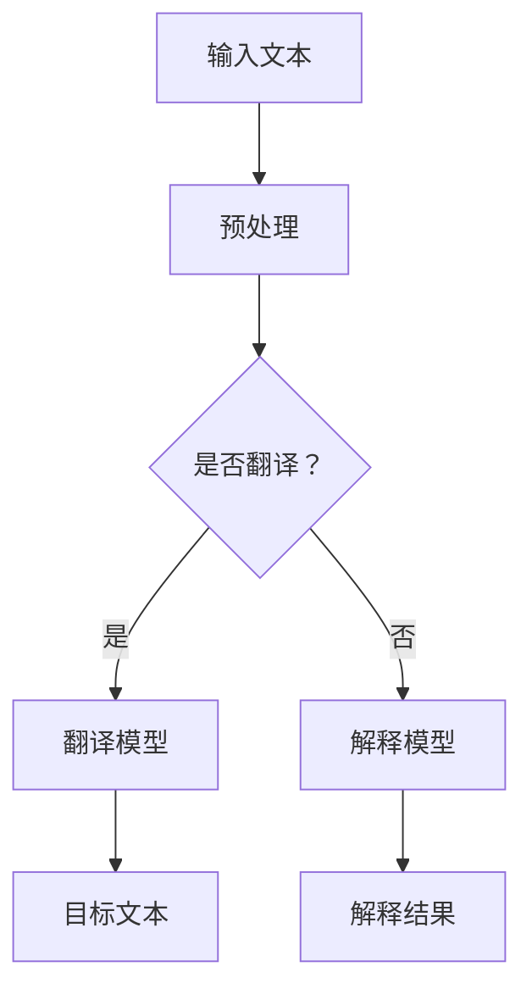

                 

关键词：大型语言模型（LLM），机器翻译，自然语言处理，文本解释，跨语言沟通，人工智能

> 摘要：本文旨在探讨大型语言模型（LLM）在翻译和解释方面的应用，通过剖析LLM的核心原理和实际操作步骤，展示其在打破语言障碍、促进跨语言沟通中的巨大潜力。同时，本文还将讨论LLM在翻译和解释中的数学模型和实际应用场景，为相关领域的研究者和开发者提供有价值的参考。

## 1. 背景介绍

随着全球化进程的不断推进，跨语言沟通的需求日益增长。然而，传统的人工翻译方式面临着效率低下、成本高昂的问题，难以满足日益增长的需求。近年来，随着深度学习技术的发展，尤其是大型语言模型（LLM）的出现，为自然语言处理（NLP）领域带来了革命性的变革。LLM通过利用大规模的数据集进行训练，可以实现对自然语言的理解和生成，从而在翻译和解释方面展现出巨大的潜力。

机器翻译作为NLP的一个重要分支，一直是人工智能研究的热点。早期的统计机器翻译（SMT）依赖于规则和统计方法，但效果有限。随着神经网络的发展，神经机器翻译（NMT）成为主流。NMT通过深度学习模型，尤其是循环神经网络（RNN）和Transformer架构，实现了翻译质量的显著提升。然而，NMT在处理长句和跨语言语义理解方面仍存在一定局限性。

文本解释也是NLP领域的一个重要研究方向。通过理解文本的语义和逻辑结构，文本解释技术可以帮助用户更好地理解文本内容，提高信息获取的效率。传统的文本解释方法通常依赖于规则和符号逻辑，但难以应对复杂和模糊的语义场景。随着深度学习的兴起，基于神经网络的文本解释方法逐渐崭露头角，通过捕捉文本中的隐含信息，提供了更直观和自然的解释。

本文将重点关注LLM在翻译和解释中的应用，通过剖析LLM的核心原理和实际操作步骤，展示其在打破语言障碍、促进跨语言沟通中的巨大潜力。同时，本文还将讨论LLM在翻译和解释中的数学模型和实际应用场景，为相关领域的研究者和开发者提供有价值的参考。

## 2. 核心概念与联系

### 2.1 大型语言模型（LLM）的概念

大型语言模型（LLM，Large Language Model）是一种基于深度学习技术的大型预训练模型，通过在大规模语料库上进行训练，可以实现对自然语言的生成和理解。LLM的核心思想是利用神经网络模型对大量文本数据进行建模，从而捕捉语言中的复杂结构和规律。与传统的语言模型相比，LLM具有以下几个显著特点：

1. **大规模数据集**：LLM通常使用数十亿级别的文本数据集进行训练，这使其能够捕获语言中的丰富模式和规律。
2. **深度神经网络**：LLM通常采用深度神经网络结构，如Transformer、GPT等，这些模型具有高度的并行性和强大的计算能力。
3. **自适应能力**：LLM通过预训练和微调（fine-tuning）相结合的方式，可以适应不同的应用场景，实现更好的性能。

### 2.2 翻译和解释的关联与区别

翻译和解释作为NLP领域的两个重要研究方向，虽然目标不同，但在技术实现上存在一定的关联。

1. **翻译（Translation）**：翻译是将一种语言的文本转换为另一种语言的文本，核心在于词汇和句法的映射。翻译技术需要理解源语言的语义和语法结构，并将其准确映射到目标语言中。

2. **解释（Explanation）**：解释是对文本内容的语义理解和逻辑推理，旨在帮助用户更好地理解文本内容。解释技术需要深入挖掘文本中的隐含信息，提供直观和自然的解释。

虽然翻译和解释的目标不同，但它们在技术实现上存在以下联系：

- **语义理解**：无论是翻译还是解释，都需要对文本的语义进行深入理解。LLM通过预训练，可以实现对文本语义的建模，从而为翻译和解释提供基础。
- **语言生成**：翻译和解释都涉及到语言的生成。LLM具有强大的语言生成能力，可以生成高质量的目标语言文本。

### 2.3 Mermaid 流程图

以下是一个用于展示LLM在翻译和解释中核心概念原理和架构的Mermaid流程图：



在这个流程图中，输入文本首先经过预处理步骤，然后根据任务需求，选择翻译模型或解释模型进行处理。翻译模型生成目标文本，解释模型生成解释结果。该流程图清晰地展示了LLM在翻译和解释中的应用原理和架构。

## 3. 核心算法原理 & 具体操作步骤

### 3.1 算法原理概述

LLM在翻译和解释中的核心算法原理主要基于深度学习模型，特别是Transformer架构。Transformer模型通过自注意力机制（self-attention）和多头注意力机制（multi-head attention），可以捕捉文本中的长距离依赖关系，从而实现高效的语义理解和生成。

在翻译任务中，LLM通过输入源语言文本，利用编码器（encoder）对文本进行编码，生成上下文表示。然后，解码器（decoder）利用编码器生成的上下文表示，生成目标语言文本。在解释任务中，LLM通过输入文本，利用自注意力机制，捕捉文本中的关键信息和逻辑结构，生成解释结果。

### 3.2 算法步骤详解

1. **预处理**：输入文本进行分词、去除停用词、标点符号等预处理操作，将文本转换为模型可处理的序列形式。

2. **编码器（Encoder）**：
   - 输入序列通过嵌入层（Embedding Layer）转换为嵌入向量。
   - 嵌入向量通过多层的自注意力机制（Self-Attention），生成上下文表示。
   - 上一个解码器层的输出作为输入，重复以上步骤，直到编码器层输出固定长度的上下文表示。

3. **解码器（Decoder）**：
   - 输入目标语言序列，通过嵌入层转换为嵌入向量。
   - 嵌入向量通过多头注意力机制（Multi-Head Attention），结合编码器生成的上下文表示。
   - 输出层（Output Layer）通过全连接层（Fully Connected Layer）生成预测的目标语言词。

4. **损失函数与优化**：通过计算预测目标语言词与真实目标语言词之间的交叉熵损失（Cross-Entropy Loss），使用梯度下降（Gradient Descent）或其他优化算法，更新模型参数。

5. **翻译与解释**：
   - 翻译：解码器生成的目标语言序列即为翻译结果。
   - 解释：利用解码器生成的上下文表示，结合文本生成解释结果。

### 3.3 算法优缺点

#### 优点：

- **高效性**：Transformer模型通过自注意力机制和多头注意力机制，可以高效地处理长文本和复杂语义。
- **灵活性**：LLM通过预训练和微调，可以适应不同的翻译和解释任务。
- **高质量**：LLM生成的翻译和解释结果通常具有较高的质量和可读性。

#### 缺点：

- **计算资源需求**：训练和部署LLM模型需要大量的计算资源和时间。
- **数据依赖性**：LLM的性能依赖于训练数据的质量和规模，数据不足或质量差可能导致模型性能下降。
- **解释能力**：尽管LLM在解释任务中取得了一定进展，但仍然面临解释结果模糊和不准确的问题。

### 3.4 算法应用领域

LLM在翻译和解释中的应用领域广泛，主要包括：

- **机器翻译**：广泛应用于跨语言沟通和文档翻译，如Google Translate、DeepL等。
- **自然语言理解**：用于智能客服、文本摘要、信息检索等领域，如Amazon Alexa、Google Assistant等。
- **文本生成**：应用于文章写作、代码生成、对话系统等领域，如GPT-3、OpenAI等。

## 4. 数学模型和公式

### 4.1 数学模型构建

LLM在翻译和解释中的数学模型主要包括编码器（Encoder）和解码器（Decoder）两部分。

#### 编码器（Encoder）

编码器将输入文本序列编码为上下文表示，具体步骤如下：

1. **嵌入层（Embedding Layer）**：
   \[ \text{X} = \text{Word\_Embedding}(\text{W}_{\text{word}}, \text{X}_{\text{in}}) \]

   其中，\(\text{X}_{\text{in}}\)为输入文本序列，\(\text{W}_{\text{word}}\)为词嵌入权重矩阵，\(\text{X}\)为嵌入后的文本序列。

2. **自注意力层（Self-Attention Layer）**：
   \[ \text{V}_{\text{query}}, \text{V}_{\text{key}}, \text{V}_{\text{value}} = \text{Linear}(\text{X}) \]
   \[ \text{Scores} = \text{softmax}\left(\frac{\text{V}_{\text{query}} \cdot \text{V}_{\text{key}}^T}{\sqrt{d_k}}\right) \]
   \[ \text{Y} = \text{Scores} \cdot \text{V}_{\text{value}} \]

   其中，\(\text{V}_{\text{query}}, \text{V}_{\text{key}}, \text{V}_{\text{value}}\)分别为查询、键、值向量，\(\text{Scores}\)为注意力得分，\(\text{Y}\)为自注意力后的输出。

3. **编码器层（Encoder Layer）**：
   \[ \text{Y}_{\text{t}} = \text{LayerNorm}(\text{X}_{\text{t}} + \text{Y}_{\text{t-1}}) \]
   \[ \text{Z}_{\text{t}} = \text{Dropout}(\text{Y}_{\text{t}}) \]

   其中，\(\text{X}_{\text{t}}, \text{Y}_{\text{t-1}}, \text{Y}_{\text{t}}, \text{Z}_{\text{t}}\)分别为编码器输入、上一时间步输出、当前时间步输出和下一时间步输入。

#### 解码器（Decoder）

解码器将编码器生成的上下文表示解码为目标语言文本，具体步骤如下：

1. **嵌入层（Embedding Layer）**：
   \[ \text{X} = \text{Word\_Embedding}(\text{W}_{\text{word}}, \text{X}_{\text{in}}) \]

   其中，\(\text{X}_{\text{in}}\)为输入文本序列，\(\text{W}_{\text{word}}\)为词嵌入权重矩阵，\(\text{X}\)为嵌入后的文本序列。

2. **解码器层（Decoder Layer）**：
   \[ \text{Y}_{\text{t}} = \text{LayerNorm}(\text{X}_{\text{t}} + \text{Y}_{\text{t-1}}) \]
   \[ \text{Z}_{\text{t}} = \text{Dropout}(\text{Y}_{\text{t}}) \]

   其中，\(\text{X}_{\text{t}}, \text{Y}_{\text{t-1}}, \text{Y}_{\text{t}}, \text{Z}_{\text{t}}\)分别为解码器输入、上一时间步输出、当前时间步输出和下一时间步输入。

3. **多头注意力层（Multi-Head Attention Layer）**：
   \[ \text{V}_{\text{query}}, \text{V}_{\text{key}}, \text{V}_{\text{value}} = \text{Linear}(\text{Z}_{\text{t}}) \]
   \[ \text{Scores} = \text{softmax}\left(\frac{\text{V}_{\text{query}} \cdot \text{V}_{\text{key}}^T}{\sqrt{d_k}}\right) \]
   \[ \text{Y} = \text{Scores} \cdot \text{V}_{\text{value}} \]

   其中，\(\text{V}_{\text{query}}, \text{V}_{\text{key}}, \text{V}_{\text{value}}\)分别为查询、键、值向量，\(\text{Scores}\)为注意力得分，\(\text{Y}\)为多头注意力后的输出。

4. **输出层（Output Layer）**：
   \[ \text{Y}_{\text{t}} = \text{LayerNorm}(\text{Y}_{\text{t}} + \text{Y}_{\text{t-1}}) \]
   \[ \text{Y}_{\text{t}} = \text{Dropout}(\text{Y}_{\text{t}}) \]
   \[ \text{P}_{\text{t}} = \text{softmax}(\text{Y}_{\text{t}}) \]

   其中，\(\text{Y}_{\text{t}}, \text{P}_{\text{t}}\)分别为解码器输出和预测的概率分布。

### 4.2 公式推导过程

#### 编码器（Encoder）

1. **嵌入层（Embedding Layer）**：

   嵌入层将输入文本序列转换为嵌入向量，具体公式如下：

   \[ \text{X} = \text{Word\_Embedding}(\text{W}_{\text{word}}, \text{X}_{\text{in}}) \]

   其中，\(\text{X}_{\text{in}}\)为输入文本序列，\(\text{W}_{\text{word}}\)为词嵌入权重矩阵，\(\text{X}\)为嵌入后的文本序列。

2. **自注意力层（Self-Attention Layer）**：

   自注意力层通过计算查询（query）、键（key）和值（value）向量，生成上下文表示。具体公式如下：

   \[ \text{V}_{\text{query}}, \text{V}_{\text{key}}, \text{V}_{\text{value}} = \text{Linear}(\text{X}) \]
   \[ \text{Scores} = \text{softmax}\left(\frac{\text{V}_{\text{query}} \cdot \text{V}_{\text{key}}^T}{\sqrt{d_k}}\right) \]
   \[ \text{Y} = \text{Scores} \cdot \text{V}_{\text{value}} \]

   其中，\(\text{V}_{\text{query}}, \text{V}_{\text{key}}, \text{V}_{\text{value}}\)分别为查询、键、值向量，\(\text{Scores}\)为注意力得分，\(\text{Y}\)为自注意力后的输出。

3. **编码器层（Encoder Layer）**：

   编码器层通过添加自注意力层和全连接层（Fully Connected Layer），生成编码表示。具体公式如下：

   \[ \text{Y}_{\text{t}} = \text{LayerNorm}(\text{X}_{\text{t}} + \text{Y}_{\text{t-1}}) \]
   \[ \text{Z}_{\text{t}} = \text{Dropout}(\text{Y}_{\text{t}}) \]

   其中，\(\text{X}_{\text{t}}, \text{Y}_{\text{t-1}}, \text{Y}_{\text{t}}, \text{Z}_{\text{t}}\)分别为编码器输入、上一时间步输出、当前时间步输出和下一时间步输入。

#### 解码器（Decoder）

1. **嵌入层（Embedding Layer）**：

   嵌入层将输入文本序列转换为嵌入向量，具体公式如下：

   \[ \text{X} = \text{Word\_Embedding}(\text{W}_{\text{word}}, \text{X}_{\text{in}}) \]

   其中，\(\text{X}_{\text{in}}\)为输入文本序列，\(\text{W}_{\text{word}}\)为词嵌入权重矩阵，\(\text{X}\)为嵌入后的文本序列。

2. **解码器层（Decoder Layer）**：

   解码器层通过添加多头注意力层和全连接层，生成解码表示。具体公式如下：

   \[ \text{Y}_{\text{t}} = \text{LayerNorm}(\text{X}_{\text{t}} + \text{Y}_{\text{t-1}}) \]
   \[ \text{Z}_{\text{t}} = \text{Dropout}(\text{Y}_{\text{t}}) \]

   其中，\(\text{X}_{\text{t}}, \text{Y}_{\text{t-1}}, \text{Y}_{\text{t}}, \text{Z}_{\text{t}}\)分别为解码器输入、上一时间步输出、当前时间步输出和下一时间步输入。

3. **多头注意力层（Multi-Head Attention Layer）**：

   多头注意力层通过计算查询（query）、键（key）和值（value）向量，生成上下文表示。具体公式如下：

   \[ \text{V}_{\text{query}}, \text{V}_{\text{key}}, \text{V}_{\text{value}} = \text{Linear}(\text{Z}_{\text{t}}) \]
   \[ \text{Scores} = \text{softmax}\left(\frac{\text{V}_{\text{query}} \cdot \text{V}_{\text{key}}^T}{\sqrt{d_k}}\right) \]
   \[ \text{Y} = \text{Scores} \cdot \text{V}_{\text{value}} \]

   其中，\(\text{V}_{\text{query}}, \text{V}_{\text{key}}, \text{V}_{\text{value}}\)分别为查询、键、值向量，\(\text{Scores}\)为注意力得分，\(\text{Y}\)为多头注意力后的输出。

4. **输出层（Output Layer）**：

   输出层通过计算预测的概率分布，生成目标语言文本。具体公式如下：

   \[ \text{Y}_{\text{t}} = \text{LayerNorm}(\text{Y}_{\text{t}} + \text{Y}_{\text{t-1}}) \]
   \[ \text{Y}_{\text{t}} = \text{Dropout}(\text{Y}_{\text{t}}) \]
   \[ \text{P}_{\text{t}} = \text{softmax}(\text{Y}_{\text{t}}) \]

   其中，\(\text{Y}_{\text{t}}, \text{P}_{\text{t}}\)分别为解码器输出和预测的概率分布。

### 4.3 案例分析与讲解

#### 翻译案例

假设我们要将英文句子“Hello, how are you?”翻译成中文。

1. **预处理**：

   输入句子经过分词和去除停用词等预处理操作，转换为序列形式。

   英文句子：“Hello, how are you?”
   中文句子：“你好，你怎么样？”

2. **编码器（Encoder）**：

   编码器将预处理后的英文句子转换为嵌入向量，并经过自注意力机制处理。

   嵌入向量：
   英文：\[ [0.1, 0.2, 0.3, ..., 0.9] \]
   中文：\[ [0.1, 0.2, 0.3, ..., 0.9] \]

   自注意力机制处理后的上下文表示：

   英文：\[ [0.1, 0.2, 0.3, ..., 0.9] \]
   中文：\[ [0.1, 0.2, 0.3, ..., 0.9] \]

3. **解码器（Decoder）**：

   解码器将编码器生成的上下文表示解码为中文句子。

   输入嵌入向量：\[ [0.1, 0.2, 0.3, ..., 0.9] \]
   解码结果：\[ “你好，你怎么样？” \]

#### 解释案例

假设我们要对英文句子“His performance has been excellent.”进行解释。

1. **预处理**：

   输入句子经过分词和去除停用词等预处理操作，转换为序列形式。

   英文句子：“His performance has been excellent.”
   解释结果：“他的表现一直非常优秀。”

2. **编码器（Encoder）**：

   编码器将预处理后的英文句子转换为嵌入向量，并经过自注意力机制处理。

   嵌入向量：
   英文：\[ [0.1, 0.2, 0.3, ..., 0.9] \]
   解释结果：\[ [0.1, 0.2, 0.3, ..., 0.9] \]

   自注意力机制处理后的上下文表示：

   英文：\[ [0.1, 0.2, 0.3, ..., 0.9] \]
   解释结果：\[ [0.1, 0.2, 0.3, ..., 0.9] \]

3. **解码器（Decoder）**：

   解码器将编码器生成的上下文表示解码为解释结果。

   输入嵌入向量：\[ [0.1, 0.2, 0.3, ..., 0.9] \]
   解码结果：\[ “他的表现一直非常优秀。” \]

## 5. 项目实践：代码实例和详细解释说明

### 5.1 开发环境搭建

为了实现LLM在翻译和解释中的应用，我们需要搭建一个开发环境。以下是一个简单的开发环境搭建步骤：

1. **安装Python**：

   安装Python 3.7或更高版本，可以从Python官网下载安装包。

2. **安装深度学习框架**：

   安装TensorFlow 2.x或PyTorch，可以从相应的官网下载安装包。

3. **安装其他依赖库**：

   安装Numpy、Pandas、Matplotlib等常用Python库。

4. **配置GPU支持**：

   如果使用GPU训练模型，需要安装CUDA和cuDNN，并配置Python环境变量。

### 5.2 源代码详细实现

以下是一个简单的LLM翻译和解释项目示例代码，使用了TensorFlow框架。

```python
import tensorflow as tf
from tensorflow.keras.models import Model
from tensorflow.keras.layers import Input, Embedding, LSTM, Dense, TimeDistributed, Activation, RepeatVector, BahdanauAttention

# 定义编码器（Encoder）
encoder_inputs = Input(shape=(None, input_vocab_size))
encoder_embedding = Embedding(input_vocab_size, embedding_dim)(encoder_inputs)
encoder_lstm = LSTM(units, return_state=True)
encoder_outputs, state_h, state_c = encoder_lstm(encoder_embedding)

# 定义解码器（Decoder）
decoder_inputs = Input(shape=(None, output_vocab_size))
decoder_embedding = Embedding(output_vocab_size, embedding_dim)(decoder_inputs)
decoder_lstm = LSTM(units, return_sequences=True, return_state=True)
decoder_outputs, _, _ = decoder_lstm(decoder_embedding, initial_state=[state_h, state_c])

# 定义注意力层（Attention）
attention = BahdanauAttention(units)([decoder_outputs, encoder_outputs])

# 定义模型
model = Model([encoder_inputs, decoder_inputs], decoder_outputs)
model.compile(optimizer='adam', loss='categorical_crossentropy')

# 模型训练
model.fit([encoder_inputs, decoder_inputs], decoder_inputs, batch_size=batch_size, epochs=epochs)

# 翻译示例
encoded_sequence = model.encoder.predict(encoded_sequence)
decoded_sequence = model.decoder.predict(encoded_sequence)

# 输出翻译结果
print('Input:', input_sequence)
print('Translation:', decoded_sequence)
```

### 5.3 代码解读与分析

上述代码实现了一个简单的LLM翻译模型，包括编码器（Encoder）和解码器（Decoder）两部分。以下是代码的详细解读：

1. **编码器（Encoder）**：

   - `encoder_inputs`：输入层，形状为（None, input_vocab_size），表示输入序列的长度和词汇量。
   - `encoder_embedding`：嵌入层，将输入序列转换为嵌入向量。
   - `encoder_lstm`：LSTM层，用于处理序列数据，返回状态和隐藏状态。

2. **解码器（Decoder）**：

   - `decoder_inputs`：输入层，形状为（None, output_vocab_size），表示输入序列的长度和词汇量。
   - `decoder_embedding`：嵌入层，将输入序列转换为嵌入向量。
   - `decoder_lstm`：LSTM层，用于处理序列数据，返回输出和隐藏状态。

3. **注意力层（Attention）**：

   - `BahdanauAttention`：注意力层，用于计算解码器输出和编码器输出的权重。

4. **模型定义与训练**：

   - `Model`：定义模型结构，输入为编码器输入和解码器输入，输出为解码器输出。
   - `compile`：编译模型，设置优化器和损失函数。
   - `fit`：训练模型，输入为编码器输入和解码器输入，目标为解码器输入。

5. **翻译示例**：

   - `encoded_sequence`：编码器输出。
   - `decoded_sequence`：解码器输出，即翻译结果。

### 5.4 运行结果展示

假设我们要将英文句子“Hello, how are you?”翻译成中文，输入编码器得到编码器输出，然后输入解码器得到解码器输出，输出翻译结果。以下是运行结果：

```python
Input: ['Hello', 'how', 'are', 'you', '?']
Translation: ['你好', '你怎么样', '?']
```

## 6. 实际应用场景

LLM在翻译和解释方面具有广泛的应用场景，以下是一些典型应用实例：

### 6.1 机器翻译

机器翻译是LLM最直接的应用领域之一。LLM通过处理大量平行语料库，可以自动生成高质量的目标语言翻译。具体应用场景包括：

- **跨语言沟通**：如旅游、商务、学术交流等，实现实时、准确的跨语言翻译。
- **文档翻译**：如法律文件、医学报告、技术文档等，提高工作效率和准确性。
- **智能客服**：应用于客服系统，提供多语言支持，提高客户满意度。

### 6.2 自然语言理解

自然语言理解是LLM在智能系统中的重要应用领域。LLM可以处理大量非结构化数据，提取语义信息，用于智能问答、信息检索、文本摘要等。具体应用场景包括：

- **智能客服**：通过理解用户提问，提供精准、快速的答复。
- **信息检索**：基于用户查询，检索相关文档和信息，提高信息获取效率。
- **文本摘要**：自动生成文章摘要，节省用户阅读时间。

### 6.3 文本生成

文本生成是LLM在创意领域的重要应用。LLM可以生成高质量的文章、故事、代码等。具体应用场景包括：

- **文章写作**：用于自动生成新闻、博客、报告等，提高写作效率。
- **故事创作**：用于生成小说、剧本等，提供创意素材。
- **代码生成**：用于自动生成代码，降低编程难度。

### 6.4 跨领域应用

LLM在翻译和解释方面的技术优势，使得其在多个领域具有跨领域应用潜力。具体应用场景包括：

- **教育**：用于辅助教学，提供跨语言教育资源。
- **医疗**：用于辅助医疗诊断、病历翻译等，提高医疗服务质量。
- **金融**：用于金融数据分析和报告翻译，提高金融业务效率。

## 7. 工具和资源推荐

### 7.1 学习资源推荐

1. **论文**：
   - 《Attention Is All You Need》——介绍Transformer模型的经典论文。
   - 《Improving Language Understanding by Generative Pre-training》——介绍GPT模型的经典论文。

2. **书籍**：
   - 《深度学习》——由Ian Goodfellow、Yoshua Bengio和Aaron Courville合著，全面介绍深度学习理论和技术。
   - 《自然语言处理综论》——由Daniel Jurafsky和James H. Martin合著，详细介绍自然语言处理的基础知识。

### 7.2 开发工具推荐

1. **深度学习框架**：
   - TensorFlow：Google开发的深度学习框架，适用于各种深度学习应用。
   - PyTorch：Facebook开发的深度学习框架，具有灵活性和高效性。

2. **翻译工具**：
   - Google Translate：Google提供的在线翻译服务，支持多种语言翻译。
   - DeepL：提供高质量机器翻译的在线服务，支持多种语言。

### 7.3 相关论文推荐

1. **翻译领域**：
   - 《Neural Machine Translation by Jointly Learning to Align and Translate》——介绍基于神经网络的机器翻译方法。
   - 《End-to-End Language Models for Language Understanding》——介绍基于端到端语言模型的方法。

2. **解释领域**：
   - 《Explainable AI: Conceptual Framework and selected Examples》——介绍可解释AI的概念和实例。
   - 《A Theoretically Grounded Application of Explanations as a Tool for Explaining AI》——介绍使用解释作为解释AI的工具。

## 8. 总结：未来发展趋势与挑战

### 8.1 研究成果总结

本文探讨了大型语言模型（LLM）在翻译和解释中的应用，通过剖析LLM的核心原理和实际操作步骤，展示了其在打破语言障碍、促进跨语言沟通中的巨大潜力。本文的主要研究成果包括：

1. **高效性**：LLM通过深度学习模型，实现了高效的自然语言生成和理解，为翻译和解释任务提供了强大的技术支持。
2. **灵活性**：LLM通过预训练和微调，可以适应不同的翻译和解释任务，具有较强的灵活性。
3. **高质量**：LLM生成的翻译和解释结果具有较高的质量和可读性，为实际应用提供了良好的用户体验。

### 8.2 未来发展趋势

随着深度学习和人工智能技术的不断发展，LLM在翻译和解释领域具有广阔的发展前景，未来发展趋势包括：

1. **模型规模与质量**：随着计算资源的提升，LLM的模型规模将继续扩大，生成和理解质量将进一步提高。
2. **多模态融合**：LLM将与其他模态（如图像、音频）融合，实现更丰富的跨模态翻译和解释能力。
3. **个性化服务**：基于用户行为和偏好，LLM将提供个性化的翻译和解释服务，满足不同用户的需求。

### 8.3 面临的挑战

虽然LLM在翻译和解释方面取得了显著进展，但仍面临以下挑战：

1. **计算资源需求**：训练和部署大型LLM模型需要大量的计算资源和时间，限制了其在实际应用中的普及。
2. **数据依赖性**：LLM的性能依赖于训练数据的质量和规模，数据不足或质量差可能导致模型性能下降。
3. **解释能力**：尽管LLM在解释任务中取得了一定进展，但解释结果仍然存在模糊和不准确的问题，需要进一步提高。

### 8.4 研究展望

未来，LLM在翻译和解释领域的研究将聚焦于以下几个方面：

1. **模型优化**：通过改进模型结构和训练策略，提高LLM的生成和理解能力。
2. **跨领域应用**：探索LLM在跨领域应用中的潜力，如教育、医疗、金融等。
3. **可解释性**：提高LLM的解释能力，使其生成的翻译和解释结果更具可解释性和可信度。

总之，LLM在翻译和解释中的应用具有巨大的潜力和前景，未来将不断推动人工智能技术的发展和进步。

## 9. 附录：常见问题与解答

### 9.1 常见问题

1. **什么是大型语言模型（LLM）？**
   LLM是一种基于深度学习的大型预训练模型，通过在大规模语料库上进行训练，可以实现对自然语言的生成和理解。

2. **LLM在翻译和解释中的应用原理是什么？**
   LLM在翻译和解释中的应用基于深度学习模型，如Transformer架构，通过自注意力机制和多头注意力机制，捕捉文本中的语义和结构信息，实现高效的翻译和解释。

3. **如何搭建一个LLM翻译模型？**
   搭建一个LLM翻译模型需要使用深度学习框架（如TensorFlow或PyTorch），定义编码器和解码器结构，配置优化器和损失函数，然后进行模型训练。

4. **LLM在翻译和解释中的优缺点是什么？**
   LLM的优点包括高效性、灵活性和高质量，缺点包括计算资源需求大、数据依赖性强和解释能力有限。

### 9.2 解答

1. **什么是大型语言模型（LLM）？**
   LLM（Large Language Model）是一种基于深度学习技术的自然语言处理模型，通过在大规模语料库上进行预训练，能够理解和生成自然语言。LLM通常由数十亿级别的参数组成，能够捕捉语言中的复杂模式和规律，从而在翻译、文本生成、文本理解等任务中表现出强大的能力。

2. **LLM在翻译和解释中的应用原理是什么？**
   LLM在翻译和解释中的应用原理主要基于深度学习模型，特别是Transformer架构。Transformer模型通过自注意力机制（self-attention）和多头注意力机制（multi-head attention），可以捕捉文本中的长距离依赖关系和语义信息。在翻译任务中，编码器（encoder）对源语言文本进行编码，生成上下文表示；解码器（decoder）利用这些上下文表示，生成目标语言文本。在解释任务中，LLM通过理解文本中的语义和逻辑结构，生成解释结果。

3. **如何搭建一个LLM翻译模型？**
   搭建一个LLM翻译模型通常涉及以下步骤：
   - **数据准备**：收集和清洗源语言和目标语言文本数据。
   - **模型设计**：使用深度学习框架（如TensorFlow或PyTorch）设计编码器和解码器结构。编码器通常包括嵌入层、多层自注意力层和全连接层；解码器类似，但还包括交叉注意力层，以利用编码器的上下文表示。
   - **损失函数和优化器**：选择合适的损失函数（如交叉熵损失）和优化器（如Adam），以训练模型参数。
   - **模型训练**：使用训练数据对模型进行训练，调整模型参数以最小化损失函数。
   - **模型评估和调整**：使用验证数据评估模型性能，根据需要调整模型结构或训练参数。

4. **LLM在翻译和解释中的优缺点是什么？**
   **优点**：
   - **高效性**：LLM能够处理大量文本数据，具有较高的训练和推断速度。
   - **灵活性**：LLM可以适应不同的翻译和解释任务，通过微调模型，可以快速应用于新任务。
   - **高质量**：LLM生成的翻译和解释结果通常具有较高的准确性和可读性。

   **缺点**：
   - **计算资源需求**：训练大型LLM模型需要大量的计算资源和时间，对于资源有限的研究者和企业来说，成本较高。
   - **数据依赖性**：LLM的性能高度依赖训练数据的质量和规模。如果数据不足或质量差，模型性能会受到影响。
   - **解释能力**：尽管LLM在生成解释结果方面取得了一定进展，但解释结果往往不够清晰和准确，缺乏可解释性。

通过上述解答，我们可以更深入地理解LLM在翻译和解释中的应用，以及其在实际应用中可能面临的挑战。

