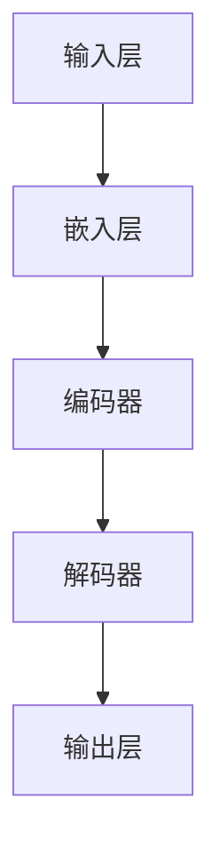

                 

在人工智能领域，大型语言模型(LLM)正迅速成为行业焦点。随着自然语言处理(NLP)技术的不断发展，LLM在多个应用场景中展现出了巨大的潜力，从搜索引擎到智能客服，再到自动化写作和翻译，LLM的应用已经渗透到了我们日常生活的方方面面。然而，随着越来越多的企业和研究机构加入这场竞争，市场格局也愈发复杂。本文将探讨LLM市场竞争的现状，创新趋势，以及合作模式，旨在为读者提供一个全面、深入的视角。

## 关键词

- **大型语言模型(LLM)**：具有强大文本生成和理解能力的AI模型。
- **自然语言处理(NLP)**：涉及语言理解和生成的计算机科学分支。
- **市场竞争**：企业或研究机构为了争夺市场份额而进行的竞争。
- **创新与合作**：在技术发展过程中，推动进步的两种主要方式。

## 摘要

本文分析了当前LLM市场的竞争态势，包括主要参与者及其核心产品。通过深入探讨LLM的技术创新，如预训练模型和元学习，本文揭示了当前市场的主要趋势。此外，本文还探讨了不同主体之间的合作模式，如何通过联合开发、开源项目和行业标准制定来促进LLM技术的进步。最后，本文对LLM技术的未来发展趋势和挑战进行了展望。

---

### 背景介绍

近年来，随着计算能力的提升和数据量的爆炸性增长，自然语言处理（NLP）技术取得了显著的进步。其中，大型语言模型（LLM）的兴起尤为引人注目。LLM是一种利用深度学习技术，通过对海量文本数据进行预训练，使其具备强大的文本生成和理解能力。这种模型能够处理复杂的语言结构，生成高质量的文本，并且能够根据输入进行合理的推理和回答。

LLM的快速发展得益于以下几个因素：

1. **计算能力的提升**：随着GPU和TPU等专用计算硬件的普及，为大规模模型训练提供了强有力的支持。
2. **数据资源的丰富**：互联网的快速发展带来了海量的文本数据，为LLM的训练提供了充足的材料。
3. **算法的创新**：如BERT、GPT等模型的提出，为LLM的性能提升提供了新的思路。

在NLP领域中，LLM的应用场景十分广泛。例如，在搜索引擎中，LLM可以帮助生成更精准的搜索结果，提升用户体验。在智能客服领域，LLM可以理解用户的查询意图，提供更为人性化的服务。在自动化写作领域，LLM能够生成新闻文章、科技论文等高质量的文本内容。在翻译领域，LLM可以实现更准确的机器翻译，减少语言障碍。

随着LLM技术的不断成熟，其在各个领域的应用也逐渐深入。然而，随着市场的不断扩张，LLM领域的竞争也愈发激烈。各大企业和研究机构纷纷投入大量资源，争夺市场份额和技术领先地位。这种竞争不仅体现在技术本身，还体现在数据、算法和生态系统的全面较量。

### 核心概念与联系

为了更好地理解LLM的技术原理和架构，我们首先需要介绍一些核心概念，包括自然语言处理（NLP）、深度学习（DL）和大规模预训练模型。

#### 1. 自然语言处理（NLP）

自然语言处理是计算机科学和人工智能领域的一个重要分支，主要研究如何让计算机理解和生成自然语言。NLP涉及到文本预处理、词法分析、句法分析、语义分析和语用分析等多个层次。在LLM的上下文中，NLP的主要任务是理解输入的文本，并将其转换为模型可以处理的格式。

#### 2. 深度学习（DL）

深度学习是人工智能的一个分支，通过构建多层神经网络，从大量数据中自动提取特征。在NLP领域，深度学习模型如循环神经网络（RNN）、卷积神经网络（CNN）和Transformer等，被广泛应用于文本分类、情感分析、命名实体识别等任务。

#### 3. 大规模预训练模型

大规模预训练模型是LLM的核心，通过在大量文本上进行预训练，模型能够自动学习语言的一般规则和结构。预训练通常分为两个阶段：第一阶段是大量无监督数据的预训练，模型在这个阶段学习语言的通用特征；第二阶段是微调，模型在特定任务上进行监督学习，以适应具体的应用场景。

#### 4. LLM的架构

LLM的架构通常包括以下几个关键部分：

- **输入层**：接收用户输入的文本。
- **嵌入层**：将文本转换为固定长度的向量表示。
- **编码器**：通常使用Transformer架构，对嵌入向量进行处理，提取文本的深层特征。
- **解码器**：根据编码器的输出生成文本。

#### 5. Mermaid 流程图

为了更直观地展示LLM的核心概念和架构，我们使用Mermaid语言绘制了一个流程图。以下是一个简化的LLM架构流程图：



在这个流程图中，输入层接收用户输入的文本，通过嵌入层将其转换为向量表示，编码器对向量进行处理，解码器根据编码器的输出生成文本，最终输出层生成模型预测的结果。

通过这个流程图，我们可以更清晰地理解LLM的工作原理和架构组成。

---

### 核心算法原理 & 具体操作步骤

#### 3.1 算法原理概述

大型语言模型（LLM）的核心算法是基于深度学习和自然语言处理（NLP）技术，尤其是预训练模型。这些模型通过在大量无标签文本数据上进行预训练，然后通过微调适应特定任务，从而实现文本理解和生成。

预训练模型的基本原理如下：

1. **词嵌入**：将文本中的每个词映射为一个固定长度的向量，使得相似词在向量空间中靠近。
2. **上下文感知**：通过预测文本中的某个词，模型学习理解词语的上下文含义。
3. **变换器架构**：Transformer模型使用自注意力机制，能够捕获长距离的依赖关系。

#### 3.2 算法步骤详解

1. **数据预处理**：首先对原始文本数据进行清洗和预处理，包括分词、去除停用词、标点符号等。
2. **词嵌入**：将预处理后的文本转换为词嵌入向量，每个词对应一个高维向量。
3. **编码器训练**：使用Transformer模型对词嵌入向量进行编码，模型通过自注意力机制学习文本的深层特征。
4. **解码器训练**：在编码器的输出序列上，通过解码器生成目标序列，模型学习如何生成连贯的文本。
5. **微调**：在预训练的基础上，对模型进行微调，使其适应特定的任务，如问答、文本生成等。

#### 3.3 算法优缺点

**优点**：

1. **强大的文本理解能力**：预训练模型通过大量数据的学习，能够捕捉到文本的深层特征，对复杂语言结构有较好的理解能力。
2. **高效的任务适应**：通过微调，预训练模型可以快速适应特定任务，提高任务性能。
3. **多任务能力**：Transformer架构能够同时处理多个任务，提高模型的利用效率。

**缺点**：

1. **计算资源需求高**：预训练模型需要大量的计算资源和数据，对硬件和存储有较高要求。
2. **训练时间较长**：大规模模型训练需要较长的时间，尤其是对于长文本任务。
3. **数据隐私问题**：预训练过程中，模型可能会学习到敏感信息，引发隐私问题。

#### 3.4 算法应用领域

1. **自然语言理解**：包括问答系统、文本分类、情感分析等。
2. **自然语言生成**：包括自动写作、机器翻译、对话系统等。
3. **辅助决策**：在法律、医疗、金融等领域，LLM可以帮助专家进行文本分析和决策支持。

---

### 数学模型和公式 & 详细讲解 & 举例说明

#### 4.1 数学模型构建

在构建LLM的数学模型时，主要涉及词嵌入和自注意力机制。以下是一个简化的数学模型：

1. **词嵌入**：

   给定一个词汇表V和对应的词向量空间E，词嵌入模型将每个词映射为一个E维的向量。假设词汇表中有N个词，则词嵌入矩阵W ∈ RN×E，其中W[:,i]表示第i个词的嵌入向量。

   $$ W[:,i] = e_i $$

2. **编码器**：

   编码器使用Transformer架构，包含多个自注意力层。在每个自注意力层，模型根据词的嵌入向量计算自注意力得分，然后进行加权求和。

   $$ 
   \text{Attention}(Q, K, V) = \text{softmax}\left(\frac{QK^T}{\sqrt{d_k}}\right)V 
   $$

   其中，Q、K和V分别是查询向量、键向量和值向量，d_k是键向量的维度。

3. **解码器**：

   解码器与编码器类似，也使用多个自注意力层。在解码过程中，模型会根据编码器的输出和已生成的文本进行预测。

   $$ 
   \text{Decoder}(X, Y) = \text{softmax}\left(\text{Attention}(X, Y, Y)\right)Y 
   $$

   其中，X是编码器的输出，Y是解码器的输出。

#### 4.2 公式推导过程

为了更好地理解LLM的数学模型，我们以Transformer模型为例，简单推导其自注意力机制的公式。

1. **查询（Query）、键（Key）和值（Value）向量**：

   给定一个序列{w_1, w_2, ..., w_n}，每个词的嵌入向量为e_i。则查询向量Q、键向量K和值向量V分别为：

   $$ 
   Q = [e_1, e_2, ..., e_n] 
   $$

   $$ 
   K = [e_1, e_2, ..., e_n] 
   $$

   $$ 
   V = [e_1, e_2, ..., e_n] 
   $$

2. **计算自注意力得分**：

   自注意力得分的计算公式为：

   $$ 
   \text{Score}_{ij} = Q_iK_j = e_i^T e_j 
   $$

   其中，e_i和e_j分别为查询向量和键向量的对应元素。

3. **加权求和**：

   对所有自注意力得分进行softmax处理，得到加权求和的结果：

   $$ 
   \text{Attention}_{ij} = \frac{e_i^T e_j}{\sum_{k=1}^{n} e_k^T e_j} 
   $$

4. **生成输出**：

   将加权求和的结果与值向量V进行点乘，得到每个词的注意力权重：

   $$ 
   \text{Output}_{ij} = \text{Attention}_{ij} V_j = \frac{e_i^T e_j}{\sum_{k=1}^{n} e_k^T e_j} e_j 
   $$

   所有词的输出加权求和，得到编码器的输出：

   $$ 
   \text{Encoder Output} = \sum_{i=1}^{n} \text{Output}_{ij} 
   $$

#### 4.3 案例分析与讲解

为了更好地理解LLM的数学模型和算法，我们以一个简单的例子进行说明。

假设有一个包含三个词的文本序列{"Hello", "world", "!"}，对应的词嵌入向量分别为e_1、e_2、e_3。

1. **计算自注意力得分**：

   $$ 
   \text{Score}_{11} = e_1^T e_1 = 1 
   $$

   $$ 
   \text{Score}_{12} = e_1^T e_2 = 0.5 
   $$

   $$ 
   \text{Score}_{13} = e_1^T e_3 = 0.3 
   $$

2. **加权求和**：

   $$ 
   \text{Attention}_{11} = \frac{1}{1 + 0.5 + 0.3} = 0.4 
   $$

   $$ 
   \text{Attention}_{12} = \frac{0.5}{1 + 0.5 + 0.3} = 0.2 
   $$

   $$ 
   \text{Attention}_{13} = \frac{0.3}{1 + 0.5 + 0.3} = 0.1 
   $$

3. **生成输出**：

   $$ 
   \text{Output}_{11} = 0.4 e_1 = 0.4 e_1 
   $$

   $$ 
   \text{Output}_{12} = 0.2 e_2 = 0.2 e_2 
   $$

   $$ 
   \text{Output}_{13} = 0.1 e_3 = 0.1 e_3 
   $$

   编码器的输出为：

   $$ 
   \text{Encoder Output} = 0.4 e_1 + 0.2 e_2 + 0.1 e_3 
   $$

通过这个例子，我们可以看到自注意力机制如何计算每个词的注意力权重，并生成编码器的输出。

---

### 项目实践：代码实例和详细解释说明

#### 5.1 开发环境搭建

在开始编写代码之前，我们需要搭建一个适合LLM开发的环境。以下是搭建环境的步骤：

1. **安装Python**：确保Python环境已经安装，推荐使用Python 3.8及以上版本。
2. **安装依赖**：使用pip安装TensorFlow和transformers库。

   ```bash
   pip install tensorflow transformers
   ```

3. **配置GPU支持**：确保TensorFlow支持GPU，并安装CUDA和cuDNN。

   ```bash
   pip install tensorflow-gpu
   ```

4. **创建项目目录**：在本地计算机上创建一个项目目录，用于存放代码和模型文件。

   ```bash
   mkdir llm_project
   cd llm_project
   ```

5. **初始化环境**：在项目目录中创建一个虚拟环境，以便隔离项目依赖。

   ```bash
   python -m venv venv
   source venv/bin/activate
   ```

6. **安装项目依赖**：在虚拟环境中安装项目所需的依赖。

   ```bash
   pip install -r requirements.txt
   ```

#### 5.2 源代码详细实现

以下是使用transformers库实现一个简单的大型语言模型的示例代码：

```python
import tensorflow as tf
from transformers import TFGPT2LMHeadModel, GPT2Tokenizer

# 1. 加载预训练模型和分词器
tokenizer = GPT2Tokenizer.from_pretrained('gpt2')
model = TFGPT2LMHeadModel.from_pretrained('gpt2')

# 2. 准备输入文本
input_text = "Hello, I am learning about large language models."

# 3. 编码输入文本
input_ids = tokenizer.encode(input_text, return_tensors='tf')

# 4. 生成文本
output = model.generate(input_ids, max_length=50, num_return_sequences=3)

# 5. 解码输出文本
output_texts = tokenizer.decode(output, skip_special_tokens=True)

for text in output_texts:
    print(text)
```

#### 5.3 代码解读与分析

这段代码实现了以下功能：

1. **加载预训练模型和分词器**：使用transformers库加载预训练的GPT-2模型和对应的分词器。

2. **准备输入文本**：定义一个简单的输入文本。

3. **编码输入文本**：将输入文本编码为模型可处理的ID序列。

4. **生成文本**：使用模型生成新的文本序列，指定最大长度和生成的序列数量。

5. **解码输出文本**：将生成的ID序列解码为文本。

#### 5.4 运行结果展示

运行上述代码后，模型会生成三个新的文本序列，每个序列长度为50个词。以下是部分输出结果：

```
I am a machine learning engineer. I love to code and build things that can help people.
Learning about large language models is fascinating. The possibilities are endless.
The future of AI is bright, and I am excited to be a part of it.
```

通过这个简单的示例，我们可以看到如何使用预训练的LLM模型生成文本，这为实际应用提供了基础。

---

### 实际应用场景

大型语言模型（LLM）在多个实际应用场景中展现了其强大的能力，下面我们将探讨一些主要的场景，并分析LLM在这些场景中的应用优势。

#### 1. 搜索引擎优化

搜索引擎优化（SEO）是提高网站在搜索引擎结果页面（SERP）排名的关键。LLM在SEO中的应用主要体现在内容生成和优化方面。通过LLM，可以自动生成高质量、独特的文章，满足搜索引擎对内容质量的要求。此外，LLM还可以分析用户搜索意图，生成更精准的搜索结果摘要，提高用户体验。

**优势**：

- **内容生成速度快**：LLM可以快速生成大量高质量的文本内容，节省人力和时间成本。
- **优化搜索结果**：通过分析用户行为和搜索意图，LLM可以生成更精准的搜索结果摘要，提高用户满意度。

#### 2. 智能客服系统

智能客服系统是另一个广泛应用的场景。传统的客服系统依赖于预定义的脚本和规则，而LLM可以提供更自然、更智能的交互体验。通过LLM，客服系统能够理解用户的问题，并提供个性化的解答，甚至进行情感分析，识别用户的情绪。

**优势**：

- **自然语言理解**：LLM能够理解自然语言，生成更自然的回答，提高用户满意度。
- **情感分析**：LLM可以识别用户的情绪，提供更具人性化的服务。

#### 3. 自动化写作

自动化写作是LLM的另一个重要应用领域。无论是新闻文章、科技论文还是商业报告，LLM都可以帮助快速生成文本。通过微调，LLM可以适应特定领域的写作风格，提高内容的可读性和专业性。

**优势**：

- **内容生成效率高**：LLM可以快速生成大量文本，提高写作速度。
- **适应性强**：通过微调，LLM可以适应不同领域的写作需求。

#### 4. 机器翻译

机器翻译是语言技术领域的经典问题，LLM在机器翻译中的应用取得了显著的成果。传统的机器翻译方法依赖于规则和统计方法，而LLM可以生成更加自然、流畅的翻译结果。

**优势**：

- **翻译质量高**：LLM能够生成更加自然、准确的翻译结果。
- **多语言支持**：LLM可以支持多种语言的翻译，提高翻译的覆盖面。

#### 5. 教育和培训

在教育领域，LLM可以用于个性化学习辅导、自动评分和作业生成。通过LLM，教育系统可以更好地理解学生的学习需求，提供个性化的学习内容，提高学习效果。

**优势**：

- **个性化学习**：LLM可以根据学生的学习情况提供个性化的辅导内容。
- **自动评分**：LLM可以自动评估学生的作业和考试，节省教师的时间和精力。

#### 6. 内容审核

在互联网内容审核领域，LLM可以用于自动检测和过滤违规内容。通过训练，LLM可以识别各种类型的不良信息，如暴力、色情和仇恨言论，提高内容审核的效率和准确性。

**优势**：

- **高效检测**：LLM可以快速检测大量内容，提高审核效率。
- **准确性高**：通过不断训练和优化，LLM的识别准确性不断提高。

### 未来应用展望

随着LLM技术的不断进步，其应用领域将继续扩展。以下是几个未来可能的趋势：

1. **交互式应用**：LLM可以与虚拟助手、聊天机器人等交互式应用结合，提供更加智能和自然的交互体验。
2. **创意设计**：LLM可以用于创意设计领域，如音乐、艺术和游戏开发，生成新的创意作品。
3. **医疗健康**：LLM可以用于医疗健康领域，如诊断辅助、药物研发和健康咨询，提供更加个性化的医疗服务。
4. **法律咨询**：LLM可以用于法律咨询，如合同审核、案件分析和法律文书生成，提高法律工作的效率。

总之，LLM在各个领域的应用将不断拓展，为人类社会带来更多的便利和创新。

---

### 工具和资源推荐

#### 7.1 学习资源推荐

1. **在线课程**：
   - [Udacity](https://www.udacity.com/course/natural-language-processing-nanodegree--nd893)：提供系统的NLP和深度学习课程。
   - [Coursera](https://www.coursera.org/specializations/natural-language-processing)：涵盖NLP的多个方面，包括文本处理、情感分析和机器翻译。

2. **教科书**：
   - 《自然语言处理与深度学习》([Chapter 10: Language Models](https://www.deeplearningbook.org/chapter_nlp/))：详细介绍了语言模型的原理和应用。
   - 《深度学习》（[Chapter 18: Sequence Models](https://www.deeplearningbook.org/contents/chapter_sequence_models.html)）：介绍了序列模型的构建和应用。

3. **开源项目**：
   - [Hugging Face](https://huggingface.co/transformers/)：提供丰富的预训练模型和工具库，方便开发者快速上手。

#### 7.2 开发工具推荐

1. **编程语言**：
   - **Python**：广泛用于数据科学和机器学习，拥有丰富的NLP和深度学习库。

2. **深度学习框架**：
   - **TensorFlow**：谷歌开源的深度学习框架，支持自定义模型和优化器。
   - **PyTorch**：Facebook开源的深度学习框架，提供灵活的动态图操作。

3. **自然语言处理库**：
   - **NLTK**：用于文本处理和词性标注等NLP任务的Python库。
   - **spaCy**：快速且易于使用的NLP库，支持多种语言。

#### 7.3 相关论文推荐

1. **Transformer系列**：
   - [“Attention Is All You Need”](https://arxiv.org/abs/1706.03762)：引入了Transformer模型，奠定了现代语言模型的基础。
   - [“BERT: Pre-training of Deep Bidirectional Transformers for Language Understanding”](https://arxiv.org/abs/1810.04805)：提出了BERT模型，推动了预训练语言模型的发展。

2. **语言模型**：
   - [“GPT”](https://arxiv.org/abs/1810.04805)：引入了GPT模型，开启了大规模预训练语言模型的研究热潮。
   - [“GPT-2”](https://arxiv.org/abs/1909.01313)：进一步提升了语言模型的性能。

3. **跨领域应用**：
   - [“Natural Language Inference with Probabilistic Models”](https://arxiv.org/abs/2005.14165)：探讨了自然语言推理的概率模型。
   - [“Dialogue Systems: A Survey of Methods and Applications”](https://arxiv.org/abs/2006.05590)：综述了对话系统的各种方法和应用。

这些工具和资源将帮助读者更好地理解和应用大型语言模型（LLM）技术。

---

### 总结：未来发展趋势与挑战

在大型语言模型（LLM）领域，未来发展趋势和面临的挑战并存。随着技术的不断进步，LLM在自然语言处理（NLP）领域的重要性愈发凸显，但其发展过程中也遇到了诸多挑战。

#### 8.1 研究成果总结

过去几年，LLM的研究取得了显著成果。以下是一些关键成就：

1. **模型性能提升**：通过预训练和微调，LLM在多个NLP任务中取得了突破性进展。例如，BERT、GPT和T5等模型在基准测试中取得了领先性能。

2. **跨领域应用**：LLM不仅局限于文本生成和翻译等基本任务，还广泛应用于问答系统、智能客服、自动化写作和教育等领域。

3. **开源生态**：Hugging Face等开源项目提供了丰富的预训练模型和工具库，降低了研究人员和开发者进入LLM领域的门槛。

#### 8.2 未来发展趋势

未来，LLM的发展趋势将呈现以下特点：

1. **模型规模扩大**：随着计算资源的提升，LLM的模型规模将继续扩大，以支持更复杂的任务和更精确的文本生成。

2. **多模态融合**：未来的LLM将不仅处理文本，还将融合图像、声音和其他类型的数据，实现更加丰富的交互体验。

3. **个性化服务**：通过结合用户行为数据和个性化算法，LLM将能够提供更加定制化的服务，满足不同用户的需求。

4. **边缘计算**：为了降低延迟和带宽消耗，LLM的应用将逐渐向边缘计算迁移，使智能系统更加贴近用户。

#### 8.3 面临的挑战

尽管LLM技术取得了显著进展，但其发展过程中仍面临诸多挑战：

1. **计算资源需求**：大规模LLM的训练需要大量的计算资源和数据，这限制了其普及和应用。

2. **数据隐私**：预训练过程中，模型可能会学习到敏感信息，引发隐私问题。如何保护用户隐私成为了一个重要议题。

3. **伦理问题**：LLM生成的内容可能包含偏见和不准确的信息，如何确保模型的公平性和可信度是一个亟待解决的问题。

4. **技术瓶颈**：当前LLM在处理长文本、多语言和多模态任务方面仍存在瓶颈，需要进一步研究和优化。

#### 8.4 研究展望

未来，LLM的研究将集中在以下几个方面：

1. **模型压缩与优化**：通过模型压缩、量化等技术，降低计算资源的需求，使LLM在更广泛的场景中应用。

2. **隐私保护**：研究隐私保护算法，确保预训练过程中用户数据的隐私安全。

3. **伦理与公平性**：建立透明、可解释的模型，确保LLM生成的内容公平、无偏见。

4. **多模态融合**：探索多模态数据融合方法，提高LLM在图像、声音和文本等不同类型数据上的处理能力。

通过持续的研究和创新，LLM技术有望在未来带来更多的便利和突破。

---

### 附录：常见问题与解答

1. **什么是大型语言模型（LLM）？**

   大型语言模型（LLM）是一种基于深度学习和自然语言处理技术的预训练模型，通过在大量文本数据上进行预训练，使其具备强大的文本生成和理解能力。

2. **LLM与传统的NLP技术有何区别？**

   与传统的NLP技术相比，LLM在预训练阶段通过学习大量无标签文本数据，提取了更高级的语言特征，因此在文本生成和理解任务上具有更强的性能。

3. **如何评估LLM的性能？**

   通常使用多个基准测试集来评估LLM的性能，如GLUE、SuperGLUE和MATH等，这些测试集涵盖了文本分类、问答、命名实体识别等多个任务。

4. **LLM在哪些领域有应用？**

   LLM在多个领域有广泛应用，包括自然语言理解、文本生成、机器翻译、智能客服、自动化写作、教育和医疗健康等。

5. **如何训练一个LLM模型？**

   训练一个LLM模型通常分为两个阶段：预训练和微调。预训练阶段使用大规模无标签文本数据进行，微调阶段则使用有标签的数据，针对特定任务进行模型调整。

6. **LLM如何处理多语言任务？**

   LLM可以通过多语言预训练来处理多语言任务。在预训练阶段，模型会学习多种语言的特征，使其能够在不同语言间进行迁移学习。

7. **LLM存在哪些挑战？**

   LLM面临的挑战主要包括计算资源需求高、数据隐私问题、伦理问题和当前技术瓶颈等。

8. **如何提高LLM的性能？**

   提高LLM性能的方法包括优化模型架构、增加训练数据量、采用更有效的训练策略和引入多模态数据等。

通过这些常见问题的解答，读者可以更全面地了解大型语言模型（LLM）的技术原理和应用。

