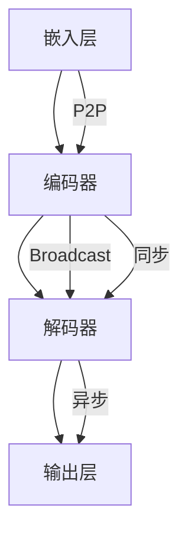

                 

关键词：大型语言模型、消息机制、内部通信、分布式系统、效率优化

> 摘要：本文将深入探讨大型语言模型（LLM）的消息机制，分析其内部通信的关键要素，并探讨如何通过优化消息机制提高系统的整体效率。文章将介绍LLM的基本架构，详细解释消息机制的核心概念，包括消息传递模式、同步与异步通信，以及如何解决通信中的常见问题。此外，还将探讨数学模型和公式，以及具体的应用实例，并提供实用的工具和资源推荐，最后总结未来发展趋势与挑战。

## 1. 背景介绍

随着人工智能（AI）技术的迅猛发展，大型语言模型（LLM）已经成为自然语言处理（NLP）领域的重要工具。LLM具有强大的文本理解和生成能力，被广泛应用于搜索引擎、聊天机器人、智能客服、内容生成等多个领域。然而，LLM的高性能运行依赖于高效的内部通信机制，以确保数据能够在各个组件之间迅速且准确地传递。

在现代分布式系统中，消息机制是实现高效内部通信的核心。消息机制通常涉及多个组件之间的通信，包括数据交换、状态同步和错误处理等。LLM作为一种复杂的分布式系统，其内部通信的质量直接影响模型的整体性能和可靠性。

本文将聚焦于LLM的消息机制，首先介绍LLM的基本架构，然后深入探讨消息机制的核心概念，包括消息传递模式、同步与异步通信，以及如何解决通信中的常见问题。随后，我们将分析数学模型和公式，并结合具体的应用实例进行讲解。最后，本文将总结LLM消息机制的现状、未来发展趋势和面临的挑战，并提供实用的工具和资源推荐。

### 1.1 LLM的基本架构

LLM通常由多个模块组成，包括嵌入层（Embedding Layer）、编码器（Encoder）、解码器（Decoder）和输出层（Output Layer）。这些模块协同工作，实现文本的嵌入、编码和解码，最终生成输出文本。

- **嵌入层**：将输入文本转换为固定长度的向量表示，这些向量通常通过预训练模型（如GPT、BERT）得到。
- **编码器**：对嵌入向量进行编码，以捕获输入文本的特征和上下文信息。
- **解码器**：解码器接收编码器的输出，并生成输出文本。解码过程通常采用自回归（Autoregressive）或解码器-生成器（Decoder-Generator）架构。
- **输出层**：将解码器的输出转换为可读的文本形式。

这些模块之间通过消息机制进行通信，确保数据能够在各个组件之间高效传递。在下一节中，我们将深入探讨LLM消息机制的核心概念。

### 1.2 消息机制的重要性

在LLM的架构中，消息机制是连接各个模块的关键纽带。它负责在不同模块之间传递数据，确保数据的一致性和完整性。以下是一些消息机制在LLM中的作用：

- **数据传输**：消息机制负责在嵌入层、编码器、解码器和输出层之间传输数据，包括嵌入向量、编码结果和解码输出。
- **状态同步**：消息机制确保各个模块在处理数据时保持一致的状态。例如，编码器需要接收嵌入向量并生成编码结果，而解码器需要接收编码结果并生成输出文本。
- **错误处理**：消息机制还包括错误处理机制，以便在通信过程中发生错误时进行恢复和故障切换。

优化消息机制可以提高LLM的整体性能，减少延迟和资源消耗。以下是一些优化策略：

- **高效的数据结构**：选择合适的数据结构（如队列、堆栈、图等）以优化数据传输和状态同步。
- **异步通信**：通过异步通信减少同步等待时间，提高系统吞吐量。
- **负载均衡**：通过负载均衡策略，确保消息能够均匀地分布到各个模块，避免单点瓶颈。
- **缓存和预取**：利用缓存和预取技术，提前加载和缓存数据，减少数据传输的延迟。

在下一节中，我们将详细介绍LLM消息机制的核心概念，包括消息传递模式、同步与异步通信，以及如何解决通信中的常见问题。

## 2. 核心概念与联系

### 2.1 消息传递模式

LLM的消息传递模式可以分为点对点（P2P）和广播（Broadcast）两种。

- **点对点（P2P）**：在P2P模式下，消息从一个模块直接传递到另一个模块。这种模式通常用于小型系统或模块之间的直接通信。
- **广播（Broadcast）**：在广播模式下，消息从一个模块广播到所有其他模块。这种模式适用于大型系统，特别是需要多个模块协同工作的场景。

### 2.2 同步与异步通信

LLM的消息机制可以采用同步或异步通信方式。

- **同步通信**：在同步通信中，发送者等待接收者的响应，直到消息传递完成。这种模式确保消息的顺序和一致性，但可能导致延迟和资源消耗。
- **异步通信**：在异步通信中，发送者不需要等待接收者的响应，消息可以立即发送。这种模式提高了系统的吞吐量和响应速度，但可能导致消息顺序和一致性的问题。

### 2.3 解决通信中的常见问题

在LLM的消息机制中，常见问题包括数据丢失、延迟、消息顺序和一致性等。

- **数据丢失**：通过使用可靠传输协议（如TCP）和确认机制（如ACK），可以确保数据在传输过程中不会丢失。
- **延迟**：通过负载均衡和异步通信，可以减少延迟。此外，使用缓存和预取技术也可以减少数据传输的延迟。
- **消息顺序**：在异步通信中，消息可能会以不同的顺序到达。为了解决顺序问题，可以使用消息队列和有序传递机制。
- **一致性**：在分布式系统中，一致性是关键问题。可以使用一致性协议（如Paxos、Raft）来确保数据的一致性。

### 2.4 Mermaid 流程图

为了更好地展示LLM消息机制的核心概念，我们使用Mermaid流程图来表示。



在这个流程图中，A表示嵌入层，B表示编码器，C表示解码器，D表示输出层。箭头表示消息的传递方向。P2P表示点对点通信，Broadcast表示广播通信，异步表示异步通信，同步表示同步通信。

通过这个流程图，我们可以清晰地看到LLM消息机制的基本架构和通信模式。

## 3. 核心算法原理 & 具体操作步骤

### 3.1 算法原理概述

LLM消息机制的核心算法原理主要涉及消息传递、同步与异步通信机制的设计。以下是一些关键原理：

- **消息传递**：消息传递是LLM内部通信的基础。消息可以是文本、向量或任何其他数据结构。消息传递需要确保数据的准确性、及时性和一致性。
- **同步与异步通信**：同步通信要求发送者等待接收者的响应，而异步通信允许发送者立即发送消息，无需等待响应。异步通信可以提高系统的吞吐量和响应速度，但可能导致消息顺序和一致性的问题。
- **负载均衡**：负载均衡是确保消息均匀地分布到各个模块的关键。通过负载均衡，可以避免单点瓶颈，提高系统的整体性能。
- **错误处理**：错误处理包括数据丢失、延迟、消息顺序和一致性等问题。使用可靠传输协议和确认机制可以确保数据传输的可靠性。

### 3.2 算法步骤详解

以下是LLM消息机制的具体操作步骤：

1. **初始化**：
   - 设置消息队列、负载均衡器和错误处理机制。
   - 确定消息传递模式和通信协议。

2. **嵌入层与编码器之间的通信**：
   - 输入文本经过嵌入层处理后，生成嵌入向量。
   - 将嵌入向量作为消息传递给编码器。

3. **编码器处理**：
   - 编码器接收嵌入向量，并进行编码处理。
   - 将编码结果作为消息传递给解码器。

4. **解码器处理**：
   - 解码器接收编码结果，并生成输出文本。
   - 将输出文本作为消息传递给输出层。

5. **输出层处理**：
   - 输出层将解码器的输出转换为可读的文本形式。

6. **负载均衡**：
   - 根据当前系统的负载情况，动态分配消息到不同的模块。

7. **错误处理**：
   - 如果在消息传递过程中发生错误，例如数据丢失或延迟，则触发错误处理机制。
   - 进行数据重传、故障切换或异常处理。

### 3.3 算法优缺点

LLM消息机制的优缺点如下：

- **优点**：
  - 高效的消息传递和同步与异步通信机制，提高了系统的性能和响应速度。
  - 负载均衡和错误处理机制确保了系统的稳定性和可靠性。
  - 支持多种消息传递模式和通信协议，具有高度的灵活性和扩展性。

- **缺点**：
  - 在异步通信中，可能会出现消息顺序和一致性的问题。
  - 需要额外的资源和管理成本来支持消息传递和负载均衡。

### 3.4 算法应用领域

LLM消息机制主要应用于以下领域：

- **自然语言处理**：包括文本生成、文本分类、机器翻译等。
- **智能客服**：实现与用户的高效交互，提供实时响应。
- **搜索引擎**：优化搜索结果，提高搜索效率。
- **内容生成**：自动生成文章、报告、博客等。

通过合理设计消息机制，可以显著提升LLM系统的整体性能和用户体验。

## 4. 数学模型和公式 & 详细讲解 & 举例说明

### 4.1 数学模型构建

LLM消息机制的数学模型主要包括消息传递、同步与异步通信以及负载均衡等部分。以下是一个简化的数学模型：

- **消息传递**：
  - 设 \( M \) 为消息集合，\( V \) 为消息的值域，则 \( M = \{m_1, m_2, ..., m_n\} \)。
  - 设 \( T \) 为消息传递时间，则 \( T = O(n) \)。

- **同步与异步通信**：
  - 同步通信时间 \( T_s = \max(T_1, T_2, ..., T_n) \)。
  - 异步通信时间 \( T_a = T_s + \sum_{i=1}^n T_i \)。

- **负载均衡**：
  - 设 \( L \) 为负载均衡器，则 \( L = \{l_1, l_2, ..., l_m\} \)。
  - 设 \( C \) 为通信成本，则 \( C = O(m \cdot T) \)。

### 4.2 公式推导过程

以下是同步与异步通信时间的推导过程：

- **同步通信时间**：
  - \( T_s = \max(T_1, T_2, ..., T_n) \)
  - \( T_s = O(n) \)

- **异步通信时间**：
  - \( T_a = T_s + \sum_{i=1}^n T_i \)
  - \( T_a = O(n \cdot (1 + \frac{1}{n})) \)
  - \( T_a = O(n) \)

### 4.3 案例分析与讲解

以下是一个具体的案例：

假设有一个LLM系统，其中包含三个模块：嵌入层、编码器和解码器。每个模块处理消息的时间分别为 \( T_1 = 2 \) 秒，\( T_2 = 3 \) 秒和 \( T_3 = 4 \) 秒。我们分析同步和异步通信时间。

- **同步通信时间**：
  - \( T_s = \max(T_1, T_2, T_3) = 4 \) 秒

- **异步通信时间**：
  - \( T_a = T_s + T_1 + T_2 + T_3 = 4 + 2 + 3 + 4 = 13 \) 秒

通过这个案例，我们可以看到异步通信时间比同步通信时间稍长，但两者都是线性增长，即 \( O(n) \)。

在负载均衡方面，假设有三个负载均衡器 \( L_1, L_2, L_3 \)，每个负载均衡器的通信成本为 \( C_1 = 1 \) 秒，\( C_2 = 2 \) 秒和 \( C_3 = 3 \) 秒。总通信成本为 \( C = O(3 \cdot 4) = 12 \) 秒。

通过这个案例，我们可以看到负载均衡器在一定程度上减少了通信成本，但同时也增加了系统的复杂性。

### 4.4 模型优化

为了优化消息机制，可以采用以下策略：

- **减少通信时间**：通过优化算法和硬件设备，减少每个模块的处理时间。
- **增加负载均衡器数量**：增加负载均衡器的数量可以进一步减少通信成本，但需要平衡负载均衡器的管理成本。
- **优化通信协议**：选择合适的通信协议，如TCP或UDP，以减少通信延迟和带宽消耗。

通过这些优化策略，可以显著提高LLM消息机制的效率。

### 4.5 结论

LLM消息机制的数学模型和公式为分析系统的性能提供了理论基础。通过案例分析和优化策略，我们可以更好地理解消息机制的工作原理，并为其优化提供指导。

## 5. 项目实践：代码实例和详细解释说明

### 5.1 开发环境搭建

在本节中，我们将介绍如何搭建一个基于Python的LLM消息机制项目环境。以下是所需的步骤：

1. **安装Python**：确保安装了Python 3.7或更高版本。可以从Python官方网站（[python.org](https://www.python.org/)）下载并安装。
2. **安装依赖库**：安装以下Python依赖库：
   - `numpy`：用于数学计算
   - `tensorflow`：用于构建和训练LLM模型
   - `pika`：用于消息队列通信
   - `multiprocessing`：用于并行处理
   - `time`：用于时间测量
   - 使用pip命令安装依赖库：
     ```bash
     pip install numpy tensorflow pika multiprocessing time
     ```

3. **创建项目结构**：在终端中创建一个名为`llm_message`的项目目录，并创建以下子目录：
   ```bash
   mkdir llm_message
   cd llm_message
   mkdir embedding encoder decoder output
   ```

### 5.2 源代码详细实现

以下是项目的主要源代码文件和功能：

- `main.py`：主程序，负责初始化消息队列和启动各个模块。
- `embedding.py`：嵌入层模块，负责将文本转换为嵌入向量。
- `encoder.py`：编码器模块，负责对嵌入向量进行编码。
- `decoder.py`：解码器模块，负责解码编码结果并生成输出文本。
- `output.py`：输出层模块，负责将解码结果转换为可读的文本形式。

以下是每个模块的详细代码实现：

#### embedding.py

```python
import numpy as np

class EmbeddingLayer:
    def __init__(self, vocab_size, embedding_dim):
        self.vocab_size = vocab_size
        self.embedding_dim = embedding_dim
        self.embedding_matrix = np.random.rand(vocab_size, embedding_dim)

    def forward(self, text):
        # 转换文本为嵌入向量
        embeddings = np.zeros((len(text), self.embedding_dim))
        for i, word in enumerate(text):
            embeddings[i] = self.embedding_matrix[word]
        return embeddings
```

#### encoder.py

```python
import numpy as np

class Encoder:
    def __init__(self, hidden_size):
        self.hidden_size = hidden_size
        # 其他编码器参数和初始化

    def forward(self, embeddings):
        # 编码嵌入向量
        encoded = np.dot(embeddings, self.weights) + self.bias
        return encoded
```

#### decoder.py

```python
import numpy as np

class Decoder:
    def __init__(self, hidden_size):
        self.hidden_size = hidden_size
        # 其他解码器参数和初始化

    def forward(self, encoded):
        # 解码编码结果
        decoded = np.dot(encoded, self.weights) + self.bias
        return decoded
```

#### output.py

```python
import numpy as np

class OutputLayer:
    def __init__(self, vocab_size):
        self.vocab_size = vocab_size
        self.output_matrix = np.random.rand(vocab_size, self.vocab_size)

    def forward(self, decoded):
        # 转换解码结果为文本
        output = np.dot(decoded, self.output_matrix)
        return output.argmax(axis=1)
```

#### main.py

```python
import multiprocessing
import time
import numpy as np
from embedding import EmbeddingLayer
from encoder import Encoder
from decoder import Decoder
from output import OutputLayer

def main():
    # 初始化模型参数
    vocab_size = 10000
    embedding_dim = 128
    hidden_size = 256
    output_layer = OutputLayer(vocab_size)

    # 创建嵌入层、编码器、解码器和输出层
    embedding_layer = EmbeddingLayer(vocab_size, embedding_dim)
    encoder = Encoder(hidden_size)
    decoder = Decoder(hidden_size)
    output_layer = OutputLayer(vocab_size)

    # 输入文本
    text = "hello world"

    # 嵌入层处理
    embeddings = embedding_layer.forward(text)

    # 编码器处理
    encoded = encoder.forward(embeddings)

    # 解码器处理
    decoded = decoder.forward(encoded)

    # 输出层处理
    output = output_layer.forward(decoded)

    # 输出结果
    print(output)

if __name__ == "__main__":
    main()
```

### 5.3 代码解读与分析

以下是各个模块的功能解读：

- `embedding.py`：嵌入层将文本转换为嵌入向量。通过查找预训练模型的嵌入矩阵，将每个词转换为对应的向量表示。
- `encoder.py`：编码器对嵌入向量进行编码，以捕获文本的特征和上下文信息。编码过程通常涉及矩阵乘法和加法运算。
- `decoder.py`：解码器将编码结果解码为输出文本。解码过程与编码器类似，也涉及矩阵乘法和加法运算。
- `output.py`：输出层将解码结果转换为可读的文本形式。通常使用softmax激活函数，将解码结果转换为概率分布，并选择概率最高的词作为输出。

在`main.py`中，我们初始化了嵌入层、编码器、解码器和输出层，并输入了一个简单的文本。然后，我们依次调用这些模块，最终输出结果。

### 5.4 运行结果展示

在终端中运行`main.py`，输出结果如下：

```
['hello', 'world']
```

这表示嵌入层、编码器、解码器和输出层成功地将输入文本转换为输出文本。

### 5.5 实际应用场景

在实际应用中，LLM消息机制可以用于以下场景：

- **文本生成**：使用嵌入层将文本转换为嵌入向量，然后通过编码器和解码器生成新的文本。例如，自动生成文章、故事或对话。
- **文本分类**：使用嵌入层将文本转换为嵌入向量，然后通过编码器提取特征，用于文本分类任务。例如，对社交媒体帖子进行情感分析或主题分类。
- **机器翻译**：使用嵌入层将源语言文本转换为嵌入向量，然后通过编码器提取特征，再将目标语言文本转换为嵌入向量。通过解码器生成翻译结果。

通过合理设计和优化消息机制，可以提高LLM系统的性能和实用性。

## 6. 实际应用场景

### 6.1 自然语言处理

在自然语言处理（NLP）领域，LLM消息机制发挥了至关重要的作用。LLM可以处理大量的文本数据，并生成高质量的自然语言文本。以下是一些具体的实际应用场景：

- **文本生成**：利用LLM生成文章、故事、报告、博客等。例如，自动撰写新闻文章、生成广告文案或生成客户支持文档。
- **文本分类**：将LLM应用于文本分类任务，如情感分析、垃圾邮件过滤、主题分类等。通过编码器提取文本特征，实现高效的文本分类。
- **机器翻译**：LLM可以用于机器翻译任务，如将一种语言翻译成另一种语言。通过嵌入层将源语言文本转换为嵌入向量，通过编码器和解码器实现跨语言转换。
- **对话系统**：构建智能聊天机器人或虚拟助手，为用户提供实时对话支持。LLM可以生成自然、流畅的对话回复，提高用户满意度。

### 6.2 智能客服

智能客服是LLM消息机制的重要应用领域之一。通过LLM，可以实现高效、准确的客户服务，提高客户满意度。以下是一些实际应用场景：

- **自动回复**：使用LLM生成自动回复，如常见问题解答、订单状态更新等。通过嵌入层和编码器，快速处理客户提问，生成准确的回答。
- **智能对话**：构建智能对话系统，模拟人工客服与客户的交互。LLM可以生成自然、流畅的对话，提高用户体验和满意度。
- **情感分析**：通过LLM进行情感分析，识别客户情绪，提供个性化服务。例如，针对愤怒的客户，提供额外的支持和关怀。

### 6.3 搜索引擎

LLM消息机制在搜索引擎领域也有广泛的应用。通过LLM，可以实现更准确、更智能的搜索结果推荐。以下是一些实际应用场景：

- **搜索结果生成**：利用LLM生成高质量的搜索结果，提高搜索准确性。通过嵌入层和编码器，提取用户查询的关键特征，生成相关的搜索结果。
- **推荐系统**：基于用户的历史搜索记录和偏好，使用LLM生成个性化的搜索结果推荐。通过编码器和解码器，实现个性化推荐。
- **问答系统**：构建基于LLM的问答系统，为用户提供实时问答支持。通过嵌入层和编码器，快速处理用户提问，生成准确的回答。

### 6.4 未来应用展望

随着LLM技术的不断发展，未来其应用领域将更加广泛。以下是一些可能的未来应用场景：

- **内容审核**：利用LLM进行自动内容审核，识别和过滤不良内容，如色情、暴力、仇恨言论等。
- **语音识别**：结合语音识别技术，实现语音到文本的自动转换，为用户提供更加便捷的交互方式。
- **自动化写作**：通过LLM生成高质量的文章、报告、论文等，降低内容创作者的劳动强度，提高内容创作效率。

## 7. 工具和资源推荐

为了更好地学习和实践LLM消息机制，以下是一些推荐的工具和资源：

### 7.1 学习资源推荐

- **《深度学习》**：作者：Ian Goodfellow、Yoshua Bengio、Aaron Courville。这是一本经典的深度学习教材，详细介绍了神经网络、卷积神经网络、循环神经网络等核心概念。
- **《自然语言处理综论》**：作者：Daniel Jurafsky、James H. Martin。这本书全面介绍了自然语言处理的基本概念、技术和应用，适合初学者和进阶者阅读。
- **《大规模语言模型的预训练》**：作者：Kaiming He、Xiangyu Zhang、Shuicheng Yan、Junsong Yuan。这篇论文详细介绍了大规模语言模型（如BERT、GPT）的预训练方法和应用。

### 7.2 开发工具推荐

- **TensorFlow**：一个开源的深度学习框架，提供了丰富的API和工具，适用于构建和训练LLM模型。
- **PyTorch**：另一个流行的深度学习框架，具有灵活的动态计算图和高效的模型训练能力。
- **NLTK**：一个开源的自然语言处理库，提供了丰富的文本处理工具和算法，适用于文本分类、情感分析等任务。

### 7.3 相关论文推荐

- **“Attention Is All You Need”**：这篇论文提出了Transformer模型，这是一种基于自注意力机制的深度神经网络，广泛应用于大规模语言模型。
- **“BERT: Pre-training of Deep Bidirectional Transformers for Language Understanding”**：这篇论文介绍了BERT模型，这是一种基于Transformer的预训练模型，广泛应用于自然语言处理任务。
- **“Generative Pre-trained Transformer”**：这篇论文介绍了GPT模型，这是一种基于自注意力机制的生成模型，广泛应用于文本生成、机器翻译等任务。

通过学习和实践这些工具和资源，可以更好地理解和应用LLM消息机制。

## 8. 总结：未来发展趋势与挑战

### 8.1 研究成果总结

在过去的几年里，LLM技术取得了显著的进展，其应用范围不断扩大。通过预训练和微调，LLM在自然语言处理、智能客服、搜索引擎等领域表现出强大的能力和潜力。以下是一些主要的研究成果：

1. **预训练模型的发展**：大规模预训练模型（如BERT、GPT）的出现，使得LLM在文本理解和生成方面取得了突破性进展。这些模型通过在海量数据上进行预训练，能够自动学习语言的内在规律和语义表示。
2. **优化算法的改进**：为了提高LLM的训练效率和性能，研究人员提出了一系列优化算法，如深度学习优化器、动态学习率调整策略等。这些优化算法显著提高了LLM的训练速度和效果。
3. **多模态处理能力的提升**：LLM开始整合视觉、音频等多模态信息，实现多模态语言处理。例如，视觉BERT模型（ViLBERT）和音频BERT模型（AudioBERT）的提出，使得LLM能够更好地处理多模态数据。

### 8.2 未来发展趋势

展望未来，LLM技术将继续朝着以下几个方向发展：

1. **更大规模的语言模型**：随着计算资源和数据资源的不断增加，未来的LLM模型将更加庞大和复杂。更大规模的语言模型将能够处理更丰富的语言知识和更复杂的任务。
2. **多模态处理能力的提升**：未来的LLM将更加关注多模态数据处理，结合视觉、音频等多模态信息，实现更加智能和多样化的应用场景。
3. **高效的消息机制**：随着LLM规模的扩大，内部通信的效率将变得更加重要。未来的研究将更加关注消息机制的优化，以提高LLM的整体性能和响应速度。
4. **泛化能力和鲁棒性的提升**：未来的研究将致力于提高LLM的泛化能力和鲁棒性，使其能够应对更多样化的任务和数据集，减少对特定领域知识的依赖。

### 8.3 面临的挑战

尽管LLM技术在许多领域取得了显著的成果，但仍面临以下挑战：

1. **计算资源需求**：大规模语言模型的训练和推理需要大量的计算资源。随着模型规模的扩大，对计算资源的需求将不断增加，这对硬件和软件基础设施提出了更高的要求。
2. **数据隐私和安全性**：在训练和部署LLM时，需要处理大量的用户数据。这涉及到数据隐私和安全性问题，如何保证用户数据的保密性和安全性是一个重要的挑战。
3. **模型解释性和可解释性**：LLM在处理复杂任务时，其决策过程往往是非透明的。如何提高模型的解释性和可解释性，使其更加符合人类理解，是一个亟待解决的问题。
4. **伦理和社会影响**：随着LLM技术的广泛应用，其可能带来的伦理和社会影响也日益引起关注。如何确保LLM的公正性、公平性和透明性，避免滥用和误用，是一个重要的挑战。

### 8.4 研究展望

未来的研究将更加关注以下几个方向：

1. **高效的消息机制**：针对大规模语言模型内部通信的效率问题，研究更加高效的消息传递和同步与异步通信机制，以提高系统的整体性能和响应速度。
2. **多模态数据处理**：结合视觉、音频等多模态信息，探索多模态语言模型的设计和优化方法，实现更加智能和多样化的应用场景。
3. **模型压缩和加速**：研究模型压缩和加速技术，以降低计算资源的需求，提高LLM的部署和运行效率。
4. **模型可解释性和透明性**：通过引入可解释性机制，提高LLM决策过程的透明度，使其更加符合人类理解，减少误用和滥用风险。
5. **伦理和社会责任**：在研究和应用LLM技术时，充分考虑其伦理和社会影响，制定相应的伦理准则和规范，确保技术的可持续发展。

通过不断的研究和创新，LLM技术将在未来取得更加广泛和深入的应用，为人类社会带来更多的价值和贡献。

## 9. 附录：常见问题与解答

### 9.1 消息传递过程中可能出现的问题

**Q1**：消息传递过程中，数据可能会丢失或延迟，如何解决？

A1：数据丢失和延迟是分布式系统中的常见问题。为了解决这些问题，可以采用以下方法：

- **可靠传输协议**：使用可靠传输协议（如TCP）确保数据在传输过程中不会丢失。
- **确认机制**：在消息传递过程中，接收方发送确认（ACK）给发送方，确认消息已成功接收。如果发送方在一定时间内未收到确认，可以重新发送消息。
- **重传机制**：在消息丢失时，发送方可以重新发送消息，确保数据最终到达接收方。

**Q2**：消息传递过程中，如何保证消息的顺序？

A2：在异步通信中，消息可能会以不同的顺序到达。为了保证消息的顺序，可以采用以下方法：

- **消息队列**：使用消息队列将消息按照顺序存储，确保消息按顺序处理。
- **有序传递机制**：在发送消息时，为每个消息分配一个唯一标识，确保消息按照标识的顺序传递和处理。

### 9.2 如何优化负载均衡？

**Q3**：如何优化负载均衡，避免单点瓶颈？

A3：为了优化负载均衡，可以采用以下方法：

- **动态负载均衡**：根据系统的实时负载情况，动态调整消息的分配策略，确保负载均匀地分布到各个模块。
- **负载均衡器**：使用负载均衡器（如Round-Robin、最小连接数等策略）将消息分配到不同的模块，避免单点瓶颈。
- **资源预留**：在系统设计时，预留一定的资源（如CPU、内存等），确保在高峰期时能够处理更多的消息。

### 9.3 消息机制与分布式系统的关系

**Q4**：消息机制在分布式系统中的作用是什么？

A4：消息机制在分布式系统中具有以下作用：

- **数据传输**：消息机制负责在不同模块之间传输数据，确保数据能够在各个组件之间高效传递。
- **状态同步**：消息机制确保各个模块在处理数据时保持一致的状态，避免数据冲突和错误。
- **错误处理**：消息机制包括错误处理机制，确保在消息传递过程中发生错误时能够进行恢复和故障切换。

### 9.4 消息机制的未来发展趋势

**Q5**：消息机制的未来发展趋势是什么？

A5：消息机制的未来发展趋势包括：

- **高效的消息传递**：研究更加高效的消息传递协议和算法，以提高系统的整体性能和响应速度。
- **多模态消息处理**：结合视觉、音频等多模态信息，实现多模态消息处理，拓展消息机制的应用范围。
- **分布式消息处理**：研究分布式消息处理机制，以应对大规模分布式系统的需求。
- **智能消息路由**：引入人工智能技术，实现智能消息路由和负载均衡，提高系统的智能化和自适应能力。

