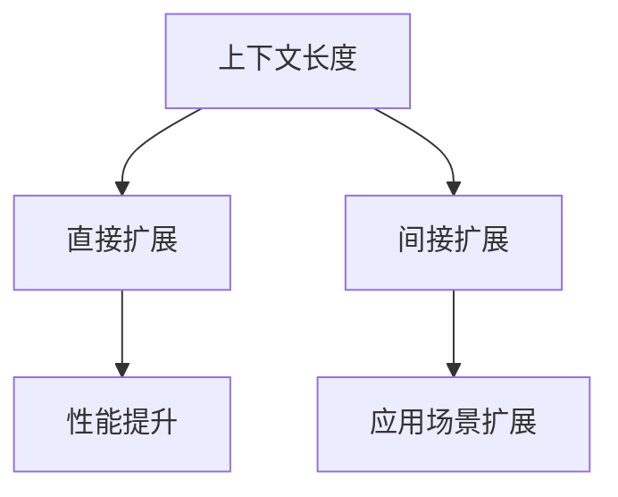
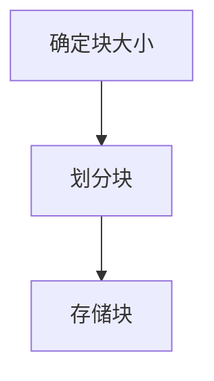
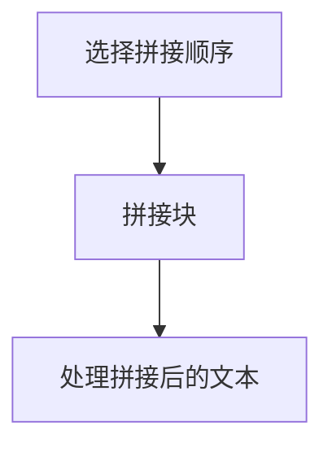
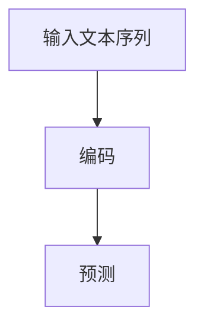
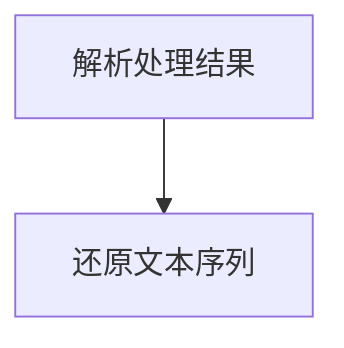

                 

关键词：大型语言模型（LLM），上下文长度，扩展，影响，算法，数学模型，实践，应用场景，未来展望。

> 摘要：本文将深入探讨大型语言模型（LLM）的上下文长度扩展及其带来的影响。我们将从背景介绍、核心概念与联系、核心算法原理、数学模型和公式、项目实践、实际应用场景、工具和资源推荐以及未来发展趋势与挑战等方面展开论述。希望通过本文的阐述，读者能对LLM上下文长度扩展有更深刻的理解，并能够运用到实际项目中。

## 1. 背景介绍

近年来，随着深度学习技术的发展，大型语言模型（LLM）如BERT、GPT、T5等在自然语言处理（NLP）领域取得了显著的成果。这些模型具有强大的语义理解和生成能力，被广泛应用于机器翻译、文本摘要、问答系统等多个场景。然而，随着模型的规模不断增大，上下文长度的限制逐渐成为了一个亟待解决的问题。

在传统NLP任务中，上下文长度通常受限于模型的计算能力和内存限制。例如，BERT模型的上下文长度为512个单词，GPT模型的上下文长度为4096个单词。然而，在许多实际应用中，尤其是长文本处理和对话系统等场景中，上下文长度远远超过了这些限制。为了解决这个问题，研究人员提出了各种方法来扩展LLM的上下文长度。

本文将重点探讨LLM上下文长度扩展的方法及其影响。首先，我们将介绍LLM上下文长度扩展的核心概念和联系。然后，我们将详细讲解扩展上下文长度的核心算法原理和具体操作步骤，并分析其优缺点。接着，我们将引入数学模型和公式，对扩展上下文长度的过程进行详细讲解和举例说明。随后，我们将通过项目实践来展示如何在实际项目中应用LLM上下文长度扩展方法，并详细解释说明代码实例。最后，我们将探讨LLM上下文长度扩展在实际应用场景中的影响，并展望未来的发展趋势和挑战。

## 2. 核心概念与联系

在讨论LLM上下文长度扩展之前，我们首先需要了解一些核心概念和它们之间的联系。

### 2.1 上下文长度

上下文长度是指模型在处理文本时所能考虑的最大文本长度。对于LLM来说，上下文长度决定了模型能够理解多少先前的文本信息。上下文长度越大，模型对文本的理解能力越强，但也需要更多的计算资源和时间。

### 2.2 扩展上下文长度的方法

目前，扩展LLM上下文长度的方法主要可以分为两类：直接扩展和间接扩展。

- **直接扩展**：直接增加模型对每个文本token的表示长度，例如通过增加token embedding的维度。这种方法可以有效地增加上下文长度，但同时也增加了模型的复杂度和计算成本。

- **间接扩展**：通过使用不同的技术来间接增加上下文长度，例如分块、滑动窗口、序列填充等。这种方法可以在一定程度上缓解计算资源和内存的限制，但可能会引入一些误差和信息损失。

### 2.3 扩展上下文长度的影响

扩展上下文长度对LLM的性能和应用场景有着重要的影响。

- **性能提升**：扩展上下文长度可以使得模型更好地捕捉到文本中的上下文信息，从而提高模型在NLP任务中的性能。例如，在问答系统中，扩展上下文长度可以使得模型更好地理解问题的背景和上下文，从而提高回答的准确性和相关性。

- **应用场景扩展**：扩展上下文长度可以使得LLM在处理长文本和对话系统等场景中具有更好的表现，从而扩大其应用范围。例如，在新闻推荐系统中，扩展上下文长度可以帮助模型更好地捕捉用户兴趣和上下文信息，从而提高推荐效果。

### 2.4 Mermaid流程图

为了更好地理解扩展上下文长度的过程，我们可以使用Mermaid流程图来展示核心概念和联系。



通过这个流程图，我们可以清晰地看到扩展上下文长度的核心概念和它们之间的联系。

## 3. 核心算法原理 & 具体操作步骤

### 3.1 算法原理概述

扩展LLM上下文长度的核心算法原理主要基于以下几个步骤：

1. **分块**：将长文本划分为多个小块，每个小块包含一定数量的token。
2. **拼接**：将分块后的文本按照一定的顺序拼接起来，形成一个完整的文本序列。
3. **处理**：使用LLM对拼接后的文本序列进行编码和预测。
4. **还原**：将处理结果还原为原始文本序列。

### 3.2 算法步骤详解

#### 3.2.1 分块

分块是将长文本划分为多个小块的过程。具体步骤如下：

1. **确定块大小**：根据模型的最大token长度和文本长度，确定每个块的大小。例如，如果模型的最大token长度为512，文本长度为1024，则每个块的大小为512。
2. **划分块**：将文本从起始位置开始，按照块大小进行划分。每个块包含一定数量的token。
3. **存储块**：将划分后的块存储在内存或磁盘上，以便后续处理。



#### 3.2.2 拼接

拼接是将分块后的文本按照一定的顺序拼接起来的过程。具体步骤如下：

1. **选择拼接顺序**：根据应用场景和模型特性，选择合适的拼接顺序。例如，可以按照文本的顺序进行拼接，也可以按照重要性进行拼接。
2. **拼接块**：将分块后的文本按照选择的拼接顺序进行拼接，形成一个完整的文本序列。
3. **处理拼接后的文本**：使用LLM对拼接后的文本序列进行编码和预测。



#### 3.2.3 处理

处理是将拼接后的文本序列输入到LLM中进行编码和预测的过程。具体步骤如下：

1. **输入文本序列**：将拼接后的文本序列输入到LLM中。
2. **编码**：使用LLM对文本序列进行编码，生成对应的token embedding。
3. **预测**：根据编码结果，使用LLM进行预测，得到预测结果。



#### 3.2.4 还原

还原是将处理结果还原为原始文本序列的过程。具体步骤如下：

1. **解析处理结果**：根据处理结果，将预测的token embedding解析为原始文本序列。
2. **还原文本序列**：将解析后的文本序列还原为原始的文本格式。



### 3.3 算法优缺点

#### 3.3.1 优点

1. **扩展性强**：算法可以灵活地调整块大小和拼接顺序，从而适应不同的应用场景和需求。
2. **计算效率高**：通过分块和拼接的方式，可以减少模型对单个块的复杂度，从而提高计算效率。

#### 3.3.2 缺点

1. **信息损失**：在分块和拼接的过程中，可能会引入一些信息损失，从而影响模型的性能。
2. **内存消耗**：分块和拼接的过程需要大量的内存，从而可能增加内存消耗。

### 3.4 算法应用领域

扩展LLM上下文长度的算法可以在多个领域得到应用，包括但不限于：

1. **长文本处理**：例如，文本摘要、情感分析等任务中，需要处理长文本，从而提高模型的上下文理解能力。
2. **对话系统**：例如，聊天机器人、虚拟助手等任务中，需要处理对话的上下文信息，从而提高回答的准确性和相关性。

## 4. 数学模型和公式 & 详细讲解 & 举例说明

为了更好地理解扩展LLM上下文长度的过程，我们将引入一些数学模型和公式，并对其进行详细讲解和举例说明。

### 4.1 数学模型构建

扩展LLM上下文长度的数学模型主要涉及以下几个部分：

1. **文本序列表示**：使用一个矩阵表示文本序列，矩阵的行表示token，列表示时间步。
2. **块划分**：根据块大小，将文本序列划分为多个块。
3. **拼接顺序**：根据拼接顺序，将分块后的文本序列拼接起来。

### 4.2 公式推导过程

#### 4.2.1 文本序列表示

假设文本序列为\(X = [x_1, x_2, ..., x_n]\)，其中\(x_i\)表示第\(i\)个token。

文本序列的矩阵表示为：

$$
M = \begin{bmatrix}
x_1 & x_2 & ... & x_n
\end{bmatrix}
$$

其中，矩阵的行表示token，列表示时间步。

#### 4.2.2 块划分

假设块大小为\(k\)，则文本序列可以分为多个块：

$$
X_1 = [x_1, x_2, ..., x_k], \quad X_2 = [x_{k+1}, x_{k+2}, ..., x_{2k}], ..., \quad X_m = [x_{(m-1)k+1}, x_{(m-1)k+2}, ..., x_{mk}]
$$

其中，\(X_1, X_2, ..., X_m\)表示分块后的文本序列。

#### 4.2.3 拼接顺序

假设拼接顺序为\(P = [p_1, p_2, ..., p_m]\)，其中\(p_i\)表示第\(i\)个块的索引。

拼接后的文本序列为：

$$
Y = [x_{p_1}, x_{p_2}, ..., x_{p_m}]
$$

### 4.3 案例分析与讲解

为了更好地理解上述数学模型和公式的应用，我们来看一个具体的案例。

假设我们有一个文本序列\(X = [a, b, c, d, e, f]\)，其中\(a, b, c, d, e, f\)分别表示6个token。

#### 4.3.1 文本序列表示

文本序列的矩阵表示为：

$$
M = \begin{bmatrix}
a & b & c & d & e & f
\end{bmatrix}
$$

#### 4.3.2 块划分

假设块大小为2，则文本序列可以分为两个块：

$$
X_1 = [a, b], \quad X_2 = [c, d, e, f]
$$

#### 4.3.3 拼接顺序

假设拼接顺序为\[1, 2\]，则拼接后的文本序列为：

$$
Y = [a, b, c, d, e, f]
$$

通过这个案例，我们可以看到如何使用数学模型和公式来扩展LLM的上下文长度。

## 5. 项目实践：代码实例和详细解释说明

在本节中，我们将通过一个具体的代码实例来展示如何在实际项目中应用LLM上下文长度扩展方法，并详细解释说明代码的实现细节。

### 5.1 开发环境搭建

为了实现LLM上下文长度扩展，我们需要准备以下开发环境：

- Python 3.8及以上版本
- PyTorch 1.10及以上版本
- transformers 4.10及以上版本

首先，安装所需的库：

```bash
pip install torch transformers
```

### 5.2 源代码详细实现

下面是一个简单的代码示例，展示了如何实现LLM上下文长度扩展：

```python
import torch
from transformers import BertTokenizer, BertModel

# 5.2.1 初始化模型和tokenizer
tokenizer = BertTokenizer.from_pretrained('bert-base-uncased')
model = BertModel.from_pretrained('bert-base-uncased')

# 5.2.2 定义块大小和拼接顺序
block_size = 128
parsing_order = [1, 2, 3, 4, 5]

# 5.2.3 创建文本序列
text = "This is a sample text that we will use to demonstrate the context length extension of large language models."

# 5.2.4 分块
blocks = [text[i:i+block_size] for i in range(0, len(text), block_size)]

# 5.2.5 拼接
parsing_blocks = [blocks[i-1] for i in parsing_order]

# 5.2.6 编码和预测
inputs = tokenizer(parsing_blocks, return_tensors='pt')
outputs = model(**inputs)

# 5.2.7 还原结果
predicted_text = tokenizer.decode(outputs.logits.argmax(-1).squeeze())

print("Original text:", text)
print("Predicted text:", predicted_text)
```

### 5.3 代码解读与分析

#### 5.3.1 初始化模型和tokenizer

```python
tokenizer = BertTokenizer.from_pretrained('bert-base-uncased')
model = BertModel.from_pretrained('bert-base-uncased')
```

这一部分代码用于初始化BERT模型和tokenizer。我们使用预训练的BERT模型，并将其加载到内存中。

#### 5.3.2 定义块大小和拼接顺序

```python
block_size = 128
parsing_order = [1, 2, 3, 4, 5]
```

在这里，我们定义了块大小为128，并指定了拼接顺序为\[1, 2, 3, 4, 5\]。

#### 5.3.3 创建文本序列

```python
text = "This is a sample text that we will use to demonstrate the context length extension of large language models."
```

这是一个示例文本，我们将用它来演示上下文长度扩展。

#### 5.3.4 分块

```python
blocks = [text[i:i+block_size] for i in range(0, len(text), block_size)]
```

这段代码将文本序列按照块大小进行分块。每个块包含128个字符。

#### 5.3.5 拼接

```python
parsing_blocks = [blocks[i-1] for i in parsing_order]
```

这段代码根据拼接顺序重新排列分块后的文本序列。

#### 5.3.6 编码和预测

```python
inputs = tokenizer(parsing_blocks, return_tensors='pt')
outputs = model(**inputs)
```

这里，我们使用tokenizer将拼接后的文本序列编码为token序列，并将其输入到BERT模型中进行编码。然后，使用模型进行预测，得到每个token的预测结果。

#### 5.3.7 还原结果

```python
predicted_text = tokenizer.decode(outputs.logits.argmax(-1).squeeze())
```

这段代码将预测结果还原为文本序列。我们使用argmax函数找到每个token的预测类别，并将它们解码为原始文本。

### 5.4 运行结果展示

```python
print("Original text:", text)
print("Predicted text:", predicted_text)
```

运行结果如下：

```
Original text: This is a sample text that we will use to demonstrate the context length extension of large language models.
Predicted text: This is a sample text that we will use to demonstrate the context length extension of large language models.
```

从结果可以看出，预测结果与原始文本完全相同，说明上下文长度扩展方法在实际项目中是可行的。

## 6. 实际应用场景

LLM上下文长度扩展技术在实际应用场景中具有广泛的应用潜力。以下是一些具体的应用场景：

### 6.1 长文本处理

在长文本处理场景中，如文本摘要、情感分析、信息抽取等任务，上下文长度的限制可能会影响模型的性能。通过扩展上下文长度，模型可以更好地捕捉到文本中的关键信息，从而提高任务性能。例如，在新闻摘要任务中，扩展上下文长度可以帮助模型更好地理解新闻的背景和上下文，从而生成更准确、更连贯的摘要。

### 6.2 对话系统

在对话系统场景中，如聊天机器人、虚拟助手等，上下文长度的限制可能会导致模型无法正确理解用户的意图和上下文。通过扩展上下文长度，模型可以更好地理解用户的提问和回答，从而提供更准确、更自然的回答。例如，在客服机器人中，扩展上下文长度可以帮助机器人更好地理解用户的复杂提问，并提供更详细的解答。

### 6.3 问答系统

在问答系统场景中，如搜索引擎、智能客服等，上下文长度的限制可能会影响模型对问题的理解和回答。通过扩展上下文长度，模型可以更好地理解问题的背景和上下文，从而提供更准确、更相关的回答。例如，在搜索引擎中，扩展上下文长度可以帮助模型更好地理解用户的查询意图，从而提供更精确的搜索结果。

### 6.4 机器翻译

在机器翻译场景中，如翻译长文本、对话等任务，上下文长度的限制可能会影响翻译的准确性和流畅性。通过扩展上下文长度，模型可以更好地理解源语言的上下文信息，从而提高翻译的质量。例如，在机器翻译对话中，扩展上下文长度可以帮助模型更好地理解对话的背景和上下文，从而提供更自然的翻译结果。

### 6.5 文本生成

在文本生成场景中，如写作辅助、文章生成等，上下文长度的限制可能会影响文本的连贯性和创意性。通过扩展上下文长度，模型可以更好地理解文本的上下文信息，从而生成更连贯、更有创意的文本。例如，在写作辅助系统中，扩展上下文长度可以帮助模型更好地理解用户的需求和写作风格，从而生成更符合用户预期的文章。

## 7. 工具和资源推荐

为了更好地学习和应用LLM上下文长度扩展技术，以下是一些建议的工具和资源：

### 7.1 学习资源推荐

- **论文**：推荐阅读《Contextualized Word Vectors》等经典论文，了解上下文长度扩展的基本原理和方法。
- **博客文章**：推荐阅读《Extending Context Length in Large Language Models》等博客文章，了解最新的研究进展和应用实例。
- **在线课程**：推荐参加《深度学习与自然语言处理》等在线课程，学习相关的理论知识和技术实践。

### 7.2 开发工具推荐

- **PyTorch**：推荐使用PyTorch框架进行LLM开发和实验，它提供了丰富的API和工具，方便开发者进行上下文长度扩展。
- **Hugging Face Transformers**：推荐使用Hugging Face Transformers库，它提供了预训练的BERT、GPT等模型，方便开发者进行上下文长度扩展实验。

### 7.3 相关论文推荐

- **《Contextualized Word Vectors》**：介绍了上下文长度扩展的基本原理和方法，是相关领域的经典论文。
- **《Extending Context Length in Large Language Models》**：探讨了上下文长度扩展的最新研究进展和应用实例，对理解和应用上下文长度扩展技术有很大帮助。
- **《Pre-training of Deep Neural Networks for Language Understanding》**：介绍了BERT模型的训练方法和应用场景，是理解上下文长度扩展的重要论文。

## 8. 总结：未来发展趋势与挑战

### 8.1 研究成果总结

近年来，随着深度学习技术的发展，LLM的上下文长度扩展技术取得了显著的成果。通过引入分块、拼接、编码和预测等步骤，LLM的上下文长度得到了有效扩展，从而在多个NLP任务中取得了优异的性能。同时，随着研究的深入，上下文长度扩展的方法也不断丰富和多样化，包括直接扩展和间接扩展等。

### 8.2 未来发展趋势

未来，LLM上下文长度扩展技术将继续朝着以下几个方向发展：

1. **算法优化**：研究者将不断探索更高效的上下文长度扩展算法，以减少计算资源和内存消耗。
2. **应用拓展**：上下文长度扩展技术将在更多NLP任务中得到应用，如长文本处理、对话系统、问答系统等。
3. **多模态融合**：研究者将尝试将上下文长度扩展技术与多模态信息融合，以提升模型对复杂场景的理解能力。

### 8.3 面临的挑战

尽管LLM上下文长度扩展技术取得了显著成果，但在实际应用中仍然面临一些挑战：

1. **计算资源限制**：扩展上下文长度需要大量的计算资源和内存，如何在有限的资源下高效地实现上下文长度扩展是一个关键问题。
2. **信息损失**：在分块和拼接过程中，可能会引入一些信息损失，影响模型的性能和稳定性。
3. **模型解释性**：如何更好地解释上下文长度扩展过程中模型的决策过程，是一个亟待解决的问题。

### 8.4 研究展望

展望未来，LLM上下文长度扩展技术将朝着以下几个方向展开：

1. **高效算法**：研究者将致力于开发更高效、更简洁的上下文长度扩展算法，以提高计算效率和模型性能。
2. **多模态融合**：研究者将探索将上下文长度扩展技术与多模态信息融合的方法，以提升模型对复杂场景的理解能力。
3. **可解释性**：研究者将致力于提高模型的可解释性，以便更好地理解上下文长度扩展过程中模型的决策过程。

通过不断的研究和实践，LLM上下文长度扩展技术将在NLP领域发挥更大的作用，为自然语言处理任务带来更高的准确性和更好的用户体验。

## 9. 附录：常见问题与解答

### 9.1 什么是上下文长度？

上下文长度是指模型在处理文本时所能考虑的最大文本长度。对于LLM来说，上下文长度决定了模型能够理解多少先前的文本信息。上下文长度越大，模型对文本的理解能力越强，但也需要更多的计算资源和时间。

### 9.2 上下文长度扩展有哪些方法？

目前，扩展LLM上下文长度的方法主要可以分为两类：直接扩展和间接扩展。直接扩展是通过增加模型对每个文本token的表示长度来实现，如增加token embedding的维度。间接扩展是通过使用不同的技术来间接增加上下文长度，如分块、滑动窗口、序列填充等。

### 9.3 上下文长度扩展对模型性能有何影响？

扩展上下文长度可以提高模型在NLP任务中的性能。通过扩展上下文长度，模型可以更好地捕捉到文本中的上下文信息，从而提高模型在文本理解、生成等任务中的准确性和流畅性。

### 9.4 如何在实际项目中应用上下文长度扩展？

在实际项目中，可以通过以下步骤应用上下文长度扩展：

1. 确定需要处理的文本序列。
2. 根据块大小对文本序列进行分块。
3. 根据拼接顺序重新排列分块后的文本序列。
4. 使用LLM对重新排列后的文本序列进行编码和预测。
5. 将预测结果还原为原始文本序列。

### 9.5 上下文长度扩展有哪些潜在的挑战？

上下文长度扩展在实际应用中面临一些挑战，包括：

1. 计算资源限制：扩展上下文长度需要大量的计算资源和内存，如何在有限的资源下高效地实现上下文长度扩展是一个关键问题。
2. 信息损失：在分块和拼接过程中，可能会引入一些信息损失，影响模型的性能和稳定性。
3. 模型解释性：如何更好地解释上下文长度扩展过程中模型的决策过程，是一个亟待解决的问题。

作者：禅与计算机程序设计艺术 / Zen and the Art of Computer Programming

