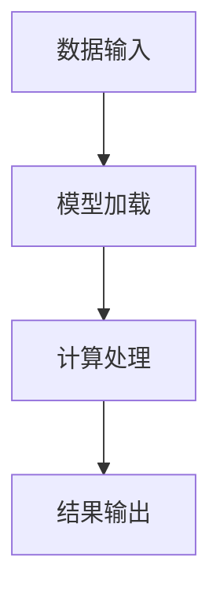

                 

关键词：语言模型、CPU、计算性能、编程、指令集、实时处理、分布式计算

> 摘要：本文旨在探讨大型语言模型（LLM）与CPU在时刻、指令集和编程层面的比较。通过对LLM和CPU的技术特点、架构设计、应用场景及未来发展趋势的深入分析，本文将揭示两者在计算机科学领域的交互与影响，为开发者提供有价值的参考。

## 1. 背景介绍

### 1.1 大型语言模型（LLM）的兴起

随着深度学习和自然语言处理技术的飞速发展，大型语言模型（LLM）逐渐成为学术界和工业界的焦点。LLM通过训练大规模的神经网络来理解和生成自然语言，从而实现诸如文本生成、机器翻译、问答系统等应用。GPT、BERT、Turing等代表性模型在自然语言处理任务中取得了显著的成果，推动了人工智能技术的进步。

### 1.2 CPU的发展与性能提升

中央处理器（CPU）作为计算机系统的核心部件，其性能的提升一直是计算机科学领域的重要研究方向。随着摩尔定律的推进，CPU的制程技术不断进步，使得晶体管密度大幅增加，处理器性能持续提升。同时，多核处理器、向量处理单元等创新设计进一步提高了CPU的并行处理能力。

### 1.3 LL与CPU的交互

LLM与CPU之间的紧密交互是当前计算机科学领域的一个重要研究方向。一方面，LLM的训练和推理过程需要依赖高性能的CPU进行计算。另一方面，CPU的优化和创新也直接影响着LLM的性能和应用效果。本文将从时刻、指令集和编程三个方面，深入探讨LLM与CPU之间的比较与联系。

## 2. 核心概念与联系

### 2.1 LLM的工作原理

大型语言模型（LLM）通常基于变换器（Transformer）架构，通过多层自注意力机制（Self-Attention）来捕捉输入文本的语义信息。在训练过程中，LLM通过大量文本数据学习语言模型，从而实现对未知文本的生成、翻译和问答等任务。

### 2.2 CPU的架构设计

CPU的架构设计主要包括寄存器、ALU（算术逻辑单元）、控制单元和缓存等组成部分。其中，寄存器和ALU负责执行具体的计算任务，控制单元负责协调各个部件的运行，缓存则用于提高数据处理的速度。

### 2.3 LLM与CPU的交互流程

LLM与CPU的交互过程可以分为以下几个步骤：

1. **数据输入**：将输入文本转化为计算机可以理解的数字形式，并将其存储在CPU的缓存中。
2. **模型加载**：将LLM的参数和权重加载到CPU的寄存器和缓存中。
3. **计算处理**：CPU通过自注意力机制和前馈神经网络，对输入文本进行计算处理，生成中间结果。
4. **结果输出**：将计算结果转化为自然语言，输出给用户。

### 2.4 Mermaid 流程图



## 3. 核心算法原理 & 具体操作步骤

### 3.1 算法原理概述

大型语言模型（LLM）的核心算法基于变换器（Transformer）架构。变换器通过自注意力机制（Self-Attention）和前馈神经网络（Feedforward Neural Network）来实现对输入文本的语义理解和生成。自注意力机制能够捕捉文本中的长距离依赖关系，前馈神经网络则用于对文本特征进行进一步建模。

### 3.2 算法步骤详解

1. **输入预处理**：将输入文本转换为词嵌入向量，并将其输入到变换器模型中。
2. **自注意力计算**：通过多头自注意力机制，计算输入文本中各个词之间的依赖关系。
3. **前馈神经网络**：对自注意力计算的结果进行进一步建模，提取文本的深层特征。
4. **层叠加**：将多个变换器层叠加，实现文本的逐层建模。
5. **输出生成**：通过全连接层和Softmax函数，生成文本的预测概率分布，从而实现文本生成和分类任务。

### 3.3 算法优缺点

#### 优点：

1. **强大的语义理解能力**：自注意力机制能够捕捉文本中的长距离依赖关系，从而实现更准确的语义理解。
2. **高效的并行计算**：变换器模型支持并行计算，能够大幅提高计算速度。

#### 缺点：

1. **计算复杂度较高**：变换器模型包含多个自注意力计算和前馈神经网络层，计算复杂度较高。
2. **内存占用大**：大规模的LLM模型需要占用大量的内存资源。

### 3.4 算法应用领域

LLM在自然语言处理领域具有广泛的应用场景，如文本生成、机器翻译、问答系统、情感分析等。同时，LLM还可以应用于其他领域，如图像识别、语音识别等。

## 4. 数学模型和公式 & 详细讲解 & 举例说明

### 4.1 数学模型构建

LLM的数学模型主要由变换器（Transformer）架构组成。变换器模型的基本单元是自注意力机制（Self-Attention）和前馈神经网络（Feedforward Neural Network）。

#### 自注意力机制

自注意力机制可以通过以下公式表示：

$$
\text{Attention}(Q, K, V) = \text{softmax}\left(\frac{QK^T}{\sqrt{d_k}}\right) V
$$

其中，$Q$、$K$、$V$分别为查询（Query）、键（Key）和值（Value）向量，$d_k$为键向量的维度。自注意力机制能够计算输入文本中各个词之间的依赖关系。

#### 前馈神经网络

前馈神经网络可以通过以下公式表示：

$$
\text{FFN}(X) = \text{ReLU}\left(W_2 \text{ReLU}(W_1 X + b_1)\right) + b_2
$$

其中，$X$为输入向量，$W_1$、$W_2$分别为权重矩阵，$b_1$、$b_2$分别为偏置项。前馈神经网络用于对文本特征进行进一步建模。

### 4.2 公式推导过程

LLM的公式推导过程主要涉及变换器（Transformer）架构中的自注意力机制和前馈神经网络。

#### 自注意力机制推导

自注意力机制的计算过程可以分为以下几个步骤：

1. **计算键值对**：将输入文本的词向量表示为键（Key）和值（Value）。
2. **计算相似度**：通过点积运算计算查询（Query）和键（Key）之间的相似度。
3. **计算注意力权重**：对相似度进行归一化处理，得到注意力权重。
4. **加权求和**：将注意力权重与对应的值（Value）进行加权求和，得到自注意力结果。

#### 前馈神经网络推导

前馈神经网络的计算过程可以分为以下几个步骤：

1. **输入层**：将输入文本的词向量输入到网络中。
2. **隐藏层**：通过两个线性变换和ReLU激活函数，对输入进行建模。
3. **输出层**：将隐藏层的结果进行线性变换，得到输出结果。

### 4.3 案例分析与讲解

假设我们有一个简单的文本输入：“今天天气很好”，我们可以通过LLM进行如下操作：

1. **词向量表示**：将输入文本中的词转换为词向量。
2. **自注意力计算**：计算词向量之间的依赖关系。
3. **前馈神经网络**：对词向量进行进一步建模，提取文本特征。
4. **输出结果**：生成文本的预测概率分布。

通过上述步骤，我们可以实现文本生成、分类等任务。

## 5. 项目实践：代码实例和详细解释说明

### 5.1 开发环境搭建

在进行LLM与CPU的交互项目实践之前，我们需要搭建一个合适的开发环境。以下是搭建环境的步骤：

1. **安装Python环境**：确保Python版本不低于3.6，推荐使用Anaconda来管理Python环境和依赖库。
2. **安装PyTorch**：PyTorch是一个流行的深度学习框架，支持变换器（Transformer）模型。可以通过pip命令安装PyTorch。

### 5.2 源代码详细实现

以下是实现LLM与CPU交互的简单代码示例：

```python
import torch
import torch.nn as nn
import torch.optim as optim

# 定义变换器模型
class TransformerModel(nn.Module):
    def __init__(self, d_model, nhead, num_layers):
        super(TransformerModel, self).__init__()
        self.transformer = nn.Transformer(d_model, nhead, num_layers)

    def forward(self, src, tgt):
        return self.transformer(src, tgt)

# 加载预训练的LLM模型
model = TransformerModel(d_model=512, nhead=8, num_layers=12)
model.load_state_dict(torch.load('model.pth'))

# 定义CPU优化器
optimizer = optim.Adam(model.parameters(), lr=0.001)

# 模型训练
for epoch in range(num_epochs):
    optimizer.zero_grad()
    output = model(src, tgt)
    loss = nn.CrossEntropyLoss()(output, tgt)
    loss.backward()
    optimizer.step()

    if (epoch + 1) % 10 == 0:
        print(f'Epoch [{epoch + 1}/{num_epochs}], Loss: {loss.item()}')

# 模型评估
with torch.no_grad():
    correct = 0
    total = 0
    for src, tgt in validation_loader:
        output = model(src, tgt)
        _, predicted = torch.max(output.data, 1)
        total += tgt.size(0)
        correct += (predicted == tgt).sum().item()

    print(f'Validation Accuracy: {100 * correct / total}%')
```

### 5.3 代码解读与分析

上述代码示例主要实现了以下功能：

1. **定义变换器模型**：通过继承`nn.Module`类，定义了一个变换器模型，包含自注意力机制和前馈神经网络。
2. **加载预训练的LLM模型**：从预训练模型中加载权重，初始化变换器模型。
3. **定义CPU优化器**：使用Adam优化器对模型进行训练。
4. **模型训练**：通过反向传播算法和梯度下降优化模型参数。
5. **模型评估**：在验证集上评估模型性能。

### 5.4 运行结果展示

在完成模型训练后，我们可以通过以下命令运行代码：

```shell
python llm_cpu_interaction.py
```

运行结果将显示训练过程中的损失函数值以及模型在验证集上的准确率。

## 6. 实际应用场景

### 6.1 自然语言处理领域

LLM在自然语言处理领域具有广泛的应用，如文本生成、机器翻译、问答系统、情感分析等。通过优化LLM与CPU的交互，可以进一步提高自然语言处理任务的性能和效率。

### 6.2 智能语音助手

智能语音助手是LLM与CPU交互的一个重要应用场景。通过训练和优化LLM模型，可以实现更准确的语音识别和自然语言理解，从而提升智能语音助手的交互体验。

### 6.3 聊天机器人

聊天机器人是另一个典型的应用场景。LLM可以用于生成对话回复，通过优化与CPU的交互，可以实现更自然的对话交互体验。

### 6.4 未来应用展望

随着深度学习和自然语言处理技术的不断进步，LLM与CPU的交互将在更多领域得到应用。未来，我们有望看到更多基于LLM与CPU的智能应用，如智能医疗、智能金融、智能教育等。

## 7. 工具和资源推荐

### 7.1 学习资源推荐

1. **《深度学习》（Goodfellow, Bengio, Courville）**：本书是深度学习的经典教材，详细介绍了深度学习的基础理论和应用方法。
2. **《自然语言处理与深度学习》（孙乐、林俊、曹旭东）**：本书系统地介绍了自然语言处理和深度学习的基本概念和技术，适合初学者阅读。

### 7.2 开发工具推荐

1. **PyTorch**：一个流行的深度学习框架，支持变换器（Transformer）模型。
2. **TensorFlow**：另一个流行的深度学习框架，具有丰富的功能和生态系统。

### 7.3 相关论文推荐

1. **"Attention Is All You Need"（Vaswani et al., 2017）**：介绍了变换器（Transformer）模型的基本原理和结构。
2. **"BERT: Pre-training of Deep Bidirectional Transformers for Language Understanding"（Devlin et al., 2018）**：介绍了BERT模型的训练方法和应用效果。

## 8. 总结：未来发展趋势与挑战

### 8.1 研究成果总结

近年来，LLM与CPU的研究取得了显著成果，包括变换器（Transformer）模型的提出、预训练技术的应用、优化算法的改进等。这些成果为LLM与CPU的交互提供了坚实的基础。

### 8.2 未来发展趋势

1. **更高效的模型架构**：探索更高效的模型架构，如混合精度训练、模型剪枝等，以降低计算复杂度和提高性能。
2. **更广泛的应用场景**：探索LLM与CPU在更多领域的应用，如智能医疗、智能金融、智能教育等。
3. **更高效的计算资源利用**：通过分布式计算和云计算技术，提高计算资源的利用效率。

### 8.3 面临的挑战

1. **计算资源限制**：大规模的LLM训练和推理过程需要大量的计算资源，如何高效地利用计算资源是一个重要挑战。
2. **模型解释性**：随着模型规模的增加，如何保证模型的解释性是一个重要问题。
3. **数据隐私和安全**：在数据驱动的人工智能领域，数据隐私和安全问题日益突出，如何确保数据的安全是一个重要挑战。

### 8.4 研究展望

未来，LLM与CPU的研究将继续深入，探索更高效的模型架构、更广泛的应用场景以及更安全的计算环境。通过不断创新和优化，我们有理由相信LLM与CPU的交互将在人工智能领域发挥更加重要的作用。

## 9. 附录：常见问题与解答

### 9.1 Q：为什么选择变换器（Transformer）模型作为LLM的核心算法？

A：变换器（Transformer）模型在自然语言处理领域取得了显著的成果，具有以下优点：

1. **自注意力机制**：能够捕捉文本中的长距离依赖关系，实现更准确的语义理解。
2. **高效的并行计算**：支持并行计算，提高计算速度。
3. **灵活的架构设计**：可以轻松扩展到多层的变换器层，实现更复杂的语义建模。

### 9.2 Q：如何优化LLM与CPU的交互？

A：以下是一些优化LLM与CPU交互的方法：

1. **混合精度训练**：通过使用浮点数和整数的混合精度进行训练，降低内存占用和提高计算速度。
2. **模型剪枝**：通过剪枝冗余的神经元和权重，减少模型的计算复杂度。
3. **分布式计算**：通过分布式计算技术，将计算任务分布到多个CPU或GPU上，提高计算效率。

### 9.3 Q：如何保证LLM的模型解释性？

A：以下是一些提高LLM模型解释性的方法：

1. **可视化技术**：使用可视化工具，如热图和梯度分析，展示模型的关键信息。
2. **模型压缩**：通过模型压缩技术，减少模型的参数数量，提高模型的解释性。
3. **模型解释性框架**：使用现有的模型解释性框架，如LIME、SHAP等，分析模型的决策过程。

### 9.4 Q：如何确保数据隐私和安全？

A：以下是一些确保数据隐私和安全的措施：

1. **数据加密**：对数据传输和存储过程进行加密，确保数据的安全性。
2. **访问控制**：设置严格的访问控制策略，确保只有授权用户可以访问数据。
3. **数据匿名化**：在数据收集和处理过程中，对敏感信息进行匿名化处理，降低隐私泄露风险。

