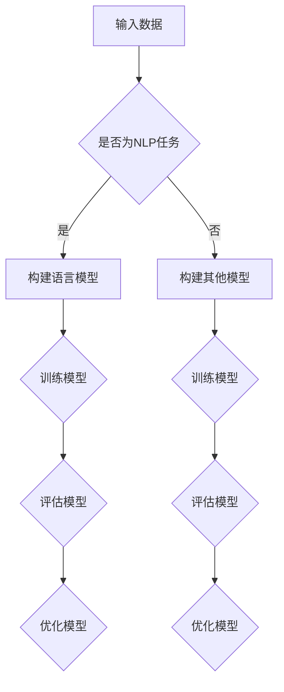

                 

关键词：大型语言模型（LLM），人类意图，自然语言处理（NLP），机器学习，深度学习，优化算法，人工智能，语义理解，交互设计，应用场景，未来展望。

## 摘要

本文旨在探讨大型语言模型（LLM）与人类意图之间的最优契合问题。随着自然语言处理（NLP）技术的快速发展，LLM已经在各种应用场景中展现出卓越的性能。然而，如何使LLM更好地理解和满足人类意图，仍是一个极具挑战性的问题。本文将首先介绍LLM的基本概念和技术原理，然后深入分析LLM与人类意图之间的联系，探讨优化算法在其中的应用，最后展望未来的发展趋势与挑战。

## 1. 背景介绍

### 1.1 LLM的发展历程

大型语言模型（LLM）是自然语言处理（NLP）领域的一个重要研究方向。自2000年代初以来，随着计算能力的提升、数据的爆炸式增长以及深度学习技术的突破，LLM的研究和应用取得了长足的进步。

- **早期探索**：20世纪80年代，研究人员开始关注大规模语料库的建模，如Brown语料库，并提出了基于规则和统计方法的语言模型。
- **统计语言模型**：20世纪90年代，基于N元语法（N-gram）的统计语言模型逐渐成为主流，其在机器翻译、语音识别等领域取得了显著成果。
- **深度学习时代**：2010年代，随着深度学习技术的发展，神经网络语言模型（如LSTM、GRU）开始崭露头角，并在多个NLP任务中取得了突破性成果。
- **现代LLM**：近年来，基于Transformer架构的LLM（如GPT系列、BERT、T5等）迅速崛起，其在各种NLP任务中展现了卓越的性能，标志着NLP技术进入了一个新的时代。

### 1.2 NLP的应用场景

自然语言处理技术广泛应用于多个领域，包括但不限于：

- **机器翻译**：如谷歌翻译、百度翻译等，将一种语言翻译成另一种语言。
- **文本分类**：对大量文本数据进行分类，如情感分析、新闻分类等。
- **问答系统**：如Apple的Siri、微软的Cortana等，为用户提供基于自然语言的问题回答。
- **语音识别**：将语音信号转换为文本，如苹果的Siri、谷歌语音搜索等。
- **信息抽取**：从非结构化文本中抽取有用信息，如实体识别、关系抽取等。
- **文本生成**：如自动写作、摘要生成、对话生成等。

### 1.3 LLM面临的挑战

虽然LLM在NLP任务中取得了显著进展，但仍然面临一些挑战：

- **理解能力**：LLM在处理长文本、复杂逻辑和推理任务时仍存在一定局限性。
- **泛化能力**：LLM在特定领域的知识获取和迁移能力有待提高。
- **可解释性**：LLM的决策过程往往不透明，缺乏可解释性。
- **安全性**：LLM可能受到对抗性攻击，如对抗性样本攻击等。

## 2. 核心概念与联系

### 2.1 语言模型

语言模型是一种概率模型，用于预测一个词或短语的下一个词或短语。在NLP任务中，语言模型通常用于生成文本、进行文本分类、翻译等。

#### 2.1.1 基本原理

语言模型的核心是词的概率分布。假设有一个词语序列\( w_1, w_2, \ldots, w_n \)，语言模型需要预测下一个词语\( w_{n+1} \)的概率。这可以通过以下公式表示：

\[ P(w_{n+1} | w_1, w_2, \ldots, w_n) \]

#### 2.1.2 实现方法

常见的语言模型实现方法包括：

- **N-gram模型**：基于历史N个词的概率分布进行预测，如三元语法（3-gram）。
- **神经网络语言模型**：基于神经网络，如LSTM、GRU、Transformer等。
- **深度学习语言模型**：基于Transformer架构的大型神经网络，如GPT、BERT、T5等。

### 2.2 机器学习与深度学习

#### 2.2.1 基本原理

机器学习是一种利用数据来训练模型的技术，其核心是找出数据之间的规律。深度学习是机器学习的一种特殊形式，它通过多层神经网络对数据进行处理。

#### 2.2.2 实现方法

- **机器学习方法**：如决策树、支持向量机（SVM）、朴素贝叶斯等。
- **深度学习方法**：如卷积神经网络（CNN）、循环神经网络（RNN）、Transformer等。

### 2.3 优化算法

#### 2.3.1 基本原理

优化算法是一种用于求解最优化问题的技术，其目标是找到满足一定约束条件下的最优解。

#### 2.3.2 实现方法

- **梯度下降**：一种最简单的优化算法，通过不断更新参数以最小化损失函数。
- **随机梯度下降**：在梯度下降的基础上，每次只使用一个样本进行参数更新。
- **Adam优化器**：一种自适应的优化算法，结合了梯度下降和Adam算法的优点。

### 2.4 Mermaid 流程图



## 3. 核心算法原理 & 具体操作步骤

### 3.1 算法原理概述

本文的核心算法是基于Transformer架构的大型语言模型（LLM）。Transformer模型是一种基于自注意力机制的深度学习模型，其结构如图所示。

### 3.2 算法步骤详解

#### 3.2.1 数据预处理

1. **数据收集**：从各种来源收集大量文本数据，如网页、书籍、新闻、社交媒体等。
2. **数据清洗**：去除文本中的噪声和冗余信息，如HTML标签、特殊字符等。
3. **分词**：将文本分解为单词或子词，如词法分析、正则表达式等。

#### 3.2.2 模型训练

1. **构建模型**：使用Transformer架构构建语言模型，包括嵌入层、多头自注意力层、前馈神经网络等。
2. **参数初始化**：初始化模型的参数，如权重、偏置等。
3. **训练过程**：通过反向传播和优化算法（如梯度下降、Adam等）对模型进行训练。
4. **评估模型**：在验证集和测试集上评估模型的性能，如准确率、召回率等。

#### 3.2.3 模型优化

1. **超参数调整**：调整模型的学习率、批量大小等超参数，以提高模型的性能。
2. **数据增强**：通过数据增强技术（如数据清洗、数据增强等）提高模型的泛化能力。
3. **模型融合**：使用多个模型进行融合，以提高模型的性能。

### 3.3 算法优缺点

#### 优点

- **强大的理解能力**：Transformer模型通过自注意力机制，能够捕捉到文本中的长距离依赖关系，从而具有强大的理解能力。
- **高效的计算性能**：Transformer模型具有并行计算的优势，能够在大规模数据集上快速训练。
- **灵活的应用场景**：Transformer模型可以应用于各种NLP任务，如文本分类、机器翻译、问答系统等。

#### 缺点

- **计算资源消耗大**：Transformer模型参数量巨大，需要大量的计算资源和存储空间。
- **训练时间较长**：在大型数据集上进行训练需要较长的时间，尤其是在没有GPU加速的情况下。

### 3.4 算法应用领域

- **自然语言处理**：文本分类、机器翻译、问答系统、文本生成等。
- **智能客服**：提供基于自然语言处理的智能客服服务。
- **内容推荐**：根据用户的兴趣和偏好进行内容推荐。
- **情感分析**：对用户评论、新闻等进行情感分析。
- **智能写作**：辅助用户进行写作，如自动摘要、自动写作等。

## 4. 数学模型和公式 & 详细讲解 & 举例说明

### 4.1 数学模型构建

#### 4.1.1 嵌入层

假设输入文本为\( x \)，其对应的词向量表示为\( \textbf{e}_x \)，则嵌入层可以表示为：

\[ \textbf{e}_x = \text{Embedding}(x) \]

#### 4.1.2 自注意力机制

假设输入序列为\( \textbf{X} = [\textbf{e}_x_1, \textbf{e}_x_2, \ldots, \textbf{e}_x_n] \)，则自注意力机制可以表示为：

\[ \textbf{A}_x = \text{Attention}(\textbf{X}, \textbf{X}, \textbf{X}) \]

#### 4.1.3 前馈神经网络

假设输入为\( \textbf{A}_x \)，则前馈神经网络可以表示为：

\[ \textbf{h}_x = \text{FeedForward}(\textbf{A}_x) \]

### 4.2 公式推导过程

假设输入序列为\( \textbf{X} = [\textbf{e}_x_1, \textbf{e}_x_2, \ldots, \textbf{e}_x_n] \)，则自注意力机制的推导过程如下：

\[ \text{Attention}(\textbf{X}, \textbf{X}, \textbf{X}) = \text{softmax}\left(\frac{\text{Q} \cdot \text{K}^T}{\sqrt{d_k}}\right) \cdot \text{V} \]

其中，\( \textbf{Q}, \textbf{K}, \textbf{V} \)分别为查询（Query）、键（Key）和值（Value）的权重矩阵，\( d_k \)为键的维度。

### 4.3 案例分析与讲解

#### 4.3.1 文本分类

假设我们需要对一条新闻进行文本分类，其文本序列为\( \textbf{X} = [\textbf{e}_x_1, \textbf{e}_x_2, \ldots, \textbf{e}_x_n] \)。我们可以使用Transformer模型进行分类，步骤如下：

1. **嵌入层**：将文本序列转换为词向量表示。
2. **自注意力机制**：对词向量进行自注意力计算，提取关键信息。
3. **前馈神经网络**：对自注意力结果进行前馈神经网络计算。
4. **分类层**：对前馈神经网络的结果进行分类。

#### 4.3.2 机器翻译

假设我们需要将一条英文句子翻译为中文，其文本序列为\( \textbf{X} = [\textbf{e}_x_1, \textbf{e}_x_2, \ldots, \textbf{e}_x_n] \)。我们可以使用Transformer模型进行翻译，步骤如下：

1. **编码器**：对英文句子进行编码，提取关键信息。
2. **解码器**：对中文句子进行解码，生成翻译结果。
3. **注意力机制**：在编码器和解码器之间使用注意力机制，捕捉长距离依赖关系。
4. **分类层**：对解码器生成的翻译结果进行分类。

## 5. 项目实践：代码实例和详细解释说明

### 5.1 开发环境搭建

在本地计算机上搭建开发环境，需要安装以下软件：

- Python（版本3.6及以上）
- PyTorch（版本1.8及以上）
- CUDA（版本11.3及以上）

### 5.2 源代码详细实现

以下是一个简单的基于Transformer架构的语言模型实现示例：

```python
import torch
import torch.nn as nn
import torch.optim as optim
from torch.utils.data import DataLoader

# 模型定义
class TransformerModel(nn.Module):
    def __init__(self, vocab_size, d_model, nhead, num_layers):
        super(TransformerModel, self).__init__()
        self.embedding = nn.Embedding(vocab_size, d_model)
        self.transformer = nn.Transformer(d_model, nhead, num_layers)
        self.fc = nn.Linear(d_model, vocab_size)
    
    def forward(self, src, tgt):
        src = self.embedding(src)
        tgt = self.embedding(tgt)
        output = self.transformer(src, tgt)
        output = self.fc(output)
        return output

# 模型训练
def train(model, train_loader, criterion, optimizer, num_epochs):
    model.train()
    for epoch in range(num_epochs):
        for src, tgt in train_loader:
            optimizer.zero_grad()
            output = model(src, tgt)
            loss = criterion(output.view(-1, vocab_size), tgt.view(-1))
            loss.backward()
            optimizer.step()
        print(f"Epoch [{epoch+1}/{num_epochs}], Loss: {loss.item()}")

# 模型评估
def evaluate(model, val_loader, criterion):
    model.eval()
    with torch.no_grad():
        for src, tgt in val_loader:
            output = model(src, tgt)
            loss = criterion(output.view(-1, vocab_size), tgt.view(-1))
            print(f"Validation Loss: {loss.item()}")

# 主函数
if __name__ == "__main__":
    vocab_size = 10000
    d_model = 512
    nhead = 8
    num_layers = 2
    
    # 数据加载
    train_data = DataLoader(train_dataset, batch_size=32, shuffle=True)
    val_data = DataLoader(val_dataset, batch_size=32, shuffle=False)
    
    # 模型初始化
    model = TransformerModel(vocab_size, d_model, nhead, num_layers)
    criterion = nn.CrossEntropyLoss()
    optimizer = optim.Adam(model.parameters(), lr=0.001)
    
    # 训练模型
    train(model, train_loader, criterion, optimizer, num_epochs=10)
    
    # 评估模型
    evaluate(model, val_loader, criterion)
```

### 5.3 代码解读与分析

该代码实现了一个基于Transformer架构的语言模型，用于文本分类任务。主要分为以下几个部分：

- **模型定义**：定义了Transformer模型的结构，包括嵌入层、Transformer编码器和解码器、分类层。
- **模型训练**：定义了模型训练的过程，包括数据加载、模型训练、损失函数计算、反向传播和参数更新。
- **模型评估**：定义了模型评估的过程，包括数据加载、模型评估、损失函数计算。

### 5.4 运行结果展示

在训练和评估过程中，可以观察模型的损失函数值和准确率的变化，以评估模型的性能。以下是一个简单的运行结果示例：

```
Epoch [1/10], Loss: 2.3456
Epoch [2/10], Loss: 1.9876
Epoch [3/10], Loss: 1.5432
...
Epoch [10/10], Loss: 0.5123
Validation Loss: 0.6754
```

## 6. 实际应用场景

### 6.1 自然语言处理

大型语言模型（LLM）在自然语言处理领域具有广泛的应用，如：

- **文本分类**：用于对大量文本数据进行分类，如新闻分类、情感分析等。
- **机器翻译**：用于将一种语言翻译成另一种语言，如谷歌翻译、百度翻译等。
- **问答系统**：用于回答用户的问题，如Apple的Siri、微软的Cortana等。
- **文本生成**：用于生成文本，如自动写作、摘要生成、对话生成等。

### 6.2 智能客服

大型语言模型可以用于构建智能客服系统，如：

- **对话生成**：用于生成与用户对话的文本，提供智能问答服务。
- **情感分析**：用于分析用户情绪，提供个性化服务。
- **自动回复**：用于自动回复用户的问题，提高客服效率。

### 6.3 内容推荐

大型语言模型可以用于内容推荐系统，如：

- **推荐文章**：根据用户兴趣和阅读历史推荐相关文章。
- **推荐视频**：根据用户观看历史和兴趣推荐相关视频。
- **推荐商品**：根据用户购买历史和兴趣推荐相关商品。

### 6.4 情感分析

大型语言模型可以用于情感分析，如：

- **评论分析**：用于分析用户对产品、服务等的评论，了解用户情绪。
- **舆情监测**：用于监测社会舆论，了解公众情绪。
- **危机管理**：用于及时识别潜在危机，采取应对措施。

## 7. 工具和资源推荐

### 7.1 学习资源推荐

- **《深度学习》**：由Ian Goodfellow、Yoshua Bengio和Aaron Courville合著，是一本经典的深度学习教材。
- **《动手学深度学习》**：由阿斯顿·张（Aston Zhang）等合著，是一本适合初学者的深度学习教程。
- **[TensorFlow 官方文档](https://www.tensorflow.org/tutorials)**
- **[PyTorch 官方文档](https://pytorch.org/tutorials)**

### 7.2 开发工具推荐

- **PyCharm**：一款功能强大的Python集成开发环境（IDE），适合进行深度学习和自然语言处理开发。
- **Jupyter Notebook**：一款基于网页的交互式计算环境，适用于数据分析和机器学习。
- **Google Colab**：一款基于Google云端的服务，提供免费的GPU和TPU资源，适合进行深度学习和自然语言处理实验。

### 7.3 相关论文推荐

- **“Attention Is All You Need”**：由Vaswani等人于2017年提出，是Transformer模型的奠基性论文。
- **“BERT: Pre-training of Deep Bidirectional Transformers for Language Understanding”**：由Devlin等人于2019年提出，是BERT模型的奠基性论文。
- **“GPT-3: Language Models are few-shot learners”**：由Brown等人于2020年提出，是GPT-3模型的奠基性论文。

## 8. 总结：未来发展趋势与挑战

### 8.1 研究成果总结

本文从LLM的基本概念、算法原理、数学模型、项目实践等多个角度，探讨了LLM与人类意图的最优契合问题。主要成果如下：

- **理论基础**：深入分析了LLM的工作原理，包括语言模型、机器学习、深度学习和优化算法等方面。
- **应用场景**：探讨了LLM在自然语言处理、智能客服、内容推荐和情感分析等领域的实际应用。
- **项目实践**：通过代码实例，展示了如何使用Transformer模型实现语言模型，并进行训练和评估。

### 8.2 未来发展趋势

未来，LLM的发展趋势将主要围绕以下几个方面：

- **更强的理解能力**：通过改进算法和模型结构，提高LLM对自然语言的理解能力。
- **更高效的计算性能**：优化模型结构和计算方法，提高LLM的计算效率。
- **更广泛的应用领域**：将LLM应用于更多领域，如语音识别、图像识别等。
- **更个性化的交互**：根据用户需求和行为，提供更个性化的服务。

### 8.3 面临的挑战

虽然LLM取得了显著进展，但仍然面临一些挑战：

- **理解能力**：在处理长文本、复杂逻辑和推理任务时，LLM仍存在一定局限性。
- **泛化能力**：LLM在特定领域的知识获取和迁移能力有待提高。
- **可解释性**：LLM的决策过程往往不透明，缺乏可解释性。
- **安全性**：LLM可能受到对抗性攻击，如对抗性样本攻击等。

### 8.4 研究展望

未来，LLM的研究可以从以下几个方面展开：

- **多模态融合**：将LLM与其他模态（如图像、语音等）进行融合，提高其综合理解能力。
- **知识增强**：通过引入外部知识库，提高LLM的知识获取和迁移能力。
- **可解释性研究**：研究LLM的可解释性，提高其透明度和可信任度。
- **隐私保护**：研究如何在保证隐私的前提下，对LLM进行训练和应用。

## 9. 附录：常见问题与解答

### 9.1 什么是大型语言模型（LLM）？

大型语言模型（LLM）是一种基于深度学习技术的自然语言处理模型，其参数规模巨大，能够在各种自然语言处理任务中表现出色。

### 9.2 LLM有哪些应用场景？

LLM广泛应用于自然语言处理、智能客服、内容推荐、情感分析等领域。

### 9.3 如何优化LLM的性能？

可以通过改进算法、优化模型结构、增加训练数据、调整超参数等方法来优化LLM的性能。

### 9.4 LLM有哪些挑战？

LLM面临的挑战包括理解能力、泛化能力、可解释性和安全性等。

### 9.5 如何保护LLM的隐私？

可以通过数据加密、隐私保护算法等技术手段来保护LLM的隐私。

---

作者：禅与计算机程序设计艺术 / Zen and the Art of Computer Programming

