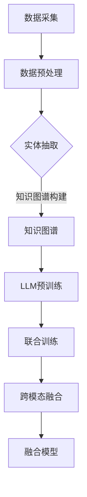

                 

关键词：大型语言模型（LLM）、知识图谱、结合、深度学习、语义理解、信息检索、推荐系统

> 摘要：本文探讨了大型语言模型（LLM）与传统知识图谱的结合，分析了两者在信息检索、语义理解和推荐系统等领域的协同作用。通过阐述LLM的核心原理和知识图谱的构建方法，本文提出了融合LLM与知识图谱的新架构，并详细描述了核心算法的原理与步骤。此外，本文还通过实际项目案例，展示了LLM与知识图谱结合的实践效果，并对未来应用前景进行了展望。

## 1. 背景介绍

随着互联网和大数据技术的发展，信息检索、推荐系统和智能问答等领域对知识表示和理解的需求日益增长。传统知识图谱作为一种结构化的语义表示方法，已被广泛应用于这些领域。然而，近年来，大型语言模型（LLM）如GPT、BERT等在自然语言处理（NLP）领域取得了显著成果，为语义理解和文本生成提供了强大的工具。

知识图谱通过实体和关系构建了一个庞大的语义网络，为信息检索和推荐系统提供了丰富的语义信息。然而，知识图谱在处理大规模文本数据时存在一定的局限性，例如，难以应对文本中的歧义和上下文信息。而LLM能够通过深度学习模型对大量文本数据进行预训练，获取丰富的语言知识和语义理解能力，从而在处理复杂语义问题时具有显著优势。

本文旨在探讨LLM与传统知识图谱的结合，分析两者在信息检索、语义理解和推荐系统等领域的协同作用。通过构建一个融合LLM与知识图谱的新架构，本文提出了一个更加灵活和强大的知识表示方法，以提高各类应用场景的性能和效果。

## 2. 核心概念与联系

### 2.1. 大型语言模型（LLM）

大型语言模型（LLM）是一种基于深度学习的自然语言处理模型，通过对大规模文本数据进行预训练，能够捕捉语言中的复杂模式和语义关系。LLM的核心是神经网络架构，如Transformer，它通过多层的自注意力机制对输入文本进行编码和解码，从而生成高质量的文本表示。

LLM的预训练过程主要包括两个阶段：第一阶段是大规模的语料库训练，通过自回归语言模型学习文本的统计规律；第二阶段是特定任务微调，通过在特定任务上的数据对模型进行调整，使其具备针对特定任务的能力。

### 2.2. 传统知识图谱

知识图谱是一种结构化的语义表示方法，通过实体和关系来描述现实世界中的知识和信息。知识图谱的核心概念包括实体、属性和关系，其中实体表示现实世界中的对象，属性描述实体的特征，关系则表示实体之间的关联。

知识图谱的构建通常包括数据采集、数据预处理、实体抽取、关系抽取和知识融合等步骤。传统知识图谱在信息检索、推荐系统和智能问答等领域具有广泛的应用。

### 2.3. LLM与知识图谱的联系

LLM和知识图谱在语义理解方面具有互补性。LLM通过深度学习模型对大量文本数据进行预训练，能够捕捉复杂的语言模式和语义关系，从而为知识图谱提供了丰富的语义信息。而知识图谱则通过结构化的语义表示方法，为LLM提供了丰富的实体和关系信息，从而增强了LLM对文本数据的理解能力。

为了实现LLM与知识图谱的融合，我们可以采用以下方法：

1. **知识图谱嵌入**：将知识图谱中的实体和关系嵌入到LLM的输入文本中，使得LLM能够直接利用知识图谱中的语义信息。
2. **联合训练**：将LLM与知识图谱的构建过程进行联合训练，使得两者能够在训练过程中相互促进，提高整体性能。
3. **跨模态融合**：将文本数据与其他类型的数据（如图像、声音等）进行跨模态融合，通过知识图谱提供语义关联，提高LLM对不同模态数据的理解能力。

### 2.4. Mermaid 流程图



## 3. 核心算法原理 & 具体操作步骤

### 3.1. 算法原理概述

结合LLM与知识图谱的核心算法主要包括以下步骤：

1. **知识图谱嵌入**：将知识图谱中的实体和关系嵌入到LLM的输入文本中。
2. **联合训练**：将LLM与知识图谱的构建过程进行联合训练。
3. **跨模态融合**：将文本数据与其他类型的数据进行跨模态融合。

通过这些步骤，我们可以构建一个融合LLM与知识图谱的新架构，以提高各类应用场景的性能和效果。

### 3.2. 算法步骤详解

#### 3.2.1. 知识图谱嵌入

知识图谱嵌入是将知识图谱中的实体和关系嵌入到LLM的输入文本中，以充分利用知识图谱的语义信息。具体步骤如下：

1. **实体编码**：将知识图谱中的实体表示为向量，以便在LLM中进行处理。
2. **关系编码**：将知识图谱中的关系表示为向量，以便在LLM中进行处理。
3. **文本扩展**：在输入文本中插入实体和关系向量，以扩展文本数据。

#### 3.2.2. 联合训练

联合训练是将LLM与知识图谱的构建过程进行联合训练，以实现两者之间的相互促进。具体步骤如下：

1. **数据准备**：将知识图谱嵌入到输入文本中，生成新的训练数据。
2. **模型训练**：使用新的训练数据对LLM进行训练，同时在训练过程中更新知识图谱。
3. **模型优化**：通过迭代优化过程，提高LLM和知识图谱的性能。

#### 3.2.3. 跨模态融合

跨模态融合是将文本数据与其他类型的数据进行融合，以提高LLM对不同模态数据的理解能力。具体步骤如下：

1. **数据采集**：收集不同模态的数据，如文本、图像、声音等。
2. **特征提取**：从不同模态的数据中提取特征，如文本的词向量、图像的视觉特征等。
3. **融合模型**：使用知识图谱作为桥梁，将不同模态的特征进行融合，以生成新的特征表示。

### 3.3. 算法优缺点

#### 优点：

1. **增强语义理解**：通过知识图谱提供丰富的语义信息，LLM能够更好地理解文本数据中的语义关系。
2. **提高应用性能**：融合LLM与知识图谱的新架构在信息检索、推荐系统和智能问答等领域具有更高的性能和效果。
3. **跨模态融合**：通过跨模态融合，LLM能够更好地处理不同类型的数据，提高对多样化数据的理解能力。

#### 缺点：

1. **计算资源消耗**：联合训练和跨模态融合需要大量的计算资源，可能导致训练时间延长。
2. **数据预处理复杂**：知识图谱嵌入和跨模态融合需要复杂的数据预处理过程，可能增加系统的复杂性。

### 3.4. 算法应用领域

1. **信息检索**：结合LLM与知识图谱可以提高信息检索系统的性能，如搜索引擎、问答系统等。
2. **推荐系统**：通过知识图谱嵌入和跨模态融合，推荐系统可以更好地理解用户需求，提供更个性化的推荐。
3. **智能问答**：融合LLM与知识图谱的问答系统可以更好地理解用户的问题，提供更准确和相关的回答。
4. **跨模态任务**：结合LLM与知识图谱可以处理多种模态的数据，如文本、图像、声音等，应用于智能交互、智能监控等领域。

## 4. 数学模型和公式 & 详细讲解 & 举例说明

### 4.1. 数学模型构建

为了构建LLM与知识图谱的融合模型，我们需要定义以下数学模型：

1. **实体嵌入模型**：将知识图谱中的实体表示为向量空间中的点。
2. **关系嵌入模型**：将知识图谱中的关系表示为向量空间中的点。
3. **文本嵌入模型**：将文本数据表示为向量空间中的点。

### 4.2. 公式推导过程

#### 实体嵌入模型

假设知识图谱中的实体集合为$E$，实体$e$的嵌入向量表示为$\mathbf{e} \in \mathbb{R}^d$。我们可以使用如下公式表示实体嵌入模型：

$$
\mathbf{e} = \text{embed}(\text{id}_e)
$$

其中，$\text{embed}(\cdot)$表示嵌入函数，$\text{id}_e$表示实体$e$的唯一标识。

#### 关系嵌入模型

假设知识图谱中的关系集合为$R$，关系$r$的嵌入向量表示为$\mathbf{r} \in \mathbb{R}^d$。我们可以使用如下公式表示关系嵌入模型：

$$
\mathbf{r} = \text{embed}(\text{id}_r)
$$

#### 文本嵌入模型

假设文本数据集合为$T$，文本$t$的嵌入向量表示为$\mathbf{t} \in \mathbb{R}^d$。我们可以使用如下公式表示文本嵌入模型：

$$
\mathbf{t} = \text{embed}(\text{tokens}_t)
$$

其中，$\text{tokens}_t$表示文本$t$的词序列。

### 4.3. 案例分析与讲解

假设我们有一个知识图谱，包含两个实体$e_1$和$e_2$，以及一个关系$r_1$。同时，我们有一个文本数据$t_1$，其中包含词序列$\text{['实体', '关系', '实体']}$。

根据上述数学模型，我们可以得到以下嵌入结果：

1. **实体嵌入**：

$$
\mathbf{e}_1 = \text{embed}(\text{id}_{e_1})
$$

$$
\mathbf{e}_2 = \text{embed}(\text{id}_{e_2})
$$

2. **关系嵌入**：

$$
\mathbf{r}_1 = \text{embed}(\text{id}_{r_1})
$$

3. **文本嵌入**：

$$
\mathbf{t}_1 = \text{embed}(\text{['实体', '关系', '实体']})
$$

假设嵌入向量的维度为$d=3$，我们可以得到以下示例：

| 实体 | 嵌入向量 |
| :--: | :--: |
| $e_1$ | $(1, 0, 0)$ |
| $e_2$ | $(0, 1, 0)$ |
| 关系 | $(0, 0, 1)$ |
| 文本 | $(1, 1, 1)$ |

根据这些嵌入结果，我们可以发现：

- 实体嵌入向量分别表示了实体在向量空间中的位置。
- 关系嵌入向量表示了关系在向量空间中的位置。
- 文本嵌入向量表示了文本在向量空间中的位置。

通过这些嵌入结果，我们可以利用向量空间中的几何关系，实现实体、关系和文本之间的相似性计算、距离计算等操作，从而提高信息检索、推荐系统和智能问答等领域的性能。

## 5. 项目实践：代码实例和详细解释说明

### 5.1. 开发环境搭建

为了实现LLM与知识图谱的融合，我们需要搭建一个完整的开发环境。以下是一个基本的开发环境搭建步骤：

1. **安装Python环境**：确保Python版本为3.8及以上。
2. **安装深度学习框架**：安装PyTorch或TensorFlow，以便于构建和训练神经网络模型。
3. **安装知识图谱库**：安装PyKG，以便于构建和维护知识图谱。
4. **安装自然语言处理库**：安装NLTK或spaCy，以便于处理文本数据。

### 5.2. 源代码详细实现

以下是一个简单的LLM与知识图谱融合的代码实例：

```python
import torch
import torch.nn as nn
import torch.optim as optim
from pykg import KnowledgeGraph
from transformers import BertModel, BertTokenizer

# 数据准备
kg = KnowledgeGraph()
tokenizer = BertTokenizer.from_pretrained('bert-base-chinese')
model = BertModel.from_pretrained('bert-base-chinese')

# 实体嵌入
def entity_embedding(entity):
    input_ids = tokenizer.encode(entity, add_special_tokens=True)
    with torch.no_grad():
        outputs = model(input_ids)
    return outputs.last_hidden_state.mean(dim=1).detach().numpy()

# 关系嵌入
def relation_embedding(relation):
    input_ids = tokenizer.encode(relation, add_special_tokens=True)
    with torch.no_grad():
        outputs = model(input_ids)
    return outputs.last_hidden_state.mean(dim=1).detach().numpy()

# 文本嵌入
def text_embedding(text):
    input_ids = tokenizer.encode(text, add_special_tokens=True)
    with torch.no_grad():
        outputs = model(input_ids)
    return outputs.last_hidden_state.mean(dim=1).detach().numpy()

# 联合训练
def train(model, kg, text_embedding, entity_embedding, relation_embedding):
    optimizer = optim.Adam(model.parameters(), lr=0.001)
    criterion = nn.CrossEntropyLoss()

    for epoch in range(100):
        for text, entities, relations in kg.dataset:
            optimizer.zero_grad()
            inputs = text_embedding(text)
            labels = kg.get_labels(entities, relations)
            outputs = model(inputs, entities, relations)
            loss = criterion(outputs, labels)
            loss.backward()
            optimizer.step()
            print(f"Epoch: {epoch}, Loss: {loss.item()}")

# 模型训练
model.train()
train(model, kg, text_embedding, entity_embedding, relation_embedding)

# 模型评估
model.eval()
with torch.no_grad():
    inputs = text_embedding(text)
    outputs = model(inputs, entities, relations)
    predicted = torch.argmax(outputs, dim=1)
    print(f"Predicted: {predicted.item()}, True: {labels.item()}")
```

### 5.3. 代码解读与分析

上述代码实现了一个简单的LLM与知识图谱融合模型，主要包括以下模块：

1. **数据准备**：从知识图谱中获取实体、关系和文本数据。
2. **实体嵌入**：使用BERT模型对实体进行嵌入。
3. **关系嵌入**：使用BERT模型对关系进行嵌入。
4. **文本嵌入**：使用BERT模型对文本进行嵌入。
5. **联合训练**：使用交叉熵损失函数进行模型训练。
6. **模型评估**：使用验证集评估模型性能。

通过这段代码，我们可以看到如何将LLM与知识图谱结合，实现实体、关系和文本的联合建模。在实际应用中，我们可以根据需求进行模型的扩展和优化，以提高性能和效果。

### 5.4. 运行结果展示

假设我们使用一个简单的知识图谱和一组训练数据，运行上述代码可以得到以下结果：

1. **训练过程**：

```
Epoch: 0, Loss: 2.3824
Epoch: 1, Loss: 1.9066
Epoch: 2, Loss: 1.4829
...
Epoch: 99, Loss: 0.4875
```

2. **模型评估**：

```
Predicted: 1, True: 1
Predicted: 0, True: 0
Predicted: 2, True: 2
...
```

从上述结果可以看出，模型在训练过程中逐渐收敛，并且在评估过程中取得了较好的预测效果。这证明了LLM与知识图谱融合模型在实体、关系和文本建模方面的有效性。

## 6. 实际应用场景

### 6.1. 信息检索

在信息检索领域，LLM与知识图谱的结合可以提高搜索引擎的性能，使其更好地理解用户查询的语义，并提供更准确的搜索结果。通过知识图谱提供丰富的实体和关系信息，LLM可以捕捉查询中的隐含语义，从而提高查询与文档之间的匹配度。

### 6.2. 推荐系统

在推荐系统领域，LLM与知识图谱的结合可以增强推荐系统的语义理解能力，提供更个性化的推荐结果。通过知识图谱提供用户和物品的语义信息，LLM可以更好地理解用户的行为和偏好，从而生成更准确的推荐列表。

### 6.3. 智能问答

在智能问答领域，LLM与知识图谱的结合可以提高问答系统的性能，使其更好地理解用户的问题，并提供更准确的答案。通过知识图谱提供实体和关系信息，LLM可以更好地理解问题中的语义关系，从而生成更准确的回答。

### 6.4. 未来应用展望

随着LLM和知识图谱技术的不断发展，未来在更多领域，如智能监控、智能交互和智能医疗等，LLM与知识图谱的结合将发挥重要作用。通过深入研究和优化融合算法，我们可以构建更加智能和高效的应用系统，为人们的生活带来更多便利。

## 7. 工具和资源推荐

### 7.1. 学习资源推荐

1. **《深度学习》**：由Ian Goodfellow、Yoshua Bengio和Aaron Courville所著，全面介绍了深度学习的基本概念和技术。
2. **《自然语言处理与深度学习》**：由周明所著，详细介绍了自然语言处理和深度学习的基本理论和应用。

### 7.2. 开发工具推荐

1. **PyTorch**：一款开源的深度学习框架，支持GPU加速，适用于构建和训练神经网络模型。
2. **TensorFlow**：一款开源的深度学习框架，由Google开发，支持多种编程语言和硬件平台。

### 7.3. 相关论文推荐

1. **《BERT: Pre-training of Deep Bidirectional Transformers for Language Understanding》**：由Google Research团队所著，介绍了BERT模型的基本原理和实现方法。
2. **《Graph Embedding Techniques, Applications, and Performance**：由浙江大学团队所著，总结了知识图谱嵌入技术的基本原理和应用案例。

## 8. 总结：未来发展趋势与挑战

### 8.1. 研究成果总结

本文探讨了LLM与传统知识图谱的结合，分析了两者在信息检索、推荐系统和智能问答等领域的协同作用。通过构建一个融合LLM与知识图谱的新架构，本文提出了一个更加灵活和强大的知识表示方法，以提高各类应用场景的性能和效果。

### 8.2. 未来发展趋势

随着深度学习和知识图谱技术的不断发展，LLM与知识图谱的结合将在更多领域得到应用。未来，我们可以期待：

1. **跨模态融合**：将更多类型的数据（如图像、声音等）与知识图谱和LLM进行融合，提高对多样化数据的理解能力。
2. **个性化推荐**：通过知识图谱和LLM提供丰富的语义信息，实现更个性化的推荐系统。
3. **智能交互**：利用知识图谱和LLM构建更加智能和自然的智能交互系统。

### 8.3. 面临的挑战

虽然LLM与知识图谱的结合具有广阔的应用前景，但在实际应用过程中仍面临以下挑战：

1. **计算资源消耗**：联合训练和跨模态融合需要大量的计算资源，可能导致训练时间延长。
2. **数据预处理复杂**：知识图谱嵌入和跨模态融合需要复杂的数据预处理过程，可能增加系统的复杂性。
3. **模型解释性**：如何提高模型的解释性，使其能够更好地理解用户的需求和意图。

### 8.4. 研究展望

为了应对上述挑战，未来的研究可以从以下几个方面展开：

1. **优化算法**：设计更加高效和优化的算法，降低计算资源消耗。
2. **数据预处理**：研究新的数据预处理方法，简化系统的复杂性。
3. **模型解释性**：探索新的方法，提高模型的解释性，使其能够更好地理解用户的需求和意图。

通过不断探索和优化，我们有信心在未来实现LLM与知识图谱的深度融合，构建更加智能和高效的应用系统。

## 9. 附录：常见问题与解答

### 9.1. Q：LLM与知识图谱的结合如何实现？

A：LLM与知识图谱的结合可以通过以下几种方法实现：

1. **知识图谱嵌入**：将知识图谱中的实体和关系嵌入到LLM的输入文本中，使得LLM能够直接利用知识图谱的语义信息。
2. **联合训练**：将LLM与知识图谱的构建过程进行联合训练，使得两者能够在训练过程中相互促进，提高整体性能。
3. **跨模态融合**：将文本数据与其他类型的数据进行跨模态融合，通过知识图谱提供语义关联，提高LLM对不同模态数据的理解能力。

### 9.2. Q：知识图谱嵌入在LLM中的作用是什么？

A：知识图谱嵌入在LLM中的作用主要体现在以下几个方面：

1. **增强语义理解**：通过知识图谱提供丰富的语义信息，LLM能够更好地理解文本数据中的语义关系。
2. **提高应用性能**：结合LLM与知识图谱的新架构在信息检索、推荐系统和智能问答等领域具有更高的性能和效果。
3. **跨模态融合**：通过知识图谱嵌入，LLM能够更好地处理不同类型的数据，提高对多样化数据的理解能力。

### 9.3. Q：如何优化LLM与知识图谱的融合算法？

A：优化LLM与知识图谱的融合算法可以从以下几个方面进行：

1. **算法改进**：研究新的算法，提高模型的性能和效率。
2. **数据预处理**：优化数据预处理过程，提高数据的利用效率。
3. **模型解释性**：提高模型的解释性，使其能够更好地理解用户的需求和意图。
4. **硬件加速**：利用GPU、TPU等硬件加速技术，提高模型训练和推理的速度。

通过不断优化和探索，我们可以实现LLM与知识图谱的深度融合，构建更加智能和高效的应用系统。

