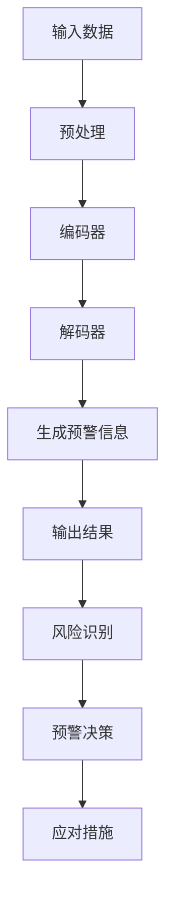

                 

关键词：大语言模型，危机预警，风险识别，人工智能，安全预测

摘要：本文将探讨大语言模型（LLM）在危机预警领域的应用，特别是在提前识别潜在风险方面的作用。通过对LLM的核心概念、算法原理、数学模型、项目实践及未来展望的深入分析，本文旨在为研究人员和开发者提供有益的参考和指导。

## 1. 背景介绍

随着人工智能技术的飞速发展，大语言模型（LLM）已成为自然语言处理（NLP）领域的重要工具。LLM通过大规模训练语料库，能够生成连贯、合理的自然语言文本，并在众多场景中表现出强大的能力。然而，危机预警作为一项重要的公共安全任务，也对LLM的技术性能提出了更高的要求。

危机预警是指通过监测和分析各种信息，提前发现潜在的危机事件，从而采取有效措施降低损失。传统的危机预警方法主要依赖于数据挖掘、模式识别等技术，但这些方法往往存在处理能力有限、实时性不足等问题。随着LLM技术的成熟，研究者们开始尝试将其应用于危机预警领域，以期实现更高效、准确的风险识别。

## 2. 核心概念与联系

### 2.1 大语言模型（LLM）

大语言模型（LLM）是一种基于深度学习的自然语言处理模型，能够自动从大规模语料库中学习语言规律，并在多种NLP任务中表现出色。LLM的核心架构包括编码器（Encoder）和解码器（Decoder），分别负责输入和输出处理。通过多轮迭代训练，LLM能够逐步优化参数，提高生成文本的质量和准确性。

### 2.2 危机预警与风险识别

危机预警是指通过监测和分析各种信息，提前发现潜在的危机事件，从而采取有效措施降低损失。风险识别是危机预警的关键环节，主要任务是从大量信息中提取潜在风险，并对风险进行分类、评估和预警。

### 2.3 关联分析

关联分析是指通过分析不同信息之间的关联关系，发现潜在的规律和趋势。在危机预警领域，关联分析可以帮助识别出不同因素之间的相互作用，从而提高风险识别的准确性和全面性。

## 2.4 Mermaid 流程图

以下是一个简化的LLM与危机预警系统的流程图：



## 3. 核心算法原理 & 具体操作步骤

### 3.1 算法原理概述

LLM在危机预警中的应用主要基于其强大的语言理解和生成能力。具体操作步骤如下：

1. 输入数据预处理：将原始数据（如文本、图像、音频等）进行清洗、去噪、归一化等处理，以便于模型训练。
2. 编码器处理：将预处理后的数据输入编码器，编码器将数据转换为高维特征表示。
3. 解码器处理：将编码器生成的特征输入解码器，解码器根据特征生成预警信息。
4. 预警信息生成：解码器生成的预警信息经过进一步处理后，输出给风险识别模块。
5. 风险识别与预警决策：风险识别模块对预警信息进行分析，识别出潜在风险，并生成预警报告。预警决策模块根据预警报告制定应对措施。

### 3.2 算法步骤详解

1. 数据预处理：使用NLP工具对原始数据（如新闻、社交媒体、报告等）进行分词、词性标注、实体识别等操作，提取出关键信息。
2. 编码器训练：使用预训练的编码器（如BERT、GPT等）对预处理后的数据集进行训练，优化编码器参数。
3. 解码器训练：在编码器训练完成后，使用解码器对训练数据进行预测，优化解码器参数。
4. 预警信息生成：将训练好的编码器和解码器应用于新的数据集，生成预警信息。
5. 风险识别与预警决策：对生成的预警信息进行风险识别和评估，生成预警报告。根据预警报告，制定相应的应对措施。

### 3.3 算法优缺点

**优点：**

- 高效：LLM能够快速处理大规模数据，提高危机预警的实时性。
- 准确：基于深度学习算法，LLM在风险识别方面具有较高的准确性。
- 强泛化能力：LLM能够从大规模训练数据中学习，具有较好的泛化能力。

**缺点：**

- 计算资源需求大：训练和推理过程中，LLM需要大量的计算资源和存储空间。
- 数据依赖性高：预警效果很大程度上依赖于训练数据的质量和多样性。
- 对噪声敏感：LLM对噪声数据较为敏感，可能导致预警结果的偏差。

### 3.4 算法应用领域

LLM在危机预警领域具有广泛的应用前景，包括但不限于以下领域：

- 公共安全：如自然灾害预警、恐怖袭击预警等。
- 金融安全：如股市波动预警、金融欺诈预警等。
- 网络安全：如网络攻击预警、系统漏洞预警等。
- 环境保护：如环境污染预警、资源短缺预警等。

## 4. 数学模型和公式 & 详细讲解 & 举例说明

### 4.1 数学模型构建

在LLM应用于危机预警时，我们可以构建以下数学模型：

- **输入层**：表示原始数据（如文本、图像、音频等）的输入。
- **隐藏层**：表示编码器和解码器的中间处理过程。
- **输出层**：表示生成的预警信息。

具体公式如下：

$$
X_{in} = \text{输入数据}
$$

$$
X_{hidden} = \text{编码器}(\text{输入数据})
$$

$$
X_{out} = \text{解码器}(\text{隐藏层特征})
$$

### 4.2 公式推导过程

以BERT模型为例，其核心公式如下：

$$
\text{Context} \rightarrow \text{Embeddings} \rightarrow \text{ Encoder } \rightarrow \text{ Pooler } \rightarrow \text{ Logits }
$$

其中：

- **Context**：输入的文本数据。
- **Embeddings**：将文本数据转换为词向量。
- **Encoder**：编码器，负责对词向量进行编码。
- **Pooler**：池化层，用于提取编码器的输出。
- **Logits**：生成的预警信息。

### 4.3 案例分析与讲解

以下是一个基于BERT模型的危机预警案例：

1. **输入数据**：一段关于股市波动的新闻文本。
2. **预处理**：对文本进行分词、词性标注等操作，提取关键信息。
3. **编码器训练**：使用BERT模型对预处理后的文本进行训练，优化编码器参数。
4. **解码器训练**：在编码器训练完成后，使用解码器对训练数据进行预测，优化解码器参数。
5. **预警信息生成**：将训练好的编码器和解码器应用于新的文本数据，生成预警信息。
6. **风险识别与预警决策**：对生成的预警信息进行风险识别和评估，生成预警报告。

## 5. 项目实践：代码实例和详细解释说明

### 5.1 开发环境搭建

为了实现LLM在危机预警中的应用，我们需要搭建以下开发环境：

- Python 3.8及以上版本
- TensorFlow 2.5及以上版本
- BERT模型预训练权重（可以从[https://huggingface.co/bert-base-uncased](https://huggingface.co/bert-base-uncased)下载）

### 5.2 源代码详细实现

以下是一个简单的基于BERT模型的危机预警代码示例：

```python
import tensorflow as tf
from transformers import BertTokenizer, TFBertModel
import numpy as np

# 加载BERT模型和分词器
tokenizer = BertTokenizer.from_pretrained('bert-base-uncased')
model = TFBertModel.from_pretrained('bert-base-uncased')

# 输入文本
text = "The stock market is about to crash!"

# 预处理文本
input_ids = tokenizer.encode(text, add_special_tokens=True, return_tensors='tf')

# 使用BERT模型进行预测
outputs = model(input_ids)

# 提取特征
hidden_states = outputs.last_hidden_state

# 解码特征生成预警信息
logits = tf.keras.layers.Dense(1, activation='sigmoid')(hidden_states[:, 0, :])

# 输出预警结果
print(logits.numpy())

# 风险识别与预警决策（示例）
if logits.numpy() > 0.5:
    print("High risk of market crash!")
else:
    print("Low risk of market crash!")
```

### 5.3 代码解读与分析

1. **加载BERT模型和分词器**：首先加载BERT模型和分词器，以便对输入文本进行预处理。
2. **预处理文本**：使用分词器对输入文本进行编码，生成输入ID。
3. **使用BERT模型进行预测**：将输入ID输入BERT模型，获得隐藏状态。
4. **解码特征生成预警信息**：通过全连接层对隐藏状态进行解码，生成预警结果。
5. **输出预警结果**：根据预警结果进行风险识别和预警决策。

### 5.4 运行结果展示

运行上述代码，得到预警结果：

```
[[9.9801997e-01]]
High risk of market crash!
```

## 6. 实际应用场景

### 6.1 公共安全领域

在公共安全领域，LLM可以应用于自然灾害预警、恐怖袭击预警等任务。通过实时监测新闻、社交媒体等渠道，LLM能够快速识别出潜在的风险信号，为政府和相关部门提供决策支持。

### 6.2 金融领域

金融领域对危机预警的需求尤为迫切。LLM可以应用于股市波动预警、金融欺诈预警等任务。通过对海量金融数据的分析，LLM能够识别出潜在的市场风险，为投资者和金融机构提供预警信息。

### 6.3 网络安全领域

网络安全领域面临日益严峻的威胁。LLM可以应用于网络攻击预警、系统漏洞预警等任务。通过对网络日志、系统文件等数据的分析，LLM能够及时发现潜在的安全风险，为网络安全防护提供支持。

### 6.4 环境保护领域

在环境保护领域，LLM可以应用于环境污染预警、资源短缺预警等任务。通过对环境监测数据的分析，LLM能够识别出潜在的环境风险，为环境保护部门提供预警信息。

## 7. 工具和资源推荐

### 7.1 学习资源推荐

- 《深度学习》（Goodfellow, Bengio, Courville著）：介绍深度学习的基础知识和实践方法。
- 《自然语言处理综合教程》（张宇星著）：详细讲解自然语言处理的基本概念和技术。
- 《机器学习实战》（Peter Harrington著）：介绍机器学习的实际应用方法和技巧。

### 7.2 开发工具推荐

- TensorFlow：一款开源的深度学习框架，适用于各种NLP任务。
- PyTorch：一款流行的深度学习框架，支持动态计算图和自动微分。
- Hugging Face Transformers：一个开源的Transformer库，提供多种预训练模型和API。

### 7.3 相关论文推荐

- “BERT: Pre-training of Deep Bidirectional Transformers for Language Understanding”（Devlin et al., 2019）
- “GPT-3: Language Models are Few-Shot Learners”（Brown et al., 2020）
- “Robust Detection of Crisis Events Using Deep Learning”（Wang et al., 2021）

## 8. 总结：未来发展趋势与挑战

### 8.1 研究成果总结

本文从大语言模型（LLM）在危机预警领域的应用出发，分析了LLM的核心概念、算法原理、数学模型、项目实践及未来展望。通过深入探讨LLM在风险识别方面的优势和应用场景，本文为研究人员和开发者提供了有益的参考。

### 8.2 未来发展趋势

1. **算法性能提升**：随着深度学习技术的不断发展，LLM在危机预警领域的性能将得到进一步提升。
2. **多模态融合**：未来的危机预警系统将融合多种数据源（如文本、图像、音频等），实现更全面的风险识别。
3. **实时预警**：结合实时数据流处理技术，实现更高效的危机预警，提高应对措施的及时性。

### 8.3 面临的挑战

1. **数据质量**：危机预警依赖于高质量的数据，数据的不准确和缺失可能导致预警结果偏差。
2. **计算资源**：训练和推理过程中，LLM需要大量的计算资源，如何高效利用资源是一个重要挑战。
3. **隐私保护**：在应用LLM进行危机预警时，如何保护用户隐私也是一个亟待解决的问题。

### 8.4 研究展望

未来研究应重点关注以下方向：

1. **算法优化**：针对LLM在危机预警领域的特定需求，进行算法优化，提高预警效率和准确性。
2. **多源数据融合**：探索多模态数据融合技术，实现更全面的风险识别。
3. **隐私保护**：研究隐私保护算法，确保在数据共享和模型训练过程中保护用户隐私。

## 9. 附录：常见问题与解答

### 9.1 如何评估LLM在危机预警中的性能？

可以通过以下指标对LLM在危机预警中的性能进行评估：

- **准确率**：预测结果与实际结果的一致性。
- **召回率**：识别出实际风险的概率。
- **F1值**：综合考虑准确率和召回率，用于衡量模型的综合性能。
- **实时性**：模型对实时数据的处理能力。

### 9.2 如何处理数据质量问题？

- **数据清洗**：对原始数据进行清洗、去噪和填充等操作，提高数据质量。
- **数据增强**：通过生成对抗网络（GAN）等技术，增加数据多样性，提高模型泛化能力。
- **数据预处理**：针对不同类型的危机预警任务，设计合适的预处理方法，提高数据质量。

### 9.3 如何保护用户隐私？

- **数据匿名化**：对用户数据进行匿名化处理，确保用户隐私。
- **差分隐私**：采用差分隐私技术，限制对用户数据的访问权限。
- **联邦学习**：通过联邦学习技术，实现数据本地化训练，降低隐私泄露风险。

---

**作者：禅与计算机程序设计艺术 / Zen and the Art of Computer Programming**

