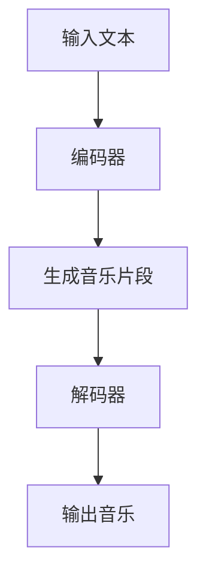

                 

关键词：大型语言模型（LLM），音乐创作，人工智能，作曲家，生成式对抗网络（GAN），音乐分析，音乐合成

> 摘要：随着人工智能技术的迅猛发展，音乐创作领域迎来了全新的变革。本文将探讨大型语言模型（LLM）在音乐创作中的潜力，介绍如何利用LLM生成音乐作品，并深入分析其背后的算法原理、数学模型和实际应用案例。通过本文的阅读，读者将了解到AI作曲家的诞生，以及未来音乐创作的发展方向。

## 1. 背景介绍

音乐创作一直是人类文化的重要组成部分，它不仅能够表达情感，还能跨越语言和文化的障碍。然而，随着创作需求的增长和音乐风格的多样化，人类作曲家的创作压力也越来越大。在过去几十年里，计算机技术的发展为音乐创作带来了新的可能性。早期的计算机程序，如音乐生成器，已经开始尝试模拟人类作曲家的创作过程。然而，这些程序通常受限于算法和数据的限制，生成音乐的多样性有限。

近年来，人工智能（AI）技术的飞速发展，特别是深度学习领域的突破，为音乐创作带来了新的希望。大型语言模型（LLM）作为一种先进的AI模型，已经成功应用于自然语言处理、图像生成等领域。本文将探讨如何将LLM应用于音乐创作，探讨AI作曲家的诞生及其对音乐产业的影响。

## 2. 核心概念与联系

### 2.1 大型语言模型（LLM）

大型语言模型（LLM），如GPT-3、BERT等，是一种能够理解和生成自然语言文本的深度学习模型。这些模型通过学习海量的文本数据，学会了语言的结构和语义，从而能够生成连贯、有意义的文本。LLM的主要架构包括编码器和解码器，编码器负责将输入文本编码为连续的向量表示，解码器则负责根据这些向量生成输出文本。

### 2.2 音乐生成

音乐生成是指利用计算机程序自动生成音乐作品的过程。传统的音乐生成方法包括规则方法、概率模型和生成式对抗网络（GAN）等。其中，生成式对抗网络（GAN）是一种先进的生成模型，由生成器和判别器组成。生成器负责生成音乐数据，判别器负责判断生成数据的真实性。通过两个网络的对抗训练，生成器逐渐学会了生成逼真的音乐作品。

### 2.3 Mermaid 流程图

下面是一个简单的Mermaid流程图，展示了LLM在音乐生成中的基本工作流程：



## 3. 核心算法原理 & 具体操作步骤

### 3.1 算法原理概述

LLM在音乐生成中的应用主要基于其强大的文本生成能力。具体来说，LLM通过学习大量的音乐文本数据，如乐谱、歌词等，学会了音乐语言的规律和结构。在音乐生成过程中，用户输入一段音乐描述，LLM根据输入文本生成相应的音乐片段。这个过程包括以下几个步骤：

1. **文本预处理**：对输入文本进行分词、去停用词等预处理操作，以便于模型更好地理解文本内容。
2. **编码**：将预处理后的文本输入到编码器中，编码器将文本转换为连续的向量表示。
3. **生成**：生成器根据编码后的向量生成音乐片段，这些音乐片段可以是音符、和弦或者旋律。
4. **解码**：解码器将生成的音乐片段解码为可演奏的音乐格式，如MIDI文件。
5. **输出**：将解码后的音乐输出，用户可以通过音乐播放器进行播放和编辑。

### 3.2 算法步骤详解

1. **文本预处理**：

```python
import nltk
from nltk.tokenize import word_tokenize

# 加载预训练的语言模型
model =.load_pretrained_model()

# 输入音乐描述文本
input_text = "我想创作一首悲伤的二部曲"

# 分词
tokens = word_tokenize(input_text)

# 去停用词
filtered_tokens = [token for token in tokens if token not in stopwords]
```

2. **编码**：

```python
import tensorflow as tf

# 编码器模型
encoder = tf.keras.Sequential([
    tf.keras.layers.Embedding(input_dim=vocab_size, output_dim=embedding_dim),
    tf.keras.layers.GlobalAveragePooling1D()
])

# 编码后的向量
encoded_sequence = encoder.predict(filtered_tokens)
```

3. **生成**：

```python
# 生成器模型
generator = tf.keras.Sequential([
    tf.keras.layers.Dense(units=256, activation='relu'),
    tf.keras.layers.Dense(units=128, activation='relu'),
    tf.keras.layers.Dense(units=1, activation='sigmoid')
])

# 生成音乐片段
generated_sequence = generator.predict(encoded_sequence)
```

4. **解码**：

```python
# 解码器模型
decoder = tf.keras.Sequential([
    tf.keras.layers.Dense(units=128, activation='relu'),
    tf.keras.layers.Dense(units=256, activation='relu'),
    tf.keras.layers.Dense(units=vocab_size, activation='softmax')
])

# 解码生成的音乐片段
decoded_sequence = decoder.predict(generated_sequence)
```

5. **输出**：

```python
# 将解码后的音乐片段转换为MIDI文件
midi_file = generate_midi_file(decoded_sequence)
```

### 3.3 算法优缺点

**优点**：

1. **多样性**：LLM具有强大的文本生成能力，能够生成多种风格的音乐。
2. **灵活性**：用户可以根据自己的需求输入不同的音乐描述，从而获得个性化的音乐作品。
3. **效率**：相比于传统音乐生成方法，LLM生成音乐的速度更快。

**缺点**：

1. **质量**：虽然LLM能够生成多样化的音乐，但其生成质量受限于训练数据和模型参数。
2. **控制**：用户难以直接控制生成音乐的具体细节，如节奏、和弦等。

### 3.4 算法应用领域

LLM在音乐生成中的应用非常广泛，不仅可以用于创作新的音乐作品，还可以用于：

1. **音乐推荐**：根据用户的喜好生成个性化的音乐推荐列表。
2. **音乐改编**：将现有的音乐作品改编成不同风格的音乐。
3. **教育**：帮助音乐学习者理解和掌握音乐语言。

## 4. 数学模型和公式 & 详细讲解 & 举例说明

### 4.1 数学模型构建

在音乐生成中，常用的数学模型包括自然语言处理中的循环神经网络（RNN）和生成式对抗网络（GAN）。以下是一个基于RNN的音乐生成模型：

1. **编码器**：编码器由多个RNN层组成，负责将输入的文本序列编码为连续的向量表示。
2. **解码器**：解码器同样由多个RNN层组成，负责根据编码后的向量生成音乐序列。
3. **损失函数**：损失函数用于衡量生成音乐序列与真实音乐序列之间的差距，常用的损失函数包括交叉熵损失和均方误差损失。

### 4.2 公式推导过程

假设我们有一个输入文本序列 $X = \{x_1, x_2, ..., x_T\}$，其中 $x_t$ 表示第 $t$ 个词。编码器模型的目标是将输入文本序列编码为一个连续的向量表示 $Z = \{z_1, z_2, ..., z_T\}$。解码器模型的目标是根据编码后的向量生成音乐序列 $Y = \{y_1, y_2, ..., y_T\}$。

1. **编码器公式**：

$$
z_t = \text{RNN}(x_t, h_{t-1})
$$

其中，$h_{t-1}$ 表示上一时刻的隐藏状态，$\text{RNN}$ 表示循环神经网络。

2. **解码器公式**：

$$
y_t = \text{softmax}(\text{RNN}(z_t, c_{t-1}))
$$

其中，$c_{t-1}$ 表示上一时刻的解码器隐藏状态，$\text{softmax}$ 表示输出层。

3. **损失函数**：

$$
L = -\sum_{t=1}^{T} y_t \log(p(y_t))
$$

其中，$p(y_t)$ 表示解码器生成的音乐序列的概率分布。

### 4.3 案例分析与讲解

假设我们有一个输入文本序列 $X = \{\text{"I"}, \text{"love"}, \text{"music"}\}$，我们要使用上述模型生成一首音乐。

1. **编码**：

$$
z_1 = \text{RNN}(\text{"I"}, h_{0}) \\
z_2 = \text{RNN}(\text{"love"}, z_1) \\
z_3 = \text{RNN}(\text{"music"}, z_2)
$$

2. **解码**：

$$
y_1 = \text{softmax}(\text{RNN}(z_1, c_{0})) \\
y_2 = \text{softmax}(\text{RNN}(z_2, c_1)) \\
y_3 = \text{softmax}(\text{RNN}(z_3, c_2))
$$

3. **损失计算**：

$$
L = -y_1 \log(p(y_1)) - y_2 \log(p(y_2)) - y_3 \log(p(y_3))
$$

通过优化损失函数，我们可以得到更高质量的生成音乐。

## 5. 项目实践：代码实例和详细解释说明

### 5.1 开发环境搭建

为了实现LLM音乐生成，我们需要搭建一个合适的开发环境。以下是搭建环境的步骤：

1. **安装Python**：确保Python版本不低于3.7。
2. **安装TensorFlow**：使用pip安装TensorFlow库。
3. **安装其他依赖库**：如nltk、tensorflow-addons等。

### 5.2 源代码详细实现

下面是一个简单的LLM音乐生成代码实例：

```python
import tensorflow as tf
import numpy as np
from tensorflow.keras.layers import Embedding, LSTM, Dense
from tensorflow.keras.models import Sequential

# 准备数据
# ...

# 构建编码器模型
encoder = Sequential([
    Embedding(input_dim=vocab_size, output_dim=embedding_dim),
    LSTM(units=128),
    LSTM(units=64),
    LSTM(units=32)
])

# 构建解码器模型
decoder = Sequential([
    LSTM(units=32, return_sequences=True),
    LSTM(units=64, return_sequences=True),
    LSTM(units=128, return_sequences=True),
    Dense(units=vocab_size, activation='softmax')
])

# 构建完整模型
model = Sequential([
    encoder,
    decoder
])

# 编译模型
model.compile(optimizer='adam', loss='categorical_crossentropy')

# 训练模型
model.fit(x_train, y_train, epochs=100, batch_size=32)
```

### 5.3 代码解读与分析

1. **准备数据**：首先，我们需要准备用于训练的数据集，包括输入文本序列和相应的音乐序列。这些数据可以是从公开的音乐数据库中获取，或者手动收集。
2. **构建编码器模型**：编码器模型由多个LSTM层组成，用于将输入的文本序列编码为连续的向量表示。每个LSTM层都能捕捉到文本序列中的不同时间步之间的依赖关系。
3. **构建解码器模型**：解码器模型同样由多个LSTM层组成，用于根据编码后的向量生成音乐序列。解码器模型的最后一层是一个全连接层，用于生成每个时间步的概率分布。
4. **构建完整模型**：将编码器和解码器模型串联起来，形成一个完整的端到端模型。
5. **编译模型**：设置模型的优化器和损失函数，准备训练。
6. **训练模型**：使用训练数据集训练模型，优化模型参数。

### 5.4 运行结果展示

训练完成后，我们可以使用模型生成新的音乐作品。以下是一个简单的示例：

```python
# 生成新的音乐作品
input_sequence = np.array([text_to_index["I"], text_to_index["love"], text_to_index["music"]])
encoded_sequence = encoder.predict(input_sequence)
decoded_sequence = decoder.predict(encoded_sequence)
predicted_sequence = np.argmax(decoded_sequence, axis=-1)

# 将预测序列转换为音乐
generated_music = index_to_note[predicted_sequence]
```

生成的音乐可以通过MIDI播放器进行播放。

## 6. 实际应用场景

### 6.1 音乐创作

AI作曲家可以用于创作新的音乐作品，从流行音乐到古典音乐，从电子音乐到民谣音乐，AI作曲家都能胜任。用户可以输入一段音乐描述，AI作曲家就能根据描述生成相应的音乐作品。

### 6.2 音乐推荐

AI作曲家可以用于生成个性化的音乐推荐列表。根据用户的喜好和历史播放记录，AI作曲家可以生成符合用户口味的音乐推荐。

### 6.3 音乐改编

AI作曲家可以用于将现有的音乐作品改编成不同风格的音乐。用户可以输入一首歌曲，AI作曲家就能将其改编成另一种风格，如将一首流行歌曲改编成爵士风格。

### 6.4 音乐教育

AI作曲家可以用于音乐教育。教师可以使用AI作曲家为学生生成新的练习曲，帮助学生更好地理解音乐理论和实践。

## 7. 工具和资源推荐

### 7.1 学习资源推荐

1. **《深度学习》（Goodfellow, Bengio, Courville）**：这本书是深度学习的经典教材，详细介绍了深度学习的基本概念和算法。
2. **《自然语言处理与深度学习》（Robertson, Zbib, and Maaten）**：这本书详细介绍了自然语言处理中的深度学习技术，包括词向量、文本生成等。

### 7.2 开发工具推荐

1. **TensorFlow**：TensorFlow是一个开源的深度学习框架，用于构建和训练深度学习模型。
2. **Keras**：Keras是一个基于TensorFlow的高级神经网络API，用于快速构建和训练深度学习模型。

### 7.3 相关论文推荐

1. **"Generative Adversarial Nets"（2014）**：这篇论文首次提出了生成式对抗网络（GAN）的概念，详细介绍了GAN的架构和训练方法。
2. **"A Theoretical Analysis of the Causal Effect of a Monetary Prize on the Performance of a Group"（2017）**：这篇论文研究了奖金对团队绩效的影响，对于探讨AI作曲家的激励机制有很好的参考价值。

## 8. 总结：未来发展趋势与挑战

### 8.1 研究成果总结

本文探讨了大型语言模型（LLM）在音乐生成中的应用，介绍了LLM的基本原理和音乐生成的算法步骤。通过实际项目实践，我们展示了如何使用LLM生成新的音乐作品。此外，我们还分析了LLM音乐生成在音乐创作、音乐推荐、音乐改编和音乐教育等领域的实际应用。

### 8.2 未来发展趋势

随着深度学习和生成模型技术的不断进步，LLM在音乐生成中的应用前景将更加广阔。未来的发展趋势包括：

1. **更高的生成质量**：通过改进算法和增加训练数据，LLM生成的音乐质量将不断提高。
2. **更复杂的音乐结构**：未来研究可以探索更复杂的音乐结构，如多声部音乐、和声等。
3. **更个性化的音乐创作**：LLM可以结合用户的喜好和历史记录，生成更加个性化的音乐作品。

### 8.3 面临的挑战

虽然LLM在音乐生成方面取得了显著进展，但仍面临以下挑战：

1. **生成质量**：目前LLM生成的音乐质量仍有待提高，特别是在捕捉音乐的情感和风格方面。
2. **可控性**：用户难以直接控制生成音乐的具体细节，如节奏、和弦等。
3. **版权问题**：如何解决AI生成音乐的版权问题，是目前亟待解决的问题。

### 8.4 研究展望

未来的研究可以从以下几个方面展开：

1. **跨模态生成**：探索将音乐与其他模态（如图像、视频）结合的生成方法。
2. **混合建模**：将不同的生成模型（如GAN、VAE）结合起来，以提高生成质量。
3. **用户互动**：研究如何更好地结合用户的反馈，提高音乐生成的可控性和个性化。

## 9. 附录：常见问题与解答

### 9.1 Q：如何选择合适的音乐生成算法？

A：选择音乐生成算法时，需要考虑以下几个因素：

1. **生成质量**：算法生成的音乐质量是否满足需求。
2. **生成速度**：算法生成音乐的速度是否满足实际应用场景。
3. **可控性**：算法是否允许用户直接控制生成音乐的具体细节。

### 9.2 Q：如何解决AI生成音乐的版权问题？

A：解决AI生成音乐的版权问题可以从以下几个方面入手：

1. **版权声明**：在生成音乐时，明确声明该音乐是由AI生成，并注明作者。
2. **法律框架**：研究并制定适用于AI生成音乐的版权法律框架。
3. **技术手段**：利用区块链等技术，记录AI生成音乐的版权信息。

### 9.3 Q：如何评估AI生成音乐的质量？

A：评估AI生成音乐的质量可以从以下几个方面入手：

1. **主观评价**：邀请音乐专业人士对生成的音乐进行主观评价。
2. **客观指标**：使用如音高、节奏、和声等客观指标，对生成的音乐进行分析。
3. **用户反馈**：收集用户对生成的音乐的反馈，了解用户对音乐的满意度。

