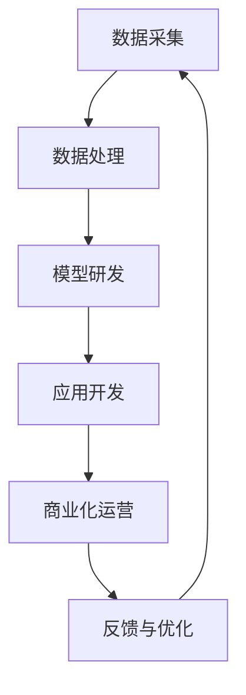

                 

关键词：大语言模型、AI价值、产业链、技术趋势、未来愿景

> 摘要：本文将深入探讨大语言模型（LLM）在人工智能产业链中的重要地位及其对未来价值重塑的影响。通过分析LLM的核心概念、算法原理、数学模型，并结合实际项目实践和未来应用场景，本文旨在为读者提供一个全面、系统的视角，展望AI技术发展的未来。

## 1. 背景介绍

近年来，随着深度学习、自然语言处理等技术的飞速发展，大语言模型（LLM）逐渐成为人工智能领域的重要研究热点。LLM具有强大的文本生成、理解、分类和推理能力，能够处理复杂的语言任务，如问答系统、机器翻译、文本摘要等。其应用范围广泛，从搜索引擎、智能客服到内容创作、教育辅助，都在不断拓展。

然而，随着LLM技术的成熟和商业化进程的加速，AI产业链也面临着一系列变革。传统的AI应用模式、数据处理方式、商业模式都在受到挑战，新的机遇和挑战也随之而来。本文旨在从产业链的角度，探讨LLM技术如何重塑AI的价值，以及未来可能的发展趋势。

## 2. 核心概念与联系

### 2.1 大语言模型（LLM）

大语言模型（LLM）是一种基于深度学习的自然语言处理模型，其核心思想是通过大规模语料库的学习，使得模型能够自动理解和生成自然语言。LLM的关键特征包括：

- **规模庞大**：LLM通常由数十亿甚至千亿级别的参数组成，可以处理海量文本数据。
- **自主学习**：LLM通过无监督学习从大规模文本数据中自动学习语言结构和规则。
- **上下文感知**：LLM能够捕捉文本的上下文信息，从而生成更准确、自然的文本。

### 2.2 人工智能产业链

人工智能产业链包括以下几个关键环节：

- **数据采集与处理**：收集、清洗、标注大量的数据，为模型训练提供高质量的输入。
- **模型研发与优化**：开发高效的算法和模型架构，不断提升AI系统的性能和鲁棒性。
- **应用开发与部署**：将AI技术应用于具体的业务场景，提供智能化的解决方案。
- **商业化运营**：通过产品销售、服务收费等方式实现AI技术的商业化。

### 2.3 Mermaid 流程图

下面是一个简化的LLM在人工智能产业链中的流程图：



### 2.4 核心概念联系

LLM作为人工智能产业链中的一个关键组件，其发展将直接影响整个产业链的运行。一方面，LLM技术的进步将推动数据采集与处理、模型研发与优化等环节的提升；另一方面，LLM的应用场景的不断拓展，也将为商业化运营带来新的机遇。

## 3. 核心算法原理 & 具体操作步骤

### 3.1 算法原理概述

LLM的核心算法是基于自注意力机制（Self-Attention）的Transformer模型。Transformer模型通过多头注意力（Multi-Head Attention）机制，能够捕捉文本序列中的长距离依赖关系。其主要组成部分包括：

- **编码器（Encoder）**：处理输入的文本序列，生成编码表示。
- **解码器（Decoder）**：生成文本序列的输出。

### 3.2 算法步骤详解

以下是LLM算法的基本步骤：

1. **数据预处理**：对输入的文本进行分词、编码等预处理操作。
2. **编码器处理**：输入文本经过编码器，生成编码表示。
3. **解码器处理**：解码器根据编码表示生成输出文本。
4. **优化更新**：通过反向传播和梯度下降算法，不断优化模型参数。

### 3.3 算法优缺点

**优点**：

- **强大的文本理解能力**：LLM能够捕捉文本的上下文信息，生成更准确、自然的文本。
- **高效的处理速度**：Transformer模型具有较高的并行处理能力，训练速度快。
- **广泛的适用性**：LLM可以应用于多种自然语言处理任务，如文本生成、翻译、摘要等。

**缺点**：

- **资源消耗大**：训练LLM模型需要大量的计算资源和存储空间。
- **数据依赖性强**：模型性能依赖于大规模高质量的数据集。
- **解释性较弱**：由于模型的复杂度，LLM生成的文本难以解释和理解。

### 3.4 算法应用领域

LLM技术已经在多个领域取得了显著的应用成果：

- **问答系统**：如ChatGPT、BERT等模型，可以用于构建智能客服、在线问答系统。
- **机器翻译**：如Google Translate、微软翻译等，利用LLM实现高效、准确的翻译。
- **文本摘要**：如SummaryNet、Longformer等，能够生成简洁、准确的文本摘要。
- **内容创作**：如OpenAI的DALL-E、GPT-3等，可以创作高质量的文章、音乐、图像等。

## 4. 数学模型和公式 & 详细讲解 & 举例说明

### 4.1 数学模型构建

LLM的数学模型主要包括两部分：编码器和解码器。

#### 4.1.1 编码器

编码器用于处理输入文本序列，生成编码表示。其核心是自注意力机制。

**自注意力公式**：

$$
\text{Attention}(Q, K, V) = \text{softmax}\left(\frac{QK^T}{\sqrt{d_k}}\right)V
$$

其中，$Q, K, V$ 分别是编码器中的查询（Query）、关键（Key）和值（Value）向量，$d_k$ 是关键向量的维度。

#### 4.1.2 解码器

解码器用于生成输出文本序列。其核心是多头注意力机制。

**多头注意力公式**：

$$
\text{MultiHead}(Q, K, V) = \text{Concat}(\text{head}_1, \ldots, \text{head}_h)W^O
$$

其中，$h$ 是头数，$W^O$ 是输出权重矩阵。

### 4.2 公式推导过程

#### 4.2.1 自注意力机制

自注意力机制的推导过程如下：

1. **输入文本编码**：将输入文本编码为词向量。
2. **计算注意力得分**：计算查询（Query）和关键（Key）之间的相似度，即注意力得分。
3. **计算注意力权重**：通过 softmax 函数对注意力得分进行归一化，得到注意力权重。
4. **计算输出**：将注意力权重与值（Value）向量相乘，得到输出。

### 4.3 案例分析与讲解

#### 4.3.1 案例背景

假设有一个简单的问答系统，用户输入一个问题，系统需要生成一个合适的答案。

#### 4.3.2 案例步骤

1. **数据预处理**：对输入问题进行分词、编码等预处理操作。
2. **编码器处理**：输入问题经过编码器，生成编码表示。
3. **解码器处理**：解码器根据编码表示生成答案。
4. **优化更新**：通过反向传播和梯度下降算法，不断优化模型参数。

#### 4.3.3 案例结果

在训练过程中，模型逐渐学会了生成合理的答案。例如，当用户输入“什么是人工智能？”时，模型可以生成“人工智能是研究、开发用于模拟、延伸和扩展人的智能的理论、方法、技术及应用系统的一门新的技术科学。”这样的答案。

## 5. 项目实践：代码实例和详细解释说明

### 5.1 开发环境搭建

在搭建开发环境时，我们需要安装以下软件和库：

- **Python**：版本3.8及以上
- **PyTorch**：版本1.8及以上
- **Transformers**：版本4.8及以上

安装命令如下：

```bash
pip install python==3.8.10
pip install torch torchvision torchaudio==1.8.0 -f https://download.pytorch.org/whl/torch_stable.html
pip install transformers==4.8.2
```

### 5.2 源代码详细实现

以下是一个简单的LLM模型实现示例：

```python
import torch
from transformers import AutoTokenizer, AutoModel

# 加载预训练模型
model_name = "gpt2"
tokenizer = AutoTokenizer.from_pretrained(model_name)
model = AutoModel.from_pretrained(model_name)

# 输入文本
input_text = "你好，我是人工智能助手。请问有什么可以帮助你的？"

# 编码文本
input_ids = tokenizer.encode(input_text, return_tensors="pt")

# 预测
with torch.no_grad():
    outputs = model(input_ids)

# 生成文本
predicted_ids = outputs.logits.argmax(-1)
predicted_text = tokenizer.decode(predicted_ids[0], skip_special_tokens=True)

print(predicted_text)
```

### 5.3 代码解读与分析

1. **加载模型**：首先加载预训练的GPT-2模型。
2. **编码文本**：将输入文本编码为模型可以理解的序列。
3. **预测**：使用模型进行预测，生成输出文本序列。
4. **解码文本**：将输出文本序列解码为可读的文本。

### 5.4 运行结果展示

运行代码后，模型会生成一个回复文本。例如，当输入文本为“你好，我是人工智能助手。请问有什么可以帮助你的？”时，模型可能会生成如下回复：

```
你好，我是一个由海量数据训练而成的人工智能助手。我可以帮助你回答各种问题，例如关于科技、历史、文化等领域的问题。请问你有什么需要我帮助的吗？
```

## 6. 实际应用场景

LLM技术在实际应用场景中展现了巨大的潜力。以下是一些典型的应用案例：

- **智能客服**：LLM可以用于构建智能客服系统，实现自动化、高效的客户服务。
- **内容创作**：LLM可以用于生成文章、音乐、图像等内容，实现内容创作的自动化和个性化。
- **教育辅助**：LLM可以用于智能辅导、作业批改、课程推荐等，提高教育质量。
- **医疗健康**：LLM可以用于医疗文本分析、疾病预测、治疗方案推荐等，为医疗健康领域提供支持。

### 6.4 未来应用展望

随着LLM技术的不断发展，其应用领域将更加广泛。未来，LLM有望在以下几个方面取得突破：

- **更多领域的智能化应用**：LLM技术将在金融、法律、教育、医疗等领域得到更深入的应用。
- **多模态处理能力**：LLM将结合图像、音频等多模态信息，实现更丰富、更复杂的任务。
- **高效能模型**：随着硬件性能的提升，LLM模型将变得更加高效、易用。
- **可解释性提升**：研究人员将致力于提高LLM的可解释性，使其生成的文本更容易理解和解释。

## 7. 工具和资源推荐

### 7.1 学习资源推荐

- **书籍**：《深度学习》（Ian Goodfellow、Yoshua Bengio、Aaron Courville 著）
- **在线课程**：《自然语言处理与深度学习》（吴恩达 著）
- **论文**：《Attention Is All You Need》（Vaswani et al.，2017）

### 7.2 开发工具推荐

- **PyTorch**：一个开源的深度学习框架，适用于LLM模型的开发。
- **Transformers**：一个基于PyTorch的Transformer模型实现库，方便快速搭建和训练LLM模型。

### 7.3 相关论文推荐

- **BERT**：`BERT: Pre-training of Deep Bidirectional Transformers for Language Understanding`（Devlin et al.，2019）
- **GPT-3**：`Language Models are Few-Shot Learners`（Brown et al.，2020）
- **T5**：`T5: Exploring the Limits of Transfer Learning with a Unified Text-to-Text Transformer`（Raffel et al.，2020）

## 8. 总结：未来发展趋势与挑战

### 8.1 研究成果总结

LLM技术在近年来取得了显著的成果，推动了自然语言处理领域的快速发展。通过大规模预训练和高效模型架构，LLM展现了强大的文本生成、理解、分类和推理能力。

### 8.2 未来发展趋势

- **模型规模和性能的提升**：随着计算资源的增加，LLM模型将变得更加强大和高效。
- **多模态处理**：LLM将结合图像、音频等多模态信息，实现更复杂的任务。
- **可解释性和可控性**：提高LLM的可解释性，使其生成的文本更容易理解和控制。

### 8.3 面临的挑战

- **数据隐私和安全**：如何确保大规模数据集的隐私和安全，成为LLM应用的一个重要挑战。
- **模型可解释性**：提高LLM的可解释性，使其生成的文本更容易理解和控制。
- **计算资源消耗**：训练LLM模型需要大量的计算资源和存储空间，如何优化资源使用成为关键问题。

### 8.4 研究展望

未来，LLM技术将继续在自然语言处理、内容创作、智能客服等领域发挥重要作用。同时，随着多模态处理、可解释性等研究的深入，LLM有望实现更广泛的应用，为人类带来更多的便利和创造力。

## 9. 附录：常见问题与解答

### 9.1 什么是大语言模型（LLM）？

大语言模型（LLM）是一种基于深度学习的自然语言处理模型，通过大规模语料库的学习，能够自动理解和生成自然语言。

### 9.2 LLM在哪些领域有应用？

LLM在多个领域有广泛应用，如问答系统、机器翻译、文本摘要、内容创作等。

### 9.3 如何训练一个LLM模型？

训练一个LLM模型通常包括数据预处理、模型架构设计、模型训练和优化等步骤。

### 9.4 LLM有哪些优缺点？

LLM的优点包括强大的文本理解能力、高效的处理速度和广泛的适用性；缺点包括资源消耗大、数据依赖性强和解释性较弱。

### 9.5 LLM的未来发展趋势是什么？

LLM的未来发展趋势包括模型规模和性能的提升、多模态处理、可解释性和可控性的提高等。

