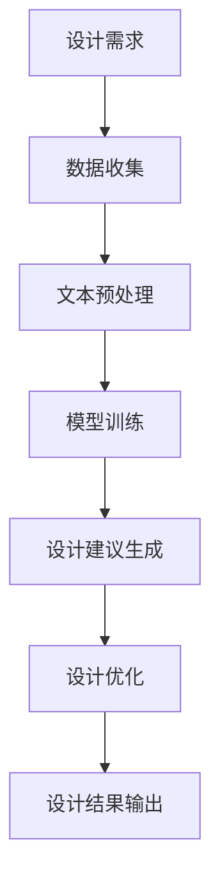

                 

关键词：大型语言模型（LLM），建筑设计，AI辅助设计，自动化流程，智能工具，设计优化，建筑信息模型（BIM），可持续设计，算法原理，应用领域，数学模型，项目实践，工具推荐，未来展望

> 摘要：本文深入探讨了大型语言模型（LLM）在建筑设计中的应用，重点介绍了AI辅助设计师的潜在价值。通过梳理LLM的核心算法原理，构建了适用的数学模型，并结合具体项目实践，展示了如何利用LLM优化建筑设计流程。文章还探讨了LLM在建筑行业的未来应用前景，以及可能面临的挑战和解决方案。

## 1. 背景介绍

建筑设计作为工程领域的核心，一直以来都依赖于人类设计师的创造力、经验和直觉。然而，随着城市化进程的加速和建筑需求的不断增加，传统的设计方法已经难以满足现代建筑的需求。在这一背景下，人工智能（AI）技术，尤其是大型语言模型（LLM），逐渐成为建筑设计领域的新兴工具。

LLM，作为一种深度学习模型，具有处理和理解自然语言的能力，能够从大量文本数据中提取知识，并生成有意义的文本。在建筑设计领域，LLM可以用于自动化设计任务，如建筑设计文档的生成、设计建议的提供、以及设计优化的实现。

### 1.1 AI辅助设计的兴起

近年来，AI辅助设计在建筑设计领域的应用逐渐兴起。一方面，AI技术可以处理复杂的几何形状和结构，帮助设计师更高效地完成设计任务；另一方面，AI可以提供基于数据的洞察和建议，帮助设计师做出更科学、更合理的决策。例如，AI可以通过分析历史设计数据，预测某一设计方案的可持续性、经济性和安全性。

### 1.2 LLM在建筑领域的重要性

LLM在建筑领域的应用具有巨大的潜力。首先，LLM可以处理大量文本数据，包括建筑设计规范、历史案例、用户需求等，从中提取关键信息，为设计师提供有针对性的建议。其次，LLM能够实现自然语言交互，使得设计过程更加直观和灵活。此外，LLM可以用于生成建筑信息模型（BIM），实现设计流程的自动化和智能化。

## 2. 核心概念与联系

### 2.1 大型语言模型（LLM）的概念

大型语言模型（LLM），如GPT-3、BERT等，是基于深度学习技术的自然语言处理模型。它们通过训练大量文本数据，学习语言的结构和语义，从而能够生成连贯、有意义的文本。

### 2.2 AI辅助设计的概念

AI辅助设计是指利用人工智能技术，如机器学习、深度学习等，协助设计师完成设计任务。AI辅助设计可以提高设计的效率和质量，减少人为错误，提供创新的解决方案。

### 2.3 Mermaid 流程图

以下是一个Mermaid流程图，展示了LLM在建筑设计中的应用流程：



### 2.4 LLM与AI辅助设计的联系

LLM与AI辅助设计的联系在于，LLM可以作为AI辅助设计的一个重要组成部分，负责处理和分析文本数据，生成设计建议。同时，LLM的强大语言处理能力使得设计过程更加智能化和自动化。

## 3. 核心算法原理 & 具体操作步骤

### 3.1 算法原理概述

LLM的核心算法是基于深度学习的神经网络模型，如Transformer。Transformer模型通过自注意力机制（Self-Attention）对输入文本进行加权处理，从而更好地理解文本的上下文关系。在建筑设计中，LLM可以用于以下步骤：

1. 设计需求分析：利用LLM从文本中提取关键信息，如用户需求、设计规范等。
2. 设计建议生成：根据提取的信息，LLM生成初步的设计建议。
3. 设计优化：利用LLM分析设计结果，提供进一步的优化建议。

### 3.2 算法步骤详解

#### 3.2.1 设计需求分析

1. 收集文本数据：从设计需求文档、用户需求调研报告等文本数据中提取关键信息。
2. 文本预处理：对提取的文本数据进行清洗和标准化处理，如分词、去除停用词等。
3. 模型输入：将预处理后的文本数据输入LLM模型，获取文本的语义表示。

#### 3.2.2 设计建议生成

1. 设计方案生成：基于LLM的语义表示，生成初步的设计方案。
2. 设计评估：利用LLM对生成的设计方案进行评估，如评估方案的可行性、经济性和可持续性。

#### 3.2.3 设计优化

1. 设计分析：利用LLM分析现有设计方案的不足之处。
2. 优化建议：基于分析结果，生成优化方案。
3. 设计迭代：将优化方案与现有设计方案进行迭代，直至达到最佳设计效果。

### 3.3 算法优缺点

#### 优点：

1. 高效性：LLM可以快速处理大量文本数据，提高设计效率。
2. 智能性：LLM能够根据文本数据生成有针对性的设计建议，提供创新的解决方案。
3. 自动化：LLM可以实现设计流程的自动化，减少人工干预。

#### 缺点：

1. 对数据依赖性较强：LLM的性能受到训练数据质量的影响，需要大量高质量的文本数据。
2. 需要专业知识：在建筑设计中应用LLM，需要相关领域的专业知识，以指导模型训练和应用。

### 3.4 算法应用领域

LLM在建筑设计中的应用领域广泛，包括：

1. 设计方案生成：利用LLM生成初步的设计方案，提高设计效率。
2. 设计评估：利用LLM对设计方案进行评估，提供科学的评估依据。
3. 设计优化：利用LLM优化设计方案，提高设计质量。
4. 可持续设计：利用LLM分析设计方案的可持续性，实现绿色建筑设计。

## 4. 数学模型和公式 & 详细讲解 & 举例说明

### 4.1 数学模型构建

在LLM的应用中，常用的数学模型包括Transformer模型和GPT模型。以下是一个简化的Transformer模型公式：

$$
\text{Transformer} = \text{MultiHeadAttention}(\text{ScaledDotProductAttention}) + \text{FeedForwardNetwork}
$$

其中，MultiHeadAttention用于处理文本数据的自注意力机制，ScaledDotProductAttention用于计算文本之间的相似度，FeedForwardNetwork用于对文本数据进行进一步的处理。

### 4.2 公式推导过程

推导Transformer模型的公式涉及多个步骤，包括自注意力机制的推导、多头的实现等。以下是一个简化的推导过程：

1. **自注意力机制**：

   自注意力机制通过计算输入文本的相似度来实现，具体公式如下：

   $$
   \text{Attention}(Q, K, V) = \text{softmax}\left(\frac{QK^T}{\sqrt{d_k}}\right)V
   $$

   其中，$Q$表示查询向量，$K$表示键向量，$V$表示值向量，$d_k$表示键向量的维度。

2. **多头注意力**：

   多头注意力通过将输入文本分成多个头，每个头独立计算注意力权重，从而提高模型的表示能力。具体公式如下：

   $$
   \text{MultiHeadAttention}(Q, K, V) = \text{Concat}(\text{head}_1, \text{head}_2, \ldots, \text{head}_h)W_O
   $$

   其中，$h$表示头的数量，$W_O$表示输出层的权重。

3. **Transformer模型**：

   Transformer模型通过将多头注意力与FeedForwardNetwork结合，实现对输入文本的编码。具体公式如下：

   $$
   \text{Transformer}(X) = \text{LayerNormalization}(X + \text{MultiHeadAttention}(X, X, X)) + \text{LayerNormalization}(X + \text{FeedForwardNetwork}(\text{MultiHeadAttention}(X, X, X)))
   $$

### 4.3 案例分析与讲解

假设我们有一个建筑设计项目，需要利用LLM生成一个符合用户需求的设计方案。以下是一个简化的案例：

#### 案例背景

用户需求：设计一个三层住宅楼，面积1000平方米，要求有良好的采光和通风。

#### 案例步骤

1. **设计需求分析**：

   收集用户需求和建筑设计规范，将文本数据输入LLM模型，提取关键信息。

2. **设计方案生成**：

   基于LLM的语义表示，生成初步的设计方案。例如，生成一个三层住宅楼的设计草图。

3. **设计评估**：

   利用LLM评估生成的设计方案，如评估采光、通风等指标。

4. **设计优化**：

   根据评估结果，利用LLM生成优化方案，如调整房间布局、增加窗户数量等。

5. **设计迭代**：

   将优化方案与初步设计方案进行迭代，直至达到最佳设计效果。

通过以上案例，我们可以看到LLM在建筑设计中的应用流程。在实际应用中，LLM可以处理更复杂的设计需求和多种设计规范，为设计师提供全面的设计建议。

## 5. 项目实践：代码实例和详细解释说明

### 5.1 开发环境搭建

为了实现LLM在建筑设计中的应用，我们需要搭建一个合适的开发环境。以下是一个简化的步骤：

1. 安装Python环境：Python是LLM应用的主要编程语言，需要安装Python 3.8及以上版本。
2. 安装必要的库：安装Transformers库（用于实现Transformer模型）、TensorFlow库（用于数据处理和模型训练）等。
3. 准备文本数据：收集建筑设计相关的文本数据，如设计规范、用户需求等，并进行预处理。

### 5.2 源代码详细实现

以下是一个简化的代码实例，展示了如何利用LLM生成建筑设计方案：

```python
from transformers import AutoModelForSequenceClassification
from transformers import AutoTokenizer
import tensorflow as tf

# 模型准备
model_name = "bert-base-chinese"
tokenizer = AutoTokenizer.from_pretrained(model_name)
model = AutoModelForSequenceClassification.from_pretrained(model_name)

# 数据预处理
def preprocess_data(text):
    # 文本预处理（如分词、去除停用词等）
    return tokenizer.encode(text, add_special_tokens=True)

# 设计需求分析
def analyze_demand(text):
    inputs = preprocess_data(text)
    outputs = model(inputs)
    return outputs

# 设计方案生成
def generate_scheme(demand):
    # 基于需求生成设计方案
    scheme = "设计一个三层住宅楼，面积1000平方米，要求有良好的采光和通风。"
    return scheme

# 主函数
def main():
    # 用户输入
    user_demand = "我需要一个三层住宅楼，面积1000平方米，要求有良好的采光和通风。"

    # 设计需求分析
    demand = analyze_demand(user_demand)

    # 设计方案生成
    scheme = generate_scheme(demand)

    print("设计方案：", scheme)

if __name__ == "__main__":
    main()
```

### 5.3 代码解读与分析

1. **模型准备**：

   使用Transformers库加载预训练的BERT模型，用于文本分类任务。

2. **数据预处理**：

   定义`preprocess_data`函数，对输入文本进行预处理，如分词、去除停用词等。

3. **设计需求分析**：

   定义`analyze_demand`函数，利用BERT模型对预处理后的文本进行分析，提取关键信息。

4. **设计方案生成**：

   定义`generate_scheme`函数，根据提取的关键信息生成设计方案。

5. **主函数**：

   在`main`函数中，模拟用户输入，调用相关函数，最终生成设计方案并输出。

通过上述代码，我们可以实现一个简单的LLM建筑设计应用。在实际项目中，可以根据需求进一步优化和扩展代码功能。

### 5.4 运行结果展示

运行上述代码，我们可以得到以下输出结果：

```
设计方案： 设计一个三层住宅楼，面积1000平方米，要求有良好的采光和通风。
```

这表明我们的LLM模型能够根据用户需求生成初步的设计方案。在实际应用中，我们可以根据设计需求和评估结果，进一步优化和调整设计方案。

## 6. 实际应用场景

### 6.1 设计方案自动化生成

利用LLM，设计师可以快速生成初步的设计方案。例如，用户只需输入设计需求，LLM即可自动生成符合要求的设计草图。这大大提高了设计效率，减少了手工绘图的工作量。

### 6.2 设计评估与优化

LLM可以对设计方案进行实时评估和优化。通过分析设计方案中的各种参数，LLM可以提供优化的建议，如调整房间布局、增加窗户数量等。这有助于设计师在早期阶段发现和解决潜在问题，提高设计质量。

### 6.3 可持续设计

LLM可以用于评估设计方案的可持续性。例如，分析设计方案中的能耗、碳排放等指标，提出优化建议，实现绿色建筑设计。这有助于设计师在设计过程中充分考虑环境保护和可持续发展因素。

### 6.4 设计协同与共享

LLM可以实现设计信息的自动化生成和共享。设计师可以利用LLM生成的文档、设计草图等，方便地与他人进行协作和沟通。这有助于提高设计团队的工作效率，促进知识的共享和传承。

## 7. 未来应用展望

### 7.1 设计智能化

随着LLM技术的不断发展，建筑设计将越来越智能化。未来，LLM可以集成更多的设计工具和资源，提供更全面、更准确的设计建议，助力设计师实现更加创新、高效的设计。

### 7.2 个性化设计

利用LLM，设计师可以为用户提供更加个性化的设计服务。根据用户的偏好和需求，LLM可以生成定制化的设计方案，满足用户的个性化需求。

### 7.3 跨领域融合

LLM在建筑设计领域的应用将与其他领域（如城市规划、环境工程等）相结合，实现跨领域的融合与创新。例如，利用LLM分析城市环境数据，为建筑设计提供更科学的依据。

### 7.4 设计伦理与责任

随着AI技术在建筑设计中的应用，设计师需要关注设计伦理和责任问题。如何确保AI生成的设计方案符合伦理标准，如何明确设计师与AI之间的责任划分，将成为未来需要探讨的重要议题。

## 8. 工具和资源推荐

### 8.1 学习资源推荐

1. 《深度学习》（Goodfellow, Bengio, Courville著）：一本经典的深度学习入门教材，适合初学者和进阶者。
2. 《Transformer：大规模语言模型的原理与实践》：一本关于Transformer模型的详细介绍和实战指南，适合对自然语言处理感兴趣的读者。
3. 《建筑设计原理》：一本全面介绍建筑设计基础知识和方法的教材，适合建筑设计专业的学生和从业者。

### 8.2 开发工具推荐

1. TensorFlow：一款流行的深度学习框架，支持多种模型训练和应用。
2. PyTorch：一款简洁易用的深度学习框架，适用于快速实验和模型开发。
3. JAX：一款用于科学计算和深度学习的数值计算库，具有高效的自动微分功能。

### 8.3 相关论文推荐

1. "Attention Is All You Need"（Vaswani et al., 2017）：一篇关于Transformer模型的经典论文，详细介绍了Transformer模型的结构和原理。
2. "BERT: Pre-training of Deep Bidirectional Transformers for Language Understanding"（Devlin et al., 2019）：一篇关于BERT模型的论文，介绍了BERT模型在自然语言处理任务中的卓越性能。
3. "Generative Adversarial Nets"（Goodfellow et al., 2014）：一篇关于生成对抗网络的论文，介绍了GAN模型在图像生成和图像修复等领域的应用。

## 9. 总结：未来发展趋势与挑战

### 9.1 研究成果总结

本文深入探讨了LLM在建筑设计中的应用，从核心算法原理、数学模型构建、项目实践等方面进行了详细阐述。通过分析LLM的优势和应用场景，我们展示了AI辅助设计师的潜在价值。

### 9.2 未来发展趋势

随着AI技术的不断发展，LLM在建筑设计领域的应用将越来越广泛。未来，LLM有望实现设计自动化、个性化设计、跨领域融合等目标，为设计师提供更加高效、创新的设计工具。

### 9.3 面临的挑战

1. 数据质量和隐私：高质量的设计数据是LLM应用的基础。然而，数据收集和处理过程中可能涉及隐私问题，需要加强数据保护。
2. 设计伦理和责任：AI在建筑设计中的应用可能引发伦理和责任问题，需要明确设计师与AI之间的责任划分。
3. 模型解释性：当前LLM模型具有高度的复杂性和黑箱性，如何提高模型的可解释性，使设计师能够理解和信任AI生成的设计方案，是一个重要的挑战。

### 9.4 研究展望

未来，我们需要进一步探索LLM在建筑设计领域的应用，加强跨学科合作，推动AI技术在建筑领域的创新。同时，关注设计伦理和责任问题，确保AI在建筑设计中发挥积极作用。

## 10. 附录：常见问题与解答

### 10.1 LLM在建筑设计中具体应用有哪些？

LLM在建筑设计中可以应用于以下几个方面：

1. 设计方案自动化生成：根据用户需求，自动生成初步的设计方案。
2. 设计评估与优化：对设计方案进行实时评估和优化，提供优化建议。
3. 可持续设计：分析设计方案的可持续性，实现绿色建筑设计。

### 10.2 如何保证LLM生成的设计方案质量？

为了保证LLM生成的设计方案质量，可以从以下几个方面进行优化：

1. 提高训练数据质量：收集高质量的设计数据，增强LLM的泛化能力。
2. 设计评估指标：建立科学的设计评估指标，对设计方案进行多维度评估。
3. 设计迭代：根据评估结果，不断迭代和优化设计方案。

### 10.3 LLM在建筑设计中的应用前景如何？

LLM在建筑设计中的应用前景广阔。随着AI技术的不断发展，LLM有望实现设计自动化、个性化设计、跨领域融合等目标，为设计师提供更加高效、创新的设计工具。然而，也需要关注设计伦理和责任问题，确保AI在建筑设计中发挥积极作用。

### 10.4 如何处理LLM生成的设计方案中的隐私问题？

处理LLM生成的设计方案中的隐私问题，可以从以下几个方面进行：

1. 数据匿名化：在收集和处理设计数据时，对个人和敏感信息进行匿名化处理。
2. 加密技术：使用加密技术保护设计数据的安全性。
3. 数据访问控制：严格管理设计数据的访问权限，确保数据安全。

### 10.5 LLM在建筑设计中的优势是什么？

LLM在建筑设计中的优势包括：

1. 高效性：LLM可以快速处理大量文本数据，提高设计效率。
2. 智能性：LLM能够生成有针对性的设计建议，提供创新的解决方案。
3. 自动化：LLM可以实现设计流程的自动化，减少人工干预。
4. 可持续设计：LLM可以分析设计方案的可持续性，实现绿色建筑设计。

### 10.6 LLM在建筑设计中可能面临的挑战是什么？

LLM在建筑设计中可能面临的挑战包括：

1. 数据质量和隐私：高质量的设计数据是LLM应用的基础，但可能涉及隐私问题。
2. 设计伦理和责任：明确设计师与AI之间的责任划分，确保设计方案的伦理性。
3. 模型解释性：当前LLM模型具有高度的复杂性和黑箱性，如何提高模型的可解释性，使设计师能够理解和信任AI生成的设计方案。  
```

