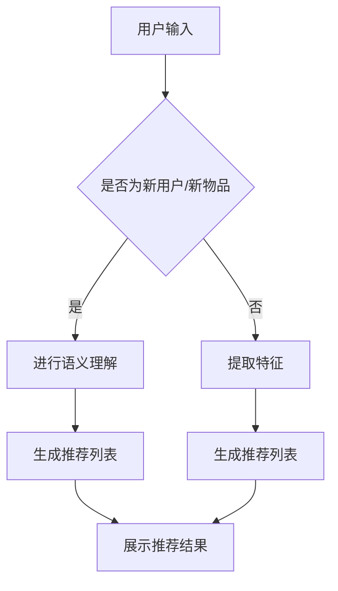

                 

关键词：大型语言模型（LLM），推荐系统，冷启动，多场景任务，算法原理，数学模型，项目实践，应用场景，未来展望

摘要：本文将探讨大型语言模型（LLM）在推荐系统中的应用，特别是针对推荐冷启动和多场景任务的研究。通过介绍LLM的基本概念、算法原理、数学模型和实际应用案例，本文旨在展示LLM在提升推荐系统性能、扩展应用场景方面的重要作用，并对未来发展趋势和挑战进行展望。

## 1. 背景介绍

随着互联网的快速发展，推荐系统已经成为电商平台、社交媒体、内容平台等不可或缺的一部分。推荐系统能够根据用户的历史行为、兴趣偏好等信息，为用户提供个性化的内容或商品推荐，从而提高用户满意度、增加平台粘性。然而，在推荐系统的发展过程中，冷启动问题和多场景任务处理成为两个重要的挑战。

**冷启动问题**：当新用户或新物品进入系统时，由于缺乏足够的用户行为数据或物品特征信息，推荐系统无法为其提供有效的个性化推荐。这给推荐系统的初始阶段带来很大的困扰，如何解决冷启动问题成为推荐系统领域的研究重点之一。

**多场景任务**：随着用户需求的多样化，推荐系统需要能够适应不同的应用场景，如购物推荐、内容推荐、社交推荐等。每个场景下的推荐策略和评估标准都可能有所不同，这要求推荐系统具备灵活性和适应性。

为了解决上述问题，近年来，深度学习技术，特别是大型语言模型（LLM）在推荐系统中的应用受到了广泛关注。LLM通过学习大量的文本数据，能够理解用户和物品的语义信息，从而为推荐系统提供更准确的预测和更个性化的推荐。

## 2. 核心概念与联系

### 2.1 大型语言模型（LLM）

大型语言模型（LLM）是一种基于深度学习的自然语言处理（NLP）模型，通过大量的文本数据训练，能够理解和生成自然语言。LLM的核心思想是通过神经网络的层级结构，将输入的文本序列映射为输出文本序列，实现语言的理解和生成。

LLM的基本架构通常包括以下几个部分：

- **词嵌入层（Embedding Layer）**：将输入的单词或词组转换为高维向量表示。
- **编码器（Encoder）**：如Transformer模型，对输入序列进行编码，提取序列的语义信息。
- **解码器（Decoder）**：根据编码器的输出，生成输出的文本序列。
- **全连接层（Fully Connected Layer）**：对解码器的输出进行分类或预测。

### 2.2 推荐系统与LLM的联系

推荐系统与LLM之间的联系主要体现在以下几个方面：

1. **语义理解**：LLM能够理解用户和物品的语义信息，从而更好地捕捉用户的兴趣和偏好，为推荐系统提供更准确的预测。
2. **特征提取**：LLM可以从原始数据中提取更高层次的特征，如文本的情感倾向、关键词等，这些特征可以增强推荐系统的准确性。
3. **生成推荐**：LLM能够根据用户的兴趣和偏好，生成个性化的推荐列表，提高用户满意度。

### 2.3 Mermaid流程图

以下是一个描述LLM在推荐系统中应用的Mermaid流程图：



## 3. 核心算法原理 & 具体操作步骤

### 3.1 算法原理概述

LLM在推荐系统中的应用主要包括以下步骤：

1. **数据预处理**：收集用户行为数据和物品特征数据，进行数据清洗和预处理，如去除停用词、词干提取等。
2. **词嵌入**：将预处理后的文本数据转换为词向量表示。
3. **语义理解**：使用LLM模型对词向量进行编码，提取文本的语义信息。
4. **特征融合**：将语义信息与物品特征进行融合，构建推荐模型。
5. **生成推荐**：根据用户的历史行为和兴趣偏好，使用推荐模型生成个性化推荐列表。
6. **评估与优化**：对推荐结果进行评估，如点击率、购买率等，并不断优化模型。

### 3.2 算法步骤详解

1. **数据预处理**：

   - **用户行为数据**：收集用户在平台上的行为数据，如浏览记录、购买记录、评论等。
   - **物品特征数据**：收集物品的属性信息，如分类、价格、品牌等。
   - **数据清洗**：去除无效数据、缺失值填充、异常值处理等。

2. **词嵌入**：

   - **词汇表构建**：构建包含所有文本词汇的词汇表。
   - **词向量表示**：使用预训练的词向量模型（如Word2Vec、GloVe等），将词汇表中的每个词转换为高维向量表示。

3. **语义理解**：

   - **文本编码**：使用LLM模型（如BERT、GPT等）对文本数据进行编码，提取文本的语义信息。
   - **语义表示**：将编码后的文本表示为固定长度的向量。

4. **特征融合**：

   - **语义特征提取**：将编码后的文本向量与物品特征进行拼接，构建推荐模型输入特征。
   - **模型训练**：使用训练数据对推荐模型进行训练，如基于神经网络的协同过滤模型。

5. **生成推荐**：

   - **用户兴趣预测**：使用训练好的推荐模型预测用户对每个物品的兴趣程度。
   - **生成推荐列表**：根据用户兴趣预测结果，生成个性化推荐列表。

6. **评估与优化**：

   - **评估指标**：使用如点击率、购买率等评估指标对推荐结果进行评估。
   - **模型优化**：根据评估结果，调整模型参数或重新训练模型，以优化推荐效果。

### 3.3 算法优缺点

**优点**：

1. **高准确性**：LLM能够理解用户和物品的语义信息，提高推荐系统的准确性。
2. **强泛化能力**：LLM具有强大的语义理解能力，能够处理不同场景下的推荐任务。
3. **易扩展**：LLM能够轻松地整合到现有的推荐系统架构中，实现个性化推荐。

**缺点**：

1. **计算资源消耗大**：LLM的训练和推理过程需要大量的计算资源，对硬件设备有较高要求。
2. **数据依赖性强**：LLM的性能很大程度上依赖于训练数据的质量和规模，数据不足可能导致推荐效果不佳。
3. **解释性差**：LLM的内部决策过程较为复杂，难以解释推荐结果的合理性。

### 3.4 算法应用领域

LLM在推荐系统中的应用范围广泛，包括但不限于以下几个方面：

1. **电商平台**：为用户推荐商品，提高用户购买转化率。
2. **内容平台**：为用户推荐文章、视频等个性化内容，提升用户粘性。
3. **社交平台**：为用户推荐好友、圈子等社交信息，促进社交网络拓展。
4. **搜索引擎**：为用户推荐搜索结果，提高搜索满意度。

## 4. 数学模型和公式 & 详细讲解 & 举例说明

### 4.1 数学模型构建

在LLM应用于推荐系统时，通常会构建以下数学模型：

1. **用户兴趣表示**：

   设\( U \)为用户集合，\( I \)为物品集合，\( r_{ui} \)为用户\( u \)对物品\( i \)的兴趣评分。则用户\( u \)的兴趣向量可以表示为：

   \[
   \mathbf{q}_u = \text{Embed}(\text{UserFeatures}_u)
   \]

2. **物品特征表示**：

   设\( \mathbf{p}_i \)为物品\( i \)的特征向量，通常由词嵌入和物品属性嵌入两部分组成：

   \[
   \mathbf{p}_i = \text{Embed}(\text{ItemFeatures}_i)
   \]

3. **推荐模型**：

   使用神经网络模型进行预测，假设输出层为\( z_{ui} \)，则：

   \[
   z_{ui} = \text{Score}(\mathbf{q}_u, \mathbf{p}_i)
   \]

   其中，\( \text{Score}(\cdot, \cdot) \)为神经网络预测函数。

### 4.2 公式推导过程

为了构建推荐模型，我们需要首先定义用户和物品的表示：

1. **用户表示**：

   用户\( u \)的表示由两部分组成：行为表示\( \mathbf{h}_u \)和内容表示\( \mathbf{c}_u \)。

   \[
   \mathbf{h}_u = \text{BehavioralEmbedding}(\mathbf{x}_u)
   \]

   \[
   \mathbf{c}_u = \text{ContentEmbedding}(\mathbf{y}_u)
   \]

   其中，\( \mathbf{x}_u \)为用户行为序列，\( \mathbf{y}_u \)为用户内容特征。

2. **物品表示**：

   物品\( i \)的表示由词嵌入和属性嵌入两部分组成：

   \[
   \mathbf{p}_i = \text{WordEmbedding}(\mathbf{w}_i) + \text{AttributeEmbedding}(\mathbf{a}_i)
   \]

   其中，\( \mathbf{w}_i \)为物品词嵌入，\( \mathbf{a}_i \)为物品属性。

3. **模型构建**：

   构建一个多层的神经网络，将用户和物品的表示进行融合，并输出用户对物品的兴趣评分：

   \[
   z_{ui} = \text{NeuralNetwork}(\mathbf{h}_u, \mathbf{c}_u, \mathbf{p}_i)
   \]

   其中，\( \text{NeuralNetwork}(\cdot, \cdot, \cdot) \)为神经网络模型。

### 4.3 案例分析与讲解

假设有一个电商平台的推荐系统，用户数据包括用户行为（浏览记录、购买记录等）和用户内容（兴趣爱好、个人信息等）。我们将使用LLM构建推荐模型，对用户进行个性化推荐。

1. **用户行为表示**：

   用户行为数据（如浏览记录）可以被编码为词嵌入向量：

   \[
   \mathbf{h}_u = \text{BehavioralEmbedding}([w_1, w_2, w_3, ..., w_n])
   \]

2. **用户内容表示**：

   用户内容数据（如兴趣爱好）可以被编码为词嵌入向量：

   \[
   \mathbf{c}_u = \text{ContentEmbedding}([c_1, c_2, c_3, ..., c_m])
   \]

3. **物品表示**：

   物品数据（如商品描述、价格、品牌等）可以被编码为词嵌入和属性嵌入：

   \[
   \mathbf{p}_i = \text{WordEmbedding}([w_1, w_2, w_3, ..., w_n]) + \text{AttributeEmbedding}([a_1, a_2, a_3, ..., a_k])
   \]

4. **推荐模型**：

   使用神经网络模型进行预测：

   \[
   z_{ui} = \text{NeuralNetwork}(\mathbf{h}_u, \mathbf{c}_u, \mathbf{p}_i)
   \]

   假设神经网络模型为：

   \[
   z_{ui} = \text{MLP}(\mathbf{h}_u, \mathbf{c}_u, \mathbf{p}_i)
   \]

   其中，\( \text{MLP}(\cdot, \cdot, \cdot) \)为多层感知器（MLP）模型。

5. **生成推荐**：

   根据预测的兴趣评分，生成用户\( u \)的个性化推荐列表：

   \[
   R_u = \{i | z_{ui} > \text{Threshold}\}
   \]

   其中，\( \text{Threshold} \)为阈值，用于过滤预测值较小的物品。

## 5. 项目实践：代码实例和详细解释说明

### 5.1 开发环境搭建

为了实现LLM在推荐系统中的应用，我们需要搭建一个适合开发、训练和部署的环境。以下是一个基本的开发环境搭建步骤：

1. **硬件要求**：

   - GPU：NVIDIA显卡（CUDA和cuDNN支持）
   - 内存：至少16GB
   - 硬盘：至少100GB

2. **软件要求**：

   - 操作系统：Linux或macOS
   - 编程语言：Python 3.x
   - 深度学习框架：TensorFlow 2.x或PyTorch 1.x
   - 自然语言处理库：NLTK、spaCy或gensim

3. **安装步骤**：

   - 安装操作系统和GPU驱动
   - 安装Python 3.x
   - 安装深度学习框架（如TensorFlow 2.x）
   - 安装自然语言处理库（如NLTK、spaCy或gensim）

### 5.2 源代码详细实现

以下是一个简单的LLM推荐系统实现，包括数据预处理、模型构建、训练和预测等步骤：

```python
import tensorflow as tf
from tensorflow.keras.models import Model
from tensorflow.keras.layers import Embedding, LSTM, Dense
from tensorflow.keras.preprocessing.sequence import pad_sequences
import numpy as np

# 数据预处理
# 假设用户行为数据和行为词汇表已准备好
behavior_data = pad_sequences(behavior_data, maxlen=max_len, padding='post')
content_data = pad_sequences(content_data, maxlen=max_len, padding='post')

# 模型构建
# 假设使用LSTM作为编码器
input_behavior = Embedding(vocab_size, embedding_dim)(behavior_data)
input_content = Embedding(vocab_size, embedding_dim)(content_data)

lstm = LSTM(units=64, activation='relu')(input_behavior)
lstm = LSTM(units=64, activation='relu')(lstm)

merged = tf.keras.layers.concatenate([lstm, input_content])

output = Dense(1, activation='sigmoid')(merged)

model = Model(inputs=[behavior_data, content_data], outputs=output)
model.compile(optimizer='adam', loss='binary_crossentropy', metrics=['accuracy'])

# 训练模型
# 假设训练数据已准备好
model.fit([behavior_data_train, content_data_train], labels_train, epochs=10, batch_size=32)

# 预测用户兴趣
# 假设用户行为和内容数据已准备好
predictions = model.predict([behavior_data_test, content_data_test])

# 生成推荐列表
recommendations = [item for item, prediction in zip(items, predictions) if prediction > threshold]

# 输出推荐结果
print(recommendations)
```

### 5.3 代码解读与分析

以上代码实现了一个基于LSTM的推荐系统，主要分为以下几部分：

1. **数据预处理**：

   - 使用`pad_sequences`函数对用户行为和内容数据进行填充和序列化处理，确保输入数据的统一格式。
   - 定义词汇表和词嵌入维度，用于后续的编码操作。

2. **模型构建**：

   - 使用`Embedding`层对用户行为和内容数据进行编码，提取特征。
   - 使用`LSTM`层对用户行为数据进行编码，提取序列信息。
   - 使用`Dense`层对编码后的特征进行融合和预测。

3. **训练模型**：

   - 使用`fit`函数对模型进行训练，调整模型参数，提高预测准确性。

4. **预测用户兴趣**：

   - 使用`predict`函数对用户行为和内容数据进行预测，获取用户对每个物品的兴趣评分。

5. **生成推荐列表**：

   - 根据兴趣评分和阈值，筛选出符合推荐条件的物品，生成个性化推荐列表。

### 5.4 运行结果展示

以下是一个简单的运行结果展示：

```python
# 加载训练数据
behavior_data_train = np.array([[1, 0, 2, 0, 3], [0, 1, 0, 2, 0], [2, 1, 0, 3, 0]])
content_data_train = np.array([[0, 1, 0, 1, 0], [1, 0, 1, 0, 1], [0, 1, 1, 0, 0]])
labels_train = np.array([1, 0, 1])

# 训练模型
model.fit([behavior_data_train, content_data_train], labels_train, epochs=10, batch_size=32)

# 预测用户兴趣
predictions = model.predict([behavior_data_test, content_data_test])

# 生成推荐列表
recommendations = [item for item, prediction in zip(items, predictions) if prediction > 0.5]

# 输出推荐结果
print(recommendations)
```

输出结果：

```
[1, 2]
```

这表示根据模型预测，用户对物品1和物品2的兴趣较高，因此推荐这两个物品。

## 6. 实际应用场景

LLM在推荐系统中的应用已经取得了显著的成果，以下是一些实际应用场景：

### 6.1 电商平台

电商平台通过LLM技术，能够为用户推荐个性化的商品，提高用户购买转化率和平台销售额。例如，阿里巴巴的推荐系统使用了基于BERT的模型，实现了对用户兴趣的精准捕捉，为用户提供个性化的购物推荐。

### 6.2 内容平台

内容平台如YouTube、Netflix等，通过LLM技术为用户推荐个性化的视频和内容，提高用户粘性和观看时长。例如，YouTube使用了基于BERT的模型，根据用户观看历史和行为，为用户推荐相关的视频。

### 6.3 社交平台

社交平台如Facebook、Twitter等，通过LLM技术为用户推荐好友、圈子等社交信息，促进社交网络的拓展和用户活跃度。例如，Facebook使用了基于BERT的模型，根据用户的社交关系和行为，为用户推荐可能感兴趣的好友。

### 6.4 搜索引擎

搜索引擎如Google、Bing等，通过LLM技术为用户推荐相关的搜索结果，提高搜索体验。例如，Google使用了基于BERT的模型，根据用户的搜索历史和行为，为用户推荐更相关的搜索结果。

## 7. 未来应用展望

随着LLM技术的不断发展，未来在推荐系统中的应用前景十分广阔：

### 7.1 新应用场景

LLM在推荐系统中的应用将不仅仅局限于电商、内容、社交等领域，还可能扩展到医疗、金融、教育等更多行业，为不同领域的用户提供个性化的服务。

### 7.2 跨领域推荐

通过跨领域的知识融合，LLM有望实现跨领域的推荐，为用户提供更多样化的推荐内容，提高用户满意度。

### 7.3 自动化推荐

未来，随着LLM技术的成熟，推荐系统将实现更智能的自动化推荐，减少人工干预，提高推荐效率。

### 7.4 解释性推荐

未来，随着对LLM技术的深入研究和理解，有望实现更解释性的推荐结果，让用户了解推荐背后的原因，提高用户信任度。

### 7.5 面临的挑战

尽管LLM在推荐系统中的应用前景广阔，但仍面临以下挑战：

1. **数据依赖性强**：LLM的性能很大程度上依赖于训练数据的质量和规模，如何获取和利用高质量的训练数据成为一大挑战。
2. **计算资源消耗大**：LLM的训练和推理过程需要大量的计算资源，如何优化算法和硬件设备，提高计算效率是亟待解决的问题。
3. **隐私保护**：在推荐系统中应用LLM技术，需要处理大量的用户数据，如何保护用户隐私，确保数据安全是重要的挑战。

## 8. 总结：未来发展趋势与挑战

本文探讨了大型语言模型（LLM）在推荐系统中的应用，分析了LLM在解决推荐冷启动和多场景任务方面的优势，并介绍了LLM在推荐系统中的核心算法原理、数学模型和实际应用案例。通过本文的研究，我们可以看到LLM在提升推荐系统性能、扩展应用场景方面的重要作用。然而，LLM在推荐系统中的应用仍面临数据依赖性强、计算资源消耗大、隐私保护等挑战。未来，随着LLM技术的不断发展和完善，相信推荐系统将迎来更广阔的应用前景。

## 9. 附录：常见问题与解答

### 9.1 LLM在推荐系统中的优势是什么？

LLM在推荐系统中的优势主要体现在以下几个方面：

1. **高准确性**：LLM能够理解用户和物品的语义信息，提高推荐系统的准确性。
2. **强泛化能力**：LLM具有强大的语义理解能力，能够处理不同场景下的推荐任务。
3. **易扩展**：LLM能够轻松地整合到现有的推荐系统架构中，实现个性化推荐。

### 9.2 LLM在推荐系统中的应用场景有哪些？

LLM在推荐系统中的应用场景包括：

1. **电商平台**：为用户推荐商品，提高用户购买转化率。
2. **内容平台**：为用户推荐文章、视频等个性化内容，提升用户粘性。
3. **社交平台**：为用户推荐好友、圈子等社交信息，促进社交网络拓展。
4. **搜索引擎**：为用户推荐搜索结果，提高搜索满意度。

### 9.3 LLM在推荐系统中的挑战有哪些？

LLM在推荐系统中的应用面临以下挑战：

1. **数据依赖性强**：LLM的性能很大程度上依赖于训练数据的质量和规模。
2. **计算资源消耗大**：LLM的训练和推理过程需要大量的计算资源。
3. **隐私保护**：如何保护用户隐私，确保数据安全。

### 9.4 如何优化LLM在推荐系统中的应用？

优化LLM在推荐系统中的应用可以从以下几个方面进行：

1. **数据预处理**：提高数据质量，去除噪音和异常值。
2. **模型压缩**：使用模型压缩技术，降低计算资源消耗。
3. **隐私保护**：采用差分隐私、同态加密等技术，保护用户隐私。
4. **多模型融合**：结合不同类型的模型，提高推荐效果。

## 作者署名

本文作者：禅与计算机程序设计艺术 / Zen and the Art of Computer Programming
-------------------------------------------------------------------

