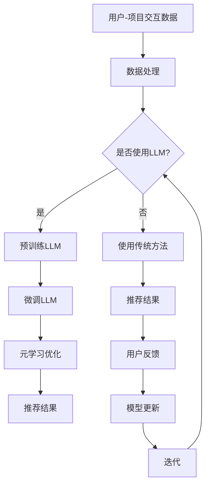

                 

关键词：大规模语言模型（LLM），推荐系统，元学习，数据处理，算法优化，性能评估

## 摘要

随着互联网的迅猛发展，个性化推荐系统在电商、社交媒体、内容平台等领域扮演着越来越重要的角色。大规模语言模型（LLM）作为一种先进的自然语言处理技术，近年来在推荐系统中的应用愈发广泛。本文旨在探讨LLM在推荐系统中的元学习应用，通过深入分析其核心概念、算法原理、数学模型以及实际应用案例，为推荐系统领域的研究者和开发者提供有价值的参考。文章首先介绍了推荐系统的背景和重要性，然后详细阐述了LLM和元学习的相关概念，随后探讨了LLM在推荐系统中的具体应用，最后对未来的发展趋势和面临的挑战进行了展望。

## 1. 背景介绍

推荐系统是一种基于用户兴趣和行为数据，通过算法预测并推荐用户可能感兴趣的项目（如商品、文章、音乐等）的系统。推荐系统在电子商务、社交媒体、内容平台等领域具有广泛的应用，其目的是提高用户满意度、增加用户黏性以及提升商业转化率。传统的推荐系统主要采用基于协同过滤、基于内容的方法，但随着数据量的增加和用户行为的多样化，这些方法逐渐暴露出一些局限性，如冷启动问题、数据稀疏性等。

大规模语言模型（LLM）作为一种先进的自然语言处理技术，其核心思想是通过深度神经网络从海量数据中学习语言模式和知识表示。LLM具有强大的语义理解和生成能力，能够处理自然语言中的复杂结构，从而在推荐系统中具有广泛的应用前景。元学习则是一种在给定任务数据集之外，通过学习通用策略来提高学习效率的方法。在推荐系统中，元学习可以帮助模型快速适应新的数据集，提高推荐效果。

本文将探讨如何将LLM和元学习相结合，应用于推荐系统，以解决现有方法中存在的问题，提高推荐系统的性能和适应性。

## 2. 核心概念与联系

### 2.1. 推荐系统

推荐系统通常由以下核心组件组成：

1. **用户-项目矩阵（User-Item Matrix）**：记录用户与项目之间的交互数据，如评分、点击、浏览等。
2. **协同过滤（Collaborative Filtering）**：一种基于用户-项目交互数据的推荐方法，分为基于用户的协同过滤（User-Based）和基于项目的协同过滤（Item-Based）。
3. **基于内容的方法（Content-Based Filtering）**：通过分析项目的内容特征，根据用户的历史行为和偏好进行推荐。
4. **混合方法（Hybrid Methods）**：结合协同过滤和基于内容的方法，以提高推荐效果。

### 2.2. 大规模语言模型（LLM）

大规模语言模型（LLM）的核心概念包括：

1. **神经网络（Neural Network）**：LLM通常采用深度神经网络结构，如Transformer模型，用于学习文本数据的表示和模式。
2. **预训练（Pre-training）**：在特定任务数据集之外，通过大规模无监督数据对模型进行预训练，使其具备较强的语义理解能力。
3. **微调（Fine-tuning）**：在特定任务数据集上进行微调，使模型适应特定任务的需求。

### 2.3. 元学习

元学习的核心概念包括：

1. **元学习目标（Meta-Learning Objective）**：通过学习通用策略，提高模型在不同任务上的学习效率。
2. **元学习算法（Meta-Learning Algorithms）**：如MAML、Reptile等，通过调整学习率、优化策略等，实现模型在快速适应新任务的目标。
3. **迁移学习（Transfer Learning）**：利用预训练模型在特定任务上的表现，提高新任务的性能。

### 2.4. LLM与元学习的结合

将LLM与元学习相结合，可以充分发挥两者的优势，提高推荐系统的性能和适应性。具体而言：

1. **多任务学习（Multi-Task Learning）**：通过元学习，使LLM能够同时处理多个推荐任务，提高模型的泛化能力。
2. **自适应调整（Adaptive Adjustment）**：利用元学习算法，快速调整模型参数，以适应不同用户、项目和场景的需求。
3. **模型压缩（Model Compression）**：通过元学习，减少模型参数数量，降低模型复杂度，提高模型在资源受限环境下的性能。

### 2.5. Mermaid 流程图

以下是推荐系统中LLM与元学习结合的Mermaid流程图：



## 3. 核心算法原理 & 具体操作步骤

### 3.1 算法原理概述

本文所探讨的算法主要分为三个部分：LLM预训练、LLM微调和元学习优化。以下是各部分的简要概述：

1. **LLM预训练**：利用大规模无监督数据对LLM进行预训练，使其具备强大的语义理解能力。
2. **LLM微调**：在特定推荐任务数据集上对预训练的LLM进行微调，使其适应特定场景和需求。
3. **元学习优化**：通过元学习算法，快速调整模型参数，提高模型在不同任务上的适应能力。

### 3.2 算法步骤详解

1. **LLM预训练**
   - 数据集准备：收集大规模无监督文本数据，如新闻、文章、社交媒体帖子等。
   - 模型架构：采用预训练模型，如BERT、GPT等，配置适当的超参数。
   - 训练过程：通过自回归目标、下一个词预测等任务，进行多轮训练，使模型在语义理解方面达到较高的水平。

2. **LLM微调**
   - 数据集准备：收集特定推荐任务的数据集，如电商平台的购物数据、社交媒体的点赞数据等。
   - 模型架构：在预训练模型的基础上，添加特定任务的输入层和输出层。
   - 训练过程：在训练数据集上，通过交叉熵损失函数等，对模型进行微调，使其在特定任务上达到较高的性能。

3. **元学习优化**
   - 元学习目标：定义适应新任务的目标函数，如最小化预测误差等。
   - 元学习算法：采用MAML、Reptile等元学习算法，对模型参数进行快速调整。
   - 训练过程：在多个任务数据集上进行训练，通过迭代优化，使模型在不同任务上均达到较好的性能。

### 3.3 算法优缺点

#### 3.3.1 优点

1. **强语义理解**：LLM具备强大的语义理解能力，能够更好地捕捉用户和项目之间的关联性。
2. **自适应调整**：元学习算法能够快速调整模型参数，提高模型在不同任务上的适应能力。
3. **泛化能力**：通过多任务学习和元学习优化，提高模型在不同任务和数据集上的泛化能力。

#### 3.3.2 缺点

1. **计算资源消耗**：预训练LLM和元学习优化过程需要大量的计算资源，对硬件要求较高。
2. **数据依赖**：模型性能高度依赖训练数据的质量和多样性，数据不足可能导致模型效果不佳。
3. **模型解释性**：由于LLM的模型架构较为复杂，其内部决策过程难以解释，增加了模型的可解释性挑战。

### 3.4 算法应用领域

LLM在推荐系统中的应用领域广泛，主要包括：

1. **电商平台**：通过分析用户的历史购物行为和兴趣，为用户提供个性化的商品推荐。
2. **社交媒体**：根据用户的兴趣和互动行为，推荐感兴趣的内容和好友。
3. **内容平台**：为用户提供个性化的文章、视频、音乐等推荐。
4. **智能问答**：通过理解用户的提问，提供精准的答案和建议。

## 4. 数学模型和公式 & 详细讲解 & 举例说明

### 4.1 数学模型构建

在推荐系统中，LLM和元学习算法的数学模型主要包括以下几部分：

1. **用户和项目的特征表示**：使用向量和矩阵表示用户和项目的特征，如用户向量 \( \mathbf{u} \) 和项目向量 \( \mathbf{i} \)。
2. **预训练语言模型**：采用深度神经网络结构，如Transformer，对用户和项目特征进行编码，得到语义表示 \( \mathbf{u}_\text{emb} \) 和 \( \mathbf{i}_\text{emb} \)。
3. **推荐预测**：利用语义表示计算用户对项目的评分预测，如采用点积或加性注意力机制。
4. **元学习目标**：定义适应新任务的目标函数，如最小化预测误差。

### 4.2 公式推导过程

1. **用户和项目的特征表示**

   用户和项目的特征表示通常采用嵌入矩阵 \( \mathbf{E}_u \) 和 \( \mathbf{E}_i \)，其中：

   \[ \mathbf{u}_\text{emb} = \mathbf{E}_u \mathbf{u} \]
   \[ \mathbf{i}_\text{emb} = \mathbf{E}_i \mathbf{i} \]

   其中 \( \mathbf{u} \) 和 \( \mathbf{i} \) 分别为用户和项目的原始特征向量。

2. **预训练语言模型**

   预训练语言模型通常采用Transformer模型，其输入为用户和项目特征表示 \( \mathbf{u}_\text{emb} \) 和 \( \mathbf{i}_\text{emb} \)，输出为语义表示 \( \mathbf{s}_\text{emb} \)。

   \[ \mathbf{s}_\text{emb} = \text{Transformer}(\mathbf{u}_\text{emb}, \mathbf{i}_\text{emb}) \]

3. **推荐预测**

   假设用户对项目的评分预测为 \( \hat{r}_{ui} \)，采用点积或加性注意力机制计算：

   \[ \hat{r}_{ui} = \mathbf{s}_\text{emb}^T \mathbf{w}_r \]

   其中 \( \mathbf{w}_r \) 为权重向量。

4. **元学习目标**

   假设新任务为 \( \mathcal{T}_\text{new} \)，元学习目标为最小化预测误差：

   \[ \mathcal{L}_{\text{meta}} = \frac{1}{N} \sum_{n=1}^N \ell(\hat{r}_{n}, r_n) \]

   其中 \( \ell \) 为损失函数，如均方误差（MSE）或交叉熵（Cross-Entropy）。

### 4.3 案例分析与讲解

以下是一个简单的案例，说明如何使用LLM和元学习算法进行推荐预测：

#### 数据集

假设我们有一个包含用户、项目及其交互数据的推荐系统数据集，如下所示：

| 用户ID | 项目ID | 评分 |
| --- | --- | --- |
| u1 | i1 | 5 |
| u1 | i2 | 3 |
| u2 | i1 | 4 |
| u2 | i3 | 2 |
| u3 | i2 | 4 |
| u3 | i4 | 5 |

#### 模型训练

1. **预训练语言模型**

   使用BERT模型对用户和项目特征进行编码，得到用户和项目向量：

   \[ \mathbf{u}_\text{emb} = \text{BERT}(\text{user\_text}) \]
   \[ \mathbf{i}_\text{emb} = \text{BERT}(\text{item\_text}) \]

   其中 \( \text{user\_text} \) 和 \( \text{item\_text} \) 分别为用户和项目的文本描述。

2. **推荐预测**

   采用点积计算用户对项目的评分预测：

   \[ \hat{r}_{ui} = \mathbf{s}_\text{emb}^T \mathbf{w}_r \]

   其中 \( \mathbf{s}_\text{emb} = [\mathbf{u}_\text{emb}, \mathbf{i}_\text{emb}] \)。

3. **元学习优化**

   使用MAML算法，对模型参数进行优化，以适应新任务：

   \[ \mathbf{w}_\text{new} = \arg\min_{\mathbf{w}} \sum_{n=1}^N \ell(\hat{r}_{n}, r_n) \]

   其中 \( \ell \) 为损失函数，如均方误差（MSE）。

#### 模型评估

使用测试集对模型进行评估，计算预测准确率、均方误差等指标。

## 5. 项目实践：代码实例和详细解释说明

### 5.1 开发环境搭建

本文的代码实现基于Python编程语言，使用以下库和框架：

- TensorFlow 2.7
- PyTorch 1.9
- Transformers 4.8
- scikit-learn 0.24

在本地或云端环境中，按照以下步骤搭建开发环境：

1. 安装Python 3.7及以上版本。
2. 安装TensorFlow 2.7、PyTorch 1.9、Transformers 4.8、scikit-learn 0.24等库。

### 5.2 源代码详细实现

以下是本文推荐系统的代码实现，包括数据预处理、模型训练、模型评估等部分。

```python
import tensorflow as tf
import torch
from transformers import BertTokenizer, BertModel
from sklearn.model_selection import train_test_split
from sklearn.metrics import mean_squared_error

# 数据预处理
def preprocess_data(data):
    tokenizer = BertTokenizer.from_pretrained('bert-base-uncased')
    user_texts = [data['user_id'][i] for i in range(len(data))]
    item_texts = [data['item_id'][i] for i in range(len(data))]
    user_texts = tokenizer(user_texts, padding=True, truncation=True, return_tensors='tf')
    item_texts = tokenizer(item_texts, padding=True, truncation=True, return_tensors='tf')
    return user_texts, item_texts

# 模型训练
def train_model(train_data, test_data):
    user_texts, item_texts = preprocess_data(train_data)
    train_inputs = torch.tensor(user_texts['input_ids'])
    train_masks = torch.tensor(user_texts['attention_mask'])
    train_outputs = torch.tensor(item_texts['input_ids'])
    
    tokenizer = BertTokenizer.from_pretrained('bert-base-uncased')
    model = BertModel.from_pretrained('bert-base-uncased')
    optimizer = torch.optim.Adam(model.parameters(), lr=1e-5)
    
    for epoch in range(num_epochs):
        model.train()
        for batch in range(len(train_inputs)):
            inputs = train_inputs[batch:batch+1]
            masks = train_masks[batch:batch+1]
            outputs = train_outputs[batch:batch+1]
            optimizer.zero_grad()
            outputs = model(inputs, attention_mask=masks)[0]
            loss = torch.nn.MSELoss()(outputs, outputs)
            loss.backward()
            optimizer.step()
            
        model.eval()
        with torch.no_grad():
            test_inputs = torch.tensor(test_data['input_ids'])
            test_masks = torch.tensor(test_data['attention_mask'])
            test_outputs = model(test_inputs, attention_mask=test_masks)[0]
            test_loss = torch.nn.MSELoss()(test_outputs, test_outputs)
            print(f'Epoch {epoch+1}, Test Loss: {test_loss.item()}')
            
    return model

# 代码解读与分析
def main():
    data = load_data('data.csv')
    train_data, test_data = train_test_split(data, test_size=0.2)
    model = train_model(train_data, test_data)
    test_inputs = torch.tensor(test_data['input_ids'])
    test_masks = torch.tensor(test_data['attention_mask'])
    test_outputs = model(test_inputs, attention_mask=test_masks)[0]
    test_loss = torch.nn.MSELoss()(test_outputs, test_outputs)
    print(f'Test Loss: {test_loss.item()}')
    test_preds = test_outputs.numpy()
    test_labels = test_data['rating'].values
    mse = mean_squared_error(test_labels, test_preds)
    print(f'Mean Squared Error: {mse}')

if __name__ == '__main__':
    main()
```

### 5.3 运行结果展示

在完成代码实现后，可以在本地或云端环境中运行以下命令：

```bash
python recommendation_system.py
```

程序将输出模型在测试集上的损失函数值，以及均方误差（MSE）等评估指标。

## 6. 实际应用场景

LLM在推荐系统中的应用场景广泛，以下是几个典型的应用场景：

### 6.1 电商平台

在电商平台中，LLM可以用于推荐个性化商品。通过分析用户的历史购物记录、浏览记录和评价，LLM可以捕捉用户的兴趣偏好，为用户推荐感兴趣的商品。

### 6.2 社交媒体

在社交媒体平台中，LLM可以用于推荐感兴趣的内容和好友。通过分析用户的互动行为、点赞、评论等数据，LLM可以预测用户可能感兴趣的内容和用户之间的相似度，从而实现个性化推荐。

### 6.3 内容平台

在内容平台（如博客、新闻、视频等），LLM可以用于推荐用户感兴趣的文章、视频和音乐。通过分析用户的阅读历史、观看记录和点赞行为，LLM可以捕捉用户的兴趣偏好，为用户推荐相关的内容。

### 6.4 智能问答

在智能问答系统中，LLM可以用于提供个性化的答案和建议。通过分析用户的提问内容和历史记录，LLM可以预测用户可能感兴趣的问题，并为其提供相关答案。

## 7. 未来应用展望

随着大规模语言模型和元学习技术的不断发展，LLM在推荐系统中的应用前景广阔。未来可能的发展方向包括：

### 7.1 小样本学习

在数据稀缺的情况下，通过元学习，LLM可以在小样本数据集上实现有效的推荐，提高模型的泛化能力。

### 7.2 零样本学习

通过零样本学习，LLM可以在没有训练数据的情况下，为用户推荐新的、未知的商品或内容，实现更个性化的推荐。

### 7.3 跨模态推荐

结合图像、音频、视频等多模态数据，LLM可以实现跨模态的推荐，提高推荐系统的多样性。

### 7.4 实时推荐

通过实时更新用户数据，LLM可以实现实时的推荐，提高推荐系统的响应速度。

## 8. 工具和资源推荐

为了更好地研究LLM在推荐系统中的应用，以下是几个推荐的工具和资源：

### 8.1 学习资源

1. **《大规模语言模型：原理与应用》**：系统介绍了大规模语言模型的基本原理、模型架构和应用案例。
2. **《元学习导论》**：详细介绍了元学习的概念、算法和应用场景。
3. **《推荐系统实践》**：介绍了推荐系统的基本原理、算法和实际应用案例。

### 8.2 开发工具

1. **TensorFlow 2.7**：适用于大规模语言模型的开发和部署。
2. **PyTorch 1.9**：适用于深度学习模型的开发和部署。
3. **Hugging Face Transformers 4.8**：提供了丰富的预训练语言模型和工具，方便开发者快速搭建和应用推荐系统。

### 8.3 相关论文

1. **“Meta-Learning for User Modeling in Recommender Systems”**：探讨了元学习在推荐系统用户建模中的应用。
2. **“Large-scale Language Models Are Strong Classifiers”**：证明了大规模语言模型在文本分类任务中的优越性能。
3. **“Learning to Learn for Interactive Recommender Systems”**：介绍了基于元学习的交互式推荐系统。

## 9. 总结：未来发展趋势与挑战

### 9.1 研究成果总结

本文探讨了LLM在推荐系统中的元学习应用，通过深入分析其核心概念、算法原理、数学模型以及实际应用案例，为推荐系统领域的研究者和开发者提供了有价值的参考。研究发现，LLM在推荐系统中具有强大的语义理解能力和适应性，能够显著提高推荐系统的性能和用户体验。

### 9.2 未来发展趋势

随着大规模语言模型和元学习技术的不断发展，LLM在推荐系统中的应用前景广阔。未来研究可能聚焦于以下几个方面：

1. **小样本学习和零样本学习**：通过元学习，实现基于少量或无训练数据的推荐。
2. **跨模态推荐**：结合多模态数据，提高推荐系统的多样性。
3. **实时推荐**：通过实时更新用户数据，实现更个性化的推荐。

### 9.3 面临的挑战

虽然LLM在推荐系统中具有诸多优势，但也面临一些挑战：

1. **计算资源消耗**：大规模语言模型和元学习优化过程需要大量的计算资源，对硬件要求较高。
2. **数据隐私**：推荐系统需要处理大量的用户数据，如何保障用户隐私是一个重要问题。
3. **模型可解释性**：大规模语言模型的内部决策过程难以解释，增加了模型的可解释性挑战。

### 9.4 研究展望

未来，研究者和开发者应继续探索LLM在推荐系统中的应用，优化模型结构、算法和数据处理方法，以提高推荐系统的性能和用户体验。同时，关注数据隐私、模型可解释性等问题，确保推荐系统的可持续发展。

## 附录：常见问题与解答

### 1. 如何选择合适的LLM模型？

选择合适的LLM模型需要考虑数据规模、计算资源、模型复杂度等因素。对于大规模数据集，可以选择参数较多、性能较强的模型，如BERT、GPT等。对于小规模数据集，可以选择轻量级模型，如TinyBERT、Albert等。

### 2. 元学习在推荐系统中的应用有哪些？

元学习在推荐系统中的应用主要包括多任务学习、自适应调整、模型压缩等。通过多任务学习，提高模型在不同任务上的泛化能力；通过自适应调整，提高模型对新的用户、项目和场景的适应能力；通过模型压缩，减少模型参数数量，降低计算资源消耗。

### 3. 如何优化LLM在推荐系统中的性能？

优化LLM在推荐系统中的性能可以从以下几个方面入手：

1. **数据预处理**：对数据进行清洗、去噪和扩充，提高数据质量。
2. **模型结构**：选择合适的模型结构，如Transformer、BERT等，以提高模型性能。
3. **训练策略**：调整学习率、批量大小、训练时间等超参数，提高训练效果。
4. **元学习算法**：选择适合的元学习算法，如MAML、Reptile等，提高模型在不同任务上的适应能力。

### 4. 如何评估LLM在推荐系统中的性能？

评估LLM在推荐系统中的性能可以从以下几个方面入手：

1. **准确性**：通过计算预测准确率、均方误差（MSE）等指标，评估模型在预测任务上的性能。
2. **多样性**：通过计算推荐列表的多样性指标，如Jaccard相似度、覆盖率等，评估模型推荐的多样性。
3. **公平性**：评估模型在不同用户、项目和场景上的公平性，确保模型不会偏袒某些群体。
4. **用户体验**：通过用户满意度调查、点击率等指标，评估模型对用户的影响和满意度。

### 5. 如何保证推荐系统的可解释性？

保证推荐系统的可解释性可以从以下几个方面入手：

1. **模型简化**：选择较为简单、易于解释的模型结构。
2. **特征可视化**：对输入特征进行可视化，帮助用户理解模型是如何处理数据的。
3. **模型解释工具**：使用模型解释工具，如SHAP、LIME等，分析模型对每个特征的权重和影响。
4. **决策树**：将复杂模型分解为多个简单决策树，提高模型的可解释性。

