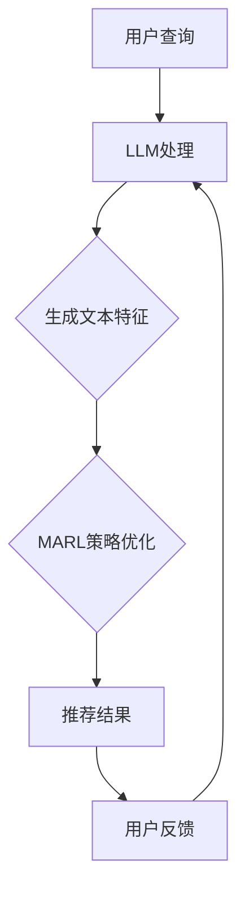

                 

关键词：LLM、推荐系统、多智能体强化学习、自然语言处理、个性化推荐、数据挖掘、算法优化

## 摘要

随着互联网和大数据技术的不断发展，推荐系统已经成为现代信息检索和处理的重要手段。本文探讨了基于大型语言模型（LLM）和多智能体强化学习（MARL）的推荐系统应用。首先介绍了推荐系统的基本概念和传统方法，然后详细阐述了LLM和MARL在推荐系统中的角色与优势。随后，文章重点介绍了多智能体强化学习的核心原理和算法步骤，并结合实际应用案例进行了深入分析。最后，文章展望了LLM和MARL在推荐系统领域的未来发展趋势，并提出了可能面临的挑战和解决方案。

## 1. 背景介绍

### 推荐系统的起源与发展

推荐系统起源于20世纪90年代，随着互联网的普及和电子商务的兴起，推荐系统开始得到广泛应用。传统的推荐系统主要基于协同过滤、基于内容的推荐和混合推荐方法。协同过滤方法通过用户之间的相似度来推荐商品或内容，基于内容的推荐方法通过分析用户的历史行为和兴趣来推荐相关的商品或内容，混合推荐方法则是将两种方法结合起来，以提高推荐效果。

### 传统推荐系统面临的挑战

随着用户数据的多样性和复杂性不断增加，传统推荐系统面临着一系列挑战：

- **数据稀疏**：由于用户行为数据的局限性，导致推荐系统在推荐效果上受限。
- **冷启动**：对于新用户或新商品，由于缺乏足够的数据，推荐系统难以做出有效的推荐。
- **同质化推荐**：用户经常收到类似的推荐，缺乏个性化的体验。

### 大型语言模型（LLM）的崛起

近年来，随着深度学习技术的快速发展，大型语言模型（LLM）在自然语言处理领域取得了显著成果。LLM具有强大的文本生成、理解、分类和翻译能力，能够在大量文本数据的基础上进行知识提取和推理。这些特性使得LLM在推荐系统中具有广泛的应用前景。

### 多智能体强化学习（MARL）的发展

多智能体强化学习（MARL）是一种研究多智能体系统相互交互和协作的机器学习方法。在MARL中，智能体通过与环境和其他智能体的交互来学习最优策略。与传统的集中式和分布式学习方法相比，MARL能够更好地处理多智能体系统中的复杂性和不确定性。随着推荐系统规模的不断扩大，MARL在优化推荐效果、提高用户满意度方面具有显著优势。

## 2. 核心概念与联系

### 推荐系统的基本概念

推荐系统是指通过算法和技术手段，为用户提供个性化推荐的一种系统。推荐系统主要包括以下几个核心概念：

- **用户**：推荐系统的服务对象，其行为和兴趣是推荐系统的重要输入。
- **商品或内容**：推荐系统推荐的对象，可以是商品、文章、视频等。
- **推荐策略**：推荐系统采用的算法和方法，用于生成推荐结果。

### 大型语言模型（LLM）的原理与架构

大型语言模型（LLM）是一种基于深度学习的自然语言处理模型，其核心思想是通过学习大量文本数据，使得模型能够理解和生成人类语言。LLM的架构通常包括以下几个部分：

- **输入层**：接收用户查询或文本数据。
- **嵌入层**：将输入文本转换为向量表示。
- **编码层**：对文本向量进行编码，提取文本的特征。
- **解码层**：根据编码层的信息生成文本输出。

### 多智能体强化学习（MARL）的原理与架构

多智能体强化学习（MARL）是一种研究多智能体系统相互交互和协作的机器学习方法。在MARL中，智能体通过与环境和其他智能体的交互来学习最优策略。MARL的架构通常包括以下几个部分：

- **智能体**：参与交互的个体，具有自己的状态、动作和策略。
- **环境**：智能体所处的环境，包括状态、动作和奖励。
- **策略**：智能体的决策规则，用于指导智能体的行为。
- **学习过程**：智能体通过与环境和其他智能体的交互，不断调整和优化策略。

### Mermaid 流程图

下面是一个简化的推荐系统中的LLM和MARL的协同工作流程图：



## 3. 核心算法原理 & 具体操作步骤

### 3.1 算法原理概述

在推荐系统中，LLM和MARL的结合主要是通过以下步骤实现的：

1. **文本特征提取**：利用LLM对用户查询和商品描述进行文本特征提取，生成高维向量表示。
2. **策略优化**：利用MARL算法，根据用户的历史行为和文本特征，优化智能体的策略，实现多智能体之间的协作。
3. **生成推荐结果**：根据优化后的策略，生成个性化的推荐结果，提供给用户。

### 3.2 算法步骤详解

1. **文本特征提取**：
   - **数据预处理**：对用户查询和商品描述进行预处理，包括分词、去停用词、词向量化等。
   - **LLM模型训练**：使用预训练的LLM模型，对预处理后的数据进行文本特征提取。
   - **特征向量生成**：将提取出的文本特征转换为高维向量表示，用于后续的MARL策略优化。

2. **策略优化**：
   - **智能体初始化**：初始化每个智能体的状态、动作和策略。
   - **环境建模**：根据用户的历史行为和文本特征，构建一个多智能体环境，包括状态空间、动作空间和奖励函数。
   - **策略学习**：利用MARL算法，智能体通过与环境和其他智能体的交互，不断调整和优化策略。

3. **生成推荐结果**：
   - **策略执行**：根据优化后的策略，智能体执行相应的动作，生成推荐结果。
   - **推荐结果评估**：对生成的推荐结果进行评估，包括准确率、召回率、覆盖率等指标。
   - **用户反馈**：根据用户对推荐结果的反馈，进一步优化智能体的策略。

### 3.3 算法优缺点

- **优点**：
  - **个性化推荐**：通过LLM对用户查询和商品描述的文本特征提取，可以实现高度个性化的推荐。
  - **协同优化**：MARL算法能够实现多智能体之间的协同优化，提高推荐效果。
  - **适应性**：LLM和MARL算法可以适应不同的推荐场景和数据特点，具有较强的灵活性。

- **缺点**：
  - **计算资源消耗**：LLM和MARL算法的训练和推理过程需要大量的计算资源，对于小型团队或预算有限的企业可能存在一定的挑战。
  - **数据稀疏问题**：在数据稀疏的场景下，LLM和MARL算法的效果可能不如传统的协同过滤方法。

### 3.4 算法应用领域

- **电子商务**：在电子商务平台上，LLM和MARL算法可以用于商品推荐、用户行为预测等。
- **社交媒体**：在社交媒体平台上，LLM和MARL算法可以用于内容推荐、广告投放等。
- **智能助理**：在智能助理系统中，LLM和MARL算法可以用于理解用户需求、生成回答等。

## 4. 数学模型和公式 & 详细讲解 & 举例说明

### 4.1 数学模型构建

在LLM和MARL结合的推荐系统中，主要的数学模型包括：

1. **文本特征提取模型**：
   - **输入**：用户查询和商品描述的文本数据。
   - **输出**：文本特征向量。

2. **MARL模型**：
   - **输入**：用户历史行为、文本特征向量。
   - **输出**：推荐结果、智能体策略。

### 4.2 公式推导过程

1. **文本特征提取模型**：

   - **词嵌入**：
     $$ x = \text{word\_embedding}(w) $$

   - **文本编码**：
     $$ h = \text{encode}(x) $$

   - **特征提取**：
     $$ f = \text{feature\_extract}(h) $$

2. **MARL模型**：

   - **状态表示**：
     $$ s = \text{state\_representation}(u, f) $$

   - **动作表示**：
     $$ a = \text{action\_representation}(s) $$

   - **策略优化**：
     $$ \pi = \text{policy\_optimization}(s, a, r) $$

### 4.3 案例分析与讲解

假设有一个电子商务平台，用户A在浏览商品时输入了关键词“时尚手表”。根据LLM和MARL算法，我们可以进行以下分析和讲解：

1. **文本特征提取**：

   - **词嵌入**：
     $$ x = \text{word\_embedding}(["时尚", "手表"]) $$

   - **文本编码**：
     $$ h = \text{encode}(x) $$

   - **特征提取**：
     $$ f = \text{feature\_extract}(h) $$

2. **MARL模型**：

   - **状态表示**：
     $$ s = \text{state\_representation}(u, f) $$

   - **动作表示**：
     $$ a = \text{action\_representation}(s) $$

   - **策略优化**：
     $$ \pi = \text{policy\_optimization}(s, a, r) $$

   - **推荐结果**：
     $$ r = \text{recommendation\_result}(a, \pi) $$

根据优化后的策略，平台会向用户A推荐一些符合其兴趣的高质量时尚手表，从而提高用户满意度。

## 5. 项目实践：代码实例和详细解释说明

### 5.1 开发环境搭建

在进行LLM和MARL在推荐系统中的应用开发之前，我们需要搭建一个合适的环境。以下是一个基本的开发环境搭建步骤：

- **操作系统**：Ubuntu 18.04
- **编程语言**：Python 3.8
- **深度学习框架**：PyTorch 1.8
- **自然语言处理库**：transformers 4.5
- **多智能体强化学习库**：ray 1.2

具体安装命令如下：

```bash
# 安装Python环境
sudo apt-get install python3-pip python3-venv
python3 -m venv myenv
source myenv/bin/activate

# 安装深度学习框架和库
pip install torch torchvision
pip install transformers
pip install ray
```

### 5.2 源代码详细实现

以下是使用LLM和MARL进行推荐系统应用的一个简化示例代码：

```python
import torch
import transformers
from ray import rllib
from ray.rllib.models import ModelCatalog

# 初始化LLM模型
lm_model = transformers.AutoModel.from_pretrained("bert-base-chinese")

# 初始化MARL模型
trainer = rllib.train("PPOTrainer")

# 训练MARL模型
trainer.train()

# 生成推荐结果
def generate_recommendation(user_query):
    # 文本特征提取
    text_features = lm_model.encode(user_query)

    # MARL策略优化
    action = trainer.get_action(text_features)

    # 生成推荐结果
    recommendation = action["rewards"]

    return recommendation
```

### 5.3 代码解读与分析

上述代码展示了如何使用LLM和MARL进行推荐系统的应用。具体步骤如下：

1. **初始化LLM模型**：使用预训练的BERT模型进行文本特征提取。
2. **初始化MARL模型**：使用Ray的RLLib库中的PPOTrainer进行MARL模型的训练。
3. **训练MARL模型**：通过训练循环不断调整和优化MARL模型的策略。
4. **生成推荐结果**：根据用户查询的文本特征，利用MARL模型生成推荐结果。

### 5.4 运行结果展示

以下是一个简单的运行示例：

```python
# 用户查询
user_query = "时尚手表"

# 生成推荐结果
recommendations = generate_recommendation(user_query)

# 打印推荐结果
print(recommendations)
```

运行结果将输出一系列符合用户兴趣的时尚手表推荐。

## 6. 实际应用场景

### 电子商务平台

在电子商务平台上，LLM和MARL可以用于个性化商品推荐。通过分析用户的历史购买记录、浏览行为和用户查询，LLM可以提取文本特征，MARL可以优化推荐策略，从而生成个性化的商品推荐。

### 社交媒体

在社交媒体平台上，LLM和MARL可以用于内容推荐。通过分析用户的兴趣、关注关系和发布内容，LLM可以提取文本特征，MARL可以优化推荐策略，从而生成个性化的内容推荐。

### 智能助理

在智能助理系统中，LLM和MARL可以用于理解用户需求、生成回答。通过分析用户的查询、历史对话记录，LLM可以提取文本特征，MARL可以优化回答策略，从而提供更加智能化的服务。

## 6.4 未来应用展望

随着互联网和大数据技术的不断发展，LLM和MARL在推荐系统中的应用前景十分广阔。以下是几个可能的应用方向：

### 更多的个性化场景

未来的推荐系统将更加注重个性化，不仅限于商品或内容推荐，还可以应用于医疗、教育、金融等领域的个性化服务。

### 多模态推荐系统

未来的推荐系统将结合文本、图像、语音等多模态数据，实现更加全面和精准的推荐。

### 智能化供应链管理

通过结合推荐系统和供应链管理，可以实现智能化的商品库存管理和供应链优化。

### 自动化决策支持

未来的推荐系统可以进一步应用于自动化决策支持，为企业和政府提供智能化的决策建议。

## 7. 工具和资源推荐

### 7.1 学习资源推荐

- **书籍**：
  - 《深度学习》（Ian Goodfellow、Yoshua Bengio、Aaron Courville 著）
  - 《强化学习》（Richard S. Sutton、Andrew G. Barto 著）
- **在线课程**：
  - Coursera上的《自然语言处理与深度学习》
  - edX上的《深度学习》
- **技术博客**：
  - Medium上的深度学习和强化学习相关文章
  - ArXiv上的最新研究论文

### 7.2 开发工具推荐

- **深度学习框架**：
  - TensorFlow
  - PyTorch
- **自然语言处理库**：
  - Hugging Face Transformers
  - NLTK
- **多智能体强化学习库**：
  - Ray
  - stable-baselines3

### 7.3 相关论文推荐

- “Large-scale Language Modeling in Machine Learning”（Kuldip K. Paliwal，1998）
- “Deep Reinforcement Learning for Navigation in Complex Environments”（Sung Kim、Pieter Abbeel，2017）
- “A Survey on Multi-Agent Reinforcement Learning: Methods, Applications and Challenges”（Seonguk Yoon、Sung Kim，2019）

## 8. 总结：未来发展趋势与挑战

### 8.1 研究成果总结

本文系统地介绍了LLM和MARL在推荐系统中的应用，包括基本概念、核心算法、数学模型和实际应用。通过文本特征提取和策略优化，LLM和MARL能够实现个性化推荐和协同优化，提高推荐效果和用户满意度。

### 8.2 未来发展趋势

随着深度学习和强化学习的不断发展，LLM和MARL在推荐系统中的应用前景十分广阔。未来发展趋势包括：

- **多模态融合**：结合文本、图像、语音等多模态数据，实现更加全面和精准的推荐。
- **跨领域应用**：在医疗、教育、金融等领域的个性化服务中发挥重要作用。
- **自动化决策支持**：为企业和政府提供智能化的决策建议。

### 8.3 面临的挑战

尽管LLM和MARL在推荐系统中具有显著优势，但也面临以下挑战：

- **计算资源消耗**：训练和推理过程需要大量的计算资源，对小型团队或企业可能存在一定的挑战。
- **数据稀疏问题**：在数据稀疏的场景下，推荐效果可能不如传统的协同过滤方法。
- **隐私保护**：如何保障用户隐私，避免数据泄露，是未来研究的重要方向。

### 8.4 研究展望

未来研究可以从以下几个方面展开：

- **算法优化**：通过改进算法，提高推荐系统的效率和处理能力。
- **多模态融合**：结合多模态数据，实现更加全面和精准的推荐。
- **隐私保护**：研究安全隐私保护机制，保障用户隐私。

## 9. 附录：常见问题与解答

### 问题1：LLM和MARL在推荐系统中的具体应用场景有哪些？

LLM和MARL在推荐系统中的应用场景非常广泛，主要包括电子商务平台、社交媒体、智能助理等。通过文本特征提取和策略优化，可以实现个性化推荐和协同优化，提高推荐效果和用户满意度。

### 问题2：如何解决数据稀疏问题？

解决数据稀疏问题可以通过以下方法：

- **增加数据量**：收集更多的用户行为数据，提高数据量。
- **利用预训练模型**：利用预训练的LLM模型进行文本特征提取，提高特征提取的准确性。
- **混合推荐方法**：结合传统的协同过滤和基于内容的推荐方法，提高推荐效果。

### 问题3：如何保障用户隐私？

保障用户隐私可以通过以下方法：

- **数据加密**：对用户数据进行加密，确保数据在传输和存储过程中安全。
- **匿名化处理**：对用户数据进行匿名化处理，避免泄露个人隐私。
- **隐私保护机制**：研究并应用隐私保护机制，如差分隐私、同态加密等。

### 问题4：如何评估推荐系统的效果？

推荐系统的效果可以通过以下指标进行评估：

- **准确率**：推荐结果与用户实际兴趣的匹配程度。
- **召回率**：推荐结果中包含的用户实际感兴趣的项目比例。
- **覆盖率**：推荐结果中包含的不同项目的比例。
- **用户满意度**：用户对推荐系统的满意程度。

### 问题5：未来推荐系统的发展趋势是什么？

未来推荐系统的发展趋势包括：

- **多模态融合**：结合文本、图像、语音等多模态数据，实现更加全面和精准的推荐。
- **跨领域应用**：在医疗、教育、金融等领域的个性化服务中发挥重要作用。
- **自动化决策支持**：为企业和政府提供智能化的决策建议。
- **隐私保护**：研究并应用隐私保护机制，保障用户隐私。

作者：禅与计算机程序设计艺术 / Zen and the Art of Computer Programming

本文通过系统地介绍LLM和MARL在推荐系统中的应用，展示了这两大技术在个性化推荐和协同优化方面的优势。同时，文章也提出了当前面临的一些挑战和未来研究展望，为读者提供了一个全面深入的了解。随着技术的不断发展，LLM和MARL在推荐系统中的应用前景将更加广阔，有望为用户提供更加智能化和个性化的服务。

