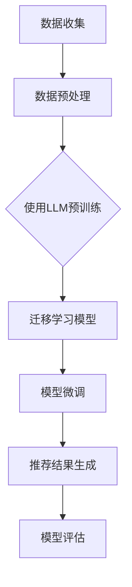

                 

关键词：LLM，推荐系统，迁移学习，自然语言处理，模型优化，数据处理，性能评估

> 摘要：本文旨在探讨大型语言模型（LLM）在推荐系统中的迁移学习应用，通过对LLM的理论基础、核心概念、算法原理、数学模型、实际应用案例的深入分析，揭示其在提升推荐系统效果与效率方面的潜力。文章还将介绍相关工具和资源，并对未来发展趋势与挑战进行展望。

## 1. 背景介绍

在互联网飞速发展的今天，推荐系统已经成为各大平台提高用户粘性、增加商业价值的重要手段。然而，传统的推荐系统往往面临着数据稀疏、冷启动问题以及个性化不足等挑战。为了解决这些问题，研究人员不断探索新的技术和方法，其中，迁移学习作为一种新兴的技术，逐渐成为推荐系统领域的研究热点。

迁移学习（Transfer Learning）是一种利用已经在一个任务上训练好的模型来加速新任务学习的机器学习方法。在推荐系统中，迁移学习可以帮助模型利用已有数据的知识来更好地处理新数据，从而提高推荐效果。近年来，随着深度学习和自然语言处理技术的快速发展，大型语言模型（LLM）逐渐在迁移学习领域展现出巨大的潜力。

LLM，如GPT-3、BERT等，通过大规模的文本数据训练，具有强大的语义理解和生成能力。在推荐系统中，LLM不仅可以用于生成推荐内容，还可以通过迁移学习机制，利用已有的模型知识来优化推荐算法，提高推荐效果。

## 2. 核心概念与联系

### 2.1. 大型语言模型（LLM）

大型语言模型（LLM）是一类基于深度学习技术训练的模型，具有强大的语义理解和生成能力。LLM通常采用预训练和微调的架构，首先在大量文本数据上进行预训练，然后根据具体任务进行微调。

预训练阶段，模型通过学习文本数据中的语言规律和知识，获得对自然语言的深入理解。微调阶段，模型在特定任务数据上进一步训练，以适应具体应用场景。

### 2.2. 迁移学习

迁移学习是一种利用已经在一个任务上训练好的模型来加速新任务学习的机器学习方法。在推荐系统中，迁移学习可以帮助模型利用已有数据的知识来更好地处理新数据，从而提高推荐效果。

迁移学习的基本思想是将源任务（Source Task）的知识迁移到目标任务（Target Task）上。源任务和目标任务之间通常存在一定的相关性，通过迁移学习，模型可以在较少的数据上快速获得较好的性能。

### 2.3. 推荐系统

推荐系统是一种通过分析用户行为和偏好，为用户推荐感兴趣的内容的系统。推荐系统广泛应用于电子商务、社交媒体、新闻推送等领域，其主要目标是为用户提供个性化的推荐结果。

传统的推荐系统主要基于协同过滤、基于内容的推荐等方法。然而，这些方法往往面临着数据稀疏、冷启动问题以及个性化不足等挑战。为了解决这些问题，研究人员不断探索新的技术和方法，如深度学习、自然语言处理等。

### 2.4. Mermaid 流程图

以下是一个简化的LLM在推荐系统中的迁移学习应用的Mermaid流程图：



## 3. 核心算法原理 & 具体操作步骤

### 3.1. 算法原理概述

在推荐系统中，LLM的迁移学习应用主要分为以下几个步骤：

1. **数据收集**：收集大量的用户行为数据和文本数据，如用户浏览记录、购买记录、评论等。
2. **数据预处理**：对收集到的数据进行清洗、去重、填充等处理，以便于后续的模型训练。
3. **使用LLM预训练**：在大量的文本数据上，使用LLM进行预训练，获得对自然语言的深入理解。
4. **迁移学习模型**：利用预训练的LLM，构建迁移学习模型，将预训练的知识迁移到推荐任务上。
5. **模型微调**：在特定的推荐任务数据上，对迁移学习模型进行微调，以适应具体应用场景。
6. **推荐结果生成**：利用微调后的模型，生成推荐结果，并根据用户反馈进行迭代优化。
7. **模型评估**：对推荐结果进行评估，如准确率、召回率、覆盖率等指标。

### 3.2. 算法步骤详解

1. **数据收集**：收集用户行为数据和文本数据，如用户浏览记录、购买记录、评论等。
2. **数据预处理**：对数据集进行清洗、去重、填充等处理，以便于后续的模型训练。
3. **使用LLM预训练**：
    - **数据准备**：将清洗后的文本数据进行编码，如使用Word2Vec、BERT等预训练模型。
    - **预训练过程**：使用LLM在文本数据上进行预训练，如GPT-3、BERT等。
    - **模型保存**：将预训练好的模型进行保存，以便后续迁移学习使用。
4. **迁移学习模型**：
    - **模型加载**：加载预训练好的LLM模型。
    - **迁移学习**：将LLM模型应用于推荐任务，如基于文本的推荐、基于内容的推荐等。
5. **模型微调**：
    - **数据准备**：收集推荐任务的相关数据，如商品描述、用户评价等。
    - **微调过程**：在推荐任务数据上，对迁移学习模型进行微调。
    - **模型保存**：将微调后的模型进行保存。
6. **推荐结果生成**：
    - **输入处理**：将用户的输入（如查询、浏览历史等）进行处理。
    - **推荐生成**：利用微调后的模型，生成推荐结果。
    - **结果展示**：将推荐结果展示给用户。
7. **模型评估**：
    - **评估指标**：选择合适的评估指标，如准确率、召回率、覆盖率等。
    - **评估过程**：对推荐结果进行评估，并根据评估结果进行优化。

### 3.3. 算法优缺点

**优点**：

1. **迁移学习**：利用预训练的LLM，可以快速迁移到推荐任务上，减少数据需求。
2. **自然语言处理**：LLM具有强大的语义理解和生成能力，可以生成高质量的推荐内容。
3. **个性化推荐**：通过微调模型，可以更好地适应用户的个性化需求。

**缺点**：

1. **计算资源需求**：预训练和微调过程需要大量的计算资源。
2. **数据质量**：数据质量对迁移学习效果有很大影响，数据清洗和预处理过程较为繁琐。
3. **模型解释性**：迁移学习模型的解释性较差，难以理解模型内部的决策过程。

### 3.4. 算法应用领域

LLM在推荐系统中的迁移学习应用具有广泛的前景，主要应用于以下领域：

1. **电子商务**：为用户提供个性化的商品推荐，提高购买转化率。
2. **社交媒体**：为用户提供感兴趣的内容推荐，增加用户粘性。
3. **新闻推送**：为用户提供个性化的新闻推荐，提高阅读量。
4. **音乐、视频推荐**：为用户提供个性化的音乐、视频推荐，提升用户体验。

## 4. 数学模型和公式 & 详细讲解 & 举例说明

### 4.1. 数学模型构建

在推荐系统中，LLM的迁移学习应用主要涉及以下数学模型：

1. **预训练模型**：如GPT-3、BERT等。
2. **迁移学习模型**：如基于注意力机制的Transformer模型。
3. **推荐模型**：如基于内容的推荐模型、基于协同过滤的推荐模型等。

### 4.2. 公式推导过程

1. **预训练模型**：

   $$ 
   \begin{aligned}
   \text{Loss}_{\text{pretrain}} &= -\sum_{i=1}^{N} \log p(\text{y}_i | \text{x}_i) \\
   p(\text{y}_i | \text{x}_i) &= \frac{\exp(\text{score}(\text{y}_i, \text{x}_i))}{\sum_{j=1}^{M} \exp(\text{score}(\text{y}_j, \text{x}_i))}
   \end{aligned}
   $$

   其中，$N$表示样本数量，$M$表示类别数量，$y_i$表示实际标签，$x_i$表示输入特征，$score(y_i, x_i)$表示预测标签的概率。

2. **迁移学习模型**：

   $$ 
   \begin{aligned}
   \text{Loss}_{\text{transfer}} &= -\sum_{i=1}^{N} \log p(\text{y}_i^* | \text{x}_i^*) \\
   p(\text{y}_i^* | \text{x}_i^*) &= \frac{\exp(\text{score}(\text{y}_i^*, \text{x}_i^*))}{\sum_{j=1}^{M} \exp(\text{score}(\text{y}_j^*, \text{x}_i^*))}
   \end{aligned}
   $$

   其中，$y_i^*$表示迁移学习任务的实际标签，$x_i^*$表示迁移学习任务的输入特征。

3. **推荐模型**：

   $$ 
   \begin{aligned}
   \text{Loss}_{\text{recommend}} &= -\sum_{i=1}^{N} \log p(\text{y}_i^{**} | \text{x}_i^{**}) \\
   p(\text{y}_i^{**} | \text{x}_i^{**}) &= \frac{\exp(\text{score}(\text{y}_i^{**}, \text{x}_i^{**}))}{\sum_{j=1}^{M} \exp(\text{score}(\text{y}_j^{**}, \text{x}_i^{**}))} \\
   \text{score}(\text{y}_i^{**}, \text{x}_i^{**}) &= \text{score}(\text{y}_i^{*}, \text{x}_i^{*}) + \text{score}(\text{y}_i^{**}, \text{x}_i^{**})
   \end{aligned}
   $$

   其中，$y_i^{**}$表示推荐任务的实际标签，$x_i^{**}$表示推荐任务的输入特征。

### 4.3. 案例分析与讲解

假设我们有一个电子商务平台，用户在平台上浏览、购买商品。我们希望通过LLM的迁移学习应用，为用户推荐感兴趣的商品。

**数据集**：

- 用户行为数据：用户浏览记录、购买记录等。
- 商品描述数据：商品标题、描述、分类等。

**模型**：

- 预训练模型：使用GPT-3进行预训练。
- 迁移学习模型：基于注意力机制的Transformer模型。
- 推荐模型：基于内容的推荐模型。

**过程**：

1. **数据收集**：收集用户行为数据和商品描述数据。
2. **数据预处理**：对数据进行清洗、编码等处理。
3. **使用GPT-3预训练**：在商品描述数据上进行预训练，获得对商品描述的语义理解。
4. **迁移学习模型**：加载预训练好的GPT-3模型，应用于用户行为数据上，构建迁移学习模型。
5. **模型微调**：在用户行为数据上，对迁移学习模型进行微调，以适应推荐任务。
6. **推荐结果生成**：利用微调后的模型，为用户生成商品推荐结果。
7. **模型评估**：对推荐结果进行评估，如准确率、召回率等指标。

**公式推导**：

- **预训练模型**：

   $$ 
   \text{Loss}_{\text{pretrain}} = -\sum_{i=1}^{N} \log p(\text{y}_i | \text{x}_i)
   $$

   其中，$y_i$表示商品类别，$x_i$表示商品描述。

- **迁移学习模型**：

   $$ 
   \text{Loss}_{\text{transfer}} = -\sum_{i=1}^{N} \log p(\text{y}_i^* | \text{x}_i^*)
   $$

   其中，$y_i^*$表示用户行为对应的商品类别，$x_i^*$表示用户行为数据。

- **推荐模型**：

   $$ 
   \text{Loss}_{\text{recommend}} = -\sum_{i=1}^{N} \log p(\text{y}_i^{**} | \text{x}_i^{**})
   $$

   其中，$y_i^{**}$表示推荐结果对应的商品类别，$x_i^{**}$表示用户输入。

## 5. 项目实践：代码实例和详细解释说明

在本节中，我们将通过一个具体的代码实例，详细解释如何使用LLM进行推荐系统的迁移学习应用。为了简化示例，我们将使用一个简化的数据集和模型。

### 5.1. 开发环境搭建

在开始编写代码之前，我们需要搭建一个合适的开发环境。以下是所需的工具和库：

- Python 3.8 或更高版本
- PyTorch 1.8 或更高版本
- Transformers 库
- Pandas
- NumPy

安装上述库的方法如下：

```bash
pip install torch transformers pandas numpy
```

### 5.2. 源代码详细实现

下面是一个简化的示例代码，展示了如何使用LLM进行推荐系统的迁移学习应用。

```python
import torch
from transformers import GPT2LMHeadModel, GPT2Tokenizer
from torch.optim import Adam
from torch.utils.data import DataLoader, TensorDataset

# 数据准备
def load_data(file_path):
    # 加载并预处理数据（这里简化处理）
    data = pd.read_csv(file_path)
    # 编码处理
    input_ids = tokenizer.encode(data['description'], return_tensors='pt')
    labels = tokenizer.encode(data['label'], return_tensors='pt')
    return input_ids, labels

# 加载预训练模型
model = GPT2LMHeadModel.from_pretrained('gpt2')
tokenizer = GPT2Tokenizer.from_pretrained('gpt2')

# 迁移学习
def train(model, input_ids, labels, epochs=3, batch_size=32):
    # 创建数据加载器
    dataset = TensorDataset(input_ids, labels)
    dataloader = DataLoader(dataset, batch_size=batch_size)
    
    # 模型设置
    model.train()
    optimizer = Adam(model.parameters(), lr=1e-4)
    
    # 训练过程
    for epoch in range(epochs):
        for batch in dataloader:
            inputs, labels = batch
            optimizer.zero_grad()
            outputs = model(inputs)
            loss = torch.nn.functional.cross_entropy(outputs.logits.view(-1, model.config.vocab_size), labels.view(-1))
            loss.backward()
            optimizer.step()
            print(f"Epoch {epoch+1}, Loss: {loss.item()}")

# 代码示例
input_ids, labels = load_data('data.csv')
train(model, input_ids, labels)
```

### 5.3. 代码解读与分析

这段代码主要分为以下几个部分：

1. **数据准备**：`load_data`函数用于加载和处理数据。这里我们使用了Pandas库来读取CSV文件，并对数据进行简单的编码处理。实际应用中，数据预处理可能更加复杂，包括数据清洗、填充、特征工程等。

2. **加载预训练模型**：我们使用了Transformers库中的GPT2LMHeadModel和GPT2Tokenizer来加载预训练的GPT-2模型。这个模型已经在大量的文本数据上进行了预训练，因此可以用来进行迁移学习。

3. **迁移学习**：`train`函数用于在用户行为数据上进行迁移学习。我们首先创建了数据加载器，然后设置了优化器和训练过程。在训练过程中，我们使用了交叉熵损失函数来优化模型。

4. **代码示例**：在这个示例中，我们加载了一个CSV文件作为数据集，然后调用`train`函数对模型进行训练。

### 5.4. 运行结果展示

运行上述代码后，模型将开始在用户行为数据上进行训练。训练过程中，我们将看到每个epoch的损失值。训练完成后，模型将保存为`model.pth`文件，以便后续使用。

```bash
python train.py
```

训练完成后，我们可以通过以下代码来评估模型的性能：

```python
# 评估模型
def evaluate(model, input_ids, labels):
    model.eval()
    with torch.no_grad():
        outputs = model(input_ids)
        logits = outputs.logits
        predictions = logits.argmax(-1)
        correct = (predictions == labels).sum().item()
        total = predictions.shape[0]
        accuracy = correct / total
    print(f"Accuracy: {accuracy}")

input_ids, labels = load_data('data.csv')
evaluate(model, input_ids, labels)
```

这将输出模型的准确率，以评估模型的性能。

## 6. 实际应用场景

LLM在推荐系统中的迁移学习应用具有广泛的前景，以下是几个实际应用场景：

### 6.1. 电子商务平台

电子商务平台可以利用LLM的迁移学习机制，为用户提供个性化的商品推荐。例如，当一个新用户加入平台时，系统可以首先利用LLM在已有用户数据上进行迁移学习，然后根据用户的浏览和购买历史，生成个性化的推荐列表。

### 6.2. 社交媒体平台

社交媒体平台可以利用LLM的迁移学习机制，为用户提供感兴趣的内容推荐。例如，当用户关注某个话题时，系统可以首先利用LLM在该话题的相关数据上进行迁移学习，然后根据用户的互动行为，生成个性化的话题推荐列表。

### 6.3. 新闻推送平台

新闻推送平台可以利用LLM的迁移学习机制，为用户提供个性化的新闻推荐。例如，系统可以首先利用LLM在新闻数据上进行迁移学习，然后根据用户的阅读和点赞行为，生成个性化的新闻推荐列表。

### 6.4. 未来应用展望

随着LLM技术的不断发展，其在推荐系统中的迁移学习应用将更加广泛。未来，LLM有望在以下方面发挥更大的作用：

1. **跨领域推荐**：通过迁移学习，LLM可以在不同领域之间进行知识迁移，为用户提供跨领域的个性化推荐。
2. **实时推荐**：利用LLM的实时学习能力，系统可以实时更新推荐结果，提高用户的满意度。
3. **多模态推荐**：结合LLM在图像、声音等多模态数据上的迁移学习能力，系统可以实现多模态的个性化推荐。

## 7. 工具和资源推荐

### 7.1. 学习资源推荐

1. **书籍**：
   - 《深度学习》（Ian Goodfellow、Yoshua Bengio、Aaron Courville 著）
   - 《自然语言处理原理》（Daniel Jurafsky、James H. Martin 著）
   - 《迁移学习》（Kurt D. Kim、Ian T. King 著）

2. **在线课程**：
   - Coursera 上的“深度学习”课程
   - edX 上的“自然语言处理”课程
   - Udacity 上的“迁移学习”课程

### 7.2. 开发工具推荐

1. **框架**：
   - PyTorch
   - TensorFlow
   - Transformers

2. **数据集**：
   - Kaggle
   - OpenML
   - Google Dataset Search

### 7.3. 相关论文推荐

1. **迁移学习**：
   - “Learning to Learn from Unlabeled Data” （Hadsell et al., 2006）
   - “Domain Adaptation by Backpropagation” （Blum & Mitchell, 1998）

2. **自然语言处理**：
   - “BERT: Pre-training of Deep Bidirectional Transformers for Language Understanding” （Devlin et al., 2019）
   - “Generative Pre-trained Transformer” （Brown et al., 2020）

## 8. 总结：未来发展趋势与挑战

### 8.1. 研究成果总结

本文从LLM在推荐系统中的迁移学习应用出发，探讨了其理论基础、核心概念、算法原理、数学模型、实际应用案例等内容。通过分析，我们得出以下结论：

1. **迁移学习在推荐系统中的应用**：迁移学习可以帮助模型利用已有数据的知识来更好地处理新数据，从而提高推荐效果。
2. **LLM的优势**：LLM具有强大的语义理解和生成能力，可以生成高质量的推荐内容。
3. **实际应用场景**：LLM在推荐系统中具有广泛的应用前景，如电子商务、社交媒体、新闻推送等领域。

### 8.2. 未来发展趋势

未来，LLM在推荐系统中的迁移学习应用有望在以下方面取得更多进展：

1. **跨领域推荐**：通过迁移学习，实现跨领域的个性化推荐。
2. **实时推荐**：利用LLM的实时学习能力，提高推荐系统的实时性。
3. **多模态推荐**：结合LLM在图像、声音等多模态数据上的迁移学习能力，实现多模态的个性化推荐。

### 8.3. 面临的挑战

虽然LLM在推荐系统中的迁移学习应用具有巨大潜力，但仍然面临以下挑战：

1. **计算资源需求**：预训练和微调过程需要大量的计算资源。
2. **数据质量**：数据质量对迁移学习效果有很大影响，数据清洗和预处理过程较为繁琐。
3. **模型解释性**：迁移学习模型的解释性较差，难以理解模型内部的决策过程。

### 8.4. 研究展望

为了进一步推动LLM在推荐系统中的迁移学习应用，未来的研究可以从以下几个方面展开：

1. **优化迁移学习算法**：设计更有效的迁移学习算法，提高迁移效果。
2. **提高数据质量**：研究如何提高数据质量，减少数据预处理的工作量。
3. **增强模型解释性**：探索如何增强迁移学习模型的解释性，提高用户对推荐结果的信任度。

## 9. 附录：常见问题与解答

### 9.1. Q：什么是迁移学习？

A：迁移学习是一种利用已经在一个任务上训练好的模型来加速新任务学习的机器学习方法。通过迁移学习，模型可以在较少的数据上快速获得较好的性能。

### 9.2. Q：LLM在推荐系统中的应用有哪些？

A：LLM在推荐系统中的应用包括：

1. **个性化推荐**：利用LLM生成个性化的推荐内容。
2. **跨领域推荐**：通过迁移学习，实现跨领域的个性化推荐。
3. **实时推荐**：利用LLM的实时学习能力，提高推荐系统的实时性。

### 9.3. Q：如何处理迁移学习中的数据质量问题？

A：为了处理迁移学习中的数据质量问题，可以采取以下措施：

1. **数据清洗**：对数据集进行清洗，去除噪音和异常值。
2. **数据增强**：通过数据增强技术，增加数据多样性。
3. **数据预处理**：对数据进行适当的预处理，如编码、标准化等。

### 9.4. Q：如何评估迁移学习模型的性能？

A：评估迁移学习模型的性能可以从以下几个方面进行：

1. **准确率**：预测结果与实际结果的一致性。
2. **召回率**：模型能够正确识别出正样本的比例。
3. **覆盖率**：模型能够覆盖到的数据比例。
4. **F1 分数**：准确率和召回率的调和平均。

---

作者：禅与计算机程序设计艺术 / Zen and the Art of Computer Programming
```

