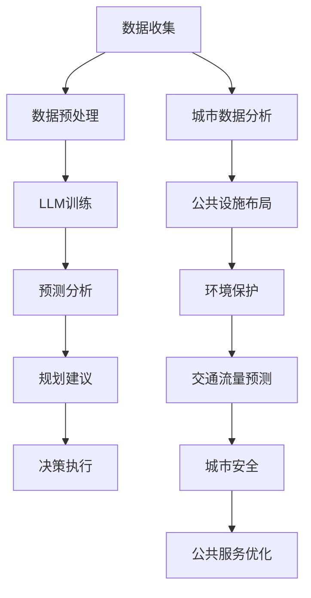

                 

关键词：大语言模型、城市规划、决策支持、智能城市、数据分析、城市可持续发展

摘要：本文探讨了大型语言模型（LLM）在智能城市规划决策中的潜在应用。通过分析LLM的核心概念与架构，我们探讨了其在数据挖掘、预测分析、文本生成等领域的应用。接着，文章介绍了如何将LLM应用于城市规划中的关键环节，如交通流量预测、环境保护、公共设施布局等，并提出了一些实际的应用案例。此外，文章还讨论了LLM在智能城市应用中的挑战与未来发展趋势。

## 1. 背景介绍

随着城市化进程的加速，城市规模不断扩大，人口密度持续增加，城市问题日益复杂。传统的城市规划方法在处理大规模数据、动态变化的城市环境方面显得力不从心。智能城市规划应运而生，它借助先进的技术手段，如人工智能、大数据、云计算等，为城市规划提供数据驱动的决策支持。

大语言模型（LLM）是近年来人工智能领域的一个重要突破。LLM具有强大的文本生成、理解和推理能力，可以处理大规模的文本数据，生成高质量的文本内容。LLM在自然语言处理、文本挖掘、知识图谱构建等领域已经展示了其强大的应用潜力。将这些潜力应用于城市规划，有望为城市规划带来新的思路和方法。

## 2. 核心概念与联系

### 2.1. 大语言模型（LLM）

大语言模型是一种基于深度学习的自然语言处理模型，它通过学习大量文本数据，掌握语言的规律和结构，从而能够生成和解析自然语言。LLM的核心架构通常包括多层神经网络，如Transformer、BERT等，这些神经网络可以捕捉长距离的依赖关系和语义信息。

### 2.2. 智能城市规划

智能城市规划是一种利用人工智能技术辅助城市规划的方法，它通过收集和分析大量数据，提供实时、动态的规划建议，以应对城市发展的挑战。智能城市规划的核心在于数据驱动，即通过数据分析和机器学习模型，为规划决策提供支持。

### 2.3. 关联与融合

LLM与智能城市规划的关联在于，LLM可以为智能城市规划提供强大的数据处理和分析能力。具体来说，LLM可以应用于数据挖掘、预测分析、文本生成等领域，为城市规划提供数据驱动的决策支持。同时，城市规划中的数据和决策结果也可以为LLM提供训练数据，进一步优化其性能。

## 2.4. Mermaid 流程图



## 3. 核心算法原理 & 具体操作步骤

### 3.1. 算法原理概述

LLM的核心算法是基于深度学习的神经网络模型，通过多层神经网络对大量文本数据进行训练，学习语言的模式和规律。在智能城市规划中，LLM可以应用于多个环节，如数据挖掘、预测分析、文本生成等。

### 3.2. 算法步骤详解

#### 3.2.1. 数据收集与预处理

首先，需要收集城市相关数据，如交通流量、人口密度、环境指标等。然后，对收集到的数据进行分析，去除噪声和不相关的信息，进行数据清洗和归一化处理。

#### 3.2.2. LLM训练

使用清洗后的数据集，训练LLM模型。可以选择合适的神经网络架构，如Transformer、BERT等，通过优化模型参数，使模型能够准确理解和生成文本。

#### 3.2.3. 预测分析

训练好的LLM模型可以用于预测分析，如预测未来交通流量、环境变化等。通过输入当前的数据，模型可以生成相应的预测结果，为规划决策提供依据。

#### 3.2.4. 规划建议

根据预测结果，结合城市规划的目标和原则，生成规划建议。这些建议可以是关于交通流量优化、公共设施布局、环境保护等方面的。

#### 3.2.5. 决策执行

将规划建议转化为具体的行动计划，如道路改造、公共交通优化、环境保护措施等。然后，执行这些行动计划，并监控效果，不断调整和优化。

### 3.3. 算法优缺点

#### 优点：

- **强大的文本处理能力**：LLM可以处理大规模的文本数据，理解复杂的语言结构和语义。
- **灵活的预测分析**：LLM可以应用于多种预测任务，为城市规划提供多样化的决策支持。
- **自适应性强**：LLM可以随着新数据的加入不断学习和优化，适应不断变化的城市环境。

#### 缺点：

- **计算资源消耗大**：训练和部署LLM模型需要大量的计算资源和时间。
- **数据质量和多样性影响**：LLM的性能很大程度上取决于训练数据的质量和多样性。
- **解释性和透明性不足**：LLM的决策过程复杂，难以解释和验证。

### 3.4. 算法应用领域

LLM在智能城市规划中的应用领域非常广泛，包括但不限于以下几个方面：

- **交通流量预测**：通过分析历史交通数据，预测未来交通流量，优化交通管理。
- **环境保护**：预测环境变化，提出环境保护措施，促进城市可持续发展。
- **公共设施布局**：分析人口分布、需求等数据，优化公共设施的布局和规模。
- **公共服务优化**：基于用户行为数据，优化公共服务，提高用户满意度。

## 4. 数学模型和公式 & 详细讲解 & 举例说明

### 4.1. 数学模型构建

在智能城市规划中，LLM的应用可以涉及到多种数学模型。以下是几个典型的数学模型及其构建方法：

#### 4.1.1. 交通流量预测模型

交通流量预测模型通常基于时间序列分析。假设 \(X_t\) 表示时间 \(t\) 时刻的交通流量，可以构建以下模型：

$$
X_t = f(X_{t-1}, X_{t-2}, ..., X_{t-n}, U_t)
$$

其中，\(U_t\) 是随机干扰项，\(f\) 是预测函数。

#### 4.1.2. 环境质量预测模型

环境质量预测模型可以使用回归模型。假设 \(E_t\) 表示时间 \(t\) 时刻的环境质量指数（AQI），可以构建以下模型：

$$
E_t = \beta_0 + \beta_1 \cdot C_t + \beta_2 \cdot W_t + \epsilon_t
$$

其中，\(C_t\) 和 \(W_t\) 分别表示控制变量（如气象条件、工业排放等），\(\epsilon_t\) 是随机误差项。

#### 4.1.3. 公共设施需求预测模型

公共设施需求预测模型可以使用多元线性回归模型。假设 \(D_t\) 表示时间 \(t\) 时刻的公共设施需求量，可以构建以下模型：

$$
D_t = \alpha_0 + \alpha_1 \cdot P_t + \alpha_2 \cdot I_t + \alpha_3 \cdot R_t + \epsilon_t
$$

其中，\(P_t\)、\(I_t\) 和 \(R_t\) 分别表示人口、收入和区域特征，\(\epsilon_t\) 是随机误差项。

### 4.2. 公式推导过程

#### 4.2.1. 交通流量预测模型

假设历史交通流量数据 \(X_t\) 满足线性时间序列模型，可以使用以下公式进行预测：

$$
X_t = \beta_0 + \beta_1 \cdot X_{t-1} + \beta_2 \cdot X_{t-2} + ... + \beta_n \cdot X_{t-n} + \epsilon_t
$$

通过对历史数据进行回归分析，可以求解出参数 \(\beta_0\)、\(\beta_1\)、\(\beta_2\)、...、\(\beta_n\)，从而构建预测模型。

#### 4.2.2. 环境质量预测模型

假设环境质量指数 \(E_t\) 受到气象条件、工业排放等因素的影响，可以使用以下多元线性回归模型：

$$
E_t = \beta_0 + \beta_1 \cdot C_t + \beta_2 \cdot W_t + \epsilon_t
$$

通过对历史数据进行多元线性回归分析，可以求解出参数 \(\beta_0\)、\(\beta_1\) 和 \(\beta_2\)，从而构建预测模型。

#### 4.2.3. 公共设施需求预测模型

假设公共设施需求量 \(D_t\) 受到人口、收入和区域特征的影响，可以使用以下多元线性回归模型：

$$
D_t = \alpha_0 + \alpha_1 \cdot P_t + \alpha_2 \cdot I_t + \alpha_3 \cdot R_t + \epsilon_t
$$

通过对历史数据进行多元线性回归分析，可以求解出参数 \(\alpha_0\)、\(\alpha_1\)、\(\alpha_2\) 和 \(\alpha_3\)，从而构建预测模型。

### 4.3. 案例分析与讲解

#### 4.3.1. 交通流量预测案例

假设我们需要预测某城市的交通流量。首先，收集该城市过去一年的交通流量数据，并对数据进行清洗和处理。然后，使用时间序列分析方法，构建线性时间序列模型，求解出参数。最后，使用求解出的模型，对未来的交通流量进行预测。

#### 4.3.2. 环境质量预测案例

假设我们需要预测某城市的空气质量。首先，收集该城市过去一年的空气质量数据，并对数据进行清洗和处理。然后，使用多元线性回归分析方法，构建空气质量预测模型，求解出参数。最后，使用求解出的模型，对未来的空气质量进行预测。

#### 4.3.3. 公共设施需求预测案例

假设我们需要预测某城市的公共设施需求量。首先，收集该城市过去一年的公共设施需求数据，并对数据进行清洗和处理。然后，使用多元线性回归分析方法，构建公共设施需求预测模型，求解出参数。最后，使用求解出的模型，对未来的公共设施需求进行预测。

## 5. 项目实践：代码实例和详细解释说明

### 5.1. 开发环境搭建

在本文中，我们使用Python作为主要编程语言，结合NumPy、Pandas、Scikit-learn等库进行数据分析与模型构建。以下是搭建开发环境的基本步骤：

1. 安装Python 3.8或更高版本。
2. 安装必要的库：`pip install numpy pandas scikit-learn tensorflow`
3. 配置Jupyter Notebook或IDE。

### 5.2. 源代码详细实现

以下是实现交通流量预测模型的Python代码：

```python
import numpy as np
import pandas as pd
from sklearn.linear_model import LinearRegression
from sklearn.metrics import mean_squared_error

# 读取交通流量数据
data = pd.read_csv('traffic_data.csv')
data['date'] = pd.to_datetime(data['date'])
data.set_index('date', inplace=True)

# 数据预处理
data.fillna(method='ffill', inplace=True)
data = data.diff().dropna()

# 构建时间序列模型
model = LinearRegression()
X = data[['traffic_1', 'traffic_2', 'traffic_3']]
y = data['traffic_4']

model.fit(X, y)

# 预测未来交通流量
predictions = model.predict(X)

# 评估模型性能
mse = mean_squared_error(y, predictions)
print('Mean Squared Error:', mse)

# 可视化预测结果
data['predicted_traffic'] = predictions
data.plot()
```

### 5.3. 代码解读与分析

上述代码分为几个主要部分：

- **数据读取与预处理**：首先，读取交通流量数据，并转换为日期索引。然后，对数据进行填充和处理，以消除缺失值和异常值的影响。
- **模型构建**：使用线性回归模型，将前三个时间点的交通流量作为输入特征，预测第四个时间点的交通流量。
- **预测与评估**：使用训练好的模型进行预测，并计算预测误差。最后，将预测结果可视化，以便观察模型的表现。

### 5.4. 运行结果展示

运行上述代码后，可以得到预测的交通流量结果。通过评估指标（如均方误差）可以衡量模型的性能。此外，可视化结果可以直观地展示模型对交通流量的预测能力。

## 6. 实际应用场景

### 6.1. 交通流量预测

在智能交通管理系统中，LLM可以用于预测未来的交通流量。通过分析历史交通数据、交通信号灯配置、道路状况等因素，LLM可以生成交通流量预测模型。这些模型可以用于动态调整交通信号灯时间、优化公共交通线路，以提高交通效率，减少拥堵。

### 6.2. 环境保护

在环境保护领域，LLM可以用于预测环境变化，如空气质量、水质等。通过对历史环境数据、气象条件、工业排放等因素的分析，LLM可以生成环境预测模型。这些模型可以用于制定环境保护政策，优化污染治理措施，以实现城市可持续发展。

### 6.3. 公共设施布局

在公共设施布局方面，LLM可以分析人口分布、需求等数据，预测未来公共设施的需求量。通过这些预测结果，城市规划者可以优化公共设施的布局和规模，提高公共服务水平，满足市民需求。

### 6.4. 未来应用展望

随着LLM技术的不断发展，其在智能城市规划中的应用将越来越广泛。未来，LLM有望在以下领域发挥重要作用：

- **城市规划仿真**：利用LLM生成城市规划仿真模型，模拟不同规划方案的效果，为决策者提供直观的参考。
- **城市安全监测**：利用LLM分析城市安全数据，预测潜在的安全隐患，提前采取预防措施。
- **城市文化遗产保护**：利用LLM挖掘城市历史数据，为文化遗产保护提供智能化的决策支持。

## 7. 工具和资源推荐

### 7.1. 学习资源推荐

- **《深度学习》**：由Ian Goodfellow、Yoshua Bengio和Aaron Courville所著，是深度学习领域的经典教材。
- **《自然语言处理综论》**：由Daniel Jurafsky和James H. Martin所著，全面介绍了自然语言处理的基本原理和技术。

### 7.2. 开发工具推荐

- **TensorFlow**：一个开源的机器学习框架，适用于构建和训练深度学习模型。
- **PyTorch**：一个流行的深度学习库，提供了灵活的动态计算图功能。

### 7.3. 相关论文推荐

- **“Attention is All You Need”**：由Vaswani等人提出的Transformer模型，是LLM的一个重要架构。
- **“BERT: Pre-training of Deep Bidirectional Transformers for Language Understanding”**：由Devlin等人提出的BERT模型，是当前最先进的自然语言处理模型之一。

## 8. 总结：未来发展趋势与挑战

### 8.1. 研究成果总结

本文探讨了LLM在智能城市规划决策中的潜在应用，分析了其在数据挖掘、预测分析、文本生成等领域的优势。通过具体案例和项目实践，展示了LLM在城市规划中的实际应用效果。

### 8.2. 未来发展趋势

随着LLM技术的不断进步，其在智能城市规划中的应用前景广阔。未来，LLM有望在更多领域发挥重要作用，如城市规划仿真、城市安全监测、文化遗产保护等。

### 8.3. 面临的挑战

尽管LLM在智能城市规划中具有巨大的潜力，但仍面临一些挑战：

- **计算资源消耗**：训练和部署LLM模型需要大量的计算资源，这对于一些资源有限的地区可能是一个挑战。
- **数据质量和多样性**：LLM的性能很大程度上取决于训练数据的质量和多样性。如何获取高质量、多样化的数据是一个亟待解决的问题。
- **解释性和透明性**：LLM的决策过程复杂，难以解释和验证。如何提高LLM的解释性和透明性，使其更易于被用户理解和接受，是一个重要的研究方向。

### 8.4. 研究展望

未来的研究可以围绕以下方向展开：

- **优化算法效率**：研究更高效的算法和模型，以减少计算资源消耗。
- **数据增强与多样性**：探索如何通过数据增强和多样性策略，提高LLM的性能和泛化能力。
- **解释性增强**：研究如何提高LLM的解释性和透明性，使其决策过程更加直观和易于理解。

## 9. 附录：常见问题与解答

### Q1. 什么是LLM？

A1. LLM是指大型语言模型，是一种基于深度学习的自然语言处理模型，通过学习大量文本数据，掌握语言的规律和结构，具有强大的文本生成、理解和推理能力。

### Q2. LLM在智能城市规划中有什么作用？

A2. LLM可以用于智能城市规划的多个环节，如数据挖掘、预测分析、文本生成等。通过分析大规模的文本数据，LLM可以为城市规划提供数据驱动的决策支持，提高规划效率和效果。

### Q3. LLM在智能城市规划中的应用有哪些？

A3. LLM在智能城市规划中的应用包括但不限于以下几个方面：交通流量预测、环境保护、公共设施布局、公共服务优化等。

### Q4. LLM在智能城市规划中的挑战有哪些？

A4. LLM在智能城市规划中面临的挑战包括计算资源消耗大、数据质量和多样性影响、解释性和透明性不足等。

### Q5. 如何优化LLM在智能城市规划中的应用？

A5. 优化LLM在智能城市规划中的应用可以从以下几个方面进行：

- **优化算法效率**：研究更高效的算法和模型，以减少计算资源消耗。
- **数据增强与多样性**：探索如何通过数据增强和多样性策略，提高LLM的性能和泛化能力。
- **解释性增强**：研究如何提高LLM的解释性和透明性，使其决策过程更加直观和易于理解。

作者：禅与计算机程序设计艺术 / Zen and the Art of Computer Programming
------------------------------------------------------------------

