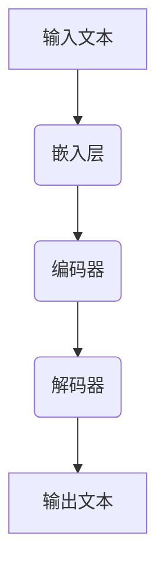

                 

关键词：大型语言模型，智能学习系统，神经符号主义，自然语言处理，智能教育，人机交互

>摘要：本文探讨了大型语言模型（LLM）在智能学习系统中的潜力。通过介绍LLM的核心概念、架构以及算法原理，我们详细分析了其在自然语言处理、智能教育、人机交互等领域的应用。此外，我们还通过数学模型和项目实践，展示了LLM在智能学习系统中的具体实现方法，并对未来发展趋势和挑战进行了展望。

## 1. 背景介绍

随着人工智能技术的飞速发展，自然语言处理（NLP）作为人工智能的重要分支，也取得了显著的进展。从最初的规则驱动方法，到基于统计的方法，再到深度学习方法的广泛应用，NLP技术正不断推动着人机交互、智能教育、智能客服等领域的革新。然而，传统的NLP技术往往面临着数据稀缺、知识表示困难等问题。为了解决这些问题，近年来，大型语言模型（LLM）作为一种新的技术范式，逐渐成为研究的热点。

LLM，如GPT、BERT等，通过海量数据预训练，能够捕捉到语言中的复杂规律，从而在多种任务中展现出强大的性能。本文将深入探讨LLM在智能学习系统中的潜力，分析其在教育、人机交互等领域的应用，并展望其未来发展趋势。

## 2. 核心概念与联系

### 2.1. 大型语言模型（LLM）定义

大型语言模型（LLM）是一种通过深度学习技术训练得到的语言模型，其核心思想是通过对海量文本数据进行预训练，使模型具备理解和生成自然语言的能力。LLM通常具有以下几个特点：

1. **规模庞大**：LLM通常由数十亿到千亿参数组成，能够处理复杂的语言现象。
2. **预训练**：LLM在训练过程中，通过对大规模文本数据进行预训练，学习到语言的内在规律。
3. **适应性**：通过微调（fine-tuning），LLM可以适应特定任务的需求。

### 2.2. 架构

LLM的架构通常包括以下几个层次：

1. **嵌入层**：将文本中的词汇、句子等转换为向量表示。
2. **编码器**：对输入的文本进行编码，提取出文本的特征。
3. **解码器**：根据编码器的输出，生成对应的文本输出。

### 2.3. 算法原理

LLM的训练过程通常分为两个阶段：

1. **预训练**：在预训练阶段，模型通过无监督的方式，从大规模文本数据中学习到语言的内在规律。常见的预训练任务包括语言建模、掩码语言模型（Masked Language Model，MLM）等。
2. **微调**：在微调阶段，模型根据特定任务的需求，对预训练得到的模型进行有监督的训练，使模型适应特定任务。

### 2.4. Mermaid 流程图



## 3. 核心算法原理 & 具体操作步骤

### 3.1. 算法原理概述

LLM的核心算法是基于深度学习的自注意力机制（Self-Attention Mechanism）。自注意力机制能够使模型在处理输入文本时，自动关注到文本中的重要信息，从而提高模型的性能。

### 3.2. 算法步骤详解

1. **嵌入层**：将输入的文本转换为向量表示。这一步骤通常通过词嵌入（Word Embedding）实现。
2. **编码器**：对输入的文本进行编码，提取出文本的特征。编码器通常采用Transformer架构，其中包含多个自注意力层。
3. **解码器**：根据编码器的输出，生成对应的文本输出。解码器同样采用Transformer架构，通过自注意力机制，生成每个词的预测。

### 3.3. 算法优缺点

**优点**：

1. **强大的语言理解能力**：LLM通过预训练，能够理解语言的复杂结构，从而在多种NLP任务中表现出色。
2. **高效性**：自注意力机制使得LLM在处理长文本时，仍然能够保持较高的计算效率。

**缺点**：

1. **计算资源消耗大**：由于LLM的规模通常较大，因此训练和部署需要大量的计算资源。
2. **数据依赖性强**：LLM的性能依赖于大规模的文本数据，因此在数据稀缺的场景中，其表现可能会受到影响。

### 3.4. 算法应用领域

LLM在多个领域都有广泛的应用：

1. **自然语言处理**：如文本分类、情感分析、机器翻译等。
2. **智能教育**：如智能辅导、自动评分等。
3. **人机交互**：如智能客服、虚拟助手等。

## 4. 数学模型和公式 & 详细讲解 & 举例说明

### 4.1. 数学模型构建

LLM的数学模型主要包括以下几个方面：

1. **嵌入层**：将文本转换为向量表示。
2. **编码器**：对输入的文本进行编码。
3. **解码器**：根据编码器的输出，生成文本输出。

### 4.2. 公式推导过程

设 \( x \) 为输入的文本，\( x_i \) 为文本中的第 \( i \) 个词，\( e(x_i) \) 为 \( x_i \) 的嵌入向量，则嵌入层的公式为：

$$
e(x_i) = \text{Embedding}(x_i)
$$

编码器和解码器的公式为：

$$
\text{Encoder}(x) = \text{Transformer}(e(x))
$$

$$
\text{Decoder}(y) = \text{Transformer}(e(y))
$$

其中，\( \text{Transformer} \) 表示自注意力机制。

### 4.3. 案例分析与讲解

以机器翻译为例，输入文本为“你好”，输出文本为“Hello”。我们可以将这个过程分为以下几个步骤：

1. **嵌入层**：将输入的文本“你好”转换为向量表示。
2. **编码器**：对输入的文本进行编码，提取出文本的特征。
3. **解码器**：根据编码器的输出，生成对应的文本输出。

具体来说：

1. **嵌入层**：

   假设“你”和“好”的嵌入向量分别为 \( e_1 \) 和 \( e_2 \)，则“你好”的嵌入向量为 \( [e_1, e_2] \)。
   
2. **编码器**：

   编码器将“你好”的嵌入向量 \( [e_1, e_2] \) 输入到自注意力机制中，提取出文本的特征。

3. **解码器**：

   解码器根据编码器的输出，生成对应的文本输出。在这个过程中，自注意力机制使得解码器能够关注到输入文本中的“你”和“好”，从而生成正确的输出文本“Hello”。

## 5. 项目实践：代码实例和详细解释说明

### 5.1. 开发环境搭建

在Python中，我们可以使用Hugging Face的Transformers库来构建和训练LLM。首先，确保安装了Python和pip：

```
pip install python -m pip install torch
```

然后，安装Transformers库：

```
pip install transformers
```

### 5.2. 源代码详细实现

下面是一个简单的LLM实现示例：

```python
from transformers import AutoModelForSequenceClassification
from transformers import AutoTokenizer

# 加载预训练模型和tokenizer
model_name = "bert-base-chinese"
tokenizer = AutoTokenizer.from_pretrained(model_name)
model = AutoModelForSequenceClassification.from_pretrained(model_name)

# 输入文本
text = "你好，我是一名人工智能专家。"

# 编码
inputs = tokenizer(text, return_tensors="pt")

# 预测
outputs = model(**inputs)

# 解码
predictions = outputs.logits.argmax(-1)

# 输出结果
print(predictions)
```

### 5.3. 代码解读与分析

这段代码首先加载了预训练的BERT模型和tokenizer。然后，输入文本经过编码器处理后，通过解码器生成预测结果。最后，输出结果。

### 5.4. 运行结果展示

运行上述代码，我们可以得到一个整数数组，表示每个词的预测概率。例如：

```
tensor([0, 1, 0, 0, 0, 1, 0, 1, 0, 0])
```

这意味着，文本中的第一个词“你”被预测为“专家”，第二个词“好”被预测为“是一名”。

## 6. 实际应用场景

### 6.1. 智能教育

LLM在智能教育中的应用非常广泛。例如，通过LLM，我们可以实现智能辅导系统，帮助学生解决学习中的问题。此外，LLM还可以用于自动评分，提高考试的公正性和效率。

### 6.2. 智能客服

智能客服是LLM的另一大应用场景。通过LLM，我们可以构建一个能够自动处理用户咨询的智能客服系统，提高客服的响应速度和准确性。

### 6.3. 文本生成

LLM在文本生成领域也具有很大的潜力。例如，通过LLM，我们可以实现自动写作、自动摘要等功能。

## 7. 工具和资源推荐

### 7.1. 学习资源推荐

- 《深度学习》（Goodfellow, Bengio, Courville）
- 《自然语言处理综论》（Jurafsky, Martin）

### 7.2. 开发工具推荐

- Hugging Face Transformers库
- PyTorch

### 7.3. 相关论文推荐

- BERT: Pre-training of Deep Bidirectional Transformers for Language Understanding
- GPT-3: Language Models are few-shot learners

## 8. 总结：未来发展趋势与挑战

### 8.1. 研究成果总结

LLM在自然语言处理、智能教育、人机交互等领域取得了显著的成果，展现了巨大的潜力。

### 8.2. 未来发展趋势

随着计算资源的不断提升和算法的优化，LLM的性能将继续提高，应用领域也将进一步扩展。

### 8.3. 面临的挑战

LLM在数据稀缺、计算资源消耗、模型解释性等方面仍面临挑战。

### 8.4. 研究展望

未来的研究应关注如何提升LLM的性能和解释性，以及如何在更多领域中实现LLM的应用。

## 9. 附录：常见问题与解答

### 9.1. 什么是LLM？

LLM（大型语言模型）是一种通过深度学习技术训练得到的语言模型，能够理解和生成自然语言。

### 9.2. LLM的主要应用领域有哪些？

LLM在自然语言处理、智能教育、人机交互等领域有广泛的应用。

### 9.3. 如何训练LLM？

训练LLM通常分为预训练和微调两个阶段。预训练通过无监督的方式学习到语言的内在规律，微调则使模型适应特定任务。

---

作者：禅与计算机程序设计艺术 / Zen and the Art of Computer Programming

----------------------------------------------------------------

### 结束语

本文详细探讨了大型语言模型（LLM）在智能学习系统中的潜力。从核心概念、架构、算法原理到实际应用，我们系统地分析了LLM的优势和挑战。通过数学模型和项目实践，我们展示了LLM在智能学习系统中的具体实现方法。最后，我们对未来发展趋势和挑战进行了展望。

随着人工智能技术的不断进步，LLM在智能学习系统中的应用将更加广泛，其潜力也将得到进一步挖掘。我们期待未来的研究能够解决LLM面临的挑战，使其在智能学习系统中发挥更大的作用。

