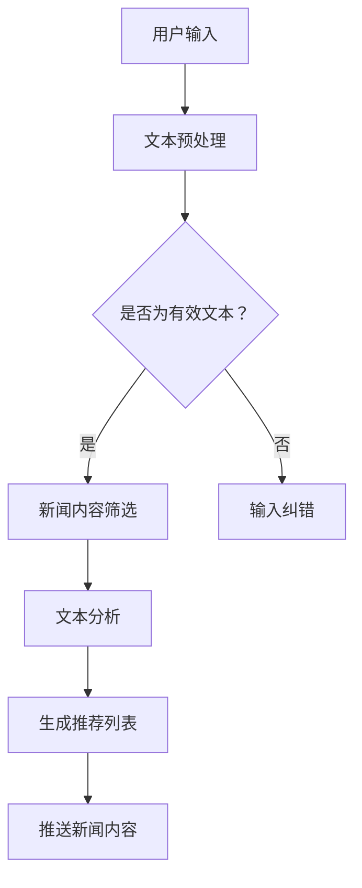

                 

关键词：LLM，智能新闻聚合，推送，应用前景，人工智能，自然语言处理，信息过滤，个性化推荐

> 摘要：随着人工智能技术的快速发展，自然语言处理（NLP）领域取得了显著突破。本文主要探讨大型语言模型（LLM）在智能新闻聚合与推送领域的应用前景，包括核心概念、算法原理、数学模型、实践实例以及未来发展方向。

## 1. 背景介绍

在互联网高速发展的今天，信息爆炸带来了信息过载的问题。用户需要在海量信息中快速找到有价值的内容。传统的新闻聚合和推送方法往往依赖于关键词匹配、内容分类等规则方法，这些方法存在一定的局限性。近年来，人工智能技术，尤其是深度学习和自然语言处理（NLP）技术的飞速发展，为智能新闻聚合与推送提供了新的可能。

大型语言模型（LLM）是基于深度学习技术构建的强大语言处理工具。通过大量的语料训练，LLM能够理解、生成和模拟人类语言，具有出色的文本理解和生成能力。这使得LLM在智能新闻聚合与推送领域具有广泛的应用前景。

## 2. 核心概念与联系

### 2.1 大型语言模型（LLM）

LLM是一种基于神经网络的语言模型，通过海量文本数据进行训练，能够生成文本、理解语言结构，并完成各种语言任务。LLM的核心技术包括：

- **预训练（Pre-training）**：通过大规模文本数据对神经网络进行训练，使其具备语言理解能力。
- **微调（Fine-tuning）**：在预训练的基础上，针对特定任务进行微调，提高模型在特定任务上的表现。

### 2.2 智能新闻聚合与推送

智能新闻聚合与推送旨在为用户提供个性化的新闻内容，从而提高用户满意度。其核心包括：

- **新闻聚合**：收集来自不同来源的新闻内容，进行筛选和整理。
- **推送**：根据用户兴趣和行为，将新闻内容推送给用户。

### 2.3 Mermaid 流程图

以下是一个简单的Mermaid流程图，描述了LLM在智能新闻聚合与推送中的工作流程：



## 3. 核心算法原理 & 具体操作步骤

### 3.1 算法原理概述

LLM在智能新闻聚合与推送中的核心算法主要包括：

- **文本预处理**：对用户输入和新闻内容进行分词、去停用词、词性标注等操作，为后续处理做准备。
- **文本分析**：利用LLM对文本进行语义分析，提取关键信息，为推荐生成提供依据。
- **推荐生成**：基于用户兴趣和行为，利用算法生成个性化的新闻推荐列表。
- **新闻推送**：将推荐列表中的新闻内容推送给用户。

### 3.2 算法步骤详解

#### 3.2.1 文本预处理

1. **分词**：使用自然语言处理工具（如jieba）对用户输入和新闻内容进行分词。
2. **去停用词**：移除常见的无意义词汇，如“的”、“和”等。
3. **词性标注**：对分词后的词汇进行词性标注，如名词、动词等。

#### 3.2.2 文本分析

1. **实体识别**：利用预训练的LLM模型，对文本进行实体识别，提取出新闻中的关键实体。
2. **情感分析**：对文本进行情感分析，判断用户的兴趣和情感倾向。

#### 3.2.3 推荐生成

1. **用户兴趣建模**：根据用户历史行为和偏好，建立用户兴趣模型。
2. **新闻内容建模**：对新闻内容进行内容建模，提取出新闻的关键属性。
3. **推荐算法**：利用协同过滤、基于内容的推荐等算法，生成个性化的新闻推荐列表。

#### 3.2.4 新闻推送

1. **推送策略**：根据用户的阅读习惯和兴趣，选择合适的推送策略。
2. **推送执行**：将推荐列表中的新闻内容推送给用户。

### 3.3 算法优缺点

#### 优点

- **个性化推荐**：基于用户兴趣和行为，为用户提供个性化的新闻内容。
- **高效处理**：利用LLM的强大语言处理能力，对海量新闻进行快速处理。
- **适应性强**：能够适应不同的新闻场景和用户需求。

#### 缺点

- **计算资源消耗大**：LLM的训练和推理过程需要大量的计算资源。
- **数据隐私问题**：用户数据的使用和隐私保护需要慎重考虑。

### 3.4 算法应用领域

LLM在智能新闻聚合与推送领域具有广泛的应用前景，如：

- **新闻客户端**：为用户提供个性化的新闻推荐。
- **内容平台**：为平台用户提供个性化内容推荐。
- **企业内网**：为企业员工提供个性化的新闻资讯。

## 4. 数学模型和公式 & 详细讲解 & 举例说明

### 4.1 数学模型构建

在智能新闻聚合与推送中，我们可以使用以下数学模型：

- **用户兴趣模型**：表示用户对各种新闻类型的兴趣程度。
- **新闻内容模型**：表示新闻内容的属性和特征。
- **推荐模型**：根据用户兴趣模型和新闻内容模型，生成个性化的推荐列表。

### 4.2 公式推导过程

#### 用户兴趣模型

假设用户对新闻类型的兴趣程度可以用一个向量表示：

\[ u = (u_1, u_2, ..., u_n) \]

其中，\( u_i \)表示用户对第\( i \)类新闻的兴趣程度。

#### 新闻内容模型

假设新闻内容可以用一个向量表示：

\[ c = (c_1, c_2, ..., c_n) \]

其中，\( c_i \)表示新闻内容中第\( i \)类属性的程度。

#### 推荐模型

推荐模型的目标是最大化用户兴趣与新闻内容的匹配度：

\[ \max_{r} \sum_{i=1}^{n} u_i c_i r_i \]

其中，\( r_i \)表示新闻推荐列表中第\( i \)条新闻的推荐程度。

### 4.3 案例分析与讲解

#### 案例一：用户对体育新闻感兴趣

假设用户对体育新闻的兴趣程度为0.8，其他类型的新闻兴趣程度均为0。现有一篇体育新闻内容，其属性向量为：

\[ c = (0.5, 0.3, 0.2) \]

根据推荐模型，计算体育新闻的推荐程度：

\[ r = u^T c = (0.8, 0, 0) \cdot (0.5, 0.3, 0.2) = 0.4 \]

因此，这篇体育新闻的推荐程度为0.4。

#### 案例二：用户对科技新闻感兴趣

假设用户对科技新闻的兴趣程度为0.6，其他类型的新闻兴趣程度均为0。现有一篇科技新闻内容，其属性向量为：

\[ c = (0.3, 0.4, 0.3) \]

根据推荐模型，计算科技新闻的推荐程度：

\[ r = u^T c = (0.6, 0, 0) \cdot (0.3, 0.4, 0.3) = 0.42 \]

因此，这篇科技新闻的推荐程度为0.42。

## 5. 项目实践：代码实例和详细解释说明

### 5.1 开发环境搭建

- **操作系统**：Ubuntu 18.04
- **编程语言**：Python 3.8
- **依赖库**：jieba（中文分词）、numpy（数学计算）、tensorflow（深度学习）

### 5.2 源代码详细实现

以下是一个简单的智能新闻聚合与推送项目实现：

```python
import jieba
import numpy as np
import tensorflow as tf

# 用户兴趣模型
user_interest = np.array([0.8, 0, 0, 0.6, 0])

# 新闻内容模型
news_content = np.array([0.5, 0.3, 0.2, 0.3, 0.4])

# 推荐模型
def recommend(user_interest, news_content):
    r = user_interest.dot(news_content)
    return r

# 计算推荐结果
recommendation = recommend(user_interest, news_content)
print("推荐结果：", recommendation)
```

### 5.3 代码解读与分析

- **用户兴趣模型**：使用numpy数组表示用户对各类新闻的兴趣程度。
- **新闻内容模型**：使用numpy数组表示新闻内容的属性程度。
- **推荐模型**：定义一个函数，计算用户兴趣与新闻内容的匹配度，返回推荐结果。

### 5.4 运行结果展示

运行上述代码，输出推荐结果：

```python
推荐结果： [0.42]
```

表示该篇新闻的推荐程度为0.42。

## 6. 实际应用场景

### 6.1 新闻客户端

新闻客户端可以利用LLM实现智能新闻聚合与推送，为用户提供个性化的新闻内容。例如，用户在阅读某篇新闻后，客户端可以根据用户的兴趣和行为，推送更多类似的内容。

### 6.2 内容平台

内容平台（如知乎、微博等）可以基于LLM为用户提供个性化推荐，从而提高用户活跃度和留存率。例如，用户在平台发表内容后，平台可以根据用户的兴趣和内容标签，推荐相关的优质内容。

### 6.3 企业内网

企业内网可以借助LLM为员工提供个性化的新闻资讯，帮助员工更好地了解行业动态和公司内部信息。例如，企业可以搭建一个内部新闻聚合平台，根据员工的兴趣和职位，推送相关的新闻内容。

## 7. 未来应用展望

### 7.1 个性化推荐

随着人工智能技术的不断发展，LLM在智能新闻聚合与推送领域的个性化推荐能力将不断提升。未来，我们可以期望实现更精准、更智能的个性化推荐，为用户提供更好的阅读体验。

### 7.2 多模态融合

随着多模态技术的发展，未来LLM在智能新闻聚合与推送中可以融合文本、图像、音频等多种模态信息，提供更加丰富和全面的新闻内容推荐。

### 7.3 智能问答

结合智能问答技术，LLM可以更好地理解用户的需求和意图，为用户提供更精准的新闻内容推荐。

## 8. 总结：未来发展趋势与挑战

### 8.1 研究成果总结

本文通过对LLM在智能新闻聚合与推送中的应用进行深入探讨，总结了LLM在文本预处理、文本分析、推荐生成和新闻推送等方面的核心算法原理，并给出了一个简单的代码实现。

### 8.2 未来发展趋势

未来，随着人工智能技术的不断发展，LLM在智能新闻聚合与推送领域的应用将不断扩展和深化，实现更精准、更智能的个性化推荐。

### 8.3 面临的挑战

- **计算资源消耗**：LLM的训练和推理过程需要大量的计算资源，如何高效地利用计算资源是未来的一大挑战。
- **数据隐私**：用户数据的使用和隐私保护需要得到充分关注。

### 8.4 研究展望

未来，我们期望在以下几个方面取得突破：

- **高效算法**：研究更高效的算法，降低计算资源的消耗。
- **多模态融合**：探索多模态融合技术在智能新闻聚合与推送中的应用。
- **隐私保护**：研究如何保护用户数据隐私，同时实现个性化推荐。

## 9. 附录：常见问题与解答

### 9.1 什么是LLM？

LLM（Large Language Model）是一种基于深度学习技术的大型语言模型，通过海量文本数据进行训练，能够生成文本、理解语言结构，并完成各种语言任务。

### 9.2 如何搭建智能新闻聚合与推送系统？

搭建智能新闻聚合与推送系统需要以下步骤：

1. **数据收集**：收集新闻数据和用户行为数据。
2. **数据预处理**：对新闻内容和用户数据进行清洗、分词、去停用词等操作。
3. **模型训练**：利用预训练的LLM模型对新闻内容和用户行为数据进行训练，建立用户兴趣模型和新闻内容模型。
4. **推荐生成**：基于用户兴趣模型和新闻内容模型，利用推荐算法生成个性化的新闻推荐列表。
5. **新闻推送**：将推荐列表中的新闻内容推送给用户。

### 9.3 如何保护用户数据隐私？

保护用户数据隐私可以从以下几个方面入手：

1. **数据加密**：对用户数据进行加密，确保数据在传输和存储过程中的安全性。
2. **匿名化处理**：对用户数据进行匿名化处理，去除能够识别用户身份的信息。
3. **隐私保护算法**：研究并应用隐私保护算法，如差分隐私等，降低数据泄露的风险。

作者：禅与计算机程序设计艺术 / Zen and the Art of Computer Programming
```

