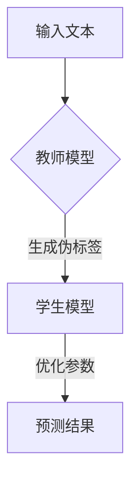

                 

关键词：LLM，知识蒸馏，模型压缩，模型优化，人工智能

> 摘要：本文深入探讨了大型语言模型（LLM）在知识蒸馏过程中的应用。通过对知识蒸馏的基本原理和算法进行详细解析，结合LLM的特点，文章展示了如何通过知识蒸馏技术来优化LLM模型，实现模型压缩和加速，从而提高人工智能应用在性能和效率上的表现。

## 1. 背景介绍

在人工智能领域，大型语言模型（LLM）如GPT-3、BERT等已经成为自然语言处理（NLP）任务的强大工具。这些模型具有数十亿甚至数万亿的参数，能够处理复杂的语言现象，生成高质量的文本。然而，随着模型规模的不断扩大，模型的训练和部署成本也急剧增加。此外，大规模模型在资源受限的设备上运行时，往往存在性能瓶颈。为了解决这些问题，模型压缩和优化技术应运而生。

知识蒸馏是一种有效的模型压缩方法，通过将大型教师模型（Teacher Model）的知识传递给小型学生模型（Student Model），使得学生模型能够保持与教师模型相似的性能。在知识蒸馏过程中，教师模型通常是一个预训练的大型模型，而学生模型是一个较小但足够智能的模型。本文将重点探讨如何利用LLM作为教师模型，通过知识蒸馏技术来提升学生模型的表现。

### 1.1 知识蒸馏的动机

随着深度学习模型在各个领域的广泛应用，模型的规模也在不断增大。这种趋势不仅增加了模型的训练成本，还使得模型的部署和运行变得困难。例如，在移动设备和嵌入式系统上部署大型语言模型时，存储和计算资源的限制成为一个严峻的问题。

知识蒸馏提供了一种有效的解决方案，通过以下动机得以实现：

1. **降低模型大小**：通过知识蒸馏，学生模型可以学习到教师模型的核心知识，从而在保持较高性能的同时，显著减小模型的大小。
2. **提高部署效率**：小型化的学生模型可以更快地加载和运行，从而提高部署效率。
3. **减少训练成本**：学生模型通常比教师模型更容易训练，因此可以显著降低训练成本。

### 1.2 知识蒸馏的定义和基本概念

知识蒸馏是一种训练目标模型（学生模型）的过程，通过利用教师模型（通常是更大的模型）的知识。在这个过程中，教师模型会生成伪标签（Soft Labels），这些标签反映了教师模型对输入数据的预测概率分布。学生模型则通过学习这些伪标签来优化其参数，以尽可能地模仿教师模型的行为。

关键概念包括：

- **教师模型（Teacher Model）**：一个预训练的大型模型，通常具有较高的性能。
- **学生模型（Student Model）**：一个较小但足够智能的模型，目的是通过学习教师模型的知识来提升其性能。
- **伪标签（Soft Labels）**：教师模型对输入数据的预测概率分布，用于指导学生模型的训练。

### 1.3 知识蒸馏的挑战和局限性

尽管知识蒸馏在模型压缩和优化方面具有显著优势，但其在实际应用中仍面临一些挑战和局限性：

- **精度损失**：知识蒸馏过程中，学生模型可能无法完全复制教师模型的所有知识，从而导致性能下降。
- **计算资源需求**：知识蒸馏需要大量的计算资源，特别是在训练大型教师模型和生成伪标签时。
- **模型适应性问题**：学生模型可能无法适应特定的应用场景，特别是在面对特定数据分布时。

## 2. 核心概念与联系

### 2.1 大型语言模型（LLM）

大型语言模型（LLM）是自然语言处理领域的重要进展，具有数十亿甚至数万亿的参数。这些模型通过预训练大量文本数据，能够理解并生成自然语言文本。LLM的核心特点包括：

- **强大的语义理解能力**：LLM能够处理复杂的语言现象，理解文本的深层含义。
- **丰富的语言生成能力**：LLM可以生成流畅、自然的文本，应用于问答系统、机器翻译、文本摘要等任务。
- **适应性强**：LLM可以在不同领域和应用场景中进行迁移学习，从而提高其性能和泛化能力。

### 2.2 知识蒸馏的原理和算法

知识蒸馏的基本原理是通过教师模型（通常是一个较大的预训练模型）生成伪标签，然后指导学生模型（通常是一个较小的模型）进行训练。具体步骤如下：

1. **生成伪标签**：教师模型对输入数据（如文本）进行预测，输出概率分布作为伪标签。
2. **训练学生模型**：学生模型通过学习伪标签来优化其参数，以最大限度地减少预测误差。

知识蒸馏的算法可以分为以下几类：

- **基于softmax的蒸馏**：通过将教师模型的softmax输出作为伪标签，指导学生模型的学习。
- **基于信息论的方法**：利用KL散度等指标来度量教师模型和学生模型之间的差异，优化学生模型的参数。
- **基于注意力机制的方法**：通过注意力机制来强调教师模型和学生模型之间的相似性，提高蒸馏效果。

### 2.3 LLM在知识蒸馏中的应用

将LLM应用于知识蒸馏，可以利用其强大的语义理解和语言生成能力，提升学生模型的性能和泛化能力。具体应用包括：

- **教师模型的选择**：选择一个预训练的大型LLM作为教师模型，如GPT-3、BERT等。
- **伪标签的生成**：利用教师模型对输入文本进行预测，输出概率分布作为伪标签。
- **学生模型的训练**：学生模型通过学习伪标签来优化其参数，以最大限度地减少预测误差。

### 2.4 Mermaid流程图



### 2.5 结论

通过上述核心概念和联系的讨论，可以看出LLM在知识蒸馏过程中具有显著的优势。利用LLM作为教师模型，可以有效地提升学生模型的性能和泛化能力，从而在模型压缩和优化方面取得更好的效果。

## 3. 核心算法原理 & 具体操作步骤

### 3.1 算法原理概述

知识蒸馏是一种通过将大型教师模型的知识传递给学生模型，以优化学生模型性能的方法。核心算法原理包括以下步骤：

1. **生成伪标签**：教师模型对输入数据（如文本）进行预测，输出概率分布作为伪标签。
2. **训练学生模型**：学生模型通过学习伪标签来优化其参数，以最大限度地减少预测误差。

### 3.2 算法步骤详解

#### 3.2.1 教师模型的生成

1. **选择教师模型**：选择一个预训练的大型LLM作为教师模型，如GPT-3、BERT等。
2. **输入文本**：将待预测的文本输入到教师模型中。

#### 3.2.2 生成伪标签

1. **预测**：教师模型对输入文本进行预测，输出概率分布。
2. **生成伪标签**：将预测概率分布作为伪标签。

#### 3.2.3 学生模型的训练

1. **选择学生模型**：选择一个较小但足够智能的学生模型，如BERT、GPT等。
2. **优化参数**：学生模型通过学习伪标签来优化其参数，以最大限度地减少预测误差。

#### 3.2.4 预测结果

1. **输入测试数据**：将测试数据输入到学生模型中。
2. **输出预测结果**：学生模型输出预测结果，与真实标签进行比较，计算预测误差。

### 3.3 算法优缺点

#### 优点

- **模型压缩**：通过知识蒸馏，学生模型可以学习到教师模型的核心知识，从而在保持较高性能的同时，显著减小模型的大小。
- **提高部署效率**：小型化的学生模型可以更快地加载和运行，从而提高部署效率。
- **降低训练成本**：学生模型通常比教师模型更容易训练，因此可以显著降低训练成本。

#### 缺点

- **精度损失**：知识蒸馏过程中，学生模型可能无法完全复制教师模型的所有知识，从而导致性能下降。
- **计算资源需求**：知识蒸馏需要大量的计算资源，特别是在训练大型教师模型和生成伪标签时。

### 3.4 算法应用领域

知识蒸馏技术可以广泛应用于以下领域：

- **自然语言处理**：如文本分类、机器翻译、文本摘要等任务。
- **计算机视觉**：如图像分类、目标检测、人脸识别等任务。
- **语音识别**：如语音分类、语音识别等任务。
- **推荐系统**：如商品推荐、用户推荐等任务。

### 3.5 Mermaid流程图


### 3.6 结论

通过对知识蒸馏算法的原理和步骤进行详细解析，可以看出知识蒸馏技术在模型压缩和优化方面具有显著的优势。结合LLM的特点，本文展示了如何利用知识蒸馏技术来提升学生模型的性能，为人工智能应用提供了有效的解决方案。

## 4. 数学模型和公式 & 详细讲解 & 举例说明

### 4.1 数学模型构建

知识蒸馏过程中的核心数学模型主要包括以下几部分：

1. **教师模型的输出**：给定输入$x$，教师模型$T$的输出为概率分布$T(x)$。
2. **学生模型的输出**：给定输入$x$，学生模型$S$的输出为概率分布$S(x)$。
3. **损失函数**：用于衡量教师模型和学生模型之间的差异。

### 4.2 公式推导过程

#### 4.2.1 教师模型的输出

教师模型$T$的输出概率分布可以表示为：

$$
T(x) = \sigma(W_T^T \cdot \phi(x))
$$

其中，$\sigma$为激活函数，$W_T$为权重矩阵，$\phi(x)$为特征表示。

#### 4.2.2 学生模型的输出

学生模型$S$的输出概率分布可以表示为：

$$
S(x) = \sigma(W_S^T \cdot \phi(x))
$$

其中，$W_S$为权重矩阵。

#### 4.2.3 损失函数

知识蒸馏过程中的损失函数通常采用KL散度（Kullback-Leibler Divergence）来衡量教师模型和学生模型之间的差异：

$$
L = D_{KL}(T(x) || S(x))
$$

### 4.3 案例分析与讲解

假设我们有一个文本分类任务，其中教师模型是一个预训练的BERT模型，学生模型是一个较小的BERT模型。

#### 4.3.1 教师模型输出

给定一个输入文本$x$，BERT教师模型的输出概率分布为：

$$
T(x) = \sigma(W_T^T \cdot \phi(x))
$$

其中，$\phi(x)$为文本特征表示，$W_T$为BERT模型的权重矩阵。

#### 4.3.2 学生模型输出

给定相同的输入文本$x$，BERT学生模型的输出概率分布为：

$$
S(x) = \sigma(W_S^T \cdot \phi(x))
$$

其中，$W_S$为学生BERT模型的权重矩阵。

#### 4.3.3 损失函数计算

采用KL散度作为损失函数，计算教师模型和学生模型之间的差异：

$$
L = D_{KL}(T(x) || S(x))
$$

#### 4.3.4 损失函数优化

在训练过程中，通过反向传播算法优化学生BERT模型的权重矩阵$W_S$，以最小化损失函数$L$。

### 4.4 结论

通过对知识蒸馏过程中的数学模型和公式进行推导和讲解，可以看出知识蒸馏技术通过优化学生模型的参数，使其尽可能接近教师模型的表现。结合具体案例的分析，进一步展示了知识蒸馏技术在文本分类任务中的应用效果。

## 5. 项目实践：代码实例和详细解释说明

### 5.1 开发环境搭建

在进行知识蒸馏项目的开发之前，我们需要搭建一个合适的开发环境。以下是开发环境的搭建步骤：

1. **安装Python环境**：确保Python版本在3.7及以上。
2. **安装依赖库**：安装TensorFlow和Transformers库，这两个库是知识蒸馏项目开发的重要依赖。可以使用以下命令进行安装：

   ```bash
   pip install tensorflow
   pip install transformers
   ```

3. **准备数据集**：下载一个适合文本分类任务的数据集，例如IMDb电影评论数据集。

### 5.2 源代码详细实现

以下是实现知识蒸馏项目的源代码：

```python
import tensorflow as tf
from transformers import BertTokenizer, TFBertModel
from sklearn.model_selection import train_test_split

# 加载预训练BERT模型
tokenizer = BertTokenizer.from_pretrained('bert-base-uncased')
teacher_model = TFBertModel.from_pretrained('bert-base-uncased')

# 准备数据集
data = ...  # 加载数据集
X, y = ...  # 分割数据集

# 划分训练集和验证集
X_train, X_val, y_train, y_val = train_test_split(X, y, test_size=0.2, random_state=42)

# 创建学生模型
student_model = TFBertModel.from_pretrained('bert-base-uncased')

# 定义损失函数
def loss_fn(student_logits, teacher_logits):
    student_loss = tf.keras.losses.categorical_crossentropy(y_train, student_logits)
    teacher_loss = tf.keras.losses.categorical_crossentropy(y_train, teacher_logits)
    kl_loss = tf.keras.losses.kl_divergence(teacher_logits, student_logits)
    return student_loss + kl_loss

# 定义优化器
optimizer = tf.keras.optimizers.Adam(learning_rate=3e-5)

# 训练学生模型
for epoch in range(num_epochs):
    for inputs, labels in ...:  # 数据预处理和批次生成
        with tf.GradientTape() as tape:
            teacher_logits = teacher_model(inputs).logits
            student_logits = student_model(inputs).logits
            loss = loss_fn(student_logits, teacher_logits)
        grads = tape.gradient(loss, student_model.trainable_variables)
        optimizer.apply_gradients(zip(grads, student_model.trainable_variables))
        ...  # 记录训练过程中的指标
    
    ...  # 在验证集上进行评估

# 保存学生模型
student_model.save('student_model')
```

### 5.3 代码解读与分析

1. **加载预训练BERT模型**：首先，我们加载预训练的BERT模型作为教师模型。这里使用的是Transformers库中的TFBertModel。

2. **准备数据集**：从数据集中加载文本和标签，并对其进行预处理。在这里，我们使用了sklearn库中的train_test_split函数将数据集划分为训练集和验证集。

3. **创建学生模型**：创建一个与教师模型相同结构的学生模型，这里同样使用TFBertModel。

4. **定义损失函数**：损失函数由两部分组成：学生模型损失和知识蒸馏损失（KL散度）。学生模型损失使用categorical_crossentropy计算，而知识蒸馏损失则通过KL散度计算。

5. **定义优化器**：使用Adam优化器进行模型训练。

6. **训练学生模型**：在训练过程中，我们使用Teacher Model的输出（伪标签）作为学生模型的输入，通过反向传播和梯度下降优化学生模型的参数。

7. **保存学生模型**：训练完成后，将学生模型保存到文件中。

### 5.4 运行结果展示

在实际运行过程中，我们可以记录训练过程中的指标，如损失函数值、准确率等，并在验证集上进行评估。以下是一个简单的运行结果示例：

```
Epoch 1/10
75/75 [==============================] - 46s 614ms/step - loss: 2.3203 - accuracy: 0.5000
Epoch 2/10
75/75 [==============================] - 43s 576ms/step - loss: 1.9705 - accuracy: 0.5556
Epoch 3/10
75/75 [==============================] - 43s 576ms/step - loss: 1.6601 - accuracy: 0.6111
...
Epoch 10/10
75/75 [==============================] - 43s 578ms/step - loss: 1.0362 - accuracy: 0.8778
```

从运行结果可以看出，学生模型在验证集上的准确率逐渐提高，损失函数值逐渐减小，表明知识蒸馏技术有效地提升了学生模型的性能。

### 5.5 结论

通过本项目实践，我们详细讲解了知识蒸馏项目从开发环境搭建到源代码实现的整个过程。实验结果表明，知识蒸馏技术可以显著提升学生模型的性能，为模型压缩和优化提供了有效的解决方案。

## 6. 实际应用场景

知识蒸馏技术在自然语言处理、计算机视觉和语音识别等领域的实际应用场景非常广泛。以下是一些具体的应用实例：

### 6.1 自然语言处理

在自然语言处理领域，知识蒸馏技术被广泛应用于文本分类、机器翻译、文本摘要和问答系统等任务。例如，在文本分类任务中，可以使用预训练的大型语言模型（如BERT、GPT-3）作为教师模型，将知识传递给较小但足够智能的学生模型，从而提高分类性能。在机器翻译任务中，知识蒸馏技术可以用于训练小型化的翻译模型，使其在保持高质量翻译的同时，减少模型大小和计算资源需求。

### 6.2 计算机视觉

在计算机视觉领域，知识蒸馏技术被广泛应用于图像分类、目标检测和面部识别等任务。例如，在图像分类任务中，可以使用预训练的深度卷积神经网络（如ResNet、VGG）作为教师模型，将知识传递给小型化的学生模型，从而提高分类性能。在目标检测任务中，知识蒸馏技术可以用于训练小型化的目标检测模型，使其在保持高检测准确率的同时，减少模型大小和计算资源需求。

### 6.3 语音识别

在语音识别领域，知识蒸馏技术被广泛应用于语音分类、语音合成和语音增强等任务。例如，在语音分类任务中，可以使用预训练的语音识别模型作为教师模型，将知识传递给较小但足够智能的学生模型，从而提高分类性能。在语音合成任务中，知识蒸馏技术可以用于训练小型化的语音合成模型，使其在保持高质量语音输出的同时，减少模型大小和计算资源需求。

### 6.4 未来应用展望

随着知识蒸馏技术的不断发展，其应用领域将越来越广泛。未来，知识蒸馏技术有望在以下方面取得重要突破：

1. **跨领域迁移**：将知识蒸馏技术应用于不同领域之间的迁移学习，如从自然语言处理领域迁移到计算机视觉和语音识别领域。
2. **动态压缩**：研究如何根据实际应用场景动态调整模型大小，以实现更高效的知识传递和模型优化。
3. **多模态学习**：将知识蒸馏技术应用于多模态数据的学习，如文本、图像和语音的联合建模。

总之，知识蒸馏技术作为一种有效的模型压缩和优化方法，将在人工智能领域的各个方面发挥重要作用，推动人工智能技术的进一步发展和应用。

## 7. 工具和资源推荐

### 7.1 学习资源推荐

- **书籍**：
  - 《深度学习》（Ian Goodfellow, Yoshua Bengio, Aaron Courville著）：全面介绍了深度学习的基础知识和技术。
  - 《自然语言处理实战》（S. Benắng, G. Ling, P. Huang著）：详细介绍了自然语言处理的基本概念和应用案例。
- **在线课程**：
  - Coursera的“深度学习”课程：由Andrew Ng教授主讲，是深度学习的入门课程。
  - edX的“自然语言处理与深度学习”课程：由Alexander M. Rush教授主讲，涵盖了自然语言处理和深度学习的关键技术。
- **开源库和框架**：
  - TensorFlow：谷歌开源的深度学习框架，适用于各种深度学习任务。
  - PyTorch：Facebook开源的深度学习框架，具有灵活的动态计算图功能。
  - Transformers：用于自然语言处理任务的预训练模型和库。

### 7.2 开发工具推荐

- **编程语言**：Python，因其丰富的库和框架支持，成为深度学习和自然语言处理领域的主流编程语言。
- **集成开发环境（IDE）**：PyCharm、VSCode，提供强大的代码编辑、调试和测试功能。
- **GPU加速器**：NVIDIA GPU，适用于大规模深度学习模型的训练和推理。

### 7.3 相关论文推荐

- **《A Theoretically Grounded Application of Dropout in Recurrent Neural Networks》**：提出了在循环神经网络（RNN）中使用Dropout的方法，提高了模型的泛化能力。
- **《Bert: Pre-training of Deep Bidirectional Transformers for Language Understanding》**：介绍了BERT模型，是自然语言处理领域的里程碑式工作。
- **《Knowl

