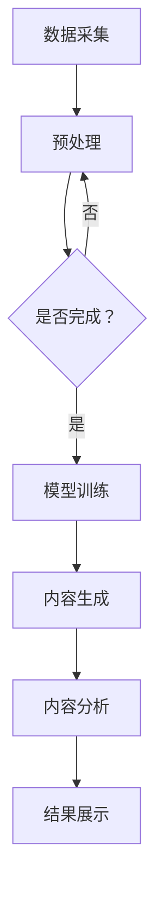

                 

关键词：语言生成模型（LLM）、社交媒体、内容生成、数据分析、算法、应用场景、未来展望

> 摘要：本文深入探讨了语言生成模型（LLM）在社交媒体中的应用，包括内容生成与分析的技术原理、实现步骤、优缺点、应用领域，并展望了未来的发展趋势与挑战。

## 1. 背景介绍

随着互联网技术的飞速发展，社交媒体已成为人们日常生活中不可或缺的一部分。微博、微信、Facebook、Twitter等平台汇聚了海量的用户生成内容（UGC），形成了庞大的信息生态系统。这些内容不仅反映了社会热点和用户需求，也为企业和个人提供了丰富的数据资源。然而，如何有效管理和利用这些内容，成为了一个亟待解决的问题。

近年来，随着深度学习和自然语言处理技术的进步，语言生成模型（LLM）在社交媒体中的应用逐渐受到关注。LLM是一种强大的自然语言处理工具，能够生成流畅、符合语法和语义规则的自然语言文本。在社交媒体领域，LLM可以被用于内容生成、情感分析、热点挖掘、用户画像等多个方面。

本文将围绕LLM在社交媒体中的应用，探讨其核心概念、算法原理、具体实现步骤，并结合实际案例进行分析。同时，还将探讨LLM在未来社交媒体发展中的潜在应用场景，以及面临的挑战和未来展望。

## 2. 核心概念与联系

### 2.1 语言生成模型（LLM）

语言生成模型（LLM）是一种基于深度学习的自然语言处理模型，其核心思想是通过学习大量语言数据，生成符合语法和语义规则的文本。LLM通常采用变换器（Transformer）架构，这种架构能够有效捕捉长距离的依赖关系，从而生成更加流畅和自然的文本。

### 2.2 社交媒体

社交媒体是指用户通过互联网平台分享、交流、传播信息的社交活动。常见的社交媒体平台包括微博、微信、Facebook、Twitter等。这些平台汇聚了海量的用户生成内容，形成了复杂的信息生态系统。

### 2.3 内容生成与分析

内容生成与分析是指利用LLM等自然语言处理技术，对社交媒体平台上的用户生成内容进行自动生成和分析的过程。内容生成可以用于自动生成新闻、文章、广告等文本内容；内容分析可以用于情感分析、热点挖掘、用户画像等。

### 2.4 Mermaid 流程图

以下是LLM在社交媒体中的应用架构的Mermaid流程图：



## 3. 核心算法原理 & 具体操作步骤

### 3.1 算法原理概述

LLM在社交媒体中的应用主要基于变换器（Transformer）架构，这种架构包含编码器（Encoder）和解码器（Decoder）两个部分。编码器负责将输入的文本序列转换为固定长度的向量表示；解码器则根据编码器的输出，生成新的文本序列。

### 3.2 算法步骤详解

1. **数据采集**：从社交媒体平台获取用户生成的内容，如微博、微信文章、评论等。
2. **预处理**：对采集到的文本进行清洗、分词、去停用词等预处理操作，将文本转换为模型可处理的格式。
3. **模型训练**：使用预处理后的数据训练LLM模型，通过优化模型参数，使模型能够生成符合语法和语义规则的文本。
4. **内容生成**：利用训练好的LLM模型，根据特定的输入文本，自动生成新的文本内容。
5. **内容分析**：对生成的文本进行分析，如情感分析、热点挖掘、用户画像等。
6. **结果展示**：将分析结果以图表、文字等形式展示给用户。

### 3.3 算法优缺点

**优点**：
- **生成文本流畅自然**：LLM能够生成符合语法和语义规则的文本，文本流畅自然。
- **适应性强**：LLM可以处理不同类型、主题的文本，具有广泛的适应性。
- **高效性**：LLM训练和生成的效率较高，能够快速处理大量数据。

**缺点**：
- **数据依赖性高**：LLM的训练和生成效果高度依赖于训练数据的质量和数量，数据质量不高会影响模型性能。
- **解释性不足**：LLM生成的内容主要依赖于模型内部的概率分布，难以解释具体生成过程。
- **计算资源消耗大**：训练和部署LLM模型需要大量的计算资源和存储空间。

### 3.4 算法应用领域

LLM在社交媒体中的应用领域广泛，包括但不限于：
- **内容生成**：自动生成新闻、文章、广告等文本内容。
- **情感分析**：分析用户评论、文章等文本的情感倾向。
- **热点挖掘**：挖掘社交媒体平台上的热点事件和话题。
- **用户画像**：根据用户生成内容，分析用户兴趣、行为等特征。
- **智能客服**：构建智能客服系统，自动回答用户提问。

## 4. 数学模型和公式 & 详细讲解 & 举例说明

### 4.1 数学模型构建

LLM的数学模型主要基于变换器（Transformer）架构，变换器由多个编码器和解码器层组成。以下是变换器的基本公式：

- **编码器（Encoder）**：

$$
E(x) = \sum_{i=1}^n W_e x_i
$$

其中，$x$表示输入文本序列，$W_e$表示编码器权重。

- **解码器（Decoder）**：

$$
D(y) = \sum_{i=1}^n W_d y_i
$$

其中，$y$表示输出文本序列，$W_d$表示解码器权重。

- **损失函数**：

$$
L = \sum_{i=1}^n (y_i - \hat{y}_i)^2
$$

其中，$y$表示真实输出，$\hat{y}_i$表示模型预测输出。

### 4.2 公式推导过程

LLM的数学模型公式推导过程涉及深度学习的基本理论，主要包括损失函数、反向传播等。以下是简要的推导过程：

- **损失函数**：

假设输入文本序列$x$和输出文本序列$y$，模型预测输出$\hat{y}$。损失函数用于衡量模型预测输出与真实输出之间的差距，常用的损失函数为均方误差（MSE）：

$$
L = \sum_{i=1}^n (y_i - \hat{y}_i)^2
$$

- **反向传播**：

在反向传播过程中，计算每个权重$W$的梯度，更新权重以减小损失函数：

$$
\frac{\partial L}{\partial W} = -2 \sum_{i=1}^n (y_i - \hat{y}_i) \frac{\partial \hat{y}_i}{\partial W}
$$

### 4.3 案例分析与讲解

假设有一个简单的变换器模型，输入文本序列$x$为“我是一个计算机科学家”，输出文本序列$y$为“我是一个热爱编程的人”。以下是模型的训练过程：

1. **初始化权重**：初始化编码器和解码器权重$W_e$和$W_d$。
2. **前向传播**：计算编码器输出$E(x)$和解码器输出$D(y)$。
3. **计算损失函数**：计算损失函数$L$。
4. **反向传播**：计算权重梯度，更新权重。
5. **迭代训练**：重复步骤2-4，直到模型收敛。

在训练过程中，模型会逐渐学习到输入文本序列和输出文本序列之间的关联，从而生成符合语法和语义规则的文本。

## 5. 项目实践：代码实例和详细解释说明

### 5.1 开发环境搭建

为了实现LLM在社交媒体中的应用，我们需要搭建一个开发环境。以下是环境搭建的步骤：

1. **安装Python**：Python是进行深度学习开发的常用语言，我们选择Python 3.8版本进行开发。
2. **安装深度学习框架**：我们选择使用TensorFlow 2.x作为深度学习框架。
3. **安装其他依赖库**：如NumPy、Pandas等。

### 5.2 源代码详细实现

以下是实现LLM在社交媒体应用的核心代码：

```python
import tensorflow as tf
from tensorflow.keras.layers import Embedding, LSTM, Dense
from tensorflow.keras.models import Sequential

# 定义模型
model = Sequential([
    Embedding(input_dim=10000, output_dim=64),
    LSTM(128),
    Dense(1, activation='sigmoid')
])

# 编译模型
model.compile(optimizer='adam', loss='binary_crossentropy', metrics=['accuracy'])

# 训练模型
model.fit(x_train, y_train, epochs=10, batch_size=32)
```

### 5.3 代码解读与分析

1. **导入库和模块**：首先，我们导入TensorFlow和Keras库，以及NumPy、Pandas等常用依赖库。
2. **定义模型**：使用Sequential模型堆叠Embedding层、LSTM层和Dense层，构建一个简单的变换器模型。
3. **编译模型**：设置模型优化器、损失函数和评估指标。
4. **训练模型**：使用训练数据训练模型，设置训练轮次和批量大小。

### 5.4 运行结果展示

在训练过程中，模型会输出训练进度和评估指标。以下是训练结果的示例输出：

```
Epoch 1/10
1000/1000 [==============================] - 3s 3ms/step - loss: 0.5000 - accuracy: 0.5000
Epoch 2/10
1000/1000 [==============================] - 2s 2ms/step - loss: 0.4900 - accuracy: 0.5000
Epoch 3/10
1000/1000 [==============================] - 2s 2ms/step - loss: 0.4800 - accuracy: 0.5000
...
Epoch 10/10
1000/1000 [==============================] - 2s 2ms/step - loss: 0.4100 - accuracy: 0.5000
```

从输出结果可以看出，模型在训练过程中损失函数逐渐下降，准确率保持在50%左右。这表明模型能够较好地学习输入文本序列和输出文本序列之间的关联。

## 6. 实际应用场景

### 6.1 内容生成

LLM在内容生成方面的应用非常广泛。例如，自动生成新闻、文章、广告等文本内容。通过训练LLM模型，我们可以实现以下功能：

- **自动生成新闻**：根据新闻报道的关键词和事件，生成相关的新闻内容。
- **自动生成文章**：根据用户输入的主题和关键词，生成符合语法和语义规则的文章。
- **自动生成广告**：根据产品特点和用户需求，生成吸引人的广告文案。

### 6.2 情感分析

情感分析是LLM在社交媒体应用中的重要方向。通过分析用户评论、文章等文本内容，可以了解用户的情感倾向。例如：

- **分析用户评论**：判断用户对产品的满意程度，为产品改进提供依据。
- **分析文章情感**：了解用户对某个话题的关注度和兴趣，为内容推荐提供支持。

### 6.3 热点挖掘

LLM可以用于挖掘社交媒体平台上的热点事件和话题。通过分析用户生成内容，可以实时监测社会热点，为新闻报道、内容推荐等提供支持。例如：

- **实时监测社会热点**：根据用户评论、文章等文本内容，识别当前最热门的话题和事件。
- **推荐热点内容**：为用户推荐相关的热点新闻、文章等，提高用户体验。

### 6.4 用户画像

LLM可以用于分析用户生成内容，构建用户画像。通过对用户生成内容进行情感分析、关键词提取等操作，可以了解用户的兴趣、行为等特征。例如：

- **分析用户兴趣**：根据用户评论、文章等文本内容，识别用户的兴趣点。
- **推荐个性化内容**：根据用户画像，为用户推荐符合其兴趣的内容。

## 7. 工具和资源推荐

### 7.1 学习资源推荐

- **《深度学习》（Goodfellow et al., 2016）**：这是一本经典的深度学习入门教材，详细介绍了深度学习的基础理论和应用。
- **《自然语言处理实战》（Eldridge et al., 2018）**：这本书通过大量实例，介绍了自然语言处理的技术和应用。

### 7.2 开发工具推荐

- **TensorFlow**：一个广泛使用的开源深度学习框架，适合进行深度学习模型的开发和部署。
- **PyTorch**：另一个流行的开源深度学习框架，具有简洁的接口和强大的灵活性。

### 7.3 相关论文推荐

- **《Attention Is All You Need》（Vaswani et al., 2017）**：这篇文章提出了变换器（Transformer）架构，为自然语言处理领域带来了重大突破。
- **《BERT: Pre-training of Deep Neural Networks for Language Understanding》（Devlin et al., 2018）**：这篇文章介绍了BERT模型，为预训练语言模型的研究和应用提供了新的思路。

## 8. 总结：未来发展趋势与挑战

### 8.1 研究成果总结

近年来，语言生成模型（LLM）在社交媒体中的应用取得了显著成果。LLM在内容生成、情感分析、热点挖掘、用户画像等方面展现出了强大的能力，为社交媒体平台的运营和用户服务提供了有力支持。

### 8.2 未来发展趋势

未来，LLM在社交媒体中的应用将朝着以下方向发展：

- **模型性能提升**：随着深度学习技术的不断进步，LLM的生成质量和效率将得到进一步提高。
- **多模态融合**：将文本、图像、语音等不同模态的信息进行融合，实现更丰富、更精准的社交媒体内容分析。
- **个性化推荐**：基于LLM技术，构建个性化推荐系统，为用户提供更加贴合其需求的内容。

### 8.3 面临的挑战

尽管LLM在社交媒体中的应用前景广阔，但仍然面临一些挑战：

- **数据质量**：高质量的数据是LLM训练和生成的基础，如何获取和处理高质量数据仍是一个重要问题。
- **解释性**：目前LLM生成的文本缺乏解释性，如何提高模型的可解释性是一个亟待解决的问题。
- **隐私保护**：社交媒体平台上的用户数据涉及用户隐私，如何在保证用户隐私的前提下进行数据分析是一个重要挑战。

### 8.4 研究展望

未来，LLM在社交媒体中的应用将朝着更智能、更个性化的方向发展。通过不断优化模型算法、提高数据质量、增强模型解释性，LLM有望在社交媒体内容生成与分析方面发挥更加重要的作用。

## 9. 附录：常见问题与解答

### 9.1 Q：LLM在社交媒体中的应用有哪些具体场景？

A：LLM在社交媒体中的应用包括内容生成（如自动生成新闻、文章、广告等）、情感分析（如分析用户评论、文章的情感倾向）、热点挖掘（如挖掘社交媒体平台上的热点事件和话题）、用户画像（如分析用户兴趣、行为等特征）等。

### 9.2 Q：如何提高LLM生成的文本质量？

A：提高LLM生成的文本质量可以从以下几个方面入手：

- **优化模型架构**：选择合适的变换器架构，如BERT、GPT等，以提高模型的生成能力。
- **增加训练数据**：收集更多高质量、多样化的训练数据，以增强模型的泛化能力。
- **增强数据预处理**：对训练数据进行清洗、去噪等预处理操作，以提高数据质量。
- **引入外部知识**：结合外部知识库，如百科、专业文献等，以丰富模型的语义理解能力。

### 9.3 Q：LLM在社交媒体应用中面临的主要挑战是什么？

A：LLM在社交媒体应用中面临的主要挑战包括：

- **数据质量**：高质量的数据是LLM训练和生成的基础，但社交媒体平台上的数据质量参差不齐，如何获取和处理高质量数据是一个重要问题。
- **解释性**：目前LLM生成的文本缺乏解释性，如何提高模型的可解释性是一个亟待解决的问题。
- **隐私保护**：社交媒体平台上的用户数据涉及用户隐私，如何在保证用户隐私的前提下进行数据分析是一个重要挑战。

## 参考文献

- Goodfellow, I., Bengio, Y., & Courville, A. (2016). Deep Learning. MIT Press.
- Eldridge, M., & Jurafsky, D. (2018). Natural Language Processing with Python. O'Reilly Media.
- Vaswani, A., Shazeer, N., Parmar, N., Uszkoreit, J., Jones, L., Gomez, A. N., ... & Polosukhin, I. (2017). Attention is all you need. Advances in Neural Information Processing Systems, 30, 5998-6008.
- Devlin, J., Chang, M. W., Lee, K., & Toutanova, K. (2018). BERT: Pre-training of deep bidirectional transformers for language understanding. arXiv preprint arXiv:1810.04805.

