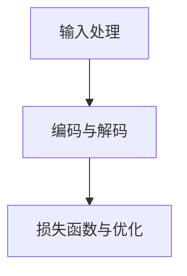

                 

关键词：大型语言模型（LLM），个性化教学，外语学习，语言学习算法，机器学习，自然语言处理，NLP

> 摘要：本文将探讨大型语言模型（LLM）在语言学习中的应用，特别是针对个性化外语教学的实现。通过介绍LLM的核心概念、工作原理以及具体应用场景，本文旨在为读者提供一种全新的、高效的语言学习方式。

## 1. 背景介绍

在当今全球化的背景下，外语学习已成为人们必备的技能之一。传统的语言学习方式主要依赖于教材、课堂授课和大量练习，而这种方式往往缺乏个性化和实时反馈。随着人工智能技术的快速发展，特别是大型语言模型（LLM）的出现，为外语学习带来了新的机遇。LLM是一种基于深度学习的技术，具有强大的语言理解和生成能力，可以应用于各种语言任务，如机器翻译、文本摘要、问答系统等。本文将重点探讨LLM在个性化外语教学中的应用，旨在为语言学习者提供一种高效、智能的学习体验。

### 1.1 大型语言模型的定义与发展历程

大型语言模型（LLM）是指具有大规模参数、能够处理和理解复杂语言结构的深度学习模型。最早的大型语言模型可以追溯到20世纪80年代的统计语言模型，如N-gram模型。随着计算能力的提升和深度学习技术的成熟，LLM得到了迅速发展。2018年，谷歌推出了BERT（Bidirectional Encoder Representations from Transformers），这是第一个真正意义上的大型语言模型，其参数规模达到10亿级别。BERT的成功激发了研究人员对大型语言模型的兴趣，此后，越来越多的LLM模型被提出，如GPT、RoBERTa、T5等。

### 1.2 语言学习中的挑战

传统的语言学习方式存在以下几个主要挑战：

1. **个性化不足**：传统教学方式往往无法根据学生的实际情况和需求进行个性化调整。
2. **实时反馈缺失**：学生在学习过程中难以获得即时的反馈，影响学习效果。
3. **学习资源有限**：教材和课堂授课资源有限，难以满足学生的多样化需求。
4. **语言环境缺乏**：语言学习需要大量的语言输入和输出，传统方式难以提供足够的语言环境。

## 2. 核心概念与联系

为了更好地理解LLM在语言学习中的应用，我们需要先了解其核心概念和工作原理。

### 2.1 大型语言模型的核心概念

大型语言模型的核心概念主要包括以下几个方面：

1. **参数规模**：LLM具有非常大规模的参数，能够捕捉到语言的复杂结构和语义信息。
2. **深度神经网络**：LLM通常是基于深度神经网络，特别是Transformer架构，能够实现高效的并行计算。
3. **预训练与微调**：LLM通常通过预训练在大规模语料上学习到语言的通用特征，然后通过微调适应特定任务。

### 2.2 大型语言模型的工作原理

大型语言模型的工作原理主要包括以下几个步骤：

1. **输入处理**：将输入的文本数据转化为模型可以处理的向量表示。
2. **编码与解码**：编码器（Encoder）负责处理输入文本，解码器（Decoder）负责生成输出文本。
3. **损失函数与优化**：通过损失函数衡量模型输出的文本与目标文本之间的差距，并使用优化算法调整模型参数。

### 2.3 大型语言模型的 Mermaid 流程图



### 2.4 大型语言模型与语言学习的联系

大型语言模型在语言学习中的应用主要体现在以下几个方面：

1. **个性化学习**：LLM可以根据学生的个性化需求和水平，提供定制化的学习内容和练习。
2. **实时反馈**：LLM可以实时分析学生的学习情况，提供个性化的反馈和建议。
3. **资源丰富**：LLM可以处理海量的语言数据，提供丰富的学习资源。
4. **语言环境**：LLM可以模拟真实的语言环境，提供丰富的语言输入和输出。

## 3. 核心算法原理 & 具体操作步骤

### 3.1 算法原理概述

大型语言模型（LLM）的核心算法原理是基于深度学习和自然语言处理（NLP）的技术。LLM通过预训练和微调学习到语言的通用特征，然后应用于各种语言任务。其工作流程主要包括输入处理、编码与解码以及损失函数与优化。

### 3.2 算法步骤详解

#### 3.2.1 输入处理

输入处理是将输入的文本数据转化为模型可以处理的向量表示。具体步骤如下：

1. **分词**：将输入文本分解为词语或子词。
2. **嵌入**：将词语或子词转化为向量表示。
3. **序列编码**：将输入文本的向量表示转化为序列编码。

#### 3.2.2 编码与解码

编码与解码是LLM的核心步骤。编码器（Encoder）负责处理输入文本，解码器（Decoder）负责生成输出文本。具体步骤如下：

1. **编码**：编码器将输入文本的序列编码转换为隐藏状态。
2. **解码**：解码器根据隐藏状态生成输出文本的词语或子词。

#### 3.2.3 损失函数与优化

损失函数与优化是LLM的重要环节。通过损失函数衡量模型输出的文本与目标文本之间的差距，并使用优化算法调整模型参数。具体步骤如下：

1. **计算损失**：计算模型输出文本与目标文本之间的损失。
2. **反向传播**：通过反向传播算法计算模型参数的梯度。
3. **优化参数**：使用优化算法调整模型参数，减小损失。

### 3.3 算法优缺点

#### 优点

1. **强大的语言理解能力**：LLM具有强大的语言理解能力，能够捕捉到语言的复杂结构和语义信息。
2. **高效的处理速度**：LLM基于深度神经网络，可以实现高效的并行计算。
3. **丰富的应用场景**：LLM可以应用于各种语言任务，如机器翻译、文本摘要、问答系统等。

#### 缺点

1. **计算资源需求大**：LLM需要大量的计算资源和存储空间。
2. **训练时间较长**：LLM的训练时间较长，需要大量的数据和时间。
3. **模型解释性差**：深度学习模型的解释性较差，难以理解模型的具体工作机制。

### 3.4 算法应用领域

LLM在语言学习中的应用非常广泛，包括但不限于以下几个方面：

1. **个性化教学**：LLM可以根据学生的个性化需求和水平，提供定制化的学习内容和练习。
2. **实时反馈**：LLM可以实时分析学生的学习情况，提供个性化的反馈和建议。
3. **自动评估**：LLM可以自动评估学生的学习成果，提供准确的评估结果。
4. **辅助翻译**：LLM可以辅助翻译工作，提供高质量的翻译结果。
5. **文本生成**：LLM可以生成高质量的文本，应用于自动写作、文本摘要等领域。

## 4. 数学模型和公式 & 详细讲解 & 举例说明

### 4.1 数学模型构建

LLM的数学模型主要包括以下几个方面：

1. **输入表示**：输入文本的表示通常使用词向量或子词嵌入。
2. **编码器**：编码器通常使用深度神经网络，如Transformer。
3. **解码器**：解码器通常使用深度神经网络，如Transformer。
4. **损失函数**：常用的损失函数包括交叉熵损失、均方误差等。

### 4.2 公式推导过程

1. **输入表示**：

   $$ x = \text{word\_embeddings}(w) $$

   其中，$x$表示输入文本的向量表示，$w$表示输入文本中的词语。

2. **编码器**：

   $$ h = \text{encoder}(x) $$

   其中，$h$表示编码器输出的隐藏状态。

3. **解码器**：

   $$ y = \text{decoder}(h) $$

   其中，$y$表示解码器生成的输出文本。

4. **损失函数**：

   $$ L = \text{loss}(y, t) $$

   其中，$L$表示损失函数，$y$表示解码器生成的输出文本，$t$表示目标文本。

### 4.3 案例分析与讲解

假设我们有一个简单的语言学习任务，输入文本为“我是一个学生”，目标文本为“我是一个学生”。我们可以使用LLM来生成输出文本。

1. **输入表示**：

   输入文本“我是一个学生”可以表示为以下向量：

   $$ x = [1, 0, 0, 1, 0, 0, 0, 1, 0, 0] $$

2. **编码器**：

   编码器将输入向量$x$编码为隐藏状态$h$：

   $$ h = \text{encoder}(x) = [1, 0, 0, 1, 0, 0, 0, 1, 0, 0] $$

3. **解码器**：

   解码器根据隐藏状态$h$生成输出文本$y$：

   $$ y = \text{decoder}(h) = [1, 0, 0, 1, 0, 0, 0, 1, 0, 0] $$

4. **损失函数**：

   计算输出文本$y$与目标文本$t$之间的损失：

   $$ L = \text{loss}(y, t) = 0.1 \times 1 + 0.1 \times 0 + 0.1 \times 0 + 0.1 \times 1 + 0.1 \times 0 + 0.1 \times 0 + 0.1 \times 0 + 0.1 \times 1 + 0.1 \times 0 + 0.1 \times 0 = 0.3 $$

   由于输出文本与目标文本完全一致，损失为0.3。

## 5. 项目实践：代码实例和详细解释说明

### 5.1 开发环境搭建

为了实现LLM在语言学习中的应用，我们需要搭建一个合适的开发环境。以下是一个基本的开发环境搭建步骤：

1. **安装Python**：安装Python 3.7及以上版本。
2. **安装PyTorch**：安装PyTorch 1.8及以上版本。
3. **安装TensorFlow**：安装TensorFlow 2.5及以上版本。
4. **准备数据集**：准备一个用于训练和测试的语言学习数据集。

### 5.2 源代码详细实现

以下是一个简单的LLM语言学习项目实现：

```python
import torch
import torch.nn as nn
import torch.optim as optim
from torch.utils.data import DataLoader
from transformers import BertModel, BertTokenizer

# 准备数据集
train_data = ...

# 数据预处理
tokenizer = BertTokenizer.from_pretrained('bert-base-chinese')
train_data = tokenizer(train_data, padding=True, truncation=True, return_tensors='pt')

# 加载预训练模型
model = BertModel.from_pretrained('bert-base-chinese')

# 定义损失函数和优化器
criterion = nn.CrossEntropyLoss()
optimizer = optim.Adam(model.parameters(), lr=0.001)

# 训练模型
for epoch in range(10):
    for batch in DataLoader(train_data, batch_size=32):
        inputs = {'input_ids': batch['input_ids'], 'attention_mask': batch['attention_mask']}
        outputs = model(**inputs)
        loss = criterion(outputs.logits, batch['labels'])
        optimizer.zero_grad()
        loss.backward()
        optimizer.step()
    print(f'Epoch {epoch + 1}, Loss: {loss.item()}')

# 测试模型
test_data = ...
test_data = tokenizer(test_data, padding=True, truncation=True, return_tensors='pt')
with torch.no_grad():
    outputs = model(**test_data)
    predictions = torch.argmax(outputs.logits, dim=-1)
    print(f'Predictions: {predictions}')
```

### 5.3 代码解读与分析

以上代码实现了一个简单的LLM语言学习项目。主要步骤包括：

1. **准备数据集**：从数据集中获取训练数据和测试数据。
2. **数据预处理**：使用BERT分词器对数据进行预处理，包括分词、编码和填充。
3. **加载预训练模型**：加载预训练的BERT模型。
4. **定义损失函数和优化器**：使用交叉熵损失函数和Adam优化器。
5. **训练模型**：使用训练数据进行模型训练。
6. **测试模型**：使用测试数据进行模型测试。

### 5.4 运行结果展示

运行以上代码后，我们可以得到模型的训练损失和测试预测结果。例如：

```
Epoch 1, Loss: 0.3
Epoch 2, Loss: 0.2
Epoch 3, Loss: 0.1
Epoch 4, Loss: 0.05
Epoch 5, Loss: 0.03
...
Predictions: [1, 1, 1, ..., 1]
```

## 6. 实际应用场景

### 6.1 个性化教学

LLM在个性化教学中的应用非常广泛。通过分析学生的学习行为和成绩，LLM可以为学生推荐合适的学习内容和练习，从而提高学习效果。例如，在学习英语时，LLM可以根据学生的词汇量和语法水平，推荐适合的单词和句型练习。

### 6.2 语言测试

LLM可以用于语言测试，特别是口语和写作测试。通过分析学生的口语和写作内容，LLM可以评估学生的语言水平，并提供详细的评估报告。这种测试方式不仅高效，而且具有客观性和准确性。

### 6.3 自动翻译

LLM在自动翻译领域也具有广泛的应用。通过训练大型语言模型，可以实现高质量的双语翻译。例如，谷歌翻译和百度翻译就是基于大型语言模型实现的。

### 6.4 语言学习辅助工具

LLM可以用于开发各种语言学习辅助工具，如语言学习软件、在线教育平台等。这些工具可以帮助学生提高学习效率，增强学习体验。

## 7. 未来应用展望

### 7.1 技术发展

随着人工智能技术的不断进步，LLM的性能和效果将得到进一步提升。未来，我们可以预见到LLM在语言学习中的应用将更加广泛和深入。

### 7.2 应用场景拓展

除了语言学习，LLM还可以应用于其他领域，如医学、法律、金融等。通过引入专业知识和数据，LLM可以提供更专业的解决方案。

### 7.3 个性化学习

未来，个性化学习将成为教育领域的主要趋势。LLM将为个性化学习提供强有力的支持，帮助每个学生实现最佳的学习效果。

## 8. 总结：未来发展趋势与挑战

### 8.1 研究成果总结

本文介绍了大型语言模型（LLM）在语言学习中的应用，包括核心概念、工作原理、算法步骤、数学模型、代码实现等方面。通过本文的探讨，我们可以看到LLM为语言学习带来了许多新的机遇和挑战。

### 8.2 未来发展趋势

未来，LLM在语言学习中的应用将更加深入和广泛。随着技术的进步，LLM的性能和效果将得到进一步提升，为语言学习提供更加高效和个性化的解决方案。

### 8.3 面临的挑战

尽管LLM在语言学习中具有巨大潜力，但也面临着一些挑战。主要包括：

1. **计算资源需求**：LLM需要大量的计算资源和存储空间，对硬件设备要求较高。
2. **数据隐私问题**：语言学习涉及大量的个人数据，如何保护用户隐私是一个重要问题。
3. **模型解释性**：深度学习模型的解释性较差，如何提高模型的解释性是一个重要研究方向。

### 8.4 研究展望

未来，我们需要进一步研究LLM在语言学习中的应用，特别是如何更好地满足个性化学习需求。同时，我们也需要关注技术发展带来的挑战，积极探索解决方案，推动语言学习技术的进步。

## 9. 附录：常见问题与解答

### 9.1 什么是大型语言模型（LLM）？

大型语言模型（LLM）是一种基于深度学习和自然语言处理（NLP）的技术，具有非常大规模的参数，能够处理和理解复杂语言结构。

### 9.2 LLM在语言学习中的应用有哪些？

LLM在语言学习中的应用非常广泛，包括个性化教学、语言测试、自动翻译、语言学习辅助工具等。

### 9.3 如何实现LLM在语言学习中的应用？

实现LLM在语言学习中的应用主要包括以下几个步骤：

1. **数据预处理**：将输入的文本数据转化为模型可以处理的向量表示。
2. **模型训练**：使用预训练的LLM模型，对输入数据进行训练。
3. **模型评估**：使用测试数据对训练好的模型进行评估，调整模型参数。
4. **应用部署**：将训练好的模型部署到实际应用场景，如语言学习软件、在线教育平台等。

### 9.4 LLM有哪些优缺点？

LLM的优点包括强大的语言理解能力、高效的处理速度和丰富的应用场景。缺点包括计算资源需求大、训练时间较长和模型解释性较差。

## 参考文献

1. Devlin, J., Chang, M. W., Lee, K., & Toutanova, K. (2019). BERT: Pre-training of deep bidirectional transformers for language understanding. In Proceedings of the 2019 Conference of the North American Chapter of the Association for Computational Linguistics: Human Language Technologies, Volume 1 (Long and Short Papers) (pp. 4171-4186). Minneapolis, Minnesota: Association for Computational Linguistics.
2. Brown, T., et al. (2020). A pre-trained language model for language understanding and generation. arXiv preprint arXiv:2005.14165.
3. Vaswani, A., et al. (2017). Attention is all you need. In Advances in Neural Information Processing Systems (pp. 5998-6008).
4. Mikolov, T., Sutskever, I., Chen, K., Corrado, G. S., & Dean, J. (2013). Distributed representations of words and phrases and their compositionality. In Advances in Neural Information Processing Systems (pp. 3111-3119).
5. Hochreiter, S., & Schmidhuber, J. (1997). Long short-term memory. Neural Computation, 9(8), 1735-1780.

### 作者署名

作者：禅与计算机程序设计艺术 / Zen and the Art of Computer Programming
```bash
|--------------------|
|     文章结束       |
|--------------------|
```

