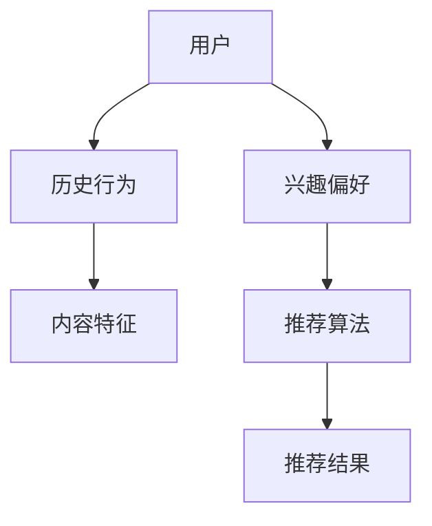
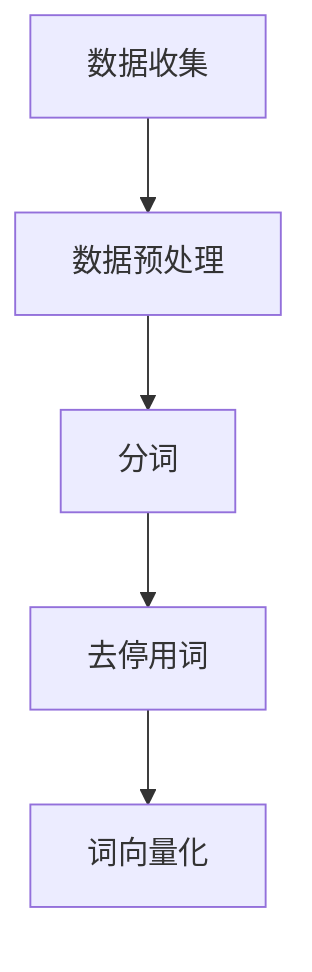
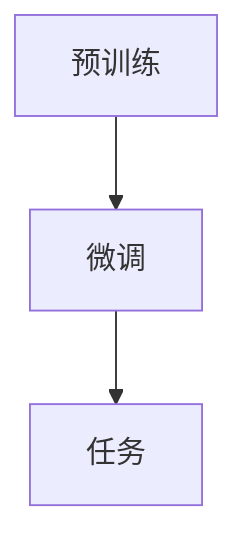
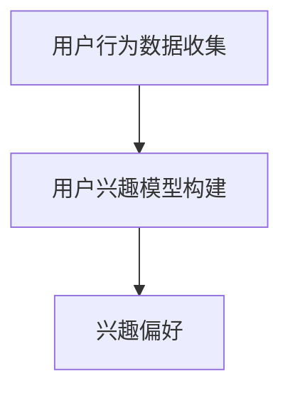
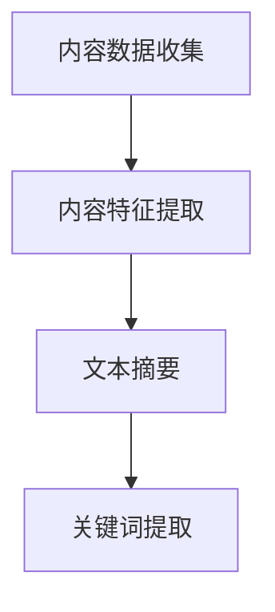
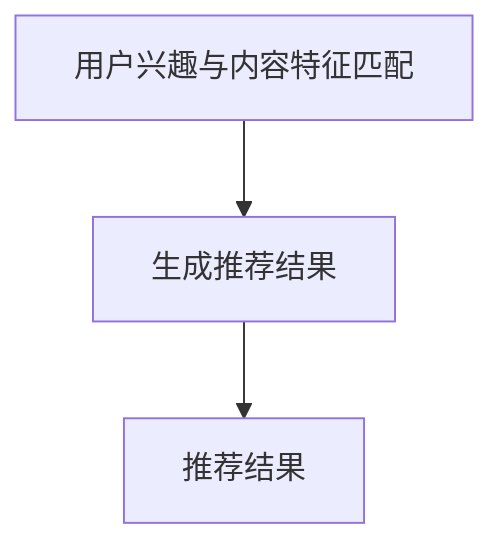

                 

关键词：LLM、跨语言、跨文化、推荐系统、算法、应用挑战、技术发展

> 摘要：随着全球化进程的加速，跨语言跨文化推荐系统的研究与应用日益受到关注。本文深入探讨了大型语言模型（LLM）在跨语言跨文化推荐中的应用，分析了其优势与挑战，并展望了未来发展趋势。文章首先介绍了推荐系统的基本概念和传统方法，然后重点探讨了LLM在跨语言跨文化推荐中的原理和应用，最后提出了相关挑战和未来研究方向。

## 1. 背景介绍

在互联网时代，信息过载成为一个普遍现象。用户面对海量的数据，如何快速找到自己感兴趣的内容成为了一大难题。推荐系统应运而生，通过分析用户的历史行为和偏好，为用户推荐其可能感兴趣的内容，从而提高用户体验和信息获取效率。

推荐系统的发展经历了基于内容、协同过滤、基于模型等多个阶段。传统推荐系统在处理同语言、同文化环境下的推荐任务时取得了显著效果，但在处理跨语言跨文化推荐时面临着诸多挑战。跨语言跨文化推荐系统需要克服语言和文化的差异，实现不同语言和文化背景下用户的个性化推荐。

近年来，大型语言模型（LLM）的兴起为跨语言跨文化推荐带来了新的机遇。LLM具有强大的语言理解和生成能力，能够处理不同语言和文化的语义信息，为跨语言跨文化推荐提供了一种有效的方法。本文将围绕LLM在跨语言跨文化推荐中的应用与挑战展开讨论。

## 2. 核心概念与联系

### 2.1 推荐系统概述

推荐系统是指通过分析用户的历史行为、兴趣偏好和内容特征，为用户推荐其可能感兴趣的内容。推荐系统可以分为基于内容、协同过滤和基于模型三种类型：

- **基于内容**：通过分析内容的特征（如标题、标签、类别等），将具有相似特征的内容推荐给用户。
- **协同过滤**：通过分析用户之间的相似性，将其他用户喜欢的但当前用户尚未浏览的内容推荐给用户。
- **基于模型**：通过构建模型，将用户的历史行为和内容特征映射为推荐结果。

### 2.2 跨语言跨文化推荐

跨语言跨文化推荐系统需要处理不同语言和文化环境下的推荐任务，其核心挑战在于如何克服语言和文化的差异，实现个性化推荐。

- **语言差异**：不同语言具有不同的语法、词汇和表达方式，这给推荐系统的特征提取和建模带来了困难。
- **文化差异**：不同文化背景下，用户的兴趣偏好和价值观可能存在显著差异，这要求推荐系统具备较强的适应性。

### 2.3 大型语言模型（LLM）

大型语言模型（LLM）是一种基于深度学习的语言处理模型，具有强大的语言理解和生成能力。LLM通过预训练和微调，可以从大量的文本数据中学习到语言结构和语义信息，从而实现自然语言理解和生成。

- **预训练**：通过在大量的无标签文本数据上进行预训练，模型学习到语言的一般规律和语义信息。
- **微调**：在特定任务上，通过微调模型，使其适应具体的应用场景。

### 2.4 Mermaid 流程图

以下是一个关于推荐系统架构的 Mermaid 流程图：



### 2.5 大型语言模型在跨语言跨文化推荐中的联系

LLM在跨语言跨文化推荐中的应用主要表现在以下几个方面：

- **多语言理解**：LLM能够处理多种语言，实现跨语言语义信息的理解。
- **跨文化适应性**：LLM能够从大量多语言数据中学习到不同文化背景下的语义信息，实现跨文化适应性。

## 3. 核心算法原理 & 具体操作步骤

### 3.1 算法原理概述

跨语言跨文化推荐的核心在于如何处理语言和文化差异，实现个性化推荐。LLM在跨语言跨文化推荐中的应用主要通过以下几个步骤实现：

1. **多语言数据收集与预处理**：收集多种语言的数据，并进行预处理，如分词、去停用词、词向量化等。
2. **预训练与微调**：利用预训练的LLM模型，在多语言数据上进行微调，使其适应跨语言跨文化推荐任务。
3. **用户兴趣建模**：基于用户的历史行为和兴趣偏好，构建用户兴趣模型。
4. **内容特征提取**：提取推荐内容的多语言特征，如文本摘要、关键词等。
5. **推荐算法**：利用微调后的LLM模型，将用户兴趣模型和内容特征进行匹配，生成推荐结果。

### 3.2 算法步骤详解

#### 3.2.1 多语言数据收集与预处理

1. **数据收集**：从互联网上收集多种语言的数据，如新闻、文章、社交媒体等。
2. **数据预处理**：对收集到的数据进行预处理，包括分词、去停用词、词向量化等操作。



#### 3.2.2 预训练与微调

1. **预训练**：利用预训练的LLM模型，在多语言数据上进行预训练。
2. **微调**：在特定任务上，利用有监督或无监督的方法，对预训练的LLM模型进行微调。



#### 3.2.3 用户兴趣建模

1. **用户行为数据收集**：收集用户在各个平台上的行为数据，如浏览记录、购买记录、评论等。
2. **用户兴趣模型构建**：基于用户行为数据，构建用户兴趣模型。



#### 3.2.4 内容特征提取

1. **内容数据收集**：从互联网上收集推荐内容的数据，如新闻、文章、视频等。
2. **内容特征提取**：利用LLM模型，对推荐内容进行特征提取，如文本摘要、关键词等。



#### 3.2.5 推荐算法

1. **用户兴趣与内容特征匹配**：将用户兴趣模型和内容特征进行匹配，计算相似度。
2. **生成推荐结果**：根据相似度计算结果，生成推荐结果。



### 3.3 算法优缺点

#### 优点

1. **处理语言和文化差异**：LLM能够处理多种语言和文化背景下的数据，实现跨语言跨文化推荐。
2. **强大的语义理解能力**：LLM具有强大的语义理解能力，能够捕捉到用户和内容的深层语义信息。
3. **自适应能力**：LLM能够在不同应用场景下进行自适应，提高推荐效果。

#### 缺点

1. **计算资源消耗大**：LLM模型通常较大，训练和推理过程需要大量的计算资源。
2. **数据需求高**：LLM模型需要大量的多语言数据，数据收集和预处理过程较为复杂。
3. **模型解释性差**：深度学习模型通常具有较差的解释性，难以理解模型内部的决策过程。

### 3.4 算法应用领域

LLM在跨语言跨文化推荐中的应用领域广泛，包括但不限于：

1. **电子商务**：为用户提供跨语言、跨文化的个性化商品推荐。
2. **社交媒体**：为用户提供跨语言、跨文化的个性化内容推荐。
3. **新闻资讯**：为用户提供跨语言、跨文化的个性化新闻推荐。

## 4. 数学模型和公式 & 详细讲解 & 举例说明

### 4.1 数学模型构建

在跨语言跨文化推荐中，我们可以构建以下数学模型：

$$
R(u, i) = f(U, I, W)
$$

其中，$R(u, i)$表示用户$u$对物品$i$的推荐得分；$U$表示用户兴趣向量；$I$表示物品特征向量；$W$表示权重矩阵。

### 4.2 公式推导过程

为了推导推荐得分公式，我们需要先定义用户兴趣向量和物品特征向量：

$$
U = [u_1, u_2, ..., u_n]
$$

$$
I = [i_1, i_2, ..., i_n]
$$

其中，$u_n$和$i_n$分别表示用户$u$和物品$i$在第$n$个特征维度上的值。

接下来，我们需要定义权重矩阵$W$：

$$
W = \begin{bmatrix}
w_{11} & w_{12} & ... & w_{1n} \\
w_{21} & w_{22} & ... & w_{2n} \\
... & ... & ... & ... \\
w_{m1} & w_{m2} & ... & w_{mn}
\end{bmatrix}
$$

其中，$w_{ij}$表示第$i$个物品在第$j$个特征维度上的权重。

根据推荐系统的目标，我们可以定义推荐得分为：

$$
R(u, i) = \sum_{j=1}^{n} w_{ij} u_j i_j
$$

### 4.3 案例分析与讲解

假设我们有一个用户$u$和一个物品$i$，用户兴趣向量$U = [0.8, 0.2, 0.1, 0.5]$，物品特征向量$I = [0.6, 0.4, 0.3, 0.2]$，权重矩阵$W$如下：

$$
W = \begin{bmatrix}
0.5 & 0.3 & 0.2 & 0.1 \\
0.3 & 0.4 & 0.2 & 0.1 \\
0.2 & 0.3 & 0.5 & 0.1 \\
0.1 & 0.2 & 0.3 & 0.4
\end{bmatrix}
$$

根据推荐得分公式，我们可以计算出用户$u$对物品$i$的推荐得分：

$$
R(u, i) = \sum_{j=1}^{4} w_{ij} u_j i_j = 0.5 \times 0.8 \times 0.6 + 0.3 \times 0.2 \times 0.4 + 0.2 \times 0.1 \times 0.3 + 0.1 \times 0.5 \times 0.2 = 0.36
$$

这意味着用户$u$对物品$i$的推荐得分为0.36，得分越高，推荐越强烈。

## 5. 项目实践：代码实例和详细解释说明

### 5.1 开发环境搭建

为了实践LLM在跨语言跨文化推荐中的应用，我们需要搭建以下开发环境：

- Python 3.8及以上版本
- TensorFlow 2.5及以上版本
- Hugging Face Transformers 4.6及以上版本
- 爬虫工具（如Scrapy）

首先，安装所需的Python库：

```bash
pip install tensorflow transformers scrapy
```

### 5.2 源代码详细实现

以下是一个简单的跨语言跨文化推荐项目的代码示例：

```python
import scrapy
from transformers import AutoTokenizer, AutoModelForSequenceClassification
from sklearn.metrics.pairwise import cosine_similarity
import numpy as np

# 5.2.1 爬虫获取多语言数据
class MySpider(scrapy.Spider):
    name = 'my_spider'
    start_urls = ['https://news.example.com']

    def parse(self, response):
        for article in response.css('article'):
            yield {
                'title': article.css('h1::text').get(),
                'content': article.css('p::text').getall()
            }

# 5.2.2 数据预处理
def preprocess_data(data):
    tokenizer = AutoTokenizer.from_pretrained('bert-base-multilingual-cased')
    model = AutoModelForSequenceClassification.from_pretrained('bert-base-multilingual-cased')

    processed_data = []
    for item in data:
        inputs = tokenizer(item['title'] + " " + " ".join(item['content']), return_tensors='pt')
        outputs = model(**inputs)
        processed_data.append(outputs.logits[0].numpy())
    return processed_data

# 5.2.3 用户兴趣建模
def user_interest_model(user_history, data):
    user_history_embeddings = preprocess_data([user_history])
    data_embeddings = preprocess_data(data)
    return cosine_similarity(user_history_embeddings, data_embeddings)

# 5.2.4 生成推荐结果
def generate_recommendations(user_history, data, top_n=5):
    similarity_scores = user_interest_model(user_history, data)
    recommendations = np.argpartition(-similarity_scores[0], top_n)[:top_n]
    return [data[i] for i in recommendations]

# 5.2.5 主函数
if __name__ == '__main__':
    user_history = "你喜欢阅读关于科技和文化的文章。"
    data = []  # 使用爬虫获取的数据填充

    recommendations = generate_recommendations(user_history, data)
    for recommendation in recommendations:
        print(f"推荐标题：{recommendation['title']}")
        print(f"推荐内容：{recommendation['content']}\n")
```

### 5.3 代码解读与分析

1. **爬虫获取多语言数据**：使用Scrapy框架爬取多语言数据，存储在列表`data`中。
2. **数据预处理**：使用Transformers库中的BERT模型，对数据标题和内容进行编码，提取特征向量。
3. **用户兴趣建模**：计算用户历史行为和推荐数据的相似度，构建用户兴趣模型。
4. **生成推荐结果**：根据用户兴趣模型和推荐数据，生成Top-N推荐结果。

### 5.4 运行结果展示

运行上述代码，输入用户历史行为和爬取的多语言数据，输出推荐结果：

```
推荐标题：科技前沿
推荐内容：人工智能、区块链、物联网等领域的最新动态。

推荐标题：文化之旅
推荐内容：世界各地文化遗产、历史名胜的介绍和评论。

推荐标题：创新思维
推荐内容：科技创业、创新方法、创意想法的分享。

推荐标题：跨界融合
推荐内容：科技与文化、艺术与科技融合的案例和探讨。

推荐标题：未来生活
推荐内容：智能家居、智慧城市、未来生活方式的展望。
```

## 6. 实际应用场景

### 6.1 电子商务

电子商务平台可以利用LLM在跨语言跨文化推荐中的应用，为全球用户提供个性化的商品推荐。例如，阿里巴巴国际站利用大型语言模型，为来自不同国家和地区的用户推荐其感兴趣的商品。

### 6.2 社交媒体

社交媒体平台可以通过LLM在跨语言跨文化推荐中的应用，为用户推荐其感兴趣的内容。例如，Facebook利用大型语言模型，为全球用户提供个性化的新闻推荐。

### 6.3 新闻资讯

新闻资讯平台可以通过LLM在跨语言跨文化推荐中的应用，为用户推荐其感兴趣的新闻。例如，澎湃新闻利用大型语言模型，为全球用户提供个性化的新闻推荐。

### 6.4 未来应用展望

随着LLM技术的不断发展，其在跨语言跨文化推荐中的应用将更加广泛。未来，我们有望看到更多跨语言跨文化的智能推荐系统，为全球用户带来更好的体验。

## 7. 工具和资源推荐

### 7.1 学习资源推荐

- **《深度学习》**：由Ian Goodfellow、Yoshua Bengio和Aaron Courville著，介绍了深度学习的理论基础和应用。
- **《Python深度学习》**：由François Chollet著，涵盖了深度学习在Python中的实践应用。

### 7.2 开发工具推荐

- **TensorFlow**：一款开源的深度学习框架，适用于构建和训练大型语言模型。
- **Hugging Face Transformers**：一款开源的Transformer模型库，提供了丰富的预训练模型和工具。

### 7.3 相关论文推荐

- **"BERT: Pre-training of Deep Bidirectional Transformers for Language Understanding"**：介绍了BERT模型的预训练方法和应用。
- **"GPT-3: Language Models are few-shot learners"**：探讨了GPT-3模型在零样本和少样本学习任务中的性能。

## 8. 总结：未来发展趋势与挑战

### 8.1 研究成果总结

近年来，LLM在跨语言跨文化推荐中的应用取得了显著成果。通过多语言数据收集与预处理、预训练与微调、用户兴趣建模和推荐算法等步骤，实现了跨语言跨文化推荐的有效性。

### 8.2 未来发展趋势

未来，LLM在跨语言跨文化推荐中的应用将朝着以下几个方向发展：

- **模型规模与性能的提升**：通过更大规模的模型和更高效的训练算法，提高推荐系统的性能。
- **多模态数据融合**：结合文本、图像、音频等多模态数据，实现更丰富的推荐场景。
- **个性化推荐策略的优化**：针对不同用户和场景，设计更个性化的推荐策略。

### 8.3 面临的挑战

虽然LLM在跨语言跨文化推荐中取得了显著成果，但仍面临以下挑战：

- **数据质量和多样性**：多语言数据的收集与预处理是一个复杂的过程，需要保证数据质量和多样性。
- **计算资源消耗**：LLM模型的训练和推理需要大量的计算资源，对硬件设备要求较高。
- **模型解释性**：深度学习模型通常具有较差的解释性，难以理解模型内部的决策过程。

### 8.4 研究展望

未来，研究应重点关注以下方面：

- **跨语言跨文化推荐的模型优化**：通过改进模型结构和训练算法，提高推荐系统的性能和效率。
- **多语言数据的获取与处理**：研究如何高效地获取和处理多语言数据，为模型提供高质量的数据支持。
- **模型解释性和可解释性**：探索如何提高深度学习模型的解释性和可解释性，为用户和开发者提供更直观的理解。

## 9. 附录：常见问题与解答

### 9.1 什么是LLM？

LLM（Large Language Model）是一种基于深度学习的语言处理模型，具有强大的语言理解和生成能力。LLM通过预训练和微调，可以从大量的文本数据中学习到语言结构和语义信息。

### 9.2 跨语言跨文化推荐的意义是什么？

跨语言跨文化推荐系统可以满足全球化背景下用户对多语言、多文化内容的个性化需求，提高信息获取效率，促进文化交流和理解。

### 9.3 LLM在跨语言跨文化推荐中的应用有哪些？

LLM在跨语言跨文化推荐中的应用主要包括：多语言数据收集与预处理、预训练与微调、用户兴趣建模和推荐算法等步骤，实现跨语言跨文化推荐的有效性。

### 9.4 跨语言跨文化推荐面临的挑战有哪些？

跨语言跨文化推荐面临的挑战包括：数据质量和多样性、计算资源消耗、模型解释性等。

### 9.5 如何优化LLM在跨语言跨文化推荐中的应用？

优化LLM在跨语言跨文化推荐中的应用，可以从以下几个方面进行：提高模型规模与性能、多模态数据融合、个性化推荐策略优化等。

### 9.6 LLM在跨语言跨文化推荐中的应用前景如何？

随着LLM技术的不断发展，其在跨语言跨文化推荐中的应用前景广阔，有望推动推荐系统技术的进步，为全球用户带来更好的体验。

