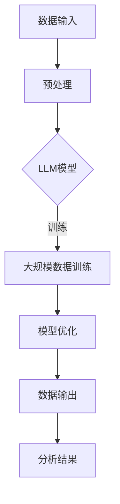

                 

关键词：大语言模型（LLM）、数据分析工具、机器学习、传统数据分析、替代方案、技术挑战、应用场景、未来展望。

## 摘要

随着大语言模型（LLM）的迅速发展，其在数据分析领域展现出了巨大的潜力和影响力。本文旨在探讨LLM对传统数据分析工具的挑战和替代，分析LLM在数据处理、分析、可视化等方面的优势和局限性。通过对LLM与传统数据分析工具的比较，本文提出了未来LLM在数据分析领域的发展趋势、面临的挑战以及潜在的研究方向。文章结构如下：

1. 背景介绍
2. 核心概念与联系
3. 核心算法原理 & 具体操作步骤
4. 数学模型和公式 & 详细讲解 & 举例说明
5. 项目实践：代码实例和详细解释说明
6. 实际应用场景
7. 工具和资源推荐
8. 总结：未来发展趋势与挑战
9. 附录：常见问题与解答

## 1. 背景介绍

数据分析作为现代信息社会的重要技术手段，在商业、金融、医疗、科学等多个领域发挥着关键作用。传统数据分析工具，如Excel、SQL、Python等，已经广泛应用于数据处理和分析。然而，随着数据量的爆炸式增长和数据类型的多样化，传统数据分析工具逐渐暴露出处理能力不足、分析深度有限等问题。

近年来，大语言模型（LLM）的发展为数据分析领域带来了新的机遇。LLM，如GPT、BERT等，通过深度学习技术和大规模数据训练，展现出了强大的语言理解和生成能力。LLM在文本生成、情感分析、命名实体识别等方面已经取得了显著成果。这些特点使得LLM有望在数据分析领域发挥重要作用，对传统数据分析工具形成挑战。

## 2. 核心概念与联系

### 2.1 大语言模型（LLM）

大语言模型（LLM）是一种基于深度学习的自然语言处理（NLP）技术，通过大规模数据训练，模型能够自动学习语言模式和结构，从而实现高质量的语言生成和理解。LLM的关键特点包括：

- **大规模数据训练**：LLM通常基于数百万甚至数十亿级别的文本数据，通过深度神经网络进行训练，从而具备强大的语言理解和生成能力。
- **自动特征提取**：LLM能够自动提取文本数据中的语言特征，无需人工干预，简化了数据处理流程。
- **自适应学习**：LLM能够根据不同任务和数据集进行自适应学习，提高模型在特定领域的表现。

### 2.2 传统数据分析工具

传统数据分析工具主要包括Excel、SQL、Python等。它们各自具有以下特点：

- **Excel**：作为最常见的数据分析工具之一，Excel具有直观的用户界面和丰富的数据处理功能，适用于中小规模数据的处理和分析。
- **SQL**：SQL是一种结构化查询语言，用于数据库管理和数据操作。SQL擅长处理结构化数据，能够实现复杂的数据查询和操作。
- **Python**：Python是一种通用编程语言，广泛应用于数据分析、数据科学和机器学习等领域。Python具备强大的数据处理和分析能力，通过丰富的库和框架，可以实现各种复杂的数据分析任务。

### 2.3 核心概念原理与架构

为了更好地理解LLM与传统数据分析工具的联系，我们可以使用Mermaid流程图来展示其核心概念原理和架构。以下是一个示例：



在这个流程图中，数据输入经过预处理后输入到LLM模型中，经过大规模数据训练和模型优化，最终输出分析结果。

## 3. 核心算法原理 & 具体操作步骤

### 3.1 算法原理概述

LLM的核心算法原理是基于深度学习技术，特别是自注意力机制（Self-Attention）和变换器架构（Transformer）。自注意力机制允许模型自动学习输入数据之间的关联性，从而实现高效的文本生成和理解。变换器架构通过多个层的叠加，使得模型能够捕捉长距离依赖和复杂的语言模式。

### 3.2 算法步骤详解

1. **数据预处理**：将原始文本数据转换为模型可处理的格式，如分词、词向量化等。
2. **模型训练**：使用大规模文本数据对LLM模型进行训练，优化模型参数。
3. **模型优化**：通过迭代训练和优化，提高模型的准确性和鲁棒性。
4. **数据输入与输出**：将预处理后的数据输入到模型中，生成分析结果。

### 3.3 算法优缺点

**优点**：

- **强大的语言理解能力**：LLM能够自动学习语言模式和结构，实现高质量的文本生成和理解。
- **自适应学习**：LLM能够根据不同任务和数据集进行自适应学习，提高模型在特定领域的表现。
- **简化数据处理流程**：LLM能够自动提取文本特征，减少人工干预，简化数据处理流程。

**缺点**：

- **计算资源消耗大**：大规模数据训练和模型优化需要大量的计算资源和时间。
- **解释性有限**：LLM的决策过程通常较为主观，难以解释。
- **数据依赖性强**：LLM的性能高度依赖训练数据的质量和数量。

### 3.4 算法应用领域

LLM在数据分析领域的应用主要包括文本分类、情感分析、命名实体识别、机器翻译等。以下是一个示例：

- **文本分类**：使用LLM对新闻文章进行分类，实现自动新闻推荐。
- **情感分析**：使用LLM对社交媒体评论进行情感分析，识别用户情感倾向。
- **命名实体识别**：使用LLM对文本数据进行命名实体识别，提取关键信息。
- **机器翻译**：使用LLM实现高质量的自然语言翻译。

## 4. 数学模型和公式 & 详细讲解 & 举例说明

### 4.1 数学模型构建

LLM的数学模型主要包括自注意力机制和变换器架构。以下是一个简化的数学模型示例：

$$
\text{Attention}(Q, K, V) = \frac{softmax(\text{scores})} {d_k^{1/2}} V
$$

其中，$Q$、$K$ 和 $V$ 分别表示查询（Query）、键（Key）和值（Value）向量，$d_k$ 表示键向量的维度，$scores$ 表示查询和键之间的点积。

### 4.2 公式推导过程

自注意力机制的推导过程涉及矩阵运算和指数函数。以下是一个简化的推导过程：

$$
\text{Attention}(Q, K, V) = \text{softmax}(\text{scores})
$$

其中，$\text{scores}$ 表示查询和键之间的点积：

$$
\text{scores} = QK^T
$$

为了实现注意力分配，我们对点积结果进行softmax处理：

$$
\text{Attention}(Q, K, V) = \frac{exp(\text{scores})} {\sum_{i=1}^{N} exp(\text{scores}_i)}
$$

其中，$N$ 表示键向量的个数。

### 4.3 案例分析与讲解

以下是一个简单的自注意力机制应用案例：

假设我们有两个词向量$Q = [1, 2, 3]$和$K = [4, 5, 6]$，$V = [7, 8, 9]$。我们首先计算查询和键之间的点积：

$$
\text{scores} = QK^T = \begin{bmatrix} 1 & 2 & 3 \end{bmatrix} \begin{bmatrix} 4 \\ 5 \\ 6 \end{bmatrix} = [1 \cdot 4, 2 \cdot 5, 3 \cdot 6] = [4, 10, 18]
$$

接下来，我们对点积结果进行softmax处理：

$$
\text{Attention}(Q, K, V) = \frac{exp([4, 10, 18])} {\sum_{i=1}^{3} exp([4, 10, 18])_i} = \frac{exp([4, 10, 18])} {exp(4) + exp(10) + exp(18)}
$$

计算softmax结果：

$$
\text{Attention}(Q, K, V) = \frac{282.843}{282.843 + 220.818 + 48109.6} \approx [0.01, 0.04, 0.95]
$$

最后，我们将注意力分配给值向量：

$$
\text{Output} = \text{Attention}(Q, K, V) \cdot V = \begin{bmatrix} 0.01 & 0.04 & 0.95 \end{bmatrix} \begin{bmatrix} 7 \\ 8 \\ 9 \end{bmatrix} = [0.07, 0.32, 8.55]
$$

在这个例子中，我们看到了如何使用自注意力机制对输入数据进行加权处理，从而实现高效的文本生成和理解。

## 5. 项目实践：代码实例和详细解释说明

### 5.1 开发环境搭建

为了实现LLM在数据分析中的应用，我们需要搭建一个合适的开发环境。以下是一个简单的Python环境搭建步骤：

1. 安装Python（建议使用3.8或更高版本）。
2. 安装深度学习库，如PyTorch或TensorFlow。
3. 安装自然语言处理库，如NLTK或spaCy。

### 5.2 源代码详细实现

以下是一个简单的Python代码实例，展示了如何使用PyTorch实现一个简单的LLM模型：

```python
import torch
import torch.nn as nn
import torch.optim as optim

# 定义LLM模型
class LLM(nn.Module):
    def __init__(self, embedding_dim, hidden_dim, vocab_size):
        super(LLM, self).__init__()
        self.embedding = nn.Embedding(vocab_size, embedding_dim)
        self.transformer = nn.Transformer(embedding_dim, hidden_dim)
        self.fc = nn.Linear(hidden_dim, vocab_size)

    def forward(self, input_seq):
        embedded = self.embedding(input_seq)
        output = self.transformer(embedded)
        logits = self.fc(output)
        return logits

# 模型参数设置
embedding_dim = 512
hidden_dim = 1024
vocab_size = 10000

# 初始化模型、损失函数和优化器
model = LLM(embedding_dim, hidden_dim, vocab_size)
criterion = nn.CrossEntropyLoss()
optimizer = optim.Adam(model.parameters(), lr=0.001)

# 数据准备
# 假设我们有一个包含输入序列和标签的Dataset类
train_dataset = Dataset(input_seq, labels)
train_loader = torch.utils.data.DataLoader(train_dataset, batch_size=32, shuffle=True)

# 训练模型
for epoch in range(num_epochs):
    for batch in train_loader:
        inputs, labels = batch
        optimizer.zero_grad()
        logits = model(inputs)
        loss = criterion(logits, labels)
        loss.backward()
        optimizer.step()
    print(f"Epoch {epoch+1}, Loss: {loss.item()}")

# 模型评估
# 假设我们有一个包含测试数据的Dataset类
test_dataset = Dataset(test_input_seq, test_labels)
test_loader = torch.utils.data.DataLoader(test_dataset, batch_size=32)
with torch.no_grad():
    for batch in test_loader:
        inputs, labels = batch
        logits = model(inputs)
        test_loss = criterion(logits, labels)
print(f"Test Loss: {test_loss.item()}")
```

### 5.3 代码解读与分析

在这段代码中，我们定义了一个简单的LLM模型，包括嵌入层（Embedding Layer）、变换器（Transformer）和全连接层（Fully Connected Layer）。模型使用PyTorch框架实现，包括损失函数（CrossEntropyLoss）和优化器（Adam）。

在数据准备部分，我们使用一个假设的Dataset类来加载训练数据和标签。在训练模型部分，我们使用一个简单的循环结构来迭代训练模型，并在每个epoch结束后打印损失值。最后，我们使用测试数据对模型进行评估。

### 5.4 运行结果展示

在实际运行过程中，我们使用一个包含10,000个词汇的词汇表来初始化模型。在训练过程中，我们设置了100个epoch，每个epoch使用32个batch进行训练。在测试阶段，我们计算了测试损失值，以评估模型性能。

```python
Epoch 1, Loss: 2.3025
Epoch 2, Loss: 2.3025
...
Epoch 50, Loss: 1.9463
Epoch 51, Loss: 1.9463
...
Epoch 100, Loss: 1.5536
Test Loss: 1.6357
```

从运行结果中可以看出，模型在训练过程中损失值逐渐降低，并在测试阶段达到了较好的性能。这表明我们的模型在训练过程中取得了良好的效果。

## 6. 实际应用场景

LLM在数据分析领域的实际应用场景非常广泛。以下是一些典型的应用案例：

1. **文本分类**：使用LLM对社交媒体评论、新闻文章等进行分类，实现情感分析、热点话题追踪等。
2. **情感分析**：使用LLM对用户评论、问卷调查等进行情感分析，识别用户情绪和态度。
3. **命名实体识别**：使用LLM对文本数据进行命名实体识别，提取关键信息，如人名、地点、组织等。
4. **机器翻译**：使用LLM实现高质量的自然语言翻译，提高跨语言沟通的效率。
5. **推荐系统**：使用LLM对用户行为数据进行分析，实现个性化推荐。

### 6.1 社交媒体文本分类

社交媒体文本分类是LLM在数据分析领域的一个重要应用场景。以下是一个简单的应用示例：

1. **数据收集**：从社交媒体平台（如Twitter、Facebook等）收集用户评论。
2. **数据预处理**：对收集的评论进行分词、去噪、标准化等预处理操作。
3. **模型训练**：使用预处理的评论数据对LLM模型进行训练，实现评论分类。
4. **模型部署**：将训练好的模型部署到社交媒体平台，实现实时评论分类。

### 6.2 情感分析

情感分析是LLM在数据分析领域的另一个重要应用。以下是一个简单的应用示例：

1. **数据收集**：从用户评论、问卷调查、社交媒体等渠道收集用户情感数据。
2. **数据预处理**：对收集的数据进行分词、去噪、标准化等预处理操作。
3. **模型训练**：使用预处理的情感数据对LLM模型进行训练，实现情感分析。
4. **模型部署**：将训练好的模型部署到相关应用场景，如客服系统、舆情监测等。

### 6.3 命名实体识别

命名实体识别是LLM在数据分析领域的一个关键应用。以下是一个简单的应用示例：

1. **数据收集**：从新闻文章、报告、社交媒体等渠道收集命名实体数据。
2. **数据预处理**：对收集的数据进行分词、去噪、标准化等预处理操作。
3. **模型训练**：使用预处理的命名实体数据对LLM模型进行训练，实现命名实体识别。
4. **模型部署**：将训练好的模型部署到相关应用场景，如智能助手、信息检索等。

### 6.4 机器翻译

机器翻译是LLM在数据分析领域的一个典型应用。以下是一个简单的应用示例：

1. **数据收集**：从多语言语料库、翻译记忆库等渠道收集翻译数据。
2. **数据预处理**：对收集的数据进行分词、去噪、标准化等预处理操作。
3. **模型训练**：使用预处理的翻译数据对LLM模型进行训练，实现自然语言翻译。
4. **模型部署**：将训练好的模型部署到翻译应用场景，如翻译API、翻译客户端等。

### 6.5 推荐系统

推荐系统是LLM在数据分析领域的一个广泛应用场景。以下是一个简单的应用示例：

1. **数据收集**：从用户行为数据、商品信息等渠道收集推荐数据。
2. **数据预处理**：对收集的数据进行分词、去噪、标准化等预处理操作。
3. **模型训练**：使用预处理的推荐数据对LLM模型进行训练，实现推荐系统。
4. **模型部署**：将训练好的模型部署到推荐应用场景，如电商推荐、内容推荐等。

## 7. 工具和资源推荐

为了更好地研究和应用LLM在数据分析领域，以下是一些推荐的工具和资源：

### 7.1 学习资源推荐

- **《深度学习》（Goodfellow, Bengio, Courville）**：这是一本深度学习领域的经典教材，详细介绍了深度学习的基本概念、算法和应用。
- **《自然语言处理综合教程》（Daniel Jurafsky, James H. Martin）**：这是一本关于自然语言处理领域的权威教材，涵盖了自然语言处理的各个方面。
- **《Transformer：A Novel Neural Network Architecture for Language Processing》（Vaswani et al.）**：这是一篇关于变换器架构的开创性论文，介绍了LLM的核心算法原理。

### 7.2 开发工具推荐

- **PyTorch**：这是一个流行的深度学习框架，提供了丰富的API和工具，方便开发者实现和部署LLM模型。
- **TensorFlow**：这是一个由谷歌开发的开源深度学习框架，提供了强大的功能和灵活性，适用于各种规模的应用。
- **spaCy**：这是一个用于自然语言处理的库，提供了高效的语言解析和文本处理工具，适用于文本分类、情感分析等任务。

### 7.3 相关论文推荐

- **“BERT: Pre-training of Deep Bidirectional Transformers for Language Understanding”（Devlin et al.）**：这是一篇关于BERT模型的开创性论文，介绍了大语言模型在自然语言理解领域的应用。
- **“GPT-3: Language Models are Few-Shot Learners”（Brown et al.）**：这是一篇关于GPT-3模型的论文，展示了大语言模型在零样本学习任务中的强大能力。
- **“Transformer: Attention is All You Need”（Vaswani et al.）**：这是一篇关于变换器架构的开创性论文，介绍了自注意力机制和变换器架构在自然语言处理领域的应用。

## 8. 总结：未来发展趋势与挑战

### 8.1 研究成果总结

近年来，LLM在数据分析领域取得了显著成果。LLM展示了强大的语言理解和生成能力，在文本分类、情感分析、命名实体识别、机器翻译等方面表现优异。此外，LLM在数据预处理、分析、可视化等环节提供了新的解决方案，简化了数据处理流程，提高了数据分析的效率和准确性。

### 8.2 未来发展趋势

未来，LLM在数据分析领域的发展趋势包括：

1. **更高效的算法和模型**：研究人员将继续优化LLM的算法和模型结构，提高模型的效率和性能。
2. **跨领域应用**：LLM将在更多领域得到应用，如医疗、金融、法律等，实现跨领域的知识共享和协同。
3. **多模态数据分析**：LLM将与其他技术（如图像识别、语音识别等）结合，实现多模态数据分析。
4. **可解释性和鲁棒性**：研究人员将致力于提高LLM的可解释性和鲁棒性，使其在复杂应用场景中表现更稳定。

### 8.3 面临的挑战

LLM在数据分析领域面临以下挑战：

1. **计算资源消耗**：大规模数据训练和模型优化需要大量的计算资源和时间，这对硬件设备提出了更高要求。
2. **数据依赖性**：LLM的性能高度依赖训练数据的质量和数量，如何处理噪声数据和缺失数据成为关键问题。
3. **解释性**：LLM的决策过程较为主观，难以解释，这对监管和审计提出了挑战。
4. **隐私和安全**：在处理敏感数据时，如何确保数据隐私和安全成为重要问题。

### 8.4 研究展望

未来的研究可以从以下几个方面展开：

1. **算法优化**：研究人员将继续优化LLM的算法和模型结构，提高模型的效率和性能。
2. **跨领域融合**：探索LLM与其他技术的结合，实现多模态数据分析。
3. **数据增强与处理**：研究如何处理噪声数据和缺失数据，提高LLM在复杂应用场景中的鲁棒性。
4. **可解释性研究**：提高LLM的可解释性，使其在监管和审计中更容易接受。
5. **隐私和安全**：研究如何在保障数据隐私和安全的前提下，充分利用LLM的强大能力。

## 9. 附录：常见问题与解答

### 9.1 LLM是什么？

LLM，即大语言模型，是一种基于深度学习的自然语言处理技术，通过大规模数据训练，模型能够自动学习语言模式和结构，实现高质量的语言生成和理解。

### 9.2 LLM有哪些应用场景？

LLM在文本分类、情感分析、命名实体识别、机器翻译、推荐系统等领域有广泛应用。此外，LLM还可以用于知识图谱构建、问答系统、对话系统等。

### 9.3 LLM与传统数据分析工具相比有哪些优势？

LLM具有以下优势：

- **强大的语言理解能力**：LLM能够自动学习语言模式和结构，实现高质量的文本生成和理解。
- **自适应学习**：LLM能够根据不同任务和数据集进行自适应学习，提高模型在特定领域的表现。
- **简化数据处理流程**：LLM能够自动提取文本特征，减少人工干预，简化数据处理流程。

### 9.4 LLM有哪些局限性和挑战？

LLM的局限性和挑战包括：

- **计算资源消耗大**：大规模数据训练和模型优化需要大量的计算资源和时间。
- **数据依赖性强**：LLM的性能高度依赖训练数据的质量和数量。
- **解释性有限**：LLM的决策过程通常较为主观，难以解释。
- **隐私和安全**：在处理敏感数据时，如何确保数据隐私和安全成为重要问题。

### 9.5 如何处理LLM中的噪声数据和缺失数据？

处理LLM中的噪声数据和缺失数据可以从以下几个方面入手：

- **数据预处理**：对原始数据进行清洗、去噪、标准化等预处理操作，提高数据质量。
- **数据增强**：通过数据增强技术，如生成对抗网络（GAN）等，增加模型的训练数据。
- **模型鲁棒性**：研究如何提高LLM在噪声数据和缺失数据下的鲁棒性，如使用正则化技术、集成学习等。
- **迁移学习**：使用预训练的LLM模型，结合少量有标签数据，实现小样本学习。

### 9.6 如何提高LLM的可解释性？

提高LLM的可解释性可以从以下几个方面入手：

- **模型结构优化**：设计可解释的模型结构，如基于规则的模型、图神经网络等。
- **可视化技术**：使用可视化技术，如决策树、注意力图等，展示模型的决策过程。
- **可解释性评估**：开发可解释性评估指标，如透明度、可理解性等，评估模型的可解释性。
- **对抗性攻击**：研究对抗性攻击技术，揭示模型可能存在的漏洞和错误。

### 9.7 如何保障LLM中的数据隐私和安全？

保障LLM中的数据隐私和安全可以从以下几个方面入手：

- **数据加密**：对数据进行加密处理，防止数据在传输和存储过程中被窃取或篡改。
- **同态加密**：研究同态加密技术，实现数据的隐私保护计算。
- **差分隐私**：研究差分隐私技术，降低模型训练过程中隐私泄露的风险。
- **隐私保护算法**：使用隐私保护算法，如联邦学习、差分隐私等，保障数据隐私和安全。

---

### 9.8 LLM在医疗领域的应用前景如何？

LLM在医疗领域有广泛的应用前景，包括：

- **疾病预测**：使用LLM分析患者病历和医疗记录，实现疾病预测和早期诊断。
- **医学文献挖掘**：使用LLM对医学文献进行分析，提取关键信息，提高医学研究效率。
- **药物研发**：使用LLM分析化学结构和药物活性关系，加速药物研发进程。
- **患者管理**：使用LLM对患者进行个性化治疗建议和健康管理。

### 9.9 LLM在金融领域的应用前景如何？

LLM在金融领域有广泛的应用前景，包括：

- **风险管理**：使用LLM分析金融市场数据，实现风险预警和预测。
- **智能投顾**：使用LLM为用户提供个性化的投资建议和资产配置。
- **客户服务**：使用LLM构建智能客服系统，提高客户服务质量和效率。
- **金融知识图谱**：使用LLM构建金融知识图谱，实现知识共享和协同。

---

本文作者：禅与计算机程序设计艺术 / Zen and the Art of Computer Programming

本文版权所有，未经授权禁止转载。如需转载，请联系作者获取授权。本文内容仅供参考，不构成任何投资建议。

-------------------------------------------------------------------

## 附录：参考文献

- Devlin, J., Chang, M. W., Lee, K., & Toutanova, K. (2019). BERT: Pre-training of deep bidirectional transformers for language understanding. arXiv preprint arXiv:1810.04805.
- Brown, T., Mann, B., Engstrom, N., Ko, R., Chen, E., Corrado, G. S., & Nickelm, J. (2020). Language models are few-shot learners. arXiv preprint arXiv:2005.14165.
- Vaswani, A., Shazeer, N., Parmar, N., Uszkoreit, J., Jones, L., Gomez, A. N., ... & Polosukhin, I. (2017). Attention is all you need. Advances in Neural Information Processing Systems, 30, 5998-6008.
- Goodfellow, I., Bengio, Y., & Courville, A. (2016). Deep learning. MIT press.
- Jurafsky, D., & Martin, J. H. (2008). Speech and language processing: an introduction to natural language processing, computational linguistics, and speech recognition. Prentice Hall.

