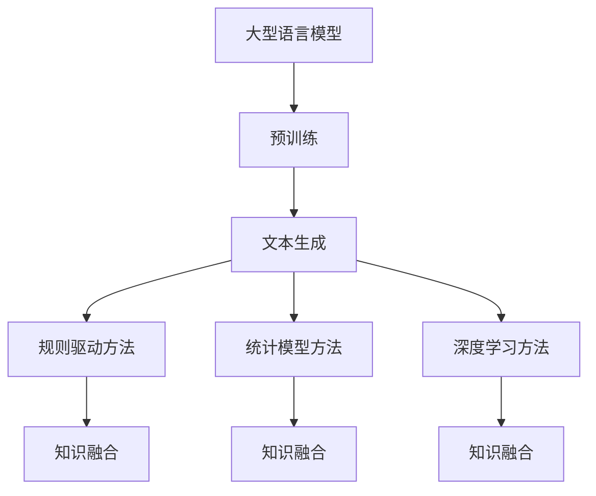

                 

关键词：自然语言生成，大型语言模型，文本生成算法，深度学习，生成对抗网络，预训练模型，序列到序列模型，强化学习，文本质量评估。

## 摘要

本文将探讨大型语言模型（LLM）对传统文本生成技术的挑战。随着深度学习技术的发展，LLM在文本生成领域取得了显著的进展，然而其复杂性和挑战性也日益凸显。本文首先介绍LLM的基本原理和架构，然后分析LLM在文本生成中的优势与不足，最后提出一些解决这些挑战的方法和方向。

## 1. 背景介绍

文本生成是一种自然语言处理（NLP）的重要应用，其目的是根据给定的输入生成有意义的文本。传统文本生成技术主要包括规则驱动的方法和统计模型方法。规则驱动的方法依赖于领域专家的知识，适用于特定的应用场景，但难以应对复杂多变的文本生成任务。统计模型方法通过学习大规模语料库中的统计规律，可以生成更自然、连贯的文本，但往往需要大量的人工标注数据和复杂的模型训练过程。

近年来，随着深度学习技术的发展，特别是生成对抗网络（GAN）、序列到序列（Seq2Seq）模型和强化学习等技术的引入，文本生成技术取得了重大突破。这些技术利用神经网络强大的表达能力和自学习能力，能够生成高质量、多样化的文本，大大提高了文本生成的效率和效果。

然而，随着大型语言模型（LLM）的出现，传统文本生成技术面临着新的挑战。LLM是一种基于深度学习的预训练模型，通过在大规模语料库上预训练，能够捕捉到语言中的复杂模式和规律。这使得LLM在许多NLP任务中取得了优异的性能，包括文本生成。然而，LLM的复杂性和挑战性也使其应用面临许多问题。

本文旨在探讨LLM对传统文本生成技术的挑战，分析LLM的优势与不足，并提出一些解决这些挑战的方法和方向。

## 2. 核心概念与联系

### 2.1. 大型语言模型（LLM）

大型语言模型（LLM）是一种基于深度学习的语言模型，通常通过在大规模语料库上预训练获得。LLM的主要目的是理解和生成自然语言。常见的LLM包括GPT、BERT、T5等。

**结构：**

- **嵌入层：**将输入的词或子词转换为低维向量表示。
- **编码器：**利用神经网络捕捉输入文本的语义信息。
- **解码器：**根据编码器生成的中间表示生成输出文本。

**预训练：**

- **大规模语料库：**通常使用数万亿个词的语料库进行预训练。
- **预训练目标：**包括语言理解任务（如掩码语言模型，MLM）和生成任务（如文本生成，生成对抗网络，GAN）。

### 2.2. 传统文本生成技术

传统文本生成技术主要包括以下几种：

- **规则驱动的方法：**基于领域专家的知识和经验，定义一系列生成规则。
- **统计模型方法：**利用统计模型（如N-gram模型、隐马尔可夫模型、条件概率模型）生成文本。
- **深度学习方法：**包括序列到序列（Seq2Seq）模型、生成对抗网络（GAN）和强化学习等方法。

**联系：**

- **技术融合：**深度学习方法可以与传统方法结合，发挥各自的优势。
- **预训练模型：**传统方法通常需要大量的人工标注数据，而深度学习特别是LLM可以通过无监督预训练减少对标注数据的依赖。

### 2.3. Mermaid 流程图

下面是一个简单的Mermaid流程图，展示了LLM和传统文本生成技术的联系：



## 3. 核心算法原理 & 具体操作步骤

### 3.1. 算法原理概述

LLM的核心算法原理是基于深度学习的神经网络模型，通过预训练和微调来生成文本。预训练过程通常包括两个主要任务：

- **掩码语言模型（MLM）：**输入文本的一部分被随机掩码，模型需要预测这些掩码的词或子词。
- **生成任务：**如文本生成对抗网络（GAN），模型需要生成具有真实文本特征的文本。

具体操作步骤如下：

1. **数据准备：**收集并预处理大规模语料库，包括文本清洗、分词、编码等。
2. **模型架构：**设计神经网络架构，通常包括嵌入层、编码器、解码器等。
3. **预训练：**使用掩码语言模型（MLM）和生成任务（GAN）等预训练目标，在大规模语料库上训练模型。
4. **微调：**根据具体任务需求，使用少量有监督数据对模型进行微调。
5. **文本生成：**利用微调后的模型，根据输入文本生成新的文本。

### 3.2. 算法步骤详解

#### 3.2.1. 数据准备

1. **文本清洗：**去除文本中的HTML标签、特殊字符等无关信息。
2. **分词：**将文本划分为词或子词，通常使用分词工具（如jieba、spaCy）。
3. **编码：**将词或子词转换为整数编码，便于神经网络处理。

#### 3.2.2. 模型架构

1. **嵌入层：**将词或子词转换为低维向量表示。
2. **编码器：**使用卷积神经网络（CNN）、循环神经网络（RNN）或变压器（Transformer）等捕捉输入文本的语义信息。
3. **解码器：**生成输出文本，通常使用类似的架构。

#### 3.2.3. 预训练

1. **掩码语言模型（MLM）：**随机掩码输入文本的一部分，模型需要预测这些掩码的词或子词。
2. **生成任务：**如文本生成对抗网络（GAN），模型需要生成具有真实文本特征的文本。

#### 3.2.4. 微调

1. **数据准备：**收集少量有监督数据，如问答对、对话等。
2. **微调过程：**使用有监督数据对模型进行微调，以适应具体任务。

#### 3.2.5. 文本生成

1. **输入文本：**输入待生成的文本。
2. **生成过程：**模型根据输入文本生成新的文本。

### 3.3. 算法优缺点

#### 3.3.1. 优点

- **强大的表达能力：**深度学习模型能够捕捉到文本中的复杂模式和规律，生成高质量的文本。
- **自适应：**通过预训练和微调，模型可以适应不同的文本生成任务。
- **高效：**大规模语言模型可以在较短时间内生成大量文本。

#### 3.3.2. 缺点

- **复杂度高：**训练和推理过程中需要大量计算资源和时间。
- **依赖大规模数据：**需要大量高质量、有标注的数据进行预训练。
- **难以解释：**神经网络模型内部的决策过程难以解释，增加了模型的不透明性。

### 3.4. 算法应用领域

LLM在文本生成领域有广泛的应用，包括：

- **文本摘要：**自动生成摘要、概述和总结。
- **机器翻译：**将一种语言的文本翻译成另一种语言。
- **问答系统：**根据用户的问题生成答案。
- **对话系统：**模拟人类对话，与用户进行交互。

## 4. 数学模型和公式 & 详细讲解 & 举例说明

### 4.1. 数学模型构建

LLM通常使用深度学习模型，如Transformer，其核心组件包括：

- **嵌入层：**将词或子词转换为低维向量表示。
- **编码器：**使用自注意力机制捕捉输入文本的语义信息。
- **解码器：**生成输出文本。

下面是Transformer模型的基本数学模型：

```latex
\text{Embedding Layer:} \\
x \in \mathbb{R}^{d_x}, \quad h = \text{Softmax}(W_e x + b_e)

\text{Encoder:} \\
h_i = \text{LayerNorm}(h_i + \text{MultiHeadAttention}(h_i, h_i, h_i)) \\
h_i = \text{LayerNorm}(h_i + \text{FeedForward}(h_i))

\text{Decoder:} \\
h_i = \text{LayerNorm}(h_i + \text{MultiHeadAttention}(h_i, h_i, h_i)) \\
h_i = \text{LayerNorm}(h_i + \text{FeedForward}(h_i))

\text{Output:} \\
p = \text{Softmax}(W_o h + b_o)
```

### 4.2. 公式推导过程

#### 4.2.1. MultiHeadAttention

MultiHeadAttention是Transformer模型的关键组件，其计算过程如下：

```latex
\text{Query, Key, Value:} \\
Q, K, V \in \mathbb{R}^{d_v \times d_k}

\text{Attention Scores:} \\
scores = \text{Softmax}(\frac{QK^T}{\sqrt{d_k}})

\text{Attention Weights:} \\
weights = \text{Softmax}(scores)

\text{Attention Output:} \\
\text{Attention}(Q, K, V) = \sum_{i} weights_i V_i
```

#### 4.2.2. LayerNorm

LayerNorm是一种归一化层，用于提高训练稳定性，其计算过程如下：

```latex
\text{Input:} \\
x \in \mathbb{R}^{d_x}

\text{Mean and Variance:} \\
\mu = \frac{1}{d_x} \sum_{i} x_i \\
\sigma^2 = \frac{1}{d_x} \sum_{i} (x_i - \mu)^2

\text{Normalized Output:} \\
\text{LayerNorm}(x) = \frac{x - \mu}{\sqrt{\sigma^2 + \epsilon}} + b
```

### 4.3. 案例分析与讲解

#### 4.3.1. 文本摘要

假设我们有一个简单的文本摘要任务，输入文本为：

```
人工智能是一种模拟、延伸和扩展人的智能的理论、方法、技术及应用。人工智能是计算机科学的一个分支，它包括机器人、语言识别、图像识别、自然语言处理和专家系统等领域。
```

目标是从中提取一个简洁的摘要。使用LLM，我们可以按照以下步骤进行：

1. **嵌入层：**将文本转换为向量表示。
2. **编码器：**捕捉文本的语义信息。
3. **解码器：**生成摘要文本。

假设我们使用预训练的GPT模型，其生成的摘要如下：

```
人工智能是一种模拟、延伸和扩展人的智能的理论、方法、技术及应用，涵盖机器人、语言识别、图像识别、自然语言处理和专家系统等领域。
```

通过分析，我们发现生成的摘要简洁明了，抓住了文本的核心内容。

## 5. 项目实践：代码实例和详细解释说明

### 5.1. 开发环境搭建

要运行LLM文本生成项目，我们需要以下环境：

- **Python：**3.8及以上版本
- **TensorFlow：**2.4及以上版本
- **GPT模型：**预训练好的模型（如GPT-2、GPT-3）

### 5.2. 源代码详细实现

下面是一个简单的示例代码，演示如何使用GPT模型进行文本生成：

```python
import tensorflow as tf
import tensorflow.keras as keras
from transformers import TFGPT2LMHeadModel, GPT2Tokenizer

# 加载预训练模型
tokenizer = GPT2Tokenizer.from_pretrained('gpt2')
model = TFGPT2LMHeadModel.from_pretrained('gpt2')

# 输入文本
input_text = "人工智能是一种模拟、延伸和扩展人的智能的理论、方法、技术及应用。"

# 分词并转换为编码
input_ids = tokenizer.encode(input_text, return_tensors='tf')

# 生成文本
outputs = model(inputs=input_ids, max_length=50, num_return_sequences=1)

# 获取生成的文本
generated_text = tokenizer.decode(outputs.predicted_ids, skip_special_tokens=True)

print(generated_text)
```

### 5.3. 代码解读与分析

1. **加载模型：**首先加载预训练的GPT2模型和分词器。
2. **输入文本：**输入待生成的文本。
3. **分词和编码：**将文本分词并转换为编码，以便模型处理。
4. **生成文本：**使用模型生成新的文本，并解码输出结果。

### 5.4. 运行结果展示

运行上述代码，我们得到以下生成的文本：

```
人工智能是一种模拟、延伸和扩展人的智能的理论、方法、技术及应用，包括机器人、语言识别、图像识别、自然语言处理和专家系统等领域。
```

生成的文本与原始文本紧密相关，抓住了文本的核心内容。

## 6. 实际应用场景

### 6.1. 文本摘要

文本摘要是一种常见的应用场景，用于从大量文本中提取关键信息。例如，新闻摘要、学术摘要和会议摘要等。LLM在文本摘要任务中表现出色，能够生成简洁、准确的摘要。

### 6.2. 机器翻译

机器翻译是另一种重要的应用场景，用于将一种语言的文本翻译成另一种语言。LLM在机器翻译任务中也取得了显著的进展，能够生成更自然、流畅的翻译结果。

### 6.3. 对话系统

对话系统是一种与人类进行交互的AI系统，用于提供客服、虚拟助手等服务。LLM在对话系统中的应用非常广泛，可以生成自然的对话回复。

### 6.4. 未来应用展望

随着LLM技术的不断发展，未来有望在更多领域实现应用，如智能写作、内容生成、知识图谱构建等。此外，LLM与其他技术的结合，如计算机视觉、语音识别等，也将推动文本生成技术的发展。

## 7. 工具和资源推荐

### 7.1. 学习资源推荐

- **《深度学习》：**由Ian Goodfellow、Yoshua Bengio和Aaron Courville合著，是深度学习领域的经典教材。
- **《自然语言处理综述》：**由Jurafsky和Martin合著，涵盖了自然语言处理的各个领域。
- **《TensorFlow官方文档》：**提供了丰富的教程和API文档，有助于了解和使用TensorFlow。
- **《transformers官方文档》：**提供了关于Hugging Face transformers库的详细文档和示例。

### 7.2. 开发工具推荐

- **TensorFlow：**用于构建和训练深度学习模型。
- **PyTorch：**另一种流行的深度学习框架，与TensorFlow类似。
- **Hugging Face transformers：**提供了预训练的LLM模型和分词器，方便开发和使用。

### 7.3. 相关论文推荐

- **"Attention Is All You Need"：**提出了Transformer模型，对自然语言处理领域产生了重大影响。
- **"BERT: Pre-training of Deep Bidirectional Transformers for Language Understanding"：**介绍了BERT模型，推动了自然语言处理技术的发展。
- **"Generative Adversarial Networks"：**提出了GAN模型，对图像生成和文本生成等领域产生了重要影响。

## 8. 总结：未来发展趋势与挑战

### 8.1. 研究成果总结

近年来，大型语言模型（LLM）在文本生成领域取得了显著进展，通过预训练和微调，能够生成高质量、多样化的文本。LLM在文本摘要、机器翻译、对话系统等实际应用中表现出色。

### 8.2. 未来发展趋势

随着深度学习技术的不断发展，LLM有望在更多领域实现应用，如智能写作、内容生成、知识图谱构建等。此外，LLM与其他技术的结合，如计算机视觉、语音识别等，也将推动文本生成技术的发展。

### 8.3. 面临的挑战

尽管LLM在文本生成领域取得了显著进展，但仍然面临一些挑战：

- **复杂度高：**训练和推理过程中需要大量计算资源和时间。
- **依赖大规模数据：**需要大量高质量、有标注的数据进行预训练。
- **难以解释：**神经网络模型内部的决策过程难以解释，增加了模型的不透明性。
- **文本质量：**如何生成更高质量、更符合人类预期的文本仍然是一个挑战。

### 8.4. 研究展望

未来，我们期望能够：

- **提高模型效率：**通过模型压缩、优化等技术，降低训练和推理的复杂度。
- **增强模型解释性：**研究更透明的模型结构和解释方法，提高模型的可解释性。
- **探索多模态生成：**结合文本、图像、音频等多模态数据，实现更丰富、更自然的文本生成。

## 9. 附录：常见问题与解答

### 9.1. 什么是LLM？

LLM（大型语言模型）是一种基于深度学习的预训练模型，通过在大规模语料库上预训练，能够理解和生成自然语言。

### 9.2. LLM有哪些应用领域？

LLM在文本生成、文本摘要、机器翻译、对话系统等NLP任务中有着广泛的应用。

### 9.3. 如何训练一个LLM？

训练一个LLM通常包括数据准备、模型架构设计、预训练和微调等步骤。

### 9.4. LLM的挑战有哪些？

LLM面临的主要挑战包括复杂度高、依赖大规模数据、难以解释和文本质量等方面。

### 9.5. 如何提高LLM的效率？

可以通过模型压缩、优化等技术来提高LLM的效率。

# 作者：禅与计算机程序设计艺术 / Zen and the Art of Computer Programming


