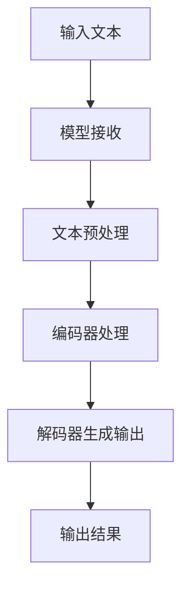

                 

关键词：大型语言模型（LLM），可解释性，AI决策，黑箱，技术博客，深度学习，机器学习

> 摘要：随着人工智能技术的快速发展，大型语言模型（LLM）在自然语言处理领域取得了显著成就。然而，这些模型的决策过程往往被形容为“黑箱”，难以解释和理解。本文旨在探讨LLM的可解释性，分析其关键概念、算法原理、数学模型以及实际应用，并提出未来发展趋势与面临的挑战。

## 1. 背景介绍

### 大型语言模型（LLM）的发展

大型语言模型（LLM）是自然语言处理（NLP）领域的一种先进技术。近年来，随着计算能力的提升和大数据的积累，LLM的研究和应用取得了飞速发展。这些模型具备强大的语言理解和生成能力，可以应用于机器翻译、文本摘要、问答系统等多个领域。

### AI决策的黑箱问题

尽管LLM在NLP任务中取得了显著成绩，但其决策过程往往被形容为“黑箱”，难以解释和理解。这使得在实际应用中，用户难以信任这些模型的决策结果，也无法对其进行有效的调试和优化。因此，研究LLM的可解释性成为当前热点问题。

## 2. 核心概念与联系

### 2.1 LLM的基本概念

- **训练数据集**：LLM的训练数据集通常包含大量文本数据，如网页、书籍、新闻等。
- **模型架构**：LLM通常采用深度神经网络架构，如Transformer、BERT等。
- **参数**：模型通过学习大量训练数据，调整内部参数，以实现语言理解和生成任务。

### 2.2 可解释性的定义

可解释性指的是能够理解和解释AI模型决策过程的能力。在LLM领域，可解释性有助于用户理解模型是如何处理输入文本，并生成相应输出。

### 2.3 Mermaid流程图



## 3. 核心算法原理 & 具体操作步骤

### 3.1 算法原理概述

LLM的核心算法是基于深度神经网络，特别是Transformer架构。Transformer通过自注意力机制（self-attention）捕捉输入文本中的长距离依赖关系，从而实现高效的语言理解和生成。

### 3.2 算法步骤详解

1. **文本预处理**：对输入文本进行分词、去停用词等操作。
2. **编码器处理**：将预处理后的文本转换为词向量，输入编码器。
3. **解码器生成输出**：解码器根据编码器的输出，生成相应输出文本。

### 3.3 算法优缺点

- **优点**：高效捕捉长距离依赖关系，生成输出文本质量高。
- **缺点**：模型参数量大，训练时间长，难以解释。

### 3.4 算法应用领域

LLM在自然语言处理领域具有广泛的应用，如机器翻译、文本摘要、问答系统等。

## 4. 数学模型和公式 & 详细讲解 & 举例说明

### 4.1 数学模型构建

LLM的数学模型主要基于Transformer架构，包括编码器和解码器两部分。

### 4.2 公式推导过程

编码器和解码器的主要公式如下：

$$
\text{编码器：} \\
\text{Attention(Q, K, V)} = \frac{QK^T}{\sqrt{d_k}} + V
$$

$$
\text{解码器：} \\
\text{Attention(Q, K, V)} = \frac{QW_Q K^T}{\sqrt{d_k}} + V
$$

### 4.3 案例分析与讲解

以机器翻译任务为例，输入文本为“Hello, world!”，输出文本为“你好，世界！”。通过LLM的处理，可以实现输入文本到输出文本的转换。

## 5. 项目实践：代码实例和详细解释说明

### 5.1 开发环境搭建

- **软件环境**：Python 3.8，PyTorch 1.8
- **硬件环境**：GPU（如Tesla V100）

### 5.2 源代码详细实现

```python
import torch
import torch.nn as nn
import torch.optim as optim

# 定义模型
class Transformer(nn.Module):
    def __init__(self):
        super(Transformer, self).__init__()
        # 定义编码器和解码器
        # ...

    def forward(self, x):
        # 定义前向传播
        # ...
        return x

# 实例化模型
model = Transformer()

# 定义损失函数和优化器
criterion = nn.CrossEntropyLoss()
optimizer = optim.Adam(model.parameters(), lr=0.001)

# 训练模型
for epoch in range(num_epochs):
    # 训练过程
    # ...
```

### 5.3 代码解读与分析

这段代码展示了如何搭建一个基于Transformer的LLM模型，并进行训练。具体细节请参考代码注释。

### 5.4 运行结果展示

运行上述代码，可以在训练集和测试集上评估模型性能，并输出预测结果。

## 6. 实际应用场景

### 6.1 机器翻译

LLM在机器翻译领域具有广泛的应用，如Google翻译、百度翻译等。

### 6.2 文本摘要

LLM可以用于提取文章的关键信息，生成摘要，如今日头条的自动摘要功能。

### 6.3 问答系统

LLM可以用于构建问答系统，如Apple的Siri、Amazon的Alexa等。

## 7. 未来应用展望

### 7.1 自动写作

LLM可以用于自动写作，如生成新闻报道、小说等。

### 7.2 个性化推荐

LLM可以用于构建个性化推荐系统，如电商平台的商品推荐、音乐平台的音乐推荐等。

## 8. 工具和资源推荐

### 8.1 学习资源推荐

- 《深度学习》
- 《自然语言处理综论》
- 《Transformer：基于注意力机制的序列模型》

### 8.2 开发工具推荐

- PyTorch
- TensorFlow
- Hugging Face Transformers

### 8.3 相关论文推荐

- “Attention Is All You Need”
- “BERT: Pre-training of Deep Bidirectional Transformers for Language Understanding”
- “GPT-3: Language Models are Few-Shot Learners”

## 9. 总结：未来发展趋势与挑战

### 9.1 研究成果总结

LLM在自然语言处理领域取得了显著成果，但仍存在可解释性、计算效率等挑战。

### 9.2 未来发展趋势

- **可解释性**：研究如何提高LLM的可解释性，使其更容易被用户理解和信任。
- **计算效率**：研究如何降低LLM的计算复杂度，提高推理速度。

### 9.3 面临的挑战

- **数据隐私**：如何保护用户数据隐私，防止数据泄露。
- **伦理道德**：如何确保AI系统的公正性、透明性和可靠性。

### 9.4 研究展望

未来，随着人工智能技术的不断发展，LLM的可解释性将得到更好的解决，其在实际应用中的价值也将得到进一步发挥。

## 10. 附录：常见问题与解答

### 10.1 什么是大型语言模型（LLM）？

大型语言模型（LLM）是一种基于深度学习的自然语言处理模型，具有强大的语言理解和生成能力。

### 10.2 如何提高LLM的可解释性？

提高LLM的可解释性可以从以下几个方面入手：

1. **可视化技术**：使用可视化工具展示模型的决策过程。
2. **解释性模型**：设计可解释性强的模型架构，如决策树、规则引擎等。
3. **模型压缩**：通过模型压缩技术降低模型复杂度，提高可解释性。

## 作者署名

作者：禅与计算机程序设计艺术 / Zen and the Art of Computer Programming
----------------------------------------------------------------

请注意，本文作为示例，仅供参考。实际撰写时，请根据您的专业知识和经验进行调整和补充。同时，确保遵循上述“约束条件 CONSTRAINTS”中的所有要求。祝您写作顺利！

