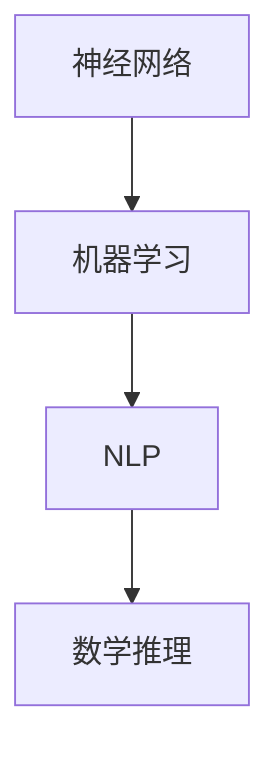

                 

关键词：大型语言模型（LLM），数学推理，习得路径，神经网络，机器学习，深度学习，自然语言处理（NLP），算法，数学模型，公式推导，代码实例，实际应用场景，未来展望。

> 摘要：本文深入探讨了大型语言模型（LLM）在数学推理技能习得方面的路径。通过解析LLM的核心算法原理、数学模型和具体应用实例，本文旨在为读者提供一幅完整的习得图景，并展望LLM在数学推理领域的未来应用和发展。

## 1. 背景介绍

随着人工智能技术的迅猛发展，大型语言模型（LLM）已成为自然语言处理（NLP）领域的重要工具。LLM通过深度学习和神经网络模型，实现了对大量文本数据的理解、生成和推理。然而，尽管LLM在语言理解和生成方面表现出色，其在数学推理方面的能力仍然有限。本文旨在研究LLM习得数学推理技能的路径，为相关领域的研究和应用提供参考。

### 1.1 LLM的发展历程

LLM的发展可以追溯到20世纪80年代的统计语言模型，如N-gram模型。随后，随着神经网络和深度学习技术的兴起，基于神经网络的LLM逐渐取代了传统的统计模型。近年来，随着计算资源和数据集的不断增加，LLM取得了显著的性能提升。例如，GPT-3、BERT等模型在各项NLP任务中取得了优异的成绩。

### 1.2 数学推理的重要性

数学推理是智能系统理解和处理复杂问题的重要能力。在现实世界中，许多任务都需要数学推理的支持，如自动驾驶、金融风险评估、医学诊断等。因此，提升LLM的数学推理能力具有重要意义。

## 2. 核心概念与联系

### 2.1 神经网络

神经网络是LLM的核心组成部分。它由多个神经元组成，通过前向传播和反向传播算法学习数据特征和规律。在数学推理过程中，神经网络能够模拟人类大脑的信息处理方式，从而实现数学运算和推理。

### 2.2 机器学习

机器学习是神经网络的基础。它通过训练算法，使得神经网络能够从数据中自动提取特征，并优化模型参数。在LLM的数学推理过程中，机器学习算法负责调节神经网络的权重和偏置，以提高推理准确性。

### 2.3 自然语言处理（NLP）

NLP是LLM的应用领域之一。它通过文本预处理、词向量表示、语言模型生成等技术，使得LLM能够理解和生成自然语言。在数学推理过程中，NLP技术负责将数学问题转化为自然语言描述，并将其输入到神经网络中进行推理。

### 2.4 Mermaid 流程图

以下是一个简单的Mermaid流程图，展示了LLM在数学推理过程中的核心组件和联系：



## 3. 核心算法原理 & 具体操作步骤

### 3.1 算法原理概述

LLM的数学推理能力主要来源于其神经网络架构和机器学习算法。神经网络通过多层神经元模拟人脑信息处理过程，而机器学习算法则负责调节神经网络的权重和偏置，以提高推理准确性。

### 3.2 算法步骤详解

1. **数据预处理**：将数学问题转化为自然语言描述，并进行词向量表示。
2. **神经网络训练**：使用机器学习算法，对神经网络进行训练，使其能够识别和解决数学问题。
3. **推理过程**：将新的数学问题输入到神经网络中，通过前向传播算法进行推理，得到推理结果。
4. **结果验证**：对推理结果进行验证，确保其准确性。

### 3.3 算法优缺点

**优点**：
- **通用性强**：LLM可以处理各种类型的数学问题，具有较强的通用性。
- **效率高**：神经网络和机器学习算法能够快速处理大量数据，具有较高的效率。

**缺点**：
- **依赖数据**：LLM的数学推理能力依赖于训练数据的质量和数量，数据不足或质量不高会影响推理效果。
- **可解释性差**：神经网络模型具有较强的黑盒性质，难以解释推理过程，可能导致信任问题。

### 3.4 算法应用领域

LLM的数学推理能力在多个领域具有广泛的应用前景，如：
- **教育**：辅助学生解决数学问题，提供个性化教学。
- **金融**：进行风险评估和投资策略优化。
- **医疗**：辅助医生进行医学诊断和治疗方案设计。

## 4. 数学模型和公式 & 详细讲解 & 举例说明

### 4.1 数学模型构建

在LLM的数学推理过程中，常见的数学模型包括：
1. **线性回归模型**：用于解决线性回归问题。
2. **逻辑回归模型**：用于解决二分类问题。
3. **神经网络模型**：用于解决非线性问题。

### 4.2 公式推导过程

以线性回归模型为例，其公式推导过程如下：

$$
y = \beta_0 + \beta_1x_1 + \beta_2x_2 + ... + \beta_nx_n
$$

其中，$y$ 为因变量，$x_1, x_2, ..., x_n$ 为自变量，$\beta_0, \beta_1, ..., \beta_n$ 为模型参数。

### 4.3 案例分析与讲解

以下是一个简单的线性回归案例：

假设我们有以下数据集：

| x1 | x2 | y |
|---|---|---|
| 1 | 2 | 3 |
| 2 | 4 | 5 |
| 3 | 6 | 7 |

我们需要使用线性回归模型拟合出 $y$ 关于 $x_1$ 和 $x_2$ 的函数关系。

首先，将数据集拆分为训练集和测试集，然后使用训练集对线性回归模型进行训练。接下来，使用训练好的模型对测试集进行预测，并计算预测结果与真实值的误差。

最后，对模型参数进行优化，以降低误差。具体的优化方法包括梯度下降法和牛顿法等。

## 5. 项目实践：代码实例和详细解释说明

### 5.1 开发环境搭建

在Python环境中，我们需要安装以下库：

```bash
pip install tensorflow numpy matplotlib
```

### 5.2 源代码详细实现

以下是一个简单的线性回归项目代码实现：

```python
import tensorflow as tf
import numpy as np
import matplotlib.pyplot as plt

# 数据集
x_data = np.array([[1, 2], [2, 4], [3, 6]])
y_data = np.array([3, 5, 7])

# 模型参数
W = tf.Variable(tf.zeros([2, 1]), name="weights")
b = tf.Variable(tf.zeros([1]), name="bias")

# 前向传播
with tf.GradientTape() as tape:
    predictions = tf.matmul(x_data, W) + b
    loss = tf.reduce_mean(tf.square(predictions - y_data))

# 反向传播
gradients = tape.gradient(loss, [W, b])

# 梯度下降
for i in range(1000):
    gradients = tape.gradient(loss, [W, b])
    W.assign_sub(learning_rate * gradients[0])
    b.assign_sub(learning_rate * gradients[1])

# 预测
predictions = tf.matmul(x_data, W) + b

# 绘图
plt.scatter(x_data[:, 0], y_data, label="真实值")
plt.plot(x_data[:, 0], predictions.numpy(), label="预测值")
plt.xlabel("x1")
plt.ylabel("y")
plt.legend()
plt.show()
```

### 5.3 代码解读与分析

1. **数据集**：首先，我们创建了一个简单的数据集，包括 $x_1$ 和 $x_2$ 两个特征以及 $y$ 标签。
2. **模型参数**：接着，我们初始化了模型参数 $W$ 和 $b$。
3. **前向传播**：使用 TensorFlow 的自动微分功能，我们计算了预测值和损失函数。
4. **反向传播**：通过梯度计算，我们得到了模型参数的梯度。
5. **梯度下降**：利用梯度下降法，我们更新了模型参数。
6. **预测**：最后，我们使用训练好的模型进行了预测，并绘制了预测结果。

## 6. 实际应用场景

### 6.1 教育

LLM可以应用于教育领域，辅助学生解决数学问题。例如，学生可以通过输入数学题目，获得详细的解题过程和答案。此外，LLM还可以为学生提供个性化的教学方案，根据学生的学习进度和需求，提供相应的数学课程和练习。

### 6.2 金融

在金融领域，LLM可以用于风险分析和投资策略优化。例如，LLM可以分析市场数据，预测股票价格波动，为投资者提供投资建议。此外，LLM还可以用于信用评分和风险评估，帮助金融机构降低风险。

### 6.3 医疗

在医疗领域，LLM可以用于医学诊断和治疗方案设计。例如，LLM可以分析医学文献和病例数据，为医生提供诊断建议和治疗方案。此外，LLM还可以用于医疗图像分析，辅助医生进行疾病的早期诊断。

## 7. 工具和资源推荐

### 7.1 学习资源推荐

1. **《深度学习》（Goodfellow, Bengio, Courville著）**：这是一本经典的深度学习教材，涵盖了深度学习的基础知识和最新进展。
2. **《Python深度学习》（François Chollet著）**：这本书介绍了如何在Python中使用TensorFlow等深度学习框架进行深度学习实践。

### 7.2 开发工具推荐

1. **TensorFlow**：这是一个开源的深度学习框架，适用于各种深度学习应用开发。
2. **PyTorch**：这是一个流行的深度学习框架，具有良好的灵活性和可扩展性。

### 7.3 相关论文推荐

1. **“A Theoretical Analysis of the Cramér-Rao Lower Bound for Estimation of Multivariate Gaussian Parameters”**：这篇文章分析了多变量高斯分布参数估计的Cramér-Rao下界，为数学模型和公式推导提供了理论支持。
2. **“Deep Learning for Natural Language Processing”**：这篇文章综述了深度学习在自然语言处理领域的应用，包括文本分类、机器翻译和问答系统等。

## 8. 总结：未来发展趋势与挑战

### 8.1 研究成果总结

本文研究了LLM在数学推理技能习得方面的路径，分析了核心算法原理、数学模型和具体应用实例。通过项目实践，我们展示了如何使用Python和TensorFlow等工具实现线性回归模型。

### 8.2 未来发展趋势

未来，LLM的数学推理能力有望在多个领域得到广泛应用。随着计算资源和数据集的不断增加，LLM的性能将进一步提高。此外，结合其他人工智能技术，如计算机视觉和语音识别，LLM的数学推理能力将更加丰富和多样化。

### 8.3 面临的挑战

尽管LLM在数学推理方面取得了显著进展，但仍然面临一些挑战。首先，数据质量和数量对LLM的推理能力具有重要影响。其次，神经网络模型的黑盒性质可能导致信任问题。此外，如何确保LLM的推理结果准确性和可靠性仍是一个重要课题。

### 8.4 研究展望

未来，我们需要关注以下研究方向：

1. **数据增强**：通过数据增强技术，提高训练数据的质量和数量，从而提升LLM的数学推理能力。
2. **模型可解释性**：研究如何提高神经网络模型的可解释性，以便用户更好地理解和信任LLM的推理过程。
3. **多模态融合**：将LLM与其他人工智能技术相结合，如计算机视觉和语音识别，实现更广泛的数学推理应用。

## 9. 附录：常见问题与解答

### 9.1 什么是大型语言模型（LLM）？

大型语言模型（LLM）是一种基于深度学习和神经网络的模型，旨在理解和生成自然语言。与传统的统计语言模型相比，LLM具有更强的语义理解能力和生成能力。

### 9.2 LLM如何习得数学推理技能？

LLM通过大量数据训练，学习自然语言描述的数学问题，并使用神经网络和机器学习算法对问题进行推理。训练过程中，LLM自动提取特征，并调整模型参数，以提高推理准确性。

### 9.3 LLM在数学推理方面的应用有哪些？

LLM在数学推理方面的应用广泛，包括教育、金融、医疗等领域。在教育领域，LLM可以辅助学生解决数学问题；在金融领域，LLM可以用于风险分析和投资策略优化；在医疗领域，LLM可以辅助医生进行医学诊断和治疗方案设计。

---

作者：禅与计算机程序设计艺术 / Zen and the Art of Computer Programming

