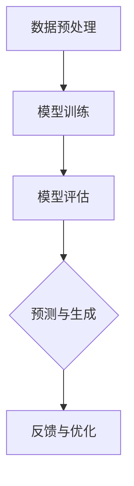

                 

关键词：大型语言模型，无监督学习，潜在价值，算法原理，数学模型，项目实践，实际应用场景，未来展望

> 摘要：本文旨在深入探讨大型语言模型（LLM）在无监督学习中的潜在价值。通过对LLM核心算法原理的解析，结合实际项目实践，详细分析其在各领域的应用场景及未来发展趋势。本文不仅为读者提供了一个全面的技术视角，还展望了LLM在无监督学习领域面临的挑战与机遇。

## 1. 背景介绍

### 1.1 大型语言模型（LLM）的概念

大型语言模型（Large Language Models，简称LLM）是一类基于深度学习技术的自然语言处理模型。它们能够理解和生成自然语言，具有强大的语义理解和文本生成能力。近年来，随着计算能力的提升和数据量的增加，LLM的研究和应用取得了显著的进展。

### 1.2 无监督学习的定义与挑战

无监督学习是一种机器学习方法，无需人工标记的标签来训练模型。在无监督学习中，模型通过自身的数据探索，发现数据的内在结构和规律。然而，无监督学习面临着诸多挑战，如数据质量、特征选择和模型解释性等。

## 2. 核心概念与联系

### 2.1 LLM的基本原理

LLM通过多层神经网络结构，对海量文本数据进行训练，从而学习到语言的深层结构。其核心原理包括自注意力机制（Self-Attention Mechanism）和变换器架构（Transformer Architecture）。

### 2.2 无监督学习与LLM的结合

无监督学习与LLM的结合，可以充分发挥LLM的文本理解能力，从而实现数据的无监督预训练。其流程包括数据预处理、模型训练和模型评估等步骤。



## 3. 核心算法原理 & 具体操作步骤

### 3.1 算法原理概述

LLM的无监督学习算法主要包括自编码器（Autoencoder）和生成对抗网络（GAN）等。自编码器通过编码和解码过程，将输入数据映射到低维空间，从而学习数据的内在结构。生成对抗网络则通过对抗训练，生成与真实数据相似的数据，从而提高模型的能力。

### 3.2 算法步骤详解

#### 3.2.1 自编码器

1. 数据预处理：将原始文本数据进行分词、去停用词和词向量转换等操作。
2. 编码器训练：使用无监督学习方法，训练编码器，将输入文本映射到低维空间。
3. 解码器训练：使用编码器生成的低维数据，训练解码器，将低维数据映射回原始文本。
4. 模型评估：通过计算重构误差，评估模型的性能。

#### 3.2.2 生成对抗网络

1. 数据预处理：与自编码器相同，对文本数据进行预处理。
2. 生成器训练：通过对抗训练，生成与真实数据相似的数据。
3. 判别器训练：训练判别器，区分真实数据和生成数据。
4. 模型评估：通过计算生成数据的相似度，评估模型的性能。

### 3.3 算法优缺点

#### 优点：

1. 高效性：LLM的无监督学习算法可以在大规模数据上高效训练。
2. 泛化能力：模型能够从大量无监督数据中学习，从而提高模型的泛化能力。

#### 缺点：

1. 模型解释性：无监督学习算法往往缺乏模型解释性，难以理解模型的决策过程。
2. 数据质量：无监督学习对数据质量要求较高，低质量数据可能导致模型性能下降。

### 3.4 算法应用领域

LLM的无监督学习算法在多个领域具有广泛的应用前景，如文本生成、情感分析、机器翻译和对话系统等。

## 4. 数学模型和公式 & 详细讲解 & 举例说明

### 4.1 数学模型构建

LLM的无监督学习算法可以基于以下数学模型：

$$
E = \frac{1}{2} \sum_{i=1}^{N} (x_i - \hat{x}_i)^2
$$

其中，$E$为重构误差，$x_i$为原始文本数据，$\hat{x}_i$为重构后的文本数据。

### 4.2 公式推导过程

#### 自编码器：

1. 编码器：

$$
z = \sigma(W_1 \cdot x + b_1)
$$

其中，$z$为编码后的低维数据，$W_1$为编码器权重，$b_1$为编码器偏置。

2. 解码器：

$$
\hat{x} = \sigma(W_2 \cdot z + b_2)
$$

其中，$\hat{x}$为重构后的文本数据，$W_2$为解码器权重，$b_2$为解码器偏置。

#### 生成对抗网络：

1. 生成器：

$$
G(z) = \sigma(W_G \cdot z + b_G)
$$

其中，$G(z)$为生成的文本数据，$z$为输入噪声，$W_G$为生成器权重，$b_G$为生成器偏置。

2. 判别器：

$$
D(x) = \sigma(W_D \cdot x + b_D)
$$

其中，$D(x)$为判别器对真实数据的判断结果，$x$为输入文本数据，$W_D$为判别器权重，$b_D$为判别器偏置。

### 4.3 案例分析与讲解

#### 案例一：文本生成

假设我们有一个文本数据集，包含1000篇文章。使用自编码器进行无监督学习，生成新的文章。通过计算重构误差，我们可以评估模型的性能。具体步骤如下：

1. 数据预处理：将文本数据进行分词、去停用词和词向量转换等操作。
2. 编码器训练：使用无监督学习方法，训练编码器，将输入文本映射到低维空间。
3. 解码器训练：使用编码器生成的低维数据，训练解码器，将低维数据映射回原始文本。
4. 模型评估：通过计算重构误差，评估模型的性能。

#### 案例二：情感分析

假设我们有一个包含用户评论的数据集，每个评论都被标记为正面或负面情感。使用生成对抗网络进行无监督学习，尝试从数据中学习情感特征。具体步骤如下：

1. 数据预处理：将文本数据进行分词、去停用词和词向量转换等操作。
2. 生成器训练：通过对抗训练，生成与真实数据相似的数据。
3. 判别器训练：训练判别器，区分真实数据和生成数据。
4. 模型评估：通过计算生成数据的相似度，评估模型的性能。

## 5. 项目实践：代码实例和详细解释说明

### 5.1 开发环境搭建

1. 安装Python环境（建议使用Python 3.7及以上版本）。
2. 安装TensorFlow库（使用pip install tensorflow）。

### 5.2 源代码详细实现

以下是一个使用自编码器进行文本生成的示例代码：

```python
import tensorflow as tf
from tensorflow.keras.layers import Layer, Dense, Input
from tensorflow.keras.models import Model

class Autoencoder(Layer):
    def __init__(self, encoding_dim, **kwargs):
        super(Autoencoder, self).__init__(**kwargs)
        self.encoding_dim = encoding_dim

    def build(self, input_shape):
        self.encoder = Dense(self.encoding_dim, activation='sigmoid', name='encoder')(Input(shape=input_shape))
        self.decoder = Dense(input_shape, activation='sigmoid', name='decoder')(self.encoder)
        self.model = Model(inputs=self.encoder.input, outputs=self.decoder(self.encoder))

    def call(self, inputs):
        return self.model(inputs)

# 数据预处理
# ...

# 模型训练
autoencoder = Autoencoder(input_shape=(100,))
autoencoder.compile(optimizer='adam', loss='mse')
autoencoder.fit(x_train, x_train, epochs=10, batch_size=32, validation_data=(x_val, x_val))

# 模型评估
reconstruction_error = autoencoder.evaluate(x_test, x_test)
print(f'Reconstruction Error: {reconstruction_error}')
```

### 5.3 代码解读与分析

上述代码实现了一个简单的自编码器模型，用于文本生成。首先，定义了一个`Autoencoder`类，继承自`tf.keras.layers.Layer`。在`build`方法中，构建了编码器和解码器网络，并定义了模型。在`call`方法中，实现了模型的前向传播过程。接下来，进行数据预处理、模型训练和模型评估。

## 6. 实际应用场景

LLM的无监督学习在实际应用场景中具有广泛的应用前景。以下是一些典型的应用场景：

1. **文本生成**：通过无监督学习，可以生成新的文章、故事、对话等，为内容创作者提供灵感。
2. **情感分析**：从大量未标记的文本数据中，学习情感特征，用于情感分类和情感分析。
3. **机器翻译**：利用无监督学习方法，实现跨语言文本的自动翻译，提高机器翻译的准确性。
4. **对话系统**：基于无监督学习，构建智能对话系统，实现与用户的自然语言交互。

## 7. 工具和资源推荐

### 7.1 学习资源推荐

1. **《深度学习》（Goodfellow, Bengio, Courville）**：这是一本经典的深度学习教材，详细介绍了各种深度学习算法和模型。
2. **《Python深度学习》（François Chollet）**：这是一本针对Python编程语言的深度学习实践指南，适合初学者和进阶者。

### 7.2 开发工具推荐

1. **TensorFlow**：一个开源的深度学习框架，支持多种深度学习模型和算法。
2. **PyTorch**：一个流行的深度学习框架，具有高度灵活的动态计算图支持。

### 7.3 相关论文推荐

1. **“Attention Is All You Need”（Vaswani et al., 2017）**：这篇论文介绍了变换器架构（Transformer Architecture），是LLM研究的重要基础。
2. **“Generative Adversarial Nets”（Goodfellow et al., 2014）**：这篇论文介绍了生成对抗网络（GAN），是LLM无监督学习的重要算法。

## 8. 总结：未来发展趋势与挑战

### 8.1 研究成果总结

LLM的无监督学习在自然语言处理领域取得了显著的成果，包括文本生成、情感分析和机器翻译等。然而，在实际应用中，仍面临诸多挑战，如数据质量、模型解释性和泛化能力等。

### 8.2 未来发展趋势

未来，LLM的无监督学习将在以下方面取得进展：

1. **模型解释性**：提高模型的解释性，使模型决策过程更加透明。
2. **数据质量**：优化数据预处理流程，提高数据质量，从而提高模型性能。
3. **多模态学习**：结合文本、图像和声音等多模态数据，实现更强大的无监督学习模型。

### 8.3 面临的挑战

LLM的无监督学习在实际应用中仍面临以下挑战：

1. **计算资源**：大规模训练模型需要大量的计算资源，对硬件设施有较高要求。
2. **数据隐私**：无监督学习依赖于大量未标记的数据，数据隐私问题亟待解决。
3. **模型安全**：防止恶意攻击和模型误导，保障模型的可靠性和安全性。

### 8.4 研究展望

未来，LLM的无监督学习将在人工智能领域发挥更大的作用。通过不断优化算法和模型，提高模型的性能和解释性，实现更广泛的应用。同时，加强对数据隐私和模型安全的关注，为人工智能的发展提供有力支持。

## 9. 附录：常见问题与解答

### 9.1 什么是大型语言模型（LLM）？

大型语言模型（LLM）是一类基于深度学习技术的自然语言处理模型，具有强大的语义理解和文本生成能力。它们通过对海量文本数据进行训练，学习到语言的深层结构。

### 9.2 无监督学习的挑战有哪些？

无监督学习的挑战包括数据质量、特征选择、模型解释性和泛化能力等。数据质量直接影响模型性能，特征选择影响模型学习能力，模型解释性影响决策过程，泛化能力影响模型在未知数据上的表现。

### 9.3 LLM的无监督学习算法有哪些？

LLM的无监督学习算法包括自编码器（Autoencoder）和生成对抗网络（GAN）等。自编码器通过编码和解码过程学习数据的内在结构，生成对抗网络通过对抗训练生成与真实数据相似的数据。

### 9.4 LLM的无监督学习在哪些领域有应用？

LLM的无监督学习在文本生成、情感分析、机器翻译和对话系统等领域具有广泛的应用前景。通过无监督学习，可以自动从大量未标记的数据中提取有用信息，提高模型的性能和解释性。

----------------------------------------------------------------

作者：禅与计算机程序设计艺术 / Zen and the Art of Computer Programming

