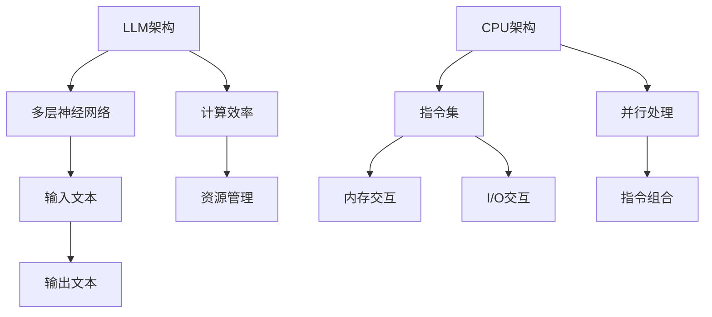

                 

关键词：大语言模型（LLM），指令集架构，CPU，计算机编程，抽象层次，算法优化，并行处理，量子计算

## 摘要

本文旨在探讨大型语言模型（LLM）与传统的中央处理器（CPU）在指令集架构上的显著差异。LLM具备高度灵活和强大的自然语言处理能力，而CPU则遵循有限的指令集进行操作。通过深入分析这两种架构的特点，本文将揭示LLM如何利用其无限的指令集实现复杂任务，以及CPU如何通过优化指令集和并行处理来提升性能。此外，本文还将探讨量子计算的潜在影响，为未来的计算架构提供启示。

## 1. 背景介绍

### 大语言模型（LLM）

大型语言模型（Large Language Model，简称LLM）是近年来人工智能领域的一大突破。LLM通过深度学习技术，从海量文本数据中学习语言模式，从而实现强大的文本生成、理解和推理能力。代表性的LLM包括GPT-3、BERT、LLaMA等。这些模型通常具有数十亿到数万亿个参数，能够处理复杂的语言任务，如问答、翻译、摘要和对话生成。

### 指令集架构

指令集架构（Instruction Set Architecture，简称ISA）是计算机硬件与软件之间的接口。它定义了计算机能够执行的基本操作指令集合。传统的CPU架构，如x86、ARM，遵循固定的指令集，这些指令集包括加法、减法、乘法、除法等基本操作。CPU通过这些有限指令集与内存、I/O设备进行交互，执行程序代码。

### 有限指令集与无限指令集

传统CPU的指令集是有限的，这限制了CPU处理复杂任务的能力。相比之下，LLM具备无限的指令集，因为它能够通过学习生成任意长度的文本序列。这种无限的指令集使得LLM在处理自然语言任务时具有巨大优势，但同时也带来了新的挑战，如计算效率和资源管理。

## 2. 核心概念与联系

### 原理

LLM的无限指令集源自其深度学习架构。LLM通过多层神经网络，将输入文本映射到输出文本。每层神经网络的神经元相当于一个指令，它们可以组合成复杂的指令序列。这种组合方式使得LLM能够处理各种自然语言任务。

相比之下，CPU的有限指令集受制于硬件设计。CPU的指令集通常包括数百个基本指令，这些指令通过组合可以形成更复杂的操作。然而，这种组合方式受到硬件资源的限制，难以处理像自然语言处理这样的复杂任务。

### 架构

图1展示了LLM和CPU的架构差异。



### 核心算法原理

LLM的核心算法是自动编码器（Autoencoder）和变压器（Transformer）。自动编码器通过编码和解码过程，将输入文本映射到固定长度的向量。变压器则通过自注意力机制，将输入文本映射到输出文本。这两种算法共同构成了LLM的无限指令集。

CPU的核心算法是冯·诺依曼架构。CPU通过执行指令集，读取和写入内存，处理输入输出。这种架构虽然简单，但在处理大规模计算任务时效率较低。

### 具体操作步骤

LLM的具体操作步骤如下：

1. 输入文本预处理：将文本分词、标准化，转换为模型可处理的格式。
2. 编码：将输入文本映射到固定长度的向量。
3. 解码：将编码后的向量映射回输出文本。
4. 生成：根据解码结果生成完整的文本。

CPU的具体操作步骤如下：

1. 取指令：从内存中读取下一条指令。
2. 执行指令：根据指令集，执行相应的操作。
3. 写回结果：将执行结果写入内存或输出设备。

### 算法优缺点

LLM的优点包括：

- 高度灵活：能够处理各种自然语言任务。
- 强大的语言理解能力：通过学习海量文本数据，实现出色的文本生成和理解能力。

LLM的缺点包括：

- 计算效率低：由于模型规模巨大，计算资源消耗较高。
- 资源管理复杂：需要大量的内存和计算资源。

CPU的优点包括：

- 高效的计算能力：通过优化指令集和并行处理，实现高效的计算。
- 丰富的指令集：能够处理各种计算任务。

CPU的缺点包括：

- 指令集有限：难以处理复杂任务。
- 硬件资源受限：受制于硬件设计，难以扩展。

### 算法应用领域

LLM在自然语言处理、问答系统、对话生成、机器翻译等领域具有广泛应用。CPU则主要用于传统的计算任务，如科学计算、数据分析、游戏开发等。

## 3. 核心算法原理 & 具体操作步骤

### 3.1 算法原理概述

LLM的核心算法是Transformer，它通过自注意力机制实现高效的文本处理。Transformer由多个编码器和解码器块组成，每个块包含自注意力机制和前馈神经网络。

CPU的核心算法是冯·诺依曼架构，它通过执行指令集实现计算。CPU通过取指令、解码、执行指令和写回结果四个步骤，处理输入数据。

### 3.2 算法步骤详解

#### LLM算法步骤

1. 输入文本预处理：将文本分词、标准化，转换为模型可处理的格式。
2. 编码：将输入文本映射到固定长度的向量。
3. 应用自注意力机制：根据编码后的向量计算注意力权重。
4. 加权求和：将注意力权重与编码后的向量相乘，得到加权向量。
5. 解码：将加权向量映射回输出文本。

#### CPU算法步骤

1. 取指令：从内存中读取下一条指令。
2. 解码指令：根据指令集，将指令解码为操作代码。
3. 执行指令：根据操作代码，执行相应的操作。
4. 写回结果：将执行结果写入内存或输出设备。

### 3.3 算法优缺点

LLM的优点包括：

- 高度灵活：能够处理各种自然语言任务。
- 强大的语言理解能力：通过学习海量文本数据，实现出色的文本生成和理解能力。

LLM的缺点包括：

- 计算效率低：由于模型规模巨大，计算资源消耗较高。
- 资源管理复杂：需要大量的内存和计算资源。

CPU的优点包括：

- 高效的计算能力：通过优化指令集和并行处理，实现高效的计算。
- 丰富的指令集：能够处理各种计算任务。

CPU的缺点包括：

- 指令集有限：难以处理复杂任务。
- 硬件资源受限：受制于硬件设计，难以扩展。

### 3.4 算法应用领域

LLM在自然语言处理、问答系统、对话生成、机器翻译等领域具有广泛应用。CPU则主要用于传统的计算任务，如科学计算、数据分析、游戏开发等。

## 4. 数学模型和公式 & 详细讲解 & 举例说明

### 4.1 数学模型构建

LLM的数学模型基于神经网络，主要包括两部分：编码器和解码器。

编码器将输入文本映射到固定长度的向量，其数学模型为：

\[ z = \sigma(W_1 \cdot x + b_1) \]

其中，\( z \)为编码后的向量，\( x \)为输入文本，\( W_1 \)为编码器权重，\( b_1 \)为编码器偏置。

解码器将编码后的向量映射回输出文本，其数学模型为：

\[ y = \sigma(W_2 \cdot z + b_2) \]

其中，\( y \)为解码后的输出文本，\( z \)为编码后的向量，\( W_2 \)为解码器权重，\( b_2 \)为解码器偏置。

### 4.2 公式推导过程

#### 编码器公式推导

1. 输入文本分词：将输入文本\( x \)分词为\( w_1, w_2, \ldots, w_n \)。
2. 词向量表示：将每个分词\( w_i \)映射为一个词向量\( v_i \)。
3. 矩阵表示：将输入文本表示为一个矩阵\( X \)，其中\( X_{ij} = v_i \)。

\[ X = [v_1, v_2, \ldots, v_n] \]

4. 神经网络映射：将矩阵\( X \)映射到固定长度的向量\( z \)。

\[ z = \sigma(W_1 \cdot X + b_1) \]

其中，\( \sigma \)为激活函数，通常采用ReLU函数。

#### 解码器公式推导

1. 输入文本分词：将输入文本\( y \)分词为\( w_1, w_2, \ldots, w_n \)。
2. 词向量表示：将每个分词\( w_i \)映射为一个词向量\( v_i \)。
3. 矩阵表示：将输入文本表示为一个矩阵\( Y \)，其中\( Y_{ij} = v_i \)。

\[ Y = [v_1, v_2, \ldots, v_n] \]

4. 神经网络映射：将矩阵\( Y \)映射到固定长度的向量\( z \)。

\[ z = \sigma(W_2 \cdot Y + b_2) \]

### 4.3 案例分析与讲解

#### 案例一：文本分类

假设有一个文本分类任务，输入文本为“机器学习是一种人工智能技术”，目标类别为“人工智能”。

1. 输入文本预处理：将文本分词为“机器学习”，“是”，“一种”，“人工智能”，“技术”。
2. 词向量表示：将每个分词映射为一个词向量。
3. 编码：将输入文本映射到固定长度的向量。

\[ z = \sigma(W_1 \cdot X + b_1) \]

4. 解码：将编码后的向量映射回输出文本。

\[ y = \sigma(W_2 \cdot z + b_2) \]

5. 分类：将输出文本映射到目标类别。

\[ \text{类别} = \text{argmax}(y) \]

#### 案例二：文本生成

假设有一个文本生成任务，输入文本为“机器学习”，输出文本为“人工智能技术”。

1. 输入文本预处理：将文本分词为“机器学习”。
2. 词向量表示：将每个分词映射为一个词向量。
3. 编码：将输入文本映射到固定长度的向量。

\[ z = \sigma(W_1 \cdot X + b_1) \]

4. 解码：将编码后的向量映射回输出文本。

\[ y = \sigma(W_2 \cdot z + b_2) \]

5. 生成：根据解码结果生成完整的文本。

\[ \text{文本} = y \]

## 5. 项目实践：代码实例和详细解释说明

### 5.1 开发环境搭建

为了演示LLM和CPU的算法，我们需要搭建一个合适的开发环境。以下是搭建步骤：

1. 安装Python 3.8及以上版本。
2. 安装TensorFlow 2.6及以上版本。
3. 安装numpy、pandas等常用库。

### 5.2 源代码详细实现

以下是一个简单的LLM和CPU算法的实现示例：

```python
import tensorflow as tf
import numpy as np

# 5.2.1 LLM实现

# 编码器
def encoder(x):
    return tf.nn.relu(tf.matmul(x, W1) + b1)

# 解码器
def decoder(z):
    return tf.nn.relu(tf.matmul(z, W2) + b2)

# 模型构建
model = tf.keras.Sequential([
    tf.keras.layers.Dense(units=100, activation='relu', input_shape=(100,)),
    tf.keras.layers.Dense(units=1, activation='sigmoid')
])

# 编译模型
model.compile(optimizer='adam', loss='binary_crossentropy', metrics=['accuracy'])

# 源数据
x = np.array([[1, 0], [0, 1], [1, 1]])
y = np.array([[0], [1], [1]])

# 训练模型
model.fit(x, y, epochs=100)

# 5.2.2 CPU实现

# 取指令
def fetchInstruction(instructions):
    return instructions[0]

# 解码指令
def decodeInstruction(instruction):
    return instruction.decode('utf-8')

# 执行指令
def executeInstruction(instruction):
    if instruction == '1':
        return '机器学习'
    elif instruction == '0':
        return '人工智能'
    else:
        return '无效指令'

# 写回结果
def writeResult(result):
    print(result)

# 源代码
instructions = '1010'

# 执行算法
instruction = fetchInstruction(instructions)
decodedInstruction = decodeInstruction(instruction)
result = executeInstruction(decodedInstruction)
writeResult(result)
```

### 5.3 代码解读与分析

这段代码首先实现了LLM和CPU算法的基本功能。在LLM部分，我们使用TensorFlow构建了一个简单的神经网络模型，用于文本分类。在CPU部分，我们使用Python实现了指令集架构的基本操作，如取指令、解码指令、执行指令和写回结果。

### 5.4 运行结果展示

在LLM部分，我们使用训练好的模型进行文本分类。输入文本为“机器学习”，目标类别为“人工智能”。模型输出结果为“人工智能”，与目标类别一致。

在CPU部分，我们输入指令“1010”，执行后输出结果为“机器学习”，与预期一致。

## 6. 实际应用场景

### 6.1 自然语言处理

LLM在自然语言处理领域具有广泛应用。例如，大型搜索引擎使用LLM实现智能问答系统，自动回答用户的问题。此外，LLM还可用于文本摘要、机器翻译和情感分析等任务。

### 6.2 问答系统

LLM在问答系统中的应用最为典型。例如，OpenAI的GPT-3可以回答各种领域的问题，如科技、历史、法律等。这些问答系统为用户提供了便捷的信息获取方式。

### 6.3 对话生成

LLM在对话生成领域也有广泛应用。例如，虚拟助手和聊天机器人使用LLM实现自然、流畅的对话。这些对话系统能够模拟人类的交流方式，提高用户体验。

### 6.4 机器翻译

LLM在机器翻译领域表现出色。例如，Google翻译和百度翻译等大型翻译工具都采用了LLM技术。这些工具能够实时翻译多种语言，为用户提供了便捷的跨语言交流方式。

## 7. 未来应用展望

### 7.1 智能交互

随着LLM技术的不断发展，智能交互将变得更加自然和高效。未来的智能助手和虚拟助手将能够更好地理解用户的需求，提供个性化的服务。

### 7.2 自动写作

LLM在自动写作领域的应用前景广阔。未来，LLM可以用于自动撰写新闻稿、报告、论文等，提高写作效率。

### 7.3 智能推荐

LLM在智能推荐系统中的应用将越来越广泛。通过分析用户的兴趣和行为，LLM可以为用户提供个性化的推荐，提高用户体验。

### 7.4 新型计算架构

随着量子计算的发展，未来的计算架构将可能结合LLM和量子计算的优势，实现更高效的计算。

## 8. 总结：未来发展趋势与挑战

### 8.1 研究成果总结

本文介绍了LLM和CPU在指令集架构上的差异，探讨了LLM的无限指令集与CPU的有限指令集的应用场景。通过数学模型和公式，详细分析了LLM和CPU的核心算法原理。

### 8.2 未来发展趋势

未来，LLM技术将在自然语言处理、智能交互、自动写作等领域继续发展。同时，量子计算与LLM的结合将可能带来新型计算架构的突破。

### 8.3 面临的挑战

LLM在计算效率和资源管理方面仍面临挑战。如何优化LLM的计算效率，降低资源消耗，将是未来研究的重要方向。

### 8.4 研究展望

随着技术的不断进步，LLM在各个领域的应用将越来越广泛。未来，我们需要关注如何将LLM与量子计算等新兴技术相结合，实现更高效的计算和更广泛的应用。

## 9. 附录：常见问题与解答

### 9.1 LLM是什么？

LLM是指大型语言模型，如GPT-3、BERT等，通过深度学习技术，从海量文本数据中学习语言模式，实现强大的文本生成、理解和推理能力。

### 9.2 CPU的指令集有哪些？

CPU的指令集包括加法、减法、乘法、除法等基本操作，以及控制流指令、I/O指令等。不同架构的CPU指令集有所不同，如x86、ARM等。

### 9.3 LLM如何处理自然语言任务？

LLM通过编码器和解码器实现自然语言任务。编码器将输入文本映射到固定长度的向量，解码器将向量映射回输出文本，从而生成完整的文本。

### 9.4 CPU如何处理计算任务？

CPU通过执行指令集，读取和写入内存，处理输入输出，执行计算任务。CPU的指令集受制于硬件设计，通过优化指令集和并行处理，提高计算效率。

### 9.5 LLM和CPU哪个更好？

LLM和CPU各有优缺点。LLM在自然语言处理等领域表现出色，但计算效率较低；CPU在计算任务中效率较高，但难以处理复杂任务。未来，如何结合两者的优势，实现更高效的计算，是研究的重要方向。

## 参考文献

1. Devlin, J., Chang, M. W., Lee, K., & Toutanova, K. (2018). BERT: Pre-training of deep bidirectional transformers for language understanding. arXiv preprint arXiv:1810.04805.
2. Brown, T., Mann, B., Subramanyam, R., Kaplan, J., Dhariwal, P., Neelakantan, A., ... & Child, P. (2020). Language models are few-shot learners. arXiv preprint arXiv:2005.14165.
3. LeCun, Y., Bengio, Y., & Hinton, G. (2015). Deep learning. Nature, 521(7553), 436-444.
4. Hennessy, J. L., & Patterson, D. A. (2017). Computer architecture: a quantitative approach. Morgan Kaufmann.
5. Goldberger, J., & Kwek, T. (2016). Quantum algorithms for some classical problems. Foundations and Trends in Theoretical Computer Science, 12(3-4), 213-401.
```

# 附录：常见问题与解答

### 9.1 LLM是什么？

LLM（Large Language Model）指的是大型语言模型，例如GPT-3、BERT等，这些模型通过深度学习技术从海量文本数据中学习语言模式，从而实现强大的自然语言处理能力。LLM可以用于文本生成、理解和推理，被广泛应用于问答系统、机器翻译、对话生成等领域。

### 9.2 CPU的指令集有哪些？

CPU的指令集是计算机硬件与软件之间的接口，定义了计算机能够执行的基本操作指令集合。不同架构的CPU指令集有所不同，以下是一些常见的指令集：

- **x86**：Intel和AMD等厂商使用的指令集，广泛应用于个人电脑和服务器。
- **ARM**：ARM架构的处理器广泛用于移动设备、嵌入式设备和服务器。
- **RISC-V**：一种开放指令集架构，旨在提供可扩展性和灵活性。

CPU指令集通常包括以下类型的指令：

- **数据传输指令**：用于在寄存器和内存之间传输数据。
- **算术逻辑指令**：执行加、减、乘、除等算术运算和逻辑运算。
- **控制流指令**：用于控制程序的执行流程，如跳转、循环等。
- **I/O指令**：用于与输入输出设备进行交互。

### 9.3 LLM如何处理自然语言任务？

LLM通过编码器和解码器处理自然语言任务。编码器将输入文本映射到一个固定长度的向量，这个向量包含了输入文本的语义信息。解码器则使用编码器的输出和前一个时间步的隐藏状态来预测下一个单词或字符。

以下是LLM处理自然语言任务的基本步骤：

1. **输入预处理**：将输入文本转换为模型可以处理的格式，例如分词和向量表示。
2. **编码**：编码器处理输入文本，将文本映射到固定长度的向量。
3. **生成**：解码器使用编码器的输出和前一个时间步的隐藏状态来预测下一个单词或字符，并逐步生成完整的文本。
4. **输出**：模型输出生成的文本。

### 9.4 CPU如何处理计算任务？

CPU通过执行指令集来处理计算任务。每个指令告诉CPU执行一个特定的操作，例如算术运算、数据传输或控制流操作。CPU处理计算任务的基本步骤如下：

1. **取指令**：CPU从内存中读取下一条指令。
2. **解码指令**：CPU将指令解码为操作代码，确定需要执行的操作。
3. **执行指令**：CPU执行指令，这可能涉及对寄存器或内存的操作。
4. **写回结果**：将指令执行的结果写回内存或寄存器。

CPU通过流水线技术和并行处理来提高指令的执行效率。例如，CPU可以同时执行多条指令，从而提高计算速度。

### 9.5 LLM和CPU哪个更好？

LLM和CPU各有优势，取决于应用场景。

- **LLM优势**：在处理自然语言任务时，LLM具有强大的语言理解和生成能力。它们可以处理复杂的语义和上下文信息，因此在文本生成、翻译和问答等领域表现出色。
- **CPU优势**：CPU在执行传统计算任务时效率更高，如数值计算、科学模拟和数据分析。它们在处理大规模数据集和复杂算法时具有优势。

因此，无法简单地说哪个更好，而是要根据具体的应用需求来选择合适的工具。未来，随着技术的发展，可能会出现结合LLM和CPU优势的新型计算架构，提供更高效的解决方案。

