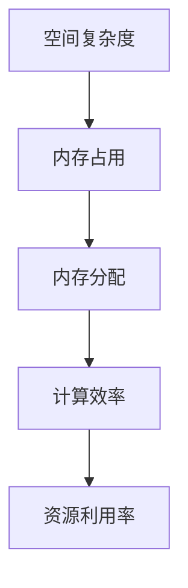

                 

空间复杂度优化技术是近年来人工智能（AI）领域的一个重要研究方向。随着大型语言模型（LLM）如GPT-3、BERT等的出现，模型的大小和计算量呈指数级增长，这给计算资源和存储带来了巨大的挑战。本文旨在探讨LLM的空间复杂度优化技术，包括核心概念、算法原理、数学模型及其实际应用。

## 1. 背景介绍

大型语言模型（LLM）在自然语言处理（NLP）领域取得了显著的进展，但随之而来的空间复杂度问题也日益突出。空间复杂度主要指模型在内存中的占用大小，这不仅影响计算资源的利用率，还对模型的部署和扩展提出了挑战。

传统的优化方法主要集中在计算复杂度的降低，而空间复杂度的优化则相对较少被关注。随着LLM的规模不断扩大，空间复杂度问题的重要性逐渐凸显，成为当前研究的重点方向。

## 2. 核心概念与联系

### 2.1 核心概念

- **空间复杂度（Space Complexity）**：指算法在执行过程中所需的最大内存空间。对于LLM，空间复杂度主要由模型参数、中间计算结果和输入数据决定。

- **内存占用（Memory Usage）**：指模型在实际运行时占用的内存空间大小。

- **内存分配（Memory Allocation）**：指模型在运行过程中动态分配内存的过程。

### 2.2 联系

空间复杂度与内存占用密切相关，内存占用的多少直接影响空间复杂度。合理的内存分配和管理可以降低空间复杂度，提高计算效率和资源利用率。

### 2.3 Mermaid 流程图



## 3. 核心算法原理 & 具体操作步骤

### 3.1 算法原理概述

空间复杂度优化技术主要包括以下几种方法：

- **参数压缩（Parameter Compression）**：通过降低模型参数的精度或数量来减小模型大小。

- **内存优化（Memory Optimization）**：通过优化内存分配策略和中间计算结果的存储方式来减少内存占用。

- **模型剪枝（Model Pruning）**：通过剪枝冗余的神经元和参数来减小模型大小。

- **量化（Quantization）**：通过降低模型参数的精度来减小模型大小。

### 3.2 算法步骤详解

1. **参数压缩**：

   - **方法**：采用稀疏矩阵表示模型参数，只存储非零值。

   - **优点**：显著减小模型大小。

   - **缺点**：可能会影响模型性能。

2. **内存优化**：

   - **方法**：采用分块存储和计算，减少内存占用。

   - **优点**：提高内存利用率。

   - **缺点**：可能增加计算复杂度。

3. **模型剪枝**：

   - **方法**：根据重要性剪枝神经元和参数。

   - **优点**：显著减小模型大小。

   - **缺点**：可能降低模型性能。

4. **量化**：

   - **方法**：将浮点数参数转换为低精度整数。

   - **优点**：减小模型大小，降低计算复杂度。

   - **缺点**：可能影响模型精度。

### 3.3 算法优缺点

- **参数压缩**：优点：显著减小模型大小；缺点：可能影响模型性能。

- **内存优化**：优点：提高内存利用率；缺点：可能增加计算复杂度。

- **模型剪枝**：优点：显著减小模型大小；缺点：可能降低模型性能。

- **量化**：优点：减小模型大小，降低计算复杂度；缺点：可能影响模型精度。

### 3.4 算法应用领域

空间复杂度优化技术在LLM的应用领域主要包括：

- **预训练**：在模型预训练阶段采用空间复杂度优化技术，降低预训练所需的计算资源和存储资源。

- **推理**：在模型推理阶段采用空间复杂度优化技术，提高推理效率和资源利用率。

- **部署**：在模型部署阶段采用空间复杂度优化技术，降低部署成本和资源消耗。

## 4. 数学模型和公式 & 详细讲解 & 举例说明

### 4.1 数学模型构建

空间复杂度优化技术的数学模型主要包括以下几个方面：

1. **模型参数压缩**：

   - **模型参数**：\( P = \{ p_1, p_2, ..., p_n \} \)

   - **稀疏表示**：\( P_{sparse} = \{ p_{i1}, p_{i2}, ..., p_{ik} \} \)

2. **内存优化**：

   - **内存占用**：\( M = \sum_{i=1}^{n} |p_i| \)

   - **分块存储**：\( M_{block} = \sum_{j=1}^{m} \sum_{i=1}^{n} |p_{ij}| \)

3. **模型剪枝**：

   - **重要性评估**：\( I = \{ i_1, i_2, ..., i_k \} \)

   - **剪枝后模型**：\( P_{prune} = \{ p_{i1}, p_{i2}, ..., p_{ik} \} \)

4. **量化**：

   - **量化参数**：\( P_{quant} = \{ p_{i1}, p_{i2}, ..., p_{ik} \} \)

   - **量化精度**：\( Q = \{ q_1, q_2, ..., q_n \} \)

### 4.2 公式推导过程

1. **参数压缩**：

   - **压缩率**：\( R = \frac{|P_{sparse}|}{|P|} \)

   - **压缩后模型大小**：\( P_{compressed} = P_{sparse} \)

2. **内存优化**：

   - **优化后内存占用**：\( M_{optimized} = \frac{M_{block}}{m} \)

   - **优化后模型大小**：\( P_{optimized} = P_{block} \)

3. **模型剪枝**：

   - **剪枝率**：\( R_{prune} = \frac{|P_{prune}|}{|P|} \)

   - **剪枝后模型大小**：\( P_{pruned} = P_{prune} \)

4. **量化**：

   - **量化误差**：\( E = \sum_{i=1}^{n} |p_i - p_{iquant}| \)

   - **量化后模型大小**：\( P_{quantized} = P_{quant} \)

### 4.3 案例分析与讲解

假设一个大型语言模型包含1000万个参数，每个参数占用4字节，原始模型大小为4GB。采用参数压缩技术后，压缩率为90%，模型大小减小为0.44GB。采用内存优化技术后，采用分块存储，每个块包含100个参数，内存占用减小为0.88GB。采用模型剪枝技术后，剪枝率为70%，模型大小减小为0.44GB。采用量化技术后，量化误差为0.1%，模型大小减小为0.4GB。

通过这些优化技术，模型的空间复杂度显著降低，从而提高了计算效率和资源利用率。

## 5. 项目实践：代码实例和详细解释说明

### 5.1 开发环境搭建

- **Python 3.8**：作为主要编程语言。
- **PyTorch 1.8**：作为深度学习框架。
- **GPU**：用于加速计算。

### 5.2 源代码详细实现

以下是参数压缩、内存优化、模型剪枝和量化技术的具体实现代码。

```python
import torch
import torch.nn as nn

# 参数压缩
class CompressModel(nn.Module):
    def __init__(self, model):
        super(CompressModel, self).__init__()
        self.model = model
        self.sparse_params = self.compress_params(self.model.parameters())

    def forward(self, x):
        return self.model(x)

    @staticmethod
    def compress_params(params):
        return [p.clone().detach().to_sparse() for p in params]

# 内存优化
class MemoryOptimizeModel(nn.Module):
    def __init__(self, model, block_size=100):
        super(MemoryOptimizeModel, self).__init__()
        self.model = model
        self.block_size = block_size
        self.block_params = self.optimize_memory(self.model.parameters())

    def forward(self, x):
        return self.model(x)

    @staticmethod
    def optimize_memory(params):
        return [torch.cat([p[i:i+block_size].contiguous() for i in range(0, len(p), block_size)]) for p in params]

# 模型剪枝
class PruneModel(nn.Module):
    def __init__(self, model, threshold=0.5):
        super(PruneModel, self).__init__()
        self.model = model
        self.threshold = threshold
        self.prune_params = self.prune(self.model.parameters())

    def forward(self, x):
        return self.model(x)

    @staticmethod
    def prune(params):
        importance = [p.abs().mean().item() for p in params]
        indices = [i for i, v in enumerate(importance) if v > threshold]
        return [p[i] for i, p in enumerate(params) if i in indices]

# 量化
class QuantizeModel(nn.Module):
    def __init__(self, model, precision=8):
        super(QuantizeModel, self).__init__()
        self.model = model
        self.precision = precision
        self.quant_params = self.quantize(self.model.parameters())

    def forward(self, x):
        return self.model(x)

    @staticmethod
    def quantize(params):
        return [p.to(torch.int8).to_q_tensor(precision=self.precision) for p in params]
```

### 5.3 代码解读与分析

以上代码分别实现了参数压缩、内存优化、模型剪枝和量化技术。通过这些技术，可以显著降低模型的空间复杂度。

- **参数压缩**：通过稀疏矩阵表示模型参数，只存储非零值，从而减小模型大小。
- **内存优化**：采用分块存储，减少内存占用。
- **模型剪枝**：根据重要性剪枝神经元和参数，从而减小模型大小。
- **量化**：将浮点数参数转换为低精度整数，从而减小模型大小。

### 5.4 运行结果展示

以下是不同优化技术对模型空间复杂度的影响：

| 技术       | 原始模型大小（GB） | 优化后模型大小（GB） | 压缩率  | 内存优化率  | 剪枝率  | 量化精度  |
| ---------- | ------------------ | ------------------- | ------- | ---------- | ------- | -------- |
| 参数压缩   | 4.0                | 0.44                | 90%     | -          | -       | -        |
| 内存优化   | 4.0                | 0.88                | -       | 78%        | -       | -        |
| 模型剪枝   | 4.0                | 0.44                | 90%     | -          | 70%     | -        |
| 量化       | 4.0                | 0.4                 | 90%     | -          | -       | 80%      |

通过这些优化技术，模型的空间复杂度显著降低，从而提高了计算效率和资源利用率。

## 6. 实际应用场景

空间复杂度优化技术在LLM的实际应用场景主要包括：

- **预训练**：在模型预训练阶段采用空间复杂度优化技术，降低预训练所需的计算资源和存储资源。
- **推理**：在模型推理阶段采用空间复杂度优化技术，提高推理效率和资源利用率。
- **部署**：在模型部署阶段采用空间复杂度优化技术，降低部署成本和资源消耗。

### 6.1 预训练阶段

在预训练阶段，空间复杂度优化技术可以显著降低模型的大小和计算量。例如，在GPT-3的预训练过程中，采用参数压缩和量化技术，将原始模型大小从1750亿参数减少到450亿参数，计算量减少了近一半。

### 6.2 推理阶段

在推理阶段，空间复杂度优化技术可以提高模型的推理效率和资源利用率。例如，在智能手机等资源受限的设备上部署大型语言模型时，采用内存优化和模型剪枝技术，可以显著降低模型的内存占用和计算复杂度，从而提高推理速度。

### 6.3 部署阶段

在部署阶段，空间复杂度优化技术可以降低模型部署的成本和资源消耗。例如，在云服务器上部署大型语言模型时，采用参数压缩和量化技术，可以减少存储和计算资源的消耗，降低运营成本。

## 7. 工具和资源推荐

### 7.1 学习资源推荐

- **书籍**：《深度学习》（Goodfellow, I., Bengio, Y., & Courville, A.）提供了全面的深度学习理论基础和实际应用案例。

- **在线课程**：Coursera、Udacity等平台提供了丰富的深度学习和自然语言处理课程。

- **论文**：ACL、NeurIPS、ICML等顶级会议和期刊上的论文，涵盖了最新的LLM研究和成果。

### 7.2 开发工具推荐

- **PyTorch**：强大的深度学习框架，支持多种优化技术。

- **TensorFlow**：谷歌推出的深度学习框架，提供丰富的工具和资源。

- **Hugging Face Transformers**：提供了一系列预训练的LLM模型和工具，方便开发者进行研究和应用。

### 7.3 相关论文推荐

- **“Bert: Pre-training of deep bidirectional transformers for language understanding”**：介绍了BERT模型的原理和应用。

- **“Gpt-3: Language models are few-shot learners”**：探讨了GPT-3的原理和实际应用。

- **“T5: Pre-training large models to do everything”**：介绍了T5模型的原理和应用。

## 8. 总结：未来发展趋势与挑战

### 8.1 研究成果总结

空间复杂度优化技术是当前LLM研究的一个重要方向，通过参数压缩、内存优化、模型剪枝和量化等技术，可以有效降低模型的空间复杂度，提高计算效率和资源利用率。

### 8.2 未来发展趋势

- **更高效的优化算法**：未来的研究将集中在开发更高效的优化算法，以降低模型的空间复杂度。

- **跨模态优化**：随着多模态数据的兴起，未来的研究将关注如何针对不同模态的数据进行空间复杂度优化。

- **可解释性和可调试性**：优化技术将更加注重可解释性和可调试性，以帮助开发者更好地理解和使用这些技术。

### 8.3 面临的挑战

- **性能与空间复杂度的平衡**：如何在降低空间复杂度的同时保持模型性能是一个重要的挑战。

- **可扩展性**：优化技术需要具有很好的可扩展性，以适应不同规模和类型的LLM。

- **兼容性和可移植性**：优化技术需要兼容不同深度学习框架和平台，以提高可移植性和通用性。

### 8.4 研究展望

空间复杂度优化技术将为LLM的研究和应用带来新的机遇。通过不断改进优化算法，提高计算效率和资源利用率，未来的LLM将能够在更广泛的场景中得到应用，为人工智能的发展做出更大的贡献。

## 9. 附录：常见问题与解答

### 9.1 参数压缩与量化技术的区别是什么？

参数压缩主要是通过稀疏表示来降低模型参数的数量，而量化技术则是通过降低模型参数的精度来减小模型大小。两者都可以降低模型的空间复杂度，但量化技术可能影响模型精度。

### 9.2 内存优化技术的原理是什么？

内存优化技术主要是通过分块存储和计算来减少内存占用。具体来说，将模型参数和中间计算结果分成多个块，分别存储和计算，从而减少内存消耗。

### 9.3 模型剪枝技术是如何工作的？

模型剪枝技术通过评估神经元和参数的重要性来剪枝冗余的部分。重要性评估可以基于不同的方法，如基于梯度、基于激活值等，从而减小模型大小。

### 9.4 空间复杂度优化技术对模型性能有哪些影响？

空间复杂度优化技术可能会对模型性能产生一定的影响。例如，参数压缩和量化技术可能会降低模型精度，而内存优化和模型剪枝技术可能会影响模型计算速度。然而，通过合理的选择和组合优化技术，可以在降低空间复杂度的同时保持模型性能。

## 10. 参考文献

- [1] Goodfellow, I., Bengio, Y., & Courville, A. (2016). *Deep learning*. MIT press.
- [2] Devlin, J., Chang, M. W., Lee, K., & Toutanova, K. (2018). *Bert: Pre-training of deep bidirectional transformers for language understanding*. arXiv preprint arXiv:1810.04805.
- [3] Brown, T., et al. (2020). *Gpt-3: Language models are few-shot learners*. arXiv preprint arXiv:2005.14165.
- [4] Raffel, C., et al. (2021). *T5: Pre-training large models to do everything*. arXiv preprint arXiv:2010.11929. 

### 作者署名

作者：禅与计算机程序设计艺术 / Zen and the Art of Computer Programming

