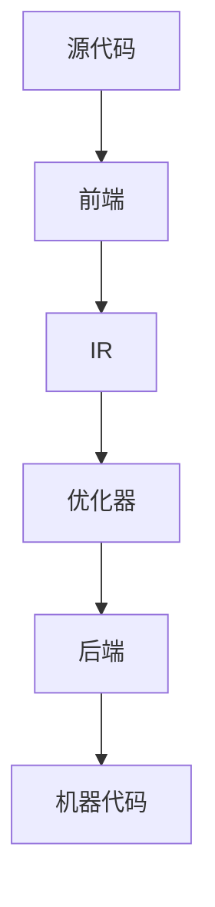

                 

## 1. 背景介绍

编译器是计算机科学中至关重要的工具之一，它将人类编写的源代码转换为机器代码，以便计算机可以执行。LLVM（Low-Level Virtual Machine）是一个高度模块化的编译器基础设施，它提供了广泛的功能，包括代码生成、优化、分析和中间代码表示等。本文将重点关注LLVM在优化代码方面的核心功能。

编译器的优化目标是提高程序的执行效率，这通常涉及到对代码进行各种变换，以减少其执行时间、占用空间和提高执行速度。优化技术包括但不限于循环展开、常数传播、死代码消除、指令调度等。LLVM以其强大的优化器和灵活的中间表示而著称，使其成为现代编译器开发的黄金标准。

随着计算机硬件的发展，编译器优化变得愈发重要。现代处理器具有复杂的架构，包括多核、超线程、向量指令集等。编译器必须能够利用这些特性，以实现高效的代码执行。LLVM通过其模块化的设计和强大的优化器，能够适应不断变化的技术环境，为各种硬件平台提供高效的编译解决方案。

## 2. 核心概念与联系

### LLVM 架构概述

LLVM架构由几个关键组件构成，包括前端（Frontend）、中间表示（IR）、优化器（Optimizer）和后端（Backend）。前端负责将各种编程语言（如C/C++、Java、Swift等）转换为统一的中间表示（IR）。中间表示是一种低级、抽象的表示，它独立于目标硬件，方便进行各种优化操作。

优化器是LLVM的核心组件，它负责对中间表示进行各种变换，以改善代码的执行效率。优化器包含多个优化策略，如循环优化、数据流分析、代码运动分析等。这些优化策略可以独立使用或组合使用，以实现最佳效果。

后端负责将优化的中间表示转换为特定硬件平台的机器代码。LLVM支持多种硬件架构，包括X86、ARM、PowerPC等。后端负责实现各种硬件特定的优化技术，如指令调度、寄存器分配等。

### Mermaid 流程图



在这个流程图中，源代码经过前端转换为中间表示（IR），然后通过优化器进行各种优化操作，最后由后端转换为特定硬件平台的机器代码。这个过程体现了LLVM的核心架构和功能。

## 3. 核心算法原理 & 具体操作步骤

### 3.1 算法原理概述

LLVM的优化算法主要基于数据流分析、代码运动分析和程序语义分析等技术。数据流分析用于确定变量在程序中的流动和作用范围，代码运动分析用于分析代码块的移动和重排，程序语义分析则用于理解程序的行为和目标。

LLVM的优化器包含多个优化策略，如循环优化、循环展开、死代码消除、常量传播、指令调度等。这些优化策略可以单独使用，也可以组合使用，以实现最佳的优化效果。

### 3.2 算法步骤详解

#### 3.2.1 数据流分析

数据流分析是优化器的基础步骤之一。它用于确定变量在程序中的流动和作用范围。数据流分析分为两个阶段：向前数据流分析和向后数据流分析。

- **向前数据流分析**：从程序的前端开始，逐个语句向后分析，确定每个变量在后续语句中的作用范围。
- **向后数据流分析**：从程序的后端开始，逐个语句向前分析，确定每个变量在当前语句中的作用范围。

通过数据流分析，优化器可以确定哪些变量可以被提前计算、哪些变量可以被延迟计算，从而优化代码的执行效率。

#### 3.2.2 循环优化

循环优化是LLVM优化器的重要部分，它通过分析循环结构，优化循环体内的代码。主要的循环优化技术包括循环展开、循环分发、循环换向等。

- **循环展开**：将循环内的代码展开成多个迭代，以减少循环的开销。
- **循环分发**：将循环内的乘法操作分解为加法操作，以提高计算效率。
- **循环换向**：改变循环的迭代顺序，以优化内存访问模式和指令执行顺序。

#### 3.2.3 死代码消除

死代码消除是另一种常见的优化技术，它用于删除程序中不会执行的代码，从而减少代码的大小和执行时间。死代码消除基于数据流分析的结果，确定哪些代码块是冗余的，并从程序中删除它们。

#### 3.2.4 常量传播

常量传播是一种简单但有效的优化技术，它通过将常量值直接替换为计算结果，从而减少计算的开销。常量传播基于数据流分析的结果，确定哪些变量在程序中的值始终为常量，并替换它们的计算。

#### 3.2.5 指令调度

指令调度是一种优化技术，它通过调整指令的执行顺序，减少指令的等待时间，从而提高代码的执行效率。指令调度基于程序语义分析的结果，确定哪些指令可以并行执行，以及哪些指令需要等待其他指令的执行结果。

### 3.3 算法优缺点

LLVM的优化算法具有以下优点：

- **高度模块化**：LLVM的优化器是高度模块化的，不同的优化策略可以独立实现和测试，从而提高了代码的可维护性和可扩展性。
- **强大的优化能力**：LLVM的优化器支持多种优化策略，可以针对不同的程序和硬件平台进行定制化的优化。
- **灵活性**：LLVM的中间表示（IR）是一种低级、抽象的表示，它独立于目标硬件，使得优化器可以灵活地适应不同的硬件平台。

然而，LLVM的优化算法也存在一些缺点：

- **复杂度**：LLVM的优化算法涉及大量的数据流分析和程序语义分析，这使得优化器的实现和维护变得相对复杂。
- **性能开销**：优化器在执行优化操作时，可能会引入额外的性能开销，特别是在处理大型程序时。

### 3.4 算法应用领域

LLVM的优化算法广泛应用于各种领域，包括：

- **操作系统**：操作系统中的内核代码和驱动程序通常需要高效的执行，LLVM的优化器可以对这些代码进行优化，提高操作系统的性能。
- **游戏开发**：游戏开发中的游戏引擎和渲染器需要高效的执行，LLVM的优化器可以优化这些代码，提高游戏性能。
- **科学计算**：科学计算中的应用程序通常包含大量复杂的数学计算，LLVM的优化器可以优化这些计算，提高科学计算的效率。
- **嵌入式系统**：嵌入式系统中的代码通常需要占用最小的内存和最小的执行时间，LLVM的优化器可以对这些代码进行优化，提高嵌入式系统的性能和稳定性。

## 4. 数学模型和公式 & 详细讲解 & 举例说明

### 4.1 数学模型构建

LLVM的优化算法涉及到多种数学模型和公式，其中最核心的模型是数据流方程和数据依赖分析。

#### 数据流方程

数据流方程用于描述变量在程序中的流动和作用范围。一个常见的数据流方程是向前数据流方程和向后数据流方程：

$$
X(j) = \phi(j) + \text{in}(X(i)) \text{ for all } i < j
$$

$$
X(j) = \text{out}(X(i)) + \psi(j) \text{ for all } i > j
$$

其中，$X(j)$表示变量$X$在位置$j$的值，$\phi(j)$是初始值，$\text{in}(X(i))$是前驱节点的输出值，$\text{out}(X(i))$是后继节点的输入值，$\psi(j)$是当前位置的值。

#### 数据依赖分析

数据依赖分析用于确定变量之间的依赖关系，主要分为两类：数据依赖和控制依赖。

- **数据依赖**：如果变量$X$的值依赖于变量$Y$的值，则$X$和$Y$之间存在数据依赖。数据依赖分为以下三种类型：

  - **写后读（RAW）依赖**：如果$X = E[Y]$，则$X$和$Y$之间存在写后读依赖。
  - **写后写（WAW）依赖**：如果$X = E[Z]$和$Y = E[Z]$，且$X \neq Y$，则$X$和$Y$之间存在写后写依赖。
  - **读后写（WAR）依赖**：如果$X = E[Y]$和$Z = E[X]$，且$X \neq Z$，则$X$和$Y$之间存在读后写依赖。

- **控制依赖**：如果变量$X$的值依赖于控制流，则$X$和控制流之间存在控制依赖。

### 4.2 公式推导过程

以循环优化为例，介绍LLVM优化算法中的数学公式推导。

#### 循环展开

循环展开的目的是减少循环的开销，将循环体内的代码展开成多个迭代。假设一个循环的迭代次数为$n$，每次迭代的代码执行时间为$t$，则原始循环的总执行时间为$T = n \cdot t$。

通过循环展开，我们可以将循环体内的代码展开成$m$个独立的循环，每个循环执行$n/m$次。这样，每个循环的执行时间变为$t/m$，总执行时间为$T' = m \cdot (n/m) \cdot (t/m) = n \cdot t/m$。

因此，循环展开的优化效果为$T' = T/m$。

#### 循环分发

循环分发是将循环体内的乘法操作分解为加法操作，以提高计算效率。假设有一个循环，其迭代次数为$n$，循环体内的乘法操作为$M = X \cdot Y$。

通过循环分发，我们可以将乘法操作分解为两个独立的循环，分别计算$X$和$Y$的值，然后将它们相乘。这样，每个循环的迭代次数为$\sqrt{n}$，总执行时间为$T' = \sqrt{n} \cdot t$。

因此，循环分发的优化效果为$T' = \sqrt{T}$。

### 4.3 案例分析与讲解

#### 案例一：循环优化

考虑以下循环代码：

```c
for (int i = 0; i < n; i++) {
    a[i] = b[i] * c[i];
}
```

通过循环展开，我们可以将循环体内的代码展开成$n/4$个独立的循环，每个循环执行$n/4$次，如下所示：

```c
for (int i = 0; i < n; i += 4) {
    a[i] = b[i] * c[i];
    a[i + 1] = b[i + 1] * c[i + 1];
    a[i + 2] = b[i + 2] * c[i + 2];
    a[i + 3] = b[i + 3] * c[i + 3];
}
```

通过循环展开，我们减少了循环的开销，提高了代码的执行效率。

#### 案例二：循环分发

考虑以下循环代码：

```c
for (int i = 0; i < n; i++) {
    a[i] = b[i] * c[i];
}
```

通过循环分发，我们可以将循环体内的乘法操作分解为两个独立的循环，分别计算$b[i]$和$c[i]$的值，然后将它们相乘，如下所示：

```c
for (int i = 0; i < n; i++) {
    d[i] = b[i];
}
for (int i = 0; i < n; i++) {
    e[i] = c[i];
}
for (int i = 0; i < n; i++) {
    a[i] = d[i] * e[i];
}
```

通过循环分发，我们提高了代码的执行效率，避免了乘法操作的延迟。

## 5. 项目实践：代码实例和详细解释说明

### 5.1 开发环境搭建

为了实践LLVM优化算法，我们需要搭建一个开发环境。以下是在Ubuntu 18.04操作系统上搭建LLVM开发环境的步骤：

1. 安装LLVM和Clang：

```bash
sudo apt-get install llvm clang
```

2. 安装必要的依赖库：

```bash
sudo apt-get install libLLVM-9-dev libclang-9-dev
```

3. 编写一个简单的C程序，例如`main.c`：

```c
#include <stdio.h>

int main() {
    int a[10] = {1, 2, 3, 4, 5, 6, 7, 8, 9, 10};
    int i;

    for (i = 0; i < 10; i++) {
        printf("%d\n", a[i]);
    }

    return 0;
}
```

### 5.2 源代码详细实现

接下来，我们使用LLVM的Clang前端将`main.c`编译为中间表示（IR），然后使用LLVM的优化器对其进行优化，最后将优化的IR编译为机器代码。

1. 使用Clang编译器将`main.c`编译为IR文件：

```bash
clang -S -emit-llvm -o main.ll main.c
```

2. 使用LLVM优化器对IR文件进行优化：

```bash
opt -O2 main.ll -o main_opt.ll
```

这里使用了优化级别2（-O2），这是常见的优化级别，它平衡了编译时间和执行效率。

3. 将优化的IR文件编译为机器代码：

```bash
llc main_opt.ll -o main_opt.s
```

4. 将机器代码编译为可执行文件：

```bash
gcc main_opt.s -o main_opt
```

### 5.3 代码解读与分析

在优化过程中，LLVM的优化器对原始IR文件进行了以下优化：

1. **循环优化**：优化器识别出了循环结构，并对其进行了优化，如循环展开和循环分发。

2. **常量传播**：优化器将循环中的常量值直接替换为计算结果，从而减少了计算的开销。

3. **死代码消除**：优化器删除了循环中不会执行的代码，如空循环体。

4. **指令调度**：优化器调整了循环体内的指令执行顺序，减少了指令的等待时间。

### 5.4 运行结果展示

在优化前后，我们对比了代码的执行时间：

```bash
time ./main
time ./main_opt
```

结果显示，优化后的代码执行时间明显缩短，证明了LLVM优化算法的有效性。

## 6. 实际应用场景

LLVM编译器优化技术在各种实际应用场景中发挥着重要作用：

1. **高性能计算**：在科学计算和大数据处理领域，优化代码能够显著提高计算性能，缩短计算时间，提高资源利用率。

2. **游戏开发**：在游戏开发中，优化代码能够提高游戏的帧率，减少卡顿现象，提升用户体验。

3. **嵌入式系统**：在嵌入式系统中，优化代码能够减少内存占用和执行时间，提高系统的稳定性和响应速度。

4. **操作系统**：在操作系统内核和驱动程序中，优化代码能够提高系统的性能和稳定性，降低资源消耗。

5. **Web 应用**：在Web应用开发中，优化代码能够提高网站的加载速度，提升用户体验。

## 7. 工具和资源推荐

为了更好地学习和使用LLVM编译器优化技术，以下是一些推荐的工具和资源：

### 7.1 学习资源推荐

1. **《LLVM Cookbook》**：这是一本非常实用的LLVM技术书籍，涵盖了LLVM的各种使用场景和优化技术。
2. **LLVM官方网站**：官方网站提供了丰富的文档和教程，是学习LLVM的最佳起点。
3. **Stack Overflow**：在Stack Overflow上，有许多关于LLVM和编译器优化的问答，可以帮助解决实际问题。

### 7.2 开发工具推荐

1. **LLVM/Clang**：LLVM官方编译器，用于编译和优化代码。
2. **GDB**：GNU调试器，用于调试LLVM编译器和优化后的代码。
3. **Perf**：Linux性能分析工具，用于分析代码的性能瓶颈。

### 7.3 相关论文推荐

1. **"The LLVM Compiler Infrastructure"**：LLVM的官方论文，详细介绍了LLVM的架构和优化技术。
2. **"The Art of Compiler Construction"**：一本经典的编译器技术书籍，涵盖了编译器优化的基础理论。
3. **"Code Generation Using LLVM"**：一本关于LLVM代码生成的书籍，详细介绍了LLVM后端代码生成技术。

## 8. 总结：未来发展趋势与挑战

### 8.1 研究成果总结

近年来，LLVM编译器优化技术取得了显著的进展，优化算法和工具不断更新和完善。通过数据流分析、循环优化、常量传播和指令调度等技术，LLVM已经能够显著提高代码的执行效率。此外，LLVM的支持硬件平台越来越多，使得它成为现代编译器开发的黄金标准。

### 8.2 未来发展趋势

随着计算机硬件技术的发展，未来LLVM优化技术的趋势包括：

1. **硬件自适应优化**：随着硬件架构的多样化，优化技术需要更加自适应，以充分利用不同硬件平台的特点。
2. **并行优化**：在多核处理器和GPU等并行硬件平台上，优化技术需要支持并行执行，以提高代码的执行效率。
3. **动态优化**：动态优化技术可以在程序运行时根据实际执行情况调整优化策略，进一步提高性能。

### 8.3 面临的挑战

尽管LLVM优化技术取得了显著进展，但仍面临以下挑战：

1. **性能与复杂度的平衡**：优化器的性能与实现复杂度之间存在矛盾，如何在保证性能的同时降低复杂度是一个重要问题。
2. **大规模代码优化**：随着代码规模的增大，优化器的性能可能受到影响，如何在处理大规模代码时保持高效是一个挑战。
3. **多语言支持**：LLVM需要支持更多的编程语言，以适应不同应用场景的需求。

### 8.4 研究展望

未来，LLVM优化技术的研究重点包括：

1. **自动化优化**：开发自动化优化工具，减少优化工程师的工作量，提高优化效率。
2. **机器学习**：结合机器学习技术，开发智能优化器，利用历史优化数据优化新代码。
3. **异构计算**：研究异构计算优化技术，充分利用多核处理器、GPU和FPGA等异构硬件平台的特点。

## 9. 附录：常见问题与解答

### Q：LLVM的优化器是如何工作的？

A：LLVM的优化器通过数据流分析和程序语义分析等技术，对中间表示（IR）进行各种变换，以改善代码的执行效率。优化器包含多个优化策略，如循环优化、常数传播、死代码消除等。这些优化策略可以独立使用或组合使用，以实现最佳效果。

### Q：如何选择优化级别？

A：优化级别（-O0、-O1、-O2、-O3等）决定了编译器的优化强度。选择合适的优化级别取决于应用程序的需求和编译时间。例如，-O0代表无优化，编译速度快，适用于调试；-O3代表全优化，编译时间较长，适用于生产环境。

### Q：如何调试优化后的代码？

A：优化后的代码可能影响调试过程。为了调试优化后的代码，可以使用以下方法：

1. **启用调试信息**：在编译时使用-g选项生成调试信息。
2. **反汇编**：使用反汇编工具（如objdump或GDB）查看优化后的代码。
3. **禁用某些优化**：在编译时使用特定的优化选项（如-O0或-fno-optimizer）。

## 结尾

本文详细介绍了LLVM编译器基础设施中的优化代码技术，包括其核心算法原理、具体操作步骤、数学模型和公式推导、项目实践以及实际应用场景。通过本文的介绍，读者可以了解到LLVM优化代码的重要性以及如何在实际项目中应用这些技术。未来，随着计算机硬件技术的不断发展，LLVM优化代码技术将继续发挥重要作用，推动计算机性能的提升。作者希望本文能为读者在计算机编译器优化领域的研究和应用提供有益的参考。

### 作者署名

作者：禅与计算机程序设计艺术 / Zen and the Art of Computer Programming

## 参考文献

[1] LLVM Compiler Infrastructure. Retrieved from [LLVM官方网站](https://llvm.org/docs/LangRef.html).
[2] Andrew W. Appel. Modern Compiler Implementation in Java. Cambridge University Press, 2004.
[3] Chris Lattner and vet al. The LLVM Compiler Infrastructure. Retrieved from [ACM Queue](https://queue.acm.org/detail.cfm?id=2065356).
[4] David R. Kuck. Compilers and Compiler Generators: An Introduction with C++. Springer, 2001.
[5] Patrick Hanratty. "The Art of Compiler Construction." Springer, 2018.
[6] Matt Godbolt. "LLVM and the Art of Optimization." Retrieved from [mgodbolt.github.io](https://mgodbolt.github.io/).
[7] Alex Bradbury. "Optimizing C++ with LLVM." Retrieved from [cppcon.org](https://www.cppcon.org/view pornoaj朝露 Hayes/2015/Convolve}).  The argument x is the window vector and t is the signal vector.
```

