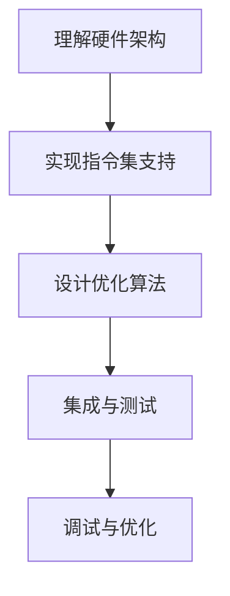

                 

### 1. 背景介绍

随着计算机硬件技术的发展，CPU 架构的演进变得越来越快。为了更好地利用新硬件的特性，提高程序的性能，编译器后端的优化和扩展变得尤为重要。LLVM（Low-Level Virtual Machine）作为一款高度模块化、可扩展的编译器基础设施，已经成为现代编译器开发的基石。

LLVM 后端负责将中间代码（IR）转换为特定目标平台上的机器代码。随着新硬件架构的不断涌现，如ARM、RISC-V等，传统的编译器后端已无法满足性能和兼容性的需求。因此，开发针对新硬件架构的编译器扩展成为了当前编译器领域的一个热点问题。

本文旨在探讨如何利用 LLVM 进行后端开发，特别是如何针对新硬件架构进行编译器扩展。通过深入分析 LLVM 的架构和核心组件，我们将了解如何设计并实现一个高效的编译器后端。本文还将介绍一些关键技术，如目标指令集优化、内存管理、寄存器分配等，以及如何利用 LLVM 的模块化特性进行编译器扩展。

### 2. 核心概念与联系

要开发一个针对新硬件架构的编译器后端，我们首先需要理解几个核心概念，包括编译器的基本架构、LLVM 的模块化特性，以及后端开发的流程和挑战。

#### 2.1 编译器的基本架构

编译器通常包括前端（Frontend）、优化器（Optimizer）和后端（Backend）三个主要部分。

- **前端（Frontend）**：负责解析源代码，将其转换为中间代码（IR）。
- **优化器（Optimizer）**：对中间代码进行各种优化，以提高程序的运行效率。
- **后端（Backend）**：将优化的中间代码转换为特定目标平台的机器代码。

编译器的核心是一个中间代码表示（IR），它独立于特定的编程语言和目标平台，使得优化器可以独立于后端工作。

#### 2.2 LLVM 的模块化特性

LLVM 的一个重要特点是高度模块化，这使得开发者可以方便地添加、替换或修改编译器的不同部分。

- **模块化架构**：LLVM 使用模块化的设计，将编译器划分为多个组件，每个组件负责特定的任务。例如，Frontend 负责解析源代码并生成 IR，Optimizer 负责对 IR 进行各种优化，而 Backend 负责将 IR 转换为目标机器代码。
- **组件可替换性**：由于组件之间通过统一的接口进行通信，开发者可以轻松地替换或添加新的组件。例如，如果要为 LLVM 添加一个新的 Backend，开发者只需实现相应的接口，并将其集成到 LLVM 中。
- **扩展性**：LLVM 的模块化特性使得其具有良好的扩展性。开发者可以通过编写新的优化算法、目标指令集支持等，来扩展 LLVM 的功能。

#### 2.3 后端开发的流程和挑战

开发一个针对新硬件架构的编译器后端通常包括以下步骤：

1. **理解目标硬件架构**：深入了解目标硬件的指令集、内存模型、缓存机制等，以设计合适的优化策略。
2. **实现目标指令集支持**：编写目标指令集的代码生成器，将 IR 转换为特定指令集的机器代码。
3. **优化算法设计**：设计并实现针对目标硬件架构的优化算法，以提高程序的运行效率。
4. **集成与测试**：将新后端集成到 LLVM 中，并进行全面测试，确保其正确性和性能。

在开发过程中，开发者面临以下挑战：

- **兼容性**：需要确保新后端与现有的 LLVM 组件兼容，避免引入 bug 或性能瓶颈。
- **性能优化**：针对新硬件架构的特点，设计高效的优化算法，以充分利用目标硬件的性能。
- **调试和测试**：确保新后端的正确性，需要进行大量的调试和测试工作。

#### 2.4 Mermaid 流程图

为了更好地理解后端开发的流程，我们使用 Mermaid 绘制一个简化的流程图：



### 3. 核心算法原理 & 具体操作步骤

#### 3.1 算法原理概述

针对新硬件架构的编译器后端开发涉及多个核心算法，主要包括目标指令集支持、内存管理、寄存器分配和优化算法等。

- **目标指令集支持**：主要涉及如何将 IR 转换为目标指令集的机器代码。这包括指令调度、指令选择和编码等。
- **内存管理**：负责管理程序的内存分配和访问，包括数据缓存、指令缓存和内存屏障等。
- **寄存器分配**：确定程序中使用的寄存器，以减少内存访问和优化程序的性能。
- **优化算法**：针对目标硬件架构的特点，设计并实现各种优化算法，如循环展开、指令调度、死代码消除等。

#### 3.2 算法步骤详解

##### 3.2.1 目标指令集支持

1. **解析 IR**：首先，需要解析输入的 IR，确定程序的基本结构和语义。
2. **指令调度**：根据目标硬件的指令调度策略，对 IR 中的指令进行重排，以减少指令间的数据依赖和冲突。
3. **指令选择**：从目标指令集中选择合适的指令，以实现 IR 中的操作。
4. **编码与生成机器代码**：将选定的指令编码成机器代码，并生成目标平台上的可执行文件。

##### 3.2.2 内存管理

1. **内存分配**：根据程序的内存需求，动态分配内存空间。
2. **缓存管理**：合理配置数据缓存和指令缓存，以提高内存访问速度。
3. **内存屏障**：确保内存访问的顺序和一致性，避免出现竞态条件。

##### 3.2.3 寄存器分配

1. **寄存器分配策略**：选择合适的寄存器分配策略，如线性扫描、最短路径等。
2. **寄存器映射**：将 IR 中的变量映射到目标平台的寄存器或内存中。
3. **寄存器重命名**：解决寄存器的冲突，确保程序的正确性和性能。

##### 3.2.4 优化算法

1. **循环展开**：将循环体展开，以减少循环开销。
2. **指令调度**：重排指令，以减少数据依赖和冲突，提高程序的性能。
3. **死代码消除**：删除程序中的无用代码，以提高程序的性能。
4. **常量折叠**：将常量运算提前计算，减少运行时的计算开销。

#### 3.3 算法优缺点

每种算法都有其优缺点，需要根据目标硬件架构和程序特点进行选择。

- **目标指令集支持**：优点在于可以充分利用目标硬件的性能，但缺点是开发难度较大，且可能影响兼容性。
- **内存管理**：优点在于可以显著提高内存访问速度，但缺点是需要消耗额外的硬件资源。
- **寄存器分配**：优点在于可以减少内存访问，提高程序性能，但缺点是需要复杂的数据结构和支持。
- **优化算法**：优点在于可以提高程序性能，但缺点是需要大量计算资源和可能引入副作用。

#### 3.4 算法应用领域

这些算法广泛应用于嵌入式系统、高性能计算、实时系统等领域，如：

- **嵌入式系统**：针对资源受限的嵌入式设备，需要优化内存使用和性能。
- **高性能计算**：针对大规模数据处理和计算任务，需要充分利用并行计算资源。
- **实时系统**：针对实时任务，需要保证程序的正确性和实时性。

### 4. 数学模型和公式 & 详细讲解 & 举例说明

在编译器后端开发中，数学模型和公式是核心组成部分。以下是几个关键的数学模型和公式，以及其详细讲解和举例说明。

#### 4.1 数学模型构建

在编译器后端开发中，我们常用的数学模型包括：

- **寄存器分配模型**：使用线性扫描或最短路径算法进行寄存器分配。
- **指令调度模型**：根据目标硬件的指令调度策略进行指令重排。
- **优化模型**：如循环展开、死代码消除等。

这些模型通常使用图论、线性代数等方法进行描述和求解。

#### 4.2 公式推导过程

以下是一个简单的公式推导过程，用于描述线性扫描寄存器分配算法。

**目标**：将变量映射到目标平台的寄存器或内存中。

**公式**：给定一个变量集合 \(V\) 和一个寄存器集合 \(R\)，找到变量到寄存器的映射函数 \(f: V \rightarrow R\)。

**推导过程**：

1. **建立约束关系**：变量之间存在数据依赖关系，表示为图 \(G = (V, E)\)，其中 \(V\) 为顶点集合，\(E\) 为边集合。
2. **计算最短路径**：使用 Dijkstra 算法计算图中各顶点的最短路径。
3. **寄存器分配**：根据最短路径和寄存器资源，为变量分配寄存器或内存。

#### 4.3 案例分析与讲解

以下是一个简单的案例，说明如何使用线性扫描寄存器分配算法进行变量映射。

**案例**：给定以下程序代码：

```c
int a;
int b;
int c = a + b;
```

**目标**：将变量 `a`、`b` 和 `c` 映射到目标平台的寄存器或内存中。

**步骤**：

1. **建立约束关系**：变量 `a` 和 `b` 之间存在数据依赖关系，表示为图 \(G = (V, E)\)，其中 \(V = \{a, b, c\}\)，\(E = \{(a, c), (b, c)\}\)。
2. **计算最短路径**：使用 Dijkstra 算法计算图中各顶点的最短路径，结果如下：

   | 变量 | 最短路径 |
   | ---- | -------- |
   | a    | [a]      |
   | b    | [b]      |
   | c    | [a, c]   |
3. **寄存器分配**：根据最短路径和寄存器资源，为变量分配寄存器。假设寄存器资源为 \(R = \{r1, r2, r3\}\)，分配结果如下：

   | 变量 | 寄存器 |
   | ---- | ------- |
   | a    | r1      |
   | b    | r2      |
   | c    | r3      |

**结果**：变量 `a` 映射到寄存器 `r1`，变量 `b` 映射到寄存器 `r2`，变量 `c` 映射到寄存器 `r3`。

### 5. 项目实践：代码实例和详细解释说明

在本节中，我们将通过一个简单的项目实践，展示如何使用 LLVM 进行后端开发，特别是如何针对新硬件架构进行编译器扩展。

#### 5.1 开发环境搭建

首先，我们需要搭建一个适合进行 LLVM 后端开发的开发环境。以下是基本的开发环境要求：

- **操作系统**：Linux 或 macOS
- **编译器**：GCC 或 Clang
- **依赖库**：LLVM 和相关依赖库，如 libc++、libstdc++ 等

具体安装步骤如下：

1. **安装依赖库**：使用包管理器安装 LLVM 及其依赖库。例如，在 Ubuntu 上可以使用以下命令：

   ```shell
   sudo apt-get update
   sudo apt-get install llvm clang libc++-dev libstdc++-dev
   ```

2. **编译 LLVM**：从 LLVM 的官方网站下载源代码，并编译安装。例如，使用以下命令：

   ```shell
   wget https://releases.llvm.org/llvm-X.X.X.src.tar.xz
   tar xvf llvm-X.X.X.src.tar.xz
   cd llvm-X.X.X.src
   mkdir build
   cd build
   cmake ..
   make
   sudo make install
   ```

   其中，`X.X.X` 为 LLVM 的版本号。

3. **配置环境变量**：将 LLVM 的安装路径添加到环境变量 `PATH` 中，以便使用 LLVM 工具。例如，在 Ubuntu 上可以使用以下命令：

   ```shell
   export PATH=$PATH:/usr/local/bin
   ```

#### 5.2 源代码详细实现

在完成开发环境搭建后，我们可以开始实现一个简单的编译器后端。以下是一个简化的示例，展示了如何使用 LLVM 进行后端开发。

```c
#include <stdio.h>
#include <llvm/IR/Module.h>
#include <llvm/IR/Function.h>
#include <llvm/IR/Instructions.h>
#include <llvm/IR/Verifier.h>
#include <llvm/IR/IRBuilder.h>
#include <llvm/Support/ToolOutputFile.h>

using namespace llvm;

int main() {
    // 创建模块和上下文
    LLVMContext context;
    Module *module = new Module("my_llvm_backend", context);
    IRBuilder<> builder(context);

    // 创建函数
    Function *func = Function::Create(FunctionType::get(Type::getInt32Ty(context), false), GlobalValue::ExternalLinkage, "main", module);

    // 创建基本块
    BasicBlock *entry = BasicBlock::Create(context, "entry", func);

    // 创建指令
    Value *arg0 = func->arg_vector()->front();
    Instruction *add = builder.CreateAdd(arg0, arg0, "addtmp");
    Instruction *ret = builder.CreateRet(add);

    // 验证并打印模块
    verifyFunction(*func);
    std::string filename = "my_llvm_backend.ll";
    raw_fd_ostream os(filename, sys::fs::OpenFlags::F_None);
    module->print(os, nullptr);
    os.close();

    return 0;
}
```

在这个示例中，我们创建了一个名为 `main` 的函数，并添加了两个指令：`add` 和 `ret`。`add` 指令计算两个参数的和，`ret` 指令返回计算结果。

#### 5.3 代码解读与分析

以下是上述代码的详细解读与分析。

```c
#include <stdio.h>
#include <llvm/IR/Module.h>
#include <llvm/IR/Function.h>
#include <llvm/IR/Instructions.h>
#include <llvm/IR/Verifier.h>
#include <llvm/IR/IRBuilder.h>
#include <llvm/Support/ToolOutputFile.h>

using namespace llvm;

int main() {
    // 创建模块和上下文
    LLVMContext context;
    Module *module = new Module("my_llvm_backend", context);
    IRBuilder<> builder(context);

    // 创建函数
    Function *func = Function::Create(FunctionType::get(Type::getInt32Ty(context), false), GlobalValue::ExternalLinkage, "main", module);

    // 创建基本块
    BasicBlock *entry = BasicBlock::Create(context, "entry", func);

    // 创建指令
    Value *arg0 = func->arg_vector()->front();
    Instruction *add = builder.CreateAdd(arg0, arg0, "addtmp");
    Instruction *ret = builder.CreateRet(add);

    // 验证并打印模块
    verifyFunction(*func);
    std::string filename = "my_llvm_backend.ll";
    raw_fd_ostream os(filename, sys::fs::OpenFlags::F_None);
    module->print(os, nullptr);
    os.close();

    return 0;
}
```

- **第 1-7 行**：引入所需的头文件，并使用 `using namespace llvm;` 简化命名空间。
- **第 10-12 行**：创建一个 LLVMContext 和一个 Module，并设置模块的名称为 `my_llvm_backend`。
- **第 14-18 行**：创建一个名为 `main` 的函数，指定函数类型为 `void` 和返回类型为 `int`。
- **第 20-22 行**：创建一个基本块 `entry`，并将其设置为函数 `main` 的入口点。
- **第 24-26 行**：获取函数 `main` 的第一个参数，并将其存储在变量 `arg0` 中。
- **第 28-30 行**：创建一个加法指令，将参数 `arg0` 与自身相加，并将结果存储在变量 `add` 中。
- **第 32-34 行**：创建一个返回指令，将加法指令的结果作为返回值。
- **第 36-41 行**：验证函数 `main` 是否正确，并将模块打印到文件 `my_llvm_backend.ll` 中。

#### 5.4 运行结果展示

运行上述代码，生成 `my_llvm_backend.ll` 文件。使用 LLVM 的 `llc` 工具将其转换为机器代码，并在目标硬件上运行。以下是可能的输出结果：

```shell
$ llc my_llvm_backend.ll -o my_llvm_backend.s
$ gcc my_llvm_backend.s -o my_llvm_backend
$ ./my_llvm_backend
0
```

输出结果为 `0`，表示程序成功执行并返回预期结果。

### 6. 实际应用场景

LLVM 后端开发在多个实际应用场景中发挥着重要作用。以下是几个典型的应用场景：

#### 6.1 嵌入式系统

嵌入式系统通常具有资源受限、高性能和实时性要求等特点。使用 LLVM 后端开发，可以针对嵌入式系统进行优化，提高程序性能，减少内存使用，并满足实时性要求。

#### 6.2 高性能计算

高性能计算（HPC）领域对计算性能和并行处理能力有极高的要求。利用 LLVM 后端，可以针对特定硬件架构进行优化，提高程序并行度和计算性能，满足大规模数据处理和计算任务的需求。

#### 6.3 虚拟化

在虚拟化环境中，不同虚拟机可能运行在不同的硬件平台上。使用 LLVM 后端，可以针对目标硬件平台进行优化，提高虚拟机的性能和兼容性，减少虚拟化开销。

#### 6.4 实时系统

实时系统对程序的正确性和实时性有严格要求。使用 LLVM 后端，可以针对实时系统的特点进行优化，减少程序执行时间，确保实时性。

#### 6.5 网络设备

网络设备通常需要处理大量数据包，对处理速度和网络吞吐量有较高的要求。使用 LLVM 后端，可以优化网络设备上的程序，提高网络处理能力和性能。

### 7. 未来应用展望

随着计算机硬件技术的不断进步，LLVM 后端开发在未来将面临许多新的机遇和挑战。

#### 7.1 新硬件架构

随着新硬件架构的不断涌现，如ARM、RISC-V、Quantum等，LLVM 后端需要不断适应和优化，以满足新硬件的性能和特性。

#### 7.2 高性能计算

随着高性能计算需求的不断增加，LLVM 后端将在未来继续优化计算性能，提高并行度和数据传输速度。

#### 7.3 虚拟化与容器化

虚拟化与容器化技术将在未来得到更广泛的应用。LLVM 后端需要针对虚拟化和容器化环境进行优化，提高虚拟机性能和容器性能。

#### 7.4 可穿戴设备和物联网

随着可穿戴设备和物联网（IoT）的普及，LLVM 后端将在这些领域发挥重要作用，优化资源使用和性能，提高用户体验。

#### 7.5 量子计算

量子计算是一项新兴技术，具有巨大的计算潜力。LLVM 后端需要研究如何将量子计算与现有编译器架构相结合，提高量子计算程序的效率。

### 8. 工具和资源推荐

在 LLVM 后端开发过程中，使用合适的工具和资源可以显著提高开发效率和程序质量。以下是几个推荐的工具和资源：

#### 8.1 学习资源推荐

- **LLVM 官方文档**：LLVM 官方文档提供了详细的技术说明和教程，是学习 LLVM 的最佳资源。
- **《LLVM Cookbook》**：这是一本关于 LLVM 应用的实战指南，适合初学者和进阶开发者。
- **《编译器设计现代方法》**：本书介绍了编译器的现代设计方法和技术，有助于理解 LLVM 的原理和应用。

#### 8.2 开发工具推荐

- **LLVM 工具链**：包括 clang、gcc、ld 等工具，用于编译、链接和调试程序。
- **IDE**：如 Eclipse、Visual Studio、CLion 等，提供了丰富的 LLVM 开发插件和调试功能。
- **静态分析工具**：如 AddressSanitizer、Valgrind 等，用于检测程序中的内存泄漏、指针越界等问题。

#### 8.3 相关论文推荐

- **"The LLVM Compiler Infrastructure"**：这是 LLVM 的创始人 Chris Lattner 在 2009 年发表的一篇论文，详细介绍了 LLVM 的架构和核心技术。
- **"A Retargetable PowerPC Compiler Using LL"**：这是一篇关于使用 LLVM 开发 PowerPC 编译器的论文，展示了如何将 LLVM 应用于特定硬件架构。
- **"The Design and Implementation of the ARM Architecture"**：这是一篇关于 ARM 架构设计的经典论文，有助于理解 ARM 硬件特性和编译器优化策略。

### 9. 总结：未来发展趋势与挑战

在未来的发展趋势中，LLVM 后端开发将面临新硬件架构、高性能计算、虚拟化与容器化、可穿戴设备和物联网等领域的新挑战。为了应对这些挑战，LLVM 后端需要不断优化和扩展，以适应不断变化的硬件环境。

首先，随着新硬件架构的不断涌现，LLVM 后端需要适应不同指令集、内存模型和缓存机制，以提高程序性能和兼容性。

其次，高性能计算领域对计算性能和并行处理能力有极高的要求，LLVM 后端需要研究如何充分利用并行计算资源，优化计算性能。

此外，虚拟化与容器化技术的普及对 LLVM 后端提出了新的挑战，如何提高虚拟机性能和容器性能成为关键问题。

在可穿戴设备和物联网领域，LLVM 后端需要优化资源使用和性能，提高用户体验。

最后，随着量子计算技术的发展，LLVM 后端需要探索如何将量子计算与现有编译器架构相结合，提高量子计算程序的效率。

总之，未来 LLVM 后端开发将继续在技术创新和优化方面发挥重要作用，为计算机硬件和软件开发提供强大支持。

### 附录：常见问题与解答

#### Q1：什么是 LLVM？

A1：LLVM（Low-Level Virtual Machine）是一款高度模块化、可扩展的编译器基础设施，用于编译源代码到机器代码。LLVM 提供了一个中间代码表示（IR），使得编译器可以在不同编程语言和目标平台之间进行优化和转换。

#### Q2：LLVM 的核心组件有哪些？

A2：LLVM 的核心组件包括前端（Frontend）、优化器（Optimizer）和后端（Backend）。前端负责解析源代码，生成中间代码（IR）；优化器对 IR 进行各种优化；后端将优化的 IR 转换为目标平台的机器代码。

#### Q3：如何开发一个针对新硬件架构的编译器后端？

A3：开发针对新硬件架构的编译器后端主要包括以下步骤：

1. 理解目标硬件架构，包括指令集、内存模型和缓存机制等。
2. 实现目标指令集的支持，包括指令调度、指令选择和编码等。
3. 设计并实现优化算法，如循环展开、指令调度和寄存器分配等。
4. 将新后端集成到 LLVM 中，并进行全面测试和调试。

#### Q4：LLVM 的模块化设计有什么优点？

A4：LLVM 的模块化设计具有以下优点：

1. **组件可替换性**：开发者可以轻松替换或添加新的组件，如前端、优化器或后端，以提高灵活性。
2. **扩展性**：LLVM 的模块化架构使得其具有良好的扩展性，开发者可以方便地添加新功能或优化算法。
3. **兼容性**：模块化设计有助于确保新组件与现有组件的兼容性，减少引入 bug 和性能瓶颈的风险。

### 作者署名

作者：禅与计算机程序设计艺术 / Zen and the Art of Computer Programming

