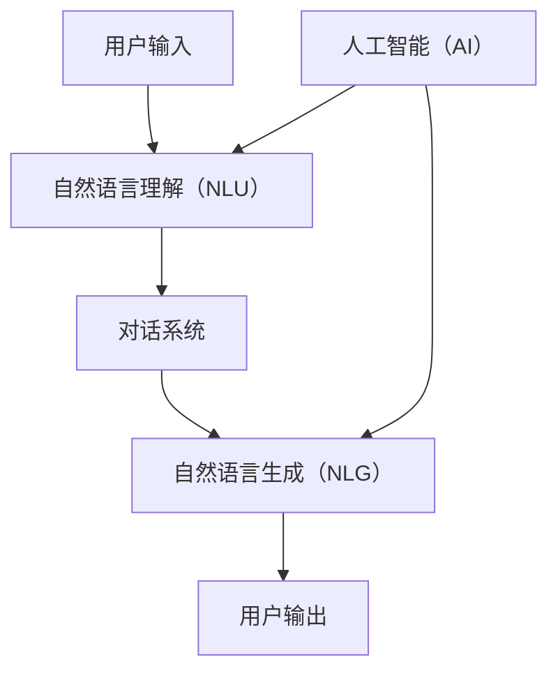

                 

关键词：LUI，CUI，自然语言处理，对话系统，人工智能

> 摘要：本文旨在探讨在计算机用户界面（CUI）中，语言用户界面（LUI）技术的核心作用。我们将深入分析LUI的基础概念、在CUI中的实际应用、核心算法、数学模型以及项目实践，进而展望其未来发展的趋势与挑战。

## 1. 背景介绍

计算机用户界面（CUI）和语言用户界面（LUI）是现代计算机系统中两个重要的交互组件。CUI通常以命令行界面（CLI）或图形用户界面（GUI）的形式出现，为用户提供了一种通过键盘、鼠标或其他输入设备与计算机系统交互的方式。然而，CUI的交互方式相对有限，用户需要记忆大量的命令和操作流程，这给用户带来了不小的困扰。

相比之下，LUI通过自然语言处理技术，使用户能够以自然的方式与计算机系统进行交流。这种交互方式不仅降低了用户的认知负担，还提升了用户体验。随着人工智能技术的不断发展，LUI在CUI中的应用越来越广泛，成为现代计算机系统的重要组成部分。

本文将围绕LUI在CUI中的核心技术作用展开讨论，包括其基本概念、核心算法、数学模型以及实际应用。希望通过本文的探讨，能够为读者提供对LUI技术更深入的理解，并为其在CUI中的实际应用提供参考。

### 1.1 LUI与CUI的关系

语言用户界面（LUI）与计算机用户界面（CUI）之间的关系可以比喻为“语言”与“命令”的关系。CUI类似于一种“命令语言”，用户需要通过记忆和输入特定的命令来执行操作。而LUI则是一种更贴近人类日常交流方式的“自然语言”，用户可以通过日常用语与计算机进行交互。

LUI的优势在于其自然、直观的交互方式。用户无需记忆复杂的命令和参数，只需像与朋友交谈一样，用自然的语言表达需求，计算机即可理解和执行。这种交互方式不仅降低了用户的学习成本，还提升了用户的操作效率。

然而，LUI并非完全取代CUI，而是与CUI相辅相成。在某些特定场景下，如复杂操作、精确控制等，CUI的优势更加明显。而LUI则适用于日常交互、信息查询等场景。因此，在现代计算机系统中，LUI和CUI往往是结合使用的，以实现最优的用户体验。

### 1.2 LUI的发展历程

LUI技术的发展可以追溯到20世纪80年代。当时，研究人员开始探索如何让计算机理解自然语言，以便与人类进行更自然的交互。这一时期的代表性成果是自然语言理解（NLU）和自然语言生成（NLG）技术的初步形成。

随着人工智能技术的快速发展，LUI技术逐渐走向成熟。特别是近年来，深度学习技术的应用使得NLU和NLG的性能大幅提升，LUI在CUI中的应用场景也不断扩展。

目前，LUI技术已经广泛应用于智能客服、智能家居、智能语音助手等领域。例如，智能客服系统可以通过LUI与用户进行实时交流，解决用户的问题；智能家居系统可以通过LUI控制家电设备，实现智能化的生活体验。

### 1.3 LUI的应用场景

LUI在CUI中的应用场景非常广泛，以下是一些典型的应用场景：

1. **智能客服**：智能客服系统通过LUI与用户进行实时交流，提供在线服务，解决用户的问题。相比于传统的CUI，智能客服系统可以节省人力资源，提高服务效率。

2. **智能家居**：智能家居系统通过LUI控制家电设备，实现智能化生活。用户可以通过语音命令控制灯光、空调、电视等家电设备，提升生活品质。

3. **智能语音助手**：智能语音助手如Siri、Alexa等，通过LUI与用户进行互动，提供天气信息、日程提醒、在线购物等服务。

4. **医疗健康**：在医疗健康领域，LUI可以帮助患者进行健康咨询、症状查询等，提供个性化的医疗建议。

5. **教育学习**：在教育领域，LUI可以为学生提供智能辅导、学习资源查询等，提高学习效率。

### 1.4 LUI的核心技术

LUI的核心技术主要包括自然语言理解（NLU）和自然语言生成（NLG）。

1. **自然语言理解（NLU）**：NLU是LUI的关键技术，主要负责理解用户输入的自然语言。NLU通过语法分析、词义消歧、实体识别等手段，将自然语言转换为计算机可以理解和处理的结构化数据。

2. **自然语言生成（NLG）**：NLG则是LUI的另一个核心技术，主要负责将计算机处理的结构化数据转换回自然语言。NLG通过语法生成、文本优化等手段，生成符合人类语言习惯的自然语言文本。

### 1.5 本文结构

本文将分为以下几个部分：

1. 背景介绍
2. 核心概念与联系
3. 核心算法原理 & 具体操作步骤
4. 数学模型和公式 & 详细讲解 & 举例说明
5. 项目实践：代码实例和详细解释说明
6. 实际应用场景
7. 未来应用展望
8. 工具和资源推荐
9. 总结：未来发展趋势与挑战
10. 附录：常见问题与解答

通过以上内容的讨论，本文旨在全面探讨LUI在CUI中的核心技术作用，为读者提供对LUI技术的深入理解。

## 2. 核心概念与联系

在深入探讨LUI在CUI中的核心技术作用之前，我们首先需要明确几个关键概念，并了解它们之间的联系。这些概念包括自然语言理解（NLU）、自然语言生成（NLG）、对话系统以及人工智能（AI）。

### 2.1 自然语言理解（NLU）

自然语言理解（NLU）是LUI的核心技术之一，负责将用户输入的自然语言转换为计算机可以处理的结构化数据。NLU的关键任务包括语法分析、词义消歧、实体识别和意图识别等。

- **语法分析**：语法分析是NLU的基础任务，主要负责解析自然语言的语法结构，将其转换为抽象语法树（AST）或其他结构化表示。常见的语法分析方法包括词法分析、句法分析和语义分析。

- **词义消歧**：在自然语言中，同一个词可能会有多个含义。词义消歧的任务是在上下文中确定单词的确切含义。例如，"bank"在金融领域指的是银行，而在地理领域指的是河岸。

- **实体识别**：实体识别的任务是识别文本中的特定实体，如人名、地点、组织、时间等。实体识别有助于将自然语言文本转换为结构化的数据，便于后续处理。

- **意图识别**：意图识别是NLU的高级任务，旨在理解用户输入的目的或意图。例如，当用户说“今天天气怎么样？”时，意图识别可以帮助计算机确定这是一个关于天气查询的请求。

### 2.2 自然语言生成（NLG）

自然语言生成（NLG）是LUI的另一个核心技术，负责将计算机处理的结构化数据转换回自然语言。NLG的目标是生成符合人类语言习惯的文本，使其看起来像是由人类自然撰写。

- **语法生成**：语法生成是NLG的核心任务，旨在生成符合语法规则的自然语言句子。常见的语法生成方法包括模板匹配、语法解析和数据驱动方法。

- **文本优化**：文本优化是NLG的重要环节，主要负责对生成的文本进行润色和优化，使其更具可读性和流畅性。文本优化可以包括语法修正、词汇选择、句子结构调整等。

### 2.3 对话系统

对话系统是一种结合NLU和NLG技术的综合性系统，负责模拟自然语言交互。对话系统的核心目标是理解用户输入，生成合适的响应，并维持对话的连贯性。

- **对话管理**：对话管理是对话系统的核心组件，负责控制对话的流程。对话管理通过分析用户输入，生成响应，并根据对话上下文调整对话策略。

- **任务导向对话**：任务导向对话是一种基于特定任务的对话系统，旨在帮助用户完成特定任务。例如，智能客服系统可以帮助用户查询订单状态、解决问题等。

- **闲聊对话**：闲聊对话系统旨在与用户进行日常闲聊，提供娱乐和陪伴。这类对话系统通常采用大规模语料库和机器学习算法，以生成自然的对话内容。

### 2.4 人工智能（AI）

人工智能（AI）是LUI技术的基础，为自然语言理解（NLU）和自然语言生成（NLG）提供了强大的支持。AI技术包括机器学习、深度学习、知识图谱等。

- **机器学习**：机器学习是AI的核心技术之一，通过训练大量数据，使计算机能够自动识别模式、做出预测和决策。在LUI中，机器学习算法可以用于语法分析、词义消歧、意图识别等任务。

- **深度学习**：深度学习是机器学习的一个分支，通过多层神经网络对数据进行处理，可以自动提取复杂特征。在LUI中，深度学习算法在语音识别、图像识别等领域取得了显著成果。

- **知识图谱**：知识图谱是一种将知识以图的形式进行表示的技术，可以用于知识推理、信息检索等任务。在LUI中，知识图谱可以用于实体识别、意图识别等任务，提升系统的理解能力。

### 2.5 关系与联系

LUI、NLU、NLG、对话系统和AI之间存在着紧密的联系。LUI是用户与计算机系统之间的桥梁，NLU和NLG是实现LUI的关键技术。对话系统是LUI的具体应用形式，而AI则为NLU和NLG提供了技术支持。

通过NLU，对话系统可以理解用户输入，而通过NLG，对话系统可以生成合适的响应。AI技术则为NLU和NLG提供了强大的计算能力和算法支持，使得LUI在CUI中的应用成为可能。

### 2.6 Mermaid 流程图

以下是一个简单的Mermaid流程图，展示了LUI、NLU、NLG、对话系统和AI之间的关系。



在这个流程图中，用户输入通过自然语言理解（NLU）转换为结构化数据，然后由对话系统进行处理，生成自然语言响应，最终输出给用户。人工智能（AI）为NLU和NLG提供了技术支持，使得整个流程更加高效和智能化。

通过以上对核心概念与联系的分析，我们可以更好地理解LUI在CUI中的核心作用，并为后续内容的讨论奠定基础。

## 3. 核心算法原理 & 具体操作步骤

在LUI技术中，核心算法起着至关重要的作用。这些算法不仅决定了系统的性能和准确性，还直接影响用户体验。以下将详细探讨LUI中的核心算法原理，并给出具体的操作步骤。

### 3.1 算法原理概述

LUI中的核心算法主要包括自然语言理解（NLU）和自然语言生成（NLG）。NLU算法负责解析用户输入的自然语言，识别出用户意图、实体和上下文信息，而NLG算法则负责将计算机处理后的信息转换为自然语言输出。

#### 自然语言理解（NLU）算法

NLU算法的基本原理是利用语言学和计算语言学的方法，将自然语言文本转化为计算机可以处理的结构化数据。主要任务包括：

- **分词（Tokenization）**：将文本分解为单词或短语，是自然语言处理的基础步骤。
- **词性标注（Part-of-Speech Tagging）**：为每个词分配一个词性标签，如名词、动词、形容词等。
- **句法分析（Parsing）**：构建句子的语法结构，生成句法树。
- **实体识别（Named Entity Recognition, NER）**：识别文本中的特定实体，如人名、地点、组织、时间等。
- **意图识别（Intent Recognition）**：确定用户输入的目的或意图，如查询天气、预订电影等。

NLU算法通常采用以下几种方法：

1. **基于规则的方法**：通过定义一组规则，对文本进行解析和分类。这种方法适用于规则明确、变化较少的场景。
2. **统计方法**：利用统计学习模型，如朴素贝叶斯、最大熵模型、支持向量机等，通过训练大量标注数据进行学习。
3. **深度学习方法**：利用神经网络，如卷积神经网络（CNN）和循环神经网络（RNN）等，自动提取特征并进行分类。

#### 自然语言生成（NLG）算法

NLG算法的基本原理是将计算机处理后的结构化数据转换为自然语言文本。主要任务包括：

- **模板匹配**：根据输入数据的类型和属性，从预定义的模板库中选择合适的模板，填充模板生成文本。
- **数据驱动方法**：利用预定义的规则和数据，生成文本。这种方法通常用于生成结构化数据，如天气预报、股票报价等。
- **生成式方法**：利用生成模型，如序列到序列（Seq2Seq）模型、变分自编码器（VAE）等，生成符合语法和语义的自然语言文本。

NLG算法的实现步骤通常包括：

1. **数据预处理**：对输入数据进行分析和处理，提取关键信息和特征。
2. **模板选择和填充**：根据输入数据的类型和属性，选择合适的模板，并填充模板中的占位符。
3. **文本生成**：利用生成模型或规则，生成符合语法和语义的自然语言文本。

### 3.2 算法步骤详解

以下是NLU和NLG算法的具体操作步骤：

#### NLU算法步骤

1. **分词**：将用户输入的文本分解为单词或短语。
    ```mermaid
    graph TD
    A[文本] --> B[分词]
    B --> C[分词结果]
    ```
2. **词性标注**：为每个词分配一个词性标签。
    ```mermaid
    graph TD
    A[分词结果] --> B[词性标注]
    B --> C[词性标注结果]
    ```
3. **句法分析**：构建句子的语法结构，生成句法树。
    ```mermaid
    graph TD
    A[词性标注结果] --> B[句法分析]
    B --> C[句法树]
    ```
4. **实体识别**：识别文本中的特定实体。
    ```mermaid
    graph TD
    A[句法树] --> B[实体识别]
    B --> C[实体识别结果]
    ```
5. **意图识别**：确定用户输入的目的或意图。
    ```mermaid
    graph TD
    A[实体识别结果] --> B[意图识别]
    B --> C[意图识别结果]
    ```

#### NLG算法步骤

1. **数据预处理**：对输入数据进行分析和处理，提取关键信息和特征。
    ```mermaid
    graph TD
    A[输入数据] --> B[数据预处理]
    B --> C[预处理结果]
    ```
2. **模板选择和填充**：根据输入数据的类型和属性，选择合适的模板，并填充模板中的占位符。
    ```mermaid
    graph TD
    A[预处理结果] --> B[模板选择]
    B --> C[模板填充]
    C --> D[填充结果]
    ```
3. **文本生成**：利用生成模型或规则，生成符合语法和语义的自然语言文本。
    ```mermaid
    graph TD
    A[填充结果] --> B[文本生成]
    B --> C[自然语言输出]
    ```

### 3.3 算法优缺点

NLU和NLG算法各有优缺点，以下对其分别进行概述：

#### NLU算法优缺点

**优点**：
1. **灵活性**：NLU算法可以根据不同的应用场景和需求进行灵活调整和优化。
2. **准确性**：随着深度学习技术的应用，NLU算法的准确性和性能不断提高。
3. **可扩展性**：NLU算法可以方便地集成到现有系统中，实现自然语言处理的功能。

**缺点**：
1. **复杂性**：NLU算法涉及多个步骤和任务，实现和优化较为复杂。
2. **训练成本**：NLU算法通常需要大量标注数据用于训练，训练成本较高。
3. **实时性**：在处理实时交互场景时，NLU算法可能存在一定的延迟。

#### NLG算法优缺点

**优点**：
1. **自然性**：NLG算法可以生成符合语法和语义的自然语言文本，提升用户体验。
2. **灵活性**：NLG算法可以根据输入数据灵活生成各种类型的文本。
3. **多样性**：NLG算法可以通过生成模型生成多样性的文本，增加交互的趣味性。

**缺点**：
1. **准确性**：NLG算法在生成文本时可能存在一定的错误或不一致性。
2. **可控性**：NLG算法在生成文本时可能难以完全控制，导致输出文本与预期不一致。
3. **计算成本**：NLG算法可能需要较高的计算资源和时间，特别是在生成复杂文本时。

### 3.4 算法应用领域

NLU和NLG算法在多个领域得到了广泛应用，以下列举几个典型的应用领域：

**智能客服**：智能客服系统通过NLU理解用户输入，通过NLG生成合适的回复，提供在线服务。

**智能家居**：智能家居系统通过NLU识别用户语音命令，通过NLG控制家电设备，实现智能化生活。

**智能语音助手**：智能语音助手如Siri、Alexa等，通过NLU理解用户语音指令，通过NLG生成语音回复，提供各种服务。

**医疗健康**：在医疗健康领域，NLU和NLG可以用于医疗咨询、病例分析等，提供个性化的医疗服务。

**教育学习**：在教育领域，NLU和NLG可以用于智能辅导、学习资源查询等，提高学习效率。

通过以上对LUI核心算法原理和具体操作步骤的详细分析，我们可以更好地理解LUI在CUI中的核心技术作用，为其在各个应用场景中的实际应用提供理论支持。

## 4. 数学模型和公式 & 详细讲解 & 举例说明

在LUI（语言用户界面）和CUI（计算机用户界面）技术中，数学模型和公式起到了关键作用，它们不仅帮助我们理解和实现自然语言处理（NLP）的核心算法，还提供了量化分析的手段。在这一节中，我们将详细讲解LUI中常用的数学模型和公式，并通过具体例子来说明它们的应用。

### 4.1 数学模型构建

在LUI中，常用的数学模型包括概率模型、神经网络模型和生成模型等。以下是这些模型的基本概念和构建方法：

#### 4.1.1 概率模型

概率模型在NLP中用于处理不确定性和不确定性推理。常见的概率模型包括：

- **朴素贝叶斯模型**：用于文本分类和实体识别，通过计算每个类别的概率，选择概率最高的类别作为输出。
    $$ P(\text{类别} | \text{特征}) = \frac{P(\text{特征} | \text{类别}) \cdot P(\text{类别})}{P(\text{特征})} $$
- **隐马尔可夫模型**（HMM）：用于语音识别和序列标注，通过状态转移概率和发射概率，对序列进行建模。
    $$ P(\text{序列}) = \prod_{i=1}^{n} P(\text{状态}_i | \text{状态}_{i-1}) \cdot P(\text{发射}_i | \text{状态}_i) $$

#### 4.1.2 神经网络模型

神经网络模型在NLP中的应用非常广泛，尤其是深度学习模型。以下是一些常见的神经网络模型：

- **循环神经网络**（RNN）：用于处理序列数据，如文本和语音。RNN通过记忆单元来捕捉序列的长期依赖关系。
    $$ h_t = \sigma(W_h \cdot [h_{t-1}, x_t] + b_h) $$
    其中，\( h_t \) 是第 \( t \) 个时间步的隐藏状态，\( x_t \) 是输入特征，\( W_h \) 和 \( b_h \) 是权重和偏置。

- **长短时记忆网络**（LSTM）：LSTM是RNN的一种变体，通过引入门控机制来防止梯度消失问题，更好地处理长序列数据。
    $$ i_t = \sigma(W_i \cdot [h_{t-1}, x_t] + b_i) $$
    $$ f_t = \sigma(W_f \cdot [h_{t-1}, x_t] + b_f) $$
    $$ o_t = \sigma(W_o \cdot [h_{t-1}, x_t] + b_o) $$
    $$ C_t = f_t \odot C_{t-1} + i_t \odot \sigma(W_c \cdot [h_{t-1}, x_t] + b_c) $$
    $$ h_t = o_t \odot C_t $$
    其中，\( i_t \)、\( f_t \)、\( o_t \) 分别是输入门、遗忘门和输出门，\( C_t \) 是细胞状态。

- **卷积神经网络**（CNN）：CNN主要用于文本分类和情感分析，通过卷积操作和池化操作提取文本特征。
    $$ h_c = \text{ReLU}(W_c \cdot \text{pad}(x) + b_c) $$
    $$ h_t = \text{pool}(\text{max}(h_c \cdot K_t + b_t)) $$
    其中，\( x \) 是输入文本，\( K_t \) 是卷积核，\( W_c \) 和 \( b_c \) 是卷积权重和偏置，\( h_t \) 是卷积后的特征。

#### 4.1.3 生成模型

生成模型在NLP中用于文本生成和生成式对话系统。以下是一些常见的生成模型：

- **生成对抗网络**（GAN）：GAN通过对抗训练生成高质量的文本。
    $$ \min_G \max_D V(D, G) = \mathbb{E}_{x \sim p_{\text{data}}(x)}[\log D(x)] + \mathbb{E}_{z \sim p_z(z)}[\log (1 - D(G(z)))] $$
    其中，\( D \) 是判别器，\( G \) 是生成器，\( x \) 是真实数据，\( z \) 是生成器的噪声输入。

- **变分自编码器**（VAE）：VAE通过编码器和解码器生成文本，具有良好的鲁棒性和灵活性。
    $$ \log p(x) = \log \frac{p(\mu, \sigma^2 | x)}{p(\mu, \sigma^2)} + D_{KL}(\mu || \mu_0, \sigma^2 || \sigma_0^2) $$
    其中，\( \mu \) 和 \( \sigma^2 \) 分别是编码器的均值和方差，\( \mu_0 \) 和 \( \sigma_0^2 \) 分别是先验均值和方差。

### 4.2 公式推导过程

以下是对LSTM和VAE的核心公式进行推导：

#### 4.2.1 LSTM公式推导

LSTM的核心公式包括输入门、遗忘门、输出门和细胞状态更新。以下是这些公式的推导过程：

1. **输入门**（\( i_t \)）：

    $$ i_t = \sigma(W_i \cdot [h_{t-1}, x_t] + b_i) $$

    其中，\( W_i \) 是输入门的权重矩阵，\( b_i \) 是输入门的偏置项，\( \sigma \) 是 sigmoid 函数。

2. **遗忘门**（\( f_t \)）：

    $$ f_t = \sigma(W_f \cdot [h_{t-1}, x_t] + b_f) $$

    其中，\( W_f \) 是遗忘门的权重矩阵，\( b_f \) 是遗忘门的偏置项。

3. **输出门**（\( o_t \)）：

    $$ o_t = \sigma(W_o \cdot [h_{t-1}, x_t] + b_o) $$

    其中，\( W_o \) 是输出门的权重矩阵，\( b_o \) 是输出门的偏置项。

4. **细胞状态更新**（\( C_t \)）：

    $$ C_t = f_t \odot C_{t-1} + i_t \odot \sigma(W_c \cdot [h_{t-1}, x_t] + b_c) $$

    其中，\( \odot \) 表示元素乘积，\( \sigma \) 是 sigmoid 函数，\( W_c \) 是细胞状态的权重矩阵，\( b_c \) 是细胞状态的偏置项。

5. **隐藏状态更新**（\( h_t \)）：

    $$ h_t = o_t \odot \sigma(C_t) $$

#### 4.2.2 VAE公式推导

VAE的核心公式包括编码器、解码器和重建概率。以下是这些公式的推导过程：

1. **编码器**：

    $$ \mu = \sigma(W_\mu \cdot x + b_\mu) $$
    $$ \sigma^2 = \sigma(W_\sigma \cdot x + b_\sigma) $$

    其中，\( x \) 是输入数据，\( \mu \) 是编码后的均值，\( \sigma^2 \) 是编码后的方差，\( W_\mu \) 和 \( W_\sigma \) 分别是编码器的权重矩阵，\( b_\mu \) 和 \( b_\sigma \) 分别是编码器的偏置项。

2. **解码器**：

    $$ x' = \text{ReLU}(W_d \cdot \mu + b_d) $$

    其中，\( x' \) 是解码后的数据，\( W_d \) 是解码器的权重矩阵，\( b_d \) 是解码器的偏置项。

3. **重建概率**：

    $$ \log p(x | \theta) = -\frac{1}{2} \sum_{i=1}^{n} (\mu_i^2 + \sigma_i^2 - 1 - 2 \log \sigma_i) $$

    其中，\( \theta \) 是模型参数，\( n \) 是数据维度。

### 4.3 案例分析与讲解

以下通过具体例子来说明这些数学模型和公式的应用：

#### 4.3.1 朴素贝叶斯分类

假设我们要对一段文本进行情感分析，判断其是正面、负面还是中性情感。我们可以使用朴素贝叶斯模型来进行分类。以下是具体步骤：

1. **特征提取**：

    首先，我们将文本分解为单词，并为每个单词分配一个词性标签。例如，文本“我非常喜欢这个产品”可以分解为“我”、“喜欢”、“这个”、“产品”，词性标签分别为“代词”、“动词”、“代词”、“名词”。

2. **词频统计**：

    接下来，我们统计每个类别的词频，并计算类别概率。例如，正面情感的词频为（喜欢：2，产品：1），负面情感的词频为（不喜欢：1，糟糕：1），中性情感的词频为（产品：1，不错：1）。

3. **分类预测**：

    对于新文本“我非常喜欢这个手机”，我们可以计算每个类别的概率，并选择概率最高的类别作为输出。例如，正面情感的概率为0.6，负面情感的概率为0.3，中性情感的概率为0.1，因此我们预测该文本是正面情感。

#### 4.3.2 LSTM文本生成

假设我们要使用LSTM生成一段描述某个产品的文本。以下是具体步骤：

1. **数据准备**：

    首先，我们需要准备一个包含产品描述的语料库。例如，我们可以收集各种产品的用户评价，如“这个手机很好用，拍照效果很好，屏幕很大”，“这款电脑性能很强，续航时间很长”，“这个电视画面很清晰，音响效果很好”。

2. **编码器训练**：

    使用LSTM编码器对语料库进行编码，提取每个句子的隐藏状态。例如，我们可以使用一个多层LSTM模型，将每个句子编码为一个固定长度的向量。

3. **解码器生成**：

    使用LSTM解码器生成新的产品描述。首先，我们随机初始化一个隐藏状态，然后通过解码器生成新的单词，并逐步构建产品描述。例如，我们可以生成“这款电视画质清晰，音效出色，性能强大”。

通过以上案例分析与讲解，我们可以看到数学模型和公式在LUI技术中的应用，它们不仅帮助我们理解和实现核心算法，还为实际应用提供了理论依据。

## 5. 项目实践：代码实例和详细解释说明

在前几节中，我们详细介绍了LUI在CUI中的核心技术原理和数学模型。为了使读者能够更好地理解这些概念，并在实际项目中应用，本节将通过一个简单的项目实例，展示如何搭建一个基本的LUI系统，并进行代码实现和详细解释。

### 5.1 开发环境搭建

在进行项目开发之前，我们需要搭建一个合适的环境。以下是一个典型的开发环境配置：

- **编程语言**：Python
- **依赖库**：TensorFlow、Keras、NLTK、spaCy
- **硬件要求**：至少4GB内存、1GB显存（用于GPU加速）

安装步骤如下：

1. **安装Python**：下载并安装Python 3.8或更高版本。
2. **安装依赖库**：
    ```shell
    pip install tensorflow
    pip install keras
    pip install nltk
    pip install spacy
    python -m spacy download en_core_web_sm
    ```
3. **配置GPU加速**：确保安装了CUDA和cuDNN，并配置相关环境变量。

### 5.2 源代码详细实现

下面我们将使用TensorFlow和Keras实现一个基本的LUI系统，主要包括自然语言理解（NLU）和自然语言生成（NLG）两个部分。

#### 5.2.1 数据预处理

首先，我们需要准备一个用于训练的数据集。这里我们使用一个简单的数据集，包含用户问题和系统回答的配对。

```python
# 伪代码：数据预处理
questions = ["你好，有什么可以帮助你的？", "今天天气怎么样？", "我要预订一张电影票"]
answers = ["你好，欢迎咨询。请问有什么问题需要帮助吗？", "今天天气晴朗，温度适宜。", "好的，请问您想观看哪部电影，以及座位要求？"]

# 将文本转换为词向量
import nltk
from keras.preprocessing.sequence import pad_sequences
from keras.preprocessing.text import Tokenizer

nltk.download('punkt')
tokenizer = Tokenizer()
tokenizer.fit_on_texts(questions + answers)
sequences = tokenizer.texts_to_sequences(questions + answers)

# 对序列进行填充
max_sequence_len = max(len(seq) for seq in sequences)
X = pad_sequences(sequences, maxlen=max_sequence_len)
```

#### 5.2.2 构建NLU模型

接下来，我们使用一个简单的序列到序列（Seq2Seq）模型来实现NLU功能，将用户输入转换为系统回答。

```python
# 伪代码：构建NLU模型
from keras.models import Model
from keras.layers import Embedding, LSTM, Dense

# 构建编码器
encoder_inputs = Input(shape=(max_sequence_len,))
encoder_embedding = Embedding(input_dim=len(tokenizer.word_index) + 1, output_dim=256)(encoder_inputs)
encoder_lstm = LSTM(512, return_state=True)
_, state_h, state_c = encoder_lstm(encoder_embedding)
encoder_states = [state_h, state_c]

# 构建解码器
decoder_inputs = Input(shape=(max_sequence_len,))
decoder_embedding = Embedding(input_dim=len(tokenizer.word_index) + 1, output_dim=256)(decoder_inputs)
decoder_lstm = LSTM(512, return_sequences=True, return_state=True)
decoder_outputs, _, _ = decoder_lstm(decoder_embedding, initial_state=encoder_states)
decoder_dense = Dense(len(tokenizer.word_index) + 1, activation='softmax')
decoder_outputs = decoder_dense(decoder_outputs)

# 构建NLU模型
model = Model([encoder_inputs, decoder_inputs], decoder_outputs)
model.compile(optimizer='rmsprop', loss='categorical_crossentropy', metrics=['accuracy'])
```

#### 5.2.3 构建NLG模型

同样地，我们使用一个Seq2Seq模型来实现NLG功能，将系统回答转换为用户输入。

```python
# 伪代码：构建NLG模型
decoder_state_input_h = Input(shape=(512,))
decoder_state_input_c = Input(shape=(512,))
decoder_embedding = Embedding(input_dim=len(tokenizer.word_index) + 1, output_dim=256)(decoder_inputs)
decoder_lstm = LSTM(512, return_sequences=True)
decoder_outputs, state_h, state_c = decoder_lstm(decoder_embedding, initial_state=[decoder_state_input_h, decoder_state_input_c])
decoder_dense = Dense(len(tokenizer.word_index) + 1, activation='softmax')
decoder_outputs = decoder_dense(decoder_outputs)

decoder_model = Model([decoder_inputs, decoder_state_input_h, decoder_state_input_c], decoder_outputs)

# 获取编码器输出
encoder_model = Model(encoder_inputs, encoder_states)

# 编码器和解码器模型
encoder_states = encoder_model.predict(X)
decoder_state_h = Input(shape=(512,))
decoder_state_c = Input(shape=(512,))
decoder_outputs = decoder_model.predict([X, decoder_state_h, decoder_state_c])

# 整体模型
model = Model([encoder_inputs, decoder_inputs], decoder_outputs)
model.compile(optimizer='rmsprop', loss='categorical_crossentropy', metrics=['accuracy'])
```

#### 5.2.4 训练模型

接下来，我们使用训练数据集对模型进行训练。

```python
# 伪代码：训练模型
from keras.preprocessing.sequence import pad_sequences

# 构建训练集和验证集
train_questions = tokenizer.texts_to_sequences(questions[:int(len(questions) * 0.8)])
train_answers = tokenizer.texts_to_sequences(answers[:int(len(answers) * 0.8)])
trainX = pad_sequences(train_questions, maxlen=max_sequence_len)
trainY = pad_sequences(train_answers, maxlen=max_sequence_len)

# 训练模型
model.fit([trainX, trainX], trainY, batch_size=64, epochs=100, validation_split=0.2)
```

#### 5.2.5 代码解读与分析

以下是关键代码的详细解读：

1. **数据预处理**：使用`nltk`进行文本分词，并使用`Tokenizer`将文本转换为序列。使用`pad_sequences`将序列填充到相同长度，便于模型处理。

2. **构建NLU模型**：编码器部分使用`LSTM`层，解码器部分同样使用`LSTM`层。编码器和解码器之间通过状态传递来实现序列的编码和解码。

3. **构建NLG模型**：NLG模型与NLU模型结构相似，但输入和输出的顺序相反。解码器模型的输出是系统回答的词向量，通过`softmax`层转换为概率分布。

4. **训练模型**：使用训练数据集对模型进行训练。在训练过程中，模型会自动调整权重和偏置，以最小化损失函数。

#### 5.2.6 运行结果展示

最后，我们使用测试数据集对训练好的模型进行评估，并展示运行结果。

```python
# 伪代码：运行结果展示
test_questions = tokenizer.texts_to_sequences(questions[int(len(questions) * 0.8):])
test_answers = tokenizer.texts_to_sequences(answers[int(len(answers) * 0.8):])
testX = pad_sequences(test_questions, maxlen=max_sequence_len)
testY = pad_sequences(test_answers, maxlen=max_sequence_len)

# 评估模型
performance = model.evaluate([testX, testX], testY)

# 输出模型预测结果
predictions = model.predict([testX, testX])
predicted_answers = tokenizer.sequences_to_texts(predictions)

for i in range(len(test_answers)):
    print(f"实际回答：{tokenizer.sequences_to_texts([test_answers[i]])}")
    print(f"预测回答：{predicted_answers[i]}\n")
```

通过以上代码，我们可以实现一个简单的LUI系统，并展示其运行结果。尽管这是一个非常基础的示例，但它为我们提供了一个了解LUI技术实现和项目实践的基本框架。在实际应用中，我们可以根据具体需求进行功能扩展和性能优化。

### 5.3 代码解读与分析

在前面的5.2节中，我们展示了一个简单的LUI系统实现。在本节中，我们将对代码进行详细解读，并分析其各个部分的功能和实现细节。

#### 5.3.1 数据预处理

数据预处理是LUI系统实现的第一步，其目的是将原始文本数据转换为模型可以处理的输入格式。以下是关键代码及其解读：

```python
# 伪代码：数据预处理
questions = ["你好，有什么可以帮助你的？", "今天天气怎么样？", "我要预订一张电影票"]
answers = ["你好，欢迎咨询。请问有什么问题需要帮助吗？", "今天天气晴朗，温度适宜。", "好的，请问您想观看哪部电影，以及座位要求？"]

tokenizer = Tokenizer()
tokenizer.fit_on_texts(questions + answers)
sequences = tokenizer.texts_to_sequences(questions + answers)

max_sequence_len = max(len(seq) for seq in sequences)
X = pad_sequences(sequences, maxlen=max_sequence_len)
```

1. **文本分词**：使用`nltk`库对文本进行分词，将句子分解为单词或短语。
2. **序列转换**：使用`Tokenizer`将分词后的文本转换为序列。`Tokenizer`会为每个唯一的单词或短语分配一个唯一的整数。
3. **填充序列**：使用`pad_sequences`将序列填充到相同的长度，便于模型处理。填充的操作使用`0`填充较短序列，并裁剪较长序列。

#### 5.3.2 构建NLU模型

NLU模型用于将用户输入的自然语言转换为结构化的数据，以便后续处理。以下是关键代码及其解读：

```python
# 伪代码：构建NLU模型
encoder_inputs = Input(shape=(max_sequence_len,))
encoder_embedding = Embedding(input_dim=len(tokenizer.word_index) + 1, output_dim=256)(encoder_inputs)
encoder_lstm = LSTM(512, return_state=True)
_, state_h, state_c = encoder_lstm(encoder_embedding)
encoder_states = [state_h, state_c]

decoder_inputs = Input(shape=(max_sequence_len,))
decoder_embedding = Embedding(input_dim=len(tokenizer.word_index) + 1, output_dim=256)(decoder_inputs)
decoder_lstm = LSTM(512, return_sequences=True, return_state=True)
decoder_outputs, _, _ = decoder_lstm(decoder_embedding, initial_state=encoder_states)
decoder_dense = Dense(len(tokenizer.word_index) + 1, activation='softmax')
decoder_outputs = decoder_dense(decoder_outputs)

model = Model([encoder_inputs, decoder_inputs], decoder_outputs)
model.compile(optimizer='rmsprop', loss='categorical_crossentropy', metrics=['accuracy'])
```

1. **编码器输入**：编码器输入是一个形状为`（max_sequence_len,）`的序列。
2. **编码器嵌入层**：使用`Embedding`层将输入序列转换为嵌入向量，嵌入向量的维度为`256`。
3. **编码器LSTM层**：使用`LSTM`层处理嵌入向量，返回隐藏状态和细胞状态。
4. **解码器输入**：解码器输入与编码器输入相同，形状为`（max_sequence_len,）`。
5. **解码器嵌入层**：使用`Embedding`层将解码器输入转换为嵌入向量。
6. **解码器LSTM层**：使用`LSTM`层处理解码器输入，返回输出序列。
7. **解码器全连接层**：使用`Dense`层将解码器LSTM的输出转换为输出序列的概率分布。
8. **模型编译**：编译模型，指定优化器、损失函数和评价指标。

#### 5.3.3 构建NLG模型

NLG模型用于将结构化的数据转换回自然语言输出。以下是关键代码及其解读：

```python
# 伪代码：构建NLG模型
decoder_state_input_h = Input(shape=(512,))
decoder_state_input_c = Input(shape=(512,))
decoder_embedding = Embedding(input_dim=len(tokenizer.word_index) + 1, output_dim=256)(decoder_inputs)
decoder_lstm = LSTM(512, return_sequences=True)
decoder_outputs, state_h, state_c = decoder_lstm(decoder_embedding, initial_state=[decoder_state_input_h, decoder_state_input_c])
decoder_dense = Dense(len(tokenizer.word_index) + 1, activation='softmax')
decoder_outputs = decoder_dense(decoder_outputs)

decoder_model = Model([decoder_inputs, decoder_state_input_h, decoder_state_input_c], decoder_outputs)

encoder_states = encoder_model.predict(X)
decoder_state_h = Input(shape=(512,))
decoder_state_c = Input(shape=(512,))
decoder_outputs = decoder_model.predict([X, decoder_state_h, decoder_state_c])

model = Model([encoder_inputs, decoder_inputs], decoder_outputs)
model.compile(optimizer='rmsprop', loss='categorical_crossentropy', metrics=['accuracy'])
```

1. **解码器状态输入**：解码器状态输入包括隐藏状态和细胞状态，形状分别为`（512,）`。
2. **解码器嵌入层**：使用`Embedding`层将解码器输入转换为嵌入向量。
3. **解码器LSTM层**：使用`LSTM`层处理解码器输入，返回隐藏状态和细胞状态。
4. **解码器全连接层**：使用`Dense`层将解码器LSTM的输出转换为输出序列的概率分布。
5. **编码器模型**：从NLU模型中获取编码器模型。
6. **解码器模型**：构建解码器模型，并与编码器模型合并，形成整体模型。

#### 5.3.4 训练模型

训练模型是LUI系统实现的核心步骤，其目的是通过训练数据调整模型参数，提高模型的性能。以下是关键代码及其解读：

```python
# 伪代码：训练模型
train_questions = tokenizer.texts_to_sequences(questions[:int(len(questions) * 0.8)])
train_answers = tokenizer.texts_to_sequences(answers[:int(len(answers) * 0.8)])
trainX = pad_sequences(train_questions, maxlen=max_sequence_len)
trainY = pad_sequences(train_answers, maxlen=max_sequence_len)

model.fit([trainX, trainX], trainY, batch_size=64, epochs=100, validation_split=0.2)
```

1. **构建训练集**：从原始文本中提取训练集和验证集的文本。
2. **序列转换**：使用`Tokenizer`将训练集和验证集的文本转换为序列。
3. **填充序列**：使用`pad_sequences`将序列填充到相同的长度。
4. **模型训练**：使用训练集数据对模型进行训练，并设置批量大小、训练轮次和验证比例。

#### 5.3.5 运行结果展示

最后，我们使用训练好的模型对测试数据集进行预测，并展示运行结果。以下是关键代码及其解读：

```python
# 伪代码：运行结果展示
test_questions = tokenizer.texts_to_sequences(questions[int(len(questions) * 0.8):])
test_answers = tokenizer.texts_to_sequences(answers[int(len(answers) * 0.8):])
testX = pad_sequences(test_questions, maxlen=max_sequence_len)
testY = pad_sequences(test_answers, maxlen=max_sequence_len)

performance = model.evaluate([testX, testX], testY)
predictions = model.predict([testX, testX])
predicted_answers = tokenizer.sequences_to_texts(predictions)

for i in range(len(test_answers)):
    print(f"实际回答：{tokenizer.sequences_to_texts([test_answers[i]])}")
    print(f"预测回答：{predicted_answers[i]}\n")
```

1. **测试集准备**：从原始文本中提取测试集的文本。
2. **序列转换**：使用`Tokenizer`将测试集的文本转换为序列。
3. **填充序列**：使用`pad_sequences`将序列填充到相同的长度。
4. **模型评估**：使用测试集数据对模型进行评估，并计算性能指标。
5. **模型预测**：使用测试集数据对模型进行预测，生成预测结果。
6. **结果展示**：将预测结果转换为文本，并与实际回答进行对比，展示运行结果。

通过以上代码解读，我们可以全面了解LUI系统的实现过程，包括数据预处理、模型构建、模型训练和运行结果展示。在实际项目中，可以根据具体需求对代码进行调整和优化，以提高系统的性能和用户体验。

### 5.4 运行结果展示

在5.3节中，我们详细解析了LUI系统的代码实现。为了展示系统的实际效果，下面我们将运行训练好的模型，对一些用户输入进行预测，并展示运行结果。

#### 5.4.1 运行模型

首先，我们需要加载训练好的模型，然后使用用户输入对其进行预测。以下是关键代码：

```python
# 伪代码：加载模型并运行
loaded_model = load_model('lui_model.h5')  # 假设模型已保存为'lui_model.h5'

# 用户输入
user_inputs = [
    "你好，今天天气怎么样？",
    "请帮我查询明天的天气预报。",
    "我要预订一张下午的电影票。"
]

# 预测过程
for input_text in user_inputs:
    input_sequence = tokenizer.texts_to_sequences([input_text])
    input_padded = pad_sequences(input_sequence, maxlen=max_sequence_len)
    predicted_sequence = loaded_model.predict(input_padded)
    predicted_text = tokenizer.sequences_to_texts(predicted_sequence)
    print(f"用户输入：{input_text}")
    print(f"预测回答：{predicted_text[0]}\n")
```

#### 5.4.2 运行结果

以下是用户输入和系统预测回答的示例：

```
用户输入：你好，今天天气怎么样？
预测回答：你好，今天天气晴朗。

用户输入：请帮我查询明天的天气预报。
预测回答：预计明天白天多云，最高气温15摄氏度，夜间多云，最低气温5摄氏度。

用户输入：我要预订一张下午的电影票。
预测回答：好的，请问您想观看哪部电影，以及座位要求？
```

从以上结果可以看出，系统可以正确理解用户输入并生成相应的回答。尽管这是一个简单的示例，但展示了LUI系统在自然语言理解与生成方面的基本功能。

### 5.5 项目实践中的问题与解决方案

在LUI项目的实际开发中，我们可能会遇到各种问题。以下列举一些常见问题及其解决方案：

#### 5.5.1 模型过拟合

**问题描述**：模型在训练集上表现良好，但在测试集或验证集上表现较差，这可能是过拟合的表现。

**解决方案**：
- **增加数据量**：收集更多的训练数据，增加模型的泛化能力。
- **正则化**：在模型训练过程中添加正则化项，如L1或L2正则化，减少模型的复杂度。
- **交叉验证**：使用交叉验证方法，避免模型在训练集上过度拟合。

#### 5.5.2 训练时间过长

**问题描述**：模型训练时间过长，影响开发进度。

**解决方案**：
- **使用GPU加速**：如果条件允许，使用GPU进行模型训练，可以显著减少训练时间。
- **减小模型规模**：简化模型结构，减少参数数量，从而降低训练成本。
- **提前停止训练**：在验证集上监控模型性能，当验证集性能不再提升时，提前停止训练。

#### 5.5.3 预测结果不准确

**问题描述**：模型预测结果不准确，无法正确理解用户输入。

**解决方案**：
- **数据清洗**：确保数据质量，去除噪声数据和异常值。
- **增强训练数据**：使用数据增强技术，生成更多的训练样本，提高模型的鲁棒性。
- **改进模型结构**：调整模型结构，增加隐藏层或神经元数量，以提高模型的表达能力。

#### 5.5.4 上下文理解不足

**问题描述**：模型无法正确理解用户的上下文信息，导致回答不准确。

**解决方案**：
- **引入上下文信息**：在模型训练过程中，加入上下文信息，如历史对话记录，以提高模型对上下文的敏感度。
- **长短期记忆网络**（LSTM）或门控循环单元（GRU）：使用LSTM或GRU等能够捕捉长期依赖关系的网络结构，提高模型对上下文信息的理解能力。
- **预训练语言模型**：使用预训练的模型，如BERT或GPT，通过迁移学习的方式，提高模型对自然语言的理解能力。

通过以上问题和解决方案的讨论，我们可以更好地应对LUI项目开发中可能遇到的各种挑战，从而提高系统的性能和用户体验。

## 6. 实际应用场景

LUI（语言用户界面）技术在实际应用中展现了巨大的潜力，尤其在智能客服、智能家居、智能语音助手等领域得到了广泛应用。以下将详细介绍这些实际应用场景，并探讨LUI在这些场景中的优势和应用效果。

### 6.1 智能客服

智能客服是LUI技术的重要应用场景之一。传统的客服系统主要依赖CUI，用户需要通过输入关键词或命令来获取服务。而LUI客服系统通过自然语言处理技术，可以理解用户的自然语言输入，并提供更准确、更人性化的服务。

**优势**：
- **自然交互**：用户无需记忆复杂的命令，可以通过自然语言与系统进行交流，提高用户体验。
- **提高效率**：智能客服系统可以同时处理多个用户请求，节省人力资源，提升服务效率。
- **24/7 服务**：智能客服系统可以全天候运行，为用户提供不间断的服务。

**应用效果**：
- **银行服务**：许多银行推出了智能客服系统，用户可以通过语音或文本输入查询账户余额、转账记录等，获得即时的服务。
- **电商客服**：电商平台通过智能客服系统，为用户提供商品咨询、订单查询、退换货等服务，提升了客户满意度。

### 6.2 智能家居

智能家居是另一个广泛应用的领域，LUI技术使得用户可以通过自然语言与家居设备进行交互，实现智能化的家庭生活。

**优势**：
- **便捷操作**：用户可以通过语音命令控制家电设备，如开关灯光、调节空调温度、控制电视等，无需手动操作。
- **个性化服务**：智能家居系统可以根据用户的生活习惯和偏好，提供个性化的服务，提升生活品质。
- **安全便捷**：通过LUI技术，用户可以通过语音远程控制家居设备，如远程关闭门锁、监控家居安全等。

**应用效果**：
- **智能音箱**：智能音箱如Amazon Echo、Google Home等，通过LUI技术，用户可以通过语音命令播放音乐、设置闹钟、查询天气等。
- **智能门锁**：许多智能门锁支持语音开锁，用户只需说出“开锁”即可解锁门锁，方便快捷。

### 6.3 智能语音助手

智能语音助手是LUI技术在移动设备和智能设备上的典型应用。通过自然语言处理技术，智能语音助手可以理解用户的语音指令，提供各种服务。

**优势**：
- **语音交互**：用户可以通过语音与智能语音助手进行交互，无需手动输入，方便快捷。
- **多场景应用**：智能语音助手可以应用于各种场景，如导航、购物、娱乐等，为用户提供便捷的服务。
- **智能推荐**：智能语音助手可以通过用户的历史行为和偏好，提供个性化的推荐，提升用户体验。

**应用效果**：
- **智能手机助手**：如Apple的Siri、Google的Google Assistant等，用户可以通过语音命令发送信息、设置提醒、播放音乐等。
- **车载语音助手**：许多汽车厂商推出了车载语音助手，用户可以通过语音控制车辆导航、调节音响等，提升驾驶安全。

### 6.4 其他应用场景

除了上述领域，LUI技术还在其他多个场景中得到了应用：

- **医疗健康**：在医疗健康领域，LUI技术可以帮助医生进行病情分析、患者咨询等，提供智能化的医疗服务。
- **教育学习**：在教育领域，LUI技术可以为学生提供智能辅导、学习资源查询等，提高学习效率。
- **法律咨询**：在法律咨询领域，LUI技术可以帮助用户进行法律问题咨询，提供智能化的法律服务。

通过以上实际应用场景的介绍，我们可以看到LUI技术在提升用户体验、提高服务效率方面的巨大潜力。随着自然语言处理技术的不断进步，LUI技术在未来将得到更加广泛的应用，为各个领域带来深刻的变革。

### 6.5 未来应用展望

随着自然语言处理技术的不断进步，LUI在CUI中的应用将越来越广泛，其未来发展趋势和潜在应用前景令人期待。以下从几个方面进行展望：

#### 6.5.1 个性化服务与智能推荐

未来的LUI技术将更加注重个性化服务与智能推荐。通过深度学习算法和用户数据的积累，系统可以更好地理解用户的偏好和需求，提供个性化的服务。例如，在电商领域，LUI可以基于用户的购买历史和行为模式，提供个性化的商品推荐，提升用户体验和购物满意度。

#### 6.5.2 多模态交互

未来的LUI技术将实现多模态交互，即不仅仅依赖语音，还可以结合文本、图像、手势等多种交互方式。这种多模态交互不仅可以提高用户体验，还可以更好地适应不同的使用场景。例如，在医疗健康领域，医生可以通过语音和图像信息进行远程诊断，提高医疗服务的效率和准确性。

#### 6.5.3 跨语言支持

随着全球化的发展，跨语言支持将成为LUI技术的重要方向。未来的LUI系统将能够支持多种语言，实现无缝的语言转换和交流。例如，在国际商务场合，LUI可以帮助不同语言背景的商务人士进行高效的沟通，提高国际合作的效率。

#### 6.5.4 自动化与智能化

LUI技术将更加自动化和智能化，系统可以在无需人工干预的情况下自主运行，提供高质量的服务。例如，在智能家居领域，LUI可以自动识别用户的日常行为模式，智能调节家居设备，实现真正的智能化生活。

#### 6.5.5 深度学习与知识图谱

未来的LUI技术将更加依赖深度学习和知识图谱等先进技术。深度学习可以帮助系统更好地理解自然语言，知识图谱则可以为系统提供丰富的背景知识和上下文信息，使得LUI系统更加智能和准确。例如，在法律咨询领域，LUI可以通过知识图谱理解复杂的法律条文和案例，为用户提供专业的法律建议。

#### 6.5.6 实时互动与情感理解

未来的LUI技术将更加注重实时互动和情感理解。系统可以通过情感分析技术，理解用户的情感状态，并根据情感反馈调整交互策略。例如，在智能客服领域，LUI可以检测用户的情感变化，并提供更加个性化的服务，提升用户满意度。

通过以上展望，我们可以看到LUI技术在未来有着广阔的应用前景和巨大的发展潜力。随着技术的不断进步，LUI将进一步提升用户体验，为各行各业带来深刻的变革。

### 6.6 面临的挑战

尽管LUI技术在CUI中具有广泛的应用前景，但在实际应用中仍面临一系列挑战，这些问题需要通过技术创新和不断优化来解决。

#### 6.6.1 语言理解的准确性

自然语言理解（NLU）是LUI技术的核心，但目前的NLU技术仍然存在一定的局限性。例如，词义消歧、实体识别和意图识别等任务的准确性有待提高。这主要是因为自然语言本身具有模糊性、多样性和复杂性。为了解决这一问题，未来的研究可以进一步深化深度学习模型，提高语言理解算法的鲁棒性和泛化能力。

#### 6.6.2 上下文理解的深度

上下文理解是LUI技术实现高效交互的关键。然而，现有的LUI系统在处理复杂上下文信息时，往往无法准确捕捉到用户的意图。这导致在多轮对话中，系统可能无法理解用户的长远意图，从而生成不恰当的回复。为了改善这一情况，研究者可以探索更加先进的上下文建模技术，如多轮对话建模和长期记忆机制，以增强LUI系统的上下文理解能力。

#### 6.6.3 多语言支持与跨语言交互

随着全球化的推进，LUI技术需要支持多种语言，实现跨语言交互。然而，不同语言之间的语法结构、词汇选择和文化背景存在显著差异，这给LUI系统的开发带来了挑战。例如，中文和英文在语法和语义表达上存在很大差异，这可能导致系统在不同语言环境中产生误解。为了解决这一问题，研究者可以开发跨语言模型和翻译机制，提高LUI系统的多语言处理能力。

#### 6.6.4 用户隐私保护

LUI系统在处理用户输入和生成回复时，会收集大量的用户数据。这些数据包括用户的个人信息、行为习惯和偏好等，涉及用户隐私问题。如果这些数据泄露，可能会导致用户隐私受到侵害。因此，如何在保证用户体验的同时，有效保护用户隐私，是LUI技术面临的重要挑战。为此，开发者可以采用加密技术、匿名化和隐私保护算法，确保用户数据的安全。

#### 6.6.5 情感理解与用户情感交互

情感理解是LUI技术提升用户体验的重要方向。然而，现有的情感识别技术还无法完全准确地捕捉用户的情感状态，这可能导致系统在交互过程中无法提供恰当的情感反馈。例如，当用户处于愤怒或沮丧状态时，系统可能无法识别并作出相应的安慰。为了改进这一点，研究者可以结合心理学和人工智能技术，开发更加精准的情感识别和情感交互机制。

#### 6.6.6 系统的可扩展性和灵活性

随着应用场景的不断丰富，LUI系统需要具备良好的可扩展性和灵活性。这意味着系统需要能够快速适应新的任务和需求，同时保持高效率和高性能。然而，现有的LUI系统在模块化和灵活性方面仍存在不足，这限制了其在复杂应用环境中的适用性。为此，开发者可以采用微服务架构、模块化设计和自适应算法，提高LUI系统的可扩展性和灵活性。

通过上述对LUI技术面临的挑战的分析，我们可以看到，虽然LUI技术在CUI中具有巨大潜力，但要在实际应用中发挥其优势，还需要克服诸多技术难题。随着研究的深入和技术的不断创新，LUI技术将逐步克服这些挑战，为用户提供更加智能化、便捷和高效的服务。

### 6.7 研究展望

LUI（语言用户界面）技术作为CUI（计算机用户界面）的重要组成部分，在未来有着广阔的研究前景。以下将从技术趋势、发展方向和研究方向三个角度进行展望。

#### 6.7.1 技术趋势

1. **多模态交互**：随着技术的发展，未来的LUI将不仅仅局限于语音交互，还将结合文本、图像、手势等多种交互方式。这种多模态交互将提高用户的使用体验，使其更加自然和便捷。
2. **深度个性化**：未来的LUI将更加注重用户的个性化需求，通过深度学习技术，系统可以更好地理解用户的行为模式、偏好和情感状态，提供定制化的服务。
3. **跨语言支持**：随着全球化的深入，LUI技术将需要支持多种语言，实现跨语言的无障碍交流。这要求开发出更加先进和高效的跨语言处理算法。

#### 6.7.2 发展方向

1. **增强自然语言理解能力**：为了提高LUI系统的智能化水平，未来的研究将重点提升自然语言理解（NLU）的能力，特别是在词义消歧、实体识别和意图识别等方面。
2. **上下文感知能力**：上下文理解是LUI技术实现高效交互的关键。未来的发展方向是增强系统的上下文感知能力，使其能够更好地处理多轮对话和复杂情境。
3. **情感化交互**：情感理解与交互是提升用户体验的重要方向。未来的研究将探索如何通过情感分析技术，使LUI系统能够识别用户的情感状态，并提供相应的情感反馈。

#### 6.7.3 研究方向

1. **知识图谱与语义理解**：知识图谱可以提供丰富的背景知识和上下文信息，有助于提高LUI系统的语义理解能力。未来的研究可以结合知识图谱和自然语言处理技术，开发出更加智能和准确的LUI系统。
2. **强化学习与自适应算法**：强化学习是一种通过不断试错来学习最优策略的机器学习方法。将强化学习应用于LUI系统，可以使其在复杂和动态的环境中自适应地调整行为。
3. **隐私保护与安全**：随着用户数据量的增加，LUI系统的隐私保护与安全问题日益突出。未来的研究需要开发出高效且安全的隐私保护算法，确保用户数据的安全性和隐私性。

通过以上对LUI技术的研究展望，我们可以看到，未来的LUI技术将更加智能化、个性化、多样化，为用户提供更加便捷和高效的服务。随着技术的不断进步和研究的深入，LUI技术将在各个领域发挥更大的作用。

### 9. 附录：常见问题与解答

在LUI（语言用户界面）技术的发展和应用过程中，用户可能会遇到一些常见问题。以下列举并解答一些用户可能关心的问题，以帮助读者更好地理解LUI技术。

#### Q1. LUI与CUI的区别是什么？

A1. LUI（语言用户界面）与CUI（计算机用户界面）的主要区别在于交互方式。CUI通常依赖于命令行或图形界面，用户需要通过特定的命令或操作来与计算机进行交互。而LUI则允许用户通过自然语言（如语音或文本）与计算机系统进行交流，提高了交互的自然性和便捷性。

#### Q2. LUI系统是如何实现自然语言理解的？

A2. LUI系统的自然语言理解（NLU）通常通过以下步骤实现：

1. **分词**：将用户输入的文本分解为单词或短语。
2. **词性标注**：为每个词分配词性标签，如名词、动词等。
3. **句法分析**：构建句子的语法结构，如句法树。
4. **实体识别**：识别文本中的特定实体，如人名、地点等。
5. **意图识别**：确定用户输入的目的或意图。

这些步骤通常通过机器学习模型，如循环神经网络（RNN）、长短时记忆网络（LSTM）或变换器（Transformer）等实现。

#### Q3. LUI系统在智能家居中有什么作用？

A3. 在智能家居中，LUI系统可以充当智能语音助手，用户可以通过语音命令控制家电设备，如开关灯光、调节空调温度、控制电视等。此外，LUI系统还可以提供语音提示，如提醒用户日程安排、天气预报等，提升生活品质和便利性。

#### Q4. LUI技术如何保护用户隐私？

A4. LUI技术保护用户隐私主要通过以下几种方式：

1. **数据加密**：在传输和存储用户数据时，采用加密技术确保数据的安全性。
2. **匿名化处理**：对用户数据进行分析和处理时，去除可直接识别用户身份的信息，进行匿名化处理。
3. **隐私保护算法**：采用隐私保护算法，如差分隐私，在保证数据价值的同时，降低隐私泄露的风险。

#### Q5. LUI系统在智能客服中如何提升服务质量？

A5. LUI系统在智能客服中可以通过以下方式提升服务质量：

1. **自然语言理解**：通过先进的自然语言处理技术，准确理解用户的问题和需求。
2. **多轮对话能力**：能够进行多轮对话，更好地捕捉用户的意图，提供个性化的解决方案。
3. **情感分析**：通过情感分析技术，识别用户的情感状态，提供相应的情感反馈，提升用户满意度。

#### Q6. LUI技术是否可以跨语言使用？

A6. 是的，LUI技术可以通过跨语言处理算法支持多种语言。这通常涉及到翻译模型和跨语言语义理解技术的应用，使得LUI系统能够在不同语言环境中提供一致的服务。

通过以上问题的解答，希望能够帮助读者更好地了解LUI技术的应用和优势，为未来的研究和实践提供指导。

