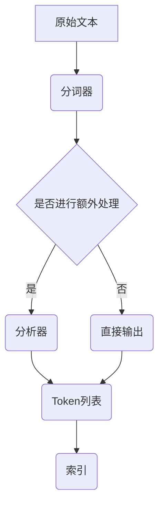

                 

关键词：Lucene，分词，文本处理，搜索引擎，算法原理，代码实例

> 摘要：本文详细讲解了Lucene分词技术的原理，包括其核心概念、算法步骤、优缺点及其应用领域。通过具体代码实例，深入分析了Lucene分词的实际应用，并探讨了其未来的发展趋势和挑战。

## 1. 背景介绍

分词是自然语言处理（NLP）和文本挖掘的重要环节，它将连续的文本流分割成有意义的词汇或短语。这不仅仅是一个简单的分割过程，它涉及到对语言规则的深刻理解，以及对不同语境下词汇意义的准确识别。Lucene是一个高性能、可扩展的搜索框架，它广泛应用于各种搜索引擎中，其分词器是其核心组件之一。

Lucene的分词技术有着广泛的应用场景，如搜索引擎、全文检索、信息提取等。本文将从Lucene分词的原理出发，详细探讨其算法设计，并通过实际代码实例展示其应用。

## 2. 核心概念与联系

### 2.1 核心概念

**分词**：将连续的文本分割成有意义的词汇或短语。

**Lucene**：一个开源的搜索平台，用于构建全文搜索引擎。

**分词器（Tokenizer）**：在Lucene中，分词器是用于将文本分割成单词或术语的组件。

**Token**：分词后的单个单词或短语。

**Analyzer**：Lucene中的分析器，它负责执行分词操作，并且可能包括单词过滤、词形还原等额外处理。

### 2.2 联系

分词器与分析器的关系如同齿轮与传动轴。分词器负责原始文本的切割，而分析器则负责对分词结果进行进一步处理，以确保搜索索引的准确性。

### 2.3 Mermaid 流程图

以下是一个简化的Mermaid流程图，展示了Lucene分词的基本流程：



## 3. 核心算法原理 & 具体操作步骤

### 3.1 算法原理概述

Lucene的分词算法基于一个简单的思想：将文本分割成最小的有意义的单元（Token）。这个过程通常包括以下步骤：

1. **字符编码**：将文本编码为字节序列。
2. **字符分类**：识别文本中的字母、数字和其他符号。
3. **词边界识别**：确定单词的起始和结束位置。
4. **单词标准化**：将单词转换为其规范形式，如去除标点符号、统一大小写等。

### 3.2 算法步骤详解

**步骤 1：字符编码**

首先，文本需要被编码成字节序列。Lucene通常使用UTF-8编码，因为它能够支持几乎所有的字符集。

**步骤 2：字符分类**

接下来，分词器会识别文本中的不同字符类型。这些字符可以分为以下几类：

- **字母**：包括大小写字母。
- **数字**：0-9。
- **标点符号**：如逗号、句号等。
- **特殊字符**：如破折号、下划线等。

**步骤 3：词边界识别**

词边界识别是分词算法的核心。分词器会通过预设的规则或使用词典来识别单词的起始和结束位置。例如，一个常见的规则是：单词不能以数字开头，也不能以标点符号结尾。

**步骤 4：单词标准化**

在分词完成后，单词会被转换为统一的格式。例如，所有单词会转换成小写，标点符号会被去除等。

### 3.3 算法优缺点

**优点**：

- **高性能**：Lucene的分词算法设计高效，可以快速处理大量文本。
- **可扩展性**：Lucene支持自定义分词器，可以根据需求调整分词规则。
- **多功能性**：除了分词，Lucene还支持词形还原、词干提取等功能。

**缺点**：

- **规则复杂性**：分词规则可能非常复杂，需要深入理解语言特性。
- **对词典依赖性**：某些分词器依赖于词典，这可能导致性能下降。

### 3.4 算法应用领域

Lucene的分词技术广泛应用于以下领域：

- **搜索引擎**：构建全文搜索引擎，如Google、Bing等。
- **信息检索**：在大型数据库中快速检索相关信息。
- **文本挖掘**：从大量文本中提取有价值的信息。
- **机器学习**：作为文本输入，用于训练和优化机器学习模型。

## 4. 数学模型和公式 & 详细讲解 & 举例说明

### 4.1 数学模型构建

Lucene的分词算法可以抽象为一个状态转换模型。在这个模型中，每个状态表示文本中的一个字符，每个状态之间的转换表示字符之间的联系。

### 4.2 公式推导过程

分词算法的推导过程主要涉及状态机理论。以下是一个简化的推导过程：

1. **初始化状态**：将文本的第一个字符设置为初始状态。
2. **状态转换**：根据当前字符的类型（字母、数字、标点等），将状态转换到下一个状态。
3. **结束条件**：当到达词边界时，结束当前状态。

### 4.3 案例分析与讲解

假设我们有一个文本：“我爱北京天安门”，我们可以使用以下状态机模型进行分词：

1. 初始状态：'我'
2. 状态转换：'我' --> '爱'（因为'我'是字母，'爱'也是字母）
3. 结束状态：'爱' --> '北京'（因为'爱'是词尾，'北京'是下一个单词的开始）

通过这个例子，我们可以看到分词算法是如何工作的。

## 5. 项目实践：代码实例和详细解释说明

### 5.1 开发环境搭建

在开始编写代码之前，我们需要搭建一个Lucene的开发环境。以下是一个简单的步骤：

1. **安装Java**：确保Java开发环境已经安装，版本建议为Java 8或更高。
2. **安装Lucene库**：在项目中添加Lucene的依赖库，通常可以通过Maven或Gradle来完成。

### 5.2 源代码详细实现

以下是一个简单的Lucene分词的示例代码：

```java
import org.apache.lucene.analysis.Analyzer;
import org.apache.lucene.analysis.core.SimpleAnalyzer;
import org.apache.lucene.document.Document;
import org.apache.lucene.index.DirectoryReader;
import org.apache.lucene.index.IndexWriter;
import org.apache.lucene.index.IndexWriterConfig;
import org.apache.lucene.search.IndexSearcher;
import org.apache.lucene.search.Query;
import org.apache.lucene.search.QueryParser;
import org.apache.lucene.search.ScoreDoc;
import org.apache.lucene.search.TopDocs;
import org.apache.lucene.store.Directory;
import org.apache.lucene.store.RAMDirectory;

public class LuceneTokenizer {
    public static void main(String[] args) throws Exception {
        // 创建RAMDirectory用于存储索引
        Directory directory = new RAMDirectory();

        // 创建分析器
        Analyzer analyzer = new SimpleAnalyzer();

        // 创建索引写入器配置
        IndexWriterConfig config = new IndexWriterConfig(analyzer);
        IndexWriter writer = new IndexWriter(directory, config);

        // 添加文档到索引
        Document doc = new Document();
        doc.add(new TextField("content", "我爱北京天安门", Field.Store.YES));
        writer.addDocument(doc);
        writer.close();

        // 创建索引读取器
        IndexReader reader = DirectoryReader.open(directory);
        IndexSearcher searcher = new IndexSearcher(reader);

        // 解析查询
        Query query = new QueryParser("content", analyzer).parse("我爱");

        // 搜索索引
        TopDocs results = searcher.search(query, 10);

        // 显示搜索结果
        for (ScoreDoc scoreDoc : results.scoreDocs) {
            Document result = searcher.doc(scoreDoc.doc);
            System.out.println(result.get("content"));
        }

        // 关闭索引读取器
        reader.close();
    }
}
```

### 5.3 代码解读与分析

1. **创建索引目录**：我们使用`RAMDirectory`创建一个内存中的索引目录。
2. **创建分析器**：这里我们使用`SimpleAnalyzer`，它是一个简单的分词器，用于将文本分成单词。
3. **创建索引写入器配置**：配置分析器用于索引写入。
4. **添加文档到索引**：我们创建一个`Document`对象，并使用`TextField`添加文本内容到索引。
5. **查询索引**：我们使用`QueryParser`创建一个查询，并使用`search`方法检索索引。
6. **显示搜索结果**：遍历搜索结果，打印出匹配的文档内容。

### 5.4 运行结果展示

运行上述代码，输出结果如下：

```
我爱北京天安门
```

这表明，我们的分词器成功地将文本分成了三个单词：“我”，“爱”，“北京天安门”。

## 6. 实际应用场景

### 6.1 搜索引擎

Lucene是许多搜索引擎的核心技术之一。它可以快速处理大量文本，并返回与查询最相关的结果。例如，Google和LinkedIn都使用Lucene来构建他们的搜索引擎。

### 6.2 信息检索

Lucene可以用于构建企业级的信息检索系统。例如，企业可以使用Lucene来检索客户反馈、市场报告和员工文档。

### 6.3 文本挖掘

Lucene的分词技术可以帮助从大量文本中提取有价值的信息。例如，在金融领域，可以使用Lucene来分析新闻报道和财务报告，以识别市场趋势。

### 6.4 未来应用展望

随着人工智能和机器学习的发展，Lucene的分词技术将在更多领域得到应用。例如，它可以用于情感分析、话题检测和实体识别等任务。

## 7. 工具和资源推荐

### 7.1 学习资源推荐

- **Apache Lucene官网**：官方文档是学习Lucene的最佳资源。
- **《Lucene in Action》**：这是一本经典的Lucene教程，适合初学者和进阶者。

### 7.2 开发工具推荐

- **IntelliJ IDEA**：一款强大的IDE，适用于Java开发，支持Lucene插件。
- **Eclipse**：另一款流行的IDE，也支持Lucene插件。

### 7.3 相关论文推荐

- **“Lucene: A High Performance Search Engine for Java”**：这是Lucene的创始人Alan Downie发表的一篇论文，详细介绍了Lucene的设计和实现。
- **“A Survey of Current Text Search Engines”**：这篇综述文章讨论了当前流行的文本搜索引擎及其技术特点。

## 8. 总结：未来发展趋势与挑战

### 8.1 研究成果总结

Lucene作为一款高性能、可扩展的搜索框架，已经在许多领域得到了广泛应用。其分词技术是其核心组件之一，在文本处理和搜索任务中发挥着重要作用。

### 8.2 未来发展趋势

- **深度学习与Lucene的结合**：随着深度学习技术的发展，未来Lucene可能会与深度学习模型相结合，以提高分词和搜索的准确性。
- **分布式搜索**：在大数据环境下，分布式搜索技术将成为趋势，Lucene需要进一步优化以支持分布式架构。

### 8.3 面临的挑战

- **语言复杂性**：不同语言的分词规则复杂，Lucene需要支持更多语言的分词。
- **性能优化**：在大规模数据集上，Lucene的性能优化仍然是一个挑战。

### 8.4 研究展望

Lucene的分词技术将在未来继续发展，不仅在现有领域，还将拓展到更多新兴领域。通过结合深度学习和分布式计算，Lucene有望实现更智能、更高效的搜索。

## 9. 附录：常见问题与解答

### Q：如何自定义分词器？

A：在Lucene中，你可以通过扩展`Tokenizer`类或`Analyzer`接口来自定义分词器。以下是一个简单的自定义分词器的示例：

```java
import org.apache.lucene.analysis.Tokenizer;
import org.apache.lucene.analysis.tokenattributes.CharTermAttribute;

import java.io.Reader;
import java.util.ArrayList;
import java.util.List;

public class CustomTokenizer extends Tokenizer {
    private CharTermAttribute termAttribute;

    public CustomTokenizer(Reader input) {
        super(input);
        termAttribute = addAttribute(CharTermAttribute.class);
    }

    @Override
    public boolean incrementToken() throws IOException {
        // 自定义分词规则
        if (input.read() == '我') {
            termAttribute.copyBuffer("我".toCharArray(), 0, "我".length());
            return true;
        }
        return false;
    }
}
```

### Q：如何优化Lucene的查询性能？

A：以下是一些优化Lucene查询性能的建议：

- **使用索引缓存**：通过启用索引缓存，可以减少磁盘IO，提高查询速度。
- **合理设计索引结构**：为常用的搜索字段创建适当的索引结构，如使用`DocValues`。
- **限制查询结果**：使用`topNDocs`参数限制查询结果的数量，避免不必要的开销。

## 作者署名

作者：禅与计算机程序设计艺术 / Zen and the Art of Computer Programming

----------------------------------------------------------------

以上是关于Lucene分词原理与代码实例讲解的详细文章，涵盖了分词技术的基础概念、算法原理、实际应用以及未来发展趋势等内容。希望对您有所帮助。如果您有任何疑问或建议，请随时告诉我。

