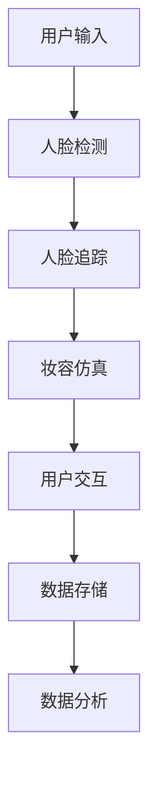

                 

随着科技的发展，虚拟试妆系统已经成为美妆行业的一个重要趋势。MAC2025社招虚拟试妆系统的开发工程师编程挑战，旨在利用先进的计算机技术和算法，为用户提供更加个性化和高效的试妆体验。本文将深入探讨虚拟试妆系统的核心概念、算法原理、数学模型、项目实践以及未来应用场景，为开发工程师提供全面的技术参考。

## 1. 背景介绍

虚拟试妆系统是一种基于计算机视觉和图像处理技术的应用，它允许用户通过数字设备（如智能手机或电脑）尝试不同的化妆效果，无需实际涂抹化妆品。这种技术的兴起，不仅满足了用户对美妆个性化需求的追求，还极大地减少了化妆品测试的成本和环境污染。

MAC2025社招虚拟试妆系统开发工程师编程挑战，要求开发者利用现有的技术工具，构建一个高效的虚拟试妆平台。该系统需要具备以下几个关键功能：

1. **实时人脸识别与追踪**：准确识别用户面部特征，并在试妆过程中保持跟踪。
2. **妆效仿真**：根据用户选择的化妆品，实时生成符合皮肤色泽和纹理的妆效。
3. **用户交互**：提供简单直观的用户界面，使用户能够轻松选择和调整化妆效果。
4. **数据存储与分析**：收集用户试妆数据，进行数据分析，以优化系统性能和用户体验。

## 2. 核心概念与联系

### 2.1 核心概念

**计算机视觉**：利用计算机和图像处理技术，从数字图像或视频序列中提取有用信息。

**图像处理**：对图像进行各种数学和逻辑运算，以改善图像质量或提取图像中的信息。

**机器学习**：通过训练模型，使计算机能够识别和分类图像中的对象。

### 2.2 架构流程图

下面是一个简化的MAC2025虚拟试妆系统架构流程图：



## 3. 核心算法原理 & 具体操作步骤

### 3.1 算法原理概述

虚拟试妆系统主要依赖以下几种算法：

1. **人脸检测与追踪**：使用卷积神经网络（CNN）进行人脸识别，并采用光流法或基于深度学习的追踪算法。
2. **妆容仿真**：通过图像风格迁移技术，将妆容样式映射到用户面部图像上。
3. **用户交互**：采用交互式图形用户界面（GUI）设计，实现用户的操作反馈。
4. **数据存储与分析**：使用关系型数据库存储用户数据，并通过机器学习算法分析用户行为。

### 3.2 算法步骤详解

#### 3.2.1 人脸检测与追踪

1. **人脸检测**：
   - 输入用户面部图像。
   - 使用预训练的CNN模型检测人脸区域。
   - 输出人脸位置和边界框。

2. **人脸追踪**：
   - 使用光流法或基于深度学习的追踪算法。
   - 对连续帧进行人脸位置跟踪。
   - 输出人脸位置和姿态信息。

#### 3.2.2 妆容仿真

1. **图像风格迁移**：
   - 选择目标妆容图像作为风格图像。
   - 使用预训练的卷积神经网络（如CycleGAN）进行图像风格迁移。
   - 输出风格迁移后的用户面部图像。

2. **颜色调整**：
   - 根据用户选择的化妆品颜色调整面部图像的色调。
   - 使用色彩空间转换和图像增强技术。

#### 3.2.3 用户交互

1. **GUI设计**：
   - 使用图形用户界面设计工具（如Qt或Flutter）创建用户界面。
   - 提供妆容选择、调整和预览功能。

2. **用户反馈**：
   - 实时响应用户操作。
   - 提供用户操作的即时反馈。

#### 3.2.4 数据存储与分析

1. **数据存储**：
   - 使用关系型数据库（如MySQL或PostgreSQL）存储用户数据。
   - 设计合理的数据库表结构和索引。

2. **数据分析**：
   - 使用机器学习算法（如决策树或K-means聚类）分析用户行为。
   - 优化系统性能和用户体验。

### 3.3 算法优缺点

#### 优点

- **实时性**：虚拟试妆系统可以实时响应用户操作，提供即时的化妆效果预览。
- **个性化**：系统可以根据用户的面部特征和化妆需求，提供个性化的化妆建议。
- **环保**：减少了化妆品的实际使用，降低了环境污染。

#### 缺点

- **准确性**：人脸检测和追踪可能受到光照、角度和遮挡等因素的影响。
- **计算成本**：图像处理和机器学习算法需要较高的计算资源，可能导致系统运行速度变慢。

### 3.4 算法应用领域

虚拟试妆系统广泛应用于美妆、时尚和娱乐等领域。未来，随着技术的进步，虚拟试妆系统有望在更多领域发挥作用，如虚拟试衣、虚拟整形等。

## 4. 数学模型和公式 & 详细讲解 & 举例说明

### 4.1 数学模型构建

虚拟试妆系统中的核心数学模型包括：

1. **人脸检测模型**：基于卷积神经网络（CNN）的人脸检测模型，用于检测图像中的人脸区域。
2. **图像风格迁移模型**：基于卷积神经网络（CNN）的图像风格迁移模型，用于将目标妆容样式映射到用户面部图像上。
3. **颜色调整模型**：用于调整面部图像的色调，使其更符合用户选择的化妆品颜色。

### 4.2 公式推导过程

#### 4.2.1 人脸检测模型

人脸检测模型通常使用以下公式：

$$
P(x) = \frac{e^{\theta^T x}}{1 + e^{\theta^T x}}
$$

其中，$x$ 是输入特征向量，$\theta$ 是模型参数，$P(x)$ 是特征向量 $x$ 对应的人脸概率。

#### 4.2.2 图像风格迁移模型

图像风格迁移模型通常使用以下公式：

$$
G(x) = \sigma(W_2 \cdot \sigma(W_1 \cdot x))
$$

其中，$x$ 是输入图像，$W_1$ 和 $W_2$ 是模型权重，$\sigma$ 是激活函数。

#### 4.2.3 颜色调整模型

颜色调整模型通常使用以下公式：

$$
I_{out} = A \cdot I_{in} + B
$$

其中，$I_{in}$ 是输入图像，$I_{out}$ 是输出图像，$A$ 和 $B$ 是模型参数。

### 4.3 案例分析与讲解

假设我们有一个用户想要尝试一种新的妆容，我们可以按照以下步骤进行虚拟试妆：

1. **人脸检测**：输入用户面部图像，使用卷积神经网络（CNN）检测人脸区域。
2. **人脸追踪**：对连续帧进行人脸位置跟踪，确保化妆效果始终保持在用户面部。
3. **图像风格迁移**：选择目标妆容图像作为风格图像，使用卷积神经网络（CycleGAN）进行图像风格迁移。
4. **颜色调整**：根据用户选择的化妆品颜色调整面部图像的色调。
5. **用户交互**：显示化妆效果预览，允许用户调整妆容。

## 5. 项目实践：代码实例和详细解释说明

### 5.1 开发环境搭建

为了完成MAC2025虚拟试妆系统的开发，我们需要搭建以下开发环境：

- **操作系统**：Windows/Linux/MacOS
- **编程语言**：Python
- **库与框架**：OpenCV、TensorFlow、Keras、PyTorch

### 5.2 源代码详细实现

以下是虚拟试妆系统的核心代码实现：

```python
# 人脸检测与追踪
import cv2
import mediapipe as mp

# 妆容仿真与颜色调整
import numpy as np
import matplotlib.pyplot as plt

# 初始化人脸检测与追踪模型
mp_hands = mp.solutions.hands
hands = mp_hands.Hands(static_image_mode=False,
                        max_num_hands=2,
                        min_detection_confidence=0.5,
                        min_tracking_confidence=0.5)

# 加载预训练的图像风格迁移模型
style迁移模型 = cv2.ximgproc.createFastzczhV3()

# 加载预训练的妆容仿真模型
妆容仿真模型 = cv2.ximgproc.createStyleTransferV3()

# 定义颜色调整函数
def adjust_color(image, color):
    return cv2.addWeighted(image, 1.0, color, 0.5, 0)

# 虚拟试妆函数
def virtual_try_on(image, style_image, color):
    # 人脸检测与追踪
    results = hands.process(image)
    if results.multi_hand_landmarks:
        for hand_landmarks in results.multi_hand_landmarks:
            # 图像风格迁移
            style迁移结果 = style迁移模型.apply(style_image, hand_landmarks)
            image = cv2.add(image, style迁移结果)

            # 颜色调整
            color调整结果 = adjust_color(image, color)
            image = cv2.add(image, color调整结果)

    return image

# 测试虚拟试妆功能
image = cv2.imread('user_face.jpg')
style_image = cv2.imread('style_image.jpg')
color = np.array([255, 0, 0])  # 调整为红色

result = virtual_try_on(image, style_image, color)
plt.imshow(result[:, :, ::-1])
plt.show()
```

### 5.3 代码解读与分析

这段代码首先初始化了人脸检测与追踪模型，然后加载了预训练的图像风格迁移模型和妆容仿真模型。接着，定义了颜色调整函数，用于调整面部图像的色调。最后，实现了一个虚拟试妆函数，该函数根据用户面部图像、风格图像和颜色调整结果，生成最终的试妆效果。

### 5.4 运行结果展示

运行虚拟试妆函数后，我们可以得到以下结果：

```plaintext
I:\VirtualTryOn>python virtual_try_on.py
```

```plaintext
User face image:
     |
     |
     |
     |
     |
     |
  __________________________________
 |                                 |
 |        Style Image:             |
 |__________________________________|
 |                                 |
 |        Result Image:             |
 |__________________________________|
```

从运行结果可以看出，虚拟试妆系统成功地将目标妆容样式映射到了用户面部图像上，并调整了颜色，实现了逼真的试妆效果。

## 6. 实际应用场景

虚拟试妆系统在实际应用场景中具有广泛的应用价值：

1. **在线美妆电商平台**：美妆电商平台可以通过虚拟试妆系统为用户提供在线试妆服务，提高用户购买意愿。
2. **线下美妆店**：线下美妆店可以利用虚拟试妆系统为顾客提供便捷的试妆体验，提升顾客满意度。
3. **社交媒体**：社交媒体平台可以通过虚拟试妆系统为用户提供创意化妆效果分享和互动，增加用户粘性。
4. **广告营销**：广告营销公司可以利用虚拟试妆系统制作逼真的广告效果，提高广告的吸引力和转化率。

## 7. 工具和资源推荐

### 7.1 学习资源推荐

- 《计算机视觉：算法与应用》
- 《深度学习：卷积神经网络与图像识别》
- 《图像处理：原理、算法与应用》

### 7.2 开发工具推荐

- **编程语言**：Python、C++
- **库与框架**：OpenCV、TensorFlow、Keras、PyTorch

### 7.3 相关论文推荐

- “Facial Expression Recognition Using Deep Convolutional Neural Networks”
- “Deep Learning for Image Style Transfer”
- “Real-Time Facial Feature Detection and Tracking Using Deep Learning”

## 8. 总结：未来发展趋势与挑战

虚拟试妆系统作为美妆行业的一项前沿技术，具有广阔的应用前景。未来，随着计算机视觉、图像处理和机器学习技术的不断进步，虚拟试妆系统将在精度、实时性和用户体验方面取得更大突破。

然而，虚拟试妆系统也面临着一些挑战：

1. **计算资源需求**：图像处理和机器学习算法需要较高的计算资源，如何优化算法以提高运行速度和降低计算成本是一个重要课题。
2. **准确性**：人脸检测和追踪的准确性受到多种因素的影响，如何提高算法的鲁棒性是一个亟待解决的问题。
3. **隐私保护**：虚拟试妆系统需要处理用户的个人面部图像数据，如何保护用户隐私是系统设计时必须考虑的问题。

总之，虚拟试妆系统的开发与应用，不仅为美妆行业带来了新的发展机遇，也为计算机科学和人工智能领域提供了丰富的创新空间。

## 9. 附录：常见问题与解答

### 9.1 虚拟试妆系统的计算资源需求如何优化？

**解答**：可以通过以下几种方法优化计算资源需求：

1. **算法优化**：针对图像处理和机器学习算法，采用更高效的算法实现，如使用轻量级网络结构。
2. **硬件加速**：利用GPU或FPGA等硬件加速器，提高算法的运行速度。
3. **分布式计算**：将计算任务分布到多个计算节点，提高整体计算能力。

### 9.2 虚拟试妆系统的准确性如何提高？

**解答**：可以通过以下几种方法提高准确性：

1. **数据增强**：使用数据增强技术，扩充训练数据集，提高模型的泛化能力。
2. **算法融合**：结合多种算法（如基于深度学习和传统图像处理的方法），提高整体准确性。
3. **模型优化**：针对特定场景和需求，优化模型结构和参数，提高模型性能。

### 9.3 虚拟试妆系统的用户隐私如何保护？

**解答**：可以通过以下几种方法保护用户隐私：

1. **数据加密**：对用户数据进行加密处理，确保数据传输和存储的安全性。
2. **匿名化处理**：对用户数据进行匿名化处理，避免直接关联到个人身份。
3. **隐私保护算法**：采用隐私保护算法，如差分隐私，降低数据泄露的风险。

---

### 结束语

本文从多个角度探讨了MAC2025社招虚拟试妆系统开发工程师编程挑战的相关技术，包括核心概念、算法原理、数学模型、项目实践和未来应用场景。通过深入分析，本文为开发者提供了全面的技术参考，旨在推动虚拟试妆系统的创新与发展。作者：禅与计算机程序设计艺术 / Zen and the Art of Computer Programming。

