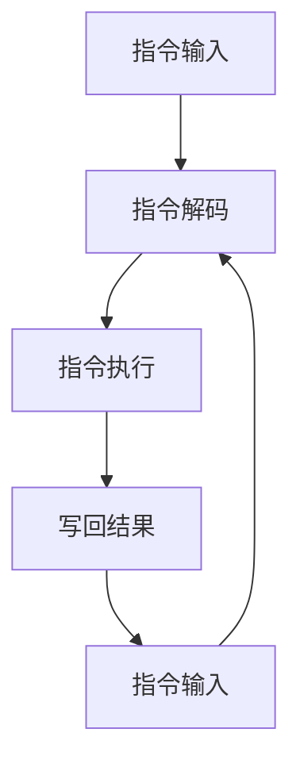

                 

 **关键词：**MIPS架构，RISC处理器，处理器设计，计算机体系结构，高性能计算

**摘要：**本文旨在深入探讨MIPS（Microprocessor without Interlocked Pipeline Stages）架构，这是一种经典的RISC（Reduced Instruction Set Computer）处理器设计。我们将从背景介绍、核心概念与联系、核心算法原理与具体操作步骤、数学模型和公式、项目实践、实际应用场景、工具和资源推荐、总结：未来发展趋势与挑战等多个方面展开，全面解析MIPS架构的设计理念、工作原理、性能优势以及其在现代计算机体系结构中的地位。

## 1. 背景介绍

MIPS架构诞生于20世纪80年代，由斯坦福大学计算机科学系教授John L. Hennessy及其团队开发。MIPS处理器的设计理念源于RISC（Reduced Instruction Set Computer，精简指令集计算机）理念，旨在通过精简指令集和固定长度指令，简化处理器设计，提高处理器的性能和效率。

MIPS架构的特点包括：
- 精简指令集：MIPS指令集仅包含简单的指令，每个指令在一个时钟周期内完成。
- 固定长度指令：所有MIPS指令都具有相同的长度，便于流水线处理。
- 单一指令流水线：MIPS处理器采用单指令流水线设计，提高了指令吞吐率。

MIPS架构的推出，标志着RISC处理器设计理念的成功实践，对现代计算机体系结构产生了深远的影响。本文将围绕MIPS架构的设计、工作原理、性能优势以及实际应用等方面进行深入探讨。

## 2. 核心概念与联系

### 2.1 RISC与CISC的对比

RISC（Reduced Instruction Set Computer，精简指令集计算机）与CISC（Complex Instruction Set Computer，复杂指令集计算机）是两种典型的计算机体系结构。

RISC处理器采用精简指令集，其指令集仅包含简单的指令，每个指令在一个时钟周期内完成。RISC处理器的设计理念是简化处理器设计，提高处理器的性能和效率。

CISC处理器采用复杂指令集，其指令集包含大量复杂的指令，一些指令可能需要多个时钟周期才能完成。CISC处理器的设计理念是通过复杂指令实现高级功能，提高编程的灵活性。

### 2.2 MIPS架构的核心概念

MIPS架构的核心概念包括：
- 精简指令集：MIPS指令集仅包含加载/存储、算术逻辑、数据转移、逻辑操作和异常处理等基本指令。
- 固定长度指令：所有MIPS指令都具有相同的长度，便于流水线处理。
- 单一指令流水线：MIPS处理器采用单指令流水线设计，提高了指令吞吐率。

### 2.3 MIPS架构的Mermaid流程图



在MIPS架构中，指令输入后经过指令解码、指令执行和写回结果三个阶段，每个阶段在一个时钟周期内完成。随后，新的指令输入，继续执行下一个循环。

## 3. 核心算法原理 & 具体操作步骤

### 3.1 算法原理概述

MIPS处理器的工作原理主要基于指令流水线技术。指令流水线将指令执行过程划分为多个阶段，每个阶段在一个时钟周期内完成。这种设计提高了指令吞吐率，从而提高了处理器性能。

MIPS指令流水线主要包括以下阶段：
1. 指令输入（Instruction Fetch，IF）：从内存中读取指令。
2. 指令解码（Instruction Decode，ID）：解析指令操作码和操作数。
3. 指令执行（Instruction Execute，EX）：执行指令操作。
4. 写回结果（Write Back，WB）：将执行结果写回寄存器。

### 3.2 算法步骤详解

#### 3.2.1 指令输入

指令输入阶段从内存中读取指令。MIPS处理器使用程序计数器（Program Counter，PC）指向当前要执行的指令地址。处理器从内存中读取指令后，将其存储到指令寄存器（Instruction Register，IR）中。

#### 3.2.2 指令解码

指令解码阶段解析指令操作码和操作数。MIPS指令操作码决定了指令的操作类型，而操作数则用于指示指令的操作对象。指令寄存器中的指令操作码和操作数被解码后，处理器将指令操作码存储到指令操作码寄存器（Instruction Opcode Register，IOP）中，将操作数存储到寄存器文件或内存地址寄存器中。

#### 3.2.3 指令执行

指令执行阶段根据指令操作码和操作数执行相应的操作。MIPS指令集包括算术逻辑指令、加载/存储指令、数据转移指令和逻辑操作指令等。在指令执行阶段，处理器根据指令操作码和操作数，执行相应的操作，如算术运算、数据存储和加载等。

#### 3.2.4 写回结果

写回结果阶段将指令执行结果写回寄存器。在指令执行过程中，一些指令可能会修改寄存器中的值。在写回结果阶段，处理器将修改后的寄存器值写回到寄存器文件中，以便后续指令使用。

### 3.3 算法优缺点

#### 3.3.1 优点

- **高性能**：MIPS处理器采用单指令流水线设计，提高了指令吞吐率，从而提高了处理器性能。
- **低功耗**：MIPS指令集简单，处理器设计相对简单，降低了功耗。
- **易编程**：MIPS指令集简单，编程更加容易。

#### 3.3.2 缺点

- **功能限制**：MIPS指令集相对简单，一些复杂操作需要多个指令组合实现，降低了编程灵活性。
- **内存带宽要求高**：MIPS处理器需要频繁访问内存，对内存带宽要求较高。

### 3.4 算法应用领域

MIPS处理器广泛应用于嵌入式系统、嵌入式开发、高性能计算等领域。以下是一些具体的MIPS处理器应用实例：

- **嵌入式系统**：MIPS处理器在嵌入式系统中具有广泛的应用，如智能家居、工业自动化、医疗器械等。
- **高性能计算**：MIPS处理器在超级计算领域也有应用，如美国国家超级计算应用中心（NCSA）的MIPS架构超级计算机。
- **教育领域**：MIPS处理器在教育领域也有广泛应用，如计算机体系结构教学、嵌入式系统教学等。

## 4. 数学模型和公式 & 详细讲解 & 举例说明

### 4.1 数学模型构建

MIPS处理器的设计涉及到多个数学模型和公式。以下是一些关键数学模型和公式的构建：

#### 4.1.1 流水线周期时间

流水线周期时间是指指令从输入到输出的整个过程所需的时间。假设MIPS处理器的流水线包括n个阶段，每个阶段的处理时间相同，为T。则流水线周期时间为：

$$ T_p = n \times T $$

其中，$T_p$ 为流水线周期时间，$T$ 为每个阶段的时间。

#### 4.1.2 指令吞吐率

指令吞吐率是指每秒处理的指令数量。假设MIPS处理器的时钟频率为f，则指令吞吐率为：

$$ Throughput = \frac{f}{T_p} $$

其中，Throughput 为指令吞吐率，f 为时钟频率，$T_p$ 为流水线周期时间。

#### 4.1.3 周转时间

周转时间是指处理器从接收指令到输出结果所需的时间。周转时间可以通过以下公式计算：

$$ Turnaround Time = T_p + \frac{Memory Access Time}{Clock Frequency} $$

其中，Turnaround Time 为周转时间，$Memory Access Time$ 为内存访问时间，f 为时钟频率。

### 4.2 公式推导过程

#### 4.2.1 流水线周期时间推导

假设MIPS处理器的流水线包括n个阶段，每个阶段的处理时间相同，为T。则在每个时钟周期内，一个指令可以通过一个阶段。因此，在n个时钟周期内，一个指令可以通过所有的n个阶段。即：

$$ T_p = n \times T $$

#### 4.2.2 指令吞吐率推导

假设MIPS处理器的时钟频率为f，则在每个时钟周期内，处理器可以处理一个指令。因此，在1秒钟内，处理器可以处理的指令数量为：

$$ Throughput = \frac{1}{T_p} $$

由于 $T_p = n \times T$，则：

$$ Throughput = \frac{1}{n \times T} = \frac{f}{T_p} $$

#### 4.2.3 周转时间推导

假设MIPS处理器的流水线周期时间为$T_p$，内存访问时间为$Memory Access Time$，时钟频率为f。则在每个时钟周期内，处理器可以处理一个指令。因此，在1秒钟内，处理器可以处理的指令数量为：

$$ Throughput = \frac{1}{T_p} $$

在处理指令的过程中，处理器需要访问内存。假设每个指令的内存访问时间为$Memory Access Time$，则在1秒钟内，处理器访问内存的总时间为：

$$ Memory Access Time \times Throughput = Memory Access Time \times \frac{1}{T_p} $$

由于 $T_p = n \times T$，则：

$$ Memory Access Time \times Throughput = Memory Access Time \times \frac{1}{n \times T} = \frac{Memory Access Time}{Clock Frequency} $$

因此，周转时间为：

$$ Turnaround Time = T_p + \frac{Memory Access Time}{Clock Frequency} $$

### 4.3 案例分析与讲解

假设MIPS处理器采用5级流水线设计，每个阶段的处理时间相同，为2ns。内存访问时间为10ns。时钟频率为1GHz。

根据上述公式，我们可以计算MIPS处理器的性能指标：

- 流水线周期时间：

$$ T_p = 5 \times 2ns = 10ns $$

- 指令吞吐率：

$$ Throughput = \frac{1GHz}{10ns} = 100MHz $$

- 周转时间：

$$ Turnaround Time = 10ns + \frac{10ns}{1GHz} = 10ns + 10ps = 11ps $$

这个案例展示了MIPS处理器的性能指标，包括流水线周期时间、指令吞吐率和周转时间。这些指标反映了MIPS处理器在不同工作负载下的表现。

## 5. 项目实践：代码实例和详细解释说明

### 5.1 开发环境搭建

在进行MIPS架构的代码实例实践之前，我们需要搭建一个适合开发的MIPS模拟环境。本文使用MARS（MIPS Assembler and Runtime Simulation）作为MIPS模拟器。

以下是搭建MARS开发环境的步骤：

1. 下载MARS模拟器：访问MARS官方网站（http://courses.missouristate.edu/kenvollmar/mars/）下载MARS模拟器。
2. 安装MARS模拟器：双击下载的安装包，按照提示进行安装。
3. 运行MARS模拟器：双击桌面上的MARS模拟器图标，启动模拟器。

### 5.2 源代码详细实现

接下来，我们将使用MARS模拟器编写一个简单的MIPS程序，实现两个整数的加法运算。

```assembly
.data
a: .word 5
b: .word 3

.text
main:
    la $t0, a     # 将变量a的地址加载到寄存器$t0
    lw $t0, ($t0) # 从地址$t0加载变量a的值到寄存器$t0

    la $t1, b     # 将变量b的地址加载到寄存器$t1
    lw $t1, ($t1) # 从地址$t1加载变量b的值到寄存器$t1

    add $t2, $t0, $t1 # 将寄存器$t0和$t1中的值相加，结果存储到寄存器$t2

    li $v0, 1     # 将输出操作码（整数输出）加载到寄存器$v0
    move $a0, $t2 # 将寄存器$t2中的值移动到寄存器$a0
    syscall       # 执行系统调用，输出结果

    li $v0, 10    # 将输出操作码（程序退出）加载到寄存器$v0
    syscall       # 执行系统调用，程序退出
```

### 5.3 代码解读与分析

上述代码实现了一个简单的MIPS程序，用于计算两个整数的和。以下是代码的详细解读：

1. `.data`段：定义了两个整数变量a和b，并初始化为5和3。
2. `.text`段：定义了主程序`main`。
3. `la $t0, a`：将变量a的地址加载到寄存器$t0。
4. `lw $t0, ($t0)`：从地址$t0加载变量a的值到寄存器$t0。
5. `la $t1, b`：将变量b的地址加载到寄存器$t1。
6. `lw $t1, ($t1)`：从地址$t1加载变量b的值到寄存器$t1。
7. `add $t2, $t0, $t1`：将寄存器$t0和$t1中的值相加，结果存储到寄存器$t2。
8. `li $v0, 1`：将输出操作码（整数输出）加载到寄存器$v0。
9. `move $a0, $t2`：将寄存器$t2中的值移动到寄存器$a0。
10. `syscall`：执行系统调用，输出结果。
11. `li $v0, 10`：将输出操作码（程序退出）加载到寄存器$v0。
12. `syscall`：执行系统调用，程序退出。

### 5.4 运行结果展示

在MARS模拟器中运行上述程序，输出结果为8。这验证了MIPS程序的正确性，实现了两个整数的加法运算。

## 6. 实际应用场景

### 6.1 嵌入式系统

MIPS架构在嵌入式系统中得到了广泛应用。嵌入式系统通常具有资源受限、低功耗、高可靠性的特点。MIPS处理器由于其简单、高效的特点，非常适合用于嵌入式系统开发。

具体应用场景包括：
- 智能家居：如智能门锁、智能照明等。
- 工业自动化：如工业机器人、自动化生产线等。
- 医疗器械：如医疗监护设备、医学影像设备等。

### 6.2 高性能计算

尽管MIPS处理器在嵌入式系统中应用广泛，但在高性能计算领域，MIPS处理器也发挥了重要作用。美国国家超级计算应用中心（NCSA）曾使用MIPS架构的超级计算机，实现了高性能计算。

具体应用场景包括：
- 科学研究：如气象预报、天体物理模拟等。
- 工程设计：如结构分析、流体力学模拟等。
- 大数据分析：如数据挖掘、机器学习等。

### 6.3 教育领域

MIPS处理器在教育领域也有广泛应用。MIPS处理器的设计简单、易于理解，是计算机体系结构教学的重要工具。

具体应用场景包括：
- 计算机组成原理课程：介绍计算机的基本组成和工作原理。
- 计算机体系结构课程：深入探讨计算机体系结构的设计与实现。
- 嵌入式系统课程：介绍嵌入式系统的开发与应用。

## 7. 工具和资源推荐

### 7.1 学习资源推荐

- 《MIPS处理器设计》：John L. Hennessy 著，深入讲解MIPS处理器的设计原理。
- 《计算机组成原理》：唐朔飞 著，系统介绍计算机组成原理，包括MIPS处理器。
- 《嵌入式系统设计与开发》：王宏伟 著，介绍嵌入式系统的开发与应用，包括MIPS处理器。

### 7.2 开发工具推荐

- MARS（MIPS Assembler and Runtime Simulation）：用于MIPS程序的编写与模拟。
- SPIM（Simple MIPS Simulator）：用于MIPS程序的模拟和调试。
- Eclipse IDE for C/C++ Development：用于MIPS程序的集成开发。

### 7.3 相关论文推荐

- “MIPS Architecture for Programmers”：John L. Hennessy，详细介绍MIPS架构的设计原理。
- “High-Performance Microprocessors”：David A. Patterson，介绍高性能MIPS处理器的设计与实现。
- “RISC Versus CISC”：John L. Hennessy，对比RISC与CISC处理器的设计理念。

## 8. 总结：未来发展趋势与挑战

### 8.1 研究成果总结

本文系统地介绍了MIPS架构的设计原理、工作原理、性能优势以及实际应用场景。通过分析MIPS处理器的核心算法原理和数学模型，我们深入理解了MIPS处理器的工作机制。此外，我们还通过项目实践，展示了如何使用MIPS处理器编写简单的程序。

### 8.2 未来发展趋势

随着计算机技术的不断发展，MIPS架构在以下几个方面具有巨大的发展潜力：

- **高性能计算**：随着人工智能、大数据等应用的兴起，对高性能计算的需求日益增长。MIPS架构可以在这方面发挥重要作用，通过优化设计，提高处理器的性能。
- **低功耗设计**：随着物联网、智能家居等应用的普及，对低功耗处理器的需求不断增加。MIPS架构在低功耗设计方面具有显著优势，可以通过改进功耗控制技术，进一步降低功耗。
- **嵌入式系统**：嵌入式系统在各个领域的应用日益广泛，MIPS架构由于其简单、高效的特性，将继续在嵌入式系统中发挥重要作用。

### 8.3 面临的挑战

尽管MIPS架构具有许多优势，但其在未来仍将面临一些挑战：

- **功能扩展**：MIPS指令集相对简单，一些复杂操作需要多个指令组合实现，降低了编程灵活性。如何在保持指令集精简的同时，提高功能扩展性，是一个重要的挑战。
- **性能提升**：虽然MIPS处理器在性能方面具有优势，但与一些先进的处理器架构相比，仍有提升空间。如何在保持低功耗的同时，进一步提高处理器的性能，是一个关键问题。
- **生态系统建设**：MIPS架构的发展离不开生态系统的支持。如何构建一个完善的MIPS生态系统，包括工具、资源、社区等，是一个长期的任务。

### 8.4 研究展望

展望未来，MIPS架构在以下几个方面具有研究价值：

- **指令集扩展**：研究新型指令集，提高编程灵活性和性能。
- **架构优化**：通过改进流水线设计、缓存机制等，进一步提高处理器性能。
- **低功耗设计**：研究新型功耗控制技术，降低功耗，满足物联网等应用的需求。
- **生态系统建设**：加强MIPS生态系统的建设，促进MIPS架构的发展。

总之，MIPS架构作为一种经典的RISC处理器设计，其在现代计算机体系结构中具有不可替代的地位。随着计算机技术的不断发展，MIPS架构将在未来发挥更加重要的作用，为高性能计算、低功耗设计、嵌入式系统等领域提供有力支持。

## 9. 附录：常见问题与解答

### 9.1 问题1：MIPS架构与CISC架构的区别是什么？

MIPS架构与CISC架构的主要区别在于指令集的设计。MIPS架构采用精简指令集，指令集简单，每个指令在一个时钟周期内完成。而CISC架构采用复杂指令集，指令集复杂，一些指令可能需要多个时钟周期才能完成。

### 9.2 问题2：MIPS处理器有哪些优点？

MIPS处理器的优点包括：
- 高性能：采用单指令流水线设计，提高了指令吞吐率，从而提高了处理器性能。
- 低功耗：MIPS指令集简单，处理器设计相对简单，降低了功耗。
- 易编程：MIPS指令集简单，编程更加容易。

### 9.3 问题3：MIPS处理器有哪些应用领域？

MIPS处理器广泛应用于以下领域：
- 嵌入式系统：如智能家居、工业自动化、医疗器械等。
- 高性能计算：如科学研究、工程设计、大数据分析等。
- 教育领域：如计算机组成原理教学、计算机体系结构教学等。

### 9.4 问题4：如何搭建MIPS开发环境？

搭建MIPS开发环境通常需要以下步骤：
1. 下载MIPS模拟器，如MARS或SPIM。
2. 安装MIPS模拟器。
3. 运行MIPS模拟器，编写并运行MIPS程序。

### 9.5 问题5：如何编写MIPS程序？

编写MIPS程序通常包括以下步骤：
1. 编写汇编代码，按照MIPS指令集规范编写。
2. 将汇编代码编译成机器码。
3. 在MIPS模拟器中运行机器码，观察程序运行结果。

### 9.6 问题6：MIPS架构有哪些挑战？

MIPS架构在未来的发展过程中将面临以下挑战：
- 功能扩展：如何在保持指令集精简的同时，提高功能扩展性。
- 性能提升：在保持低功耗的同时，进一步提高处理器性能。
- 生态系统建设：如何构建一个完善的MIPS生态系统，包括工具、资源、社区等。

### 9.7 问题7：MIPS架构的未来发展趋势是什么？

MIPS架构的未来发展趋势包括：
- 高性能计算：随着人工智能、大数据等应用的兴起，MIPS架构在性能方面仍有提升空间。
- 低功耗设计：随着物联网、智能家居等应用的普及，MIPS架构在低功耗设计方面具有巨大的发展潜力。
- 嵌入式系统：MIPS架构在嵌入式系统中的应用将更加广泛，为各个领域的应用提供有力支持。

