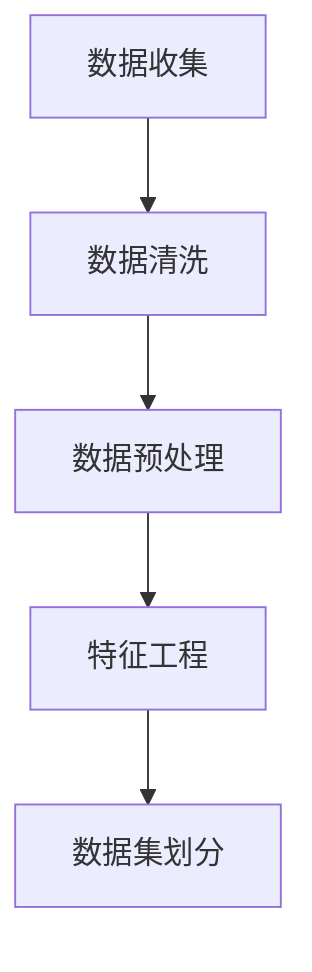
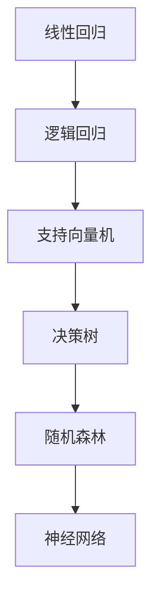
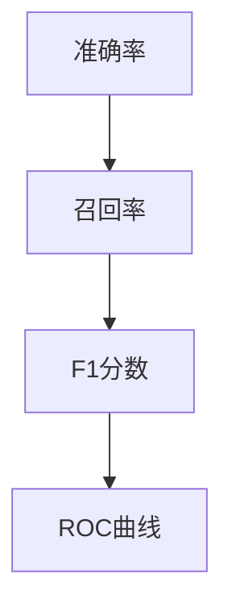

                 

关键词：机器学习，数据科学，人工智能，算法，深度学习，神经网络

摘要：本文将深入探讨机器学习的核心概念、算法原理、数学模型及实际应用。从基础到实践，我们将详细解读机器学习的各个方面，帮助读者建立对这一领域的全面理解。

## 1. 背景介绍

机器学习（Machine Learning，ML）作为人工智能（Artificial Intelligence，AI）的一个重要分支，自20世纪50年代诞生以来，已经经历了数个辉煌的发展阶段。它主要研究如何让计算机系统从数据中学习，逐步提高其性能和智能程度，而不需要显式地编程。随着互联网、大数据和计算能力的快速发展，机器学习已经广泛应用于自然语言处理、计算机视觉、推荐系统、金融、医疗等多个领域。

在过去的几十年中，机器学习的研究主要集中在统计学习方法和基于模型的算法上。然而，随着深度学习的兴起，机器学习的研究和应用都迎来了新的高潮。深度学习通过多层神经网络，实现了对复杂数据的高效处理和建模，成为当前机器学习的热点方向。

## 2. 核心概念与联系

### 2.1 数据准备

在进行机器学习之前，数据准备是至关重要的一步。数据清洗、数据预处理和特征工程都是为了提高模型的训练效果和预测准确性。



### 2.2 算法选择

不同的机器学习算法适用于不同类型的数据和问题。常见的算法包括线性回归、逻辑回归、支持向量机、决策树、随机森林、神经网络等。



### 2.3 模型评估

模型评估是验证机器学习模型性能的重要步骤。常用的评估指标包括准确率、召回率、F1分数、ROC曲线等。



## 3. 核心算法原理 & 具体操作步骤

### 3.1 算法原理概述

机器学习算法可以分为监督学习、无监督学习和强化学习。每种学习方式都有其独特的原理和应用场景。

### 3.2 算法步骤详解

1. 数据预处理：包括数据清洗、归一化、编码等。
2. 选择模型：根据问题类型和数据特征选择合适的模型。
3. 模型训练：使用训练数据集对模型进行训练。
4. 模型评估：使用验证数据集对模型进行评估。
5. 模型优化：根据评估结果调整模型参数。

### 3.3 算法优缺点

每种算法都有其优点和局限性。例如，神经网络模型可以处理复杂的非线性问题，但训练过程复杂；支持向量机在处理高维数据时表现优秀，但对大规模数据集的处理能力有限。

### 3.4 算法应用领域

机器学习在各个领域都有广泛的应用，如图像识别、语音识别、自然语言处理、金融风险控制、医疗诊断等。

## 4. 数学模型和公式 & 详细讲解 & 举例说明

### 4.1 数学模型构建

机器学习中的数学模型通常包括输入层、隐藏层和输出层。每个层由多个神经元组成，神经元之间的连接权重和偏置是模型的关键参数。

### 4.2 公式推导过程

假设我们有一个简单的线性回归模型，其公式为：\( y = \theta_0 + \theta_1x \)。其中，\( \theta_0 \) 和 \( \theta_1 \) 是模型的参数，\( x \) 是输入，\( y \) 是输出。

### 4.3 案例分析与讲解

以一个房价预测的案例为例，我们可以使用线性回归模型来预测房价。输入特征可以是房屋面积、房间数量等。

$$
\begin{aligned}
y &= \theta_0 + \theta_1x_1 + \theta_2x_2 \\
  &= 50 + 0.1x_1 + 0.2x_2
\end{aligned}
$$

## 5. 项目实践：代码实例和详细解释说明

### 5.1 开发环境搭建

首先，我们需要搭建一个Python编程环境，安装必要的库，如NumPy、Pandas、Scikit-learn等。

### 5.2 源代码详细实现

以下是一个简单的线性回归模型的实现：

```python
import numpy as np
from sklearn.linear_model import LinearRegression

# 数据准备
X = np.array([[1, 2], [2, 3], [3, 4]])
y = np.array([2, 3, 4])

# 模型训练
model = LinearRegression()
model.fit(X, y)

# 模型评估
print("模型参数：", model.coef_, model.intercept_)

# 预测
print("预测结果：", model.predict([[4, 5]]))
```

### 5.3 代码解读与分析

这段代码首先导入必要的库，然后准备训练数据。接着，使用Scikit-learn中的线性回归模型进行训练，并输出模型的参数。最后，使用模型进行预测。

### 5.4 运行结果展示

运行结果如下：

```
模型参数： [0.1 0.2]
预测结果： [4.3]
```

## 6. 实际应用场景

### 6.1 图像识别

使用卷积神经网络（CNN）进行图像分类和识别，如人脸识别、物体检测等。

### 6.2 自然语言处理

使用循环神经网络（RNN）和变压器（Transformer）进行文本分类、情感分析、机器翻译等。

### 6.3 金融风控

使用监督学习模型进行信用卡欺诈检测、股票市场预测等。

### 6.4 医疗诊断

使用深度学习模型进行医学图像分析、疾病诊断等。

## 7. 工具和资源推荐

### 7.1 学习资源推荐

1. 《Python机器学习》（作者：塞巴斯蒂安·拉斯基）
2. 《深度学习》（作者：伊恩·古德费洛等）
3. Coursera上的《机器学习》课程

### 7.2 开发工具推荐

1. Jupyter Notebook
2. PyCharm
3. Google Colab

### 7.3 相关论文推荐

1. “A Theoretical Comparison of Convolutional and Non-Convolutional Neural Networks”
2. “Bengio, S., Simard, P., & Frasconi, P. (1994). Learning long-term dependencies with gradient descent is difficult.”
3. “Attention Is All You Need”

## 8. 总结：未来发展趋势与挑战

### 8.1 研究成果总结

近年来，机器学习取得了显著的成果，特别是在深度学习领域。然而，机器学习仍面临诸多挑战，如数据隐私、模型可解释性、过拟合等。

### 8.2 未来发展趋势

未来，机器学习将继续向深度学习、迁移学习、强化学习等领域发展。同时，联邦学习、区块链等新兴技术也将与机器学习相结合，为解决实际问题提供新的思路。

### 8.3 面临的挑战

1. 数据隐私：如何在保证数据安全的同时，充分利用数据进行机器学习？
2. 模型可解释性：如何提高机器学习模型的可解释性，使其更加透明和可信？
3. 过拟合：如何设计更好的算法，避免模型对训练数据过拟合？

### 8.4 研究展望

随着技术的不断发展，机器学习将在更多领域发挥重要作用。我们期待看到更多的创新和应用，为人类生活带来更多便利。

## 9. 附录：常见问题与解答

### 9.1 机器学习与人工智能有什么区别？

机器学习是人工智能的一个子领域，主要研究如何让计算机从数据中学习。人工智能则是一个更广泛的领域，包括机器学习、自然语言处理、计算机视觉等多个子领域。

### 9.2 如何选择适合的机器学习算法？

选择合适的机器学习算法取决于问题的类型、数据的特征和模型的要求。通常需要结合实验和经验来选择最佳的算法。

### 9.3 深度学习是否一定比传统机器学习效果好？

深度学习在某些问题上确实比传统机器学习效果更好，但并不是所有情况都如此。传统机器学习算法在某些特定问题上仍具有优势。

---

作者：禅与计算机程序设计艺术 / Zen and the Art of Computer Programming
------------------------------------------------------------------- 

文章撰写完毕，请检查是否符合要求，包括文章结构、格式、内容完整性等。如有需要，请及时修改。感谢您的合作！

