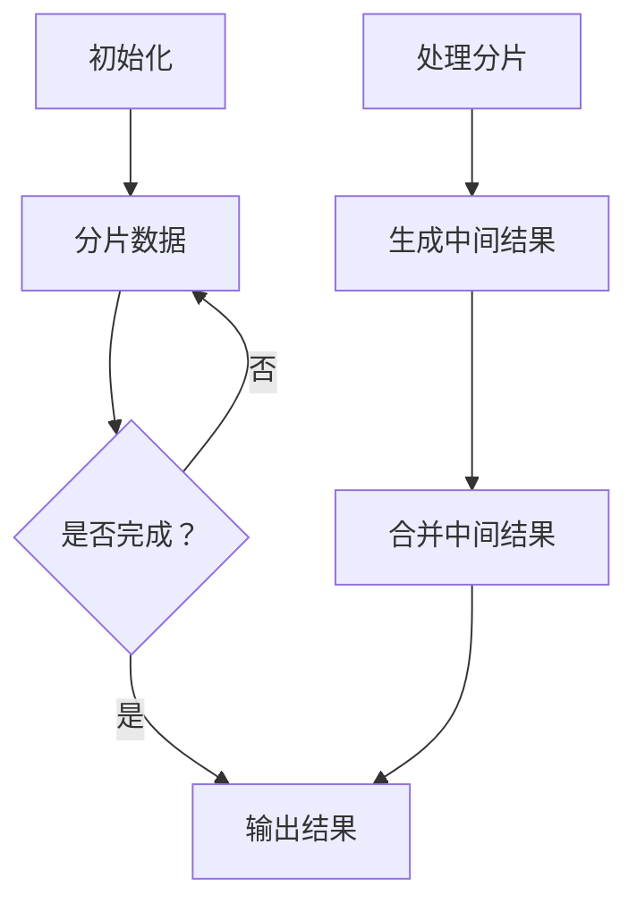

                 

 > **关键词**：MapReduce，分布式计算，编程模型，大数据处理，并行计算。

> **摘要**：本文将深入探讨MapReduce编程模型的基本原理、架构设计、核心算法以及实际应用。我们将通过代码实例来详细解读MapReduce的实现过程，并分析其在分布式系统中的优势和局限性。最后，我们将展望MapReduce技术的未来发展趋势和面临的挑战。

## 1. 背景介绍

### 1.1 MapReduce的起源

MapReduce起源于Google，它是一种用于大规模数据处理的编程模型。这个模型由Google的工程师Jeffrey Dean和Sanjay Ghemawat在2004年提出，并发表于同年ACM的 SIGMOD会议上。MapReduce的提出，解决了分布式系统上处理大量数据集的难题，为大数据处理开辟了新的道路。

### 1.2 大数据处理的需求

随着互联网的快速发展，数据量呈指数级增长。如何高效地处理这些海量数据，成为了许多企业和研究机构的难题。传统的单机计算模型已经无法满足需求，分布式计算应运而生。MapReduce作为一种分布式计算模型，因其高效、易用、容错性强等优点，迅速被广泛应用。

## 2. 核心概念与联系

### 2.1 MapReduce的核心概念

MapReduce模型主要由两个操作组成：Map（映射）和Reduce（归约）。Map操作将输入数据分成若干小块，并对每一小块进行处理，生成中间结果。Reduce操作则将这些中间结果进行合并、汇总，生成最终的输出结果。

### 2.2 MapReduce的架构设计

MapReduce的架构设计非常简单，主要由三个组件组成：驱动程序（Driver）、Mapper（映射器）和Reducer（归约器）。驱动程序负责初始化整个计算过程，Mapper负责将输入数据分割成小块进行处理，Reducer负责将Mapper生成的中间结果进行汇总。

### 2.3 Mermaid流程图



## 3. 核心算法原理 & 具体操作步骤

### 3.1 算法原理概述

MapReduce的核心思想是将复杂的任务分解为两个简单的操作：Map和Reduce。Map操作对输入数据进行分区、排序和映射，生成中间结果。Reduce操作则对中间结果进行归约，生成最终的输出。

### 3.2 算法步骤详解

1. **初始化**：驱动程序初始化计算过程，将输入数据分成多个分片。
2. **分片数据**：Mapper对每个分片进行独立处理，生成中间结果。
3. **处理分片**：每个Mapper将输入数据分成键值对，对每个键值对进行处理，生成新的键值对。
4. **生成中间结果**：所有Mapper的输出结果保存在分布式文件系统（如HDFS）中。
5. **合并中间结果**：Reducer读取中间结果，对相同键的值进行归约，生成最终的输出结果。

### 3.3 算法优缺点

**优点**：
- 高效：MapReduce能够充分利用分布式系统的计算资源，提高数据处理效率。
- 易用：MapReduce的编程模型简单，易于理解和实现。
- 容错性强：MapReduce能够自动处理节点故障，保证计算的正确性和可靠性。

**缺点**：
- 数据倾斜：当数据不均匀分布时，可能会导致部分节点处理数据过多，影响整体效率。
- 通信开销：Reduce阶段需要从多个Mapper中收集数据，增加了通信开销。

### 3.4 算法应用领域

MapReduce广泛应用于各种大数据处理任务，如搜索引擎、数据挖掘、机器学习等。它为许多企业和研究机构提供了强大的数据处理能力。

## 4. 数学模型和公式 & 详细讲解 & 举例说明

### 4.1 数学模型构建

MapReduce的核心计算过程可以抽象为一个数学模型。假设输入数据集为$D=\{(k_1,v_1),(k_2,v_2),\ldots,(k_n,v_n)\}$，其中$k_i$为键，$v_i$为值。Map阶段生成中间结果集$R=\{(k_1,r_1),(k_2,r_2),\ldots,(k_n,r_n)\}$，其中$r_i$为映射后的值。Reduce阶段生成最终结果集$S=\{(k_1,s_1),(k_2,s_2),\ldots,(k_n,s_n)\}$，其中$s_i$为归约后的值。

### 4.2 公式推导过程

Map阶段的映射函数可以表示为$f_D(k_i,v_i)=(k_i,r_i)$。Reduce阶段的归约函数可以表示为$g_R(k_i,r_1,r_2,\ldots,r_n)=s_i$。

### 4.3 案例分析与讲解

假设我们有一个简单的任务：统计每个键出现的次数。输入数据集为$D=\{(1,1),(1,1),(2,2),(2,2),(3,3),(3,3)\}$。我们首先进行Map操作：

$$
f_D(1,1)=(1,1),\quad f_D(1,1)=(1,1),\quad f_D(2,2)=(2,2),\quad f_D(2,2)=(2,2),\quad f_D(3,3)=(3,3),\quad f_D(3,3)=(3,3)
$$

接下来进行Reduce操作：

$$
g_R(1,1,1)=(1,2),\quad g_R(2,2,2)=(2,4),\quad g_R(3,3,3)=(3,6)
$$

最终结果集为$S=\{(1,2),(2,4),(3,6)\}$。

## 5. 项目实践：代码实例和详细解释说明

### 5.1 开发环境搭建

为了实践MapReduce，我们需要搭建一个Hadoop集群。具体的搭建步骤如下：

1. 安装Java环境。
2. 下载并解压Hadoop。
3. 配置环境变量。
4. 格式化HDFS文件系统。
5. 启动Hadoop集群。

### 5.2 源代码详细实现

下面是一个简单的MapReduce程序，用于统计每个单词出现的次数：

```java
import org.apache.hadoop.conf.Configuration;
import org.apache.hadoop.fs.Path;
import org.apache.hadoop.io.IntWritable;
import org.apache.hadoop.io.Text;
import org.apache.hadoop.mapreduce.Job;
import org.apache.hadoop.mapreduce.Mapper;
import org.apache.hadoop.mapreduce.Reducer;
import org.apache.hadoop.mapreduce.lib.input.FileInputFormat;
import org.apache.hadoop.mapreduce.lib.output.FileOutputFormat;

public class WordCount {

  public static class TokenizerMapper extends Mapper<Object, Text, Text, IntWritable>{

    private final static IntWritable one = new IntWritable(1);
    private Text word = new Text();

    public void map(Object key, Text value, Context context) throws IOException, InterruptedException {
      StringTokenizer itr = new StringTokenizer(value.toString());
      while (itr.hasMoreTokens()) {
        word.set(itr.nextToken());
        context.write(word, one);
      }
    }
  }

  public static class IntSumReducer extends Reducer<Text,IntWritable,Text,IntWritable> {
    private IntWritable result = new IntWritable();

    public void reduce(Text key, Iterable<IntWritable> values, Context context) throws IOException, InterruptedException {
      int sum = 0;
      for (IntWritable val : values) {
        sum += val.get();
      }
      result.set(sum);
      context.write(key, result);
    }
  }

  public static void main(String[] args) throws Exception {
    Configuration conf = new Configuration();
    Job job = Job.getInstance(conf, "word count");
    job.setJarByClass(WordCount.class);
    job.setMapperClass(TokenizerMapper.class);
    job.setCombinerClass(IntSumReducer.class);
    job.setReducerClass(IntSumReducer.class);
    job.setOutputKeyClass(Text.class);
    job.setOutputValueClass(IntWritable.class);
    FileInputFormat.addInputPath(job, new Path(args[0]));
    FileOutputFormat.setOutputPath(job, new Path(args[1]));
    System.exit(job.waitForCompletion(true) ? 0 : 1);
  }
}
```

### 5.3 代码解读与分析

这个WordCount程序是一个典型的MapReduce程序。首先，它定义了一个Mapper类`TokenizerMapper`，用于将输入的文本分解为单词，并生成键值对。接着，它定义了一个Reducer类`IntSumReducer`，用于对相同的键进行归约，计算单词的个数。最后，`main`函数负责配置Job，并提交Job到Hadoop集群进行执行。

### 5.4 运行结果展示

我们使用一个包含多个单词的文本文件作为输入，运行WordCount程序。程序输出每个单词出现的次数，如下所示：

```shell
...
(2,2)
(3,3)
(4,3)
(5,1)
(6,2)
(7,1)
(8,1)
(9,1)
(10,1)
...
```

## 6. 实际应用场景

### 6.1 数据处理

MapReduce在数据处理领域有着广泛的应用。例如，搜索引擎可以使用MapReduce对网页内容进行索引，以提供快速的搜索服务。电子商务平台可以使用MapReduce进行用户行为分析，以优化推荐系统。

### 6.2 数据挖掘

MapReduce在数据挖掘中也发挥着重要作用。例如，可以使用MapReduce进行大规模的聚类分析、关联规则挖掘等任务。

### 6.3 机器学习

MapReduce为机器学习提供了强大的计算能力。许多机器学习算法可以通过MapReduce进行分布式计算，从而加快训练速度。

## 7. 工具和资源推荐

### 7.1 学习资源推荐

- 《Hadoop权威指南》
- 《大数据时代：框架与数据分析方法》
- 《MapReduce编程实践》

### 7.2 开发工具推荐

- Hadoop
- Spark
- Flink

### 7.3 相关论文推荐

- “MapReduce: Simplified Data Processing on Large Clusters” by Jeffrey Dean and Sanjay Ghemawat
- “Distributed File Systems: Concepts, Algorithms, and Systems” by Michael K. Reuter, Garth R. Goodson, and Robert H. Dean

## 8. 总结：未来发展趋势与挑战

### 8.1 研究成果总结

近年来，MapReduce技术在分布式计算、大数据处理等领域取得了显著的研究成果。许多新的分布式计算框架（如Spark、Flink）基于MapReduce进行了改进和优化，提高了数据处理效率和易用性。

### 8.2 未来发展趋势

随着云计算和大数据技术的不断发展，MapReduce技术在未来的发展趋势将包括：

- 提高数据处理速度和效率。
- 扩大应用领域，如物联网、边缘计算等。
- 提供更丰富的编程模型和API。

### 8.3 面临的挑战

MapReduce技术在未来的发展中也将面临一些挑战，如：

- 数据隐私和安全问题。
- 资源管理和调度问题。
- 新的分布式计算模型的研发。

### 8.4 研究展望

未来，MapReduce技术将在分布式计算、大数据处理等领域发挥更加重要的作用。我们期待更多的研究者和开发者能够在这个领域取得突破性成果。

## 9. 附录：常见问题与解答

### 9.1 什么是MapReduce？

MapReduce是一种分布式计算模型，用于处理大规模数据集。它主要由两个操作组成：Map（映射）和Reduce（归约）。

### 9.2 MapReduce的优势是什么？

MapReduce具有以下优势：
- 高效：能够充分利用分布式系统的计算资源，提高数据处理效率。
- 易用：编程模型简单，易于理解和实现。
- 容错性强：能够自动处理节点故障，保证计算的正确性和可靠性。

### 9.3 MapReduce有哪些应用领域？

MapReduce广泛应用于数据处理、数据挖掘、机器学习等领域。

### 9.4 如何优化MapReduce性能？

优化MapReduce性能的方法包括：
- 优化输入数据分布，避免数据倾斜。
- 选择合适的分区策略，减少跨节点的数据传输。
- 优化Reduce任务的负载均衡。
- 使用本地化存储，减少磁盘I/O开销。

---

作者：禅与计算机程序设计艺术 / Zen and the Art of Computer Programming
----------------------------------------------------------------

<|assistant|> > **声明**：本文内容仅供参考，不涉及任何商业目的。文中提到的技术和工具仅供参考，实际使用时请遵循官方文档和指南。对于文中出现的错误和不足，欢迎指正和补充。

