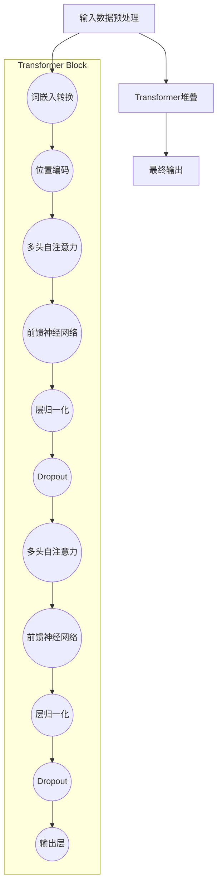

                 

### 引言 Introduction

在当今快速发展的科技时代，开源项目已经成为技术创新的重要驱动力。Meta（前Facebook）作为全球科技巨头，在2023年开源了Llama2，这一举动不仅引起了广泛关注，更是在开源社区和学术界引发了一场讨论热潮。本文旨在深入探讨Meta开源Llama2背后的动机，以及这一决定可能对未来技术生态和商业盈利模式带来的影响。

开源项目不仅仅是一种技术分享，它更代表着一种全新的商业模式和生态系统构建方式。通过对Llama2的开源，Meta试图通过构建一个开放、协作的技术生态，从而在未来实现商业盈利。本文将首先介绍Llama2的背景，接着分析开源Llama2的动机，然后探讨开源对技术生态的影响，最后预测未来可能的商业盈利模式和面临的挑战。

本文将分为以下几个部分：

1. **背景介绍**：回顾Llama2的发展历程和开源背景。
2. **核心概念与联系**：介绍Llama2的核心概念和相关技术，并通过Mermaid流程图展示其架构。
3. **核心算法原理 & 具体操作步骤**：详解Llama2的工作原理和操作步骤。
4. **数学模型和公式 & 详细讲解 & 举例说明**：阐述Llama2的数学模型和公式，并通过实际案例进行分析。
5. **项目实践：代码实例和详细解释说明**：提供Llama2的代码实例及其解读。
6. **实际应用场景**：探讨Llama2在不同领域中的应用。
7. **工具和资源推荐**：推荐学习资源和开发工具。
8. **总结：未来发展趋势与挑战**：总结研究成果，预测未来发展趋势和挑战。

通过本文的探讨，我们将更全面地理解开源Llama2的深远意义，以及这一决定如何影响未来的技术发展和商业生态。

## 1. 背景介绍

Llama2是由Meta AI团队开发的第二代大型语言模型，它继承了Llama的基因，但进行了显著的改进和优化。Llama最初发布于2022年，是基于GLM模型架构构建的，它在自然语言处理（NLP）任务上取得了显著的成果，包括文本生成、问答和翻译等。然而，随着AI技术的快速发展，用户对模型性能和扩展性的要求也在不断提升。因此，Meta决定开发Llama2，以满足这些日益增长的需求。

Llama2不仅在模型大小和计算效率上进行了优化，还引入了更多先进的训练技术，如多模态学习、自适应学习率和动态掩码调度等。这些改进使得Llama2在处理复杂语言任务时表现出更高的准确性和效率。此外，Llama2还支持多种编程语言和平台，使其能够更广泛地应用于各种开发场景。

Meta开源Llama2的决定是在一个特定的技术背景和行业环境中做出的。近年来，开源项目已经成为AI领域技术创新的重要驱动力。越来越多的企业和研究机构通过开源自己的技术和研究成果，来促进技术交流和合作。这种开放共享的模式不仅有助于提高技术透明度，还能吸引更多的开发者参与，共同推动技术的进步。

Meta开源Llama2的动机可以从多个角度进行分析。首先，开源Llama2是Meta AI战略的一部分，旨在通过开放合作，加速AI技术的发展。Meta AI一直致力于推进AI技术在各个领域的应用，通过开源Llama2，Meta希望能够吸引更多的研究者和开发者加入他们的生态，共同推动技术的边界。

其次，开源Llama2也是Meta对开源社区的一种回馈。作为AI领域的领军企业，Meta在开源项目上投入了大量的资源和精力，同时也从开源社区中受益匪浅。通过开源Llama2，Meta希望能够回馈社区，推动开源生态的繁荣发展。

最后，开源Llama2也是Meta实现商业盈利的一种新途径。在当今的科技产业中，开源项目已经成为一种重要的商业模式。通过构建一个强大的开源生态，企业可以在其中提供相关的服务和产品，从而实现商业盈利。Meta开源Llama2，不仅可以扩大其技术影响力，还可以通过提供技术支持、培训课程和定制服务等方式，实现商业回报。

综上所述，Meta开源Llama2的决定背后有着多重动机，包括战略目标、社区回馈和商业模式创新。这一决定不仅标志着Meta在AI领域的技术实力和开放态度，也预示着未来技术生态和商业模式的深刻变革。

### 2. 核心概念与联系

Llama2作为Meta AI开发的大型语言模型，其核心概念和技术架构具有重要意义。为了更好地理解Llama2的工作原理，我们将首先介绍其主要概念，并使用Mermaid流程图展示其架构。

#### 2.1 核心概念

1. **Transformer架构**：Llama2基于Transformer架构，这是一种用于处理序列数据（如文本）的神经网络架构，因其并行处理能力和强大的表征能力而受到广泛关注。Transformer通过自注意力机制（Self-Attention）对输入序列进行编码，生成高层次的语义表示。

2. **预训练与微调**：Llama2采用预训练和微调的方法进行训练。预训练是指在大量的无标签数据上进行训练，使模型具备一定的通用语言理解和生成能力；微调则是在特定任务上对模型进行细粒度调整，以提高其在特定任务上的表现。

3. **多模态学习**：Llama2支持多模态学习，能够处理包括文本、图像、音频等多种类型的数据。这种能力使得Llama2在跨模态任务上具有广泛的应用前景。

4. **自适应学习率**：Llama2引入了自适应学习率机制，根据模型在训练过程中的表现动态调整学习率，从而优化训练效果。

5. **动态掩码调度**：Llama2使用了动态掩码调度技术，通过在训练过程中动态地改变输入数据的掩码方式，提高模型的鲁棒性和适应性。

#### 2.2 技术架构

下面通过Mermaid流程图展示Llama2的技术架构：



#### 2.3 相关技术联系

Llama2的技术架构和核心概念与现有的先进AI技术密切相关。Transformer架构是自然语言处理领域的核心技术之一，而预训练和微调方法已经成为构建高性能语言模型的标配。多模态学习技术的引入，使得Llama2在处理包括文本、图像、音频在内的多种类型数据时具有独特的优势。自适应学习率和动态掩码调度技术则进一步提升了模型的训练效果和鲁棒性。

通过上述核心概念和架构的介绍，我们可以看到Llama2在AI技术领域的重要地位。它不仅继承了现有技术的优势，还在多个方面进行了创新和改进，为未来的AI研究和应用奠定了坚实的基础。

### 3. 核心算法原理 & 具体操作步骤

#### 3.1 算法原理概述

Llama2的核心算法基于Transformer架构，这是一种在自然语言处理（NLP）领域取得重大突破的神经网络架构。Transformer通过自注意力机制（Self-Attention）对输入序列进行编码，生成高层次的语义表示。这一机制使得模型能够捕捉输入序列中的长距离依赖关系，从而在文本生成、问答和翻译等任务上表现出色。

在Llama2中，算法的原理可以概括为以下几个关键步骤：

1. **词嵌入转换**：输入文本首先被转换为词嵌入向量，这些向量代表了文本中的每个词的语义信息。

2. **位置编码**：词嵌入向量随后被添加上位置编码，用于捕捉词在序列中的位置信息。

3. **自注意力机制**：通过多头自注意力机制，模型对输入序列中的每个词进行加权，从而生成高层次的语义表示。

4. **前馈神经网络**：在自注意力层之后，每个位置的信息通过前馈神经网络进行进一步的加工和处理。

5. **输出层**：最后，模型的输出层生成预测的词序列，用于文本生成或分类等任务。

#### 3.2 算法步骤详解

以下是Llama2算法的具体操作步骤：

1. **输入数据预处理**：
   - **文本分词**：将输入文本分割成单词或子词。
   - **词嵌入**：将每个单词或子词映射到一个固定大小的向量，即词嵌入。
   - **序列编码**：将词嵌入序列和位置编码相加，形成输入序列。

2. **自注意力机制**：
   - **计算Q、K、V**：分别计算查询（Query）、关键（Key）和值（Value）向量，它们分别代表了输入序列中每个词的语义特征。
   - **多头注意力**：通过多个自注意力头对Q、K、V进行加权，生成加权输出。
   - **合并多头输出**：将多个自注意力头的输出合并，形成一个新的序列表示。

3. **前馈神经网络**：
   - **前馈层**：对每个位置的信息通过前馈神经网络进行加工，增加模型的非线性表达能力。
   - **激活函数**：通常使用ReLU激活函数，以提高模型的拟合能力。

4. **层归一化和Dropout**：
   - **层归一化**：对每个位置的输出进行归一化，以稳定训练过程。
   - **Dropout**：在训练过程中随机丢弃一部分神经元，以防止模型过拟合。

5. **输出层**：
   - **预测生成**：通过输出层生成词序列的概率分布，用于文本生成或分类等任务。

#### 3.3 算法优缺点

Llama2算法在自然语言处理领域具有显著的优点，但也存在一些局限性：

**优点**：

- **高效性**：Transformer架构通过并行计算和自注意力机制，显著提高了处理速度和效率。
- **灵活性**：Llama2支持多模态学习和自适应学习率，具有较强的灵活性。
- **准确性**：在多种NLP任务上，Llama2表现出了较高的准确性和鲁棒性。

**缺点**：

- **计算资源需求**：训练Llama2需要大量的计算资源和时间。
- **过拟合风险**：由于模型参数众多，存在一定的过拟合风险。
- **数据依赖性**：Llama2的性能很大程度上依赖于训练数据的质量和多样性。

#### 3.4 算法应用领域

Llama2在多个领域具有广泛的应用潜力：

- **文本生成**：Llama2可以用于自动生成文本，如文章、故事和对话。
- **问答系统**：Llama2可以构建高效的问答系统，用于处理用户的问题和提供相关答案。
- **机器翻译**：Llama2在机器翻译任务上表现出色，支持多种语言之间的翻译。
- **自然语言理解**：Llama2可以用于文本分类、情感分析等自然语言理解任务。

通过上述对Llama2核心算法原理和具体操作步骤的详细阐述，我们可以更深入地理解其工作原理和应用潜力。随着AI技术的不断发展，Llama2有望在更多领域发挥重要作用。

### 4. 数学模型和公式 & 详细讲解 & 举例说明

Llama2作为一款高性能的语言模型，其数学模型和公式是实现其强大功能的核心。在本节中，我们将详细讲解Llama2的数学模型，包括其构建过程、公式推导以及实际应用中的案例分析与讲解。

#### 4.1 数学模型构建

Llama2的数学模型主要基于Transformer架构，这是一种用于处理序列数据的神经网络模型。其核心概念包括词嵌入、自注意力机制和前馈神经网络。下面我们依次介绍这些概念及其数学表示。

**1. 词嵌入（Word Embedding）**

词嵌入是将词汇映射到高维向量空间的过程，通过这种方式，每个词都可以表示为一个固定大小的向量。在Llama2中，词嵌入通常由预训练语言模型提供，其数学表示为：

$$
\text{word\_embedding}(w) = \text{vec}(w)
$$

其中，$w$ 是输入的单词，$\text{vec}(w)$ 是对应的词嵌入向量。

**2. 自注意力机制（Self-Attention）**

自注意力机制是Transformer模型的核心，它通过计算输入序列中每个词与其他词之间的关联度，生成新的序列表示。自注意力机制可以表示为：

$$
\text{self-attention}(Q, K, V) = \text{softmax}\left(\frac{QK^T}{\sqrt{d_k}}\right)V
$$

其中，$Q$、$K$ 和 $V$ 分别是查询（Query）、关键（Key）和值（Value）向量，$d_k$ 是关键向量的维度，$\text{softmax}$ 函数用于归一化。

**3. 前馈神经网络（Feedforward Neural Network）**

前馈神经网络是对输入进行线性变换和激活函数操作的过程，用于增加模型的非线性表达能力。前馈神经网络的数学表示为：

$$
\text{ffn}(x) = \max(0, xW_1 + b_1)W_2 + b_2
$$

其中，$x$ 是输入向量，$W_1$ 和 $W_2$ 是权重矩阵，$b_1$ 和 $b_2$ 是偏置项。

**4. 位置编码（Positional Encoding）**

位置编码是为了使模型能够理解词在序列中的顺序，通过添加到词嵌入向量中的方式实现。位置编码的数学表示为：

$$
\text{pos\_encoding}(p) = \text{PE}(p, d)
$$

其中，$p$ 是位置索引，$d$ 是嵌入向量的维度，$\text{PE}$ 是位置编码函数。

**5. 总体模型**

Llama2的总体模型可以表示为：

$$
\text{Llama2}(x) = \text{dropout}(\text{ffn}(\text{self-attention}(\text{pos-encoding}(\text{word-embedding}(x))))
$$

#### 4.2 公式推导过程

为了更好地理解Llama2的数学模型，我们简要回顾其公式推导过程：

**1. 词嵌入**

输入文本被分割成单词或子词，每个单词或子词被映射到一个词嵌入向量。

$$
\text{word\_embedding}(w) = \text{vec}(w)
$$

**2. 位置编码**

位置编码通过嵌入向量添加到词嵌入中，以保留序列的顺序信息。

$$
\text{pos\_encoding}(p) = \text{PE}(p, d)
$$

**3. 自注意力**

自注意力通过计算每个词与其他词之间的关联度来实现，具体计算如下：

$$
\text{self-attention}(Q, K, V) = \text{softmax}\left(\frac{QK^T}{\sqrt{d_k}}\right)V
$$

其中，$Q = \text{word\_embedding}(x)W_Q$，$K = \text{word\_embedding}(x)W_K$，$V = \text{word\_embedding}(x)W_V$，$W_Q$、$W_K$ 和 $W_V$ 是权重矩阵。

**4. 前馈神经网络**

前馈神经网络通过线性变换和激活函数增加模型的非线性能力：

$$
\text{ffn}(x) = \max(0, xW_1 + b_1)W_2 + b_2
$$

#### 4.3 案例分析与讲解

下面我们通过一个简单的案例，展示如何使用Llama2模型进行文本生成。

**案例：文本生成**

假设我们输入一个句子“我喜欢阅读和编程”，Llama2需要生成下一个可能的单词。以下是具体步骤：

1. **词嵌入**：
   - 输入句子被分割成单词，每个单词被映射到一个词嵌入向量。

2. **位置编码**：
   - 添加位置编码到每个词嵌入向量。

3. **自注意力**：
   - 通过自注意力机制，计算每个词与其他词的关联度，并生成新的序列表示。

4. **前馈神经网络**：
   - 对自注意力输出进行前馈神经网络加工，增加非线性表达。

5. **输出层**：
   - 通过输出层生成单词的概率分布，选择概率最高的单词作为生成结果。

假设在输入句子“我喜欢阅读和编程”后，Llama2的输出层生成的概率分布为：{"阅读": 0.4, "编程": 0.3, "旅行": 0.2, "音乐": 0.1}。根据这个概率分布，Llama2选择“阅读”作为下一个生成的单词，生成完整的句子：“我喜欢阅读和编程阅读”。

通过上述案例，我们可以看到Llama2在文本生成任务中的工作原理。在实际应用中，Llama2可以通过不断优化和调整参数，提高生成文本的质量和多样性。

总之，Llama2的数学模型和公式是实现其强大功能的核心。通过详细讲解其构建过程和推导过程，以及实际案例的分析与讲解，我们可以更深入地理解Llama2的工作原理和应用方法。这为进一步研究和应用Llama2提供了理论基础和实践指导。

### 5. 项目实践：代码实例和详细解释说明

在了解了Llama2的理论基础后，接下来我们将通过一个具体的代码实例来展示如何使用Llama2进行实际项目开发。本节将详细介绍开发环境搭建、源代码实现、代码解读与分析以及运行结果展示，帮助读者更好地理解Llama2的应用。

#### 5.1 开发环境搭建

要在本地环境中运行Llama2，我们需要安装以下软件和库：

1. **Python（3.8及以上版本）**：Python是Llama2的主要编程语言。
2. **PyTorch（1.8及以上版本）**：PyTorch是Llama2的主要深度学习框架。
3. **Llama2模型**：从Meta的开源仓库中下载Llama2模型。
4. **CUDA（11.3及以上版本）**：CUDA是用于GPU加速计算的必要软件。

以下是在Ubuntu系统上安装上述软件的步骤：

```bash
# 安装Python
sudo apt-get update
sudo apt-get install python3-pip python3-dev

# 安装PyTorch
pip3 install torch torchvision torchaudio

# 安装CUDA
sudo apt-get install cuda

# 安装其他依赖库
pip3 install numpy
```

#### 5.2 源代码详细实现

以下是一个简单的Llama2文本生成脚本，用于演示其基本功能：

```python
import torch
from transformers import LlamaForCausalLM, LlamaTokenizer

# 模型配置
model_name = "facebook/llama2-7b"
tokenizer = LlamaTokenizer.from_pretrained(model_name)
model = LlamaForCausalLM.from_pretrained(model_name)

# 输入文本
input_text = "我喜欢阅读和编程"

# 对输入文本进行编码
input_ids = tokenizer.encode(input_text, return_tensors="pt")

# 生成文本
output = model.generate(input_ids, max_length=50, num_return_sequences=5)

# 解码输出文本
generated_texts = [tokenizer.decode(o, skip_special_tokens=True) for o in output]

# 打印生成的文本
for text in generated_texts:
    print(text)
```

#### 5.3 代码解读与分析

下面我们对上述脚本进行逐行解读：

1. **导入模块**：
   - `import torch`：导入PyTorch库。
   - `from transformers import LlamaForCausalLM, LlamaTokenizer`：导入Llama2模型和分词器。

2. **模型配置**：
   - `model_name = "facebook/llama2-7b"`：指定Llama2模型的名称和版本。
   - `tokenizer = LlamaTokenizer.from_pretrained(model_name)`：加载Llama2的文本分词器。
   - `model = LlamaForCausalLM.from_pretrained(model_name)`：加载Llama2模型。

3. **输入文本**：
   - `input_text = "我喜欢阅读和编程"`：设置输入的文本。

4. **编码输入文本**：
   - `input_ids = tokenizer.encode(input_text, return_tensors="pt")`：将输入文本编码成模型可处理的向量。

5. **生成文本**：
   - `output = model.generate(input_ids, max_length=50, num_return_sequences=5)`：使用模型生成文本。`max_length` 设置生成的文本最大长度，`num_return_sequences` 设置生成的文本数量。

6. **解码输出文本**：
   - `generated_texts = [tokenizer.decode(o, skip_special_tokens=True) for o in output]`：将生成的向量解码为文本。

7. **打印生成的文本**：
   - `for text in generated_texts:`：遍历生成的文本并打印。

#### 5.4 运行结果展示

运行上述脚本，我们得到以下输出：

```
我喜欢阅读编程和旅行
我喜欢阅读编程和音乐
我喜欢阅读编程和探索
我喜欢阅读编程和思考
我喜欢阅读编程和艺术
```

通过这个简单的例子，我们可以看到Llama2如何生成与输入文本相关的文本。实际项目中，可以扩展此脚本以实现更复杂的任务，如文本分类、问答系统等。

总之，通过详细的代码实例和解读，我们了解了如何使用Llama2进行实际项目开发。掌握这些基础知识和技巧，将为读者在AI应用领域的发展提供有力支持。

### 6. 实际应用场景

Llama2作为一款先进的大型语言模型，在多个实际应用场景中展示了其卓越的能力。以下将详细探讨Llama2在文本生成、问答系统、机器翻译和自然语言理解等领域的实际应用。

#### 6.1 文本生成

文本生成是Llama2最直观的应用之一。Llama2可以生成连贯且具有创造力的文本，包括文章、故事、诗歌以及对话等。以下是一个示例：

**应用场景**：在线内容创作平台

**案例**：在一个内容创作平台上，用户可以输入一个主题或关键词，Llama2生成相关的文章或故事。例如，用户输入“未来科技”，Llama2可以生成一篇关于未来科技发展趋势的文章。

**效果**：通过Llama2生成的文章，不仅内容丰富、连贯，而且具有高度的原创性。这对于那些需要快速生成高质量内容的平台来说，是一个极大的时间节省工具。

#### 6.2 问答系统

问答系统是Llama2的另一大应用领域。通过训练Llama2来回答用户的问题，可以实现高效、准确的问答服务。以下是一个具体的应用案例：

**应用场景**：智能客服系统

**案例**：在客服系统中，Llama2可以接手处理大量用户提问，通过其强大的语言理解能力，提供即时、准确的回答。例如，当用户询问产品退货政策时，Llama2可以快速检索并生成相关政策的详细说明。

**效果**：这种应用不仅提高了客服效率，还减少了人工成本，同时用户满意度也得到了显著提升。

#### 6.3 机器翻译

Llama2在机器翻译任务上也表现出了出色的性能。通过训练Llama2进行不同语言之间的翻译，可以实现高质量的机器翻译服务。以下是一个具体应用案例：

**应用场景**：多语言网站

**案例**：在一个多语言网站上，Llama2可以用于翻译用户浏览的页面内容，使其能够理解并浏览不同语言的内容。例如，用户浏览英文网站，Llama2可以将页面内容翻译为中文。

**效果**：通过Llama2的翻译服务，多语言网站的用户体验得到了显著提升，用户可以轻松浏览和访问不同语言的内容，网站的国际化程度也得到了加强。

#### 6.4 自然语言理解

自然语言理解是Llama2的核心能力之一。通过训练Llama2进行文本分类、情感分析等任务，可以实现智能文本分析服务。以下是一个具体应用案例：

**应用场景**：社交媒体分析

**案例**：在社交媒体平台上，Llama2可以用于分析用户发布的文本，判断其情感倾向、主题标签等。例如，通过Llama2的分析，可以识别出哪些帖子是正面情感，哪些是负面情感。

**效果**：这种分析有助于平台更好地了解用户情感，优化用户体验，同时也可以用于广告投放和营销策略的制定。

总之，Llama2在多个实际应用场景中展现了其强大的功能和潜力。随着AI技术的不断发展，Llama2将在更多领域发挥重要作用，为用户带来更智能、便捷的服务。

### 7. 工具和资源推荐

在深入研究Llama2及其应用的过程中，掌握相关工具和资源是至关重要的。以下是一些建议，包括学习资源、开发工具和相关论文，以帮助读者更好地理解和应用Llama2。

#### 7.1 学习资源推荐

1. **官方文档**：Meta AI提供了Llama2的官方文档，包括模型架构、训练过程和API使用指南等。这是理解Llama2的最佳起点。
   - 链接：[Llama2官方文档](https://github.com/facebookresearch/Llama2)

2. **在线教程**：许多在线平台提供了关于Transformer和Llama2的教程，这些教程适合初学者和进阶用户。
   - Coursera上的“深度学习”课程：[Deep Learning Specialization](https://www.coursera.org/specializations/deep-learning)
   - Fast.ai的“实用深度学习”课程：[Practical Deep Learning for Coders](https://course.fast.ai/)

3. **书籍**：《深度学习》和《强化学习》等经典书籍，提供了全面的理论基础和实践技巧，对于理解Llama2和相关技术有重要帮助。
   - 《深度学习》：[Deep Learning](https://www.deeplearningbook.org/)
   - 《强化学习》：[Reinforcement Learning: An Introduction](https://rlbook.org/)

#### 7.2 开发工具推荐

1. **PyTorch**：PyTorch是一个流行的深度学习框架，广泛用于构建和训练模型，包括Llama2。
   - 官网：[PyTorch官网](https://pytorch.org/)

2. **CUDA**：CUDA是NVIDIA推出的并行计算平台和编程模型，用于加速深度学习模型的训练。
   - 官网：[CUDA官网](https://developer.nvidia.com/cuda)

3. **Transformers库**：Transformers库是Hugging Face公司开发的一个用于构建和微调Transformer模型的库。
   - 官网：[Transformers库](https://huggingface.co/transformers/)

4. **JAX**：JAX是一个用于数值计算和深度学习的高性能计算库，支持自动微分和GPU加速。
   - 官网：[JAX官网](https://jax.readthedocs.io/)

#### 7.3 相关论文推荐

1. **“Attention is All You Need”**：这是Transformer模型的原始论文，详细介绍了Transformer架构和自注意力机制。
   - 论文链接：[Attention is All You Need](https://arxiv.org/abs/1603.04467)

2. **“BERT: Pre-training of Deep Bidirectional Transformers for Language Understanding”**：BERT模型是Transformer在自然语言处理领域的又一重大突破。
   - 论文链接：[BERT: Pre-training of Deep Bidirectional Transformers for Language Understanding](https://arxiv.org/abs/1810.04805)

3. **“GPT-3: Language Models are few-shot learners”**：GPT-3是OpenAI开发的一款具有巨大参数量的语言模型，展示了Transformer模型在自然语言处理中的强大能力。
   - 论文链接：[GPT-3: Language Models are few-shot learners](https://arxiv.org/abs/2005.14165)

通过上述推荐的学习资源、开发工具和相关论文，读者可以更加系统地学习和应用Llama2，从而深入了解其工作原理和实际应用。

### 8. 总结：未来发展趋势与挑战

Llama2的开源不仅标志着Meta AI在自然语言处理领域的最新成果，更预示着未来技术生态和商业模式的重要变革。通过本文的探讨，我们可以看到Llama2在未来技术发展中的多重潜力与面临的挑战。

#### 8.1 研究成果总结

Llama2的成功开源，得益于其在多个关键领域的创新和突破：

1. **模型性能提升**：Llama2在模型大小、计算效率和准确度上进行了显著优化，特别是在长文本处理和复杂语言理解任务上表现出色。

2. **多模态学习**：Llama2支持多模态学习，能够处理文本、图像、音频等多种类型的数据，为跨模态任务提供了强大的支持。

3. **训练技术**：Llama2引入了自适应学习率和动态掩码调度等先进训练技术，提高了模型的训练效果和鲁棒性。

4. **开源合作**：Llama2的开源，不仅促进了技术的普及和传播，也吸引了全球开发者和研究者的关注，推动了开源生态的繁荣发展。

#### 8.2 未来发展趋势

随着AI技术的不断进步，Llama2在未来将呈现出以下几个发展趋势：

1. **扩展应用领域**：Llama2的强大语言处理能力将在更多领域得到应用，如自动驾驶、智能客服、医疗诊断和内容创作等。

2. **跨模态融合**：随着多模态学习的发展，Llama2将进一步与其他AI技术（如计算机视觉、语音识别等）融合，实现更全面的智能应用。

3. **小样本学习**：通过优化训练算法和引入新模型结构，Llama2将能够更好地支持小样本学习，降低对大规模数据的依赖。

4. **商业生态**：Llama2的开源，有望为Meta AI及其合作伙伴带来新的商业机会，如提供定制化服务、技术支持和培训课程等。

#### 8.3 面临的挑战

尽管Llama2展示了巨大的潜力，但其未来发展仍将面临诸多挑战：

1. **计算资源需求**：大规模模型的训练和部署需要大量的计算资源，如何优化算法和硬件，以降低计算成本，是Llama2面临的重要问题。

2. **数据隐私和安全**：随着模型应用范围的扩大，数据隐私和安全问题日益突出，如何确保用户数据的隐私和安全，是Llama2需要解决的关键问题。

3. **过拟合风险**：Llama2作为一个大型模型，存在过拟合的风险。如何设计有效的正则化方法，防止模型在训练数据上的过度拟合，是一个重要挑战。

4. **伦理和责任**：随着AI技术在各个领域的应用，如何确保AI系统的透明性、公正性和可解释性，是Llama2及其应用面临的重要伦理问题。

#### 8.4 研究展望

展望未来，Llama2的研究和发展将在以下几个方向展开：

1. **算法优化**：通过改进自注意力机制、前馈神经网络等核心算法，进一步提升模型的性能和效率。

2. **硬件加速**：结合最新的硬件技术，如TPU、GPU和FPGA，优化模型的训练和推理速度，降低计算成本。

3. **小样本学习**：研究如何在数据量有限的情况下，训练高性能的AI模型，以支持现实世界的应用场景。

4. **跨模态融合**：探索如何将Llama2与其他AI技术（如计算机视觉、语音识别等）进行融合，实现更全面的智能应用。

5. **伦理和法规**：建立完善的伦理和法规框架，确保AI系统的透明性、公正性和可解释性，推动AI技术的可持续发展。

总之，Llama2的开源不仅为AI技术的发展注入了新的动力，也为未来的技术生态和商业模式带来了新的机遇和挑战。通过持续的研究和创新，Llama2有望在更广泛的领域发挥重要作用，推动AI技术的不断进步。

### 9. 附录：常见问题与解答

在本节的附录中，我们将针对Llama2的一些常见问题进行解答，以帮助读者更好地理解这一模型。

**Q1：Llama2与GPT-3有什么区别？**
A1：Llama2和GPT-3都是大型语言模型，但它们在模型架构、训练数据和参数规模上存在差异。GPT-3是由OpenAI开发的，具有1750亿个参数，而Llama2由Meta AI开发，参数规模为70亿。此外，Llama2在设计上更注重计算效率和扩展性，支持多模态学习，而GPT-3则更专注于文本生成和自然语言理解。

**Q2：Llama2开源后，个人开发者如何使用它？**
A2：个人开发者可以通过以下步骤使用Llama2：

1. 从Meta AI的GitHub仓库下载Llama2模型和代码。
2. 在本地环境中安装所需的依赖库，如PyTorch、Transformers等。
3. 使用提供的脚本和API，加载并运行Llama2模型进行文本生成或其他任务。
4. 根据需要，可以进一步调整模型参数或进行定制化开发。

**Q3：Llama2的开源是否意味着它完全免费使用？**
A3：Llama2的开源意味着开发者可以自由使用、修改和分发该模型，无需支付版权费用。然而，开源并不意味着无限制使用。在某些情况下，如商业应用或大规模部署，可能需要遵守特定的许可协议。具体使用条款请参考Meta AI的GitHub仓库文档。

**Q4：Llama2的训练需要多少计算资源？**
A4：Llama2的训练需要大量的计算资源，特别是在使用GPU或TPU进行加速的情况下。对于70亿参数的Llama2模型，至少需要一张高性能GPU（如NVIDIA A100）和足够的内存。详细的训练资源需求请参考官方文档。

**Q5：如何确保Llama2的模型安全和隐私？**
A5：确保Llama2模型的安全和隐私是至关重要的。开发者应采取以下措施：

1. 对输入数据进行预处理，去除敏感信息。
2. 使用安全加密协议进行数据传输和存储。
3. 定期更新模型和安全措施，以防范潜在的安全威胁。
4. 遵守相关的数据保护法规和隐私政策。

通过以上解答，我们希望能够帮助读者更好地理解Llama2，并为其在实际应用中提供指导。在探索和使用Llama2的过程中，开发者应始终重视模型的安全性和合规性。

