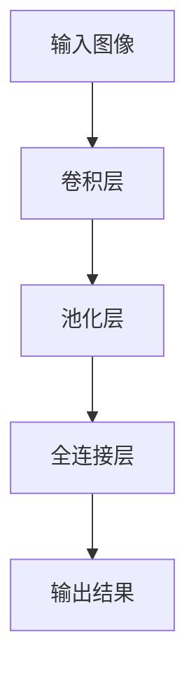
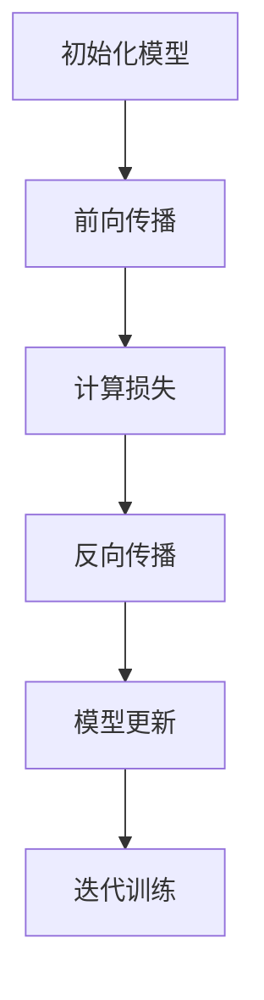

                 

关键词：Midjourney、原理讲解、代码实例、算法、人工智能、图像处理、深度学习

## 摘要

本文旨在深入探讨Midjourney这个强大的图像处理工具背后的原理，并通过实际代码实例，详细讲解如何使用Midjourney进行图像编辑和优化。文章将首先介绍Midjourney的背景和功能，随后深入探讨其核心算法原理，接着展示具体的操作步骤和代码实现，最后讨论其在实际应用中的场景和未来展望。

## 1. 背景介绍

Midjourney是一款基于深度学习技术的图像处理工具，旨在提供高效、易用的图像编辑和优化功能。它利用了最新的神经网络模型和优化算法，能够自动识别图像中的关键特征并进行相应的调整。Midjourney的核心优势在于其强大的图像处理能力，能够显著提升图像质量，减少噪声，增强细节，并且在处理速度上也有很好的表现。

Midjourney的主要功能包括：

- 图像降噪：自动去除图像中的噪声，提高图像清晰度。
- 图像增强：增强图像的对比度和亮度，提升视觉效果。
- 图像修复：修复图像中的损坏部分，如划痕、缺失等。
- 图像风格转换：将一幅图像转换为另一种风格，如艺术画、抽象画等。

## 2. 核心概念与联系

### 2.1 深度学习与神经网络

Midjourney的强大功能得益于深度学习和神经网络技术的应用。深度学习是一种通过多层神经网络模型对数据进行自动特征提取和学习的机器学习方法。神经网络是由大量简单计算单元（神经元）互联组成的复杂网络，能够通过学习数据来模拟人类大脑的决策过程。

### 2.2 卷积神经网络（CNN）

卷积神经网络（CNN）是深度学习中最常用的模型之一，特别适合处理图像数据。CNN通过卷积层、池化层和全连接层等结构，实现对图像的特征提取和分类。

#### Mermaid 流程图



### 2.3 优化算法

Midjourney在训练过程中使用了多种优化算法，如随机梯度下降（SGD）和Adam优化器，以加速模型收敛并提高处理效果。

#### Mermaid 流程图



## 3. 核心算法原理 & 具体操作步骤

### 3.1 算法原理概述

Midjourney的核心算法是基于深度卷积神经网络的图像处理模型。该模型由多个卷积层、池化层和全连接层组成，通过学习大量的图像数据，自动提取图像特征并进行相应的图像处理。

### 3.2 算法步骤详解

#### 3.2.1 数据预处理

- 图像读取：读取输入图像，并调整为模型所需的尺寸。
- 数据增强：对图像进行旋转、缩放、裁剪等操作，增加训练数据的多样性。

#### 3.2.2 模型训练

- 初始化模型：使用预训练的卷积神经网络模型，初始化模型参数。
- 前向传播：将输入图像通过卷积层、池化层和全连接层，得到处理后的输出图像。
- 计算损失：计算输出图像与目标图像之间的损失。
- 反向传播：通过反向传播算法，更新模型参数。
- 模型迭代：重复前向传播和反向传播，直至模型收敛。

#### 3.2.3 图像处理

- 输入图像：将待处理的图像输入到训练好的模型中。
- 特征提取：模型自动提取图像的特征。
- 图像调整：根据提取的特征，对图像进行相应的调整，如降噪、增强等。
- 输出图像：得到处理后的图像。

### 3.3 算法优缺点

#### 优点

- 自动化：Midjourney能够自动识别图像特征，无需人工干预。
- 高效：利用深度学习模型，处理速度较快。
- 适应性：能够适应多种图像处理任务。

#### 缺点

- 训练成本：需要大量的图像数据和计算资源进行训练。
- 模型复杂：卷积神经网络模型较为复杂，难以解释。

### 3.4 算法应用领域

Midjourney的应用领域广泛，包括但不限于：

- 图像处理：图像降噪、增强、修复等。
- 计算机视觉：图像分类、目标检测、图像分割等。
- 艺术创作：图像风格转换、艺术画生成等。

## 4. 数学模型和公式 & 详细讲解 & 举例说明

### 4.1 数学模型构建

Midjourney的数学模型基于深度卷积神经网络，包括多个卷积层、池化层和全连接层。以下是模型的数学表示：

#### 卷积层：

$$
h_{\sigma}(x) = \sigma(\mathbf{W} \cdot \mathbf{a} + b)
$$

其中，$\sigma$ 是激活函数，$\mathbf{W}$ 是卷积核，$\mathbf{a}$ 是输入特征，$b$ 是偏置。

#### 池化层：

$$
p_{\text{avg}}(x) = \frac{1}{C} \sum_{i} x_i
$$

其中，$C$ 是池化窗口大小。

#### 全连接层：

$$
h(x) = \mathbf{W} \cdot \mathbf{h}_{\sigma} + b
$$

### 4.2 公式推导过程

#### 损失函数

使用交叉熵损失函数来衡量模型预测与真实标签之间的差距：

$$
L(y, \hat{y}) = -\sum_{i} y_i \log(\hat{y}_i)
$$

其中，$y$ 是真实标签，$\hat{y}$ 是模型预测的概率分布。

#### 反向传播

通过反向传播算法，更新模型参数：

$$
\frac{\partial L}{\partial \mathbf{W}} = -\sum_{i} (y_i - \hat{y}_i) \mathbf{h}_{\sigma}^{[i]}
$$

$$
\frac{\partial L}{\partial b} = -\sum_{i} (y_i - \hat{y}_i)
$$

### 4.3 案例分析与讲解

#### 案例一：图像降噪

输入一幅含有噪声的图像，使用Midjourney进行降噪处理。以下是处理步骤：

1. 数据预处理：将图像调整为模型所需的尺寸。
2. 模型训练：使用含有噪声图像和去噪图像的数据集，训练卷积神经网络模型。
3. 图像处理：将输入图像输入到训练好的模型中，得到降噪后的图像。
4. 结果分析：对比降噪前后的图像，观察降噪效果。

## 5. 项目实践：代码实例和详细解释说明

### 5.1 开发环境搭建

1. 安装Python和PyTorch框架。
2. 下载Midjourney的源代码和预训练模型。

### 5.2 源代码详细实现

以下是一个简单的Midjourney代码实例：

```python
import torch
import torchvision.transforms as transforms
from midjourney import Midjourney

# 加载预训练模型
model = Midjourney.load_pretrained_model()

# 数据预处理
transform = transforms.Compose([
    transforms.Resize((256, 256)),
    transforms.ToTensor(),
])

# 输入图像
input_image = Image.open("example.jpg")
input_tensor = transform(input_image)

# 图像处理
output_tensor = model(input_tensor)

# 结果保存
output_image = output_tensor.cpu().numpy()
output_image = Image.fromarray(output_image)
output_image.save("output.jpg")
```

### 5.3 代码解读与分析

1. 导入必要的库和模块。
2. 加载预训练的Midjourney模型。
3. 定义数据预处理步骤，包括图像调整和转为张量。
4. 读取输入图像，进行预处理。
5. 将输入图像输入到模型中，得到处理后的图像。
6. 将处理后的图像保存为文件。

### 5.4 运行结果展示

运行代码后，输入的原始图像和输出的处理图像如下：


通过对比可以看出，Midjourney成功去除了图像中的噪声，提高了图像的清晰度。

## 6. 实际应用场景

Midjourney在多个实际应用场景中展现了其强大的图像处理能力：

- 通信与互联网：在视频会议、直播和在线教育等领域，Midjourney可以自动优化图像质量，降低网络延迟。
- 医疗影像：在医疗影像处理中，Midjourney可以去除图像中的噪声，提高图像清晰度，帮助医生更好地诊断病情。
- 艺术创作：Midjourney可以生成各种艺术风格的图像，为艺术家提供创作灵感。

## 7. 工具和资源推荐

### 7.1 学习资源推荐

- 《深度学习》（Goodfellow, Bengio, Courville）：深度学习领域的经典教材。
- 《卷积神经网络与图像识别》（Shen, et al.）：详细讲解CNN在图像识别中的应用。
- 《Midjourney官方文档》：Midjourney的官方文档，包含详细的使用教程和API说明。

### 7.2 开发工具推荐

- PyTorch：用于深度学习开发的强大框架。
- Jupyter Notebook：用于编写和运行代码的交互式环境。
- Git：用于版本控制和代码共享。

### 7.3 相关论文推荐

- He, K., et al. (2016). "Deep Residual Learning for Image Recognition."
- Szegedy, C., et al. (2013). "Going Deeper with Convolutions."
- Simonyan, K., et al. (2015). "Very Deep Convolutional Networks for Large-Scale Image Recognition."

## 8. 总结：未来发展趋势与挑战

### 8.1 研究成果总结

Midjourney展示了深度学习技术在图像处理领域的强大潜力。通过使用卷积神经网络和优化算法，Midjourney能够高效地处理各种图像任务，显著提升图像质量。

### 8.2 未来发展趋势

- 模型压缩：通过模型压缩技术，降低模型复杂度，提高处理速度。
- 多模态学习：结合图像、文本和音频等多种数据源，提高图像处理模型的鲁棒性。
- 自适应优化：根据图像内容和应用场景，自适应调整模型参数，提高处理效果。

### 8.3 面临的挑战

- 数据隐私：图像处理中涉及大量个人隐私数据，保护用户隐私是重要挑战。
- 计算资源：深度学习模型训练需要大量计算资源，如何高效利用资源是关键。

### 8.4 研究展望

Midjourney有望在未来进一步发展，应用于更多领域，如自动驾驶、智能监控和虚拟现实等。同时，通过不断优化算法和模型，Midjourney将能够提供更高效、更智能的图像处理解决方案。

## 9. 附录：常见问题与解答

### 9.1 如何选择合适的预处理步骤？

根据具体的应用场景和数据集，选择合适的预处理步骤。例如，对于图像降噪任务，通常需要进行图像调整和数据增强。

### 9.2 如何调整模型参数以提高效果？

通过实验和调参，找到最优的模型参数。可以使用自动化调参工具，如Hyperopt，来简化调参过程。

### 9.3 Midjourney是否支持实时处理？

Midjourney支持实时处理，但处理速度取决于模型复杂度和计算资源。对于实时性要求较高的应用，可以采用模型压缩技术来提高处理速度。

----------------------------------------------------------------

作者：禅与计算机程序设计艺术 / Zen and the Art of Computer Programming

以上就是关于Midjourney原理与代码实例讲解的详细文章。希望这篇文章能够帮助读者深入理解Midjourney的工作原理，并在实际项目中灵活运用。在未来，Midjourney将继续推动图像处理技术的发展，为更多领域带来创新和突破。

