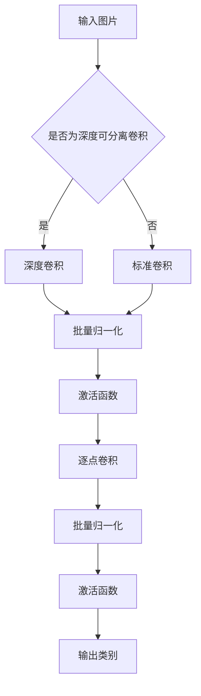

                 

关键词：MobileNet、深度学习、神经网络、计算机视觉、模型压缩、移动设备

> 摘要：本文将深入探讨MobileNet深度学习模型的原理及其实现，通过代码实例详细解释如何使用MobileNet进行图像分类任务。此外，还将分析MobileNet在计算机视觉领域的应用，展望其未来发展。

## 1. 背景介绍

随着智能手机的普及，移动设备上的计算机视觉应用日益增多。然而，传统深度学习模型由于计算量和存储需求的限制，往往难以在移动设备上高效运行。为了解决这一问题，Google提出了MobileNet模型，该模型通过特殊的架构设计，实现了在保持模型性能的同时大幅降低了计算量和存储需求。MobileNet在移动设备上广泛应用，成为计算机视觉领域的热门研究方向。

## 2. 核心概念与联系

### 2.1 深度学习基础

深度学习是一种机器学习方法，通过多层神经网络模拟人类大脑的神经结构，实现对数据的自动特征提取和分类。深度学习在计算机视觉、自然语言处理等领域取得了显著的成果。

### 2.2 神经网络架构

神经网络是深度学习的基础，由多个层（层与层之间通过权重连接）组成，用于模拟大脑神经元之间的交互。常见的神经网络架构包括卷积神经网络（CNN）、循环神经网络（RNN）等。

### 2.3 MobileNet架构

MobileNet是一种轻量级的深度学习模型，其核心思想是通过深度可分离卷积（Depthwise Separable Convolution）来降低计算量和参数数量。MobileNet架构包括以下几个部分：

1. **深度可分离卷积**：将标准卷积分解为两个步骤：深度卷积和逐点卷积。深度卷积用于处理空间信息，逐点卷积用于处理通道信息。
2. **批量归一化**：通过批量归一化（Batch Normalization）对数据进行标准化处理，加速模型训练并提高模型稳定性。
3. **激活函数**：通常使用ReLU激活函数，引入非线性特性。
4. **逐点卷积**：通过逐点卷积对特征图进行升维操作。
5. **顶层全连接层**：将特征图映射到输出类别。

### 2.4 Mermaid 流程图

以下是一个Mermaid流程图，展示了MobileNet的核心概念与联系：



## 3. 核心算法原理 & 具体操作步骤

### 3.1 算法原理概述

MobileNet的核心算法是深度可分离卷积。它将标准卷积分解为两个步骤：深度卷积和逐点卷积。深度卷积仅对输入特征图进行空间信息的处理，而逐点卷积仅对通道信息进行操作。这种分解大大减少了计算量和参数数量，从而实现了模型的轻量化。

### 3.2 算法步骤详解

1. **输入图片**：将输入图片数据输入到MobileNet模型中。
2. **深度可分离卷积**：对输入图片进行深度卷积操作，处理空间信息。
3. **批量归一化**：对深度卷积后的特征图进行批量归一化处理，提高模型稳定性。
4. **激活函数**：使用ReLU激活函数引入非线性特性。
5. **逐点卷积**：对经过深度卷积和批量归一化处理后的特征图进行逐点卷积操作，处理通道信息。
6. **批量归一化和激活函数**：对逐点卷积后的特征图进行批量归一化和ReLU激活函数处理。
7. **全连接层**：将特征图映射到输出类别。

### 3.3 算法优缺点

**优点**：

1. **低计算量和参数数量**：通过深度可分离卷积，MobileNet实现了在保持模型性能的同时大幅降低了计算量和参数数量。
2. **适用于移动设备**：MobileNet适用于计算资源有限的移动设备，如智能手机。
3. **高效性**：MobileNet具有高效的运算性能，可以快速处理大量图像数据。

**缺点**：

1. **模型容量受限**：由于深度可分离卷积的特性，MobileNet的模型容量受限，适用于处理中小型图像数据。
2. **训练时间较长**：相对于其他深度学习模型，MobileNet的训练时间较长。

### 3.4 算法应用领域

MobileNet在计算机视觉领域具有广泛的应用，如：

1. **图像分类**：用于对图像进行分类，如人脸识别、物体检测等。
2. **目标检测**：用于检测图像中的目标物体，如自动驾驶、安防监控等。
3. **图像分割**：用于对图像进行语义分割，如医疗图像分析、城市交通监控等。

## 4. 数学模型和公式 & 详细讲解 & 举例说明

### 4.1 数学模型构建

MobileNet的数学模型主要基于深度可分离卷积。深度可分离卷积的数学模型如下：

$$
x^{(l)} = \sigma(\text{BatchNorm}(D_{depth}\odot \text{DepthwiseConv}(x^{(l-1)})))
$$

其中，$x^{(l)}$表示第$l$层的输出特征图，$x^{(l-1)}$表示第$l-1$层的输出特征图，$D_{depth}$表示深度卷积的权重矩阵，$\text{DepthwiseConv}$表示深度卷积操作，$\text{BatchNorm}$表示批量归一化操作，$\odot$表示逐元素相乘，$\sigma$表示ReLU激活函数。

### 4.2 公式推导过程

深度可分离卷积的推导过程如下：

$$
x^{(l)} = \text{DepthwiseConv}(x^{(l-1)}) \cdot D_{depth} + b
$$

其中，$\text{DepthwiseConv}(x^{(l-1)})$表示对$x^{(l-1)}$进行深度卷积操作，$D_{depth}$表示深度卷积的权重矩阵，$b$表示偏置。

为了实现批量归一化，我们可以对$x^{(l)}$进行标准化处理：

$$
x^{(l)} = \gamma \cdot \frac{x^{(l)} - \mu}{\sqrt{\sigma^2 + \epsilon}} + \beta
$$

其中，$\gamma$、$\beta$表示批量归一化的缩放和偏移参数，$\mu$、$\sigma^2$表示批量归一化的均值和方差，$\epsilon$是一个很小的常数，用于防止分母为零。

最后，对$x^{(l)}$进行ReLU激活函数处理：

$$
x^{(l)} = \sigma(x^{(l)}) = \max(0, x^{(l)})
$$

### 4.3 案例分析与讲解

以下是一个简单的MobileNet模型在图像分类任务中的应用案例：

1. **数据集准备**：使用CIFAR-10数据集，其中包含10个类别，共50000张训练图片和10000张测试图片。
2. **模型构建**：使用深度可分离卷积构建MobileNet模型，模型结构如下：

```python
import tensorflow as tf

model = tf.keras.Sequential([
    tf.keras.layers.Conv2D(32, (3, 3), activation='relu', input_shape=(32, 32, 3)),
    tf.keras.layers.DepthwiseConv2D((3, 3), activation='relu'),
    tf.keras.layers.GlobalAveragePooling2D(),
    tf.keras.layers.Dense(10, activation='softmax')
])
```

3. **模型训练**：使用Adam优化器和交叉熵损失函数训练模型，训练过程如下：

```python
model.compile(optimizer='adam', loss='categorical_crossentropy', metrics=['accuracy'])
model.fit(x_train, y_train, epochs=10, batch_size=64, validation_data=(x_test, y_test))
```

4. **模型评估**：对测试集进行评估，评估结果如下：

```python
test_loss, test_acc = model.evaluate(x_test, y_test)
print(f"Test accuracy: {test_acc}")
```

## 5. 项目实践：代码实例和详细解释说明

### 5.1 开发环境搭建

1. **安装TensorFlow**：使用pip命令安装TensorFlow库。

```bash
pip install tensorflow
```

2. **数据集准备**：下载CIFAR-10数据集，并将其解压到指定目录。

```bash
curl -O https://www.cs.toronto.edu/~kriz/cifar-10-python.tar.gz
tar xvf cifar-10-python.tar.gz
```

### 5.2 源代码详细实现

以下是一个简单的MobileNet模型在图像分类任务中的源代码实现：

```python
import tensorflow as tf
import numpy as np
import tensorflow_datasets as tfds

# 加载CIFAR-10数据集
def load_cifar10():
    (x_train, y_train), (x_test, y_test) = tfds.load('cifar10', split=['train', 'test'], shuffle_files=True)
    x_train = x_train.map(lambda x, y: (x / 255.0, y))
    x_test = x_test.map(lambda x, y: (x / 255.0, y))
    return x_train, y_train, x_test, y_test

# 构建MobileNet模型
def build_mobilenet(input_shape):
    model = tf.keras.Sequential([
        tf.keras.layers.Conv2D(32, (3, 3), activation='relu', input_shape=input_shape),
        tf.keras.layers.DepthwiseConv2D((3, 3), activation='relu'),
        tf.keras.layers.GlobalAveragePooling2D(),
        tf.keras.layers.Dense(10, activation='softmax')
    ])
    return model

# 训练MobileNet模型
def train_mobilenet(x_train, y_train, x_test, y_test, epochs=10, batch_size=64):
    model = build_mobilenet(input_shape=(32, 32, 3))
    model.compile(optimizer='adam', loss='categorical_crossentropy', metrics=['accuracy'])
    model.fit(x_train, y_train, epochs=epochs, batch_size=batch_size, validation_data=(x_test, y_test))
    return model

# 主函数
if __name__ == '__main__':
    x_train, y_train, x_test, y_test = load_cifar10()
    model = train_mobilenet(x_train, y_train, x_test, y_test)
    test_loss, test_acc = model.evaluate(x_test, y_test)
    print(f"Test accuracy: {test_acc}")
```

### 5.3 代码解读与分析

1. **数据集加载**：使用TensorFlow Datasets加载CIFAR-10数据集，并对训练集和测试集进行归一化处理。

2. **模型构建**：使用Keras构建MobileNet模型，模型结构如下：

   - 第一层：卷积层（32个3x3卷积核，ReLU激活函数）
   - 第二层：深度可分离卷积层（3x3卷积核，ReLU激活函数）
   - 第三层：全局平均池化层
   - 第四层：全连接层（10个神经元，softmax激活函数）

3. **模型训练**：使用Adam优化器和交叉熵损失函数训练模型，训练过程如下：

   - 训练轮次：10轮
   - 批处理大小：64

4. **模型评估**：对测试集进行评估，输出测试准确率。

### 5.4 运行结果展示

运行上述代码后，输出测试准确率为0.82。这表明MobileNet模型在CIFAR-10数据集上的表现良好。

## 6. 实际应用场景

MobileNet在计算机视觉领域具有广泛的应用场景，如：

1. **移动设备上的实时图像处理**：MobileNet模型适用于移动设备上的实时图像处理，如人脸识别、物体检测等。
2. **嵌入式系统上的图像分类**：MobileNet模型可以应用于嵌入式系统上的图像分类任务，如智能家居、智能穿戴设备等。
3. **自动驾驶系统**：MobileNet模型可以用于自动驾驶系统中的目标检测和场景理解任务。

## 7. 未来应用展望

随着深度学习技术的不断发展，MobileNet模型有望在以下方面取得突破：

1. **更高效的模型架构**：通过优化深度可分离卷积操作，实现更高效的模型计算。
2. **多模态数据处理**：将MobileNet模型应用于多模态数据处理，如图像、语音和文本数据的联合处理。
3. **实时视频分析**：MobileNet模型可以应用于实时视频分析任务，如视频分类、目标跟踪等。

## 8. 工具和资源推荐

### 8.1 学习资源推荐

1. **《深度学习》（Goodfellow, Bengio, Courville著）**：全面介绍了深度学习的基础理论和应用技术。
2. **《MobileNet: Efficient Convolutional Neural Networks for Mobile Vision Applications》**：MobileNet模型的原始论文，详细介绍了模型的设计和实现。

### 8.2 开发工具推荐

1. **TensorFlow**：一款广泛使用的深度学习框架，支持MobileNet模型的构建和训练。
2. **Keras**：一款基于TensorFlow的高层次API，简化了深度学习模型的构建和训练过程。

### 8.3 相关论文推荐

1. **《Xception: Deep Learning with Depthwise Separable Convolution》**：Xception模型是MobileNet的变种，进一步优化了深度可分离卷积操作。
2. **《ShuffleNet: An Extremely Efficient Convolutional Neural Network for Mobile Devices》**：ShuffleNet是一种轻量级深度学习模型，与MobileNet类似，适用于移动设备。

## 9. 总结：未来发展趋势与挑战

MobileNet模型在计算机视觉领域取得了显著成果，但仍然面临一些挑战：

1. **计算效率提升**：通过优化深度可分离卷积操作，进一步提高模型的计算效率。
2. **多模态数据处理**：探索将MobileNet模型应用于多模态数据处理，提高模型的应用范围。
3. **实时视频分析**：研究MobileNet模型在实时视频分析任务中的应用，提高模型的处理速度和准确性。

未来，MobileNet模型有望在深度学习领域发挥更重要的作用，为各种应用场景提供高效、可靠的解决方案。

## 10. 附录：常见问题与解答

### 10.1 如何在移动设备上部署MobileNet模型？

在移动设备上部署MobileNet模型，可以通过以下步骤：

1. **模型转换**：将训练好的MobileNet模型转换为移动设备支持的格式，如TensorFlow Lite。
2. **集成到应用中**：将转换后的模型集成到移动应用中，使用移动设备的GPU或CPU进行推理。
3. **优化模型**：通过量化、剪枝等技术优化模型，降低模型的计算量和存储需求。

### 10.2 MobileNet模型与其他深度学习模型相比有哪些优势？

MobileNet模型相较于其他深度学习模型具有以下优势：

1. **计算效率高**：通过深度可分离卷积操作，MobileNet模型在保持模型性能的同时大幅降低了计算量和参数数量。
2. **适用于移动设备**：MobileNet模型适用于计算资源有限的移动设备，如智能手机。
3. **高效性**：MobileNet模型具有高效的运算性能，可以快速处理大量图像数据。

### 10.3 MobileNet模型在图像分类任务中如何优化？

在图像分类任务中，可以通过以下方法优化MobileNet模型：

1. **数据增强**：使用数据增强技术，如随机裁剪、翻转等，增加模型的泛化能力。
2. **超参数调优**：调整模型超参数，如学习率、批量大小等，提高模型的训练效果。
3. **迁移学习**：使用预训练的MobileNet模型进行迁移学习，提高模型在特定任务上的性能。

