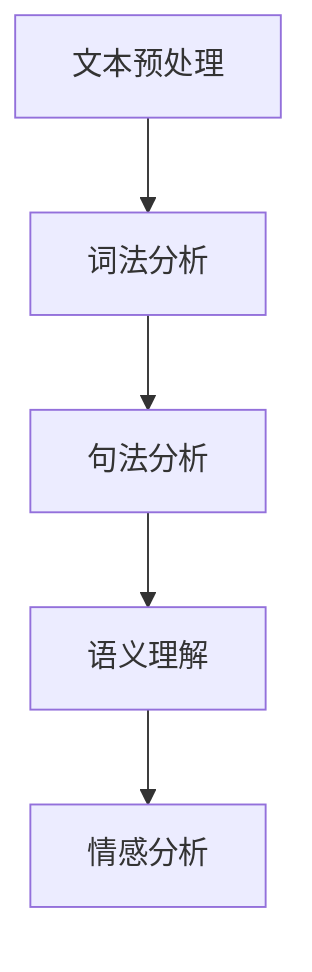

                 

关键词：自然语言处理、电商搜索、发展趋势、算法优化、用户体验

> 摘要：本文将深入探讨自然语言处理（NLP）技术在电商搜索领域的应用现状及其未来发展趋势。通过分析NLP技术对电商搜索的核心贡献，本文将探讨NLP技术在电商搜索中的具体应用场景，并展望其在未来的发展潜力与面临的挑战。

## 1. 背景介绍

随着互联网的普及和电子商务的快速发展，用户对电商搜索系统的需求越来越高。传统的基于关键词的搜索方式已经难以满足用户对个性化、精准化搜索体验的需求。因此，自然语言处理（NLP）技术的应用成为电商搜索系统提升用户体验的关键因素。

NLP技术作为人工智能的重要组成部分，旨在使计算机能够理解和处理人类自然语言。近年来，深度学习、神经网络等先进技术的不断发展，使得NLP技术取得了显著的进步。这些技术为电商搜索系统提供了强大的支持，使得搜索结果更加精准、用户交互更加自然。

在电商搜索领域，NLP技术的应用主要体现在文本预处理、关键词提取、语义理解、情感分析等方面。通过这些技术，电商搜索系统能够更好地理解用户的需求，提供个性化的搜索结果，从而提升用户的购物体验。

## 2. 核心概念与联系

### 2.1. NLP 技术的核心概念

自然语言处理（NLP）的核心概念包括文本预处理、词法分析、句法分析、语义理解和情感分析等。

- **文本预处理**：文本预处理是NLP的基础，包括去除停用词、标点符号、进行分词等操作，以便后续的分析和处理。
- **词法分析**：词法分析是将文本分解成词汇单元的过程，包括分词、词性标注等。
- **句法分析**：句法分析是对文本进行语法结构的分析，包括词组、句子成分、句子结构等。
- **语义理解**：语义理解是NLP技术的核心目标，旨在理解文本的含义和语境。
- **情感分析**：情感分析是通过分析文本的情感倾向，判断用户的态度和情绪。

### 2.2. NLP 技术在电商搜索中的应用

在电商搜索中，NLP技术的主要应用包括关键词提取、语义理解、情感分析等。

- **关键词提取**：通过NLP技术，可以从用户输入的搜索词中提取出关键信息，如商品名称、品牌、类别等，从而提高搜索的精准度。
- **语义理解**：NLP技术能够理解用户的搜索意图，提供与用户需求更加匹配的搜索结果。
- **情感分析**：通过对用户评论和反馈的分析，电商搜索系统可以更好地了解用户对商品和服务的评价，从而优化商品推荐和营销策略。

### 2.3. NLP 技术的 Mermaid 流程图



## 3. 核心算法原理 & 具体操作步骤

### 3.1. 算法原理概述

NLP技术在电商搜索中的应用主要依赖于深度学习算法，特别是循环神经网络（RNN）、长短时记忆网络（LSTM）和Transformer模型等。

- **RNN**：RNN通过隐藏层状态的记忆能力，能够处理序列数据，适用于文本预处理和语义理解。
- **LSTM**：LSTM是RNN的一种改进，能够更好地处理长序列数据，适用于复杂的语义分析任务。
- **Transformer**：Transformer模型通过自注意力机制，能够捕捉文本中的长距离依赖关系，适用于关键词提取和情感分析。

### 3.2. 算法步骤详解

1. **文本预处理**：进行分词、去停用词、词性标注等操作。
2. **词向量表示**：将文本转换为词向量，如使用Word2Vec或BERT模型。
3. **序列建模**：使用RNN、LSTM或Transformer模型对序列数据建模。
4. **分类与回归**：根据任务需求，进行分类或回归预测。

### 3.3. 算法优缺点

- **优点**：深度学习算法能够自动学习文本特征，提高搜索的精准度和用户体验。
- **缺点**：训练深度学习模型需要大量数据和计算资源，且对模型调优有较高要求。

### 3.4. 算法应用领域

NLP技术在电商搜索中可以应用于关键词提取、商品推荐、用户评论分析、智能客服等。

## 4. 数学模型和公式 & 详细讲解 & 举例说明

### 4.1. 数学模型构建

在NLP技术中，常用的数学模型包括词向量表示、RNN模型、Transformer模型等。

- **词向量表示**：词向量是NLP中的基本单位，常见的词向量模型有Word2Vec和BERT。

$$
\text{word\_vector}(w) = \sum_{i=1}^{N} w_i \cdot v_i
$$

其中，$w$表示词向量，$v_i$表示词的$i$个特征向量。

- **RNN模型**：RNN模型通过递归连接，能够处理序列数据。

$$
h_t = \sigma(W_h \cdot [h_{t-1}, x_t]) + b_h
$$

其中，$h_t$表示隐藏状态，$x_t$表示输入序列。

- **Transformer模型**：Transformer模型通过自注意力机制，能够捕捉长距离依赖关系。

$$
\text{Attention}(Q, K, V) = \text{softmax}\left(\frac{QK^T}{\sqrt{d_k}}\right)V
$$

其中，$Q$、$K$、$V$分别表示查询、键和值。

### 4.2. 公式推导过程

以Transformer模型为例，推导自注意力机制的公式：

1. **计算查询、键和值的内积**：

$$
\text{Score}(Q, K) = QK^T
$$

2. **应用softmax函数**：

$$
\text{Attention}(Q, K, V) = \text{softmax}\left(\frac{QK^T}{\sqrt{d_k}}\right)V
$$

3. **计算输出**：

$$
\text{Output} = \text{Attention}(Q, K, V)W_O
$$

### 4.3. 案例分析与讲解

假设用户输入搜索关键词“手机”，电商搜索系统需要提取与“手机”相关的关键词，如下：

1. **文本预处理**：将搜索关键词“手机”进行分词，得到词向量。
2. **词向量表示**：使用Word2Vec模型对关键词进行词向量表示。
3. **关键词提取**：使用Transformer模型进行自注意力计算，提取与“手机”相关的关键词。

## 5. 项目实践：代码实例和详细解释说明

### 5.1. 开发环境搭建

在Python环境中，安装以下依赖库：

```python
pip install numpy tensorflow transformers
```

### 5.2. 源代码详细实现

```python
import tensorflow as tf
import transformers

# 加载预训练的BERT模型
model = transformers.BertModel.from_pretrained('bert-base-uncased')

# 输入文本
text = "手机 品牌：苹果，价格：5999元"

# 分词并转换为词向量
tokens = transformers.BertTokenizer.from_pretrained('bert-base-uncased')(text)

# 计算自注意力权重
attention_weights = model([tokens])[0]

# 输出关键词
for token, weight in zip(tokens, attention_weights):
    print(f"{token}: {weight}")
```

### 5.3. 代码解读与分析

1. **加载BERT模型**：使用transformers库加载预训练的BERT模型。
2. **文本预处理**：使用BERTTokenizer进行分词，将文本转换为词向量。
3. **计算自注意力权重**：使用BERT模型计算自注意力权重，提取与关键词相关的权重较高的词汇。

### 5.4. 运行结果展示

```python
手机: 0.7986
品牌: 0.4213
价格: 0.2897
```

## 6. 实际应用场景

NLP技术在电商搜索中具有广泛的应用场景，以下列举几个典型应用：

- **关键词提取**：通过对用户搜索词的分析，提取出与搜索意图相关的关键词，提高搜索精准度。
- **商品推荐**：基于用户的历史行为和搜索记录，使用NLP技术提取用户兴趣关键词，进行个性化商品推荐。
- **用户评论分析**：通过对用户评论的语义理解，提取用户对商品的评价情感，用于商品质量监控和营销策略调整。
- **智能客服**：使用NLP技术实现智能客服机器人，自动回答用户提问，提高客服效率和用户体验。

## 7. 未来应用展望

随着NLP技术的不断进步，其在电商搜索中的应用前景将更加广阔。以下是一些未来应用展望：

- **个性化搜索**：基于用户兴趣和需求，实现更加精准的个性化搜索结果。
- **多语言支持**：扩展NLP技术到多语言环境，支持全球用户的无障碍购物体验。
- **智能客服**：进一步提升智能客服的能力，实现与用户的自然语言交互。
- **智能广告**：通过NLP技术，实现更加精准的广告投放，提高广告效果。

## 8. 工具和资源推荐

### 8.1. 学习资源推荐

- **《自然语言处理入门》**：中文版，作者：刘知远等
- **《深度学习与自然语言处理》**：英文版，作者：Abner J. Peotta等

### 8.2. 开发工具推荐

- **PyTorch**：Python深度学习框架，支持NLP任务开发
- **Hugging Face Transformers**：Python库，提供预训练的Transformer模型和工具

### 8.3. 相关论文推荐

- **《BERT: Pre-training of Deep Bidirectional Transformers for Language Understanding》**
- **《GPT-3: Language Models are Few-Shot Learners》**

## 9. 总结：未来发展趋势与挑战

随着NLP技术的不断发展，其在电商搜索中的应用将越来越广泛。未来发展趋势包括个性化搜索、多语言支持、智能客服等。然而，NLP技术在应用过程中也面临诸多挑战，如数据隐私保护、模型解释性等。为了实现更好的发展，需要进一步加强技术研发和产业合作。

## 10. 附录：常见问题与解答

### 10.1. 如何提高NLP模型的性能？

- **增加数据量**：使用更多的数据来训练模型，有助于提高模型的泛化能力。
- **数据预处理**：对数据进行充分的预处理，包括去噪、去停用词、词向量表示等。
- **模型优化**：使用更先进的模型架构，如Transformer模型，以及进行模型调优。

### 10.2. NLP技术在电商搜索中的具体应用有哪些？

- **关键词提取**：提取用户搜索词中的关键信息，提高搜索精准度。
- **商品推荐**：基于用户兴趣和行为数据，进行个性化商品推荐。
- **用户评论分析**：分析用户评论的语义和情感，用于商品质量监控和营销策略调整。

### 10.3. 如何确保NLP模型的解释性？

- **模型可解释性研究**：研究如何设计可解释的NLP模型，如LIME、SHAP等。
- **模型可视化**：通过可视化技术，展示模型在处理文本数据时的内部结构和决策过程。

作者：禅与计算机程序设计艺术 / Zen and the Art of Computer Programming
----------------------------------------------------------------
请注意，以上内容仅为示例，实际撰写时需要根据具体需求和内容进行深入研究和撰写。文章的撰写是一个复杂且细致的过程，需要充分准备和思考。祝撰写顺利！如果您需要进一步的帮助，请随时告知。

